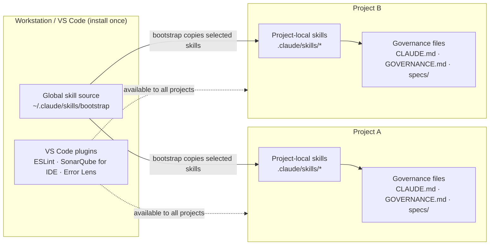

> 🇩🇪 [Deutsch](HANDBUCH.md) · 🇬🇧 **English** (this file)

---

# Governance for Vibe Coders — The Complete Handbook

> **Who is this handbook for?**
> You're a Vibe Coder — you have ideas, you use AI to build code, and you want to move fast.
> Governance sounds like bureaucracy. This handbook shows you why governance is actually your
> fastest tool — and how to set it up in 30 minutes.

---

## Table of Contents

1. [The Problem Without Governance](#1-the-problem-without-governance)
2. [What You Get](#2-what-you-get)
3. [Prerequisites and Preparation](#3-prerequisites-and-preparation)
4. [Installation — Step by Step](#4-installation--step-by-step)
5. [The Bootstrap Process](#5-the-bootstrap-process)
6. [The Skills — When Do I Use What?](#6-the-skills--when-do-i-use-what)
7. [The Artifacts — What Gets Created, Where, and Why](#7-the-artifacts--what-gets-created-where-and-why)
8. [The Guardrails — Your Safety Net](#8-the-guardrails--your-safety-net)
9. [VS Code Setup](#9-vs-code-setup)
10. [Tailoring Governance to Your Project](#10-tailoring-governance-to-your-project)
11. [Daily Usage — A Typical Workflow](#11-daily-usage--a-typical-workflow)
12. [FAQ](#12-faq) — incl. Claude Agent SDK migration

---

## 1. The Problem Without Governance

### What happens when you just start building

Imagine: you have a brilliant idea. You open Claude, say "build me X," and ten minutes later code is running. Brilliant.

Three weeks later:

- You can't remember why you made a particular decision
- You ask Claude about a bug — Claude doesn't know the context anymore
- You try to add a new feature and accidentally break something else
- You don't know which version of your project is "stable"
- You have 50 files, 3 half-finished features, and no plan

That's **not** an AI problem. That's a **missing-system** problem.

### The hidden truth about vibe coding

Vibe coding is powerful — but only if the AI understands **what you built** and **why**.
Without documentation and structure, every new session starts from zero.

**With governance** here's what happens:

- New session? Type `/status` — Claude sees everything instantly
- `/implement ISSUE-42` — Claude knows exactly what to do
- `/breakfix` — Claude diagnoses systematically
- Every change is traceable, every error has an audit trail

---

## 2. What You Get

### The Code-Crash Framework

A **complete operating system for AI-assisted software development**:

```
GitHub Repository (vibercoder79/claudecodeskills)
├── bootstrap/           ← Sets everything up automatically
├── ideation/            ← From idea to story
├── implement/           ← From story to code
├── backlog/             ← Sprint planning & priorities
├── architecture-review/ ← Is my system healthy?
├── research/            ← Deep research with AI
├── sprint-review/       ← Periodic quality check
├── security-architect/  ← Threat modeling + code review
├── grafana/             ← Dashboards via MCP
├── cloud-system-engineer/ ← VPS · Docker · firewall
├── visualize/           ← Architecture diagrams in Miro
├── skill-creator/       ← Build your own skills
└── design-md-generator/ ← Extract design systems
```

### What that means concretely

| Without governance | With governance |
|--------------------|------------------|
| Claude forgets between sessions | Claude always knows the system |
| "Build me X" → random output | `/ideation` → structured story → `/implement` |
| Bugs appear out of nowhere | Self-healing agent monitors 24/7 |
| No idea if version is stable | Every change is versioned + documented |
| Rollback? What rollback? | Git + changelog = rollback anytime |
| 3 weeks later: total chaos | Sprint review keeps everything clean |

---

## 3. Prerequisites and Preparation

### Software you need

**Required:**

| Software | Purpose | Download |
|----------|---------|----------|
| **Claude Code CLI** | The heart — AI in the terminal | `npm install -g @anthropic-ai/claude-code` ¹ |
| **Node.js** (v18+) | Runtime for Claude Code | nodejs.org |
| **Git** | Version control | git-scm.com |

**Recommended:**

| Software | Purpose |
|----------|---------|
| **Visual Studio Code** | Editor with Claude Code integration |
| **GitHub account** | Your code repository |

### Accounts you need

**Required:**

1. **Anthropic account** — for Claude Code
   - Go to: claude.ai
   - Register → choose plan (Pro is enough to start)
   - API key at: console.anthropic.com → API Keys

2. **GitHub account** — for your repository
   - github.com/signup
   - Free tier is enough at the start

**Recommended:**

3. **Linear account** — for issue tracking (backlog, stories)
   - linear.app
   - Free for small teams
   - Linear API key: linear.app → Settings → API → Personal API Keys

**Optional but valuable:**

4. **OpenRouter account** — for cheaper LLM calls
   - openrouter.ai
   - Top up credit (~$10 goes a long way)
   - API key at: openrouter.ai/keys

### API keys — overview

Before you start `/bootstrap`, have these keys ready:

| Key | Required? | From | Variable |
|-----|-----------|------|----------|
| Anthropic API Key | YES | console.anthropic.com | `ANTHROPIC_API_KEY` |
| GitHub SSH Key | YES | `ssh-keygen` + GitHub Settings | — |
| Linear API Key | Recommended | linear.app → Settings → API | `LINEAR_API_KEY` |
| OpenRouter Key | Optional | openrouter.ai/keys | `OPENROUTER_API_KEY` |
| Telegram Bot Token | Optional | @BotFather on Telegram | `TELEGRAM_BOT_TOKEN` |

> **Security rule:** API keys NEVER go into code. They go into `.env` (this file is in `.gitignore`
> and will not be uploaded to GitHub).

> ¹ **Note on the Claude package:** The CLI tool is still called `@anthropic-ai/claude-code`.
> The new `@anthropic-ai/claude-agent-sdk` (npm) / `claude-agent-sdk` (pip) is for programmatic
> SDK use in your own apps — not for the CLI. Details: [FAQ → Claude Agent SDK](#what-is-the-claude-agent-sdk--do-i-need-to-migrate)

### Setting up SSH for GitHub

SSH is the secure connection between your machine and GitHub. Set it up once, never think about it again.

```bash
# 1. Create SSH key (if none exists yet)
ssh-keygen -t ed25519 -C "your@email.com"
# → Just press Enter for every question

# 2. Show public key
cat ~/.ssh/id_ed25519.pub
# → Copy this text entirely

# 3. Register with GitHub
# github.com → Settings → SSH and GPG Keys → New SSH Key → paste

# 4. Test connection
ssh -T git@github.com
# → "Hi username! You've successfully authenticated." = success
```

---

## 4. Installation — Step by Step

### Step 1: Install Claude Code

```bash
# Check Node.js version (must be 18+)
node --version

# Install Claude Code
npm install -g @anthropic-ai/claude-code

# Verify it works
claude --version
```

### Step 2: Configure Claude Code

```bash
# Launch Claude Code — first run will prompt for the API key
claude

# Alternative: set API key as environment variable
export ANTHROPIC_API_KEY="your-api-key-here"
```

> **Tip:** Put the `export` command into `~/.bashrc` or `~/.zshrc` so it's active in every new terminal.

### Step 3: Get the Bootstrap skill

This is the **only manual step** — after this, Claude does everything automatically.

```bash
# Pull bootstrap skill from the GitHub repository (macOS/Linux — user home)
mkdir -p ~/.claude/skills
cd /tmp
git clone --filter=blob:none --sparse git@github.com:vibercoder79/claudecodeskills.git ki-skills
cd ki-skills
git sparse-checkout set code-crash-framework/bootstrap
cp -r code-crash-framework/bootstrap ~/.claude/skills/
cd /tmp && rm -rf ki-skills

# Verify the skill is there
ls ~/.claude/skills/bootstrap/
# → should show SKILL.md and a references/ folder
```

> **Why only the bootstrap skill?** In Phase 5, the bootstrap skill installs every other skill
> you need via `git clone` — no symlinks, fully local and portable.

### Step 4: Create a new project

```bash
# Create a directory for your new project
mkdir ~/my-project
cd ~/my-project

# Start Claude Code in the project directory
claude
```

### Step 5: Run bootstrap

In the Claude Code session:

```
/bootstrap
```

Claude walks you through four short interview blocks (A–D), then builds everything automatically. Total time: ~10 minutes.

---

## 5. The Bootstrap Process (v3.0)


*From empty folder to governance-ready project — four interview blocks (A–D) frame the decisions, four setup phases (0, 4, 5, 7) execute them. Block D spins up optional components only if you want them. ([Excalidraw source](bootstrap/docs/bootstrap-big-picture.en.excalidraw))*

### Overview

| Step | Type | Content |
|------|------|---------|
| **Phase 0** — Briefing | Announcement | Bootstrap tells you what's coming, you confirm |
| **Block A** — Project core | Interview (7 questions) | Stack, name, description, path, GitHub URL, backlog tool + prefix, version |
| **Block B** — Existing infrastructure | Interview (6 questions) | GitHub repo? Project documentation SSoT? Backlog tool? `.env`? runtime file? Developer handover? — integrates into what's already there |
| **Block C** — Doc architecture | Proposal + review | Project Hub, Developer Onboarding, Governance, Target Architecture, Backlog reference + 3-layer proposal |
| **Phase 4** — Base structure | Automatic (~2 min) | Files, Git init, linting, governance hooks, component skeletons |
| **Phase 5** — Install skills | Automatic | Skills pulled via `git clone` from `claudecodeskills` (no symlinks) |
| **Block D** — Optional components | Targeted questions at the end | Self-Healing / DocSync / Automation-Daemon / Learning-Loop / SonarQube / Research / Visualize / Monitoring |
| **Phase 7** — Finalization | Automatic | selected documentation SSoT, optional SecondBrain integration, global registry entry, final commit |

> **Why blocks instead of a 14-question batch?** Single questions are easier to answer, and each block builds on the previous one — your doc-architecture proposal in Block C already knows your stack (A.1) and existing infra (B).

### Block A — Project core (7 questions)

#### A.1: Stack question — first of all

```
What do you want to develop?

a) Node.js / JavaScript backend (API, CLI, daemon)
b) Frontend (React, Vue, Vanilla JS)
c) Full-stack (Node.js backend + frontend)
d) Python (AI/ML, scripts, FastAPI, Django)
e) Other / not clear yet
```

The answer determines linting/formatting setup:

| Your choice | Linter | Formatter | Auto-created |
|-------------|--------|-----------|--------------|
| Node.js | ESLint | — | `eslint.config.mjs` |
| Frontend | ESLint + Prettier | Prettier | `eslint.config.mjs` + `.prettierrc` |
| Full-stack | ESLint + Prettier | Prettier | `eslint.config.mjs` + `.prettierrc` |
| Python | Ruff | Black | `pyproject.toml` |

#### A.2–A.7: Project identity

| Question | Example | Why |
|----------|---------|-----|
| Project name | `MyShop` | Used everywhere |
| Short description | `E-commerce for handmade products` | Claude understands what you're building |
| Project path | `/home/user/my-project` | Where the code lives |
| Backlog tool | `linear` / `github-issues` / `none` | Drives issue-prefix use + daemon eligibility |
| Issue prefix | `SHOP` | Stories become SHOP-1, SHOP-2, … |
| Start version | `1.0.0` | Versioning from day 1 |

#### A.4: Architecture dimensions + add-ons

Bootstrap installs 8 **standard** architecture dimensions (Reliability, Data Integrity, Security, Performance, Observability, Maintainability, Testability, Scalability) and asks which of 4 **optional add-ons** to enable:

| Add-on | When it makes sense |
|--------|---------------------|
| **Privacy / GDPR** | You process personal data, GDPR applies |
| **Cost Efficiency** | Cloud bill is non-trivial, LLM calls are billed per token |
| **Signal Quality** | Trading, monitoring, anything driven by external signals |
| **Compliance** | Regulated industry (finance, health, public sector) |

**Standard vs. add-on:** Standard dimensions apply to **every** project — universal software properties safeguarded in any AI-assisted build. Add-ons are context-specific and only enabled if the project's domain calls for them.

Pick any combination — default is "none selected". Every active dimension becomes a section in `ARCHITECTURE_DESIGN.md §3 Quality Attributes` that `/ideation`, `/architecture-review` and `/sprint-review` will check.

### Block B — Existing infrastructure (6 questions)

Bootstrap integrates into what's already there instead of overwriting. It asks:

1. **GitHub repo already exists?** (URL or "create new")
2. **Where is the project documentation SSoT?** Obsidian Vault, repo `docs/project/`, external DMS such as Notion/Confluence/SharePoint, or undecided fallback
3. **Backlog tool configured?** (Linear project / GitHub issues / none)
4. **`.env` already present?** (keep keys or create template)
5. **Runtime instructions already present?** (`AGENTS.md`, `CLAUDE.md`, merge or create)
6. **Developer Onboarding?** create it as standard artifact or link an existing one

### Block C — Doc architecture

Before the layer proposal, Bootstrap operationalizes the selected documentation SSoT. Obsidian is the best-practice path for linked project knowledge, but the framework is not Obsidian-only:

| Option | Bootstrap creates or links |
|---|---|
| Obsidian Vault | project folder with Project/PMO Hub, Developer Onboarding, Governance, Target Architecture, Backlog, Decisions, Meetings, Research, Assets, Archive |
| Repo docs | `docs/project/` with the same standard artifacts |
| External DMS | local `docs/project/DOCUMENTATION_SSOT.md` pointer to Notion, Confluence, SharePoint or another system |
| Undecided | repo fallback under `docs/project/` plus TODO and postflight `WARN` |

Developer Onboarding is the handover artifact. Its purpose is that an unfamiliar team or another coding runtime can take over the project: Claude Code -> Codex, Cursor, GitHub Copilot, Google Antigravity, or a classic development team.

Based on your stack (A.1) and existing infra (Block B), bootstrap then presents a **3-layer doc architecture**:

| Layer | Lives in | Purpose |
|-------|----------|---------|
| **1. Story-Specs** | `specs/ISSUE-XX.md` | Per-story, mandatory for commit via `spec-gate.sh` |
| **2. Component-Docs** | `docs/components/*.md` or Obsidian `Components/*.md` | Living doc per component (voice, memory, frontend …) |
| **3. Architecture-Guidelines** | `Architektur-Vorgaben.md` | Consolidated stack decisions, cross-cutting rules |

**Hub:** `ARCHITECTURE_DESIGN.md` links to all three layers via **§9 auto-linking** — every new `*.md` under the doc folders gets auto-registered in the Hub. Optional `orphan-check.sh` hook blocks commits that add docs without Hub entry.

You can accept the proposal as-is, customize it, or opt out of individual layers.

### Phase 4: Base structure (automatic, ~2 min)

Claude creates files, initializes Git, sets up linting, installs governance hooks, and scaffolds component doc skeletons. See the [Artifact Map](#7-the-artifacts--what-gets-created-where-and-why) for a visual overview.

**`ARCHITECTURE_DESIGN.md §2` includes a mandatory KI-Architecture-Principles block (BOO-24, Schrader Ch. 4):** 4 principles (small modules, explicit interfaces, testability, observability) + 4 anti-patterns are anchored proactively at project setup — not discovered reactively in the first review. `/architecture-review` (BOO-7) checks all 8 items at every story. Reference: `code-crash-framework/references/ki-architektur-prinzipien.md`.

### Phase 5: Install skills (automatic)

Skills are pulled from the `vibercoder79/claudecodeskills` repository via `git clone` into `.claude/skills/` — **no symlinks, no runtime dependency on the source repo**. The skill copies are local and portable.

Important distinction: VS Code plugins are workstation infrastructure; skills are project infrastructure. You install ESLint, SonarQube for IDE, Error Lens, Python/Ruff, etc. once in VS Code. Bootstrap checks and documents their availability per project, but does not reinstall those plugins for every project. Skills are different: every bootstrapped project gets its own local `.claude/skills/` copy (and, for Codex adapters, optionally `.codex/skills/`). That copy is the project-pinned runtime state. If you bootstrap a second project, the selected skills are copied into that second project as well; this is intentional, not duplicate global installation.

If a project already has `.claude/skills/<skill>/`, treat Phase 5 as an update/merge decision: keep the pinned project copy, compare with the current master skill, and only update deliberately. Do not replace project-customized skills blindly.

```
Which skills to install?
a) Minimum (ideation, implement, backlog)       ← Ideal for the start
b) Standard (+ architecture-review, sprint-review, research, breakfix)  ← Recommended
c) Full (all skills)                            ← Full arsenal
d) Pick manually
```

### Block D — Optional components (at the end)

After the base project is set up, bootstrap asks targeted optional-component and provider-postflight questions:

| Component | What it does | Cost |
|-----------|--------------|------|
| **Self-Healing agent** | Cron check every 15 min: versions synced, files present, daemons running | Low |
| **DocSync to Obsidian** | Auto-mirror docs to your vault | None (if Obsidian exists) |
| **Automation daemon** | Linear webhook → auto-`/implement` on "In Progress" | Requires Linear + webhook endpoint |
| **Learning-Loop (L1/L2/L3)** | Framework gets smarter with every sprint — see next section | L1 free, L3 adds SQLite |
| **Research** | Framework, companion or global skill plus Perplexity/OpenRouter/MCP provider status | Provider-dependent |
| **Visualize/Miro** | Diagram skill plus Miro MCP verification or Excalidraw/Mermaid fallback | Miro-dependent |
| **Monitoring** | Central platform, project-owned setup or documented architecture question | Platform-dependent |

### Learning-Loop (L1/L2/L3)

A **portable feedback loop** that turns completed sprints into anti-pattern warnings for future stories. Three levels, pick one:

| Level | Storage | Write | Read |
|-------|---------|-------|------|
| **L1 — Simple** | `journal/learnings.md` (append-only markdown) | `/sprint-review` appends after every review | `/ideation` reads at story creation (warns on matching anti-patterns) |
| **L2 — Sprint-Journal** | `journal/sprint-YYYY-QN.md` (one file per sprint) | `/sprint-review` | `/ideation` + `/architecture-review` |
| **L3 — SQLite** | `.learning-loop/loop.db` (structured) | `/sprint-review` | `/ideation` + `/architecture-review` + `/backlog` (priority adjustment) |

**Why it matters:** Without the loop, every sprint starts from zero. With the loop, decisions that caused pain last sprint (wrong dependency, missed Acceptance Criterion, scope creep) show up as warnings *before* the next story gets created.

### Phase 7: Finalization

- **Documentation SSoT finalization** — bootstrap creates or links Project Hub, Developer Onboarding, Governance, Target Architecture, Backlog, Decisions, Meetings, Research, Assets and Archive in the selected SSoT
- **SecondBrain integration** — if Block B selected Obsidian, bootstrap creates a PMO hub under `02 Projekte/<ProjectName>/`
- **Global registry** — `~/.claude/MEMORY.md` gets a pointer to the new project
- **Final commit** — everything in one commit with a summary table

```
✓ Block A: Project core + stack + add-ons
✓ Block B: Existing infrastructure + documentation SSoT integrated
✓ Block C: Project Hub + Developer Onboarding + doc architecture
✓ Phase 4: Base structure (files, Git, linting, hooks, labels)
✓ Phase 5: Skills installed ({count})
✓ Block D: Optional components ({status})
✓ Phase 7: SecondBrain + Registry + Final-Commit

Your project is ready. Start with: /ideation
```

---

## 6. The Skills — When Do I Use What?

### Overview: the skill system

Skills are **repeatable workflows** that guide Claude through complex tasks. You invoke them
with `/skillname` and Claude follows a defined process.

```
Idea     → /ideation          → Story in Linear
Story    → /implement         → Code, tests, git push
Problem  → /breakfix          → Diagnosis, fix, prevention
Week     → /backlog           → What's next?
Quarter  → /sprint-review     → System health
Sprint   → /pitch             → Evidence briefing for stakeholders
Anytime  → /status            → What's happening right now?
```

The full 4P delivery pipeline (Schrader Code Crash Ch. 5) is wired as:

```
/intent → /ideation → /backlog → /implement → /architecture-review → /sprint-review → /pitch
\______/   \_____________________________/                                              \____/
Perceive   Prompt + Produce                                                              Pitch
```

See **Appendix L** for the full 4P-pipeline mapping and the `/pitch` evidence contract.

Every skill in this handbook has its own README with a visual overview:

| Skill | README + Sketch |
|-------|-----------------|
| bootstrap | [README](bootstrap/README.md) · [Sketch](bootstrap/docs/bootstrap-big-picture.en.png) |
| ideation | [README](ideation/README.md) · [Sketch](ideation/overview.en.png) |
| implement | [README](implement/README.md) · [Sketch](implement/overview.en.png) |
| backlog | [README](backlog/README.md) · [Sketch](backlog/overview.en.png) |
| architecture-review | [README](architecture-review/README.md) · [Sketch](architecture-review/overview.en.png) |
| sprint-review | [README](sprint-review/README.md) · [Sketch](sprint-review/overview.en.png) |
| pitch | [README](pitch/README.en.md) · [Sketch](pitch/pitch-overview.en.png) |
| research | [README](research/README.md) · [Sketch](research/overview.en.png) |
| security-architect | [README](security-architect/README.md) · [Sketch](security-architect/overview.en.png) |
| grafana | [README](grafana/README.md) · [Sketch](grafana/overview.en.png) |
| cloud-system-engineer | [README](cloud-system-engineer/README.md) · [Sketch](cloud-system-engineer/overview.en.png) |
| visualize | [README](visualize/README.md) · [Sketch](visualize/overview.en.png) |
| skill-creator | [README](skill-creator/README.md) · [Sketch](skill-creator/overview.en.png) |
| design-md-generator | [README](design-md-generator/README.md) · [Sketch](design-md-generator/overview.en.png) |

### `/ideation` — From idea to story


**When:** You have an idea for a new feature.

**What happens:**
1. You describe your idea in natural language
2. Claude researches (optional: deep research via Perplexity)
3. Claude checks whether the idea fits the architecture
4. Claude creates a structured user story in Linear

**Example:**
```
You: /ideation
Claude: "Describe your idea..."
You: "I want customers to be able to track their orders"

→ Claude creates SHOP-42 in Linear with:
   - What exactly gets built
   - Why (business value)
   - How (technical approach)
   - Acceptance criteria
   - Effort estimation
```

#### Pre-flight checks in `/ideation`

Before the actual ideation work starts, the skill runs two soft pre-flight checks. **Soft = the operator is asked; no hard block.** They prevent the most expensive failure mode: writing stories against an outdated picture of the system.

**Check 1 — environment loaded (step 0):** the skill reads `.claude/environment.json` to know which paths, tools and thresholds apply. If the file is missing, defaults are used and the skill warns once.

**Check 2 — architecture-doc freshness (step 0a, soft):** the skill compares the last modification date of `ARCHITECTURE_DESIGN.md` against `thresholds.architecture_doc_freshness_days` from `.claude/environment.json` (default `30`). When the doc is older than the threshold:

```
Warning: ARCHITECTURE_DESIGN.md has not been updated in 47 days
(threshold: 30 days).

Recommendation: run /architecture-review before writing new stories
against a possibly stale architecture.

Continue anyway? [yes/no]
```

On `no` the skill stops, the operator runs `/architecture-review`, then `/ideation` is restarted. On `yes` the override is documented in the resulting story under `Current State`.

**Why soft, not hard?** A hard block would gate every project that has been quiet for a while — but the doc is often "old enough to warn, still valid". The operator decides per story. The threshold lives in `.claude/environment.json` so each project can tune it: fast-moving systems set 14, stable systems 90.

**Configuration example** in `.claude/environment.json`:

```json
{
  "thresholds": {
    "architecture_doc_freshness_days": 14
  }
}
```

### `/implement` — From story to code


**When:** You want to implement a story.

**What happens (8-step protocol):**
1. Identify issue (load from Linear)
2. Dependency check (blockers resolved?)
3. Build context (CLAUDE.md, ARCHITECTURE_DESIGN.md)
3b. Governance validation (8-dimension table? Security section?)
3c. ⛔ **Spec-file gate** — hard gate (enforced by `spec-gate.sh`)
4. Plan + operator approval
5. Implementation (code, docs, commit + push)
6. Post-implement validation (ESLint, AC check, smoke test, security findings)
7. Backlog update
8. Result table + `specs/ISSUE-XX.md` summary

> **Important:** `/implement` NEVER changes code without your OK in step 4. You're always in control.

### `/backlog` — Sprint planning


**When:** You don't know what's most important next.

**What happens:**
1. Claude loads all open issues from Linear
2. Analyzes dependencies (what blocks what?)
3. Suggests a prioritized order
4. Schema-chain check: flags conflicts (two stories targeting same `schemaVersion`)
5. Shows hygiene suggestions (orphaned refs, obsolete issues)

### `/breakfix` — When something is broken

**When:** The system has a problem, a bug, or is acting weird.

**What happens (6-step process):**
1. **Detect:** What exactly is the problem?
2. **Diagnose:** Why is it happening?
3. **Fix:** Implement the solution
4. **Verify:** Is it truly fixed?
5. **Document:** Archive incident in `journal/incidents/`
6. **Prevent:** How do we prevent this in the future?

### `/architecture-review` — System health


**When:** Before a big decision. Periodically (monthly).

**What happens:** Claude checks the active dimensions of your system — 8 standard
(Reliability, Data Integrity, Security, Performance, Observability, Maintainability, Testability, Scalability)
plus any active add-ons (Privacy / GDPR, Cost Efficiency, Signal Quality, Compliance).

### `/research` — Deep research


**When:** You need facts for a technical decision.

**What happens:**
- Auto-routing: simple questions → WebSearch, complex → Perplexity (deeper AI analysis)
- Results are cross-checked
- Structured research report with sources + confidence rating

### `/sprint-review` — Quarterly audit


**When:** Every 4–6 weeks.

**What happens:**
- Tech debt analysis: what needs cleanup?
- Backlog hygiene: which issues are stale?
- Architecture check: has tech debt accumulated?
- Recommendations for the coming weeks

### `/security-architect` — Security by design


**When:** Automatically — during planning (DESIGN mode), code changes (REVIEW mode),
audits (AUDIT mode), and before installing external skills (SKILL-SCAN mode).

**Covers:** OWASP Top 10:2025 · STRIDE/DREAD · ASVS 5.0 · MITRE ATLAS · Agentic AI Security (ASI01–ASI10)

### `/pitch` — Evidence for stakeholder meetings


**When:** Before a stakeholder meeting, after `/sprint-review` has run.

**What happens:**
- 8 sources are aggregated read-only: L3 lessons DB, local implement reports, CI reports, sprint files, ARCHITECTURE_DESIGN.md, INTENT-XX.md, feature-flag state, git log
- Architecture diff since the previous pitch is computed
- Demo-path heuristic proposes the user journey that best demonstrates intent fulfillment
- Output: `pitch/PITCH-XX.md` with frontmatter (`metrics_snapshot`, `related_intents`, `demo_path`, `status`) + 5 body sections — committed, NOT gitignored

**Anti-Scope:** the skill generates NO slides, NO voiceover, NO outcome text, and NO demo video. Human builds the story and runs the live demo. Details in **Appendix L** (4P pipeline mapping).

### Other skills

- [`/grafana`](grafana/README.md) — dashboards via Grafana MCP
- [`/cloud-system-engineer`](cloud-system-engineer/README.md) — VPS, Docker, firewall, DNS
- [`/visualize`](visualize/README.md) — architecture diagrams in Miro
- [`/skill-creator`](skill-creator/README.md) — build your own skills
- [`/design-md-generator`](design-md-generator/README.md) — extract design systems to DESIGN.md
- [`/status`](bootstrap/README.md) — one-glance system status

---

## 7. The Artifacts — What Gets Created, Where, and Why

### What is an artifact?

An **artifact** is a file that the governance framework creates or expects — documentation,
checklists, hooks, specs, automation scripts, memory entries. Each artifact has a clear
purpose and is read or written by specific skills.

Most teams collect documentation ad-hoc. The Code-Crash Framework defines a fixed, minimal set of artifacts
that together give you traceable, reproducible, AI-friendly development.

### The 5 artifact groups


*The full artifact map: every governance file, hook, spec, and automation that bootstrap creates — grouped into 5 categories, with arrows showing which skill consumes which artifact. ([Excalidraw source](bootstrap/docs/artifact-map.en.excalidraw))*

#### Group A — Governance documentation

Rules · architecture · process · history.

| Artifact | Purpose | Written by | Read by |
|----------|---------|------------|---------|
| `CLAUDE.md` | Claude's identity + project rules | bootstrap + you | every skill (auto at session start) |
| `CONVENTIONS.md` | Project-local contract: governance mode, execution isolation, active gates | bootstrap + you | `/ideation`, `/implement`, `/architecture-review`, `/sprint-review`, tool adapters |
| `GOVERNANCE.md` | Process rules — when/why | bootstrap | every skill |
| `SYSTEM_ARCHITECTURE.md` | Overview of components, data flow | bootstrap + `/implement` | every skill |
| `ARCHITECTURE_DESIGN.md` | Lead document — all ADRs, 8 sections | bootstrap + `/ideation` | `/implement`, `/architecture-review`, `/sprint-review` |
| `INDEX.md` | File index | bootstrap + `/implement` | every skill |
| `COMPONENT_INVENTORY.md` | Component inventory | bootstrap + `/implement` | self-healing (Check U) |
| `DEVELOPMENT_PROCESS.md` | Process reference | bootstrap | reference |
| `SECURITY.md` | Security policy | bootstrap + `/security-architect` | `/implement`, `/sprint-review` |
| `CHANGELOG.md` | What changed when | `/implement` (auto) | every skill |
| `API_INVENTORY.md` | All external APIs | `/implement` | `/security-architect` (AUDIT) |
| `journal/STRATEGY_LOG.md` | Strategy decisions | you + `/ideation` | `/ideation` (mandatory read before story creation) |
| `journal/LEARNINGS.md` | Outcome tracking | `/implement` (after issue-close) | `/sprint-review` |
| `lib/config.js` | Single source of truth: VERSION + DOC_FILES | bootstrap | self-healing, doc-version-sync |

### Security Documentation Model

Security in the Code-Crash Framework is not a single checklist. It is a linked documentation model:

*Sketch: the security workflow shows how `ARCHITECTURE_DESIGN.md`, `SECURITY.md`, sub-artifacts, skill gates and the learning loop reinforce each other. ([Excalidraw source](docs/security-workflow.en.excalidraw))*

| Layer | Artifact | Role |
|---|---|---|
| Lead architecture contract | `ARCHITECTURE_DESIGN.md` | Names Security as a quality dimension, records security/privacy boundaries, and links to the security contract. |
| Operational security contract | `SECURITY.md` | Defines the security principle, secrets policy, change-type matrix, validation evidence, sensitive paths, and incident notes. |
| Security sub-artifacts | `API_INVENTORY.md`, `.semgrep.yml`, `.codex/hooks.json`, `.claude/sensitive-paths.json`, `.codex/sensitive-paths.json`, threat models, privacy/compliance docs | Hold concrete evidence, provider/API details, technical gates, and human-review rules. |

The flow is deliberate: `/ideation` writes `Security Impact` and, when relevant, `Security Validation` into the story. `/implement` reads `ARCHITECTURE_DESIGN.md`, `SECURITY.md`, and the matching sub-artifacts before changing code. `/security-architect` adds threat models, policies, or reviews for risky changes. `/architecture-review` checks whether security remains consistent with the architecture target state. `/sprint-review` looks for security debt, open findings, and recurring patterns.

This makes Security by Design operational: plan the security impact, implement against the contract, validate with gates, update the affected artifacts, and feed repeated findings back into the learning loop.

#### Group B — Checklists + guardrails

Machine-enforced rules and reference lists.

| Artifact | Purpose | Enforcement |
|----------|---------|-------------|
| `.claude/hooks/spec-gate.sh` | Blocks `git commit ISSUE-XX` without `specs/ISSUE-XX.md` | **HARD GATE** (PreToolUse hook) |
| `.claude/hooks/doc-version-sync.sh` | Blocks `git push` on VERSION drift between DOC_FILES | **HARD GATE** (PreToolUse hook) |
| `.claude/hooks/guard.sh` | Blocks access to `.env` and key files | Soft guard |
| `.claude/hooks/format.sh` | Auto-formats on Edit/Write (Biome/Black) | Passive |
| `.claude/settings.json` | Hook registration + permissions | Config |
| `eslint.config.mjs` / `.prettierrc` / `pyproject.toml` | Linting config (stack-dependent) | Passive + `/implement` step 6a |
| `.claude/ISSUE_WRITING_GUIDELINES.md` | Issue format rules | Reference |
| `architecture-review/references/dimensions-detail.md` | The 8 standard + 4 add-on dimensions | Reference for `/ideation`, `/architecture-review`, `/sprint-review` |
| `implement/references/change-checklist.md` | Per-change validation | Reference for `/implement` step 6 |
| `security-architect/references/owasp-checklist.md` | OWASP Top 10:2025 + ASVS 5.0 | Reference for `/security-architect` |

#### Group C — Specs + traceability

The path Idea → Backlog Record / adapter issue → Spec → Commit → Changelog.

| Artifact | Purpose | Anatomy |
|----------|---------|---------|
| `specs/TEMPLATE.md` | Template for new specs | Why · What · Constraints · Current State · Tasks (T1, T2…) |
| `specs/ISSUE-XX.md` | One spec per story (mandatory before commit) | Filled from TEMPLATE + `## Summary` filled by `/implement` step 8 |
| Backlog Records / adapter issues | Story tracking in Linear, GitHub Issues, Jira, Planner, Azure DevOps, or Markdown | **5 required sections (Governance v2):** Schrader Prompt Components (Insight · Constraints · Success Criteria · Desired Outcome) + Definition of Done + Execution Mode. See `bootstrap/references/issue-writing-guidelines-template.md` |
| Git Commits | Format: `T1: ISSUE-XX — description` | Gated by spec-gate.sh |
| Obsidian Vault | Change logs + project memory | Auto-synced by `doc-sync.js` |

#### Group D — Self-healing + automation

Runtime agents — no ops team needed.

| Artifact | Purpose | Cadence |
|----------|---------|---------|
| `agents/self-healing.js` | Check M (versions) · U (files) · P (processes) + Telegram alert | Cron, every 15 min |
| `lib/doc-sync.js` | Sync to Obsidian vault | On demand + cron |
| `.env` / `.env.example` | Secrets + API keys (gitignored) | Manual |
| `agents/linear-automation-daemon.js` | Webhook-driven auto-implement | Optional |

#### Group E — Skill system

Skills consume artifacts from A–D.

| Artifact | Purpose |
|----------|---------|
| `~/.claude/skills/*` | Global skill source / operator registry |
| `.claude/skills/*` | Project-local skill copies, pinned and portable |
| `~/.claude/projects/-root/memory/MEMORY.md` | Global memory |
| `~/.claude/projects/-root/memory/project_{slug}_init.md` | Project-specific memory |

#### Group F — Environment manifest (BOO-34)

| Artifact | Purpose |
|----------|---------|
| `.claude/environment.json` | Single source of truth for environment (mac/vps/ci), available tooling and default paths |
| `.claude/generate-environment-json.sh` | Bash generator (BSD- and Linux-compatible, no deps) |

##### Coding environments — mac vs. VPS vs. CI

Same governance code base, three very different execution contexts. Skills behave slightly differently depending on `environment`:

- **`mac`** — operator's workstation. Interactive sessions, IDE integrations available (SonarLint plugin, ESLint extension), `brew` for tool installs. `tools_available.sonarqube_ide_plugin` may be `true` if the operator has it installed.
- **`vps`** — server (e.g. Hostinger srv1443320). No IDE plugins, `apt`/`pip` for installs, runs in a tmux/screen, results land in `journal/reports/local/`. `sonarqube_ide_plugin` is always `false`. Operator drives via SSH.
- **`ci`** — GitHub Actions / GitLab CI runner. Detected via env var `$CI` regardless of value. Reports are written to `journal/reports/ci/`, lessons-learned writes are SKIPPED to keep CI ephemeral. CI check happens FIRST in detection, because a CI runner can be Linux OR mac.

Skills read the file in a step-0 lookup. Quick reads with `grep`/`sed` are fine; for richer queries `jq` is convenient (optional install — `brew install jq` on mac, `apt install jq` on VPS):

```bash
# Without jq (always works)
HAS_SEMGREP=$(grep '"semgrep"' .claude/environment.json | grep -oE 'true|false')

# With jq (richer queries)
ENV=$(jq -r .environment .claude/environment.json)
TESTS=$(jq -r .tools_available.tests .claude/environment.json)
REPORTS=$(jq -r .paths.reports_local .claude/environment.json)
```

Regenerate after tooling changes: `bash .claude/generate-environment-json.sh --force`. The file is committed; `metadata.created_at` is the audit trail.

#### Group G — Observability skeleton (BOO-14)

| Artifact | Purpose |
|----------|---------|
| `observability.md` | Central observability skeleton (project root) — three required sections: logging schema, metrics endpoint, alert rules |
| `observability/alerts/<service>.yml` | Per-service Prometheus alert rules — required alerts: `{service}_down`, `{service}_error_rate_high` (>5%), `{service}_p95_slow` (p95 >1s) |
| `observability/.env.observability` | Routing config (Telegram / Slack / email webhooks) — **gitignored**, only `.env.observability.example` committed |

##### Three pillars of observability

Schrader Code Crash chap. 3 §Production Readiness §Observability + chap. 4 §Run the System (pillar 3 observability): "deploy without observability and you fly blind." Bootstrap installs the scaffolding from day 0; the operator fills service-specific content per block C component.

- **Logging schema** — structured JSON with the fields `timestamp`, `level`, `service`, `trace_id`, `message`, `context`. Stack defaults: Node.js → `pino`, Python → `structlog`.
- **Metrics endpoint** — `/metrics` in Prometheus format per service, port convention `9090+N` (auth=9091, api=9092, db=9093, ...). Stack defaults: Node.js → `prom-client`, Python → `prometheus_client`.
- **Alert rules** — three required alerts per service: `{service}_down` (`up == 0` for >2 min, severity critical), `{service}_error_rate_high` (errors/requests >5% for 5 min, severity warning), `{service}_p95_slow` (p95(request_duration_seconds) >1s for 5 min, severity warning). Validate locally with `promtool check rules observability/alerts/*.yml`.

Existing projects: `bash <skill-repo>/bootstrap/scripts/migrate-to-v2.sh --issue BOO-14` scaffolds the three files idempotently. Operator steps for service population: see `bootstrap/references/migration-checklist-v1-to-v2.en.md §BOO-14`.

#### Group H — Reliability skeleton (BOO-25)

| Artifact | Purpose |
|----------|---------|
| `lib/idempotency.{js,py}` | Idempotency middleware (Redis-backed) — required header `Idempotency-Key`, behaviour: same key + same body → cached response, same key + diverging body → HTTP 422 |
| `lib/retry.{js,py}` | Retry helper with exponential backoff + jitter — defaults: maxRetries=3, baseDelay=200ms, factor=2; **no retry on 4xx**, no retry on 422 idempotency conflicts |
| `lib/circuit-breaker.{js,py}` | Circuit breaker wrapper — defaults: errorThresholdPercentage=50, resetTimeout=30s, volumeThreshold=10; one breaker per external dependency (DB, auth, external API, message bus) |
| `docs/SLO.md` | Service-Level Objectives skeleton — availability target, quarterly error-budget table, at least 3 SLIs sourced from the BOO-14 metrics endpoint, review cadence in `/sprint-review` |

##### The five pillars of reliability

Schrader Code Crash chap. 4 §Run the System (pillar 6 reliability): "if there is no error budget, you do not know when to stop." Bootstrap installs the four scaffolds from day 0; the operator decides per service which pillars are active and wires the middleware/wrappers into the entry points.

- **Idempotency** — duplicate writes with the same `Idempotency-Key` return the cached response; diverging bodies for the same key return HTTP 422. Cache backend: Redis (`REDIS_URL`).
- **Retry + backoff** — exponential backoff with jitter for transient downstream failures. Status filter: only 5xx and network errors are retried; 4xx and idempotency conflicts (422) are not.
- **Circuit breaker** — per-dependency breaker that opens after the error-rate threshold is exceeded, blocks calls for `resetTimeout`, then half-opens to probe recovery. Thresholds tuned per dependency.
- **Graceful degradation** — explicit fallback paths when a downstream is open or slow (cached read, queue-and-forget, feature flag off). Documented per service in the reliability section.
- **SLO + error budget** — availability target (e.g. 99.9%), quarterly error budget, ≥3 SLIs (`error_rate`, `p95_latency`, `availability`) measured against the BOO-14 metrics endpoint. Reviewed every sprint review; budget exhaustion triggers a stop-ship.

Existing projects: `bash <skill-repo>/bootstrap/scripts/migrate-to-v2.sh --issue BOO-25` scaffolds the four files idempotently (stack-detected via `package.json` / `pyproject.toml` / `requirements.txt`). Operator steps for activation: see `bootstrap/references/migration-checklist-v1-to-v2.en.md §BOO-25`. Cross-link: `architecture-review/references/dimensions-detail.en.md` §1.1-§1.5 covers each pillar in detail.

#### Group I — Implement-run local reports (BOO-36)

`/implement` step 6 persists raw tool outputs alongside the declarative iteration. The directory is **gitignored** — `/sprint-review` aggregates these reports later into `journal/sprint-{date}.md`.

| Artifact | Purpose | Written by | Read by |
|----------|---------|------------|---------|
| `journal/reports/local/{YYYY-MM-DD_HHMM}_{STORY-ID}/eslint-iter{N}.sarif` | ESLint SARIF per iteration (fallback `.json`) | `/implement` step 6a | `/sprint-review` |
| `journal/reports/local/{YYYY-MM-DD_HHMM}_{STORY-ID}/tests-iter{N}.junit.xml` | JUnit XML per test iteration | `/implement` step 6a-quart | `/sprint-review` |
| `journal/reports/local/{YYYY-MM-DD_HHMM}_{STORY-ID}/coverage-final.json` | Coverage end state (c8 / pytest-cov) | `/implement` step 6a-quart | `/sprint-review` |
| `journal/reports/local/{YYYY-MM-DD_HHMM}_{STORY-ID}/semgrep-final.sarif` | Semgrep SARIF end state | `/implement` step 6a-bis | `/sprint-review` |
| `journal/reports/local/{YYYY-MM-DD_HHMM}_{STORY-ID}/meta.json` | Run metadata (schema below) | `/implement` step 6f-bis | `/sprint-review` |

##### meta.json schema

```json
{
  "story_id": "BOO-15",
  "started_at": "2026-04-27T14:30:00Z",
  "completed_at": "2026-04-27T14:34:00Z",
  "iterations": {
    "eslint": 3,
    "tests": 2,
    "semgrep": 1,
    "coverage": 1
  },
  "final_status": "passed",
  "environment": "mac"
}
```

Field convention:
- `story_id` — Backlog Record / adapter issue key
- `started_at` / `completed_at` — ISO-8601 UTC
- `iterations.<gate>` — number of iterations per gate, 0 if the gate was skipped
- `final_status` — `passed` | `failed` | `stopped_iteration_limit`
- `environment` — `mac` | `vps` | `ci` | `unknown` (mirrored from `.claude/environment.json`)

##### Responsibility separation

| Who | Writes | Reads |
|-----|--------|-------|
| `/implement` | `journal/reports/local/` (raw outputs + meta.json) | nothing |
| `/sprint-review` (first phase) | `journal/sprint-{date}.md` (aggregated) | `journal/reports/local/` + `journal/reports/ci/` |
| `/sprint-review` (second phase) | `journal/learnings.db` (parsed L2) | nothing |

The separation is hard: implement persists, sprint-review aggregates. `/implement` does **not** write directly into the L3 learnings DB. This keeps implement fast (no DB lock, no schema knowledge) and gives sprint-review a single-writer role for the learnings DB.

### How to read an artifact — anatomy example: `specs/ISSUE-XX.md`

Every spec file follows the same structure:

```markdown
# SHOP-42 — Order tracking

## Why
Customers frequently ask "where is my order?" via email. Adding a tracking page
reduces support load and improves UX.

## What
- Deliverable: `/orders/:id/track` page with live status
- Done when: customer sees status + timestamps + carrier link

## Constraints
- MUST: reuse existing order DB schema
- MUST NOT: add new external API without approval
- Out of scope: email notifications (separate story)

## Current State
- `src/routes/orders.js` — currently handles list/detail views
- `lib/order-db.js` — schema v12

## Tasks
- T1: Add `/orders/:id/track` route (files: src/routes/orders.js) — verify by visiting /orders/1/track
- T2: Add tracking status component (files: components/OrderTracking.jsx) — verify by Storybook
- T3: Wire carrier API (files: lib/carrier-api.js, .env.example) — verify by mock response

## Summary
(filled after implementation by /implement step 8 — 3 paragraphs, plain language)
```

This structure is not negotiable — the spec-gate hook enforces the file's existence, and
`/implement` step 3c validates its shape before the plan phase begins.

### Which skill writes/reads which artifact?

The [Artifact Map](bootstrap/docs/artifact-map.en.png) above shows the full matrix visually.
Quick summary:

- **`/ideation`** writes: Backlog Record / adapter issue, ADD section, spec placeholder. Reads: ARCHITECTURE_DESIGN.md, STRATEGY_LOG.md
- **`/implement`** writes: code, specs/ISSUE-XX.md (summary), CHANGELOG.md, LEARNINGS.md. Reads: spec, ARCHITECTURE_DESIGN.md, change-checklist
- **`/architecture-review`** reads: ALL group-A docs + ADD + all ADRs. Writes: review report
- **`/sprint-review`** reads: ALL group-A docs + LEARNINGS.md + Git log. Writes: audit report
- **`/security-architect`** writes: SECURITY.md updates, threat models. Reads: OWASP checklist, STRIDE refs

### The golden rule

> **Every artifact has one purpose. Every skill consumes or writes specific artifacts.
> No skill writes into an artifact it doesn't own. No artifact is duplicated.**

This is the whole framework in one sentence.

---

## 8. The Guardrails — Your Safety Net

### What are guardrails?

Guardrails are **automatic safety mechanisms** that prevent you from accidentally doing
things you'll regret. Not punishment — your parachute.

### Guardrail 1: Spec-gate (Git hook)

**Problem:** You change code without knowing why — and in 3 weeks you won't remember.

**Solution:** Before you can commit code tied to an issue, a spec file (`specs/SHOP-42.md`)
must exist that explains **what** and **why**.

```bash
git commit -m "SHOP-42: Add order tracking"
# → Without specs/SHOP-42.md: BLOCKED
# → With specs/SHOP-42.md: allowed

# ⛔ spec-gate: specs/SHOP-42.md missing!
#    Create specs/SHOP-42.md from specs/TEMPLATE.md first
#    Bypass: git commit --no-verify (only if you're consciously skipping)
```

**Bypass available?** Yes: `--no-verify`. But you consciously know you're breaking the rule.

### Guardrail 2: Doc-version-sync (Git hook)

**Problem:** You bump the version in `config.js` but forget 5 documentation files.

**Solution:** When `config.js` is staged with a new version, the hook automatically checks
whether all docs are on the same version.

```bash
git commit -m "v1.4.0 - new features"
# → config.js: VERSION = '1.4.0'
# → SYSTEM_ARCHITECTURE.md: Version: 1.3.2 → BLOCKED

# ⛔ doc-version-sync: SYSTEM_ARCHITECTURE.md still at v1.3.2!
#    Please update to v1.4.0
```

### Guardrail 3: Self-healing agent

An agent that checks every 15 minutes in the background:

| Check | What's checked |
|-------|-----------------|
| Signal freshness | Is all data current? |
| Doc sync | Are all doc versions in sync? |
| Architecture guard | Are core rules respected? |
| API health | Are all external APIs reachable? |
| Security events | Was there suspicious activity? |

On problems: Telegram alert (if set up) or log entry in `journal/`.

### Guardrail 4: Spec-driven development

The simplest yet most powerful rule:

```
NEVER change code without a Backlog Record or adapter issue
NEVER commit code without a spec file (specs/ISSUE-ID.md)
NEVER bypass the operator (= you) — always show, then act
```

Sounds like extra work. In practice, a spec file takes 2 minutes — and prevents hours of
debug work because you know what you built and why.

### Guardrail 5: Operator in the loop

On `/implement`: **step 4 is always a pause point.** Claude shows you the plan, you say OK,
then code is written.

You can never accidentally deploy something you haven't seen.

---

## 8b. Anti-Patterns at Program Level — Schrader Ch. 7

In ch. 7 "Risks and Anti-Patterns" Schrader describes 11 patterns that emerge when AI-assisted development scales poorly. The technical anti-patterns are operationalised in the skill gates (BOO-3 through BOO-19). The organisational anti-patterns are not automatically detectable — they require human reflection.

This section documents the four cultural/organisational APs that no skill can cover.

### AP6: Experience Debt

When features ship without sufficient UX/design review. AI accelerates this: working software emerges in minutes — without the natural brake that previously forced time for design work.

**How you spot it:** Users regularly ask "how do I do that again?" even though they know the product. Support volume rises for questions that an intuitive product would never trigger. Features exist, but users don't find them.

**Countermeasures:**
- Make experience debt visible: count contradictory interaction patterns
- Design check as a gate on the running candidate, not on the mockup
- 15% budget for UX consolidation (analogous to the 15% rule for technical debt)
- Feedback loops with real users: measure HOW features are used

> "A product that is technically clean and offers a poor experience loses against a product that is technically questionable but feels right. Experience is not an add-on — it is the product." — Schrader

### AP7: Diffused Responsibility

Nobody feels responsible for AI-generated code. The AI generated it, the developer reviewed it, the tester tested it — when something breaks, the implicit answer is: "The AI did it that way."

**How you spot it:** When problems occur, the search is for culprits instead of root causes. Retrospectives end without clear accountabilities. Product owners say "that was technical, not my responsibility."

**Clear accountability rules:**
1. Whoever formulates the intent owns it
2. Whoever triggers code generation owns the code — "the AI did it that way" is not an excuse
3. Whoever reviews shares responsibility for quality
4. Every team member is personally responsible for the outcome

These rules must be **explicitly documented and lived** — not merely assumed.

### AP9: Individual-First as Isolation

"Everyone now works independently with AI!" The team dissolves into individuals. Result: silos, duplicated work, contradictory architecture.

**How you spot it:** The same problem is solved by different people in different ways. Architecture decisions contradict each other. Onboarding new talent takes longer instead of shorter.

**Countermeasures:**
1. **Time-shifted architecture reviews:** weekly team reviews of architecture decisions
2. **Shared code ownership:** every module is known to at least two people
3. **Documentation as core work:** not optional, not "later"
4. **Regular internal demos:** not for customers — for the team itself

> "Individual + AI is the atomic unit. But atoms need molecules to form matter." — Schrader

### AP11: The Political Saboteurs

The hardest anti-patterns emerge not from incompetence but from calculation. Three types:

**The envy saboteur:** Someone whose status is threatened by AI productivity gains. Reaction: subtle sabotage — code reviews that take too long, standards that suddenly become non-negotiable, scepticism dressed up as constructive critique.

**The power player:** A department that loses influence through the transformation. Reaction: strategic concerns raised in steering committees, pilots are pulled into their own area and starved.

**The fear blocker:** A technically brilliant employee who blocks out of self-protection. Reaction: introduce excessive complexity, declare every simplification a security risk.

**The radar:** Recognise the pattern, do not evaluate single actions in isolation. Follow the budget and the influence — who loses through the transformation? Those are the risk zones. Address constructively before it turns destructive.

---

**Full catalogue of all 11 APs** (including the technical ones with skill coverage): `code-crash-framework/references/anti-pattern-katalog.en.md`

**Automatic sprint diagnostic:** `/sprint-review` step 7 asks one diagnostic question per AP and recommends actions on hits.

**Reference:** Schrader "Code Crash" (2026), ch. 7 "Risks and Anti-Patterns", lines 3626ff.

---

## 8c. Production Readiness — Schrader Reference

In ch. 3 §Production Readiness and ch. 4 §Run the System, Schrader covers the requirements for AI-assisted code that ships to production. We have folded those points into the existing skills and gates — not 1:1, but adapted to our pipeline.

**What we deliberately did NOT take over 1:1:**

- **Intent propagation three-stage instead of binary:** Schrader frames intent as one handover point; we anchor it in three places — gate in `/ideation` (story intake), weighting in `/backlog` (prioritisation), measure-loop in `/implement` (verification after the build).
- **4P pipeline (Perceive/Prompt/Produce/Pitch)** not as a rename: We keep our existing phases (Intent → Ideation → Implement → Review) and map 4P conceptually without re-labelling the pipeline. Reason: stability of skill names across versions.

### Mapping table

| Schrader topic | Chapter / page | Our governance equivalent | Where anchored in the skill | Linear issue |
| -- | -- | -- | -- | -- |
| Intent before Implementation | Ch. 4 p. 82ff | `/intent` skill | `~/.claude/skills/intent/` | BOO-1 |
| Intent propagation | Ch. 4 p. 130ff | Gate in `/ideation`, weighting in `/backlog`, measure-loop in `/implement` | 3 skills | BOO-10 |
| AI-suitable architecture | Ch. 4 p. 105ff | AI-suitability checklist in `/architecture-review` | `architecture-review/SKILL.md` | BOO-7 |
| Run the System — Security | Ch. 4 p. 98 | Two-stage SAST (Semgrep + SonarQube) | `/bootstrap`, `/implement` step 6a | BOO-3/4/5/6 |
| Run the System — Testability | Ch. 4 p. 100 | Testability as its own dimension + coverage gate | `architecture-dimensions/testability.md`, `/implement` 6a | BOO-8, BOO-15 |
| Run the System — Observability | Ch. 4 p. 102 | Observability as its own dimension + mandatory skeleton | `architecture-dimensions/observability.md`, `/bootstrap` phase 4 | BOO-8, BOO-14 |
| Run the System — Scalability | Ch. 3 p. 66 | Scalability as its own dimension (4 invariants) | `architecture-dimensions/scalability.md`, `/architecture-review` | BOO-13 |
| Run the System — Performance | Ch. 3 p. 66 | Performance-baseline gate | `/implement`, CI workflow `perf.yml` | BOO-16 |
| Production-readiness gates | Ch. 3 p. 66 | ESLint + Semgrep + SonarQube + Coverage + Performance + Human Review | `/implement` step 6 | BOO-3/4/5/6, 15, 16, 18 |
| Hallucination check | Ch. 3 p. 66 | Dependency + existence check | `/implement` step 6a | BOO-12 |
| Feature flags for AI code | Ch. 3 p. 68ff | Rollout convention in the spec template | `spec-gate.sh`, spec template | BOO-17 |
| Mandatory human review | Ch. 3 p. 68ff | `sensitive-paths.json` + review gate | `/implement` step 5.5 | BOO-18 |
| Audit trails | Ch. 3 p. 68ff | Session-log linkage in the spec + `audit-trace.sh` | `/implement`, `scripts/audit-trace.sh` | BOO-19 |
| 4P pipeline (Perceive/Prompt/Produce/Pitch) | Ch. 5 p. 135ff | NOT adopted 1:1, mapped onto the existing pipeline | — | Meeting minute 2026-04-22 §EP4 |

> The dimension paths in column 4 (`architecture-dimensions/testability.md` etc.) reference the logical anchoring inside the skill architecture. The fully written-out dimension details actually live consolidated under `code-crash-framework/architecture-review/references/dimensions-detail.en.md`.

---

## 8d. Coding Environments — Mac / VPS / CI

The toolchain runs differently in four environments. **Key point:** no quality penalty for coding on the VPS — the gates are the same (ESLint, Semgrep, coverage, performance). What differs is the tooling list. IDE-specific plugins (Error Lens, SonarQube for IDE) only exist on the Mac in VS Code; on the VPS you work with the CLI variants. SonarQube Cloud runs server-side and is independent of the coding environment — the server analyses after every CI run.

| Tool | Mac (VS Code) | Mac (Terminal) | VPS via SSH | GitHub Actions |
| -- | -- | -- | -- | -- |
| Error Lens | ✓ Plugin | ✗ | ✗ | ✗ |
| ESLint VS Code plugin | ✓ Plugin | ✗ | ✗ | ✗ |
| ESLint CLI (`npx eslint`) | ✓ via npm | ✓ | ✓ (npm) | ✓ (Action) |
| SonarQube for IDE | ✓ Plugin | ✗ | ✗ | ✗ |
| SonarQube Cloud | n/a | n/a | n/a | ✓ (server-side) |
| Semgrep CLI | ✓ | ✓ | ✓ | ✓ (Action) |
| Tests (Vitest/pytest) | ✓ via npm | ✓ | ✓ | ✓ |

Rule of thumb: when you work on the VPS via SSH, do not expect inline hints in the editor — you run the CLIs explicitly (`npx eslint .`, `semgrep --config auto .`, `npm test`). The gates fire in CI anyway when something slips through.


*Defense in depth across three layers: IDE plugins for real-time feedback while typing, CLI tools as a hard pre-commit block, GitHub Actions as the merge gate after push. The earlier a defect is caught, the cheaper the fix. ([Excalidraw source](docs/quality-gate-three-layers.en.excalidraw))*

> **Note on the sketch caption:** The Excalidraw still shows BOO-28 as "planned". As of v3.17.0 (2026-05-12) BOO-28 is done — `migrate_boo_28()` drops `.github/workflows/eslint.yml` (Node stacks) or `.github/workflows/ruff.yml` (Python stacks) with mandatory SARIF output to `.ci-reports/` (prepares BOO-32 Hermes consumption). The PNG re-render is out of scope for this task.

**CI layer (Layer 3) — GitHub Actions:** Bootstrap drops the following workflow files stack-dependent into `.github/workflows/` — all three write SARIF to `.ci-reports/` and upload it via `github/codeql-action/upload-sarif@v3` into the GitHub Security tab.

| Workflow | Trigger | Tool | Stack | Source (BOO) |
|----------|---------|------|-------|--------------|
| `eslint.yml` | push + pull_request | ESLint (lint) | Node / JS / TS | BOO-28 |
| `ruff.yml` | push + pull_request | Ruff (lint) | Python | BOO-28 |
| `semgrep.yml` | push + pull_request on main | Semgrep (SAST) | all | BOO-4 |
| `perf.yml` | pull_request on main | autocannon / pytest-benchmark | all | BOO-16 |
| `sonar.yml` | push on main | SonarQube Cloud | all | BOO-5 |

Required status checks `ESLint`, `Ruff`, `Semgrep`, `SonarCloud` are activated via `gh api ... branches/main/protection` (BOO-29) — without a green run, no merge.

### Branch-protection setup (BOO-29)

Since v3.18.0 (2026-05-12), `/bootstrap` configures the `main` branch protection automatically in **phase 4.4k** — right after the first `git push -u origin main` (phase 4.9). The logic lives in `code-crash-framework/bootstrap/scripts/setup-branch-protection.sh`. Three points matter:

1. **Dynamic required status checks.** The script reads every workflow file under `.github/workflows/*.yml` and extracts the first `name:` field per file — that is the GitHub Actions context name. From this list it builds `required_status_checks[contexts][]`. Workflows that are missing in a given stack (e.g. `ruff.yml` in a pure Node project) are simply omitted — no hard fail.

2. **Prerequisites are checked.** Before the `gh api` call, the script verifies: `gh --version` (CLI installed?), `gh auth status` (logged in with `repo` scope?), `git remote get-url origin` (remote present?), and `gh api repos/<owner>/<repo>/branches/main` (does the remote main branch exist?). On any failure the script aborts with a clear operator message — no silent acceptance.

3. **Idempotence.** The `gh api -X PUT` call is a replace, not an append — repeated runs overwrite the protection identically. The same code path is used for existing projects (`migrate_boo_29()` in `migrate-to-v2.sh`) — one single source of truth.

The protection block as configured (1:1 from BOO-29):

```bash
gh api -X PUT "repos/${OWNER}/${REPO}/branches/main/protection" \
  -F required_status_checks[strict]=true \
  -F required_status_checks[contexts][]=<dynamic> \
  -F enforce_admins=false \
  -F required_pull_request_reviews[dismiss_stale_reviews]=true \
  -F required_pull_request_reviews[required_approving_review_count]=1 \
  -F restrictions=null \
  -F allow_force_pushes=false
```

`enforce_admins=false` is intentional — the operator (typically an admin) is allowed to push directly to `main` in emergencies. `allow_force_pushes=false` protects the git history from accidental overwrites. `dismiss_stale_reviews=true` forces every push after a review to a fresh approval round — keeping the code-review trail current.

---

## 8g. Linear setup per project (BOO-30)

The Linear team that backs a project (`B.4 == Linear`) needs two pieces of configuration beyond the default to make the issue lifecycle drive itself: a **six-state workflow** and the **GitHub integration**. Both are one-off operator tasks per project — the Linear API could automate them, but the effort/benefit ratio is poor (one-time setup, well-guided UI). This is a deliberate trade-off documented here so the operator knows exactly what is manual and what is not.

**Clear separation manual vs. automated:**
- **Manual per project (operator):** create the six workflow states + connect the GitHub integration. Steps below.
- **Automated via bootstrap:** the issue-template extension lives in `bootstrap/references/issue-writing-guidelines-template.md` (v3.1). `/bootstrap` renders `.claude/ISSUE_WRITING_GUIDELINES.md` with the mandatory `## Definition of Done` section. `migrate_boo_27()` ships the matching DoD block inside `.github/ISSUE_TEMPLATE/story.yml`. Existing projects can re-apply the extension via `migrate_boo_30()` (idempotent).

### Workflow states (1:1 from BOO-30)

The six states are the load-bearing structure. Their names are not negotiable — the GitHub integration matches on them, and the DoD checklist references the `Done` state directly. Create them in **Linear → Settings → <Team> → Workflow** in this exact order:

| State | Meaning | Auto transition |
|---|---|---|
| Backlog | Triage | initial |
| In Progress | Skill working, local gates iterating | manual |
| In Review | PR open, CI running | auto on PR open |
| QA Failed | CI red, story re-opened | manual or webhook |
| Done | PR merged, all checks green | auto on PR merge |
| Cancelled | Discarded | manual |

The three pairs are deliberate: `Backlog` ↔ `Cancelled` brackets the lifecycle (start vs. discarded), `In Progress` ↔ `In Review` brackets the work phase (local iteration vs. remote validation), `QA Failed` ↔ `Done` brackets the CI verdict (red vs. green). Skipping `QA Failed` collapses a red CI into a re-open of `In Progress` and loses the failure-frequency signal that `/sprint-review` reads.

### GitHub integration (manual operator setup)

Open **Linear → Settings → Integrations → GitHub → Connect Repository** and select the project repo. After the OAuth handshake, Linear's auto-recognition fires on four surfaces — no additional config:

- **Branch names** containing `{ISSUE_PREFIX}-XX` (e.g. `BOO-30-feature-foo` or `feature/BOO-30-foo`) link the branch to the issue automatically.
- **PR titles** containing `{ISSUE_PREFIX}-XX` link the PR to the issue and transition the state to `In Review` on PR-open.
- **Commit messages** containing `{ISSUE_PREFIX}-XX` show up in the issue activity feed.
- **PR body** containing `Closes {ISSUE_PREFIX}-XX` closes the issue (transitions to `Done`) when the PR is merged.

The auto-transitions cover the two CI-driven edges (`In Progress` → `In Review` on PR-open, `In Review` → `Done` on PR-merge). The two manual edges (`Backlog` → `In Progress`, anything → `QA Failed`) stay manual — that is the point: a red CI must trigger an operator decision, not a silent auto-revert.

### Operator checklist

- [ ] Six workflow states created in the Linear team (exact names: `Backlog`, `In Progress`, `In Review`, `QA Failed`, `Done`, `Cancelled`)
- [ ] GitHub integration connected to the project repo
- [ ] Test story with a branch `{ISSUE_PREFIX}-XX-test` created — opening the PR transitions the issue to `In Review`
- [ ] Issue-writing-guidelines (`.claude/ISSUE_WRITING_GUIDELINES.md`) checked for the v3.1 DoD section — automatic on fresh projects, run `migrate-to-v2.sh --issue BOO-30` to retro-fit existing ones

### Definition of Done (1:1 from BOO-30)

Every issue carries this checklist (rendered automatically into the template since v3.1). A story may only move to Linear state `Done` when:

```markdown
## Definition of Done (Required)

Story may only move to Linear status "Done" when:
* [ ] All local gates green (ESLint, Semgrep, tests, coverage)
* [ ] PR merged to main
* [ ] All required status checks green (see BOO-29)
* [ ] No open "QA Failed" status
* [ ] Spec file `specs/BOO-XX.md` updated with result summary (Implement Skill Step 8)
```

The items are not negotiable per story. If a gate genuinely does not apply (e.g. a doc-only story with no tests) the operator marks it `* [N/A] tests — doc-only story` rather than removing the line — preserving the audit trail.

> **Issue reference:** BOO-30. Sources: `bootstrap/references/issue-writing-guidelines-template.md` v3.1, `bootstrap/SKILL.md` phase 4.4l, `bootstrap/scripts/migrate-to-v2.sh` §`migrate_boo_30`. Migration for existing projects: `bootstrap/references/migration-checklist-v1-to-v2.en.md` §BOO-30.

---

## 8e. Skill Architecture — /ideation vs /architecture-review

`/ideation` and `/architecture-review` are the two strategic skills in the bundle. They act on different timescales and scopes — the distinction must be clear, otherwise the work doubles up or drops out.

Boundary note: The framework is primarily a sequential engineering pipeline with quality gates, not a fully autonomous developer agent. In this model, sub-agents are specialized execution helpers inside a controlled story. A Claude, Codex, or Hermes layer may use the framework agentically, but the framework itself remains the structure that constrains autonomy through intent, specs, gates, reports, and human review points.

| Dimension | `/ideation` | `/architecture-review` |
| -- | -- | -- |
| Trigger | on every new story (frequent) | periodic / before phase changes (rare) |
| Scope | ONE story | WHOLE system |
| Time horizon | next 1-2 days of coding | next weeks / months |
| L3 query | "similar stories of the last X sprints" | "trends over 12+ sprints" |
| Output | better AC + anti-pattern warning | refactoring issues + ADRs + dimension status |
| Character | proactive (before building) | reactive-structural (looking at what was built) |

### Data flow

```
ARCHITECTURE_DESIGN.md = target state
codebase               = actual state
L3 DB                  = experience store

/ideation            → reads target + experience → writes new stories
/implement           → reads detailed target → produces actual state
/architecture-review → compares target vs actual + L3 trends → updates target
/sprint-review       → writes L3 (experience)

Cycle:
  /architecture-review keeps ARCHITECTURE_DESIGN.md current
                           ↓
                       /ideation reads it
                           ↓
                       writes better stories
                           ↓
                       /implement builds them
                           ↓
                       /sprint-review aggregates
                           ↓
                       L3 DB
                           ↓
  /architecture-review ←  reads L3 + codebase for the next audit
```


*The four skills act on three data sources (`ARCHITECTURE_DESIGN.md` target state, codebase actual state, L3 DB experience store). Each sprint closes the loop: `/architecture-review` keeps the target up to date, `/ideation` writes stories against it, `/implement` produces the actual, `/sprint-review` aggregates into L3. ([Excalidraw source](docs/skill-dataflow-cycle.en.excalidraw))*


*Learning-loop storage in three levels (L1 markdown, L2 markdown with frontmatter, L3 SQLite). `/sprint-review` is the only writer (step 7, mandatory). `/ideation` reads the last 3 entries at story start (step 0.5), `/architecture-review` reads L3 trends for ADR context. The `.learning-loop` file marker selects the active level. ([Excalidraw source](docs/l3-db-readers-writers.en.excalidraw))*

---

## 8f. Performance Baseline — Pre-Production Gate vs Production Alarm

Performance regressions are caught in two places — before merge (CI gate, BOO-16) and after deploy (production alarm, BOO-14). The two mechanisms are complementary.

- **BOO-14 production alarm** (`{service}_p95_slow`): fires when p95 in production is >1 s for more than 5 minutes. Severity warning. Source: metrics endpoint per service.
- **BOO-16 pre-production gate** (`.github/workflows/perf.yml`): compares the CI bench run against the living baseline in `journal/perf-baseline.json`. Thresholds: ≤5 % difference = PASS, 5-20 % = WARN (PR comment), >20 % = FAIL (merge blocked). Override via PR label `perf-override` or commit trailer `Perf-Override: <reason>`, append-only into `journal/reports/perf/overrides.log`.

Without a pre-production gate the regression only becomes visible after deploy — the production alarm alone is therefore a too-late warning. Without a living baseline every regression would automatically become the new baseline (anti-pattern), which is why the baseline is filled manually by the operator after the first green CI run.

### Artefacts

| Artefact | Purpose | Source |
|---|---|---|
| `journal/perf-baseline.json` | Living baseline per service | Operator after the first green CI run |
| `bench/<service>.bench.js` or `bench/<service>_bench.py` | Service benchmark | `migrate_boo_16()` from template |
| `.github/workflows/perf.yml` | CI gate (≤5 % PASS, 5–20 % WARN, >20 % FAIL) | `migrate_boo_16()` |

**Reference:** Schrader Code Crash ch. 3 §Production Readiness (Gate 3: Performance Baseline). Counterpart to the production alarm `{service}_p95_slow` from BOO-14.

---

## 9. VS Code Setup

### Claude Code extension

The official Claude Code extension for VS Code integrates everything directly into your editor:

- Terminal with Claude Code directly in VS Code
- File context automatically passed to Claude
- Inline code suggestions
- Invoke `/implement` directly from the editor

**Installation:**
```
VS Code → Extensions → search "Claude Code" → Install
```

### Base plugins (always, for every stack)

Install these 3 plugins **once** — they work for all projects:

**1. ESLint** — coding rules in real time
→ https://marketplace.visualstudio.com/items?itemName=dbaeumer.vscode-eslint
- Checks your code against the rules in `eslint.config.mjs`
- Shows errors and warnings directly in the editor
- **Tie to governance:** `/implement` calls ESLint after every change — errors block the commit
- **Industry-standard rule set since BOO-2 (2026-05-01):** `eslint.config.mjs` ships with
  ESLint Recommended + Airbnb Base + `eslint-plugin-security` + `eslint-plugin-sonarjs`
  (all MIT-licensed). Python equivalent: Ruff `select` includes `S` (flake8-bandit) +
  `B` (bugbear) + `C4` (comprehensions). Templates in `bootstrap/references/file-templates.md`.

**2. SonarQube for IDE (SonarLint)** — deeper analysis
→ https://marketplace.visualstudio.com/items?itemName=SonarSource.sonarlint-vscode
- Analyzes deeper patterns: code smells, potential bugs, security vulnerabilities
- Works passively in the background — no manual start needed
- Finds what ESLint doesn't — SQL injection, hardcoded credentials, unsafe crypto
- **Connected Mode (after BOO-5 SonarQube Cloud setup):** VS Code → SonarLint → Connected Mode → SonarCloud → enter organization + project key → findings from the cloud appear inline in the IDE. Set `tools_available.sonarqube_ide_plugin: true` in `.claude/environment.json` once configured.

**3. Error Lens** — no more hiding
→ https://marketplace.visualstudio.com/items?itemName=usernamehw.errorlens
- Shows ESLint and SonarLint findings **inline** — not just on hover
- Red line = error. Yellow line = warning. Immediately visible, not ignorable.

### Global vs. per-project setup

Use this rule when a new project is bootstrapped:

| Layer | Installed how often? | Examples | Why |
|---|---:|---|---|
| **VS Code / workstation** | Once per machine | Claude Code/Codex extension, ESLint plugin, SonarQube for IDE, Error Lens, Python/Ruff extensions | Editor capabilities are shared by all projects. Bootstrap only checks and records whether they are available. |
| **Global skill source** | Once per operator, then updated deliberately | `~/.claude/skills/bootstrap/`, optional `~/.codex/skills/` | Source or registry for starting/updating projects, not the only runtime copy. |
| **Project governance** | Once per project | `CLAUDE.md`, `AGENTS.md`, `.claude/environment.json`, `GOVERNANCE.md`, `ARCHITECTURE_DESIGN.md`, `specs/`, `intents/`, `journal/`, `pitch/` | This is the project memory and audit trail. It must travel with the repository. |
| **Project skill copies** | Once per project, then pinned/updated intentionally | `.claude/skills/<skill>/`, optionally `.codex/skills/<skill>/` | Each project keeps the exact skill version it was bootstrapped with, so old projects do not change just because the global skill source changes. |

The sketch below shows the important split: the workstation provides shared capabilities, `/bootstrap` turns choices into a project contract, and the repository carries the reproducible state.


*Global setup stays global; the project contract and local skill copies travel with the repository. ([Excalidraw source](docs/bootstrap-project-tree.en.excalidraw))*



So yes: a second project does not require installing the VS Code plugins again. But the selected skills are copied into that second project's `.claude/skills/` directory again. That is deliberate. It makes the project reproducible and protects it from silent changes in the global skill source.

### Stack-specific plugins

Depending on what you're developing:

**Node.js / JavaScript backend:**
→ REST Client (test API endpoints from VS Code) — https://marketplace.visualstudio.com/items?itemName=humao.rest-client

**Frontend (React, Vue, Vanilla JS):**
→ Prettier (auto-format on save)
→ Auto Rename Tag
→ CSS Peek

**Python:**
→ Python (required) · Black Formatter · Ruff · Error Lens · SonarLint · Pylance · Jupyter (optional)

> **Tip:** Bootstrap gives you the appropriate links at the end of setup — just click and install.

---

## 10. Tailoring Governance to Your Project

### The project contract: `CONVENTIONS.md`

`CONVENTIONS.md` is the project-local contract between the operator, the AI tool and the repository. It is created by `/bootstrap` once per project and then read by the downstream skills. It does **not** reinstall skills; it tells the already installed project-local skill copies how strict this project wants to operate.

The bundle-level `code-crash-framework/CONVENTIONS.md` is the framework specification. The project-level `CONVENTIONS.md` is the adaptation for one repository: selected mode, selected isolation strategy and active gates.

| Question | Answer in `CONVENTIONS.md` |
|---|---|
| How much governance does this project need? | `governance_mode` |
| May sub-agents work in parallel? | `execution_isolation` |
| Do we need Git worktrees? | `git-worktree` in the isolation strategy |
| Which gates are active? | gate table |
| Is this framework autonomous? | no: it is a sequential engineering pipeline with quality gates |

### Governance modes: lite, standard, heavy

`/bootstrap` asks for this mode during setup in block A.5. If people say "light mode", they mean the technical value `lite`.

Terminology: the technical config value is `lite`; in plain language this means "light governance". `none` is not a governance mode. `none` belongs to execution isolation and means "no parallel-agent isolation".

| Mode | Use when | Typical checks |
|---|---|---|
| `lite` | learning projects, throwaway scripts, early experiments | `CLAUDE.md`/`AGENTS.md`, `CONVENTIONS.md`, specs, basic lint/test |
| `standard` | normal product development | spec gate, issue quality gate, architecture/security baseline, lint/test, sprint review |
| `heavy` | production, regulated or security-sensitive work | all standard gates plus extended security, compliance, architecture evidence, stricter reports |

The mode is not a maturity badge. It is a cost-control decision. Too little governance makes AI coding brittle; too much governance slows a small experiment down. `/bootstrap` proposes `standard` as the default because it is the useful middle: enough safety for real projects, not yet enterprise ceremony.

### What gets left out?

| Area | `lite` | `standard` | `heavy` |
|---|---|---|---|
| Core context | included: `CLAUDE.md`/`AGENTS.md`, `CONVENTIONS.md`, `GOVERNANCE.md`, `specs/`, basic `README`/index | included | included |
| Skills | minimal: `/bootstrap`, `/ideation`, `/implement`; reviews can be installed but are not heavy gates | normal set: `/ideation`, `/implement`, `/architecture-review`, `/sprint-review`, `/pitch` | normal set plus stricter use of `/security-architect`, deeper reviews and audit routines |
| Issue/spec discipline | spec required, small template allowed | full issue quality gate + spec gate | full issue quality gate + stronger evidence and review notes |
| Security | basic secrets and dependency hygiene | SAST/lint/security baseline, sensitive paths | mandatory security review for sensitive areas, stronger audit trail |
| Testing/linting | basic lint/test only; coverage may be advisory | lint/test mandatory; coverage recommended or active when configured | coverage gate active, regression checks expected |
| Architecture docs | lightweight architecture note is enough | `ARCHITECTURE_DESIGN.md`, ADRs and review cadence | architecture evidence, ADR completeness and review proof expected |
| CI/CD | optional; local gates are enough for small weekend projects | CI lint/SAST recommended/default when GitHub exists | branch protection, required status checks, CI reports |
| Performance/observability | usually omitted unless the project needs it | baseline observability and performance docs when relevant | performance budgets, SLOs, observability and reports expected |
| Learning loop | optional or L1 notes | L1 default, L2 optional | L2/L3 expected for long-running systems |
| Worktrees | not required; default isolation `none` | write scopes for sub-agents | `git-worktree` required for agentic/parallel lanes |

In other words: `lite` is the "I want to build something this weekend" mode. It keeps the framework's spine: context, convention, spec, basic gates. It deliberately leaves out the expensive parts: heavy CI, SonarQube, branch protection, performance baselines, audit trails and mandatory deep reviews. You can still add any of them later without changing frameworks.


*Same framework, different friction budget. Lite keeps the spine; Standard adds product-grade gates; Heavy adds production and audit evidence. ([Excalidraw source](docs/governance-modes.en.excalidraw))*

### Execution isolation and worktrees

`execution_isolation` decides how parallel AI work is allowed to touch the repository.

| Strategy | Meaning | Allowed execution modes |
|---|---|---|
| `none` | one operator or one AI lane edits the current worktree | `linear` |
| `write-scope` | sub-agents may run, but each gets explicit allowed paths | `linear`, `sub-agents` |
| `git-worktree` | each parallel lane gets its own Git worktree and branch | `linear`, `sub-agents`, `agentic` |

This is where worktrees enter the framework. They are not needed for every story. They become mandatory when the framework is used in an agentic way: one developer-agent receives backlog/context and runs multiple lanes. For normal sequential work, the spec gate and write scopes are enough. For true agentic execution, worktrees prevent parallel agents from overwriting each other and give the integration owner a clean merge point.

Codex note: Codex may still break the story into an internal plan, task list and sandboxed steps. That is not a governance violation. The boundary is write behavior: `linear` means one sequential write lane, `sub-agents` means scoped helper lanes, and `agentic` means isolated worktree lanes. The optional story field `codex_execution_hint` can suggest `single-agent`, `parallel-workers` or `worktree-required`, but it never overrides `execution_mode`, `execution_isolation`, `write_scopes` or the gates.


*Execution isolation maps story autonomy to technical separation: one lane, scoped sub-agents, or separate worktrees. ([Excalidraw source](docs/execution-isolation-worktrees.en.excalidraw))*

### Which skill uses which convention?

| Skill | Role |
|---|---|
| `/bootstrap` | creates the project-local `CONVENTIONS.md` and writes default mode/isolation into `.claude/environment.json` |
| `/ideation` | derives `execution_mode`, `worktree_strategy` and `write_scopes` for the story |
| `/implement` | hard-stops when `execution_mode` and isolation strategy conflict |
| `/architecture-review` | checks whether parallel execution is architecturally safe |
| `/sprint-review` | detects governance drift: project says one thing, team practiced another |
| Tool adapters (Codex, Cursor, Aider, local LLMs) | read the same contract and map it to their own execution model |

### Sketch status

The new conventions now have dedicated OWLIST sketches for governance modes, execution isolation, project structure, runtime adapters, validation loops, provider checks, and upgrade paths:

| Sketch | Status | Files |
|---|---|---|
| Governance modes | done | `docs/governance-modes.en.png` / `docs/governance-modes.en.excalidraw` |
| Execution isolation | done | `docs/execution-isolation-worktrees.en.png` / `docs/execution-isolation-worktrees.en.excalidraw` |
| Bootstrap tree | done | `docs/bootstrap-project-tree.en.png` / `docs/bootstrap-project-tree.en.excalidraw` |
| Codex artifact map | done | `docs/artifact-map-codex.en.excalidraw` |
| Cross-tool artifact map | done | `docs/artifact-map-cross-tool.en.excalidraw` |
| Runtime decision tree | done | `docs/runtime-decision-tree.en.excalidraw` |
| Backlog record / adapter model | done | `docs/backlog-record-adapter-model.en.excalidraw` |
| Validate-Fix-Learn loop | done | `docs/validate-fix-learn.en.excalidraw` |
| Provider postflight matrix | done | `docs/provider-postflight-matrix.en.excalidraw` |
| Upgrade path for existing projects | done | `docs/upgrade-path-existing-projects.en.excalidraw` |
| Quality-gate layer update | still open | add governance intensity to the existing quality-gate sketch |

### Provider Postflight And Upgrade

Bootstrap treats provider readiness as a separate postflight dimension. A local skill copy is not enough for `OK`: GitHub, backlog adapters, Research, Visualize/Miro, Monitoring and Obsidian each get `OK`, `WARN`, `SKIP` or `FAIL` with a next action. The operational contract is in `bootstrap/references/provider-postflight.en.md`.

Existing projects use the upgrade path in `bootstrap/references/framework-upgrade.en.md`: `inspect`, `apply-safe`, `apply-with-confirmation`. The upgrade report can be written to `journal/reports/framework-upgrade/YYYY-MM-DD.md` and uses release notes from `docs/releases/` as migration input.

### The central config file: `lib/config.js`

Everything runs through a single file — the **Single Source of Truth (SSoT)** principle.

```javascript
// lib/config.js — example structure after bootstrap

module.exports = {
  // Project identity
  PROJECT_NAME: 'MyShop',
  VERSION: '1.0.0',           // ← This number drives ALL version numbers

  // Linear integration
  LINEAR_TEAM: 'MyShop',
  LINEAR_PREFIX: 'SHOP',

  // Documentation files (auto-checked against VERSION)
  DOC_FILES: [
    { path: 'SYSTEM_ARCHITECTURE.md', versionPattern: /\*\*Version:\*\*\s*([\d.]+)/ },
    { path: 'CHANGELOG.md', versionPattern: /## v([\d.]+)/ },
    // more docs...
  ],

  // Your own configurations
  APP: { port: 3000, environment: 'development' }
};
```

**Most important rule:** When you bump `VERSION`, all `DOC_FILES` must be updated to the new
version. The doc-version-sync hook enforces this automatically.

### Custom skills

With `/skill-creator` you can build project-specific workflows:

```
/skill-creator

"I want a skill that compares our product prices to competitors daily
 and creates a report."

→ Claude creates /price-monitor skill with the right workflow
```

---

## 11. Daily Usage — A Typical Workflow


*Morning · feature · bugfix · end of week — skills in action. ([Excalidraw source](docs/daily-workflow.en.excalidraw))*

### Morning: what's on?

```bash
cd ~/my-project
claude

/status
/backlog
```

Claude shows: open issues, system health, what happened recently.

### Build a feature

```
Step 1 — Formalize the idea:
/ideation
→ "I want to build X because..."
→ Claude creates SHOP-XX in Linear

Step 2 — Implement:
/implement SHOP-XX
→ Claude shows plan → You approve → code is written
→ Automatically: tests, git push, Backlog Record / adapter issue closed

Step 3 — Verify:
/integration-test
→ All checks green? Good.
```

> **Governance v2 — Issue Quality Gate:** Every issue requires 5 mandatory sections before `/implement` runs: *Schrader Prompt Components* (Insight, Constraints, Success Criteria, Desired Outcome), *Definition of Done*, and *Execution Mode* (agentic / sub-agents / linear). `/implement` Step 1b blocks with a hard stop if any Schrader component is missing. See `bootstrap/references/issue-writing-guidelines-template.md` for the full template.

### A bug appeared?

```
/breakfix
→ Describe the problem
→ Claude diagnoses
→ Implement fix
→ Incident documented
→ Preventive measure installed
```

### End of the week

```
/sprint-review
→ What did we do this week?
→ What's tech debt?
→ Priorities for next week
```

### Example: a complete day

```
09:00  /status          → All green, 3 open issues
09:05  /backlog         → SHOP-38 has highest priority (payment bug)
09:10  /implement SHOP-38
09:12  → Claude shows plan: "Implement session token refresh"
09:13  → You: "Yes, go"
09:25  → Code implemented, tested, pushed, issue closed
09:30  /integration-test → All 12 checks green
10:00  /ideation        → New idea: newsletter system
10:15  → SHOP-55 created in Linear
11:00  /implement SHOP-55
...
17:00  /sprint-review   → Week review
```

---

## 12. FAQ

For concrete day-to-day questions that should stay short and easy to extend, also see the living Q&A document: [`docs/qa.md`](docs/qa.md).

### "I'm not a developer. Does this still work for me?"

Yes. Skills are designed so you don't need deep technical knowledge. You describe what you
want in natural language — Claude handles the technical implementation. Governance makes
sure the approach is still structured and safe.

### "What if I make a mistake and something breaks?"

That's what `/breakfix` is for. And because every change is in Git, every step can be undone:

```bash
git revert HEAD
git log --oneline     # → shows all commits
git checkout <hash>   # → go back to this state
```

### "Do I really have to create an issue for every small feature?"

For tiny typos: no. For anything that takes more than 10 minutes: yes.

The effort for an issue is 2 minutes with `/ideation`. The effort for an undocumented feature
that causes problems in 3 months: hours.

### "Can I have multiple projects?"

Yes. Bootstrap sets up a self-contained environment for each project. Claude Code knows which
project is active based on the working directory.

### "What does this cost?"

| Service | Cost |
|---------|------|
| Claude Code CLI | Included in Claude Pro |
| GitHub | Free |
| Linear | Free (hobby plan) |
| OpenRouter | Pay-as-you-go (~$0.001/request) |
| Telegram bot | Free |

For a small project: **$0 to ~$5/month.**

### "What if I find the governance rules annoying?"

All guardrails have a `--no-verify` bypass. You can skip them — but consciously.

The goal isn't control, it's **deliberate action**. If you know "I'm breaking this rule right
now because X," that's good. If you break rules accidentally without noticing — that's the
problem governance prevents.

### What is the Claude Agent SDK — do I need to migrate?

The **Claude Agent SDK** (`@anthropic-ai/claude-agent-sdk`) is the renamed successor package to
`@anthropic-ai/claude-code` (npm) and `claude-code-sdk` (pip). It's a rebranding with some
breaking changes in v0.1.0.

**Who needs to migrate?**

| Use case | Migration needed? |
|----------|-------------------|
| Using Claude Code as **CLI tool** (`claude` in terminal, skills, hooks) | **No** — nothing to do |
| Importing Claude Code as **library** in your own code | **Yes** — rename package and imports |

**The Code-Crash Framework and this handbook use Claude Code exclusively as a CLI tool.**
If you use `/bootstrap`, `/implement`, or other skills, you are **not affected**.

Only if you build your own apps importing `@anthropic-ai/claude-code` or `claude-code-sdk`
programmatically do you need to migrate:

```bash
npm uninstall @anthropic-ai/claude-code
npm install @anthropic-ai/claude-agent-sdk
```

```typescript
// Before
import { query } from "@anthropic-ai/claude-code";
// After
import { query } from "@anthropic-ai/claude-agent-sdk";
```

Three breaking changes in v0.1.0:
- System prompt no longer auto-loaded
- Settings sources no longer auto-read
- Python: `ClaudeCodeOptions` → `ClaudeAgentOptions`

Migration guide: https://platform.claude.com/docs/en/agent-sdk/migration-guide

### "How do I update skills when new versions come out?"

```bash
# Update only bootstrap (same as first time)
cd /tmp
git clone --filter=blob:none --sparse git@github.com:vibercoder79/claudecodeskills.git ki-skills
cd ki-skills
git sparse-checkout set code-crash-framework/bootstrap
cp -r code-crash-framework/bootstrap /root/.claude/skills/
cd /tmp && rm -rf ki-skills

# In Claude Code: bootstrap can update existing skills
/bootstrap --update
```

---

## Appendix A: Pre-bootstrap checklist

```
Before /bootstrap:

SOFTWARE:
☐ Node.js v18+ installed (node --version)
☐ Git installed (git --version)
☐ Claude Code installed (claude --version)

ACCOUNTS:
☐ Anthropic account + API key
☐ GitHub account + SSH key set up (ssh -T git@github.com)
☐ Linear account + API key (optional but recommended)

INFORMATION READY:
☐ Project name (e.g. "MyShop")
☐ Short project description (1–2 sentences)
☐ Desired project path
☐ GitHub repository URL (new empty repo created)
☐ Linear team name (if used)
☐ Desired issue prefix (e.g. "SHOP")

BOOTSTRAP SKILL:
☐ /root/.claude/skills/bootstrap/ present
☐ SKILL.md visible in this folder
```

## Appendix B: Important files cheat sheet

| File | Purpose | When to touch |
|------|---------|----------------|
| `CLAUDE.md` | AI personality & rules | Setup, big changes |
| `lib/config.js` | All configurations | Version bumps, new settings |
| `specs/TEMPLATE.md` | Story template | Reference |
| `specs/ISSUE-XX.md` | Story spec | Before every implementation |
| `CHANGELOG.md` | What changed when | Auto by `/implement` |
| `API_INVENTORY.md` | All external APIs | On every new API integration |
| `.env` | API keys & secrets | Initial + on new keys |
| `journal/` | All logs & incidents | Read only / written by tools |

## Appendix C: Glossary

| Term | Meaning |
|------|---------|
| **SSoT** | Single Source of Truth — one authoritative source per information |
| **Governance** | Rules and processes that keep a system healthy |
| **Spec** | Spec file — short doc describing what and why is being built |
| **Issue** | A task/story in Linear |
| **Git hook** | Automatic check that runs on Git commands |
| **Self-healing** | System that detects and (when possible) fixes problems itself |
| **Daemon** | A process running continuously in the background |
| **Vibe coding** | AI-assisted development where AI writes most of the code |
| **Artifact** | File with a defined purpose in the governance framework (docs, hooks, specs, scripts) |

---

## Appendix D: Hermes-Bridge — `metadata.hermes` block (BOO-31)

The Code-Crash Framework is designed to dock with [Hermes](https://hermes-agent.nousresearch.com/) — a Compound-Engineering layer that reads CI outputs across projects, detects recurring patterns, and proposes patches as PRs. Hermes is **optional**: if you do not install Hermes, all skills work as before. If you do install Hermes, the skills are prepared so that Hermes can route between them without inference.

Every bundle skill carries a `metadata.hermes` block in its YAML frontmatter. Hermes reads this block when scanning the skill catalog and uses it for routing, cross-skill memory, and toolset-dependency checks.

### Schema

```yaml
metadata:
  hermes:
    category: <governance | coding | doku | research | trading | personal-assistant>
    tags: [<tag1>, <tag2>, ...]
    requires_toolsets: [<toolset1>, <toolset2>, ...]
    related_skills: [<other-skill>, ...]
```

- **category** — Coarse classification. Hermes uses this for top-level routing.
- **tags** — Fine-grained capability tags. Free-form; Hermes uses them for full-text search.
- **requires_toolsets** — External tools or MCP servers the skill needs at runtime (e.g. `terminal`, `git`, `github`, `linear`, `sonarqube`, `obsidian`, `eslint`, `semgrep`, `grafana-mcp`, `ssh`, `mermaid`).
- **related_skills** — Other skills in the same workflow chain. Hermes uses this to chain skill invocations or surface relevant context.

### Bundle skill mapping

| Skill | category | tags | requires_toolsets | related_skills |
|---|---|---|---|---|
| `bootstrap` | governance | setup, project-init, governance-config | terminal, git, github, obsidian | (none — setup skill) |
| `intent` | governance | intent-definition, perceive, anti-pattern-check | terminal, obsidian | ideation, backlog |
| `ideation` | coding | story-writing, spec-writing, intent-gate | terminal, git, linear, obsidian | intent, backlog, implement |
| `backlog` | coding | linear, m365, intent-label, prioritization | linear, github, terminal | ideation, intent |
| `implement` | coding | code-generation, deklarativer-modus, quality-gates | terminal, git, eslint, semgrep | ideation, sprint-review |
| `architecture-review` | governance | review, dimensions, ki-tauglichkeit | terminal, git, sonarqube | sprint-review, ideation |
| `sprint-review` | governance | retro, lessons-loop, anti-pattern-check | terminal, git, sonarqube, linear | implement, architecture-review |
| `cloud-system-engineer` | coding | infra, vps, hostinger | terminal, ssh | bootstrap |
| `grafana` | coding | observability, dashboards | terminal, grafana-mcp | architecture-review, sprint-review |
| `visualize` | doku | diagrams, system-architecture | terminal, mermaid | architecture-review |

### Backward compatibility

The `metadata.hermes` block is additive — claude-skills without Hermes simply ignore it (YAML parser accepts unknown frontmatter keys). No breaking change for non-Hermes users.

---

## Appendix E: Reports convention — `journal/reports/` (BOO-32)

For Hermes (or any external analyser) to read tool outputs across projects, every project follows the same `journal/reports/` layout. Two sub-trees: `local/` for `/implement` runs (BOO-36), `ci/` for GitHub Actions runs (this section).

### Directory layout

```
journal/
├── learnings.md                    ← L1
├── sprint-{date}.md                ← L2
├── learnings.db                    ← L3
└── reports/
    ├── local/
    │   └── {YYYY-MM-DD_HHMM}_{STORY-ID}/   ← BOO-36
    │       ├── eslint-iter{N}.sarif
    │       ├── tests-final.junit.xml
    │       ├── coverage-final.json
    │       ├── semgrep-final.sarif
    │       └── meta.json
    └── ci/
        └── run-{github-action-id}/          ← BOO-32
            ├── eslint.sarif
            ├── tests.junit.xml
            ├── coverage.lcov
            ├── coverage.json
            ├── semgrep.sarif
            └── sonarqube.json
```

`journal/reports/` is gitignored — reports are short-lived signal, not source of truth. CI runs upload the whole `run-{id}/` directory as GitHub Actions artifact (retention 30 days), local runs stay on the operator's machine until `/sprint-review` aggregates them.

### Tool mapping

| Tool | Format | File name | Producing step |
|---|---|---|---|
| ESLint | SARIF | `eslint.sarif` | `npx eslint . --format @microsoft/eslint-formatter-sarif --output-file ...` |
| Ruff | SARIF | `eslint.sarif` (or `ruff.sarif`) | `ruff check --output-format sarif --output-file ...` |
| Tests (Vitest / Jest) | JUnit XML | `tests.junit.xml` | Vitest `--reporter=junit`, Jest with `jest-junit` |
| Tests (pytest) | JUnit XML | `tests.junit.xml` | `pytest --junit-xml=...` |
| Coverage (Vitest / Jest) | LCOV + JSON | `coverage.lcov` + `coverage.json` | built-in coverage reporter |
| Semgrep | SARIF | `semgrep.sarif` | `semgrep --sarif --output ...` |
| SonarQube | JSON (Web-API) | `sonarqube.json` | post-run fetch from SonarCloud API |
| Performance bench | JSON | `perf.json` (per service) | autocannon / pytest-benchmark, see BOO-16 |

### Aggregator step in every CI workflow

Every workflow that runs a tool ends with two steps: collect-into-`run-{id}/` and upload-artifact. Template:

```yaml
- name: Collect reports
  if: always()
  run: |
    mkdir -p journal/reports/ci/run-${{ github.run_id }}
    # move tool-specific output into the run directory:
    cp -f .ci-reports/eslint.sarif journal/reports/ci/run-${{ github.run_id }}/ 2>/dev/null || true
    # repeat per tool produced in this workflow

- name: Upload reports as artifact
  if: always()
  uses: actions/upload-artifact@v4
  with:
    name: ci-reports-${{ github.run_id }}
    path: journal/reports/ci/run-${{ github.run_id }}/
    retention-days: 30
```

`if: always()` ensures reports upload even when the gate fails — failure-signal is more valuable than success-signal for pattern detection.

### Hermes consumption

Hermes installation includes a fetch script (out of scope for this bundle — see Hermes docs) that pulls artifacts from GitHub via the API, unpacks them into `~/.hermes/cache/{project}/run-{id}/`, and feeds them to the pattern detector. Because every project uses the same layout, Hermes needs only one parser per tool, not per project.

### Migration for existing projects

See `bootstrap/references/migration-checklist-v1-to-v2.md` §BOO-32 — primarily: add the aggregator + upload-artifact steps to existing workflows, add `journal/reports/ci/` to `.gitignore`.

---

## Appendix F: Hermes Compound-Layer setup (BOO-33)

Hermes is the optional Compound-Engineering layer that reads CI outputs across projects (Appendix E), detects recurring patterns over many sprints, and proposes patches as PRs. Hermes is **not part of the bundle** — it lives on a separate machine (VPS or workstation), reads the skill catalog via `metadata.hermes` (Appendix D), and the report layout under `journal/reports/`.

### 1. VPS choice

| Option | Pros | Cons |
|---|---|---|
| **Piggyback on existing VPS** (e.g. shared with another service) | cheap, fast start | RAM contention, no failure isolation |
| **Dedicated Hermes VPS** (Hostinger KVM 4–8 GB, ~5–10 EUR/month) | clean failure domain, easy scaling | one more bill, separate ops |

Recommendation: piggyback for the pilot phase; dedicated VPS once Hermes runs against more than one production project.

### 2. Installation

```bash
# On the VPS (Linux):
curl -fsSL https://raw.githubusercontent.com/NousResearch/hermes-agent/main/scripts/install.sh | bash

# Verify:
hermes --version
```

### 3. Claude Max-Plan auth (avoid double billing)

```bash
# Locally on the Mac (browser needed):
claude setup-token
# → outputs a 1-year OAuth token

# On the VPS:
echo "CLAUDE_CODE_OAUTH_TOKEN=<token>" >> ~/.hermes/.env

# IMPORTANT: do NOT set ANTHROPIC_API_KEY — otherwise pay-per-token billing kicks in
```

### 4. Memory DB init

```bash
hermes setup
# Provider: anthropic via OAuth token (Max plan)
# Memory backend: SQLite + FTS5 (default)
# Honcho user modelling: yes
```

### 5. Approval gate (MANDATORY)

```bash
hermes config set skill_manage.require_approval true
hermes config set skill_manage.pr_target main
```

Reason: without an approval gate, Hermes drifts (Misevolution-Paper). Hard requirement — never disable.

### 6. Cron schedule

```bash
# /etc/crontab or crontab -e on the Hermes VPS:
0 3 * * * cd /home/hermes && hermes run-loop --mode=compound 2>&1 | logger -t hermes
```

3 a.m.: pulls repos, analyses sprint outputs, generates patches as PRs.

### 7. Health check

`scripts/hermes-healthcheck.sh` (template — implement on Hermes VPS):

```bash
#!/usr/bin/env bash
set -euo pipefail
hermes status               # daemon running?
[[ -r ~/.hermes/memory.db ]] || { echo "memory DB unreadable"; exit 1; }
hermes auth verify          # OAuth token still valid?
cd ~/skills && git pull --ff-only  # skill catalog reachable?
echo "OK"
```

Run via cron every 6 h; alert on non-zero exit.

### 8. Troubleshooting

| Symptom | Likely cause | Fix |
|---|---|---|
| `rate limit` | Max-plan 5-hour window exhausted | wait, or split into smaller runs |
| `skill not found` | `metadata.hermes` frontmatter missing | run `git pull` in skills repo (see BOO-31) |
| `no patterns` | CI reports path wrong | verify `journal/reports/ci/` layout (see BOO-32 + Appendix E) |
| `OAuth expired` | 1-year token rotated out | re-run `claude setup-token` on the Mac, copy fresh token to `~/.hermes/.env` |
| `PR not opened` | approval gate blocking | check `hermes config get skill_manage.require_approval` — should be `true` |

### Related sections

- Appendix D — `metadata.hermes` block schema (BOO-31)
- Appendix E — `journal/reports/` convention (BOO-32)
- Hermes docs: https://hermes-agent.nousresearch.com/docs/

---

## Appendix G: Sprint-sizing mechanics — token-window-based (BOO-38)

### Why the classic sprint-sizing is dead

Classic sprint sizing in hours or days doesn't work well for AI-assisted coding. One hour of AI coding can produce zero or 200 lines — complexity isn't the right axis. Velocity tracking turns story points into fetishes; the metric eats its purpose (Schrader, Code Crash ch. 2 §Velocity obsession). We need a model-independent sprint box that operationalises a single question: "Does this fit into one Claude session without compaction?"

### Sprint = 80% of the context window

A sprint is the work that fits into **80% of the current model's context window** without triggering compaction. Model-independent: 80% is the rule whether the window is 200k or 1M tokens. At 80%+ the sprint closes — start a new chat or run `/clear` + `/compact`.

### Story points — dual function

| SP | Sprint-budget share | Tokens @ 200k | Typical content | Execution mode |
|---|---|---|---|---|
| 1 | ~5% | ~8k | 1–2 files, < 50 lines | linear |
| 2 | ~10–15% | ~16–24k | single-file refactor, ~200 lines | linear / sub-agents |
| 3 | ~20–30% | ~32–48k | feature in one session, multiple files + tests | sub-agents |
| 5 | ~40–60% | ~64–96k | full-window story, browse + implement + test + docs | agentic |
| 8 | over 60% of budget | — | **must be split** | — |

Story points are used dually:
1. **Token estimate** — does this story fit the sprint budget?
2. **Execution-mode selector** — linear (small, direct), sub-agents (medium, focused delegations), agentic (large, parallel sub-agents)

### No velocity tracking

No velocity KPIs, no SP-per-sprint statistics, no burndown charts. From Schrader's own argument:

> "Story points and velocity have had their day. They measure how much work is done. We have to measure whether the work has impact." (Code Crash ch. 8 §Intent metrics dashboard)

Outcome tracking instead: intent fulfilment (BOO-1 + BOO-10) and quality-gate compliance (BOO-15/16/17).

### Sub-agent as token multiplier

Stories run in `agentic` mode consume only briefing + reports in the main context (~15–20k), not the full 64–96k. The orchestrator rule from CLAUDE.md is therefore not just methodology, it is **token mathematics**: without sub-agent delegation three large stories already exceed the 80% budget.

### Threshold configuration

In `.claude/environment.json`:

```json
{
  "thresholds": {
    "token_warn_threshold": 70,
    "token_hard_threshold": 80
  }
}
```

Two-stage warning model:
- **70% warn:** soft hint — "one small story may still fit"
- **80% hard:** sprint-close recommendation; user can override with conscious decision

Pre-flight check in `/implement` step 0b enforces this (see BOO-40).

### Estimation source: `/ideation`

`/ideation` step 5b runs a token heuristic against the story description and writes the estimate into the spec frontmatter:

```yaml
---
story_id: BOO-XX
estimate: 3
token_estimate: 38000
execution_mode: sub-agents
estimation_basis: |
  4 files (~8k), ~250 lines diff (~5k), test extension (+30%),
  HANDBOOK update (+20%), 2 similar stories in L3 (factor 0.9)
---
```

`estimation_basis` is prose so the operator can sanity-check + override the estimate. See BOO-39 for the heuristic signals.

### L3 calibration

After 5–10 sprints, the L3 learnings DB contains actual token usage per story. `/ideation` reads this and calibrates the heuristic: similar past stories shift the multiplier. Self-correcting estimation over time.

---

## Appendix H: Lighthouse-CI integration for frontend performance (BOO-45)

Counterpart to BOO-16's performance gate for backend services. For browser apps (frontend or full-stack with frontend share), Lighthouse CI measures real user metrics (LCP, CLS, TBT, Bundle-Size) and enforces budgets — same idea as BOO-16's p95 baseline, different signal source.

### When does the bundle scaffold Lighthouse?

`/bootstrap` Block A.1b asks the question only when `STACK_CHOICE` is `b` (frontend) or `c` (full-stack). For pure backend stacks the question doesn't appear — Lighthouse needs a browser-renderable URL.

### Files scaffolded

1. **`lighthouserc.json`** — performance budgets (LCP <2.5s, CLS <0.1, TBT <300ms, accessibility ≥0.9, performance ≥0.9). Template in `bootstrap/references/file-templates.en.md` §`lighthouserc.json (BOO-45)`.
2. **`.github/workflows/lighthouse.yml`** — runs on every push + PR via `treosh/lighthouse-ci-action@v12`. Builds frontend, starts preview server, runs Lighthouse, writes reports to `journal/reports/ci/run-{id}/` (BOO-32 convention).

### Manual operator tasks at setup

1. **URL per environment** — `ci.collect.url` in `lighthouserc.json`. The default `http://localhost:3000/` is for the first smoke test only. Enter the actual preview-deploy / staging / prod URL.
2. **Performance budgets** — defaults are industry-typical. Tighten or loosen based on third-party code reality (analytics, ads inflate metrics).
3. **Mobile throttling profile** — `desktop` (no throttling) for SaaS / B2B, `mobile` (default 3G-slow + 4× CPU) for consumer-facing apps.
4. **Build + preview-server command** — in `lighthouse.yml`, adapt `npm run build` and `npx serve -s dist -l 3000` to your stack (Next.js: `npm run start`; Astro: `npm run preview`; Vite: `npm run preview`).
5. **`LHCI_GITHUB_APP_TOKEN`** (optional) — for Lighthouse-CI server-status checks. Filesystem reports work without it.

### Hermes consumption

Reports land in `journal/reports/ci/run-{id}/lighthouse.json` (aggregated score summary) and `journal/reports/ci/lighthouse-out/*.json` (raw per-URL reports). Hermes consumes both via the BOO-32 reports convention.

### Migration for existing frontend projects

See `bootstrap/references/migration-checklist-v1-to-v2.en.md` §BOO-45. `migrate_boo_45()` checks `package.json` for frontend frameworks (React/Vue/Svelte/Astro/Next/Nuxt/Vite/Webpack) and scaffolds the two files if applicable. Override via `FRONTEND_OVERRIDE=true` for non-standard frontend setups.

---

## Appendix I: Self-hosted runner setup (BOO-46)

Follow-up to BOO-16. GitHub-hosted runners are shared hardware with ±30% variance between identical bench runs. Hence BOO-16's default fail-threshold of 20% — generous enough to absorb the noise. Operators who need a tighter signal can run a self-hosted runner with reserved resources, dropping variance to ~5% and tightening the threshold to 10%.

### When to consider a self-hosted runner

- BOO-16 performance gate flickers between PASS and FAIL without real code changes (variance > 20%)
- Performance regressions are critical for the product (latency-sensitive API, real-time service)
- Multiple projects share the same runner (cost amortisation)

### Operator-side setup (manual)

The bundle does NOT auto-provision the runner — VPS or hardware choice is operator territory. The bundle only patches `perf.yml` once the runner is online (via `migrate_boo_46()`).

#### 1. Hardware / VPS choice

| Option | Pros | Cons |
|---|---|---|
| **Hostinger VPS sidecar** (e.g. shared with existing service) | cheap, fast | RAM contention if other heavy processes |
| **Dedicated VPS** (Hostinger KVM 4–8 GB, ~5–10 EUR/month) | clean failure domain, scalable | one more bill |
| **Mac mini in the office** | hardware control, idle outside hours | requires home network, no remote provisioning |

Recommendation: Hostinger sidecar for the pilot phase; dedicated VPS once perf-gate runs against more than one production project.

#### 2. Install GitHub Actions Runner

```bash
# Settings -> Actions -> Runners -> New self-hosted runner
# Copy commands from the GitHub UI, then on the VPS:
mkdir actions-runner && cd actions-runner
curl -o actions-runner-linux-x64-2.319.1.tar.gz -L \
  https://github.com/actions/runner/releases/download/v2.319.1/actions-runner-linux-x64-2.319.1.tar.gz
tar xzf ./actions-runner-linux-x64-2.319.1.tar.gz

./config.sh --url https://github.com/{owner}/{repo} --token {RUNNER_TOKEN}
# Accept defaults: runner name + work folder + labels (default: 'self-hosted,Linux,X64')
```

#### 3. systemd service for auto-start

```bash
sudo ./svc.sh install
sudo ./svc.sh start
sudo ./svc.sh status
# enable on boot:
sudo systemctl enable actions.runner.{owner}-{repo}.{runner-name}.service
```

#### 4. Patch `perf.yml`

Run `bash migrate-to-v2.sh --issue BOO-46` in the project. This:
- Replaces `runs-on: ubuntu-latest` with `runs-on: self-hosted` (with `.boo46-backup` backup)
- Replaces the threshold `1.20` (20%) with `1.10` (10%) — sharper signal
- Updates comments accordingly

#### 5. Health check

`scripts/runner-healthcheck.sh` (operator-side, on the runner VPS, every 6h via cron):

```bash
#!/usr/bin/env bash
set -euo pipefail
gh api "repos/{owner}/{repo}/actions/runners" \
  | jq -e '.runners[] | select(.name == "{runner-name}") | select(.status == "online")' \
  > /dev/null
```

Alert on non-zero exit (e.g. Telegram bot, email).

### When to skip

If your performance gate rarely fires and the 20% threshold is fine, skip BOO-46. The runner is operations overhead — not free. Only pay this cost if the tighter signal is worth it.

---

## Appendix K: Tool-Adapter — using this framework with other AI tools (BOO-49)

The Code-Crash Framework was designed Claude-Code-first, but the **methodology is tool-agnostic**. About 70% of what the framework defines is pure convention (file layouts, frontmatter, bash hooks, GitHub Actions). The remaining 30% — slash-commands, skill invocation, MCP integrations — depends on the AI tool. This appendix shows how to operate the framework with the most common alternatives.

**Tool-neutral specification:** `CONVENTIONS.md` at the bundle root. Always read that first when adopting the framework with any tool.

### Claude Code (primary, current standard)

- Skills live under `~/.claude/skills/<name>/SKILL.md`
- Invocation via slash-commands: `/bootstrap`, `/implement`, `/sprint-review`, etc.
- Full MCP integration: Linear, Obsidian, Hostinger, GitHub
- Sub-agent delegation for parallel work (Wave-Logik)
- Built-in `/context` command for token-window measurement (BOO-40 pre-flight)

This is what every section of this handbook describes by default.

### Codex (secondary, compatible)

OpenAI Codex uses the **same SKILL.md format** as Claude Code. The methodology transfers; only the invocation differs.

**Setup:**
- Symlink or copy skills: `ln -s ~/.claude/skills ~/.codex/skills` (or copy specific skills)
- Codex reads the frontmatter `name` + `description` automatically
- `metadata.hermes` block works as-is

**Invocation:**
- No slash-commands — use `@Codex` in Linear issue body OR `codex run-task <prompt>` via CLI
- Async by default — every task runs in an isolated cloud sandbox, results come back as a PR
- For recurring tasks: `.codex/automations/<name>.toml` (cron + memory.md, similar to a self-healing agent)

**Execution mapping:**
- Codex may create its own plan and task breakdown from the Linear story; this is normal Codex behavior.
- The story contract still controls write behavior: `linear` = one sequential lane, `sub-agents` = scoped helper lanes, `agentic` = worktree-isolated lanes.
- Optional hint: `codex_execution_hint: single-agent | parallel-workers | worktree-required`.
- The hint is advisory only; hard gates remain `execution_mode`, `execution_isolation`, `worktree_strategy`, `write_scopes`, tests, lint, security and review gates.

**Context bridge** (Codex has no MCP):
- `CLAUDE.md` (the framework already maintains it) is read by Codex at session start — same file, both tools
- `specs/{ISSUE-ID}.md` provides per-story context; Codex reads it explicitly
- Optional: an n8n workflow that exports Obsidian daily-note + Linear issue body as Codex `system_prompt`

**See BOO-50** for the optional Codex-integration setup (Phase A: Daily Bug-Scanner).

### Cursor (tertiary)

Cursor uses `.cursorrules` instead of skills. Mapping:

- The SKILL.md frontmatter `description` → `.cursorrules` "When to use" rule
- Skill body → `.cursorrules` "Steps" instruction
- A `bootstrap/scripts/convert-skill-to-cursorrules.sh` script can be added as a follow-up issue if needed
- Conventions (specs/, journal/, hooks/) are untouched — Cursor operates on the same filesystem

### Aider, OpenCode, local LLMs (Ollama with Qwen2.5-Coder etc.)

- Conventions are tool-agnostic; any AI tool can read SKILL.md as documentation and follow the steps
- Aider's `.aider.conf` can reference `CONVENTIONS.md` as system prompt
- Local LLMs via OpenAI-compatible endpoints work identically
- The 1M-token context window of Claude Code Opus 4.7 is unique — local LLMs typically have 8-128k, so the bigger skills (`/architecture-review`, `/sprint-review`) may need to be split

### Tool-agnostic components (run unchanged with any tool)

These never depend on the AI tool:

| Component | Location | Function |
|---|---|---|
| bash hooks | `hooks/*.sh` | spec-gate, doc-version-sync, audit-trace, branch-protection, dep-check |
| GitHub Actions | `.github/workflows/*.yml` | ESLint/Ruff, Semgrep, Coverage, Perf, Sonar, Lighthouse |
| `journal/` tree | `journal/reports/{ci,local}/`, `journal/learnings.*` | Reports + learning-loop |
| Markdown artifacts | `CLAUDE.md`, `ARCHITECTURE_DESIGN.md`, `GOVERNANCE.md`, `SECURITY.md`, `specs/TEMPLATE.md` | Project context |
| Configuration files | `.claude/environment.json`, `.claude/sensitive-paths.json`, `sonar-project.properties`, `lighthouserc.json` | Thresholds + tool registry |
| `metadata.hermes` block | Skill frontmatter | Hermes-Bridge (Appendix D) |

### Switching tools without re-bootstrap

The portability checklist in `CONVENTIONS.md` §6 lets you switch tools without losing the framework. Typical scenarios:

- **Claude rate-limit hit → temporary Codex:** activate Codex (BOO-50), continue on the same `specs/`, `journal/`, hooks
- **Privacy-driven switch → local LLM:** all conventions and hooks unchanged; only the tool that calls them changes
- **Team change → Cursor:** generate `.cursorrules` from skills, conventions stay
- **Long-term:** the framework is the methodology, the tool is the executor

### Where you still benefit from Claude Code

Despite tool-portability, some Claude-Code features are hard to replicate:

- 1M-token context window (Opus 4.7) — large architecture reviews benefit
- MCP servers — direct Linear/Obsidian/Hostinger integration
- Built-in sub-agents (Wave-Logik for parallel work)
- `/context` token measurement (BOO-40 pre-flight has clean Claude integration)

For the strategic skills (`/bootstrap`, `/intent`, `/ideation`, `/architecture-review`, `/sprint-review`) Claude Code remains the recommended tool. Codex / others are sensible for execution-heavy / async tasks.

### Related sections

- Appendix D — `metadata.hermes` block schema (BOO-31)
- Appendix E — `journal/reports/` convention (BOO-32)
- Appendix J (planned) — Codex-Integration setup (BOO-50)
- `CONVENTIONS.md` at the bundle root — full tool-neutral specification

---

## Appendix L: 4P pipeline mapping — Pitch as the closing phase (BOO-37)

Schrader's Code Crash Ch. 5 defines a four-phase delivery pipeline: **Perceive → Prompt → Produce → Pitch**. Until BOO-37 the bundle covered only the first three; the Pitch phase had no skill. `/pitch` closes the loop.

### The 4P → skills mapping

| Phase | What it is | Skill(s) |
|---|---|---|
| **Perceive** | Notice a problem worth solving, capture its essence as an Intent | `/intent` (BOO-1) |
| **Prompt** | Turn the intent into a concrete story with success criteria and scope | `/ideation` + `/backlog` |
| **Produce** | Build it with quality gates, tests, observability, and a learning loop | `/implement` + `/architecture-review` + `/sprint-review` |
| **Pitch** | Show what you built — evidence first, demo second, slides never | `/pitch` (BOO-37) |

### Why `/pitch` is hybrid, not full-auto

Three options were weighed on 2026-04-28 (see BOO-37 issue):

1. **No skill** — every operator hand-builds the briefing. Doesn't scale once BOO-15/16/17 produce many data sources.
2. **Full skill with slide generation** — the skill writes the pitch deck. Betrays Schrader's principle ("the pitch is evidence, not theatre"), high AI-slop risk.
3. **Hybrid (selected)** — skill gathers evidence; human builds the story and runs the live demo.

`/pitch` produces ONLY a Markdown briefing (`pitch/PITCH-XX.md`). It does NOT generate slides, voice-over, outcome text, or demo videos. The stage stays human.

### `PITCH-XX.md` frontmatter schema

```yaml
---
pitch_id: PITCH-12
sprint: 12
created_at: 2026-04-28T14:00:00Z
related_intents: [INTENT-3, INTENT-5]
related_stories: [BOO-15, BOO-16, BOO-17]
metrics_snapshot:
  loc_delta: "+2,341 / -890"
  coverage_trend: "82% → 84% (+2pp)"
  p95_change: "180ms → 145ms (-19%)"
  iterations_avg: 2.3
  feature_flags_active: 3
  intent_fulfillment_score: 0.85
demo_path: "User-Onboarding → Search → Checkout"
status: prepared | delivered | post-mortem
---
```

Field reference lives in `pitch/references/pitch-template.en.md`.

### The 8 read-only data sources

| Source | Path | What is read |
|---|---|---|
| L3 lessons DB | `journal/learnings.db` | cross-sprint trends, avg iterations |
| Local reports | `journal/reports/local/{date}_{story}/` | iteration counts, final status (`meta.json`) |
| CI reports | `journal/reports/ci/run-{id}/` | coverage, performance baselines (BOO-32) |
| Sprint files (L2) | `journal/sprint-{date}.md` | aggregate metrics per sprint |
| Architecture doc | `ARCHITECTURE_DESIGN.md` | snapshot for diff vs. last pitch |
| Intents | `intents/INTENT-XX.md` | success criteria for intent fulfillment |
| Feature flags | `.claude/feature-flags.json` (BOO-17) | active flags + rollout phase |
| Git log | `git log --shortstat --since=...` | LOC delta, commit counts |

The skill is **strictly read-only**. It does not write to L3 — that protects the separation of concerns with `/sprint-review`.

### Anti-Scope

The skill explicitly does NOT do these things:

- **No slide generation** — no PowerPoint, no Reveal.js, no Marp
- **No outcome text** — user reactions emerge only in the live demo, captured as free-text in Step 6
- **No voice-over / no demo video**
- **No L3 writes** — read-only position
- **No stakeholder mail** — communication stays human work

If any of these are wanted, file a separate issue — they are out of BOO-37 scope.

### `paths.pitches` in `.claude/environment.json`

Bootstrap v3.23.0 adds `paths.pitches: "pitch/"` (and `paths.intents: "intents/"`) to the environment manifest. Existing projects pick this up via `bash .claude/generate-environment-json.sh --force` after a `git pull` of the bundle.

### Position in the skill pipeline

```
/intent → /ideation → /backlog → /implement → /architecture-review → /sprint-review → /pitch
                                                                                        ↑
                                                                            evidence briefing
                                                                            for the next demo
```

`/pitch` runs after `/sprint-review` (sprint metrics must be aggregated) and before the actual stakeholder meeting (the operator carries the Markdown briefing into the room as a cheat sheet).

### Related sections

- Appendix D — `metadata.hermes` block schema (BOO-31)
- Appendix E — `journal/reports/` convention (BOO-32)
- Appendix G — sprint-sizing mechanics (BOO-38)
- `pitch/SKILL.en.md` — full skill workflow (6 steps)
- `pitch/references/pitch-template.en.md` — body schema for `PITCH-XX.md`
- `pitch/references/demo-path-heuristic.en.md` — heuristic for the demo-path proposal

---

## Appendix M: Schrader Decoder — We Built the Operating System for Code Crash

This appendix is a map from Matthias Schrader's book "Code Crash" (2026) into this bundle. For each chapter we show what Schrader argues, the hero sketch from the book, and how the bundle operationalises it — with concrete BOO IDs, skills, and HANDBUCH cross-references. If you haven't read Schrader, that's fine: the decoder is not a re-read, it's a translation layer from theory into running code.


*The full bundle at a glance — skills, 4P pipeline, governance layer.*

The bundle is Tobias' operating system for Code-Crash engineering. Schrader describes what changes when AI takes over the act of writing code. This bundle is the operational answer to that shift: 11 skills, a 4P pipeline, and a governance layer that turn the book's theses into something you can actually run.

### Chapter 1 — Second-Order Effects


**Schrader says:** Writing code is no longer the bottleneck — Intent is. The second-order effects (Jevons paradox: cheaper code means more code, not less) are bigger than the obvious efficiency win. He introduces the Soul-System-Speed triad and lays out the 4P pipeline (Perceive, Prompt, Produce, Pitch) as the new operating shape.

**How we solve it:** The whole bundle is Tobias' answer to Jevons. The 4P pipeline isn't a slogan here — it's anchored architecturally across the skills, with one skill per stage. See Appendix L for the explicit 4P pipeline mapping.

### Chapter 2 — The Agile Illusion


**Schrader says:** Cargo-cult agile keeps the rituals and loses the core. Output has crowded out Outcome. SAFe solves the wrong problem at industrial scale. The new smallest unit is Individual+AI — teams only exist when they actually accelerate the work.

**How we solve it:** Velocity is dead in this bundle. No burndown, no story-points-per-sprint statistic. Sprint = 80% of the context window — a token box, not a time box. Outcome is tracked via Intent fulfillment instead of SP burndown. See HANDBUCH Appendix G for sprint-sizing mechanics, plus BOO-38, BOO-39, and BOO-40.

### Chapter 3 — The AI Revolution in Software Development


**Schrader says:** Four generations of AI coding (autocomplete, chat, terminal-first, agentic IDEs). With Opus 4.5, AI flipped from assistant to production partner. Vibe coding grows up into agentic engineering — and production readiness is the bar you have to clear.

**How we solve it:** A three-layer quality-gate architecture (IDE → pre-commit → CI) turns vibe coding into production-ready agentic engineering. ESLint, Semgrep, coverage gate, performance baseline, SonarQube — all wired in. See HANDBUCH §6 and §8d, plus BOO-2 (ESLint), BOO-4 (Semgrep), BOO-15 (coverage), BOO-16 (performance), BOO-5 (SonarQube), and BOO-24 (AI architecture principles).

### Chapter 4 — Intent is the New Code (core chapter)


**Schrader says:** Intent is the new scarce resource. The Soul-System-Speed triad is what turns Intent into reality. Agency — judgment, cultural fluency, meaning-setting — is the human capability AI cannot replace. He catalogues the top 5 intent failures and proposes a template: "[user group] should [measurable outcome] without [friction]. Success = [metric]".

**How we solve it:** The `/intent` skill is the direct answer to this core chapter. It runs before `/ideation`, with an anti-pattern self-check covering 3 soul-killers and the 5 failure modes from Schrader. Intent then propagates through every downstream skill — gating ideation, weighting the backlog, closing the implement measure loop. See BOO-1 (intent skill), BOO-10 (intent propagation), `intent/SKILL.md`, and `intent/references/intent-anti-patterns.md`.

### Chapter 5 — The Intent-to-Production Pipeline


**Schrader says:** The 4P pipeline (Perceive → Prompt → Produce → Pitch) replaces the classical approval process. Prototypes are dead — the new pitch form is a live demo with before/after metrics. The Two-Document Rule splits the work cleanly: Intent Document for the what, Execution Plan for the how.

**How we solve it:** The full skill chain is 4P: `/intent` (Perceive), `/ideation` plus `/backlog` (Prompt), `/implement` plus `/architecture-review` plus `/sprint-review` (Produce), `/pitch` (Pitch). The pitch stage shipped as a hybrid in BOO-37 — the skill gathers the evidence, the human runs the live demo. See HANDBUCH Appendix L for the 4P pipeline mapping and BOO-37 for the pitch skill.

### Chapter 6 — Product Teams (core chapter)


**Schrader says:** Individual+AI is the new smallest unit. The 3-to-5-heads rule sizes Product Teams. The Product Engineer carries 5 core skills: intent clarity, technical judgment, systems thinking, user empathy, ownership. Add the Alliance Model, Communities of Profession, and Outcome Governance across three pillars.

**How we solve it:** Issue-writing guidelines with a 3-tier execution mode (agentic / sub-agent / linear). Story points pull double duty — token estimate AND execution-mode selector. Every sub-agent gets a mini-briefing: role, context, concrete task. See BOO-11 (issue guidelines v3.0), BOO-38 (SP dual function), HANDBUCH §8g (Linear setup), and `.claude/ISSUE_WRITING_GUIDELINES.md`.

### Chapter 7 — Risks and Anti-Patterns


**Schrader says:** 11 anti-patterns in 3 categories — 3 process, 3 quality, 5 culture pathologies. He gives you an early-warning system and kill criteria for projects and skills. Slopware is the failure mode that matters most: AI mediocrity that quietly drops the quality bar across the whole org.

**How we solve it:** `/sprint-review` carries an explicit step (step 7) for anti-pattern self-diagnosis. It walks the catalogue at `sprint-review/references/anti-pattern-katalog.md`. AI-architecture anti-patterns get their own pass inside `/architecture-review`. See BOO-26 (anti-pattern catalogue), BOO-24 and BOO-7 (AI architecture), and HANDBUCH §8b (cultural anti-patterns).

### Chapter 8 — Still Day One (epilogue)


**Schrader says:** Europe has an opening via deep domain knowledge plus leapfrogging — lag as an advantage. "Human in the Lead" is a leadership mode, not passive loop-watching. Trusted AI becomes a competitive advantage through regulatory fast lanes the US won't have.

**How we solve it:** The bundle is tool-agnostic. It runs with Claude Code (primary), Codex, Cursor, Aider, or local LLMs — the operator stays in the driver's seat. Hermes sits on top as an optional compound layer for pattern recognition across projects. See HANDBUCH Appendix K (tool adapter, BOO-49), Appendices D-F (Hermes), and `CONVENTIONS.md` for the tool-neutral spec.

### What's Next — From Decoder to Book


Schrader delivers the theory. This bundle delivers the practice — skill code, conventions, hooks, CI gates. Every concept in the book has an executable counterpart here. The decoder you just read is the skeleton for a follow-up book Tobias is planning: a hands-on companion that expands each chapter into concrete operating instructions and shows how to actually run a Schrader-style engineering org day to day.

## Appendix N: Token-Efficiency Policy (BOO-84) — Model Routing + Prompt Caching

Code-Crash operators waste Anthropic tokens when every skill runs on the operator's default model (usually Opus). This appendix explains both levers the framework uses by default — **per-skill model routing** and **prompt caching for reused blocks**. Both follow the lightweight design decision: recommendation rather than hard lock, operator override always possible, audit trail for compliance.

### N.1 Model-Routing Policy

Each skill carries `recommended_model: haiku | sonnet | opus` in its frontmatter — a **tier**, not a version number. Tier-to-version mapping (Haiku 4.5, Sonnet 4.6, Opus 4.7) lives centrally in `bootstrap/references/model-tiers.json` and is updated once per Anthropic release. No operator has to touch 11 skill files when a new model ships.

**Routing table**

| Tier | Model class | What for | Default skills |
|------|-------------|----------|----------------|
| `haiku` | Claude Haiku | Iteration loops, lints, question generation, small smoke tests | `/implement` steps 6a/6a-bis/6a-tris/6a-quart, lint loops |
| `sonnet` | Claude Sonnet | Safe default for most skill tasks | `bootstrap`, `backlog`, `visualize`, `sprint-review`, `pitch`, `ideation`, `intent`, `grafana` |
| `opus` | Claude Opus | Architecture reviews, security findings, threat modeling | `architecture-review`, `cloud-system-engineer`, `/implement` step 6e (security findings) |

**Operator override (two-tier)**

1. **CLI flag** for one-off exceptions: `/implement --model opus`
2. **CLAUDE.md `model_overrides:` section** for project-wide default changes:

```yaml
model_overrides:
  implement-iterations: sonnet   # instead of haiku, because our iterations are more complex
```

**Precedence:** CLI flag > CLAUDE.md override > skill default tier.

Every override is recorded in `meta.json` under `override_audit` with skill, recommended tier, actual model, operator and timestamp.

**Mandatory Opus (audit argument)**

Security-relevant skills MUST NOT auto-downgrade during a story run. Operator override is possible but logged in the audit trail. That is the hard argument for regulated industries (FINMA, BaFin, MaRisk): per story we can prove which model was used for which task — who switched to a weaker model and why.

**FinOps argument**

For a typical customer engagement (6 months, ~80 stories, all lints + tests + coverage iterated): naive Opus usage costs roughly $400-500 for iteration loops alone. With Haiku routing for these loops: ~$30-40. **Factor 12x cheaper, margin lever 15-25%.** This argument goes into every discovery conversation: "Code-Crash optimises your LLM costs by design."

### N.2 Prompt Caching Explained

Anthropic offers a **90% discount on cached input tokens** (ephemeral cache with 5-min TTL). Code-Crash uses this systematically for blocks read multiple times within a story iteration — without the operator having to set cache markers manually.

**What gets cached**

- **SKILL.md files** of all loaded skills (5-15k tokens each) — read on every iteration of the skill.
- **Project constitution** (`CONVENTIONS.md`, 20-50k tokens) — read on every skill invocation.
- **`SECURITY.md`, `ARCHITECTURE_DESIGN.md`** — read in architecture reviews and security findings.
- **Repository map** (`/implement` step 3) — read on every iteration of the implementation phase.

**Constraints**

| Constraint | Value | Why |
|------------|-------|-----|
| Minimum block size | 1024 tokens | Anthropic minimum; smaller blocks are not cached. |
| Cache TTL | 5 minutes | After 5 min without read the cache expires, next iteration pays full price again. |
| Cache write surcharge | approx. +25% | First write to cache is more expensive than a normal read. Pays off from 2 reads onwards. |
| Secrets in cache | forbidden | No API key, token or credential may go into a cache block. |

**How we measure it**

Cache hit rate (`cache_read_tokens / (input_tokens + cache_read_tokens)`) is stored per story in `meta.json` as a separate value. `/sprint-review` aggregates it per sprint. Target: above 60% cache hit rate for multi-iteration stories. If the rate is permanently below 30%: cache blocks likely don't fit the skill structure — follow-up story to tune.

**What that means for iteration pain**

A story with 5 lint iterations re-reads `SKILL.md` (10k tokens) and the constitution (30k tokens) on every iteration. Without caching: 5x40k = 200k tokens billed in full. With caching: 1x40k full, then 4x4k (90% discount) = 56k effective cost. **Savings: ~70% from caching alone.** Combined with Haiku routing for these iterations: ~95% cheaper than naive Opus without cache.

**Design-decision note**

Caching is optionally enabled via a Claude-Code hook. If the hook is not set up: everything keeps working, just without the caching benefit and without cost aggregate in the sprint review (`meta.json.token_tracking` stays empty). No hard block — operator can retro-fit caching at any time.

---

*This handbook is part of the Code-Crash Framework.*
*GitHub: github.com/vibercoder79/code-crash-framework*
*Last updated: 2026-05-27 (split out of bilingual single-file into HANDBUCH.md + HANDBUCH.en.md)*
