> 🇩🇪 [Deutsch](HANDBUCH.md) · 🇬🇧 **English** (this file)

---

# Governance for Vibe Coders — The Complete Handbook

> **Who is this handbook for?**
> You're a Vibe Coder — you have ideas, you use AI to build code, and you want to move fast.
> Governance sounds like bureaucracy. This handbook shows you why governance is actually your
> fastest tool — and how to set it up in 30 minutes.

---

## Table of Contents

1. [The Problem Without Governance](#1-the-problem-without-governance)
2. [What You Get](#2-what-you-get)
3. [Prerequisites and Preparation](#3-prerequisites-and-preparation)
4. [Installation — Step by Step](#4-installation--step-by-step)
5. [The Bootstrap Process](#5-the-bootstrap-process)
6. [The Skills — When Do I Use What?](#6-the-skills--when-do-i-use-what)
7. [The Artifacts — What Gets Created, Where, and Why](#7-the-artifacts--what-gets-created-where-and-why)
8. [The Guardrails — Your Safety Net](#8-the-guardrails--your-safety-net)
9. [VS Code Setup](#9-vs-code-setup)
10. [Tailoring Governance to Your Project](#10-tailoring-governance-to-your-project)
11. [Daily Usage — A Typical Workflow](#11-daily-usage--a-typical-workflow)
12. [FAQ](#12-faq) — incl. Claude Agent SDK migration
13. [Appendices — signpost](#13-appendices--signpost) — A through Y at a glance

---

## 1. The Problem Without Governance

### What happens when you just start building

Imagine: you have a brilliant idea. You open Claude, say "build me X," and ten minutes later code is running. Brilliant.

Three weeks later:

- You can't remember why you made a particular decision
- You ask Claude about a bug — Claude doesn't know the context anymore
- You try to add a new feature and accidentally break something else
- You don't know which version of your project is "stable"
- You have 50 files, 3 half-finished features, and no plan

That's **not** an AI problem. That's a **missing-system** problem.

### The hidden truth about vibe coding

Vibe coding is powerful — but only if the AI understands **what you built** and **why**.
Without documentation and structure, every new session starts from zero.

### The second problem: the after-the-fact compliance finding

There is a second, more expensive problem — and it hits not the solo developer but teams in regulated organizations. Without guardrails, nobody notices *during* development whether security, privacy and governance rules were followed. The finding arrives **after the fact**: in a security review, a data-protection audit, at the CISO — often months later, when the software is long live. Then it's "you didn't follow the rules", and the rework is expensive.

INTENTRON flips this: the rules live **up front** in a machine-executable contract (`CONVENTIONS.md`/`AGENTS.md`), and violations are caught **early** — at commit time (`sensitive-paths` → `review-ok`, `personal-data` → `privacy-ok`, Layer-0 edit bodyguard), not in the audit. Spec-linkage + `audit-trace.sh` hand the CISO/auditor the evidence proactively. The team loses no speed — it works *inside* the guardrails. For regulated work the `heavy` mode dials compliance evidence, mandatory review and branch protection up automatically. Audit perspective in detail: `docs/runbooks/audit-perspective.md`.

**With governance** here's what happens:

- New session? Type `/status` — Claude sees everything instantly
- `/implement ISSUE-42` — Claude knows exactly what to do
- `/breakfix` — Claude diagnoses systematically
- Every change is traceable, every error has an audit trail

---

## 2. What You Get

### The INTENTRON

A **complete operating system for AI-assisted software development**:

```
GitHub Repository (vibercoder79/intentron)
├── bootstrap/           ← Sets everything up automatically
├── ideation/            ← From idea to story
├── implement/           ← From story to code
├── backlog/             ← Sprint planning & priorities
├── architecture-review/ ← Is my system healthy?
├── research/            ← Deep research with AI
├── sprint-review/       ← Periodic quality check
├── security-architect/  ← Threat modeling + code review
├── grafana/             ← Dashboards via MCP
├── cloud-system-engineer/ ← VPS · Docker · firewall
├── visualize/           ← Architecture diagrams in Miro
├── skill-creator/       ← Build your own skills
└── design-md-generator/ ← Extract design systems
```

### What that means concretely

| Without governance | With governance |
|--------------------|------------------|
| Claude forgets between sessions | Claude always knows the system |
| "Build me X" → random output | `/ideation` → structured story → `/implement` |
| Bugs appear out of nowhere | Self-healing agent monitors 24/7 |
| No idea if version is stable | Every change is versioned + documented |
| Rollback? What rollback? | Git + changelog = rollback anytime |
| 3 weeks later: total chaos | Sprint review keeps everything clean |

---

## 3. Prerequisites and Preparation

### Software you need

**Required:**

| Software | Purpose | Download |
|----------|---------|----------|
| **Claude Code CLI** | The heart — AI in the terminal | `npm install -g @anthropic-ai/claude-code` ¹ |
| **Node.js** (v18+) | Runtime for Claude Code | nodejs.org |
| **Git** | Version control | git-scm.com |

**Recommended:**

| Software | Purpose |
|----------|---------|
| **Visual Studio Code** | Editor with Claude Code integration |
| **GitHub account** | Your code repository |

### Accounts you need

**Required:**

1. **Anthropic account** — for Claude Code
   - Go to: claude.ai
   - Register → choose plan (Pro is enough to start)
   - API key at: console.anthropic.com → API Keys

2. **GitHub account** — for your repository
   - github.com/signup
   - Free tier is enough at the start

**Recommended:**

3. **Linear account** — for issue tracking (backlog, stories)
   - linear.app
   - Free for small teams
   - Linear API key: linear.app → Settings → API → Personal API Keys

**Optional but valuable:**

4. **OpenRouter account** — for cheaper LLM calls
   - openrouter.ai
   - Top up credit (~$10 goes a long way)
   - API key at: openrouter.ai/keys

### API keys — overview

Before you start `/bootstrap`, have these keys ready:

| Key | Required? | From | Variable |
|-----|-----------|------|----------|
| Anthropic API Key | YES | console.anthropic.com | `ANTHROPIC_API_KEY` |
| GitHub SSH Key | YES | `ssh-keygen` + GitHub Settings | — |
| Linear API Key | Recommended | linear.app → Settings → API | `LINEAR_API_KEY` |
| OpenRouter Key | Optional | openrouter.ai/keys | `OPENROUTER_API_KEY` |
| Telegram Bot Token | Optional | @BotFather on Telegram | `TELEGRAM_BOT_TOKEN` |

> **Security rule:** API keys NEVER go into code. They go into `.env` (this file is in `.gitignore`
> and will not be uploaded to GitHub).

> ¹ **Note on the Claude package:** The CLI tool is still called `@anthropic-ai/claude-code`.
> The new `@anthropic-ai/claude-agent-sdk` (npm) / `claude-agent-sdk` (pip) is for programmatic
> SDK use in your own apps — not for the CLI. Details: [FAQ → Claude Agent SDK](#what-is-the-claude-agent-sdk--do-i-need-to-migrate)

### Setting up SSH for GitHub

SSH is the secure connection between your machine and GitHub. Set it up once, never think about it again.

```bash
# 1. Create SSH key (if none exists yet)
ssh-keygen -t ed25519 -C "your@email.com"
# → Just press Enter for every question

# 2. Show public key
cat ~/.ssh/id_ed25519.pub
# → Copy this text entirely

# 3. Register with GitHub
# github.com → Settings → SSH and GPG Keys → New SSH Key → paste

# 4. Test connection
ssh -T git@github.com
# → "Hi username! You've successfully authenticated." = success
```

---

## 4. Installation — Step by Step

### Step 1: Install Claude Code

```bash
# Check Node.js version (must be 18+)
node --version

# Install Claude Code
npm install -g @anthropic-ai/claude-code

# Verify it works
claude --version
```

### Step 2: Configure Claude Code

```bash
# Launch Claude Code — first run will prompt for the API key
claude

# Alternative: set API key as environment variable
export ANTHROPIC_API_KEY="your-api-key-here"
```

> **Tip:** Put the `export` command into `~/.bashrc` or `~/.zshrc` so it's active in every new terminal.

### Step 3: Get the Bootstrap skill

This is the **only manual step** — after this, Claude does everything automatically.

```bash
# Pull bootstrap skill from the GitHub repository (macOS/Linux — user home)
# The framework repo is public; the bootstrap folder sits at the repo root.
mkdir -p ~/.claude/skills
cd /tmp
git clone --filter=blob:none --sparse https://github.com/vibercoder79/intentron.git intentron
cd intentron
git sparse-checkout set bootstrap
cp -r bootstrap ~/.claude/skills/
cd /tmp && rm -rf intentron

# Verify the skill is there
ls ~/.claude/skills/bootstrap/
# → should show SKILL.md and a references/ folder
```

> **Why only the bootstrap skill?** In Phase 5, the bootstrap skill installs every other skill
> you need via `git clone` — no symlinks, fully local and portable.

### Step 4: Create a new project

```bash
# Create a directory for your new project
mkdir ~/my-project
cd ~/my-project

# Start Claude Code in the project directory
claude
```

### Step 5: Run bootstrap

In the Claude Code session:

```
/bootstrap
```

Claude walks you through four short interview blocks (A–D), then builds everything automatically. Total time: ~10 minutes.

---

## 5. The Bootstrap Process (v3.0)

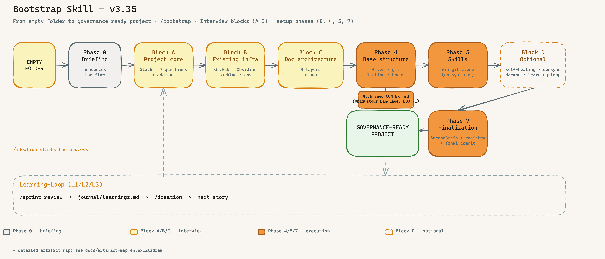

*From empty folder to governance-ready project — four interview blocks (A–D) frame the decisions, four setup phases (0, 4, 5, 7) execute them. Block D spins up optional components only if you want them. ([Excalidraw source](bootstrap/docs/bootstrap-big-picture.en.excalidraw))*

### Overview

| Step | Type | Content |
|------|------|---------|
| **Phase 0** — Briefing | Announcement | Bootstrap tells you what's coming, you confirm |
| **Block A** — Project core | Interview (7 questions) | Stack, name, description, path, GitHub URL, backlog tool + prefix, version |
| **Block B** — Existing infrastructure | Interview (6 questions) | GitHub repo? Project documentation SSoT? Backlog tool? `.env`? runtime file? Developer handover? — integrates into what's already there |
| **Block C** — Doc architecture | Proposal + review | Project Hub, Developer Onboarding, Governance, Target Architecture, Backlog reference + 3-layer proposal |
| **Phase 4** — Base structure | Automatic (~2 min) | Files, Git init, linting, governance hooks, component skeletons |
| **Phase 5** — Install skills | Automatic | Skills pulled via `git clone` from `intentron` (no symlinks) |
| **Block D** — Optional components | Targeted questions at the end | Self-Healing / DocSync / Automation-Daemon / Learning-Loop / SonarQube / Research / Visualize / Monitoring |
| **Phase 7** — Finalization | Automatic | selected documentation SSoT, optional SecondBrain integration, global registry entry, final commit |

> **Why blocks instead of a 14-question batch?** Single questions are easier to answer, and each block builds on the previous one — your doc-architecture proposal in Block C already knows your stack (A.1) and existing infra (B).

### Block A — Project core (7 questions)

#### A.1: Stack question — first of all

```
What do you want to develop?

a) Node.js / JavaScript backend (API, CLI, daemon)
b) Frontend (React, Vue, Vanilla JS)
c) Full-stack (Node.js backend + frontend)
d) Python (AI/ML, scripts, FastAPI, Django)
e) Other / not clear yet
```

The answer determines linting/formatting setup:

| Your choice | Linter | Formatter | Auto-created |
|-------------|--------|-----------|--------------|
| Node.js | ESLint | — | `eslint.config.mjs` |
| Frontend | ESLint + Prettier | Prettier | `eslint.config.mjs` + `.prettierrc` |
| Full-stack | ESLint + Prettier | Prettier | `eslint.config.mjs` + `.prettierrc` |
| Python | Ruff | Black | `pyproject.toml` |

#### A.2–A.7: Project identity

| Question | Example | Why |
|----------|---------|-----|
| Project name | `MyShop` | Used everywhere |
| Short description | `E-commerce for handmade products` | Claude understands what you're building |
| Project path | `/home/user/my-project` | Where the code lives |
| Backlog tool | `linear` / `github-issues` / `none` | Drives issue-prefix use + daemon eligibility |
| Issue prefix | `SHOP` | Stories become SHOP-1, SHOP-2, … |
| Start version | `1.0.0` | Versioning from day 1 |

#### A.4: Architecture dimensions + add-ons

Bootstrap installs 8 **standard** architecture dimensions (Reliability, Data Integrity, Security, Performance, Observability, Maintainability, Testability, Scalability) and asks which of 4 **optional add-ons** to enable:

| Add-on | When it makes sense |
|--------|---------------------|
| **Privacy / GDPR** | You process personal data, GDPR applies |
| **Cost Efficiency** | Cloud bill is non-trivial, LLM calls are billed per token |
| **Signal Quality** | Trading, monitoring, anything driven by external signals |
| **Compliance** | Regulated industry (finance, health, public sector) |

**Standard vs. add-on:** Standard dimensions apply to **every** project — universal software properties safeguarded in any AI-assisted build. Add-ons are context-specific and only enabled if the project's domain calls for them.

Pick any combination — default is "none selected". Every active dimension becomes a section in `ARCHITECTURE_DESIGN.md §3 Quality Attributes` that `/ideation`, `/architecture-review` and `/sprint-review` will check.

### Block B — Existing infrastructure (6 questions)

Bootstrap integrates into what's already there instead of overwriting. It asks:

1. **GitHub repo already exists?** (URL or "create new")
2. **Where is the project documentation SSoT?** Obsidian Vault, repo `docs/project/`, external DMS such as Notion/Confluence/SharePoint, or undecided fallback
3. **Backlog tool configured?** (Linear project / GitHub issues / none)
4. **`.env` already present?** (keep keys or create template)
5. **Runtime instructions already present?** (`AGENTS.md`, `CLAUDE.md`, merge or create)
6. **Developer Onboarding?** create it as standard artifact or link an existing one

### Block C — Doc architecture

Before the layer proposal, Bootstrap operationalizes the selected documentation SSoT. Obsidian is the best-practice path for linked project knowledge, but the framework is not Obsidian-only:

| Option | Bootstrap creates or links |
|---|---|
| Obsidian Vault | project folder with Project/PMO Hub, Developer Onboarding, Governance, Target Architecture, Backlog, Decisions, Meetings, Research, Assets, Archive |
| Repo docs | `docs/project/` with the same standard artifacts |
| External DMS | local `docs/project/DOCUMENTATION_SSOT.md` pointer to Notion, Confluence, SharePoint or another system |
| Undecided | repo fallback under `docs/project/` plus TODO and postflight `WARN` |

Developer Onboarding is the handover artifact. Its purpose is that an unfamiliar team or another coding runtime can take over the project: Claude Code -> Codex, Cursor, GitHub Copilot, Google Antigravity, or a classic development team.

Based on your stack (A.1) and existing infra (Block B), bootstrap then presents a **3-layer doc architecture**:

| Layer | Lives in | Purpose |
|-------|----------|---------|
| **1. Story-Specs** | `specs/ISSUE-XX.md` | Per-story, mandatory for commit via `spec-gate.sh` |
| **2. Component-Docs** | `docs/components/*.md` or Obsidian `Components/*.md` | Living doc per component (voice, memory, frontend …) |
| **3. Architecture-Guidelines** | `Architektur-Vorgaben.md` | Consolidated stack decisions, cross-cutting rules |

**Hub:** `ARCHITECTURE_DESIGN.md` links to all three layers via **§9 auto-linking** — every new `*.md` under the doc folders gets auto-registered in the Hub. Optional `orphan-check.sh` hook blocks commits that add docs without Hub entry.

You can accept the proposal as-is, customize it, or opt out of individual layers.

### Phase 4: Base structure (automatic, ~2 min)

Claude creates files, initializes Git, sets up linting, installs governance hooks, and scaffolds component doc skeletons. See the [Artifact Map](#7-the-artifacts--what-gets-created-where-and-why) for a visual overview.

**`ARCHITECTURE_DESIGN.md §2` includes a mandatory KI-Architecture-Principles block (BOO-24, Schrader Ch. 4):** 4 principles (small modules, explicit interfaces, testability, observability) + 4 anti-patterns are anchored proactively at project setup — not discovered reactively in the first review. `/architecture-review` (BOO-7) checks all 8 items at every story. Reference: `intentron/references/ki-architektur-prinzipien.md`.

### Phase 5: Install skills (automatic)

Skills are pulled from the `vibercoder79/intentron` framework repository via `git clone` into `.claude/skills/` — **no symlinks, no runtime dependency on the source repo**. The skill copies are local and portable. (Companion skills such as `research`/`skill-creator` live separately in `claudecodeskills` and are added only on demand.)

Important distinction: VS Code plugins are workstation infrastructure; skills are project infrastructure. You install ESLint, SonarQube for IDE, Error Lens, Python/Ruff, etc. once in VS Code. Bootstrap checks and documents their availability per project, but does not reinstall those plugins for every project. Skills are different: every bootstrapped project gets its own local `.claude/skills/` copy (and, for Codex adapters, optionally `.codex/skills/`). That copy is the project-pinned runtime state. If you bootstrap a second project, the selected skills are copied into that second project as well; this is intentional, not duplicate global installation.

If a project already has `.claude/skills/<skill>/`, treat Phase 5 as an update/merge decision: keep the pinned project copy, compare with the current master skill, and only update deliberately. Do not replace project-customized skills blindly.

```
Which skills to install?
a) Minimum (ideation, implement, backlog)       ← Ideal for the start
b) Standard (+ architecture-review, sprint-review, research, breakfix)  ← Recommended
c) Full (all skills)                            ← Full arsenal
d) Pick manually
```

### Block D — Optional components (at the end)

After the base project is set up, bootstrap asks targeted optional-component and provider-postflight questions:

| Component | What it does | Cost |
|-----------|--------------|------|
| **Self-Healing agent** | Cron check every 15 min: versions synced, files present, daemons running | Low |
| **DocSync to Obsidian** | Auto-mirror docs to your vault | None (if Obsidian exists) |
| **Automation daemon** | Linear webhook → auto-`/implement` on "In Progress" | Requires Linear + webhook endpoint |
| **Learning-Loop (L1/L2/L3)** | Framework gets smarter with every sprint — see next section | L1 free, L3 adds SQLite |
| **Research** | Framework, companion or global skill plus Perplexity/OpenRouter/MCP provider status | Provider-dependent |
| **Visualize/Miro** | Diagram skill plus Miro MCP verification or Excalidraw/Mermaid fallback | Miro-dependent |
| **Monitoring** | Central platform, project-owned setup or documented architecture question | Platform-dependent |

### Learning-Loop (L1/L2/L3)

A **portable feedback loop** that turns completed sprints into anti-pattern warnings for future stories. Three levels, pick one:

| Level | Storage | Write | Read |
|-------|---------|-------|------|
| **L1 — Simple** | `journal/learnings.md` (append-only markdown) | `/sprint-review` appends after every review | `/ideation` reads at story creation (warns on matching anti-patterns) |
| **L2 — Sprint-Journal** | `journal/sprint-YYYY-QN.md` (one file per sprint) | `/sprint-review` | `/ideation` + `/architecture-review` |
| **L3 — SQLite** | `.learning-loop/loop.db` (structured) | `/sprint-review` | `/ideation` + `/architecture-review` + `/backlog` (priority adjustment) |

**Why it matters:** Without the loop, every sprint starts from zero. With the loop, decisions that caused pain last sprint (wrong dependency, missed Acceptance Criterion, scope creep) show up as warnings *before* the next story gets created.

### Phase 7: Finalization

- **Documentation SSoT finalization** — bootstrap creates or links Project Hub, Developer Onboarding, Governance, Target Architecture, Backlog, Decisions, Meetings, Research, Assets and Archive in the selected SSoT
- **SecondBrain integration** — if Block B selected Obsidian, bootstrap creates a PMO hub under `02 Projekte/<ProjectName>/`
- **Global registry** — `~/.claude/MEMORY.md` gets a pointer to the new project
- **Final commit** — everything in one commit with a summary table

```
✓ Block A: Project core + stack + add-ons
✓ Block B: Existing infrastructure + documentation SSoT integrated
✓ Block C: Project Hub + Developer Onboarding + doc architecture
✓ Phase 4: Base structure (files, Git, linting, hooks, labels)
✓ Phase 5: Skills installed ({count})
✓ Block D: Optional components ({status})
✓ Phase 7: SecondBrain + Registry + Final-Commit

Your project is ready. Start with: /ideation
```

---

## 6. The Skills — When Do I Use What?

### Overview: the skill system

Skills are **repeatable workflows** that guide Claude through complex tasks. You invoke them
with `/skillname` and Claude follows a defined process.

```
Idea     → /ideation          → Story in Linear
Story    → /implement         → Code, tests, git push
Problem  → /breakfix          → Diagnosis, fix, prevention
Week     → /backlog           → What's next?
Quarter  → /sprint-review     → System health
Sprint   → /pitch             → Evidence briefing for stakeholders
Anytime  → /status            → What's happening right now?
```

The full 4P delivery pipeline (Schrader Code Crash Ch. 5) is wired as:

```
/intent → /ideation → /backlog → /implement → /architecture-review → /sprint-review → /pitch
\______/   \_____________________________/                                              \____/
Perceive   Prompt + Produce                                                              Pitch
```

See **Appendix L** for the full 4P-pipeline mapping and the `/pitch` evidence contract.

Every skill in this handbook has its own README with a visual overview:

| Skill | README + Sketch |
|-------|-----------------|
| bootstrap | [README](bootstrap/README.md) · [Sketch](bootstrap/docs/bootstrap-big-picture.en.png) |
| ideation | [README](ideation/README.md) · [Sketch](ideation/overview.en.png) |
| implement | [README](implement/README.md) · [Sketch](implement/overview.en.png) |
| backlog | [README](backlog/README.md) · [Sketch](backlog/overview.en.png) |
| architecture-review | [README](architecture-review/README.md) · [Sketch](architecture-review/overview.en.png) |
| sprint-review | [README](sprint-review/README.md) · [Sketch](sprint-review/overview.en.png) |
| pitch | [README](pitch/README.en.md) · [Sketch](pitch/pitch-overview.en.png) |
| research | [README](research/README.md) · [Sketch](research/overview.en.png) |
| security-architect | [README](security-architect/README.md) · [Sketch](security-architect/overview.en.png) |
| grafana | [README](grafana/README.md) · [Sketch](grafana/overview.en.png) |
| cloud-system-engineer | [README](cloud-system-engineer/README.md) · [Sketch](cloud-system-engineer/overview.en.png) |
| visualize | [README](visualize/README.md) · [Sketch](visualize/overview.en.png) |
| skill-creator | [README](skill-creator/README.md) · [Sketch](skill-creator/overview.en.png) |
| design-md-generator | [README](design-md-generator/README.md) · [Sketch](design-md-generator/overview.en.png) |

### `/ideation` — From idea to story


**When:** You have an idea for a new feature.

**What happens:**
1. You describe your idea in natural language
2. Claude researches (optional: deep research via Perplexity)
3. Claude checks whether the idea fits the architecture
4. Claude creates a structured user story in Linear

**Example:**
```
You: /ideation
Claude: "Describe your idea..."
You: "I want customers to be able to track their orders"

→ Claude creates SHOP-42 in Linear with:
   - What exactly gets built
   - Why (business value)
   - How (technical approach)
   - Acceptance criteria
   - Effort estimation
```

#### Pre-flight checks in `/ideation`

Before the actual ideation work starts, the skill runs two soft pre-flight checks. **Soft = the operator is asked; no hard block.** They prevent the most expensive failure mode: writing stories against an outdated picture of the system.

**Check 1 — environment loaded (step 0):** the skill reads `.claude/environment.json` to know which paths, tools and thresholds apply. If the file is missing, defaults are used and the skill warns once.

**Check 2 — architecture-doc freshness (step 0a, soft):** the skill compares the last modification date of `ARCHITECTURE_DESIGN.md` against `thresholds.architecture_doc_freshness_days` from `.claude/environment.json` (default `30`). When the doc is older than the threshold:

```
Warning: ARCHITECTURE_DESIGN.md has not been updated in 47 days
(threshold: 30 days).

Recommendation: run /architecture-review before writing new stories
against a possibly stale architecture.

Continue anyway? [yes/no]
```

On `no` the skill stops, the operator runs `/architecture-review`, then `/ideation` is restarted. On `yes` the override is documented in the resulting story under `Current State`.

**Why soft, not hard?** A hard block would gate every project that has been quiet for a while — but the doc is often "old enough to warn, still valid". The operator decides per story. The threshold lives in `.claude/environment.json` so each project can tune it: fast-moving systems set 14, stable systems 90.

**Configuration example** in `.claude/environment.json`:

```json
{
  "thresholds": {
    "architecture_doc_freshness_days": 14
  }
}
```

### `/implement` — From story to code

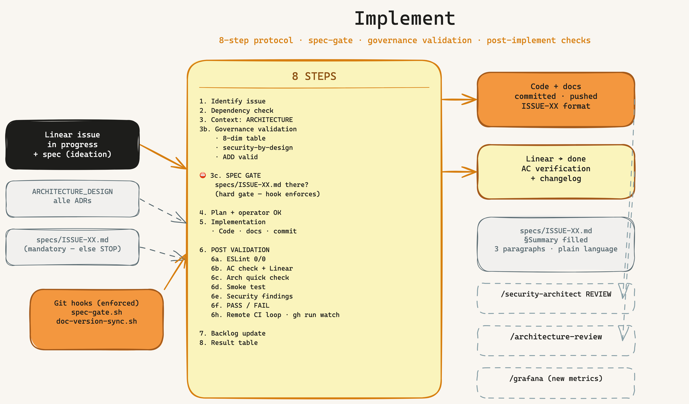

**When:** You want to implement a story.

**What happens (8-step protocol):**
1. Identify issue (load from Linear)
2. Dependency check (blockers resolved?)
3. Build context (CLAUDE.md, ARCHITECTURE_DESIGN.md)
3b. Governance validation (8-dimension table? Security section?)
3c. ⛔ **Spec-file gate** — hard gate (enforced by `spec-gate.sh`)
4. Plan + operator approval
5. Implementation (code, docs, commit + push)
6. Post-implement validation (ESLint, AC check, smoke test, security findings)
7. Backlog update
8. Result table + `specs/ISSUE-XX.md` summary

> **Important:** `/implement` NEVER changes code without your OK in step 4. You're always in control.

### `/backlog` — Sprint planning


**When:** You don't know what's most important next.

**What happens:**
1. Claude loads all open issues from Linear
2. Analyzes dependencies (what blocks what?)
3. Suggests a prioritized order
4. Schema-chain check: flags conflicts (two stories targeting same `schemaVersion`)
5. Shows hygiene suggestions (orphaned refs, obsolete issues)

### `/breakfix` — When something is broken

**When:** The system has a problem, a bug, or is acting weird.

**What happens (6-step process):**
1. **Detect:** What exactly is the problem?
2. **Diagnose:** Why is it happening?
3. **Fix:** Implement the solution
4. **Verify:** Is it truly fixed?
5. **Document:** Archive incident in `journal/incidents/`
6. **Prevent:** How do we prevent this in the future?

### `/architecture-review` — System health


**When:** Before a big decision. Periodically (monthly).

**What happens:** Claude checks the active dimensions of your system — 8 standard
(Reliability, Data Integrity, Security, Performance, Observability, Maintainability, Testability, Scalability)
plus any active add-ons (Privacy / GDPR, Cost Efficiency, Signal Quality, Compliance).

### `/research` — Deep research


**When:** You need facts for a technical decision.

**What happens:**
- Auto-routing: simple questions → WebSearch, complex → Perplexity (deeper AI analysis)
- Results are cross-checked
- Structured research report with sources + confidence rating

### `/sprint-review` — Quarterly audit


**When:** Every 4–6 weeks.

**What happens:**
- Tech debt analysis: what needs cleanup?
- Backlog hygiene: which issues are stale?
- Architecture check: has tech debt accumulated?
- Recommendations for the coming weeks

### `/security-architect` — Security by design


**When:** Automatically — during planning (DESIGN mode), code changes (REVIEW mode),
audits (AUDIT mode), and before installing external skills (SKILL-SCAN mode).

**Covers:** OWASP Top 10:2025 · STRIDE/DREAD · ASVS 5.0 · MITRE ATLAS · Agentic AI Security (ASI01–ASI10)

### `/pitch` — Evidence for stakeholder meetings


**When:** Before a stakeholder meeting, after `/sprint-review` has run.

**What happens:**
- 8 sources are aggregated read-only: L3 lessons DB, local implement reports, CI reports, sprint files, ARCHITECTURE_DESIGN.md, INTENT-XX.md, feature-flag state, git log
- Architecture diff since the previous pitch is computed
- Demo-path heuristic proposes the user journey that best demonstrates intent fulfillment
- Output: `pitch/PITCH-XX.md` with frontmatter (`metrics_snapshot`, `related_intents`, `demo_path`, `status`) + 5 body sections — committed, NOT gitignored

**Anti-Scope:** the skill generates NO slides, NO voiceover, NO outcome text, and NO demo video. Human builds the story and runs the live demo. Details in **Appendix L** (4P pipeline mapping).

### Other skills

- [`/grafana`](grafana/README.md) — dashboards via Grafana MCP
- [`/cloud-system-engineer`](cloud-system-engineer/README.md) — VPS, Docker, firewall, DNS
- [`/visualize`](visualize/README.md) — architecture diagrams in Miro
- [`/skill-creator`](skill-creator/README.md) — build your own skills
- [`/design-md-generator`](design-md-generator/README.md) — extract design systems to DESIGN.md
- [`/status`](bootstrap/README.md) — one-glance system status

---

## 7. The Artifacts — What Gets Created, Where, and Why

### What is an artifact?

An **artifact** is a file that the governance framework creates or expects — documentation,
checklists, hooks, specs, automation scripts, memory entries. Each artifact has a clear
purpose and is read or written by specific skills.

Most teams collect documentation ad-hoc. The INTENTRON defines a fixed, minimal set of artifacts
that together give you traceable, reproducible, AI-friendly development.

### The 5 artifact groups


*The full artifact map: every governance file, hook, spec, and automation that bootstrap creates — grouped into 5 categories, with arrows showing which skill consumes which artifact. ([Excalidraw source](bootstrap/docs/artifact-map.en.excalidraw))*

#### Group A — Governance documentation

Rules · architecture · process · history.

| Artifact | Purpose | Written by | Read by |
|----------|---------|------------|---------|
| `CLAUDE.md` | Claude's identity + project rules | bootstrap + you | every skill (auto at session start) |
| `CONVENTIONS.md` | Project-local contract: governance mode, execution isolation, active gates | bootstrap + you | `/ideation`, `/implement`, `/architecture-review`, `/sprint-review`, tool adapters |
| `GOVERNANCE.md` | Process rules — when/why | bootstrap | every skill |
| `SYSTEM_ARCHITECTURE.md` | Overview of components, data flow | bootstrap + `/implement` | every skill |
| `ARCHITECTURE_DESIGN.md` | Lead document — all ADRs, 8 sections | bootstrap + `/ideation` | `/implement`, `/architecture-review`, `/sprint-review` |
| `INDEX.md` | File index | bootstrap + `/implement` | every skill |
| `COMPONENT_INVENTORY.md` | Component inventory | bootstrap + `/implement` | self-healing (Check U) |
| `DEVELOPMENT_PROCESS.md` | Process reference | bootstrap | reference |
| `SECURITY.md` | Security policy | bootstrap + `/security-architect` | `/implement`, `/sprint-review` |
| `CHANGELOG.md` | What changed when | `/implement` (auto) | every skill |
| `API_INVENTORY.md` | All external APIs | `/implement` | `/security-architect` (AUDIT) |
| `journal/STRATEGY_LOG.md` | Strategy decisions | you + `/ideation` | `/ideation` (mandatory read before story creation) |
| `journal/LEARNINGS.md` | Outcome tracking | `/implement` (after issue-close) | `/sprint-review` |
| `lib/config.js` | Single source of truth: VERSION + DOC_FILES | bootstrap | self-healing, doc-version-sync |

### Security Documentation Model

Security in the INTENTRON is not a single checklist. It is a linked documentation model:

*Sketch: the security workflow shows how `ARCHITECTURE_DESIGN.md`, `SECURITY.md`, sub-artifacts, skill gates and the learning loop reinforce each other. ([Excalidraw source](docs/security-workflow.en.excalidraw))*

| Layer | Artifact | Role |
|---|---|---|
| Lead architecture contract | `ARCHITECTURE_DESIGN.md` | Names Security as a quality dimension, records security/privacy boundaries, and links to the security contract. |
| Operational security contract | `SECURITY.md` | Defines the security principle, secrets policy, change-type matrix, validation evidence, sensitive paths, and incident notes. |
| Security sub-artifacts | `API_INVENTORY.md`, `.semgrep.yml`, `.codex/hooks.json`, `.claude/sensitive-paths.json`, `.codex/sensitive-paths.json`, threat models, privacy/compliance docs | Hold concrete evidence, provider/API details, technical gates, and human-review rules. |

The flow is deliberate: `/ideation` writes `Security Impact` and, when relevant, `Security Validation` into the story. `/implement` reads `ARCHITECTURE_DESIGN.md`, `SECURITY.md`, and the matching sub-artifacts before changing code. `/security-architect` adds threat models, policies, or reviews for risky changes. `/architecture-review` checks whether security remains consistent with the architecture target state. `/sprint-review` looks for security debt, open findings, and recurring patterns.

This makes Security by Design operational: plan the security impact, implement against the contract, validate with gates, update the affected artifacts, and feed repeated findings back into the learning loop.

#### Group B — Checklists + guardrails

Machine-enforced rules and reference lists.

| Artifact | Purpose | Enforcement |
|----------|---------|-------------|
| `.claude/hooks/spec-gate.sh` | Blocks `git commit ISSUE-XX` without `specs/ISSUE-XX.md` | **HARD GATE** (PreToolUse hook) |
| `.claude/hooks/doc-version-sync.sh` | Blocks `git push` on VERSION drift between DOC_FILES | **HARD GATE** (PreToolUse hook) |
| `.claude/hooks/pre-edit-bodyguard.sh` | Catches unsafe patterns (secrets, `eval`, TLS off, SQL concatenation) on `Edit/Write` — Layer 0, BOO-86 | Warning (hard-block opt-in via `BODYGUARD_STRICT=1`), PreToolUse hook |
| `.claude/hooks/guard.sh` | Blocks access to `.env` and key files | Soft guard |
| `.claude/hooks/format.sh` | Auto-formats on Edit/Write (Biome/Black) | Passive |
| `.claude/settings.json` | Hook registration + permissions | Config |
| `eslint.config.mjs` / `.prettierrc` / `pyproject.toml` | Linting config (stack-dependent) | Passive + `/implement` step 6a |
| `.claude/ISSUE_WRITING_GUIDELINES.md` | Issue format rules | Reference |
| `architecture-review/references/dimensions-detail.md` | The 8 standard + 4 add-on dimensions | Reference for `/ideation`, `/architecture-review`, `/sprint-review` |
| `implement/references/change-checklist.md` | Per-change validation | Reference for `/implement` step 6 |
| `security-architect/references/owasp-checklist.md` | OWASP Top 10:2025 + ASVS 5.0 | Reference for `/security-architect` |

#### Group C — Specs + traceability

The path Idea → Backlog Record / adapter issue → Spec → Commit → Changelog.

| Artifact | Purpose | Anatomy |
|----------|---------|---------|
| `specs/TEMPLATE.md` | Template for new specs | Why · What · Constraints · Current State · Tasks (T1, T2…) |
| `specs/ISSUE-XX.md` | One spec per story (mandatory before commit) | Filled from TEMPLATE + `## Summary` filled by `/implement` step 8 |
| Backlog Records / adapter issues | Story tracking in Linear, GitHub Issues, Jira, Planner, Azure DevOps, or Markdown | **5 required sections (Governance v2):** Schrader Prompt Components (Insight · Constraints · Success Criteria · Desired Outcome) + Definition of Done + Execution Mode. See `bootstrap/references/issue-writing-guidelines-template.md` |
| Git Commits | Format: `T1: ISSUE-XX — description` | Gated by spec-gate.sh |
| Obsidian Vault | Change logs + project memory | Auto-synced by `doc-sync.js` |

#### Group D — Self-healing + automation

Runtime agents — no ops team needed.

| Artifact | Purpose | Cadence |
|----------|---------|---------|
| `agents/self-healing.js` | Check M (versions) · U (files) · P (processes) + Telegram alert | Cron, every 15 min |
| `lib/doc-sync.js` | Sync to Obsidian vault | On demand + cron |
| `.env` / `.env.example` | Secrets + API keys (gitignored) | Manual |
| `agents/linear-automation-daemon.js` | Webhook-driven auto-implement | Optional |

#### Group E — Skill system

Skills consume artifacts from A–D.

| Artifact | Purpose |
|----------|---------|
| `~/.claude/skills/*` | Global skill source / operator registry |
| `.claude/skills/*` | Project-local skill copies, pinned and portable |
| `~/.claude/projects/-root/memory/MEMORY.md` | Global memory |
| `~/.claude/projects/-root/memory/project_{slug}_init.md` | Project-specific memory |

#### Group F — Environment manifest (BOO-34)

| Artifact | Purpose |
|----------|---------|
| `.claude/environment.json` | Single source of truth for environment (mac/vps/ci), available tooling and default paths |
| `.claude/generate-environment-json.sh` | Bash generator (BSD- and Linux-compatible, no deps) |

##### Coding environments — mac vs. VPS vs. CI

Same governance code base, three very different execution contexts. Skills behave slightly differently depending on `environment`:

- **`mac`** — operator's workstation. Interactive sessions, IDE integrations available (SonarLint plugin, ESLint extension), `brew` for tool installs. `tools_available.sonarqube_ide_plugin` may be `true` if the operator has it installed.
- **`vps`** — server (e.g. Hostinger srv1443320). No IDE plugins, `apt`/`pip` for installs, runs in a tmux/screen, results land in `journal/reports/local/`. `sonarqube_ide_plugin` is always `false`. Operator drives via SSH.
- **`ci`** — GitHub Actions / GitLab CI runner. Detected via env var `$CI` regardless of value. Reports are written to `journal/reports/ci/`, lessons-learned writes are SKIPPED to keep CI ephemeral. CI check happens FIRST in detection, because a CI runner can be Linux OR mac.

Skills read the file in a step-0 lookup. Quick reads with `grep`/`sed` are fine; for richer queries `jq` is convenient (optional install — `brew install jq` on mac, `apt install jq` on VPS):

```bash
# Without jq (always works)
HAS_SEMGREP=$(grep '"semgrep"' .claude/environment.json | grep -oE 'true|false')

# With jq (richer queries)
ENV=$(jq -r .environment .claude/environment.json)
TESTS=$(jq -r .tools_available.tests .claude/environment.json)
REPORTS=$(jq -r .paths.reports_local .claude/environment.json)
```

Regenerate after tooling changes: `bash .claude/generate-environment-json.sh --force`. The file is committed; `metadata.created_at` is the audit trail.

#### Group G — Observability skeleton (BOO-14)

| Artifact | Purpose |
|----------|---------|
| `observability.md` | Central observability skeleton (project root) — three required sections: logging schema, metrics endpoint, alert rules |
| `observability/alerts/<service>.yml` | Per-service Prometheus alert rules — required alerts: `{service}_down`, `{service}_error_rate_high` (>5%), `{service}_p95_slow` (p95 >1s) |
| `observability/.env.observability` | Routing config (Telegram / Slack / email webhooks) — **gitignored**, only `.env.observability.example` committed |

##### Three pillars of observability

Schrader Code Crash chap. 3 §Production Readiness §Observability + chap. 4 §Run the System (pillar 3 observability): "deploy without observability and you fly blind." Bootstrap installs the scaffolding from day 0; the operator fills service-specific content per block C component.

- **Logging schema** — structured JSON with the fields `timestamp`, `level`, `service`, `trace_id`, `message`, `context`. Stack defaults: Node.js → `pino`, Python → `structlog`.
- **Metrics endpoint** — `/metrics` in Prometheus format per service, port convention `9090+N` (auth=9091, api=9092, db=9093, ...). Stack defaults: Node.js → `prom-client`, Python → `prometheus_client`.
- **Alert rules** — three required alerts per service: `{service}_down` (`up == 0` for >2 min, severity critical), `{service}_error_rate_high` (errors/requests >5% for 5 min, severity warning), `{service}_p95_slow` (p95(request_duration_seconds) >1s for 5 min, severity warning). Validate locally with `promtool check rules observability/alerts/*.yml`.

Existing projects: `bash <skill-repo>/bootstrap/scripts/migrate-to-v2.sh --issue BOO-14` scaffolds the three files idempotently. Operator steps for service population: see `bootstrap/references/migration-checklist-v1-to-v2.en.md §BOO-14`.

#### Group H — Reliability skeleton (BOO-25)

| Artifact | Purpose |
|----------|---------|
| `lib/idempotency.{js,py}` | Idempotency middleware (Redis-backed) — required header `Idempotency-Key`, behaviour: same key + same body → cached response, same key + diverging body → HTTP 422 |
| `lib/retry.{js,py}` | Retry helper with exponential backoff + jitter — defaults: maxRetries=3, baseDelay=200ms, factor=2; **no retry on 4xx**, no retry on 422 idempotency conflicts |
| `lib/circuit-breaker.{js,py}` | Circuit breaker wrapper — defaults: errorThresholdPercentage=50, resetTimeout=30s, volumeThreshold=10; one breaker per external dependency (DB, auth, external API, message bus) |
| `docs/SLO.md` | Service-Level Objectives skeleton — availability target, quarterly error-budget table, at least 3 SLIs sourced from the BOO-14 metrics endpoint, review cadence in `/sprint-review` |

##### The five pillars of reliability

Schrader Code Crash chap. 4 §Run the System (pillar 6 reliability): "if there is no error budget, you do not know when to stop." Bootstrap installs the four scaffolds from day 0; the operator decides per service which pillars are active and wires the middleware/wrappers into the entry points.

- **Idempotency** — duplicate writes with the same `Idempotency-Key` return the cached response; diverging bodies for the same key return HTTP 422. Cache backend: Redis (`REDIS_URL`).
- **Retry + backoff** — exponential backoff with jitter for transient downstream failures. Status filter: only 5xx and network errors are retried; 4xx and idempotency conflicts (422) are not.
- **Circuit breaker** — per-dependency breaker that opens after the error-rate threshold is exceeded, blocks calls for `resetTimeout`, then half-opens to probe recovery. Thresholds tuned per dependency.
- **Graceful degradation** — explicit fallback paths when a downstream is open or slow (cached read, queue-and-forget, feature flag off). Documented per service in the reliability section.
- **SLO + error budget** — availability target (e.g. 99.9%), quarterly error budget, ≥3 SLIs (`error_rate`, `p95_latency`, `availability`) measured against the BOO-14 metrics endpoint. Reviewed every sprint review; budget exhaustion triggers a stop-ship.

Existing projects: `bash <skill-repo>/bootstrap/scripts/migrate-to-v2.sh --issue BOO-25` scaffolds the four files idempotently (stack-detected via `package.json` / `pyproject.toml` / `requirements.txt`). Operator steps for activation: see `bootstrap/references/migration-checklist-v1-to-v2.en.md §BOO-25`. Cross-link: `architecture-review/references/dimensions-detail.en.md` §1.1-§1.5 covers each pillar in detail.

#### Group I — Implement-run local reports (BOO-36)

`/implement` step 6 persists raw tool outputs alongside the declarative iteration. The directory is **gitignored** — `/sprint-review` aggregates these reports later into `journal/sprint-{date}.md`.

| Artifact | Purpose | Written by | Read by |
|----------|---------|------------|---------|
| `journal/reports/local/{YYYY-MM-DD_HHMM}_{STORY-ID}/eslint-iter{N}.sarif` | ESLint SARIF per iteration (fallback `.json`) | `/implement` step 6a | `/sprint-review` |
| `journal/reports/local/{YYYY-MM-DD_HHMM}_{STORY-ID}/tests-iter{N}.junit.xml` | JUnit XML per test iteration | `/implement` step 6a-quart | `/sprint-review` |
| `journal/reports/local/{YYYY-MM-DD_HHMM}_{STORY-ID}/coverage-final.json` | Coverage end state (c8 / pytest-cov) | `/implement` step 6a-quart | `/sprint-review` |
| `journal/reports/local/{YYYY-MM-DD_HHMM}_{STORY-ID}/semgrep-final.sarif` | Semgrep SARIF end state | `/implement` step 6a-bis | `/sprint-review` |
| `journal/reports/local/{YYYY-MM-DD_HHMM}_{STORY-ID}/meta.json` | Run metadata (schema below) | `/implement` step 6f-bis | `/sprint-review` |

##### meta.json schema

```json
{
  "story_id": "BOO-15",
  "started_at": "2026-04-27T14:30:00Z",
  "completed_at": "2026-04-27T14:34:00Z",
  "iterations": {
    "eslint": 3,
    "tests": 2,
    "semgrep": 1,
    "coverage": 1
  },
  "final_status": "passed",
  "environment": "mac"
}
```

Field convention:
- `story_id` — Backlog Record / adapter issue key
- `started_at` / `completed_at` — ISO-8601 UTC
- `iterations.<gate>` — number of iterations per gate, 0 if the gate was skipped
- `final_status` — `passed` | `failed` | `stopped_iteration_limit`
- `environment` — `mac` | `vps` | `ci` | `unknown` (mirrored from `.claude/environment.json`)

##### Responsibility separation

| Who | Writes | Reads |
|-----|--------|-------|
| `/implement` | `journal/reports/local/` (raw outputs + meta.json) | nothing |
| `/sprint-review` (first phase) | `journal/sprint-{date}.md` (aggregated) | `journal/reports/local/` + `journal/reports/ci/` |
| `/sprint-review` (second phase) | `journal/learnings.db` (parsed L2) | nothing |

The separation is hard: implement persists, sprint-review aggregates. `/implement` does **not** write directly into the L3 learnings DB. This keeps implement fast (no DB lock, no schema knowledge) and gives sprint-review a single-writer role for the learnings DB.

### How to read an artifact — anatomy example: `specs/ISSUE-XX.md`

Every spec file follows the same structure:

```markdown
# SHOP-42 — Order tracking

## Why
Customers frequently ask "where is my order?" via email. Adding a tracking page
reduces support load and improves UX.

## What
- Deliverable: `/orders/:id/track` page with live status
- Done when: customer sees status + timestamps + carrier link

## Constraints
- MUST: reuse existing order DB schema
- MUST NOT: add new external API without approval
- Out of scope: email notifications (separate story)

## Current State
- `src/routes/orders.js` — currently handles list/detail views
- `lib/order-db.js` — schema v12

## Tasks
- T1: Add `/orders/:id/track` route (files: src/routes/orders.js) — verify by visiting /orders/1/track
- T2: Add tracking status component (files: components/OrderTracking.jsx) — verify by Storybook
- T3: Wire carrier API (files: lib/carrier-api.js, .env.example) — verify by mock response

## Summary
(filled after implementation by /implement step 8 — 3 paragraphs, plain language)
```

This structure is not negotiable — the spec-gate hook enforces the file's existence, and
`/implement` step 3c validates its shape before the plan phase begins.

### Which skill writes/reads which artifact?

The [Artifact Map](bootstrap/docs/artifact-map.en.png) above shows the full matrix visually.
Quick summary:

- **`/ideation`** writes: Backlog Record / adapter issue, ADD section, spec placeholder. Reads: ARCHITECTURE_DESIGN.md, STRATEGY_LOG.md
- **`/implement`** writes: code, specs/ISSUE-XX.md (summary), CHANGELOG.md, LEARNINGS.md. Reads: spec, ARCHITECTURE_DESIGN.md, change-checklist
- **`/architecture-review`** reads: ALL group-A docs + ADD + all ADRs. Writes: review report
- **`/sprint-review`** reads: ALL group-A docs + LEARNINGS.md + Git log. Writes: audit report
- **`/security-architect`** writes: SECURITY.md updates, threat models. Reads: OWASP checklist, STRIDE refs

### The golden rule

> **Every artifact has one purpose. Every skill consumes or writes specific artifacts.
> No skill writes into an artifact it doesn't own. No artifact is duplicated.**

This is the whole framework in one sentence.

---

## 8. The Guardrails — Your Safety Net

### What are guardrails?

Guardrails are **automatic safety mechanisms** that prevent you from accidentally doing
things you'll regret. Not punishment — your parachute.

### Guardrail 1: Spec-gate (Git hook)

**Problem:** You change code without knowing why — and in 3 weeks you won't remember.

**Solution:** Before you can commit code tied to an issue, a spec file (`specs/SHOP-42.md`)
must exist that explains **what** and **why**.

```bash
git commit -m "SHOP-42: Add order tracking"
# → Without specs/SHOP-42.md: BLOCKED
# → With specs/SHOP-42.md: allowed

# ⛔ spec-gate: specs/SHOP-42.md missing!
#    Create specs/SHOP-42.md from specs/TEMPLATE.md first
#    Bypass: git commit --no-verify (only if you're consciously skipping)
```

**Bypass available?** Yes: `--no-verify`. But you consciously know you're breaking the rule.

### Guardrail 2: Doc-version-sync (Git hook)

**Problem:** You bump the version in `config.js` but forget 5 documentation files.

**Solution:** When `config.js` is staged with a new version, the hook automatically checks
whether all docs are on the same version.

```bash
git commit -m "v1.4.0 - new features"
# → config.js: VERSION = '1.4.0'
# → SYSTEM_ARCHITECTURE.md: Version: 1.3.2 → BLOCKED

# ⛔ doc-version-sync: SYSTEM_ARCHITECTURE.md still at v1.3.2!
#    Please update to v1.4.0
```

### Guardrail 3: Self-healing agent

An agent that checks every 15 minutes in the background:

| Check | What's checked |
|-------|-----------------|
| Signal freshness | Is all data current? |
| Doc sync | Are all doc versions in sync? |
| Architecture guard | Are core rules respected? |
| API health | Are all external APIs reachable? |
| Security events | Was there suspicious activity? |

On problems: Telegram alert (if set up) or log entry in `journal/`.

### Guardrail 4: Spec-driven development

The simplest yet most powerful rule:

```
NEVER change code without a Backlog Record or adapter issue
NEVER commit code without a spec file (specs/ISSUE-ID.md)
NEVER bypass the operator (= you) — always show, then act
```

Sounds like extra work. In practice, a spec file takes 2 minutes — and prevents hours of
debug work because you know what you built and why.

### Guardrail 5: Operator in the loop

On `/implement`: **step 4 is always a pause point.** Claude shows you the plan, you say OK,
then code is written.

You can never accidentally deploy something you haven't seen.

---

## 8b. Anti-Patterns at Program Level — Schrader Ch. 7

In ch. 7 "Risks and Anti-Patterns" Schrader describes 11 patterns that emerge when AI-assisted development scales poorly. The technical anti-patterns are operationalised in the skill gates (BOO-3 through BOO-19). The organisational anti-patterns are not automatically detectable — they require human reflection.

This section documents the four cultural/organisational APs that no skill can cover.

### AP6: Experience Debt

When features ship without sufficient UX/design review. AI accelerates this: working software emerges in minutes — without the natural brake that previously forced time for design work.

**How you spot it:** Users regularly ask "how do I do that again?" even though they know the product. Support volume rises for questions that an intuitive product would never trigger. Features exist, but users don't find them.

**Countermeasures:**
- Make experience debt visible: count contradictory interaction patterns
- Design check as a gate on the running candidate, not on the mockup
- 15% budget for UX consolidation (analogous to the 15% rule for technical debt)
- Feedback loops with real users: measure HOW features are used

> "A product that is technically clean and offers a poor experience loses against a product that is technically questionable but feels right. Experience is not an add-on — it is the product." — Schrader

### AP7: Diffused Responsibility

Nobody feels responsible for AI-generated code. The AI generated it, the developer reviewed it, the tester tested it — when something breaks, the implicit answer is: "The AI did it that way."

**How you spot it:** When problems occur, the search is for culprits instead of root causes. Retrospectives end without clear accountabilities. Product owners say "that was technical, not my responsibility."

**Clear accountability rules:**
1. Whoever formulates the intent owns it
2. Whoever triggers code generation owns the code — "the AI did it that way" is not an excuse
3. Whoever reviews shares responsibility for quality
4. Every team member is personally responsible for the outcome

These rules must be **explicitly documented and lived** — not merely assumed.

### AP9: Individual-First as Isolation

"Everyone now works independently with AI!" The team dissolves into individuals. Result: silos, duplicated work, contradictory architecture.

**How you spot it:** The same problem is solved by different people in different ways. Architecture decisions contradict each other. Onboarding new talent takes longer instead of shorter.

**Countermeasures:**
1. **Time-shifted architecture reviews:** weekly team reviews of architecture decisions
2. **Shared code ownership:** every module is known to at least two people
3. **Documentation as core work:** not optional, not "later"
4. **Regular internal demos:** not for customers — for the team itself

> "Individual + AI is the atomic unit. But atoms need molecules to form matter." — Schrader

### AP11: The Political Saboteurs

The hardest anti-patterns emerge not from incompetence but from calculation. Three types:

**The envy saboteur:** Someone whose status is threatened by AI productivity gains. Reaction: subtle sabotage — code reviews that take too long, standards that suddenly become non-negotiable, scepticism dressed up as constructive critique.

**The power player:** A department that loses influence through the transformation. Reaction: strategic concerns raised in steering committees, pilots are pulled into their own area and starved.

**The fear blocker:** A technically brilliant employee who blocks out of self-protection. Reaction: introduce excessive complexity, declare every simplification a security risk.

**The radar:** Recognise the pattern, do not evaluate single actions in isolation. Follow the budget and the influence — who loses through the transformation? Those are the risk zones. Address constructively before it turns destructive.

---

**Full catalogue of all 11 APs** (including the technical ones with skill coverage): `intentron/references/anti-pattern-katalog.en.md`

**Automatic sprint diagnostic:** `/sprint-review` step 7 asks one diagnostic question per AP and recommends actions on hits.

**Reference:** Schrader "Code Crash" (2026), ch. 7 "Risks and Anti-Patterns", lines 3626ff.

---

## 8c. Production Readiness — Schrader Reference

In ch. 3 §Production Readiness and ch. 4 §Run the System, Schrader covers the requirements for AI-assisted code that ships to production. We have folded those points into the existing skills and gates — not 1:1, but adapted to our pipeline.

**What we deliberately did NOT take over 1:1:**

- **Intent propagation three-stage instead of binary:** Schrader frames intent as one handover point; we anchor it in three places — gate in `/ideation` (story intake), weighting in `/backlog` (prioritisation), measure-loop in `/implement` (verification after the build).
- **4P pipeline (Perceive/Prompt/Produce/Pitch)** not as a rename: We keep our existing phases (Intent → Ideation → Implement → Review) and map 4P conceptually without re-labelling the pipeline. Reason: stability of skill names across versions.

### Mapping table

| Schrader topic | Chapter / page | Our governance equivalent | Where anchored in the skill | Linear issue |
| -- | -- | -- | -- | -- |
| Intent before Implementation | Ch. 4 p. 82ff | `/intent` skill | `~/.claude/skills/intent/` | BOO-1 |
| Intent propagation | Ch. 4 p. 130ff | Gate in `/ideation`, weighting in `/backlog`, measure-loop in `/implement` | 3 skills | BOO-10 |
| AI-suitable architecture | Ch. 4 p. 105ff | AI-suitability checklist in `/architecture-review` | `architecture-review/SKILL.md` | BOO-7 |
| Run the System — Security | Ch. 4 p. 98 | Two-stage SAST (Semgrep + SonarQube) | `/bootstrap`, `/implement` step 6a | BOO-3/4/5/6 |
| Run the System — Testability | Ch. 4 p. 100 | Testability as its own dimension + coverage gate | `architecture-dimensions/testability.md`, `/implement` 6a | BOO-8, BOO-15 |
| Run the System — Observability | Ch. 4 p. 102 | Observability as its own dimension + mandatory skeleton | `architecture-dimensions/observability.md`, `/bootstrap` phase 4 | BOO-8, BOO-14 |
| Run the System — Scalability | Ch. 3 p. 66 | Scalability as its own dimension (4 invariants) | `architecture-dimensions/scalability.md`, `/architecture-review` | BOO-13 |
| Run the System — Performance | Ch. 3 p. 66 | Performance-baseline gate | `/implement`, CI workflow `perf.yml` | BOO-16 |
| Production-readiness gates | Ch. 3 p. 66 | ESLint + Semgrep + SonarQube + Coverage + Performance + Human Review | `/implement` step 6 | BOO-3/4/5/6, 15, 16, 18 |
| Hallucination check | Ch. 3 p. 66 | Dependency + existence check | `/implement` step 6a | BOO-12 |
| Feature flags for AI code | Ch. 3 p. 68ff | Rollout convention in the spec template | `spec-gate.sh`, spec template | BOO-17 |
| Mandatory human review | Ch. 3 p. 68ff | `sensitive-paths.json` + review gate | `/implement` step 5.5 | BOO-18 |
| Audit trails | Ch. 3 p. 68ff | Session-log linkage in the spec + `audit-trace.sh` | `/implement`, `scripts/audit-trace.sh` | BOO-19 |
| 4P pipeline (Perceive/Prompt/Produce/Pitch) | Ch. 5 p. 135ff | NOT adopted 1:1, mapped onto the existing pipeline | — | Meeting minute 2026-04-22 §EP4 |

> The dimension paths in column 4 (`architecture-dimensions/testability.md` etc.) reference the logical anchoring inside the skill architecture. The fully written-out dimension details actually live consolidated under `intentron/architecture-review/references/dimensions-detail.en.md`.

---

## 8d. Coding Environments — Mac / VPS / CI

The toolchain runs differently in four environments. **Key point:** no quality penalty for coding on the VPS — the gates are the same (ESLint, Semgrep, coverage, performance). What differs is the tooling list. IDE-specific plugins (Error Lens, SonarQube for IDE) only exist on the Mac in VS Code; on the VPS you work with the CLI variants. SonarQube Cloud runs server-side and is independent of the coding environment — the server analyses after every CI run.

| Tool | Mac (VS Code) | Mac (Terminal) | VPS via SSH | GitHub Actions |
| -- | -- | -- | -- | -- |
| Error Lens | ✓ Plugin | ✗ | ✗ | ✗ |
| ESLint VS Code plugin | ✓ Plugin | ✗ | ✗ | ✗ |
| ESLint CLI (`npx eslint`) | ✓ via npm | ✓ | ✓ (npm) | ✓ (Action) |
| SonarQube for IDE | ✓ Plugin | ✗ | ✗ | ✗ |
| SonarQube Cloud | n/a | n/a | n/a | ✓ (server-side) |
| Semgrep CLI | ✓ | ✓ | ✓ | ✓ (Action) |
| Tests (Vitest/pytest) | ✓ via npm | ✓ | ✓ | ✓ |

Rule of thumb: when you work on the VPS via SSH, do not expect inline hints in the editor — you run the CLIs explicitly (`npx eslint .`, `semgrep --config auto .`, `npm test`). The gates fire in CI anyway when something slips through.

> For the end-to-end VPS team lifecycle (once-per-VPS vs. per-project, git-hooks-per-repo, onboarding) → see Appendix Y (VPS/cloud team runbook).

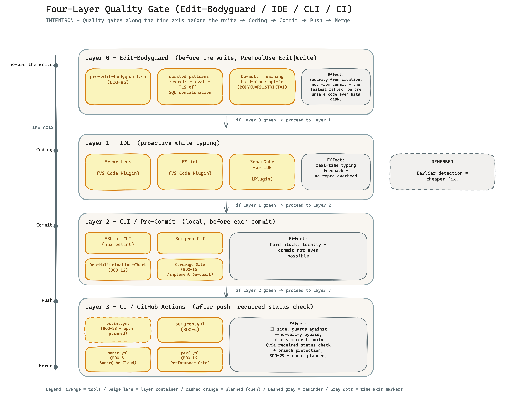

*Defense in depth across four layers: Layer 0 Edit-Bodyguard as a PreToolUse reflex that catches unsafe patterns before the AI writes them (BOO-86); IDE plugins for real-time feedback while typing; CLI tools as a hard pre-commit block; GitHub Actions as the merge gate after push. The earlier a defect is caught, the cheaper the fix. ([Excalidraw source](docs/quality-gate-four-layers.en.excalidraw))*

> **Note on the sketch caption:** The Excalidraw still shows BOO-28 as "planned". As of v3.17.0 (2026-05-12) BOO-28 is done — `migrate_boo_28()` drops `.github/workflows/eslint.yml` (Node stacks) or `.github/workflows/ruff.yml` (Python stacks) with mandatory SARIF output to `.ci-reports/` (prepares BOO-32 Hermes consumption). The PNG re-render is out of scope for this task.

**CI layer (Layer 3) — GitHub Actions:** Bootstrap drops the following workflow files stack-dependent into `.github/workflows/` — all three write SARIF to `.ci-reports/` and upload it via `github/codeql-action/upload-sarif@v3` into the GitHub Security tab.

| Workflow | Trigger | Tool | Stack | Source (BOO) |
|----------|---------|------|-------|--------------|
| `eslint.yml` | push + pull_request | ESLint (lint) | Node / JS / TS | BOO-28 |
| `ruff.yml` | push + pull_request | Ruff (lint) | Python | BOO-28 |
| `semgrep.yml` | push + pull_request on main | Semgrep (SAST) | all | BOO-4 |
| `perf.yml` | pull_request on main | autocannon / pytest-benchmark | all | BOO-16 |
| `sonar.yml` | push on main | SonarQube Cloud | all | BOO-5 |

Required status checks `ESLint`, `Ruff`, `Semgrep`, `SonarCloud` are activated via `gh api ... branches/main/protection` (BOO-29) — without a green run, no merge.

### Branch-protection setup (BOO-29)

Since v3.18.0 (2026-05-12), `/bootstrap` configures the `main` branch protection automatically in **phase 4.4k** — right after the first `git push -u origin main` (phase 4.9). The logic lives in `intentron/bootstrap/scripts/setup-branch-protection.sh`. Three points matter:

1. **Dynamic required status checks.** The script reads every workflow file under `.github/workflows/*.yml` and extracts the first `name:` field per file — that is the GitHub Actions context name. From this list it builds `required_status_checks[contexts][]`. Workflows that are missing in a given stack (e.g. `ruff.yml` in a pure Node project) are simply omitted — no hard fail.

2. **Prerequisites are checked.** Before the `gh api` call, the script verifies: `gh --version` (CLI installed?), `gh auth status` (logged in with `repo` scope?), `git remote get-url origin` (remote present?), and `gh api repos/<owner>/<repo>/branches/main` (does the remote main branch exist?). On any failure the script aborts with a clear operator message — no silent acceptance.

3. **Idempotence.** The `gh api -X PUT` call is a replace, not an append — repeated runs overwrite the protection identically. The same code path is used for existing projects (`migrate_boo_29()` in `migrate-to-v2.sh`) — one single source of truth.

The protection block as configured (1:1 from BOO-29):

```bash
gh api -X PUT "repos/${OWNER}/${REPO}/branches/main/protection" \
  -F required_status_checks[strict]=true \
  -F required_status_checks[contexts][]=<dynamic> \
  -F enforce_admins=false \
  -F required_pull_request_reviews[dismiss_stale_reviews]=true \
  -F required_pull_request_reviews[required_approving_review_count]=1 \
  -F restrictions=null \
  -F allow_force_pushes=false
```

`enforce_admins=false` is intentional — the operator (typically an admin) is allowed to push directly to `main` in emergencies. `allow_force_pushes=false` protects the git history from accidental overwrites. `dismiss_stale_reviews=true` forces every push after a review to a fresh approval round — keeping the code-review trail current.

---

## 8g. Linear setup per project (BOO-30)

The Linear team that backs a project (`B.4 == Linear`) needs two pieces of configuration beyond the default to make the issue lifecycle drive itself: a **six-state workflow** and the **GitHub integration**. Both are one-off operator tasks per project — the Linear API could automate them, but the effort/benefit ratio is poor (one-time setup, well-guided UI). This is a deliberate trade-off documented here so the operator knows exactly what is manual and what is not.

**Clear separation manual vs. automated:**
- **Manual per project (operator):** create the six workflow states + connect the GitHub integration. Steps below.
- **Automated via bootstrap:** the issue-template extension lives in `bootstrap/references/issue-writing-guidelines-template.md` (v3.1). `/bootstrap` renders `.claude/ISSUE_WRITING_GUIDELINES.md` with the mandatory `## Definition of Done` section. `migrate_boo_27()` ships the matching DoD block inside `.github/ISSUE_TEMPLATE/story.yml`. Existing projects can re-apply the extension via `migrate_boo_30()` (idempotent).

### Workflow states (1:1 from BOO-30)

The six states are the load-bearing structure. Their names are not negotiable — the GitHub integration matches on them, and the DoD checklist references the `Done` state directly. Create them in **Linear → Settings → <Team> → Workflow** in this exact order:

| State | Meaning | Auto transition |
|---|---|---|
| Backlog | Triage | initial |
| In Progress | Skill working, local gates iterating | manual |
| In Review | PR open, CI running | auto on PR open |
| QA Failed | CI red, story re-opened | manual or webhook |
| Done | PR merged, all checks green | auto on PR merge |
| Cancelled | Discarded | manual |

The three pairs are deliberate: `Backlog` ↔ `Cancelled` brackets the lifecycle (start vs. discarded), `In Progress` ↔ `In Review` brackets the work phase (local iteration vs. remote validation), `QA Failed` ↔ `Done` brackets the CI verdict (red vs. green). Skipping `QA Failed` collapses a red CI into a re-open of `In Progress` and loses the failure-frequency signal that `/sprint-review` reads.

### GitHub integration (manual operator setup)

Open **Linear → Settings → Integrations → GitHub → Connect Repository** and select the project repo. After the OAuth handshake, Linear's auto-recognition fires on four surfaces — no additional config:

- **Branch names** containing `{ISSUE_PREFIX}-XX` (e.g. `BOO-30-feature-foo` or `feature/BOO-30-foo`) link the branch to the issue automatically.
- **PR titles** containing `{ISSUE_PREFIX}-XX` link the PR to the issue and transition the state to `In Review` on PR-open.
- **Commit messages** containing `{ISSUE_PREFIX}-XX` show up in the issue activity feed.
- **PR body** containing `Closes {ISSUE_PREFIX}-XX` closes the issue (transitions to `Done`) when the PR is merged.

The auto-transitions cover the two CI-driven edges (`In Progress` → `In Review` on PR-open, `In Review` → `Done` on PR-merge). The two manual edges (`Backlog` → `In Progress`, anything → `QA Failed`) stay manual — that is the point: a red CI must trigger an operator decision, not a silent auto-revert.

### Operator checklist

- [ ] Six workflow states created in the Linear team (exact names: `Backlog`, `In Progress`, `In Review`, `QA Failed`, `Done`, `Cancelled`)
- [ ] GitHub integration connected to the project repo
- [ ] Test story with a branch `{ISSUE_PREFIX}-XX-test` created — opening the PR transitions the issue to `In Review`
- [ ] Issue-writing-guidelines (`.claude/ISSUE_WRITING_GUIDELINES.md`) checked for the v3.1 DoD section — automatic on fresh projects, run `migrate-to-v2.sh --issue BOO-30` to retro-fit existing ones

### Definition of Done (1:1 from BOO-30)

Every issue carries this checklist (rendered automatically into the template since v3.1). A story may only move to Linear state `Done` when:

```markdown
## Definition of Done (Required)

Story may only move to Linear status "Done" when:
* [ ] All local gates green (ESLint, Semgrep, tests, coverage)
* [ ] PR merged to main
* [ ] All required status checks green (see BOO-29)
* [ ] No open "QA Failed" status
* [ ] Spec file `specs/BOO-XX.md` updated with result summary (Implement Skill Step 8)
```

The items are not negotiable per story. If a gate genuinely does not apply (e.g. a doc-only story with no tests) the operator marks it `* [N/A] tests — doc-only story` rather than removing the line — preserving the audit trail.

> **Issue reference:** BOO-30. Sources: `bootstrap/references/issue-writing-guidelines-template.md` v3.1, `bootstrap/SKILL.md` phase 4.4l, `bootstrap/scripts/migrate-to-v2.sh` §`migrate_boo_30`. Migration for existing projects: `bootstrap/references/migration-checklist-v1-to-v2.en.md` §BOO-30.

---

## 8e. Skill Architecture — /ideation vs /architecture-review

`/ideation` and `/architecture-review` are the two strategic skills in the bundle. They act on different timescales and scopes — the distinction must be clear, otherwise the work doubles up or drops out.

Boundary note: The framework is primarily a sequential engineering pipeline with quality gates, not a fully autonomous developer agent. In this model, sub-agents are specialized execution helpers inside a controlled story. A Claude, Codex, or Hermes layer may use the framework agentically, but the framework itself remains the structure that constrains autonomy through intent, specs, gates, reports, and human review points.

| Dimension | `/ideation` | `/architecture-review` |
| -- | -- | -- |
| Trigger | on every new story (frequent) | periodic / before phase changes (rare) |
| Scope | ONE story | WHOLE system |
| Time horizon | next 1-2 days of coding | next weeks / months |
| L3 query | "similar stories of the last X sprints" | "trends over 12+ sprints" |
| Output | better AC + anti-pattern warning | refactoring issues + ADRs + dimension status |
| Character | proactive (before building) | reactive-structural (looking at what was built) |

### Data flow

```
ARCHITECTURE_DESIGN.md = target state
codebase               = actual state
L3 DB                  = experience store

/ideation            → reads target + experience → writes new stories
/implement           → reads detailed target → produces actual state
/architecture-review → compares target vs actual + L3 trends → updates target
/sprint-review       → writes L3 (experience)

Cycle:
  /architecture-review keeps ARCHITECTURE_DESIGN.md current
                           ↓
                       /ideation reads it
                           ↓
                       writes better stories
                           ↓
                       /implement builds them
                           ↓
                       /sprint-review aggregates
                           ↓
                       L3 DB
                           ↓
  /architecture-review ←  reads L3 + codebase for the next audit
```


*The four skills act on three data sources (`ARCHITECTURE_DESIGN.md` target state, codebase actual state, L3 DB experience store). Each sprint closes the loop: `/architecture-review` keeps the target up to date, `/ideation` writes stories against it, `/implement` produces the actual, `/sprint-review` aggregates into L3. ([Excalidraw source](docs/skill-dataflow-cycle.en.excalidraw))*


*Learning-loop storage in three levels (L1 markdown, L2 markdown with frontmatter, L3 SQLite). `/sprint-review` is the only writer (step 7, mandatory). `/ideation` reads the last 3 entries at story start (step 0.5), `/architecture-review` reads L3 trends for ADR context. The `.learning-loop` file marker selects the active level. ([Excalidraw source](docs/l3-db-readers-writers.en.excalidraw))*

---

## 8f. Performance Baseline — Pre-Production Gate vs Production Alarm

Performance regressions are caught in two places — before merge (CI gate, BOO-16) and after deploy (production alarm, BOO-14). The two mechanisms are complementary.

- **BOO-14 production alarm** (`{service}_p95_slow`): fires when p95 in production is >1 s for more than 5 minutes. Severity warning. Source: metrics endpoint per service.
- **BOO-16 pre-production gate** (`.github/workflows/perf.yml`): compares the CI bench run against the living baseline in `journal/perf-baseline.json`. Thresholds: ≤5 % difference = PASS, 5-20 % = WARN (PR comment), >20 % = FAIL (merge blocked). Override via PR label `perf-override` or commit trailer `Perf-Override: <reason>`, append-only into `journal/reports/perf/overrides.log`.

Without a pre-production gate the regression only becomes visible after deploy — the production alarm alone is therefore a too-late warning. Without a living baseline every regression would automatically become the new baseline (anti-pattern), which is why the baseline is filled manually by the operator after the first green CI run.

### Artefacts

| Artefact | Purpose | Source |
|---|---|---|
| `journal/perf-baseline.json` | Living baseline per service | Operator after the first green CI run |
| `bench/<service>.bench.js` or `bench/<service>_bench.py` | Service benchmark | `migrate_boo_16()` from template |
| `.github/workflows/perf.yml` | CI gate (≤5 % PASS, 5–20 % WARN, >20 % FAIL) | `migrate_boo_16()` |

**Reference:** Schrader Code Crash ch. 3 §Production Readiness (Gate 3: Performance Baseline). Counterpart to the production alarm `{service}_p95_slow` from BOO-14.

---

## 9. VS Code Setup

### Claude Code extension

The official Claude Code extension for VS Code integrates everything directly into your editor:

- Terminal with Claude Code directly in VS Code
- File context automatically passed to Claude
- Inline code suggestions
- Invoke `/implement` directly from the editor

**Installation:**
```
VS Code → Extensions → search "Claude Code" → Install
```

### Base plugins (always, for every stack)

Install these 3 plugins **once** — they work for all projects:

**1. ESLint** — coding rules in real time
→ https://marketplace.visualstudio.com/items?itemName=dbaeumer.vscode-eslint
- Checks your code against the rules in `eslint.config.mjs`
- Shows errors and warnings directly in the editor
- **Tie to governance:** `/implement` calls ESLint after every change — errors block the commit
- **Industry-standard rule set since BOO-2 (2026-05-01):** `eslint.config.mjs` ships with
  ESLint Recommended + Airbnb Base + `eslint-plugin-security` + `eslint-plugin-sonarjs`
  (all MIT-licensed). Python equivalent: Ruff `select` includes `S` (flake8-bandit) +
  `B` (bugbear) + `C4` (comprehensions). Templates in `bootstrap/references/file-templates.md`.

**2. SonarQube for IDE (SonarLint)** — deeper analysis
→ https://marketplace.visualstudio.com/items?itemName=SonarSource.sonarlint-vscode
- Analyzes deeper patterns: code smells, potential bugs, security vulnerabilities
- Works passively in the background — no manual start needed
- Finds what ESLint doesn't — SQL injection, hardcoded credentials, unsafe crypto
- **Connected Mode (after BOO-5 SonarQube Cloud setup):** VS Code → SonarLint → Connected Mode → SonarCloud → enter organization + project key → findings from the cloud appear inline in the IDE. Set `tools_available.sonarqube_ide_plugin: true` in `.claude/environment.json` once configured.

**3. Error Lens** — no more hiding
→ https://marketplace.visualstudio.com/items?itemName=usernamehw.errorlens
- Shows ESLint and SonarLint findings **inline** — not just on hover
- Red line = error. Yellow line = warning. Immediately visible, not ignorable.

### Global vs. per-project setup

Use this rule when a new project is bootstrapped:

| Layer | Installed how often? | Examples | Why |
|---|---:|---|---|
| **VS Code / workstation** | Once per machine | Claude Code/Codex extension, ESLint plugin, SonarQube for IDE, Error Lens, Python/Ruff extensions | Editor capabilities are shared by all projects. Bootstrap only checks and records whether they are available. |
| **Global skill source** | Once per operator, then updated deliberately | `~/.claude/skills/bootstrap/`, optional `~/.codex/skills/` | Source or registry for starting/updating projects, not the only runtime copy. |
| **Project governance** | Once per project | `CLAUDE.md`, `AGENTS.md`, `.claude/environment.json`, `GOVERNANCE.md`, `ARCHITECTURE_DESIGN.md`, `specs/`, `intents/`, `journal/`, `pitch/` | This is the project memory and audit trail. It must travel with the repository. |
| **Project skill copies** | Once per project, then pinned/updated intentionally | `.claude/skills/<skill>/`, optionally `.codex/skills/<skill>/` | Each project keeps the exact skill version it was bootstrapped with, so old projects do not change just because the global skill source changes. |

The sketch below shows the important split: the workstation provides shared capabilities, `/bootstrap` turns choices into a project contract, and the repository carries the reproducible state.


*Global setup stays global; the project contract and local skill copies travel with the repository. ([Excalidraw source](docs/bootstrap-project-tree.en.excalidraw))*

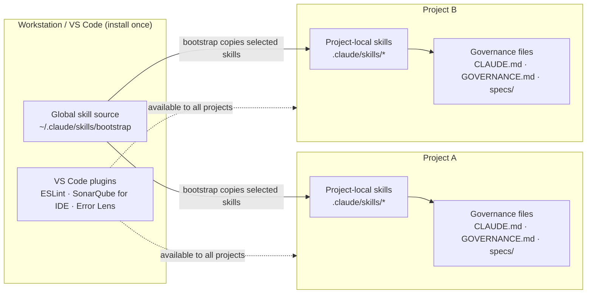

So yes: a second project does not require installing the VS Code plugins again. But the selected skills are copied into that second project's `.claude/skills/` directory again. That is deliberate. It makes the project reproducible and protects it from silent changes in the global skill source.

### Stack-specific plugins

Depending on what you're building, these get added:

**Node.js / JavaScript backend:**

→ REST Client (test API endpoints directly from VS Code)
  https://marketplace.visualstudio.com/items?itemName=humao.rest-client

**Frontend (React, Vue, Vanilla JS):**

→ Prettier — auto-format on save
  https://marketplace.visualstudio.com/items?itemName=esbenp.prettier-vscode

→ Auto Rename Tag — rename HTML tags automatically
  https://marketplace.visualstudio.com/items?itemName=formulahendry.auto-rename-tag

→ CSS Peek — jump to CSS classes straight from HTML
  https://marketplace.visualstudio.com/items?itemName=pranaygp.vscode-css-peek

**Full-Stack:**

→ Prettier — auto-format on save
  https://marketplace.visualstudio.com/items?itemName=esbenp.prettier-vscode

**Python:**

→ Python (required — the basis for everything)
  https://marketplace.visualstudio.com/items?itemName=ms-python.python

→ Black Formatter — auto-formatting
  https://marketplace.visualstudio.com/items?itemName=ms-python.black-formatter

→ Ruff — linter (modern replacement for Flake8)
  https://marketplace.visualstudio.com/items?itemName=charliermarsh.ruff

→ Error Lens
  https://marketplace.visualstudio.com/items?itemName=usernamehw.errorlens

→ SonarLint
  https://marketplace.visualstudio.com/items?itemName=SonarSource.sonarlint-vscode

→ Pylance — better autocomplete (optional)
  https://marketplace.visualstudio.com/items?itemName=ms-python.vscode-pylance

→ Jupyter — for data science / ML notebooks (optional)
  https://marketplace.visualstudio.com/items?itemName=ms-toolsai.jupyter

> **Tip:** Bootstrap gives you the appropriate links for your stack at the end of setup — just click and install. No searching needed.

**How it plays together:**
```
You type code
  → Error Lens shows ESLint + SonarLint findings inline (instantly)
  → you fix as you write

/implement runs
  → ESLint CLI runs automatically: npx eslint --max-warnings=0
  → 0 errors = gate passed → continue
  → errors present = gate blocked → fix first
```

**The rule file: `eslint.config.mjs`**

Bootstrap creates this file **automatically in the project root** — you don't have to do anything manually.
The VS Code ESLint plugin detects it the moment you open the project and activates all rules.

It contains:
- Error prevention: `no-undef`, `no-unreachable`, `use-isnan`
- Security rules: `no-eval`, `no-implied-eval`, `no-new-func`
- Quality rules: `eqeqeq`, `no-unused-vars`, `prefer-const`
- Async rules: `no-async-promise-executor`, `no-await-in-loop`
- Readability: `max-len` (120 chars), `max-depth` (5 levels)

To adjust: open `eslint.config.mjs` in the project root and add/remove rules as needed.

### ESLint for a new project

**Scenario:** you start a new project in Claude Code — the `eslint.config.mjs` doesn't exist yet.

**With Bootstrap (recommended):**
```
/bootstrap
```
Bootstrap creates the `eslint.config.mjs` automatically in phase 1 — you don't have to do anything else.
The VS Code ESLint plugin then picks it up immediately.

**Without Bootstrap (manual):**
1. Copy the `eslint.config.mjs` from an existing project into the root of the new project
2. All rules are generic — no adjustment needed for Node.js projects
3. The VS Code ESLint plugin activates automatically the next time you open the file

**Where does the file live?**
```
my-project/             ← project root (where you start claude)
├── eslint.config.mjs   ← HERE — directly in the root, not in a subfolder
├── lib/
├── agents/
└── ...
```

> **Important:** ESLint v9+ uses the new format (`eslint.config.mjs`). The old format
> (`.eslintrc.js`) is deprecated. Bootstrap always creates the new format.

### Recommended VS Code settings for governance

Create `.vscode/settings.json` in your project:

```json
{
  // Auto-format on save
  "editor.formatOnSave": true,

  // Show git blame in the status bar (GitLens)
  "gitlens.statusBar.enabled": true,
  "gitlens.currentLine.enabled": true,

  // Remove trailing whitespace
  "files.trimTrailingWhitespace": true,

  // Add a final newline
  "files.insertFinalNewline": true,

  // Terminal: project directory as default
  "terminal.integrated.cwd": "${workspaceFolder}",

  // Files to ignore
  "files.exclude": {
    "**/.git": true,
    "**/node_modules": true,
    "**/.env": true
  },

  // .env files NEVER in source control
  "git.ignoredRepositories": [],
  "dotenv.enableAutocloaking": true
}
```

### Recommended VS Code coding rules (`.editorconfig`)

Create `.editorconfig` in the project root:

```ini
# EditorConfig helps developers write consistent code
# https://editorconfig.org
root = true

[*]
indent_style = space
indent_size = 2
end_of_line = lf
charset = utf-8
trim_trailing_whitespace = true
insert_final_newline = true

[*.md]
trim_trailing_whitespace = false

[Makefile]
indent_style = tab
```

This file is **respected automatically by VS Code** (no plugin needed) and ensures
code formatting is consistent — no matter who works on the project.

---

## 10. Tailoring Governance to Your Project

### The project contract: `CONVENTIONS.md`

`CONVENTIONS.md` is the project-local contract between the operator, the AI tool and the repository. It is created by `/bootstrap` once per project and then read by the downstream skills. It does **not** reinstall skills; it tells the already installed project-local skill copies how strict this project wants to operate.

The bundle-level `intentron/CONVENTIONS.md` is the framework specification. The project-level `CONVENTIONS.md` is the adaptation for one repository: selected mode, selected isolation strategy and active gates.

| Question | Answer in `CONVENTIONS.md` |
|---|---|
| How much governance does this project need? | `governance_mode` |
| May sub-agents work in parallel? | `execution_isolation` |
| Do we need Git worktrees? | `git-worktree` in the isolation strategy |
| Which gates are active? | gate table |
| Is this framework autonomous? | no: it is a sequential engineering pipeline with quality gates |

### Backlog record and tool adapter

The framework deliberately talks about a **backlog record**, not necessarily a Linear issue. A backlog record is the neutral story contract: ID/prefix, intent, context, acceptance criteria, definition of done, `execution_mode`, `execution_isolation`, `write_scopes`, risks, and references to specs or ADRs. Linear is the recommended adapter because its workflow, labels, GitHub integration, and API fit well. GitHub Issues, Microsoft Planner, or a Markdown backlog can carry the same record just as well, as long as the mandatory fields and gates are preserved.

The adapter rule: the tool may look different, the record may not. When an adapter doesn't natively know a field, it goes into the body, frontmatter, or a linked spec. Skills read the neutral record first and only then translate into Linear-, GitHub-, or Markdown-specific actions. That's why "no Linear" is not a framework break; "no backlog record" is.

### Governance modes: lite, standard, heavy

`/bootstrap` asks for this mode during setup in block A.5. If people say "light mode", they mean the technical value `lite`.

Terminology: the technical config value is `lite`; in plain language this means "light governance". `none` is not a governance mode. `none` belongs to execution isolation and means "no parallel-agent isolation".

| Mode | Use when | Typical checks |
|---|---|---|
| `lite` | learning projects, throwaway scripts, early experiments | `CLAUDE.md`/`AGENTS.md`, `CONVENTIONS.md`, specs, basic lint/test |
| `standard` | normal product development | spec gate, issue quality gate, architecture/security baseline, lint/test, sprint review |
| `heavy` | production, regulated or security-sensitive work | all standard gates plus extended security, compliance, architecture evidence, stricter reports |

The mode is not a maturity badge. It is a cost-control decision. Too little governance makes AI coding brittle; too much governance slows a small experiment down. `/bootstrap` proposes `standard` as the default because it is the useful middle: enough safety for real projects, not yet enterprise ceremony.

### What gets left out?

| Area | `lite` | `standard` | `heavy` |
|---|---|---|---|
| Core context | included: `CLAUDE.md`/`AGENTS.md`, `CONVENTIONS.md`, `GOVERNANCE.md`, `specs/`, basic `README`/index | included | included |
| Skills | minimal: `/bootstrap`, `/ideation`, `/implement`; reviews can be installed but are not heavy gates | normal set: `/ideation`, `/implement`, `/architecture-review`, `/sprint-review`, `/pitch` | normal set plus stricter use of `/security-architect`, deeper reviews and audit routines |
| Issue/spec discipline | spec required, small template allowed | full issue quality gate + spec gate | full issue quality gate + stronger evidence and review notes |
| Security | basic secrets and dependency hygiene | SAST/lint/security baseline, sensitive paths | mandatory security review for sensitive areas, stronger audit trail |
| Testing/linting | basic lint/test only; coverage may be advisory | lint/test mandatory; coverage recommended or active when configured | coverage gate active, regression checks expected |
| Architecture docs | lightweight architecture note is enough | `ARCHITECTURE_DESIGN.md`, ADRs and review cadence | architecture evidence, ADR completeness and review proof expected |
| CI/CD | optional; local gates are enough for small weekend projects | CI lint/SAST recommended/default when GitHub exists | branch protection, required status checks, CI reports |
| Performance/observability | usually omitted unless the project needs it | baseline observability and performance docs when relevant | performance budgets, SLOs, observability and reports expected |
| Learning loop | optional or L1 notes | L1 default, L2 optional | L2/L3 expected for long-running systems |
| Worktrees | not required; default isolation `none` | write scopes for sub-agents | `git-worktree` required for agentic/parallel lanes |

In other words: `lite` is the "I want to build something this weekend" mode. It keeps the framework's spine: context, convention, spec, basic gates. It deliberately leaves out the expensive parts: heavy CI, SonarQube, branch protection, performance baselines, audit trails and mandatory deep reviews. You can still add any of them later without changing frameworks.


*Same framework, different friction budget. Lite keeps the spine; Standard adds product-grade gates; Heavy adds production and audit evidence. ([Excalidraw source](docs/governance-modes.en.excalidraw))*

### Execution isolation and worktrees

`execution_isolation` decides how parallel AI work is allowed to touch the repository.

| Strategy | Meaning | Allowed execution modes |
|---|---|---|
| `none` | one operator or one AI lane edits the current worktree | `linear` |
| `write-scope` | sub-agents may run, but each gets explicit allowed paths | `linear`, `sub-agents` |
| `git-worktree` | each parallel lane gets its own Git worktree and branch | `linear`, `sub-agents`, `agentic` |

This is where worktrees enter the framework. They are not needed for every story. They become mandatory when the framework is used in an agentic way: one developer-agent receives backlog/context and runs multiple lanes. For normal sequential work, the spec gate and write scopes are enough. For true agentic execution, worktrees prevent parallel agents from overwriting each other and give the integration owner a clean merge point.

Codex note: Codex may still break the story into an internal plan, task list and sandboxed steps. That is not a governance violation. The boundary is write behavior: `linear` means one sequential write lane, `sub-agents` means scoped helper lanes, and `agentic` means isolated worktree lanes. The optional story field `codex_execution_hint` can suggest `single-agent`, `parallel-workers` or `worktree-required`, but it never overrides `execution_mode`, `execution_isolation`, `write_scopes` or the gates.


*Execution isolation maps story autonomy to technical separation: one lane, scoped sub-agents, or separate worktrees. ([Excalidraw source](docs/execution-isolation-worktrees.en.excalidraw))*

### Which skill uses which convention?

| Skill | Role |
|---|---|
| `/bootstrap` | creates the project-local `CONVENTIONS.md` and writes default mode/isolation into `.claude/environment.json` |
| `/ideation` | derives `execution_mode`, `worktree_strategy` and `write_scopes` for the story |
| `/implement` | hard-stops when `execution_mode` and isolation strategy conflict |
| `/architecture-review` | checks whether parallel execution is architecturally safe |
| `/sprint-review` | detects governance drift: project says one thing, team practiced another |
| Tool adapters (Codex, Cursor, Aider, local LLMs) | read the same contract and map it to their own execution model |

### Sketch status

The new conventions now have dedicated OWLIST sketches for governance modes, execution isolation, project structure, runtime adapters, validation loops, provider checks, and upgrade paths:

| Sketch | Status | Files |
|---|---|---|
| Governance modes | done | `docs/governance-modes.en.png` / `docs/governance-modes.en.excalidraw` |
| Execution isolation | done | `docs/execution-isolation-worktrees.en.png` / `docs/execution-isolation-worktrees.en.excalidraw` |
| Bootstrap tree | done | `docs/bootstrap-project-tree.en.png` / `docs/bootstrap-project-tree.en.excalidraw` |
| Codex artifact map | done | `docs/artifact-map-codex.en.excalidraw` |
| Cross-tool artifact map | done | `docs/artifact-map-cross-tool.en.excalidraw` |
| Runtime decision tree | done | `docs/runtime-decision-tree.en.excalidraw` |
| Backlog record / adapter model | done | `docs/backlog-record-adapter-model.en.excalidraw` |
| Validate-Fix-Learn loop | done | `docs/validate-fix-learn.en.excalidraw` |
| Provider postflight matrix | done | `docs/provider-postflight-matrix.en.excalidraw` |
| Upgrade path for existing projects | done | `docs/upgrade-path-existing-projects.en.excalidraw` |
| Quality-gate layer update | still open | add governance intensity to the existing quality-gate sketch |

### Provider Postflight And Upgrade

Bootstrap treats provider readiness as a separate postflight dimension. A local skill copy is not enough for `OK`: GitHub, backlog adapters, Research, Visualize/Miro, Monitoring and Obsidian each get `OK`, `WARN`, `SKIP` or `FAIL` with a next action. The operational contract is in `bootstrap/references/provider-postflight.en.md`.

Existing projects use the upgrade path in `bootstrap/references/framework-upgrade.en.md`: `inspect`, `apply-safe`, `apply-with-confirmation`. The upgrade report can be written to `journal/reports/framework-upgrade/YYYY-MM-DD.md` and uses release notes from `docs/releases/` as migration input.

### The central config file: `lib/config.js`

Everything runs through a single file — the **Single Source of Truth (SSoT)** principle.

```javascript
// lib/config.js — example structure after bootstrap

module.exports = {
  // Project identity
  PROJECT_NAME: 'MyShop',
  VERSION: '1.0.0',           // ← This number drives ALL version numbers

  // Linear integration
  LINEAR_TEAM: 'MyShop',
  LINEAR_PREFIX: 'SHOP',

  // Documentation files (auto-checked against VERSION)
  DOC_FILES: [
    { path: 'SYSTEM_ARCHITECTURE.md', versionPattern: /\*\*Version:\*\*\s*([\d.]+)/ },
    { path: 'CHANGELOG.md', versionPattern: /## v([\d.]+)/ },
    // more docs...
  ],

  // Your own configurations
  APP: { port: 3000, environment: 'development' }
};
```

**Most important rule:** When you bump `VERSION`, all `DOC_FILES` must be updated to the new
version. The doc-version-sync hook enforces this automatically.

### Customizing CLAUDE.md — getting to know Claude

The `CLAUDE.md` is the core. Here you tell Claude who they are:

```markdown
# My Project — Context File

## Who are you?

You are the lead developer for MyShop — an e-commerce site for handmade products.
[Describe your project in 3-5 sentences]

## Your task

1. [Main task 1]
2. [Main task 2]
3. Always keep documentation up to date

## The system

[Describe the architecture in broad strokes]

## Rules

- NEVER change code without a backlog record or adapter story
- NEVER forget the spec file
- [Your own rules]
```

**The better you fill this in, the better Claude knows your project.**

### Customizing the issue prefix

Bootstrap creates everything with your chosen prefix. Examples:

- E-commerce shop: `SHOP-`
- Mobile app: `APP-`
- API service: `API-`
- Marketing tool: `MKT-`

### Custom skills

With `/skill-creator` you can build project-specific workflows:

```
/skill-creator

"I want a skill that compares our product prices to competitors daily
 and creates a report."

→ Claude creates /price-monitor skill with the right workflow
```

---

## 11. Daily Usage — A Typical Workflow


*Morning · feature · bugfix · end of week — skills in action. ([Excalidraw source](docs/daily-workflow.en.excalidraw))*

### Morning: what's on?

```bash
cd ~/my-project
claude

/status
/backlog
```

Claude shows: open issues, system health, what happened recently.

### Build a feature

```
Step 1 — Formalize the idea:
/ideation
→ "I want to build X because..."
→ Claude creates SHOP-XX in Linear

Step 2 — Implement:
/implement SHOP-XX
→ Claude shows plan → You approve → code is written
→ Automatically: tests, git push, Backlog Record / adapter issue closed

Step 3 — Verify:
/integration-test
→ All checks green? Good.
```

> **Governance v2 — Issue Quality Gate:** Every issue requires 5 mandatory sections before `/implement` runs: *Schrader Prompt Components* (Insight, Constraints, Success Criteria, Desired Outcome), *Definition of Done*, and *Execution Mode* (agentic / sub-agents / linear). `/implement` Step 1b blocks with a hard stop if any Schrader component is missing. See `bootstrap/references/issue-writing-guidelines-template.md` for the full template.

### A bug appeared?

```
/breakfix
→ Describe the problem
→ Claude diagnoses
→ Implement fix
→ Incident documented
→ Preventive measure installed
```

### End of the week

```
/sprint-review
→ What did we do this week?
→ What's tech debt?
→ Priorities for next week
```

### Example: a complete day

```
09:00  /status          → All green, 3 open issues
09:05  /backlog         → SHOP-38 has highest priority (payment bug)
09:10  /implement SHOP-38
09:12  → Claude shows plan: "Implement session token refresh"
09:13  → You: "Yes, go"
09:25  → Code implemented, tested, pushed, issue closed
09:30  /integration-test → All 12 checks green
10:00  /ideation        → New idea: newsletter system
10:15  → SHOP-55 created in Linear
11:00  /implement SHOP-55
...
17:00  /sprint-review   → Week review
```

---

## 12. FAQ

For concrete day-to-day questions that should stay short and easy to extend, also see the living Q&A document: [`docs/qa.md`](docs/qa.md).

### "I'm not a developer. Does this still work for me?"

Yes. Skills are designed so you don't need deep technical knowledge. You describe what you
want in natural language — Claude handles the technical implementation. Governance makes
sure the approach is still structured and safe.

### "What if I make a mistake and something breaks?"

That's what `/breakfix` is for. And because every change is in Git, every step can be undone:

```bash
git revert HEAD
git log --oneline     # → shows all commits
git checkout <hash>   # → go back to this state
```

### "Do I really have to create an issue for every small feature?"

For tiny typos: no. For anything that takes more than 10 minutes: yes.

The effort for an issue is 2 minutes with `/ideation`. The effort for an undocumented feature
that causes problems in 3 months: hours.

### "Can I have multiple projects?"

Yes. Bootstrap sets up a self-contained environment for each project. Claude Code knows which
project is active based on the working directory.

### "What does this cost?"

| Service | Cost |
|---------|------|
| Claude Code CLI | Included in Claude Pro |
| GitHub | Free |
| Linear | Free (hobby plan) |
| OpenRouter | Pay-as-you-go (~$0.001/request) |
| Telegram bot | Free |

For a small project: **$0 to ~$5/month.**

### "What if I find the governance rules annoying?"

All guardrails have a `--no-verify` bypass. You can skip them — but consciously.

The goal isn't control, it's **deliberate action**. If you know "I'm breaking this rule right
now because X," that's good. If you break rules accidentally without noticing — that's the
problem governance prevents.

### What is the Claude Agent SDK — do I need to migrate?

The **Claude Agent SDK** (`@anthropic-ai/claude-agent-sdk`) is the renamed successor package to
`@anthropic-ai/claude-code` (npm) and `claude-code-sdk` (pip). It's a rebranding with some
breaking changes in v0.1.0.

**Who needs to migrate?**

| Use case | Migration needed? |
|----------|-------------------|
| Using Claude Code as **CLI tool** (`claude` in terminal, skills, hooks) | **No** — nothing to do |
| Importing Claude Code as **library** in your own code | **Yes** — rename package and imports |

**The INTENTRON and this handbook use Claude Code exclusively as a CLI tool.**
If you use `/bootstrap`, `/implement`, or other skills, you are **not affected**.

Only if you build your own apps importing `@anthropic-ai/claude-code` or `claude-code-sdk`
programmatically do you need to migrate:

```bash
npm uninstall @anthropic-ai/claude-code
npm install @anthropic-ai/claude-agent-sdk
```

```typescript
// Before
import { query } from "@anthropic-ai/claude-code";
// After
import { query } from "@anthropic-ai/claude-agent-sdk";
```

Three breaking changes in v0.1.0:
- System prompt no longer auto-loaded
- Settings sources no longer auto-read
- Python: `ClaudeCodeOptions` → `ClaudeAgentOptions`

Migration guide: https://platform.claude.com/docs/en/agent-sdk/migration-guide

### "How do I update skills when new versions come out?"

```bash
# Update only bootstrap (same as first time)
cd /tmp
git clone --filter=blob:none --sparse https://github.com/vibercoder79/intentron.git intentron
cd intentron
git sparse-checkout set bootstrap
cp -r bootstrap ~/.claude/skills/
cd /tmp && rm -rf intentron

# In Claude Code: bootstrap can update existing skills
/bootstrap --update
```

### Upgrade path for existing projects

Existing projects are not overwritten blindly. A framework upgrade follows three stages:

1. **inspect:** read the current project contract (`CONVENTIONS.md`, `CLAUDE.md`/`AGENTS.md`,
   `.claude/environment.json`, specs, hooks, workflows, backlog adapter) and output the deltas to
   the new framework state as a diff or checklist.
2. **apply-safe:** apply only additive, idempotent changes automatically — e.g. new optional
   templates, missing documentation sections, new ignored report folders, or backlog fields,
   without changing existing content.
3. **apply-with-confirmation:** anything that changes existing rules, hooks, CI, issue templates,
   branch protection, governance mode, adapter config, or skill versions needs explicit operator
   confirmation.

The principle: framework versions may make a project harder or clearer, but not silently
reinterpret it. When an existing project deliberately deviates from the new recommendation, the
deviation is documented instead of overwritten.

The operational flow is described in `bootstrap/references/framework-upgrade.md`. Before the upgrade
the release notes in `docs/releases/` are read; the report documents old/new version, updated
skills, newly created files, deliberately not-overwritten files, manual TODOs, and provider
postflight.

---

## 13. Appendices — signpost

The handbook has 25 appendices (A–Y). They are a **reference and deep-dive layer** — you don't need to read them front to back. This table tells you **when which appendix is relevant**. A–M are the foundations/tooling layer, N–Y the themes from v0.2.0 onward (waves J–AG, through v0.6.x): efficiency, privacy, deployment, scaling, verification, edit bodyguard, contribute-back, ubiquitous language, VPS/cloud team runbook.

| Appendix | Topic | When relevant |
|----------|-------|---------------|
| **A** | Pre-bootstrap checklist | before you set up your first project |
| **B** | Key files — cheat sheet | look up which file does what |
| **C** | Glossary | clarify terms |
| **D** | Hermes bridge (`metadata.hermes`) | wire skills to Hermes |
| **E** | Reports convention (`journal/reports/`) | where run reports land |
| **F** | Hermes compound-layer setup | integrate Hermes deeper |
| **G** | Sprint-sizing mechanics (token window) | cut sprints by token budget |
| **H** | Lighthouse CI (frontend performance) | frontend project with a perf gate |
| **I** | Self-hosted runner setup | run your own CI runners |
| **J** | Onboarding the framework under Codex | Codex / another AI as runtime |
| **K** | Tool adapters (other AI tools) | Cursor / Aider / local LLMs / Codex reference |
| **L** | 4P pipeline mapping (pitch phase) | pitch as a closed phase |
| **M** | Schrader decoder | relation to the book *Code Crash* |
| **N** | Token-efficiency policy | model routing + caching, cut cost |
| **O** | Privacy by design (DPO) | personal data / GDPR |
| **P** | Deployment scenarios | choose Solo-Mac / VPS / team server |
| **Q** | Sovereignty stack | EU / regulated industry, EU alternatives |
| **R** | Multi-operator coordination | 5–20+ developers in one repo + vault harvest |
| **S** | Skill installation strategy | where skills / tools / hooks belong |
| **T** | Post-install verification | "does my setup work?" + E2E trial |
| **U** | Multi-project operation | several projects on one machine |
| **V** | Layer 0 — Edit-Bodyguard | catch secrets/unsafe patterns before they are written |
| **W** | Contribute-back loop | hand a field fix to governance artifacts back to the source |
| **X** | CONTEXT.md — ubiquitous language | set canonical + forbidden vocabulary, bind compliance terms to their legal basis |
| **Y** | VPS/cloud team runbook | INTENTRON on a shared developer VPS, multi-project, team |

---

## Appendix A: Pre-bootstrap checklist

```
Before /bootstrap:

SOFTWARE:
☐ Node.js v18+ installed (node --version)
☐ Git installed (git --version)
☐ Claude Code installed (claude --version)

ACCOUNTS:
☐ Anthropic account + API key
☐ GitHub account + SSH key set up (ssh -T git@github.com)
☐ Linear account + API key (optional but recommended)

INFORMATION READY:
☐ Project name (e.g. "MyShop")
☐ Short project description (1–2 sentences)
☐ Desired project path
☐ GitHub repository URL (new empty repo created)
☐ Linear team name (if used)
☐ Desired issue prefix (e.g. "SHOP")

BOOTSTRAP SKILL:
☐ /root/.claude/skills/bootstrap/ present
☐ SKILL.md visible in this folder
```

## Appendix B: Important files cheat sheet

| File | Purpose | When to touch |
|------|---------|----------------|
| `CLAUDE.md` | AI personality & rules | Setup, big changes |
| `lib/config.js` | All configurations | Version bumps, new settings |
| `specs/TEMPLATE.md` | Story template | Reference |
| `specs/ISSUE-XX.md` | Story spec | Before every implementation |
| `CHANGELOG.md` | What changed when | Auto by `/implement` |
| `API_INVENTORY.md` | All external APIs | On every new API integration |
| `.env` | API keys & secrets | Initial + on new keys |
| `journal/` | All logs & incidents | Read only / written by tools |

## Appendix C: Glossary

| Term | Meaning |
|------|---------|
| **SSoT** | Single Source of Truth — one authoritative source per information |
| **Governance** | Rules and processes that keep a system healthy |
| **Spec** | Spec file — short doc describing what and why is being built |
| **Issue** | A task/story in Linear |
| **Git hook** | Automatic check that runs on Git commands |
| **Self-healing** | System that detects and (when possible) fixes problems itself |
| **Daemon** | A process running continuously in the background |
| **Vibe coding** | AI-assisted development where AI writes most of the code |
| **Artifact** | File with a defined purpose in the governance framework (docs, hooks, specs, scripts) |

---

## Appendix D: Hermes-Bridge — `metadata.hermes` block (BOO-31)

The INTENTRON is designed to dock with [Hermes](https://hermes-agent.nousresearch.com/) — a Compound-Engineering layer that reads CI outputs across projects, detects recurring patterns, and proposes patches as PRs. Hermes is **optional**: if you do not install Hermes, all skills work as before. If you do install Hermes, the skills are prepared so that Hermes can route between them without inference.

Every bundle skill carries a `metadata.hermes` block in its YAML frontmatter. Hermes reads this block when scanning the skill catalog and uses it for routing, cross-skill memory, and toolset-dependency checks.

### Schema

```yaml
metadata:
  hermes:
    category: <governance | coding | doku | research | trading | personal-assistant>
    tags: [<tag1>, <tag2>, ...]
    requires_toolsets: [<toolset1>, <toolset2>, ...]
    related_skills: [<other-skill>, ...]
```

- **category** — Coarse classification. Hermes uses this for top-level routing.
- **tags** — Fine-grained capability tags. Free-form; Hermes uses them for full-text search.
- **requires_toolsets** — External tools or MCP servers the skill needs at runtime (e.g. `terminal`, `git`, `github`, `linear`, `sonarqube`, `obsidian`, `eslint`, `semgrep`, `grafana-mcp`, `ssh`, `mermaid`).
- **related_skills** — Other skills in the same workflow chain. Hermes uses this to chain skill invocations or surface relevant context.

### Bundle skill mapping

| Skill | category | tags | requires_toolsets | related_skills |
|---|---|---|---|---|
| `bootstrap` | governance | setup, project-init, governance-config | terminal, git, github, obsidian | (none — setup skill) |
| `intent` | governance | intent-definition, perceive, anti-pattern-check | terminal, obsidian | ideation, backlog |
| `ideation` | coding | story-writing, spec-writing, intent-gate | terminal, git, linear, obsidian | intent, backlog, implement |
| `backlog` | coding | linear, m365, intent-label, prioritization | linear, github, terminal | ideation, intent |
| `implement` | coding | code-generation, deklarativer-modus, quality-gates | terminal, git, eslint, semgrep | ideation, sprint-review |
| `architecture-review` | governance | review, dimensions, ki-tauglichkeit | terminal, git, sonarqube | sprint-review, ideation |
| `sprint-review` | governance | retro, lessons-loop, anti-pattern-check | terminal, git, sonarqube, linear | implement, architecture-review |
| `cloud-system-engineer` | coding | infra, vps, hostinger | terminal, ssh | bootstrap |
| `grafana` | coding | observability, dashboards | terminal, grafana-mcp | architecture-review, sprint-review |
| `visualize` | doku | diagrams, system-architecture | terminal, mermaid | architecture-review |

### Backward compatibility

The `metadata.hermes` block is additive — claude-skills without Hermes simply ignore it (YAML parser accepts unknown frontmatter keys). No breaking change for non-Hermes users.

---

## Appendix E: Reports convention — `journal/reports/` (BOO-32)

For Hermes (or any external analyser) to read tool outputs across projects, every project follows the same `journal/reports/` layout. Two sub-trees: `local/` for `/implement` runs (BOO-36), `ci/` for GitHub Actions runs (this section).

### Directory layout

```
journal/
├── learnings.md                    ← L1
├── sprint-{date}.md                ← L2
├── learnings.db                    ← L3
└── reports/
    ├── local/
    │   └── {YYYY-MM-DD_HHMM}_{STORY-ID}/   ← BOO-36
    │       ├── eslint-iter{N}.sarif
    │       ├── tests-final.junit.xml
    │       ├── coverage-final.json
    │       ├── semgrep-final.sarif
    │       └── meta.json
    └── ci/
        └── run-{github-action-id}/          ← BOO-32
            ├── eslint.sarif
            ├── tests.junit.xml
            ├── coverage.lcov
            ├── coverage.json
            ├── semgrep.sarif
            └── sonarqube.json
```

`journal/reports/` is gitignored — reports are short-lived signal, not source of truth. CI runs upload the whole `run-{id}/` directory as GitHub Actions artifact (retention 30 days), local runs stay on the operator's machine until `/sprint-review` aggregates them.

### Tool mapping

| Tool | Format | File name | Producing step |
|---|---|---|---|
| ESLint | SARIF | `eslint.sarif` | `npx eslint . --format @microsoft/eslint-formatter-sarif --output-file ...` |
| Ruff | SARIF | `eslint.sarif` (or `ruff.sarif`) | `ruff check --output-format sarif --output-file ...` |
| Tests (Vitest / Jest) | JUnit XML | `tests.junit.xml` | Vitest `--reporter=junit`, Jest with `jest-junit` |
| Tests (pytest) | JUnit XML | `tests.junit.xml` | `pytest --junit-xml=...` |
| Coverage (Vitest / Jest) | LCOV + JSON | `coverage.lcov` + `coverage.json` | built-in coverage reporter |
| Semgrep | SARIF | `semgrep.sarif` | `semgrep --sarif --output ...` |
| SonarQube | JSON (Web-API) | `sonarqube.json` | post-run fetch from SonarCloud API |
| Performance bench | JSON | `perf.json` (per service) | autocannon / pytest-benchmark, see BOO-16 |

### Aggregator step in every CI workflow

Every workflow that runs a tool ends with two steps: collect-into-`run-{id}/` and upload-artifact. Template:

```yaml
- name: Collect reports
  if: always()
  run: |
    mkdir -p journal/reports/ci/run-${{ github.run_id }}
    # move tool-specific output into the run directory:
    cp -f .ci-reports/eslint.sarif journal/reports/ci/run-${{ github.run_id }}/ 2>/dev/null || true
    # repeat per tool produced in this workflow

- name: Upload reports as artifact
  if: always()
  uses: actions/upload-artifact@v4
  with:
    name: ci-reports-${{ github.run_id }}
    path: journal/reports/ci/run-${{ github.run_id }}/
    retention-days: 30
```

`if: always()` ensures reports upload even when the gate fails — failure-signal is more valuable than success-signal for pattern detection.

### Hermes consumption

Hermes installation includes a fetch script (out of scope for this bundle — see Hermes docs) that pulls artifacts from GitHub via the API, unpacks them into `~/.hermes/cache/{project}/run-{id}/`, and feeds them to the pattern detector. Because every project uses the same layout, Hermes needs only one parser per tool, not per project.

### Migration for existing projects

See `bootstrap/references/migration-checklist-v1-to-v2.md` §BOO-32 — primarily: add the aggregator + upload-artifact steps to existing workflows, add `journal/reports/ci/` to `.gitignore`.

---

## Appendix F: Hermes Compound-Layer setup (BOO-33)

Hermes is the optional Compound-Engineering layer that reads CI outputs across projects (Appendix E), detects recurring patterns over many sprints, and proposes patches as PRs. Hermes is **not part of the bundle** — it lives on a separate machine (VPS or workstation), reads the skill catalog via `metadata.hermes` (Appendix D), and the report layout under `journal/reports/`.

### 1. VPS choice

| Option | Pros | Cons |
|---|---|---|
| **Piggyback on existing VPS** (e.g. shared with another service) | cheap, fast start | RAM contention, no failure isolation |
| **Dedicated Hermes VPS** (Hostinger KVM 4–8 GB, ~5–10 EUR/month) | clean failure domain, easy scaling | one more bill, separate ops |

Recommendation: piggyback for the pilot phase; dedicated VPS once Hermes runs against more than one production project.

### 2. Installation

```bash
# On the VPS (Linux):
curl -fsSL https://raw.githubusercontent.com/NousResearch/hermes-agent/main/scripts/install.sh | bash

# Verify:
hermes --version
```

### 3. Claude Max-Plan auth (avoid double billing)

```bash
# Locally on the Mac (browser needed):
claude setup-token
# → outputs a 1-year OAuth token

# On the VPS:
echo "CLAUDE_CODE_OAUTH_TOKEN=<token>" >> ~/.hermes/.env

# IMPORTANT: do NOT set ANTHROPIC_API_KEY — otherwise pay-per-token billing kicks in
```

### 4. Memory DB init

```bash
hermes setup
# Provider: anthropic via OAuth token (Max plan)
# Memory backend: SQLite + FTS5 (default)
# Honcho user modelling: yes
```

### 5. Approval gate (MANDATORY)

```bash
hermes config set skill_manage.require_approval true
hermes config set skill_manage.pr_target main
```

Reason: without an approval gate, Hermes drifts (Misevolution-Paper). Hard requirement — never disable.

### 6. Cron schedule

```bash
# /etc/crontab or crontab -e on the Hermes VPS:
0 3 * * * cd /home/hermes && hermes run-loop --mode=compound 2>&1 | logger -t hermes
```

3 a.m.: pulls repos, analyses sprint outputs, generates patches as PRs.

### 7. Health check

`scripts/hermes-healthcheck.sh` (template — implement on Hermes VPS):

```bash
#!/usr/bin/env bash
set -euo pipefail
hermes status               # daemon running?
[[ -r ~/.hermes/memory.db ]] || { echo "memory DB unreadable"; exit 1; }
hermes auth verify          # OAuth token still valid?
cd ~/skills && git pull --ff-only  # skill catalog reachable?
echo "OK"
```

Run via cron every 6 h; alert on non-zero exit.

### 8. Troubleshooting

| Symptom | Likely cause | Fix |
|---|---|---|
| `rate limit` | Max-plan 5-hour window exhausted | wait, or split into smaller runs |
| `skill not found` | `metadata.hermes` frontmatter missing | run `git pull` in skills repo (see BOO-31) |
| `no patterns` | CI reports path wrong | verify `journal/reports/ci/` layout (see BOO-32 + Appendix E) |
| `OAuth expired` | 1-year token rotated out | re-run `claude setup-token` on the Mac, copy fresh token to `~/.hermes/.env` |
| `PR not opened` | approval gate blocking | check `hermes config get skill_manage.require_approval` — should be `true` |

### Related sections

- Appendix D — `metadata.hermes` block schema (BOO-31)
- Appendix E — `journal/reports/` convention (BOO-32)
- Hermes docs: https://hermes-agent.nousresearch.com/docs/

---

## Appendix G: Sprint-sizing mechanics — token-window-based (BOO-38)

### Why the classic sprint-sizing is dead

Classic sprint sizing in hours or days doesn't work well for AI-assisted coding. One hour of AI coding can produce zero or 200 lines — complexity isn't the right axis. Velocity tracking turns story points into fetishes; the metric eats its purpose (Schrader, Code Crash ch. 2 §Velocity obsession). We need a model-independent sprint box that operationalises a single question: "Does this fit into one Claude session without compaction?"

### Sprint = 80% of the context window

A sprint is the work that fits into **80% of the current model's context window** without triggering compaction. Model-independent: 80% is the rule whether the window is 200k or 1M tokens. At 80%+ the sprint closes — start a new chat or run `/clear` + `/compact`.

### Story points — dual function

| SP | Sprint-budget share | Tokens @ 200k | Typical content | Execution mode |
|---|---|---|---|---|
| 1 | ~5% | ~8k | 1–2 files, < 50 lines | linear |
| 2 | ~10–15% | ~16–24k | single-file refactor, ~200 lines | linear / sub-agents |
| 3 | ~20–30% | ~32–48k | feature in one session, multiple files + tests | sub-agents |
| 5 | ~40–60% | ~64–96k | full-window story, browse + implement + test + docs | agentic |
| 8 | over 60% of budget | — | **must be split** | — |

Story points are used dually:
1. **Token estimate** — does this story fit the sprint budget?
2. **Execution-mode selector** — linear (small, direct), sub-agents (medium, focused delegations), agentic (large, parallel sub-agents)

### No velocity tracking

No velocity KPIs, no SP-per-sprint statistics, no burndown charts. From Schrader's own argument:

> "Story points and velocity have had their day. They measure how much work is done. We have to measure whether the work has impact." (Code Crash ch. 8 §Intent metrics dashboard)

Outcome tracking instead: intent fulfilment (BOO-1 + BOO-10) and quality-gate compliance (BOO-15/16/17).

### Sub-agent as token multiplier

Stories run in `agentic` mode consume only briefing + reports in the main context (~15–20k), not the full 64–96k. The orchestrator rule from CLAUDE.md is therefore not just methodology, it is **token mathematics**: without sub-agent delegation three large stories already exceed the 80% budget.

### Threshold configuration

In `.claude/environment.json`:

```json
{
  "thresholds": {
    "token_warn_threshold": 70,
    "token_hard_threshold": 80
  }
}
```

Two-stage warning model:
- **70% warn:** soft hint — "one small story may still fit"
- **80% hard:** sprint-close recommendation; user can override with conscious decision

Pre-flight check in `/implement` step 0b enforces this (see BOO-40).

### Estimation source: `/ideation`

`/ideation` step 5b runs a token heuristic against the story description and writes the estimate into the spec frontmatter:

```yaml
---
story_id: BOO-XX
estimate: 3
token_estimate: 38000
execution_mode: sub-agents
estimation_basis: |
  4 files (~8k), ~250 lines diff (~5k), test extension (+30%),
  HANDBOOK update (+20%), 2 similar stories in L3 (factor 0.9)
---
```

`estimation_basis` is prose so the operator can sanity-check + override the estimate. See BOO-39 for the heuristic signals.

### L3 calibration

After 5–10 sprints, the L3 learnings DB contains actual token usage per story. `/ideation` reads this and calibrates the heuristic: similar past stories shift the multiplier. Self-correcting estimation over time.

---

## Appendix H: Lighthouse-CI integration for frontend performance (BOO-45)

Counterpart to BOO-16's performance gate for backend services. For browser apps (frontend or full-stack with frontend share), Lighthouse CI measures real user metrics (LCP, CLS, TBT, Bundle-Size) and enforces budgets — same idea as BOO-16's p95 baseline, different signal source.

### When does the bundle scaffold Lighthouse?

`/bootstrap` Block A.1b asks the question only when `STACK_CHOICE` is `b` (frontend) or `c` (full-stack). For pure backend stacks the question doesn't appear — Lighthouse needs a browser-renderable URL.

### Files scaffolded

1. **`lighthouserc.json`** — performance budgets (LCP <2.5s, CLS <0.1, TBT <300ms, accessibility ≥0.9, performance ≥0.9). Template in `bootstrap/references/file-templates.en.md` §`lighthouserc.json (BOO-45)`.
2. **`.github/workflows/lighthouse.yml`** — runs on every push + PR via `treosh/lighthouse-ci-action@v12`. Builds frontend, starts preview server, runs Lighthouse, writes reports to `journal/reports/ci/run-{id}/` (BOO-32 convention).

### Manual operator tasks at setup

1. **URL per environment** — `ci.collect.url` in `lighthouserc.json`. The default `http://localhost:3000/` is for the first smoke test only. Enter the actual preview-deploy / staging / prod URL.
2. **Performance budgets** — defaults are industry-typical. Tighten or loosen based on third-party code reality (analytics, ads inflate metrics).
3. **Mobile throttling profile** — `desktop` (no throttling) for SaaS / B2B, `mobile` (default 3G-slow + 4× CPU) for consumer-facing apps.
4. **Build + preview-server command** — in `lighthouse.yml`, adapt `npm run build` and `npx serve -s dist -l 3000` to your stack (Next.js: `npm run start`; Astro: `npm run preview`; Vite: `npm run preview`).
5. **`LHCI_GITHUB_APP_TOKEN`** (optional) — for Lighthouse-CI server-status checks. Filesystem reports work without it.

### Hermes consumption

Reports land in `journal/reports/ci/run-{id}/lighthouse.json` (aggregated score summary) and `journal/reports/ci/lighthouse-out/*.json` (raw per-URL reports). Hermes consumes both via the BOO-32 reports convention.

### Migration for existing frontend projects

See `bootstrap/references/migration-checklist-v1-to-v2.en.md` §BOO-45. `migrate_boo_45()` checks `package.json` for frontend frameworks (React/Vue/Svelte/Astro/Next/Nuxt/Vite/Webpack) and scaffolds the two files if applicable. Override via `FRONTEND_OVERRIDE=true` for non-standard frontend setups.

---

## Appendix I: Self-hosted runner setup (BOO-46)

Follow-up to BOO-16. GitHub-hosted runners are shared hardware with ±30% variance between identical bench runs. Hence BOO-16's default fail-threshold of 20% — generous enough to absorb the noise. Operators who need a tighter signal can run a self-hosted runner with reserved resources, dropping variance to ~5% and tightening the threshold to 10%.

### When to consider a self-hosted runner

- BOO-16 performance gate flickers between PASS and FAIL without real code changes (variance > 20%)
- Performance regressions are critical for the product (latency-sensitive API, real-time service)
- Multiple projects share the same runner (cost amortisation)

### Operator-side setup (manual)

The bundle does NOT auto-provision the runner — VPS or hardware choice is operator territory. The bundle only patches `perf.yml` once the runner is online (via `migrate_boo_46()`).

#### 1. Hardware / VPS choice

| Option | Pros | Cons |
|---|---|---|
| **Hostinger VPS sidecar** (e.g. shared with existing service) | cheap, fast | RAM contention if other heavy processes |
| **Dedicated VPS** (Hostinger KVM 4–8 GB, ~5–10 EUR/month) | clean failure domain, scalable | one more bill |
| **Mac mini in the office** | hardware control, idle outside hours | requires home network, no remote provisioning |

Recommendation: Hostinger sidecar for the pilot phase; dedicated VPS once perf-gate runs against more than one production project.

#### 2. Install GitHub Actions Runner

```bash
# Settings -> Actions -> Runners -> New self-hosted runner
# Copy commands from the GitHub UI, then on the VPS:
mkdir actions-runner && cd actions-runner
curl -o actions-runner-linux-x64-2.319.1.tar.gz -L \
  https://github.com/actions/runner/releases/download/v2.319.1/actions-runner-linux-x64-2.319.1.tar.gz
tar xzf ./actions-runner-linux-x64-2.319.1.tar.gz

./config.sh --url https://github.com/{owner}/{repo} --token {RUNNER_TOKEN}
# Accept defaults: runner name + work folder + labels (default: 'self-hosted,Linux,X64')
```

#### 3. systemd service for auto-start

```bash
sudo ./svc.sh install
sudo ./svc.sh start
sudo ./svc.sh status
# enable on boot:
sudo systemctl enable actions.runner.{owner}-{repo}.{runner-name}.service
```

#### 4. Patch `perf.yml`

Run `bash migrate-to-v2.sh --issue BOO-46` in the project. This:
- Replaces `runs-on: ubuntu-latest` with `runs-on: self-hosted` (with `.boo46-backup` backup)
- Replaces the threshold `1.20` (20%) with `1.10` (10%) — sharper signal
- Updates comments accordingly

#### 5. Health check

`scripts/runner-healthcheck.sh` (operator-side, on the runner VPS, every 6h via cron):

```bash
#!/usr/bin/env bash
set -euo pipefail
gh api "repos/{owner}/{repo}/actions/runners" \
  | jq -e '.runners[] | select(.name == "{runner-name}") | select(.status == "online")' \
  > /dev/null
```

Alert on non-zero exit (e.g. Telegram bot, email).

### When to skip

If your performance gate rarely fires and the 20% threshold is fine, skip BOO-46. The runner is operations overhead — not free. Only pay this cost if the tighter signal is worth it.

---

## Appendix J: Onboarding the framework under Codex — walkthrough (BOO-50)

Appendix K is the **reference** (all tools, mappings, tool-agnostic components). This appendix is the **one continuous path**: from zero to a running INTENTRON project under OpenAI Codex. For operators using Codex as their primary or secondary runtime. It points to Appendix K, it does not duplicate it.

> **Core principle:** Codex does **not** turn the framework into a fully autonomous developer agent. Codex is an adapter that reads the neutral story contract (`CONVENTIONS.md`) and translates it into its own way of working. The pipeline stays sequential and gate-based: backlog record → spec → controlled implementation → checks → review → result note.

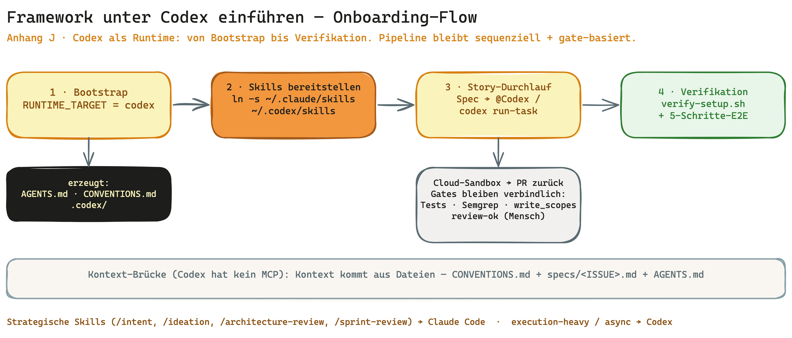

### Prerequisites

- **Codex CLI** installed (`codex --version`), a ChatGPT subscription (Plus/Team) for the cloud sandbox.
- **Framework repo cloned** as the skill source (`~/.claude/skills/` resp. `~/.codex/skills/`).
- Optional but recommended: Claude Code once for the bootstrap run (strategic skill) — Codex takes over execution afterwards.

### Step 1 — Bootstrap with the Codex runtime

At bootstrap question **A.1c** (BOO-53/54) choose `RUNTIME_TARGET = codex` (or `cross-tool`). Result:

- **`AGENTS.md`** — Codex entry point with repo rules, sandbox/scope hints, a pointer to `CONVENTIONS.md`.
- **`CONVENTIONS.md`** — the hard adapter contract: `runtime_target`, `backlog_adapter`, `governance_mode`, `execution_isolation`, active gates.
- **`.codex/` directory** for Codex-specific config (e.g. `.codex/personal-data-paths.json`).

Without Claude Code: create `AGENTS.md` + `CONVENTIONS.md` manually from `bootstrap/references/file-templates.md` (PASS criterion: both exist, `runtime_target: codex` set).

### Step 2 — Make skills available to Codex

```bash
ln -s ~/.claude/skills ~/.codex/skills   # or copy individual skills
```

Codex reads the SKILL.md frontmatter (`name` + `description`) automatically; the `metadata.hermes` block works as-is. There are **no slash commands** — invocation differs (step 4).

### Step 3 — Understand `AGENTS.md` / `CONVENTIONS.md`

Codex reads both files at session start (no MCP needed): `AGENTS.md` for the repo rules, `CONVENTIONS.md` for the binding contract. Everything that lives in `CLAUDE.md` under Claude Code, Codex finds in `AGENTS.md` — same methodology, different entry name.

### Step 4 — First story run under Codex

1. **Backlog record / spec** created (`specs/<ISSUE>.md`) — via `/ideation` in Claude Code or manually per `specs/TEMPLATE.md`.
2. **Trigger Codex:** `@Codex` in the Linear issue body **OR** `codex run-task <prompt>` via CLI. Each task runs async in an isolated cloud sandbox; the result comes back as a **PR**.
3. **Codex builds its own plan + task breakdown** — normal Codex behaviour. The story contract still governs write behaviour: `linear` = one lane, `sub-agents` = limited helpers, `agentic` = worktree-isolated lanes. Optional story hint `codex_execution_hint: single-agent | parallel-workers | worktree-required` (advisory only).
4. **Hard gates stay binding** (from `CONVENTIONS.md`): `write_scopes`, `execution_isolation`, tests, lint, security gate, `review-ok`, possibly `privacy-ok`. The quality gates (ESLint/Ruff, Semgrep, coverage) run as **tool-agnostic GitHub Actions** — regardless of whether the PR comes from Codex or Claude.
5. **Review gates stay human:** `review-ok` (and `privacy-ok`) is set by a person, not Codex.

### Step 5 — Context bridge (Codex has no MCP)

Codex has no direct Linear/Obsidian link. Context comes from files: `CONVENTIONS.md` (contract) + `specs/<ISSUE>.md` (story) + `AGENTS.md` (repo rules). Optionally an n8n workflow exports the Obsidian daily note + Linear issue body as the Codex `system_prompt`. GitHub serves as the trigger/return channel (PR).

### Step 6 — Verification (under Codex too)

`bash scripts/verify-setup.sh` (Appendix T) runs tool-agnostically (pure Bash) and checks `environment.json`, toolchain, **git hooks (per repo — re-set under Codex too)**, core artifacts. For the rollout proof: run the **5-step E2E trial protocol** from Appendix T analogously, with `codex run-task` instead of `/implement`.

### Optional — recurring background task (daily bug scanner)

To offload recurring background work to Codex (async off-load, saves Claude tokens), use `.codex/automations/<name>.toml` (cron + `memory.md`):

```toml
[automation]
name = "Daily Bug-Scanner"
cwd = "{{PROJECT_PATH}}"
schedule = "0 8 * * *"

[prompt]
content = """
Daily code reviewer for {{PROJECT_NAME}}: scan for critical bugs/security/edge cases,
check whether a backlog ticket (label: autofix) exists, create one for new findings
(title, affected files as absolute paths, impact, repro, suggested fix, format specs/TEMPLATE.md).
Read {{ABSOLUTE_MEMORY_PATH}}/memory.md for prior findings. Report: X found, Y duplicates.
"""
```

Setup notes: Linear-Codex integration (Settings → Integrations → Codex → Connect GitHub), GitHub auth, `$CODEX_HOME` bug workaround (absolute `memory.md` path in the `.toml`). **Privacy tier:** OpenAI standard (US, Commercial Terms) vs. **Azure OpenAI Switzerland North** (CH residency, no training) — see Appendix Q (sovereignty stack).

### Limits — when to use Claude Code after all

The **strategic skills** (`/intent`, `/ideation`, `/architecture-review`, `/sprint-review`) stay Claude-Code-recommended: 1M-token context, MCP integration, built-in sub-agents, `/context` token measurement. Codex is best for **execution-heavy / async** tasks. See Appendix K "Where you still benefit from Claude Code".

### Related appendices

- **Appendix K** — tool-adapter reference (mappings, tool-agnostic components, tool switch without re-bootstrap).
- **Appendix T** — post-install verification + 5-step E2E protocol.
- **Appendix Q** — privacy/sovereignty tier (US vs. CH residency for Codex).
- **`CONVENTIONS.md`** — the full tool-neutral specification.

Source: BOO-50 — originally conceived as a daily-bug-scanner automation (2026-05-12), re-scoped on 2026-05-28 to the Codex onboarding walkthrough (operator decision Tobias): the onboarding path was the real gap, the automation is now the optional example above.

---

## Appendix K: Tool-Adapter — using this framework with other AI tools (BOO-49)

The INTENTRON was designed Claude-Code-first, but the **methodology is tool-agnostic**. About 70% of what the framework defines is pure convention (file layouts, frontmatter, bash hooks, GitHub Actions). The remaining 30% — slash-commands, skill invocation, MCP integrations — depends on the AI tool. This appendix shows how to operate the framework with the most common alternatives.

**Tool-neutral specification:** `CONVENTIONS.md` at the bundle root. Always read that first when adopting the framework with any tool.

### Claude Code (primary, current standard)

- Skills live under `~/.claude/skills/<name>/SKILL.md`
- Invocation via slash-commands: `/bootstrap`, `/implement`, `/sprint-review`, etc.
- Full MCP integration: Linear, Obsidian, Hostinger, GitHub
- Sub-agent delegation for parallel work (Wave-Logik)
- Built-in `/context` command for token-window measurement (BOO-40 pre-flight)

This is what every section of this handbook describes by default.

### Codex (secondary, compatible)

OpenAI Codex uses the **same SKILL.md format** as Claude Code. The methodology transfers; only the invocation differs.

**Setup:**
- Symlink or copy skills: `ln -s ~/.claude/skills ~/.codex/skills` (or copy specific skills)
- Codex reads the frontmatter `name` + `description` automatically
- `metadata.hermes` block works as-is

**Invocation:**
- No slash-commands — use `@Codex` in Linear issue body OR `codex run-task <prompt>` via CLI
- Async by default — every task runs in an isolated cloud sandbox, results come back as a PR
- For recurring tasks: `.codex/automations/<name>.toml` (cron + memory.md, similar to a self-healing agent)

**Execution mapping:**
- Codex may create its own plan and task breakdown from the Linear story; this is normal Codex behavior.
- The story contract still controls write behavior: `linear` = one sequential lane, `sub-agents` = scoped helper lanes, `agentic` = worktree-isolated lanes.
- Optional hint: `codex_execution_hint: single-agent | parallel-workers | worktree-required`.
- The hint is advisory only; hard gates remain `execution_mode`, `execution_isolation`, `worktree_strategy`, `write_scopes`, tests, lint, security and review gates.

**Context bridge** (Codex has no MCP):
- `CLAUDE.md` (the framework already maintains it) is read by Codex at session start — same file, both tools
- `specs/{ISSUE-ID}.md` provides per-story context; Codex reads it explicitly
- Optional: an n8n workflow that exports Obsidian daily-note + Linear issue body as Codex `system_prompt`

**See Appendix J** for the continuous Codex onboarding walkthrough (with the daily bug scanner as an optional example).

### Cursor (tertiary)

Cursor uses `.cursorrules` instead of skills. Mapping:

- The SKILL.md frontmatter `description` → `.cursorrules` "When to use" rule
- Skill body → `.cursorrules` "Steps" instruction
- A `bootstrap/scripts/convert-skill-to-cursorrules.sh` script can be added as a follow-up issue if needed
- Conventions (specs/, journal/, hooks/) are untouched — Cursor operates on the same filesystem

### Aider, OpenCode, local LLMs (Ollama with Qwen2.5-Coder etc.)

- Conventions are tool-agnostic; any AI tool can read SKILL.md as documentation and follow the steps
- Aider's `.aider.conf` can reference `CONVENTIONS.md` as system prompt
- Local LLMs via OpenAI-compatible endpoints work identically
- The 1M-token context window of Claude Code Opus 4.7 is unique — local LLMs typically have 8-128k, so the bigger skills (`/architecture-review`, `/sprint-review`) may need to be split

### Tool-agnostic components (run unchanged with any tool)

These never depend on the AI tool:

| Component | Location | Function |
|---|---|---|
| bash hooks | `hooks/*.sh`, `bootstrap/scripts/*.sh` | pre-edit-bodyguard (Layer 0, BOO-86), spec-gate, doc-version-sync, audit-trace, branch-protection, dep-check, check-hook-sources (drift guard, BOO-89) |
| GitHub Actions | `.github/workflows/*.yml` | ESLint/Ruff, Semgrep, Coverage, Perf, Sonar, Lighthouse, hook-sources (drift guard, BOO-89) |
| `journal/` tree | `journal/reports/{ci,local}/`, `journal/learnings.*` | Reports + learning-loop |
| Markdown artifacts | `CLAUDE.md`, `ARCHITECTURE_DESIGN.md`, `GOVERNANCE.md`, `SECURITY.md`, `specs/TEMPLATE.md` | Project context |
| Configuration files | `.claude/environment.json`, `.claude/sensitive-paths.json`, `sonar-project.properties`, `lighthouserc.json` | Thresholds + tool registry |
| `metadata.hermes` block | Skill frontmatter | Hermes-Bridge (Appendix D) |

### Switching tools without re-bootstrap

The portability checklist in `CONVENTIONS.md` §6 lets you switch tools without losing the framework. Typical scenarios:

- **Claude rate-limit hit → temporary Codex:** activate Codex (Appendix J), continue on the same `specs/`, `journal/`, hooks
- **Privacy-driven switch → local LLM:** all conventions and hooks unchanged; only the tool that calls them changes
- **Team change → Cursor:** generate `.cursorrules` from skills, conventions stay
- **Long-term:** the framework is the methodology, the tool is the executor

### Where you still benefit from Claude Code

Despite tool-portability, some Claude-Code features are hard to replicate:

- 1M-token context window (Opus 4.7) — large architecture reviews benefit
- MCP servers — direct Linear/Obsidian/Hostinger integration
- Built-in sub-agents (Wave-Logik for parallel work)
- `/context` token measurement (BOO-40 pre-flight has clean Claude integration)

For the strategic skills (`/bootstrap`, `/intent`, `/ideation`, `/architecture-review`, `/sprint-review`) Claude Code remains the recommended tool. Codex / others are sensible for execution-heavy / async tasks.

### Related sections

- Appendix D — `metadata.hermes` block schema (BOO-31)
- Appendix E — `journal/reports/` convention (BOO-32)
- Appendix J — Onboarding the framework under Codex (walkthrough, BOO-50)
- `CONVENTIONS.md` at the bundle root — full tool-neutral specification

---

## Appendix L: 4P pipeline mapping — Pitch as the closing phase (BOO-37)

Schrader's Code Crash Ch. 5 defines a four-phase delivery pipeline: **Perceive → Prompt → Produce → Pitch**. Until BOO-37 the bundle covered only the first three; the Pitch phase had no skill. `/pitch` closes the loop.

### The 4P → skills mapping

| Phase | What it is | Skill(s) |
|---|---|---|
| **Perceive** | Notice a problem worth solving, capture its essence as an Intent | `/intent` (BOO-1) |
| **Prompt** | Turn the intent into a concrete story with success criteria and scope | `/ideation` + `/backlog` |
| **Produce** | Build it with quality gates, tests, observability, and a learning loop | `/implement` + `/architecture-review` + `/sprint-review` |
| **Pitch** | Show what you built — evidence first, demo second, slides never | `/pitch` (BOO-37) |

### Why `/pitch` is hybrid, not full-auto

Three options were weighed on 2026-04-28 (see BOO-37 issue):

1. **No skill** — every operator hand-builds the briefing. Doesn't scale once BOO-15/16/17 produce many data sources.
2. **Full skill with slide generation** — the skill writes the pitch deck. Betrays Schrader's principle ("the pitch is evidence, not theatre"), high AI-slop risk.
3. **Hybrid (selected)** — skill gathers evidence; human builds the story and runs the live demo.

`/pitch` produces ONLY a Markdown briefing (`pitch/PITCH-XX.md`). It does NOT generate slides, voice-over, outcome text, or demo videos. The stage stays human.

### `PITCH-XX.md` frontmatter schema

```yaml
---
pitch_id: PITCH-12
sprint: 12
created_at: 2026-04-28T14:00:00Z
related_intents: [INTENT-3, INTENT-5]
related_stories: [BOO-15, BOO-16, BOO-17]
metrics_snapshot:
  loc_delta: "+2,341 / -890"
  coverage_trend: "82% → 84% (+2pp)"
  p95_change: "180ms → 145ms (-19%)"
  iterations_avg: 2.3
  feature_flags_active: 3
  intent_fulfillment_score: 0.85
demo_path: "User-Onboarding → Search → Checkout"
status: prepared | delivered | post-mortem
---
```

Field reference lives in `pitch/references/pitch-template.en.md`.

### The 8 read-only data sources

| Source | Path | What is read |
|---|---|---|
| L3 lessons DB | `journal/learnings.db` | cross-sprint trends, avg iterations |
| Local reports | `journal/reports/local/{date}_{story}/` | iteration counts, final status (`meta.json`) |
| CI reports | `journal/reports/ci/run-{id}/` | coverage, performance baselines (BOO-32) |
| Sprint files (L2) | `journal/sprint-{date}.md` | aggregate metrics per sprint |
| Architecture doc | `ARCHITECTURE_DESIGN.md` | snapshot for diff vs. last pitch |
| Intents | `intents/INTENT-XX.md` | success criteria for intent fulfillment |
| Feature flags | `.claude/feature-flags.json` (BOO-17) | active flags + rollout phase |
| Git log | `git log --shortstat --since=...` | LOC delta, commit counts |

The skill is **strictly read-only**. It does not write to L3 — that protects the separation of concerns with `/sprint-review`.

### Anti-Scope

The skill explicitly does NOT do these things:

- **No slide generation** — no PowerPoint, no Reveal.js, no Marp
- **No outcome text** — user reactions emerge only in the live demo, captured as free-text in Step 6
- **No voice-over / no demo video**
- **No L3 writes** — read-only position
- **No stakeholder mail** — communication stays human work

If any of these are wanted, file a separate issue — they are out of BOO-37 scope.

### `paths.pitches` in `.claude/environment.json`

Bootstrap v3.23.0 adds `paths.pitches: "pitch/"` (and `paths.intents: "intents/"`) to the environment manifest. Existing projects pick this up via `bash .claude/generate-environment-json.sh --force` after a `git pull` of the bundle.

### Position in the skill pipeline

```
/intent → /ideation → /backlog → /implement → /architecture-review → /sprint-review → /pitch
                                                                                        ↑
                                                                            evidence briefing
                                                                            for the next demo
```

`/pitch` runs after `/sprint-review` (sprint metrics must be aggregated) and before the actual stakeholder meeting (the operator carries the Markdown briefing into the room as a cheat sheet).

### Related sections

- Appendix D — `metadata.hermes` block schema (BOO-31)
- Appendix E — `journal/reports/` convention (BOO-32)
- Appendix G — sprint-sizing mechanics (BOO-38)
- `pitch/SKILL.en.md` — full skill workflow (6 steps)
- `pitch/references/pitch-template.en.md` — body schema for `PITCH-XX.md`
- `pitch/references/demo-path-heuristic.en.md` — heuristic for the demo-path proposal

---

## Appendix M: Schrader Decoder — We Built the Operating System for Code Crash

This appendix is the map from the book into the bundle. Schrader's "Code Crash" (2026) provides the theory of the AI-software era; this bundle provides the executable practice for it. If you haven't read the book, that's no problem — the decoder is not a re-read but a translation: one concept per Schrader chapter, a hero sketch, a handful of detail sketches with the book's central arguments, and a concrete place in the bundle where the concept lives as a skill, BOO, or governance rule.


*The full bundle at a glance — skills, 4P pipeline, governance layer.*

The bundle is Tobias' operating system for Intentron engineering. Schrader describes what changes when AI takes over the act of writing code. This bundle is the operational answer: 11 skills, the 4P pipeline, and a governance layer that turn the theory into daily practice.

### Chapter 1 — Second-Order Effects


*The ChatGPT moment of November 2022 — the crack in reality the book opens with.*

**Schrader says:** Writing code is no longer the bottleneck — Intent is. The second-order effects (Jevons paradox: cheaper code means more code, not less) are bigger than the obvious efficiency win. He introduces the Soul-System-Speed triad and lays out the 4P pipeline (Perceive, Prompt, Produce, Pitch) as the new operating shape.

**Deepening in the book:**


*The silent revolution: agentic AI tools turn LLMs into productivity monsters; the coordination class loses, small autonomous teams win.*


*Software development gets simultaneously easier and harder in new ways — when everyone can build, the spark decides, not the syntax.*


*Two parallel breaks: agile in crisis + intent becomes productive. When output costs nothing, input becomes the scarce resource.*

**How we solve it:** The whole bundle is the answer to Jevons — when code gets cheaper, intent gets more expensive, so intent gets its own skill at the start of the pipeline. The 4P structure isn't decoration; it's anchored in the skill architecture: every skill belongs to exactly one P. See Appendix L (4P pipeline mapping).

### Chapter 2 — The Agile Illusion


*Cargo cult: rituals without the core. Standups without obstacle talk, story points as a performance metric, sprints with top-down scope — mini-waterfall in agile disguise.*

**Schrader says:** Cargo-cult agile keeps the rituals and loses the core. Output has crowded out Outcome. SAFe solves the wrong problem at industrial scale. The new smallest unit is Individual+AI — teams only exist when they actually accelerate the work.

**Deepening in the book:**


*Agile Release Trains of 50-125 people, role inflation, artifact explosion, ceremony flood — SAFe doesn't scale agility, it scales the illusion of agility.*


*The business model behind clinging on: certification industry, consulting complexity, middle-management control, organized irresponsibility.*

**How we solve it:** Velocity is dead — no burndown, no story-points-per-sprint statistic. A sprint in the bundle is 80% of the used model's context window — a token box, not a time box. Outcome is measured via Intent fulfillment, not story-point consumption. See HANDBUCH Appendix G (sprint-sizing mechanics), BOO-38, BOO-39, BOO-40.

### Chapter 3 — The AI Revolution in Software Development


*From autocomplete through chat and terminal-first to agentic IDEs — with Opus 4.5, AI turns from assistant into production partner.*

**Schrader says:** Four generations of AI coding (autocomplete, chat, terminal-first, agentic IDEs). With Opus 4.5, AI flipped from assistant to production partner. Vibe coding grows up into agentic engineering — and production readiness is the bar you have to clear.

**Deepening in the book:**


*The difference is in the stance: vibe coders hope it works. Agentic engineers make sure it works — structured, with tests, with security boundaries.*


*Fastly study (July 2025): senior developers use AI code 2.5x as often as juniors and benefit more. Beginners need friction to develop judgment — otherwise the next generation conducts AI without understanding its work.*

**How we solve it:** A four-layer quality-gate architecture turns vibe coding into production-ready agentic engineering — layer 0 as the Edit-Bodyguard that catches unsafe patterns **before** the AI writes them (BOO-86, curated patterns, default = warning; see Appendix V), layer 1 in the IDE, layer 2 as a pre-commit hook, layer 3 in CI. ESLint, Semgrep, coverage gate, performance baseline, and SonarQube interlock so nothing slips past the gates into main. See HANDBUCH §6 and §8d and Appendix V, plus BOO-2 (ESLint), BOO-4 (Semgrep), BOO-15 (coverage), BOO-16 (performance), BOO-5 (SonarQube), BOO-24 (AI architecture principles), BOO-86 (Edit-Bodyguard).

### Chapter 4 — Intent is the New Code (core chapter)


*Intent as the starting point of value creation: the Soul-System-Speed triad replaces the old chain Vision → Objective → Outcome → Tech Requirement.*

**Schrader says:** Intent is the new scarce resource. The Soul-System-Speed triad is what turns Intent into reality. Agency — judgment, cultural fluency, meaning-setting — is the human capability AI cannot replace. He catalogues the top 5 intent failures and proposes a template: "[user group] should [measurable outcome] without [friction]. Success = [metric]".

**Deepening in the book:**


*Soul has two dimensions — the human one (agency: capacity to decide, responsibility, inner anchoring) and the product one (what differentiates).*


*First intent (technology-agnostic), then have options generated, then evaluate against the intent, and only at the end write prompts. Start with prompts and you build the wrong thing fast.*


*A good intent emerges in a team of product, design, engineering plus a domain wildcard: hear stories, quantify the status quo, brainstorm, sharpen, validate, write it down.*

**How we solve it:** The `/intent` skill is the direct answer to this core chapter. It runs before `/ideation`, with an anti-pattern self-check covering 3 soul-killers and the 5 failure modes from Schrader. Intent then propagates through every downstream skill — gating ideation, weighting the backlog, closing the implement measure loop. See BOO-1 (intent skill), BOO-10 (intent propagation), `intent/SKILL.md`, and `intent/references/intent-anti-patterns.md`.

### Chapter 5 — The Intent-to-Production Pipeline


*Four boxes, one process: Perceive → Prompt → Produce → Pitch. The classic stage-gate approval process is replaced by a pipeline that ships in weeks instead of quarters.*

**Schrader says:** The 4P pipeline (Perceive → Prompt → Produce → Pitch) replaces the classical approval process. Prototypes are dead — the new pitch form is a live demo with before/after metrics. The Two-Document Rule splits the work cleanly: Intent Document for the what, Execution Plan for the how.

**Deepening in the book:**


*Perceive → Prompt → Produce → Pitch in detail: each phase hours to days instead of weeks. Full cycle 1-4 weeks for clearly defined features, 8-12 weeks for regulated environments.*


*Old vs new model: instead of tech lead, architect, and security officer as approvers, there are automated gates on every commit. The autonomy paradox: autonomous teams need harder, automated guardrails because there's no time for human intervention.*


*Writer agent, editor agent, code agent — each with its own SOUL.md for personality and decision principles. The product engineer becomes orchestrator: define the mission, coordinate specialists, instead of implementing personally.*


*Bad ideas get built and fail visibly. Good ideas prove themselves. No one can hide behind concepts anymore — the pitch decides whether more funding flows.*


*Instead of big-bang releases: gradual rollout via feature flags. The 4P pipeline ships continuously; risk is managed through gradual roll-out rather than ever-longer testing.*

**How we solve it:** The full skill chain is 4P: `/intent` (Perceive), `/ideation` plus `/backlog` (Prompt), `/implement` plus `/architecture-review` plus `/sprint-review` (Produce), `/pitch` (Pitch). The pitch stage shipped as a hybrid in BOO-37 — the skill gathers the evidence, the human runs the live demo. See HANDBUCH Appendix L for the 4P pipeline mapping and BOO-37 for the pitch skill.

### Chapter 6 — Product Teams (core chapter)


*Four heads, one outcome ("checkout abandonment from 12% to 8%"), own architecture, multiple deploys per day — no more approvals. That's what a real product team looks like.*

**Schrader says:** Individual+AI is the new smallest unit. The 3-to-5-heads rule sizes Product Teams. The Product Engineer carries 5 core skills: intent clarity, technical judgment, systems thinking, user empathy, ownership. Add the Alliance Model, Communities of Profession, and Outcome Governance across three pillars.

**Deepening in the book — building the team:**


*Before forming any team, the honest check: do you really need a team, or is Individual+AI faster? Four questions — all "no" means no team needed.*


*Product engineer + design + software engineer as the core, plus a wildcard and a junior. More than 5 heads is a warning sign: split rather than bloat — communication paths grow quadratically.*


*Who owns what: Soul (vision, meaning) belongs to product engineer and design, System (architecture, security) to the engineers, Speed (pipeline, go/no-go) to the whole team.*


*Shared responsibility for speed is not a compromise but the core: each member personally owns velocity — not a non-committal group task.*

**Deepening in the book — new roles:**


*The old separations between PM, developer, and designer dissolve. What emerges is new: the product engineer works with AI end to end from intent to outcome — without handoffs.*


*The software developer becomes a software engineer again: less implementation, more technical intent, more control. Antidote to atrophying coding muscles: keep doing manual coding exercises.*


*AI delivers best practice, not brand identity. The designer picks the right one of ten AI variants, not the prettiest. Selecting requires judgment, not craft.*

**Deepening in the book — scaling & leadership:**


*The 2x2 matrix: high autonomy combined with high alignment yields empowered teams. Chaos, bureaucracy, and command-and-control are the other quadrants.*


*Loop is dangerously insufficient: AI works, human intervenes occasionally. Lead is the needed stance: human leads, AI supports — proactively, with clear responsibility.*


*Instead of SAFe trains, alliances: 4-10 teams (15-40 people), carried by mission and transparent information, not hierarchy. Guardrails reduce autonomy — so set them sparingly.*


*Decision architecture: 90% local in the team, bilateral between two teams, alliance-wide only what truly affects everyone. Escalation levels: bilateral → mediation → alliance decision.*


*The fundamental difference: SAFe coordinates dependencies, alliances eliminate them. Vertical slices ("team checkout"), API contracts, sparing shared services, sometimes deliberate duplication.*


*Three to six months of a productivity valley in the learning phase — the J-curve is part of the investment calculation, not a bug. Direct costs + indirect costs + risks must be clear before the start.*

**How we solve it:** Issue-writing guidelines with a 3-tier execution mode (agentic / sub-agent / linear). Story points pull double duty — token estimate AND execution-mode selector. Every sub-agent gets a mini-briefing: role, context, concrete task. See BOO-11 (issue guidelines v3.0), BOO-38 (SP dual function), HANDBUCH §8g (Linear setup), and `.claude/ISSUE_WRITING_GUIDELINES.md`.

### Chapter 7 — Risks and Anti-Patterns


*Every new way of working breeds its own pathologies. Three categories — process, quality, culture — plus an early-warning system and kill criteria. Knowing the risks means anticipating them.*

**Schrader says:** 11 anti-patterns in 3 categories — 3 process, 3 quality, 5 culture pathologies. He gives you an early-warning system and kill criteria for projects and skills. Slopware is the failure mode that matters most: AI mediocrity that quietly drops the quality bar across the whole org.

**Deepening in the book:**


*AI makes production cheap — so more gets produced. More code, more features, more mediocrity. Without strict quality gates the codebase drowns in the same flood that swamps GitHub, Substack, and ArXiv from 2026 on.*


*Two levels — organization and team — with concrete signals: old meetings return, reporting overhead rises, autonomy gets curtailed, security gaps pile up, no one uses AI tools. One meaning-and-action entry per signal.*

**How we solve it:** `/sprint-review` carries an explicit step (step 7) for anti-pattern self-diagnosis. It walks the catalogue at `sprint-review/references/anti-pattern-katalog.md`. AI-architecture anti-patterns get their own pass inside `/architecture-review`. See BOO-26 (anti-pattern catalogue), BOO-24 and BOO-7 (AI architecture), and HANDBUCH §8b (cultural anti-patterns).

### Chapter 8 — Still Day One (epilogue)


*February 2026, Schrader manuscript: the motivation stays the same, the HOW changes radically. What remains when everything changes: people problems. Teams fail at communication, not at technology.*

**Schrader says:** Europe has an opening via deep domain knowledge plus leapfrogging — lag as an advantage. "Human in the Lead" is a leadership mode, not passive loop-watching. Trusted AI becomes a competitive advantage through regulatory fast lanes the US won't have.

**Deepening in the book:**


*Companies build product engineering teams (example mechanical engineer 2028: three teams, new configurator, predictive maintenance, embedded AI — a platform company by 2030). Society benefits from 10x cheaper software in schools, administration, healthcare. Startups get the biggest window in tech history.*

**How we solve it:** The bundle is tool-agnostic. It runs with Claude Code (primary), Codex, Cursor, Aider, or local LLMs — the operator stays in the driver's seat. Hermes sits on top as an optional compound layer for pattern recognition across projects. See HANDBUCH Appendix K (tool adapter, BOO-49), Appendices D-F (Hermes), and `CONVENTIONS.md` for the tool-neutral spec.

### What's Next — From Decoder to Book


*From a theory book to an operational follow-up book: Schrader says what changes; the bundle shows what it concretely looks like.*

Schrader delivers the theory, the bundle delivers the practice — skill code, conventions, hooks, CI gates. Every central concept in the book has an executable counterpart in a skill, a BOO, or a HANDBUCH section. This decoder is at the same time the skeleton for a planned follow-up book that deepens the translation of Schrader's theory into operational practice: not "what should change" but "this is how you do it concretely". Until then, this appendix is the shortest bridge version — one page of theory, several sketches with the book's central arguments, one page of bundle, per chapter.

## Appendix N: Token-Efficiency Policy (BOO-84) — Model Routing + Prompt Caching

INTENTRON operators waste Anthropic tokens when every skill runs on the operator's default model (usually Opus). This appendix explains both levers the framework uses by default — **per-skill model routing** and **prompt caching for reused blocks**. Both follow the lightweight design decision: recommendation rather than hard lock, operator override always possible, audit trail for compliance.


### N.1 Model-Routing Policy

Each skill carries `recommended_model: haiku | sonnet | opus` in its frontmatter — a **tier**, not a version number. Tier-to-version mapping (Haiku 4.5, Sonnet 4.6, Opus 4.7) lives centrally in `bootstrap/references/model-tiers.json` and is updated once per Anthropic release. No operator has to touch 11 skill files when a new model ships.

**Routing table**

| Tier | Model class | What for | Default skills |
|------|-------------|----------|----------------|
| `haiku` | Claude Haiku | Iteration loops, lints, question generation, small smoke tests | `/implement` steps 6a/6a-bis/6a-tris/6a-quart, lint loops |
| `sonnet` | Claude Sonnet | Safe default for most skill tasks | `bootstrap`, `backlog`, `visualize`, `sprint-review`, `pitch`, `ideation`, `intent`, `grafana` |
| `opus` | Claude Opus | Architecture reviews, security findings, threat modeling | `architecture-review`, `cloud-system-engineer`, `/implement` step 6e (security findings) |

**Operator override (two-tier)**

1. **CLI flag** for one-off exceptions: `/implement --model opus`
2. **CLAUDE.md `model_overrides:` section** for project-wide default changes:

```yaml
model_overrides:
  implement-iterations: sonnet   # instead of haiku, because our iterations are more complex
```

**Precedence:** CLI flag > CLAUDE.md override > skill default tier.

Every override is recorded in `meta.json` under `override_audit` with skill, recommended tier, actual model, operator and timestamp.

**Mandatory Opus (audit argument)**

Security-relevant skills MUST NOT auto-downgrade during a story run. Operator override is possible but logged in the audit trail. That is the hard argument for regulated industries (FINMA, BaFin, MaRisk): per story we can prove which model was used for which task — who switched to a weaker model and why.

**FinOps argument**

For a typical customer engagement (6 months, ~80 stories, all lints + tests + coverage iterated): naive Opus usage costs roughly $400-500 for iteration loops alone. With Haiku routing for these loops: ~$30-40. **Factor 12x cheaper, margin lever 15-25%.** This argument goes into every discovery conversation: "INTENTRON optimises your LLM costs by design."

### N.2 Prompt Caching Explained

Anthropic offers a **90% discount on cached input tokens** (ephemeral cache with 5-min TTL). INTENTRON uses this systematically for blocks read multiple times within a story iteration — without the operator having to set cache markers manually.

**What gets cached**

- **SKILL.md files** of all loaded skills (5-15k tokens each) — read on every iteration of the skill.
- **Project constitution** (`CONVENTIONS.md`, 20-50k tokens) — read on every skill invocation.
- **`SECURITY.md`, `ARCHITECTURE_DESIGN.md`** — read in architecture reviews and security findings.
- **Repository map** (`/implement` step 3) — read on every iteration of the implementation phase.

**Constraints**

| Constraint | Value | Why |
|------------|-------|-----|
| Minimum block size | 1024 tokens | Anthropic minimum; smaller blocks are not cached. |
| Cache TTL | 5 minutes | After 5 min without read the cache expires, next iteration pays full price again. |
| Cache write surcharge | approx. +25% | First write to cache is more expensive than a normal read. Pays off from 2 reads onwards. |
| Secrets in cache | forbidden | No API key, token or credential may go into a cache block. |

**How we measure it**

Cache hit rate (`cache_read_tokens / (input_tokens + cache_read_tokens)`) is stored per story in `meta.json` as a separate value. `/sprint-review` aggregates it per sprint. Target: above 60% cache hit rate for multi-iteration stories. If the rate is permanently below 30%: cache blocks likely don't fit the skill structure — follow-up story to tune.

**What that means for iteration pain**

A story with 5 lint iterations re-reads `SKILL.md` (10k tokens) and the constitution (30k tokens) on every iteration. Without caching: 5x40k = 200k tokens billed in full. With caching: 1x40k full, then 4x4k (90% discount) = 56k effective cost. **Savings: ~70% from caching alone.** Combined with Haiku routing for these iterations: ~95% cheaper than naive Opus without cache.

**Design-decision note**

Caching is optionally enabled via a Claude-Code hook. If the hook is not set up: everything keeps working, just without the caching benefit and without cost aggregate in the sprint review (`meta.json.token_tracking` stays empty). No hard block — operator can retro-fit caching at any time.

## Appendix O: Privacy by Design (BOO-69) — DPO as a Framework Bundle Skill

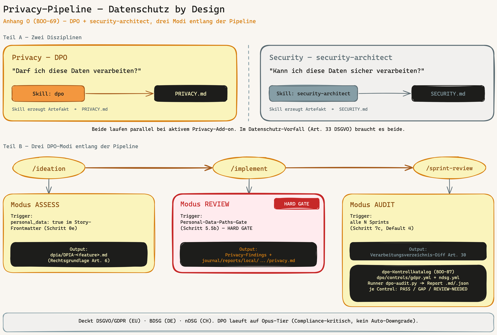

> **Compliance mechanism overview:** How gates (per-code hard stop in `/implement`) and catalogues (periodic doc audit in `/sprint-review`) interact across the lifecycle — for privacy/GDPR **and** EU AI Act, incl. automatic-vs-REVIEW-NEEDED — is explained in `docs/compliance/compliance-mechanik.md` (CISO/operator view).

### When do I need the Privacy mode?

Activate the Privacy add-on in `/bootstrap` (Phase A.4) when one of these triggers applies:

- The project processes personal data of EU citizens or persons with a Swiss connection — GDPR or nDSG applies.
- The project has a processor constellation (processing on behalf of a third party).
- Industry with elevated obligation: health (patient data), finance (creditworthiness, KYC), HR (employee data), education (learner data), public administration.

No Privacy mode needed: solo tool without data collection, exclusively anonymous data, no EU/CH connection, no processor context.

### What the DPO skill does (3-mode mapping)

Since **BOO-74 (Wave M)** the DPO skill is a **framework bundle skill**: it lives directly in the `intentron` repo (analogous to `bootstrap/`, `implement/`, `security-architect/`) and is installed by bootstrap Phase 5 from the framework repo into `~/.claude/skills/dpo/`. The skill's master remains the `claudecodeskills` repo (maintained via `publish_skill.py`); the framework repo holds a mirrored vendored copy. Solo operators without the framework can still get DPO directly from `claudecodeskills`. Three modes with a clear trigger point in the pipeline:

| Mode | Trigger | Pipeline Position | Output |
|------|---------|--------------------|--------|
| ASSESS | Story plans new processing of personal data | `/ideation` Step 0e (`personal_data: true` in story frontmatter) | `dpia/DPIA-<feature>.md` from DPIA template, legal basis chosen |
| REVIEW | Code change hits personal-data-paths | `/implement` Step 5.5b (Personal-Data-Paths-Gate) | Privacy findings inline + `journal/reports/local/<date>_<story>/privacy.md` |
| AUDIT | Every N sprints (default 4, configurable via `environment.json.privacy_audit_cadence`) | `/sprint-review` Step 7c | Deterministic catalog report `dpo/reports/<date>_audit.{md,json}` with PASS/GAP/REVIEW-NEEDED per control (BOO-87) |

DPO covers GDPR (EU), BDSG (DE) and nDSG (CH). Swiss specifics (no 72h limit, fines against natural persons, EDOEB instead of EU authority) are documented in the skill references.

### Interplay DPO ↔ security-architect

Clear separation of the two disciplines:

| Discipline | Question | Skill | Main Artifact |
|-----------|----------|-------|---------------|
| Privacy | "May I process this data?" | `dpo` | `PRIVACY.md` (legal bases, records of processing, deletion policy) |
| Security | "Can I process this data securely?" | `security-architect` | `SECURITY.md` (TOMs, encryption, access control) |

When the Privacy add-on is active, both skills run in parallel. A privacy breach (Art. 33 GDPR) requires both inputs — DPO assesses legally (notification thresholds, data subject rights), security-architect technically (forensics, mitigation).

### Activate the Privacy add-on in Bootstrap

Phase A.4 add-on block offers multi-select. On `[x] Privacy / DSGVO`:

1. Bootstrap installs the DPO skill from the framework bundle (`$SKILL_SRC/dpo/`, unless already present) — BOO-74.
2. Bootstrap also installs `security-architect` from the framework bundle (prerequisite for the DPO ↔ security-architect interplay).
3. Bootstrap renders `PRIVACY.md` from `bootstrap/references/privacy-template.md` (DE or EN depending on project language).
4. Bootstrap creates `personal-data-paths.json` template (`.claude/` or `.codex/`).
5. Bootstrap sets backlog label `privacy`.
6. Bootstrap Phase 4.4n "Privacy Setup" runs (analogous to 4.4i Sensitive-Paths setup).

### Migration notes for existing projects

Existing project does not have the Privacy add-on active yet?

```bash
bash bootstrap/scripts/migrate-to-v2.sh migrate_boo_69
```

`migrate_boo_69()` is idempotent and additive. Result:

- `PRIVACY.md` generated from template (if not yet present)
- `personal-data-paths.json` template created
- DPO skill copy installed from the framework bundle (BOO-74; `migrate_boo_74` adds DPO + security-architect explicitly)
- `SECURITY.md` remains unchanged
- Backlog label `privacy` added

The operator maintains `PRIVACY.md` after the initial generation manually — fills in legal bases, data categories and deletion deadlines with project reality. DPO ASSESS mode can support the initial fill-in.

### Deterministic control catalog (BOO-87)

Since BOO-87 the AUDIT mode works through a **deterministic control catalog** instead of an AI free-text assessment. The catalog runner `dpo/scripts/dpo-audit.py` reads the versioned YAML catalogs under `dpo/controls/` control by control and produces a reproducible report pair `dpo/reports/<date>_audit.md` (+ `.json`). Invoke from the project root:

```bash
DPO_PROJECT_ROOT=. python3 <dpo-skill>/scripts/dpo-audit.py
```

**What it is — control by control instead of an AI essay.** Each control is a clearly scoped check with `id`, `quelle` (e.g. a GDPR article), required `evidenz` and a `check_typ`. Mechanical checks (`file-exists`, `file-contains`, `grep-absent`) reproducibly yield **PASS** or **GAP**; judgment checks (`review`) yield **REVIEW-NEEDED**. The AI does not itself judge whether something is "compliant" — it runs the catalog and records the result.

**Why no database.** Determinism and versioning come straight from the **Git YAML**. The catalogs are plain text, diffable and versioned together with the code. This makes "which rule applied at which commit?" answerable at any time — the audit state can be reproduced against any Git state (`same project state = same result`). A database would move this audit trail into a separate, harder-to-verify state; the YAML-in-repo solution stays dependency-free (python3 stdlib, no PyYAML) and auditable.

**How to read the report.** The header names the loaded catalogs and the totals `n PASS · n GAP · n REVIEW-NEEDED`. The control table lists every check with its status:

- **PASS** — mechanical check satisfied, no action needed.
- **GAP** — mechanical check failed; the "Open GAPs" section names the evidence and `mapsTo` (where it belongs). The operator closes the gap.
- **REVIEW-NEEDED** — judgment check that is **not** decided automatically. Honest determinism: the tool does not presume a legal verdict but flags the item for a **human to confirm**. That is a feature, not a shortcoming — no invented legal advice.

**nDSG as the CH unique selling point.** The catalog `dpo/controls/ndsg.yml` covers the Swiss nDSG (in force since 2023) — including the CH specifics (the term "Bearbeitung" instead of "Verarbeitung", the effects principle for cross-border disclosure, EDOEB, DPIA per Art. 22). This is a deliberate differentiator: common agentic-security tools do not cover the nDSG.

**OSCAL as a later expansion stage.** The flat YAML schema is deliberately kept minimal. An export to **OSCAL** (NIST Open Security Controls Assessment Language) for machine-interoperable compliance evidence is planned as a later expansion stage but is not implemented today.

**Project overlays.** Project-specific controls are added additively under `.claude/dpo/controls/` (`.yml` or `.json`); the runner reads framework catalogs and overlays together. The framework/runner files themselves are not modified per project.

### Related appendices

- **Appendix N (Token Efficiency):** DPO runs on `recommended_model: opus` (compliance-critical, audit-relevant). With active model routing, this is fairly accounted for in the sprint-review cost aggregate as opus tier. The deterministic catalog runner (BOO-87) itself needs no model — it runs dependency-free in python3.
- **Appendix Q (Sovereignty Stack, BOO-71, planned):** Data sovereignty (US-vs-EU cloud providers) is a **separate topic** and not a privacy replacement — even a sovereign stack needs privacy-by-design. Appendix Q provides the inspiration layer for EU-compliant alternatives.
- **Appendix F (Hermes Compound-Layer):** DPO is registered in the `metadata.hermes` mapping with `category: governance` and tags `[privacy, gdpr, dsgvo, ndsg, compliance]`.

---

## Appendix P: Deployment Scenarios — Solo-Mac / Solo-VPS / Multi-User-VPS / Team-Server (BOO-70)

This appendix describes four established setup patterns for the INTENTRON, from a solo operator on a Mac to a multi-user VPS coding factory. It exists because the bootstrap script deliberately asks only **one** additional question (default Solo-Mac) and the details land here, rather than bloating bootstrap. Operators pick their scenario via the decision matrix, read the matching scenario section, and walk through the setup steps once. The framework itself behaves identically in all four scenarios — only the surrounding environment differs.

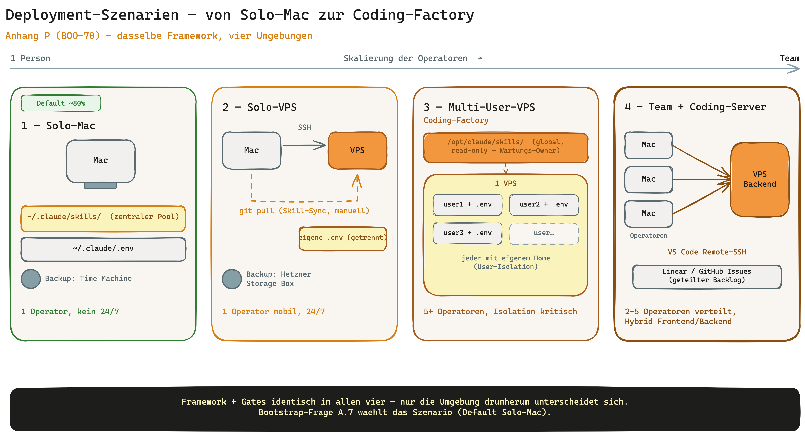

### Decision Matrix

| Operator Profile | Recommended Scenario | Primary Reason |
|------------------|----------------------|----------------|
| Solo operator, stationary (office, single Mac) | Scenario 1 — Solo-Mac | Frictionless default, central skill pool, no server maintenance. |
| Solo operator, mobile (multiple devices, location-independent) | Scenario 2 — Solo-VPS | 24/7 availability, device-independent access via SSH. |
| 2-5 operators sharing one code hub | Scenario 4 — Team Coding-Server | Hybrid Mac frontend + VPS backend, shared backlog. |
| Coding factory with 5+ operators and shared skill pool | Scenario 3 — Multi-User-VPS | Clean user isolation, centrally maintainable skill pool. |
| Public authority / industry with GDPR obligation | Scenario 2 or 3 (EU-located VPS) | Data location control; see Appendix O Privacy by Design and Appendix Q Sovereignty Stack. |
| Hobby / experiment, no production claim | Scenario 1 — Solo-Mac | Minimal setup cost, operator can migrate to VPS later. |

### Scenario 1 — Solo-Mac (default, ~80% of operators)

**Operator profile**

- One operator, one Mac (stationary or laptop).
- No 24/7 background needs, no cross-device mobile access.
- Wants a frictionless start without server maintenance.

**Setup steps**

1. Install the Claude Code CLI via `npm` (Anthropic standard path).
2. Keep the skill pool central in `~/.claude/skills/` — all projects share it.
3. Create the project directory under `~/Documents/GitHub/<project>/`.
4. Start `claude` in the project and run `/bootstrap` (bootstrap question A.7 = a) Solo-Mac).
5. Store secrets in `~/.claude/.env` (user level, not in the project).
6. Check `.gitignore` in the project — `.env`, `.claude/local/`, `journal/reports/local/` must be ignored.
7. Pick Linear or GitHub Issues as backlog tool during the bootstrap interview.
8. Enable Time Machine for the Mac (System Settings → Time Machine).

**Skill installation**

- Central pool under `~/.claude/skills/`. No per-project sync needed.
- Skill updates via `git pull` in the skill repo apply immediately to all projects.
- `security-architect` and `dpo` (framework bundle skills since BOO-74) also live centrally in the pool (see Appendix O).

**Secrets separation**

- One `.env` at user level under `~/.claude/.env`.
- Project directories contain **no** secrets — only references to env variables.
- `.gitignore` check is a mandatory bootstrap step.

**Backup strategy**

- Time Machine to an external drive (primary).
- Optional: Mac backup to iCloud (Documents folder) or Backblaze B2 as a cloud copy.
- Skill pool and projects are git-versioned — backup guards against hardware loss, not code loss.

**Tradeoffs**

- No 24/7 background runs (Mac must be awake).
- Not mobile across devices — the operator's machine is the single point of use.
- No device redundancy: Mac failure = work stoppage until restore.

### Scenario 2 — Solo-VPS (BOO-9 pattern, for mobile workers and 24/7 background tasks)

**Operator profile**

- One operator, multiple access devices (laptop, tablet, foreign machine).
- Needs 24/7 reach for cron tasks, long-running background agents, scheduled builds.
- Accepts server maintenance as a tradeoff for mobility.

**Setup steps**

1. Provision a VPS with a provider of your choice (e.g. Hostinger VPS, Hetzner — operator picks).
2. Set up SSH key login, disable password login.
3. On the VPS install Node.js + `npm` and install the Claude Code CLI via `npm`.
4. Pull the skill pool to `~/.claude/skills/` via `git clone` from the personal skill repo.
5. Skill sync via `git pull` is manual — heterogeneous skill versions between Mac and VPS are allowed (no auto-sync).
6. Optional: a cron job for periodic `git pull` if the operator wants formalised update discipline.
7. Place an own `.env` on the VPS under `~/.claude/.env`, strictly separated from the Mac `.env`.
8. Configure a backup target (Hetzner Storage Box or Backblaze B2 — operator picks).
9. Create the project directory under `~/projects/<project>/` and run `/bootstrap`.

**Skill installation**

- Central pool under `~/.claude/skills/` on the VPS, same structure as on the Mac.
- Skill sync is **manual** (`git pull`) or via cron — no auto-push from the Mac.
- Heterogeneous versions are fine: the VPS can sit on an older skill version if the operator wants it that way.

**Secrets separation**

- VPS `.env` strictly separated from the Mac `.env`.
- Do not copy the Mac `.env` to the VPS — distinct values per machine.
- SSH keys are not `.env` secrets but belong in `~/.ssh/` with mode 600.

**Backup strategy**

- Hetzner Storage Box or Backblaze B2 as backup target (operator picks).
- Backup frequency: at least daily for `journal/`, `backlog/`, `.claude/local/`.
- Git-tracked content (code, skills) is covered by the remote — backup covers operator state and secrets.

**Tradeoffs**

- Initial setup 1-2 hours (SSH hardening, skill sync, backup configuration).
- Single point of failure: VPS down = no access.
- Slightly higher LLM latency due to EU routing and the extra network hop.

### Scenario 3 — Multi-User-VPS Coding Factory (BOO-83 pattern, for teams + shared skill pool)

**Operator profile**

- 5+ operators on a shared VPS, each with their own system user.
- Shared skill collection, individual repositories per user.
- A maintenance owner is defined (otherwise an anti-pattern).

**Setup steps**

1. Size the VPS: at least 8 GB RAM and 4 vCPU as a rule of thumb for five concurrent operators (operator picks).
2. Create a system user per operator: `sudo useradd -m -s /bin/bash <name>`.
3. Store SSH keys per user in `/home/<name>/.ssh/authorized_keys`, disable global password login.
4. Set `UMASK 077` globally so user directories are not world-readable.
5. Define `sudo` rules per user — who may do what, what stays root-only.
6. Decide the skill pool strategy: either global under `/opt/claude/skills/` (read-only for users) **or** per user in `~/.claude/skills/` (own copy per operator). Both patterns are documented and supported.
7. Repository worktrees per user: each user clones into their own home — no shared working trees.
8. Secrets STRICTLY per user in `~/.claude/.env`. No shared `.env` files.
9. Backup strategy centrally (provider VPS snapshot) plus per home directory (Hetzner Storage Box or Backblaze B2 — operator picks).
10. Check configuration drift periodically (`jq` diff over `~/.claude/settings.json` per user).

**Skill installation**

- **Variant A (global):** `/opt/claude/skills/` read-only, maintained by the owner. Updates via `git pull` as root. Users cannot patch themselves.
- **Variant B (per user):** each user maintains their own `~/.claude/skills/`. More freedom, more drift risk.
- Document the choice — switching mid-stream is expensive.

**Secrets separation**

- Strictly per user in `~/.claude/.env`, mode 600.
- No shared secrets via `/etc/` or `/opt/`.
- On operator handover: delete the user account, the `.env` goes with it.

**Backup strategy**

- VPS-wide snapshot at the provider (daily, operator picks).
- Plus per-home backup to Hetzner Storage Box or Backblaze B2.
- Git remotes per user cover code — backup covers operator state, journal, secrets.

**Tradeoffs**

- Maintenance overhead is noticeable: user onboarding, skill updates, drift detection, snapshot verification.
- User isolation is critical — a compromised user must not see other users.
- Configuration drift between users must be actively monitored ("why does skill X work for Alice but not Bob").

### Scenario 4 — Team Coding-Server (hybrid Mac frontend + VPS backend, 2-5 operators)

**Operator profile**

- 2-5 operators, each with their own Mac, but a shared code hub on a VPS.
- Editor runs locally (VS Code Remote-SSH), code lives on the server.
- Distributed team across time zones or locations.

**Setup steps**

1. Provision the VPS (see Scenario 2 steps 1-3).
2. Install the VS Code Remote-SSH extension on each operator's Mac.
3. One system user per operator on the VPS (analogous to Scenario 3 steps 2-3).
4. Install the Claude Code CLI on the VPS — operators start `claude` over the Remote-SSH session.
5. Set up a shared backlog in Linear or GitHub Issues — all operators work against the same backlog.
6. Secrets per operator in `~/.claude/.env` on the VPS, **not** in shared directories.
7. Optional: use Syncthing for file sync between Macs and VPS if operator data must be kept locally (operator picks).
8. Backup as in Scenario 3 (VPS snapshot plus per home).

**Skill installation**

- As in Scenario 3 — either global under `/opt/claude/skills/` or per user.
- For small teams (2-3 operators) Variant B (per user) often suffices because drift risk is lower.

**Secrets separation**

- Per operator in `~/.claude/.env` on the VPS.
- Do not carry Mac `.env` files into the VPS workflow.
- Optional: the operator's secret vault (e.g. <secret vault tool of your choice>) — the framework assumes nothing.

**Backup strategy**

- Provider VPS snapshot (daily).
- Plus Hetzner Storage Box or Backblaze B2 for home directories.
- Mac side: Time Machine covers local state if operators work locally too.

**Tradeoffs**

- Complex to set up: SSH hardening, remote extension, shared backlog, secrets discipline.
- Only useful for distributed teams with a shared code hub — overkill for solo setups.
- LLM latency depends on VPS location, not operator location.

### Bootstrap Question A.7 (BOO-70)

`/bootstrap` Phase A asks exactly one question about the deployment scenario:

```
A.7 Deployment scenario:
  a) Solo-Mac (default)
  b) other → see HANDBUCH Appendix P
```

On `a)` the existing bootstrap path runs unchanged. On `b)` bootstrap emits only a pointer block referring to this appendix — **no** interview fork, **no** scenario-specific setup code inside the bootstrap skill. The operator sets up their scenario manually using the steps in the matching section.

### Related appendices

- **Appendix I (Self-Hosted Runner):** Operators on Scenarios 2-4 can host a self-hosted CI runner on the same VPS — sizing hints in Appendix I.
- **Appendix F (Hermes Compound-Layer):** Hermes routing works identically across scenarios because it acts at the skill level, not the deployment level.
- **Appendix O (Privacy by Design):** For GDPR-bound projects on Scenarios 2-4, pick an EU VPS location — Appendix O provides the legal-basis lens.
- **Appendix Q (Sovereignty Stack Guide):** Inspiration layer for EU-compliant provider alternatives when data sovereignty is an explicit driver.
- **Appendix Y (VPS/cloud team runbook):** the step-by-step lifecycle that bundles these scenarios into once-per-VPS vs. per-project setup.

Based on BOO-9 (VPS rollout) and BOO-83 (VPS multi-user pattern).

## Appendix Q: Sovereignty Stack Guide + LLM Proxy Hook (BOO-71)

INTENTRON operators increasingly work in regulated industries — FINMA, BaFin, MaRisk, NIS-2 sectors, public-sector contracts. In those contexts the default stack composition (GitHub, Anthropic USA, iCloud) is not sovereignty-compliant, and an auditor will eventually ask for EU alternatives. This appendix is the **inspiration layer** of the framework: a curated table of EU-compliant components plus a single hook point (`llm_proxy_url`) for operator-run anonymisation or routing proxies. **No anonymisation engine inside the framework itself** — that is runtime infrastructure and belongs in the operator's hands.

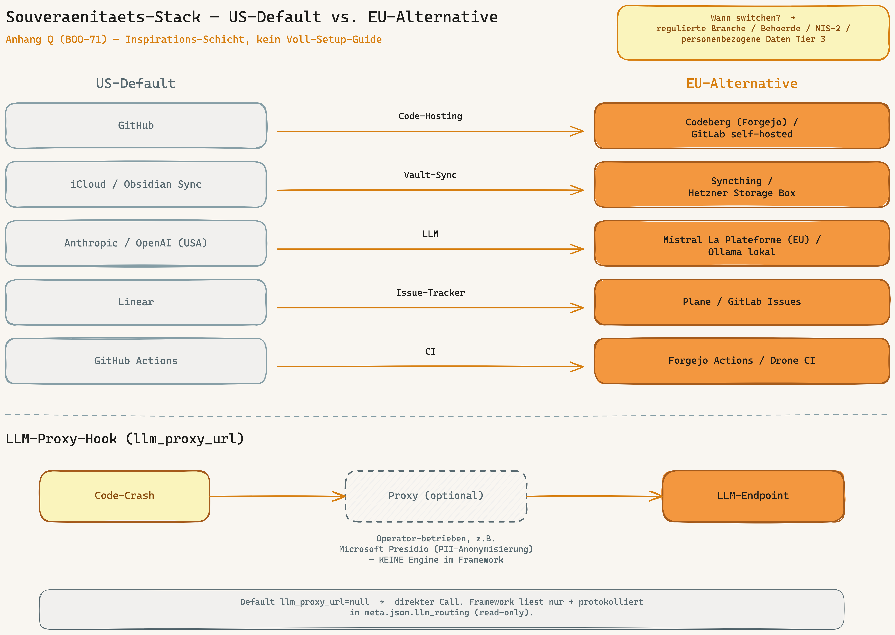

### When is a sovereignty switch worth it?

Not every project needs a sovereign stack. This decision matrix gives an honest orientation — when in doubt, align with the strictest criterion that applies.

| Trigger | Sovereignty switch needed? | Reason |
|---------|----------------------------|--------|
| Regulated industry (FINMA / BaFin / MaRisk) | Yes | Supervisory requirement for data location and outsourcing chain; US cloud usually only with special review. |
| Public-sector contract (federal / state / cantonal) | Yes | Procurement law and IT baseline protection typically demand EU location and EU contracting party. |
| NIS-2 sector (energy, transport, health, water, digital) | Yes | NIS-2 requires control over critical supply chain including LLM and code-hosting providers. |
| Personal data tier 3 (health, finance, criminal record) | Yes | Highest GDPR risk class; CLOUD-Act exposure is an audit finding. |
| Swiss client mandate with nDSG obligation | Yes | nDSG requires demonstrable data-location control and EU/CH contracting party. |
| Solo tool without EU exposure | No | Default stack is fine; sovereignty would add friction without return. |
| INTENTRON-Lite setup for hobby projects | No | Learning curve and operator effort are out of proportion; keep the default. |

### EU-compliant alternatives per stack component

The table below is the short overview. Each component then has its own subsection with a brief migration guide and a pointer to the relevant official documentation — no full setup guides, just springboard material.

| Component | US default | EU alternative | Tradeoff / Note |
|-----------|------------|----------------|------------------|
| Code hosting | GitHub | Codeberg (Forgejo) or GitLab self-hosted | Codeberg is a non-profit cooperative; GitLab self-hosted requires own maintenance. |
| Vault sync | iCloud or Obsidian Sync | Syncthing or Hetzner Storage Box with Git sync | Syncthing is peer-to-peer and needs running devices; Storage Box plus Git sync is more robust but more manual. |
| LLM endpoint | Anthropic API (USA) or OpenAI (USA) | Mistral La Plateforme (EU), AWS Bedrock Frankfurt (with CLOUD-Act residual risk), Ollama local | Mistral is an EU contracting party; Bedrock Frankfurt is still a US company with CLOUD-Act exposure; Ollama local shifts cost onto hardware. |
| Issue tracker | Linear | Plane (self-hosted) or GitLab Issues | Plane has Linear-like UX, needs self-hosting; GitLab Issues are less slim but integrate with GitLab hosting. |
| CI / build | GitHub Actions | Forgejo Actions or Drone CI on Hetzner | Forgejo Actions is mostly GitHub-Actions-compatible; Drone CI is lighter and decoupled from the forge. |

### Code hosting: GitHub → Codeberg / GitLab self-hosted

**Migration steps**

1. Create a Codeberg or GitLab account (for self-hosted: install a GitLab server on an EU VPS, see Appendix P).
2. Mirror the repo via `git push --mirror` to the new remote.
3. Review CI workflows — GitHub Actions do not run 1:1 on Codeberg/Forgejo (see CI section below).
4. Recreate team permissions and secrets in the new forge — do not copy `.env` content over.
5. Set the `git_provider` field in the bootstrap interview accordingly; disable the Linear-GitHub bridge if needed.

**External documentation**

- Consult the official Codeberg documentation (operator obtains it).
- Consult the official GitLab self-hosted documentation (operator obtains it).

### Vault sync: iCloud / Obsidian Sync → Syncthing / Hetzner Storage Box + Git sync

**Migration steps**

1. Initialise the vault as a Git repo if not already done.
2. Install Syncthing on all devices, or mount the Storage Box via SSHFS.
3. Explicitly disable iCloud sync for the vault folder (otherwise race conditions).
4. With the Storage Box variant: set up a cron job for regular Git commit and push.
5. Backup strategy as in Appendix P — Storage Box covers operator state, Git remote covers code state.

**External documentation**

- Consult the official Syncthing documentation (operator obtains it).
- Consult the Hetzner Storage Box documentation (operator obtains it).

### LLM endpoint: Anthropic / OpenAI USA → Mistral La Plateforme / AWS Bedrock Frankfurt / Ollama

**Migration steps**

1. Pick an EU endpoint contracting party — Mistral La Plateforme (EU contracting party) or AWS Bedrock Frankfurt (document CLOUD-Act residual risk explicitly).
2. Alternatively run Ollama locally if no cloud is acceptable; check the hardware requirements.
3. Adjust the model-tier mapping in `bootstrap/references/model-tiers.json` — other providers have different tier names and prices.
4. Validate cost tracking in `meta.json.token_tracking` — switching providers changes token prices; operator checks the current price list of the new provider.
5. For sensitive data, additionally set `llm_proxy_url` to insert anonymisation in front of the provider (see next section).

**External documentation**

- Consult the official Mistral La Plateforme documentation (operator obtains it).
- Consult the AWS Bedrock documentation for the Frankfurt region (operator obtains it).
- Consult the official Ollama documentation (operator obtains it).

### Issue tracker: Linear → Plane / GitLab Issues

**Migration steps**

1. Deploy Plane (self-hosted) on an EU VPS or use GitLab Issues in the already migrated GitLab.
2. Export existing Linear issues (CSV or API) and import them into the new tracker.
3. Switch the backlog tool in `/bootstrap` — the `backlog` skill supports multiple tools via configuration.
4. Reconnect webhook and bot integrations (Linear-specific automations are not portable).
5. Review action items from meeting skills — trigger logic stays, the endpoint changes.

**External documentation**

- Consult the official Plane documentation (operator obtains it).
- Consult the official GitLab Issues documentation (operator obtains it).

### CI / build: GitHub Actions → Forgejo Actions / Drone CI

**Migration steps**

1. Pick a CI provider — Forgejo Actions if you switched to Codeberg/Forgejo, Drone CI for a decoupled runner.
2. Review workflow definitions — Forgejo Actions is largely GitHub-Actions-compatible, but not every marketplace action is ported.
3. Set up a self-hosted runner (see Appendix I) — sizing as described there.
4. Store secrets in the new CI; do not copy from GitHub Actions secrets.
5. Verify coverage and lint gates from `CONVENTIONS.md` against the new runner.

**External documentation**

- Consult the official Forgejo Actions documentation (operator obtains it).
- Consult the official Drone CI documentation (operator obtains it).

### LLM proxy hook (`llm_proxy_url`)

The framework offers **one** configurable hook point for operator-side proxy solutions: the optional field `llm_proxy_url` in `.claude/environment.json`. The default is `null` — meaning a direct LLM call as before. If the operator sets a value, it is an HTTP endpoint of a self-run proxy server that performs anonymisation, logging or sovereignty routing. **The framework does NOT implement the routing** — it reads the field, records it in `meta.json.llm_routing` as an audit trail and leaves the proxy implementation to the operator.

**`environment.json` schema snippet**

```json
{
  "llm_proxy_url": "http://localhost:8000"
}
```

Default value: `null`. Any HTTP or HTTPS endpoint the operator keeps reachable is allowed.

**Example use case: anonymisation proxy with Microsoft Presidio**

A typical setup: the proxy receives the outgoing prompt, identifies personal entities (names, emails, IBANs) via Microsoft Presidio, replaces them with deterministic tokens and forwards the anonymised prompt to the actual LLM endpoint. On the way back the same proxy unmasks the response. The LLM provider therefore never sees plaintext PII while skill behaviour stays unchanged. Alternatives are equally valid — instead of Microsoft Presidio the operator can use spaCy, a custom Lambda function or another proxy. The framework prescribes nothing here.

> **Design decision:** Anonymisation is runtime infrastructure, not framework responsibility. INTENTRON provides the hook point and the audit trail — nothing more.

### Bootstrap behaviour

Bootstrap does **not** change with BOO-71 — no new interview step, no new mandatory question. `llm_proxy_url` is a power-user field; the operator sets it manually in `.claude/environment.json` after the bootstrap run. For existing projects the migration script `migrate_boo_71()` inserts the field idempotently with default `null` into `environment.json`. If you want a sovereign stack but no proxy yet, leave the field empty and switch it on later.

### Privacy ≠ sovereignty

Data sovereignty (US-vs-EU cloud providers) and privacy-by-design are **orthogonal** topics and do not replace each other. A sovereign stack with EU hosting does not exempt you from GDPR — legal bases, records of processing, deletion policy and data-subject rights apply regardless of the hosting location. Conversely, a GDPR-compliant default stack on US cloud does not protect against CLOUD-Act access or public-sector procurement rules. Operators with both requirements activate the Privacy add-on (see Appendix O) **and** pick their stack components according to this Appendix Q.

### Related appendices

- **Appendix N (Token efficiency, BOO-84):** `llm_proxy_url` and `model_overrides:` can conceptually live in the same CLAUDE.md section — both address operator choice at the LLM level.
- **Appendix O (Privacy by Design, BOO-69):** GDPR/nDSG obligations apply regardless of hosting location; the Privacy add-on and the sovereignty stack are orthogonally combinable.
- **Appendix P (Deployment scenarios, BOO-70):** An EU VPS location is a prerequisite for a sovereign stack — scenarios 2 to 4 in Appendix P are the natural home for Appendix Q.
- **Appendix F (Hermes compound layer):** Hermes routing does not change because of a proxy — the compound layer acts before the LLM call and is independent of the endpoint.

Source: BOO-71 spec. Operator feedback Martin 2026-05-27.

## Appendix R: Multi-Operator Coordination — 5 to 20+ operators (BOO-72)

Appendix P (BOO-70) describes four deployment scenarios, with scenario 4 covering **2-5 operators** on a shared coding server. But what happens when a consulting engagement with ten people adopts INTENTRON? When an in-house team of twenty developers works in parallel on the same repo? This appendix is the **inspiration layer** for operator teams beyond the solo and small-team setups. It adds **no** new skill, **no** new bootstrap question, and **no** framework convention — it only shows how the existing gates from Wave A-K play out in a larger team.

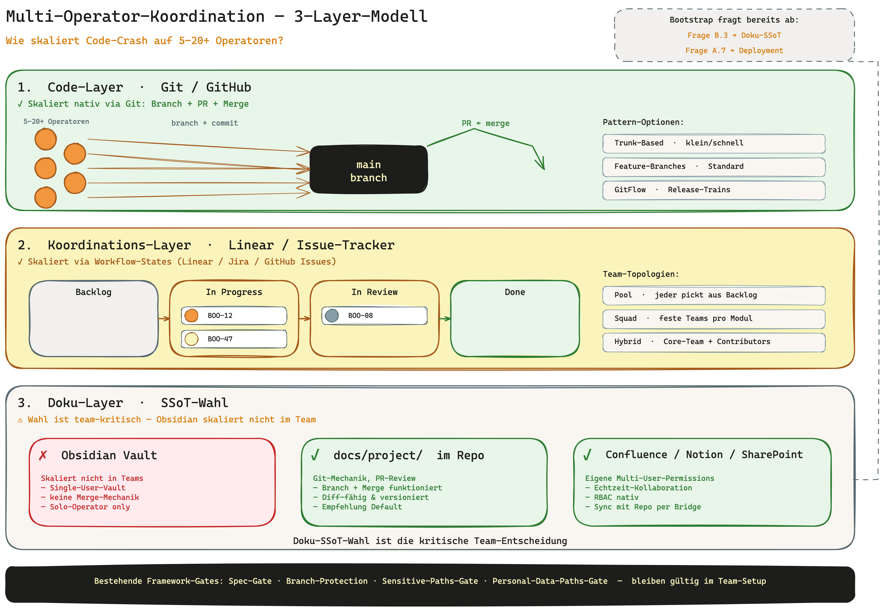

### The operator question behind Appendix R

> When 20 developers work concurrently on the same GitHub repo and pull docs from Obsidian (or Jira/Confluence/Notion) — does the framework still work? Does the framework guarantee that multiple people can work in parallel, or does the operator have to solve that themselves?

The honest answer: **partly covered, partly operator discipline.** Appendix R splits the question into three layers and answers per layer "what scales natively", "what does not", "which options the operator has".

### The 3-layer model

#### Layer 1 — Code layer (Git/GitHub)

**What scales natively:** Git is built for multi-user concurrency. Branches, PRs, merge-conflict resolution, branch protection (BOO-29) and spec-gate (BOO-4 + BOO-27) are team-ready without framework additions. Conceptually the code layer makes **no** difference between solo operator and a 20-person team — only the conflict frequency changes.

**What does not:** if operators push directly to `main`, bypass the spec-gate or merge PRs without review, governance collapses. Those are not framework gaps but team-discipline issues.

**Pattern options (branch strategy):**

| Strategy | When it fits | Trade-off |
|---|---|---|
| **Trunk-Based Development** | small stories (max 1-2 days per branch), high release frequency, feature flags for "not yet finished" code | Discipline required: branches must NOT live long, otherwise merge hell |
| **Feature branches with PR review** | standard today, robust for 5-15 operators, one branch per story | Branches can live long → merge conflicts with `main` rise |
| **GitFlow** | release-driven branches (`develop`, `release/*`, `hotfix/*` next to `main`), audit-mandated regulated domains | Complex, more branches to manage, slower release cycle |

**Recommendation per team size:**

- 5-10 operators: feature branches are enough.
- 10-20: trunk-based if release frequency is high, otherwise feature branches with a mandatory PR-reviewer pool.
- 20+: GitFlow if audit-mandated, otherwise trunk-based with CODEOWNERS discipline.

**CODEOWNERS pattern (example):** mandatory from 10 operators, strongly recommended from 5. File `.github/CODEOWNERS` with file-pattern → sub-team mapping. GitHub then enforces that every PR has at least 1 reviewer from the responsible sub-team (in combination with branch protection):

```text
# Critical governance documents require architect approval
/SECURITY.md            @owlist/sec-leads
/PRIVACY.md             @owlist/legal-leads
/ARCHITECTURE_DESIGN.md @owlist/arch-leads
/CONVENTIONS.md         @owlist/arch-leads

# Domain-specific code areas
/src/api/**             @owlist/backend
/src/ui/**              @owlist/frontend
/src/auth/**            @owlist/sec-leads @owlist/backend
/infra/**               @owlist/devops

# Docs in the repo
/docs/api/**            @owlist/backend
/docs/ui/**             @owlist/frontend
```

Important: CODEOWNERS does not replace the spec-gate — both work in parallel.

#### Layer 2 — Coordination layer (who does what?)

**What scales natively:** Linear / Jira / GitHub Issues / Azure DevOps / MS Planner ship workflow states (`Backlog → In Progress → In Review → Done`). Bootstrap question B.4 covers the backlog-adapter choice (BOO-54). "In Progress" per issue signals "this story is taken" — the same mechanic that sub-agents enforce in BOO-52 (execution isolation) on the machine level, here on the operator level.

**What does not:** the issue tracker itself does not solve "who decides conflicts on `SECURITY.md`?". "Which operator works on which module?" is also team organisation, not a tool concern.

**Pattern options (team topologies):**

| Topology | When it fits | Trade-off |
|---|---|---|
| **Pool model** | every operator pulls the next issue from a shared backlog, no fixed module owner | High flexibility, low specialisation — at 15+ people "who knows this area?" becomes the bottleneck |
| **Squad model** | 3-5 operators per module/domain, squad lead decides cross-story matters | Clearly distributed responsibility, risk of squad silos — cross-squad topics need coordination |
| **Hybrid** | pool for small stories (bug fixes, refactorings), squad for critical paths (SECURITY/PRIVACY/ARCHITECTURE_DESIGN) | Best fit to real operator capabilities, higher setup effort |

**Recommendation per team size:**

- 5-10: pool is enough. Cross-story matters get sorted out in the daily standup.
- 10-20: hybrid with a squad owner per critical path (SECURITY, PRIVACY, ARCHITECTURE_DESIGN, optionally performance + observability).
- 20+: squad model with a lead-architect role. The lead architect works cross-squad topics through with the squad leads and has a veto on architectural changes.

**Concrete example — 15-person team with hybrid topology:**

- 1 lead architect (cross-squad)
- 3 squads of 4-5 operators: Backend / Frontend / DevOps
- 1 sec-lead (cross-squad, owns `SECURITY.md` + `sensitive-paths.json`)
- 1 legal-lead (cross-squad, owns `PRIVACY.md` + `personal-data-paths.json` + DPO skill audits)
- Daily standup per squad (15 min), weekly cross-squad sync (30 min)
- Backlog in Linear, all stories have `team` filled as a custom field

#### Layer 3 — Documentation layer (Single Source of Truth)

This layer is the real drift point in a team. Code conflicts are solved by Git, issue conflicts are solved by the workflow state — but doc conflicts are semantic and require human judgement. That is exactly why bootstrap question B.3 asks for the documentation SSoT — the choice is team-critical.

> **Principle (sharply put): Obsidian is a solo tool, not an enterprise tool.** An Obsidian vault lives in the file system / iCloud of **one single person** — there is no shared vault location a team can access. For the solo entrepreneur the vault is ideal as the documentation SSoT. As soon as several people work on the same project, **the living documentation cannot live in the vault** — it belongs in the GitHub repo under `docs/`. In a team setup the vault shifts from SSoT to a **personal reading view** (see the vault-harvest pattern below).


**Documentation SSoT decision matrix per team size:**

| SSoT | Solo (1) | Small (2-5) | Medium (5-10) | Large (10-20+) | Main reason |
|---|---|---|---|---|---|
| **Obsidian vault (local)** | yes | caution | no | no | Solo tool, no semantic multi-user lock |
| **Obsidian + Git sync on the vault** | yes | caution | no | no | Sync conflicts become manual — too expensive at 5+ people; the Obsidian sync tool is meant for binary files, not for semantic merge |
| **Obsidian Sync (paid, official)** | yes | yes | caution | no | Solves technical sync conflicts, not semantic ones ("two people edit the same note at the same time") |
| **`docs/project/` in the repo (Markdown)** | yes | yes | yes | yes | Same Git mechanics as code: PR review for docs, branch protection, CODEOWNERS pattern |
| **Confluence** | caution | yes | yes | yes | External tool with its own multi-user permissions, no Git link, good for enterprises with an existing Confluence licence |
| **Notion** | caution | yes | yes | yes | External tool, own multi-user logic, version history per page |
| **SharePoint** | caution | caution | yes | yes | External tool, good for regulated enterprises with an Office-365 footprint, fine-grained permissions |

**Recommendation:**

- 1 operator: Obsidian (personal vault + index)
- 2-5: Obsidian Sync or repo docs — depending on the operator profile. If all operators are technical: repo docs. If mixed: Obsidian Sync.
- 5+: repo docs (`docs/project/`) **or** an external DMS (Confluence/Notion/SharePoint). Obsidian then becomes the **personal** brainstorming tool, not the team SSoT.

**Important:** bootstrap question B.3 sets `DOCUMENTATION_SSOT.path` once per project. Migrating the SSoT mid-flight is expensive (link drift, history loss) — the choice should be made before the first real content lands.

##### Vault-harvest pattern: repo docs **and** a personal vault (two flows)

Whoever works in a team but also keeps a personal knowledge vault across several projects (cross-project insights: auth patterns across all projects, sprint-retro trends) does not have to choose between repo and vault. The **vault-harvest pattern** combines both via **two clearly separated flows** — visualised in the diagram above:

- **Flow 1 — plain Git (all operators, bidirectional):** the documentation lives in the GitHub repo under `docs/`. Everyone develops locally, `git push` / `git pull` like code. The GitHub repo is the **team SSoT** (the truth). Conflicts are resolved by the normal PR review.
- **Flow 2 — vault harvest (per person, one-way repo → vault):** after each `git pull` a **`git post-merge` hook** copies selected `docs/` files into the operator's **personal** Obsidian vault — and **never back**. The vault is a private read-only reading view, not a sync target. No cron job, no webhook — the git hook fires automatically on pull.

**Properties (from Stefan's `project-template` reference implementation):**

- **Versioned team contract** (`.vault-sync/tracked-paths.json`): defines which repo paths are harvestable, which `type:` frontmatter is added on mirror (e.g. `docs/components/*.md` → `type: component`, `journal/sprint-*.md` → `type: sprint-retro`) **and where the file lands in the vault by default** (`default_vault_subdir` with `{project_slug}` placeholder, BOO-82) — so each operator no longer repeats the same paths in their `local.json`.
- **Per-operator personal config** (`.vault-sync/local.json`, **gitignored**): vault path, `project_slug`, optional path override (`path_mappings`, empty = contract default applies), `enabled`. It is in `.gitignore` → not committed, so the private vault path does not leak to the team.
- **Zero friction for non-participants:** an operator without `local.json` (no Obsidian, no harvest wanted) → the hook exits silently (`exit 0`), no error, no nagging.
- **The vault is never modified manually:** annotations go into `.notes.md` sidecar files that the sync never touches. Frontmatter namespace `vault_sync_*` (collision-free, filterable in Bases).
- **Delineation from DocSync (Block D.2):** our DocSync is solo + bidirectional (vault ↔ repo). Vault harvest is team + one-way (repo → vault). In team mode therefore set **DocSync = no** — otherwise the two mechanisms overlap.

**Activation:** bootstrap question B.3 offers the option *"Repo docs + personal vault harvest"* (see Bootstrap Block B.3). Since **BOO-77** the sync engine is **framework-native** — bootstrap copies `scripts/vault-sync.py`, `scripts/install-vault-sync.sh`, `.claude/hooks/post-merge.sh` and `.vault-sync/tracked-paths.json` directly into the project (Python stdlib + Bash, no dependencies, no external code). Each operator optionally enables the harvest with `bash scripts/install-vault-sync.sh` (default mode `dry-run`) — `path_mappings` stays empty, the vault target comes from the team contract's `default_vault_subdir` (BOO-82). **Incremental sync (BOO-82):** `python3 scripts/vault-sync.py --since <sha>` mirrors only files changed since `<sha>` (falls back to a full sync on an invalid SHA) — for large repos. **Security:** one-way (writes only into the vault), path-containment check (no writing outside `vault_path`), `exit 0` without `local.json`. Data contract + schema: `bootstrap/references/vault-sync-pattern.md`. **Step-by-step activation guide** (init prompts, dry run, `auto` switch, verification): same file, §"Activating the vault harvest — step by step".

### Four-eyes convention for sensitive paths and personal-data paths

In the solo setup the operator sets `review-ok` (sensitive-paths gate, BOO-18) or `privacy-ok` (personal-data-paths gate, BOO-69) themselves — self-approval is acceptable because there is nobody else. **In a team, self-approval is an audit risk.** Appendix R recommends the **four-eyes convention:**

- The operator who changes a sensitive or personal-data path must **not** be the same one who sets `review-ok` or `privacy-ok`.
- In the PR review, a **different** operator (sec-lead, legal-lead, or an explicitly named reviewer) sets the gate token.
- The audit trail runs through `git log` and `git blame` — whoever set the gate is visible in the commit author.

Example audit trail:

```bash
$ git log --oneline -5 -- src/auth/jwt.go
a3f1d22 review-ok: jwt rotation reviewed by @sec-lead (closes BOO-XYZ)
e8b227a feat: rotate jwt signing key every 24h (BOO-XYZ)
$ git log --format='%H %an' a3f1d22 e8b227a
a3f1d22 Sec Lead          # review-ok set by a different person
e8b227a Backend Operator  # actual change
```

**Important:** the framework does **not** enforce the four-eyes convention today — it would be theoretically checkable in the sensitive-paths gate (author of the gate commit != author of the change), but would raise framework complexity and duplicate audit tooling like `git blame`. Appendix R documents the convention as operator discipline; BOO-72 explicitly excludes enforcement.

### Skill-pool governance in the team

Appendix P scenario 3 (multi-user VPS) already had two skill-pool options: global under `/opt/claude/skills/` (read-only for users) or per user in `~/.claude/skills/` (own copy). At 10-20 operators that is not enough — a **maintenance-owner role** is required:

- **Maintenance owner** (1 person, often the lead architect or DevOps): looks after the global skill pool. Updates via `git pull` as root or via a dedicated service account. Per skill version bump: changelog entry, short operator mail or Slack note.
- **User view:** operators call skills via `~/.claude/skills/` symlinks to `/opt/claude/skills/`. On drift (a local operator has their own skill state): the maintenance owner runs periodic audits via `jq` against the users' `~/.claude/settings.json`.
- **Skill quarantine:** new skills from external sources are reviewed by the maintenance owner via `security-architect --mode SKILL-SCAN` before they land in `/opt/claude/skills/`.

For a hybrid pool (some skills global, some per user) the choice must be documented in `CONVENTIONS.md`, otherwise nobody remembers which variant applies.

### Conflict escalation on critical governance paths

What happens when two operators want to merge contradictory changes into `SECURITY.md`, `PRIVACY.md` or `ARCHITECTURE_DESIGN.md`? Appendix R recommends **three escalation steps:**

1. **CODEOWNERS owner decides** — whoever is listed in CODEOWNERS for the path has the final say. In most cases that is enough.
2. **Squad-lead mediation** — when two CODEOWNERS people disagree (e.g. sec-lead vs. backend lead on `src/auth/`), the squad lead of the affected module mediates.
3. **Lead-architect veto** — cross-squad topics or architecture changes with system-level impact get escalated by the squad lead to the lead architect. The lead architect has a veto and records the decision in `Decisions/ADR-XX.md`.

Important: escalation is a convention, not a framework mechanism. It only works if the team actively lives it. Appendix R is inspiration — how the team fills the roles is a team matter.

### How do you set up INTENTRON for a 20-person team?

Concrete 10-step guide that extends Appendix P scenario 3 (multi-user VPS coding factory):

1. **VPS setup** (Appendix P scenario 3): VPS with 1 system user per operator, skill pool global under `/opt/claude/skills/` (read-only), repository worktrees per user under `~/projects/<project>/`, maintenance-owner role assigned.
2. **Bootstrap run once by the lead architect:** Question B.3 = `docs/project/` in the repo **or** Confluence/Notion. Question B.4 = Linear or Jira. Question A.5 = `heavy` governance. Question A.7 = `b) other` with a pointer to this scenario.
3. **Maintain the CODEOWNERS file** (example above). On first setup, work it out together with the lead architect and the squad leads.
4. **Extended branch protection:** required-reviewer pool from CODEOWNERS, required status checks (spec-gate, lint-gate, coverage-gate, optional security scan, optional DPO audit hook), `Dismiss stale reviews when new commits are pushed`, `Require linear history`.
5. **Four-eyes convention for gates:** `privacy-ok` / `review-ok` must NOT be set by the same operator who made the change. Operator discipline, traceable in the audit log via `git blame`.
6. **Squad model with 3-5 operators per module** + 1 lead architect + 1 sec-lead + 1 legal-lead. Squad leads own their module in CODEOWNERS; sec/legal-leads own the governance paths.
7. **Document conflict escalation explicitly** — add an "Escalation path" section to `CONVENTIONS.md` with the three steps above. Without written form the team forgets it in the heat of a conflict.
8. **Daily standup per squad (15 min)** + weekly cross-squad sync (30 min). Backlog grooming happens every second standup wave, not ad-hoc.
9. **Live the maintenance-owner role actively:** write skill-pool updates down, run drift audits regularly (e.g. monthly), skill quarantine for external skills.
10. **Onboarding documentation** under `DEVELOPER_ONBOARDING.md` — reference Appendix R explicitly so new operators understand the 3-layer model before they file their first PR.

### What Appendix R does not do

Clear delimitation against the INTENTRON philosophy "lightweight + pragmatic":

- **No new skill.** Appendix R is pure documentation.
- **No new bootstrap question.** Bootstrap already asks for the documentation SSoT (B.3) and backlog adapter (B.4) — that is enough.
- **No framework convention for "who is lead architect"** — that is team organisation.
- **No four-eyes enforcement in the sensitive-paths gate.** Theoretically possible (author comparison), deliberately NOT implemented — operator discipline stays operator discipline.
- **No "best practice" verdict.** Pattern options are trade-off tables, not recommendations dressed up as rules.
- **No provider recommendation for Confluence/Notion/SharePoint** — the operator picks.

### Related appendices

- **Appendix P (Deployment scenarios, BOO-70):** Scenario 3 (multi-user VPS coding factory) and scenario 4 (team with coding server) are the infrastructural basis for Appendix R. Anyone serving 20 operators needs the VPS setup from scenario 3.
- **Appendix Q (Sovereignty stack, BOO-71):** orthogonal — a 20-person team can run on the default stack or on the EU stack. Sovereignty is an industry question, not a team-size question.
- **Appendix O (Privacy by Design, BOO-69):** particularly important in a team setup — DPO skill audits via `/sprint-review` step 7c gain value as the operator count grows because more code changes pass through per sprint.
- **Appendix N (Token efficiency, BOO-84):** at 20 operators with several stories per day, token cost becomes a FinOps topic. Model routing + prompt caching are no longer nice-to-have but cost levers.
- **HANDBUCH §8d (coding environments):** technical Mac/VPS/CI distinction, prerequisite for Appendix P scenarios 2-4.

Spec: BOO-72. Operator question Tobias 2026-05-27 after the Wave K release. Sketch: [docs/assets/boo-72-multi-operator-3-layer.png](docs/assets/boo-72-multi-operator-3-layer.png).


## Appendix S: Skill Installation Strategy — where do the skills belong? (BOO-76)

One of the most frequent operator questions: **"Where do I actually install the skills?"** The old blanket answer was "per project" — but that creates update load (every project must be refreshed separately when the skill repo changes). This appendix consolidates the answer, scattered across bootstrap Phase 5, Appendix P (scenario 3) and Appendix R (skill-pool governance), into **one** place and gives a clear recommendation per deployment scenario — also for other AI tools, not just Claude Code.

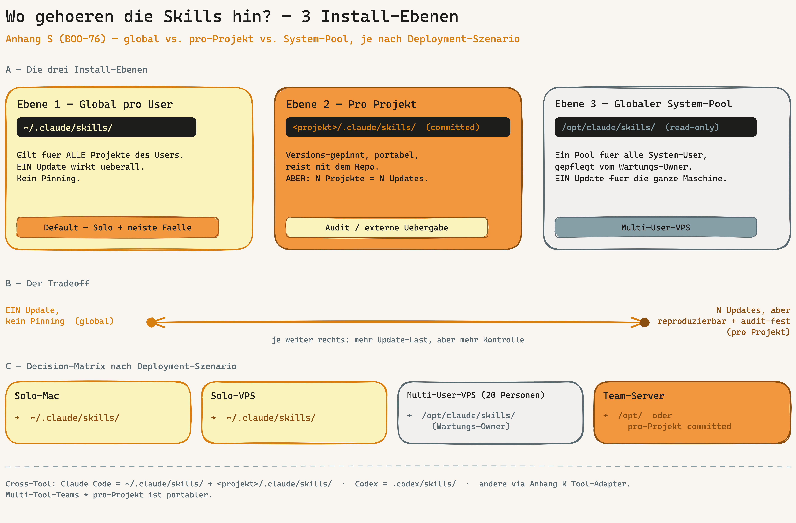

### The three install levels

| Level | Path | Property | When |
|-------|------|----------|------|
| **1 — Global per user** | `~/.claude/skills/` | Applies to ALL of the user's projects. **One** update takes effect everywhere. No version pinning. | Default — solo + most cases |
| **2 — Per project** | `<project>/.claude/skills/` (committed) | Version-pinned, portable, travels with the repo, reproducible for the team. **But:** N projects = N updates, repo grows. | Audit pinning / external handover |
| **3 — Global system pool** | `/opt/claude/skills/` (read-only) | One pool for all system users of a machine, maintained by the **maintenance owner**. **One** update for the whole machine. | Multi-user VPS |

### The central trade-off (operator's core question)

It is a balance between **update load** and **reproducibility**:

- **Global (level 1/3):** one update, all projects/users benefit immediately. **Risk:** no pinning — a skill change can break a project that relied on the old behaviour.
- **Per project (level 2):** more update work (each project separately), but every project is **reproducible + audit-proof** — the skill revision travels with the repo and is git-versioned.

**Rule of thumb:** global as default (low friction). Per-project pinning **only** when (a) a project needs a frozen skill revision for audit/reproducibility, or (b) the project is handed to an external team / another tool that does not share the global pool.

### Recommendation per deployment scenario (see Appendix P)

| Scenario | Default location | Per-project pinning when |
|----------|------------------|--------------------------|
| **Solo-Mac** | `~/.claude/skills/` (global per user) | only for audit-bound projects |
| **Solo-VPS** | `~/.claude/skills/` (global per user) | only for audit-bound projects |
| **Multi-user VPS (e.g. 20 operators)** | `/opt/claude/skills/` (system pool, read-only, maintenance owner) | reproducible client projects |
| **Team-with-coding-server** | `/opt/claude/skills/` **or** per-project committed | external handover / multi-tool setup |

**The 20-person VPS case concretely:** do **not** install per project (20 users × N projects = update hell). Instead use **one** global system pool under `/opt/claude/skills/`, read-only for all users, maintained by **one** maintenance owner (see Appendix R skill-pool governance). One `git pull` in the pool and all 20 operators have the new revision immediately. Per-user `~/.claude/skills/` only for personal extra skills. Per-project install only when a specific client project needs a frozen, auditable skill revision.

### Cross-tool — not just Claude Code

The install levels apply analogously to other AI tools (see Appendix K Tool-Adapter):

| Tool | Global | Per project |
|------|--------|-------------|
| **Claude Code** | `~/.claude/skills/` | `<project>/.claude/skills/` |
| **Codex** | (tool-specific) | `<project>/.codex/skills/` |
| **Others (Cursor, Copilot, ...)** | tool-specific | via Appendix K Tool-Adapter (e.g. `AGENTS.md` as a universal bridge) |

**Multi-tool teams:** when a team mixes several AI tools, the **per-project committed approach is more portable** — each tool finds "its" skills in the repo (`.claude/skills/`, `.codex/skills/`) instead of depending on a tool-specific global pool. Bootstrap supports this via `RUNTIME_TARGET` (claude-code / codex / cross-tool) in Phase 5.

### How bootstrap handles it

Bootstrap Phase 5 installs into `.claude/skills/` and/or `.codex/skills/` (per project) depending on `RUNTIME_TARGET`. For the **global** pool (level 1/3), installation is the operator's job (`git clone` into `~/.claude/skills/` or `/opt/claude/skills/`) — bootstrap does not force a level, it documents the choice. The DPO/security-architect bundle skills (BOO-74) come from the same framework repo regardless of level.

### What to install once, what per project?

The skill question is only one part. Operators with several projects on one VPS/Mac rightly ask: "linters, tools, hooks — do I do this per project or once?" The honest answer has one important exception for hooks:

| Component | Once (machine/user) | Per project | Why |
|-----------|---------------------|-------------|-----|
| **System linters/tools** (Semgrep, Ruff, globally installed ESLint, SonarScanner) | ✅ once per machine | — | CLI tools live system- or user-wide (`brew`, `pipx`, `npm -g`). On a multi-user VPS, system-wide for all users. |
| **Project dev-deps** (ESLint/Prettier in `package.json`, pytest) | — | ✅ `npm install` / `pip install` per project | Version-pinned in the project — that is intended (reproducible lint revision per repo). |
| **Skills** (global pool) | ✅ once (`~/.claude/skills/` or `/opt/claude/skills/`) | only for audit pinning | See the decision matrix above. |
| **Git hooks** (spec-gate, doc-version-sync, post-merge) | ❌ **not once** | ✅ **per repo** | `.git/hooks/` is **not** cloned with the repo. Every fresh `git clone` has no hooks yet — bootstrap installs them per project. **Exception:** `git config --global core.hooksPath <dir>` points all repos at a shared hooks dir (then once, but not the default convention). |
| **`.claude/environment.json`** | — | ✅ per project | Manifest that **detects** the once-installed tools per project (`tools_available`). The tool exists once, the manifest is per project (BOO-34). |

**Rule of thumb:** system tools + global skill pool = once per machine, then it does not matter how many projects. **But git hooks and `environment.json` are per project** — re-set them for every new repo/clone (bootstrap resp. `generate-environment-json.sh` do this). To have hooks truly once, set `core.hooksPath` globally.

### Container profile (optional, BOO-81)

The **default** stays system install (above). For **team setups** where all operators need an **identical, reproducible toolchain** ("no works on my machine"), there is an optional container profile:

- `bootstrap/references/devcontainer/Dockerfile` — lean Node+Python image with Semgrep, Ruff, ESLint, jq.
- `bootstrap/references/devcontainer/devcontainer.json` — VS Code/CLI dev container; `postCreateCommand` runs `generate-environment-json.sh` so the skills detect the container tools.
- Copy via a bootstrap option or `migrate-to-v2.sh --issue BOO-81` → lands as `.devcontainer/` in the project.

| | System install (default) | Container profile (optional) |
|---|---|---|
| **For whom** | solo + most cases | teams needing version lockstep, CI |
| **Pro** | lightweight, no Docker needed | identical toolchain for all, CI-reusable |
| **Con** | tool versions may differ per machine | Docker dependency, image build time |

**Decision:** the container is **opt-in**, not a new mandatory bootstrap step — the INTENTRON lightweight principle. Whoever uses it runs `bash scripts/verify-setup.sh` (Appendix T) inside the container to confirm the toolchain. Details: `bootstrap/references/devcontainer/README.md`.

### Related appendices

- **Appendix P (Deployment scenarios):** defines the four environments the decision matrix above refers to. Scenario 3 (multi-user VPS) is the main use case for the system pool.
- **Appendix R (Multi-operator coordination):** the maintenance-owner role + skill-pool governance (global vs. per user, drift audit) is described there.
- **Appendix K (Tool-Adapter):** how the framework is used with other AI tools — the basis for the cross-tool view.
- **Bootstrap Phase 5:** the per-project installation (`RUNTIME_TARGET`-driven).

Source: recurring operator question Tobias 2026-05-28. Consolidates bootstrap Phase 5 + Appendix P scenario 3 + Appendix R.

---

## Appendix T: Post-install verification — "framework installed, does it actually work?" (BOO-79)

Bootstrap is done — but how do you know the scaffold actually **works**? Linters reachable, hooks firing, skills writing artifacts, artifacts present? This appendix gives the **proof checklist** — walk it manually, or automate it via `scripts/verify-setup.sh` (BOO-79), which bootstrap calls itself in Phase 7.3b.


### Automated: `scripts/verify-setup.sh`

```bash
bash scripts/verify-setup.sh            # report, exit 1 on FAIL
bash scripts/verify-setup.sh --strict   # WARN also counts as FAIL (CI)
bash scripts/verify-setup.sh --quiet    # summary + exit code only
```

Read-only, changes nothing. Prints `PASS` / `WARN` / `FAIL` per check plus a summary. Exit code 1 on FAIL → CI-capable (e.g. as a gate in the onboarding workflow). Source: `bootstrap/references/verify-setup.sh`.

### Manual: the checklist point by point

| # | Check | How to check | PASS means |
|---|-------|--------------|------------|
| 1 | **Environment manifest** | `.claude/environment.json` exists + `environment` field set | skills know mac/vps/ci + which tools are available |
| 2 | **Toolchain reachable** | per `tools_available: true` a `command -v <tool>` (eslint via `npx --no-install` ok) | what the manifest promises is actually installed |
| 3 | **Git hooks** | `.git/hooks/pre-commit` exists + executable; spec-gate + doc-version-sync wired | no commit without spec, no push with stale docs. **Note: hooks are per repo** — re-set after `git clone` (see Appendix S) |
| 4 | **Core artifacts** | `CONVENTIONS.md`, `ARCHITECTURE_DESIGN.md` present; `specs/`, `journal/` as directories | the governance scaffold stands; skills find their SSoT |
| 5 | **Skill writes artifacts** | run a mini `/implement` trial (or `/ideation`) → does it create `specs/<ISSUE>.md` + `meta.json`? | the skills genuinely interlock (not just installed, but functional) |
| 6 | **Privacy add-on** (if active) | `PRIVACY.md` + `personal-data-paths.json` present | the personal-data-paths gate is armed |
| 7 | **Backlog adapter** | `.claude/ISSUE_WRITING_GUIDELINES.md` resp. backlog config present | stories land in the right tool with DoD mandatory fields |

Checks 1-4, 6-7 are covered automatically by `verify-setup.sh`. **Check 5 (skill writes artifacts) stays a deliberate manual step** — a real `/implement` trial against a throwaway story shows the end-to-end proof a shell script cannot (this is the core of the earlier E2E smoke-test idea, BOO-48).

### Optional full proof before rollout: the 5-step E2E trial protocol (BOO-48 pattern)

`verify-setup.sh` proves the scaffold **stands**. Before a larger rollout (e.g. onto several VPS) you also want to prove the skills **interlock** — that an issue runs through the whole pipeline from idea to sprint review and all artifacts are created correctly along the way. This is **not a shell script and not a CI action**: `/bootstrap`, `/ideation`, `/implement`, `/sprint-review` are LLM-driven slash skills, not deterministic CLIs — they cannot be scripted. The full proof is therefore a **manual, Claude-guided trial** in a throwaway directory (`/tmp/bundle-smoketest-<date>/`), played through once before rollout:

| Step | Action | PASS criterion |
|------|--------|----------------|
| 1 | `/bootstrap` with default answers in the empty directory | core artifacts present (`CONVENTIONS.md`, `ARCHITECTURE_DESIGN.md`, `.claude/environment.json`, `specs/`, `journal/`, git hooks). Then `bash scripts/verify-setup.sh` → all `PASS` |
| 2 | `/ideation` for a throwaway story (e.g. "health-check endpoint") | `specs/<ISSUE>.md` created with all mandatory sections; sprint-box / intent gate fire as expected |
| 3 | `/implement` for the same story | quality gate runs (ESLint/Semgrep/coverage), `journal/reports/local/<run>/` + `meta.json` are created, spec gets a session reference |
| 4 | `/sprint-review` | reads `journal/reports/local/`, writes an L1 learning entry into `journal/learnings.md` |
| 5 | **consistency check** | `doc-version-sync.sh` engages, `git commit` is correctly allowed/blocked by the spec gate, skill frontmatter consistent. Then delete the throwaway directory |

**PASS = all 5 steps interlock, no missing artifact between skills.** On a FAIL it shows exactly at which skill boundary an artifact/path convention breaks. This run does not replace the routine verification (`verify-setup.sh` after each clone); it is the **one-off rollout proof** — run it before the VPS rollout (Appendix P / BOO-9) and after larger bundle changes.

### When to run?

- **Right after bootstrap** (Phase 7.3b does this automatically).
- **After every `git clone`** of an existing project on a new machine — because hooks + `environment.json` are per repo/machine, not part of the repo content (Appendix S).
- **In CI** as a gate (`--strict`), so a pull request with a broken governance scaffold stands out.

### Related appendices

- **Appendix S (Skill installation strategy):** explains *what is installed once vs. per project* — verification checks whether the per-project part (hooks, environment.json, artifacts) is actually there.
- **Appendix A (Pre-bootstrap checklist):** the counterpart *before* bootstrap.
- **`/integration-test` skill:** checks code *changes* after each implement — Appendix T checks the *setup* once.

Source: operator question Tobias 2026-05-28 ("I need the proof"). **Closes BOO-48 (E2E smoke test):** the setup side automated via `verify-setup.sh`, the functional run via the 5-step protocol above. The originally envisioned fully automated CI bash smoke test is deliberately dropped — LLM-driven slash skills cannot be scripted. Script: `bootstrap/references/verify-setup.sh`.

---

## Appendix U: Multi-project operation — project 2..N + onboarding an existing project (BOO-80)

You have INTENTRON on a machine (VPS/Mac) — and now the **second, third, tenth** project arrives. Do you reinstall everything each time? No. This appendix cleanly separates **what happens once per machine** from **what happens per project**, and shows the three onboarding paths.


### Machine level (once) vs. project level (each time)

The detail is in Appendix S ("What to install once, what per project?"). Short version:

- **Machine — once:** system tools (Semgrep, Ruff, ESLint), the global skill pool (`~/.claude/skills/` or `/opt/claude/skills/`), `~/.claude` config. Applies to **all** projects on the machine.
- **Project — each time:** `CLAUDE.md`, **git hooks (per repo!)**, `.claude/environment.json`, `specs/`, doc-SSoT choice. The `.git/` directory is not cloned — that is why hooks + environment.json must be re-set per repo.

### The three onboarding paths

**Path 1 — New project from scratch.** Full `/bootstrap` (10 questions, 4 blocks). Block B detects existing infra; if the base is already there (tools, global skill pool), Phase 5 skips skill installation. You still answer the project core (stack, backlog, doc-SSoT, governance intensity).

**Path 2 — Project 2..N (base present).** Bootstrap fast path: Block B detects tools + global skill pool → machine setup is skipped. The focus is the **project level**:

1. Project directory + GitHub repo (Block B).
2. `CLAUDE.md` from template (project core).
3. **Install git hooks** — per repo, because `.git/hooks/` is not cloned.
4. `bash .claude/generate-environment-json.sh` — detects the once-installed tools for this project.
5. Choose the doc-SSoT (Block B.3 — often the same as project 1, but decidable per project).
6. `bash scripts/verify-setup.sh` (Appendix T) → proof that everything interlocks.

Effect: project 2..N is governance-ready in minutes, without reinstalling tools/skills.

**Path 3 — Onboard an existing project.** No new skill needed — a **documented path**:

1. Start `/bootstrap` in **merge mode**: Block B detects existing files and asks "backup / add only missing governance files / abort". Choose **merge** (only create missing governance files, do not touch existing code).
2. `bash bootstrap/scripts/migrate-to-v2.sh --all` (or selectively `--issue BOO-N`) retrofits the governance building blocks (hooks, gates, environment.json, privacy/vault-harvest if wanted).
3. `bash scripts/verify-setup.sh` — closes the gap list.

### Per-project minimal checklist

What **must** happen per project, otherwise gates + skills do not engage:

- [ ] `CLAUDE.md` (project contract) present
- [ ] **Git hooks installed** (`.git/hooks/pre-commit` — per repo!) — or `core.hooksPath` set globally
- [ ] `.claude/environment.json` generated (tool reachability for this project)
- [ ] Doc-SSoT chosen (Block B.3)
- [ ] `bash scripts/verify-setup.sh` shows 0 FAIL

### Related appendices

- **Appendix S (Skill installation strategy):** the "once vs. per project" in detail — the foundation for this appendix.
- **Appendix T (Post-install verification):** the per-project proof (`verify-setup.sh`).
- **Appendix P (Deployment scenarios):** the topology the projects sit on (Solo-Mac / VPS / multi-user VPS).
- **Appendix Y (VPS/cloud team runbook):** the full once-per-VPS vs. per-project lifecycle this multi-project flow is part of.
- **Bootstrap Block B + Phase 5:** infra detection + skill installation that enable the fast path.

Source: operator question Tobias 2026-05-28 ("several projects — bootstrap per project or a base-already-there path?").

---

## Appendix V: Layer 0 — Edit-Bodyguard (BOO-86)

### When and why

The quality gate (Appendix §8d, BOO-2/4/15/16) catches unsafe code at three points: in the IDE (Layer 1), at pre-commit (Layer 2), and in CI (Layer 3). What they share: they all engage **after** the AI has written the code. The **Edit-Bodyguard** inserts a **Layer 0 BEFORE** that chain — it inspects the code block at the moment the AI wants to write it to disk, and can stop it **before** the write happens. With it, the three-layer becomes a **four-layer quality-gate architecture**.

Concretely, Layer 0 is a **`PreToolUse` hook on `Edit|Write`** (a sibling hook to `spec-gate.sh`, which fires on `Bash`/`git commit`). It reads the `tool_input` JSON, matches the planned content against a small, curated pattern set (secrets, `eval`, disabled TLS verification, SQL concatenation), and reports hits **before** the file is created. Unsafe material never even reaches the repo state — the fastest possible reflex.

### Placement in the four-layer architecture

| Layer | Engages when | Tool | Depth |
|-------|--------------|------|-------|
| **Layer 0 — Edit-Bodyguard** | **before** the write (PreToolUse) | `pre-edit-bodyguard.sh` | shallow, curated patterns — fast reflex |
| Layer 1 — IDE | while typing | Error Lens, ESLint plugin | live, editor-dependent |
| Layer 2 — CLI / pre-commit | before the commit | ESLint/Ruff, Semgrep | full, locally blocking |
| Layer 3 — CI | before the merge | GitHub Actions | full, `--no-verify`-safe |

**Important:** Layer 0 is **lightweight** and does not replace Layers 2/3. **NO full Semgrep/SAST run in the hook** — depth stays in Layer 2 (local Semgrep pass) and Layer 3 (CI). Layer 0 is the fast, context-independent reflex on unambiguous patterns; the thorough analysis happens further down the chain.

### Pattern layering (base + overlay)

The hook loads its patterns in three layers, each later one overriding the earlier by `name`:

1. **`_universal.yml`** — language-independent secrets (AWS key, private-key block, Slack/GitHub token, generic secret assignment).
2. **language-specific file** (`python.yml`, `javascript.yml`, `java.yml`, `c-cpp.yml`) — selected by file extension (e.g. `subprocess(..., shell=True)`, `verify=False`, `rejectUnauthorized: false`, `eval(`, SQL concatenation).
3. **`.claude/bodyguard.local.yml`** — **optional** project overlay. Customer-owned, same schema, **overrides the base by `name`** and **survives framework updates** (e.g. ban an internal legacy endpoint).

Pattern schema (flat YAML subset, read by the mini-parser in the hook — no PyYAML needed): `name` · `pattern` (regex) · `sprache` (language) · `quelle` (source: CWE/OWASP/gitleaks/Semgrep — mandatory as audit evidence) · `action` (`block|warn`).

### Default warning, hard block via env

The default is **warning** (`action: warn`) — deliberately low false positive to avoid **alert fatigue** (a hook that nags constantly gets switched off). Only unambiguous, context-independent hits (secrets, disabled TLS verification, `gets`) are `action: block`. If you want a hard gate, set **`BODYGUARD_STRICT=1`** — then `warn` patterns also become blocks (opt-in hard block).

### Maintenance (keep it curated and small)

The patterns are **curated from recognized catalogs, not invented** — each carries its evidence in the `quelle` field. **Principle: few patterns with a high hit rate** — better 30 watertight ones than 300 annoying ones. The **base** ships with framework versions, the **overlay** is project-owned. An optional `sync-bodyguard-patterns.sh` reconciles against upstream and **proposes** new patterns — the human decides, **NO auto-merge** (supply-chain protection).

### Prompt-layer sibling

Layer 0 is the deterministic backstop to the **secure-coding hint** in `/implement` Step 5 (shift-left at the prompt layer): the AI already writes secure-by-default (secrets in env/secret manager, parametrized queries, TLS verification on, no `eval`/`exec` on foreign input), and the bodyguard catches whatever slips through anyway.

### Related appendices & sources

- **Appendix §8d (four-layer quality gate):** Layers 1-3, in front of which Layer 0 inserts itself.
- **`bootstrap/references/file-templates.md §pre-edit-bodyguard`:** canonical source — hook script, all pattern files, schema, and anti-patterns.
- **`bodyguard/SOURCES.md`:** provenance (CWE/OWASP/gitleaks/Semgrep) + maintenance convention per pattern.
- **`/implement` Step 5 (secure-coding hint):** the prompt-layer variant for which Layer 0 is the backstop.

Source: BOO-86 (Layer-0 Edit-Bodyguard).

---

## Appendix W: Contribute-back loop (BOO-90)

### The problem

At bootstrap the framework copies governance artifacts into the project — hooks, gates, conventions. In the field these copies get **touched**: an operator fixes a bug in a scaffolded hook, adapts a pattern file, sharpens a gate. This makes the copied artifacts drift away from their canonical source and — more seriously — a good **field fix has no systematic way back** today. It stays stuck in the one project; no other deployment benefits. The concrete trigger was the `coverage-check` fix from the `privacy-proxy` project (BOO-88): a manual backflow that worked well but was handwork. That should become systematic.

### The two directions

Drift between source and field copy is **bidirectional** — so there are two separate mechanisms:

| Direction | Mechanism | Who drives it | BOO |
|-----------|-----------|---------------|-----|
| **Source → field** | Version marker on the artifact + replacing migration (e.g. `coverage-check v2`) | Framework update | BOO-88 |
| **Field → source** | `contribute-fix.sh` generates a patch + issue proposal | Operator (submitted manually) | BOO-90 (this appendix) |

Source→field is the distribution direction: a new framework release carries a version marker (e.g. `coverage-check v2`) and ships a **replacing migration** that retires the old field copy in a controlled way. Field→source is the feed-back direction and the subject of this appendix.

### Using `contribute-fix.sh`

The helper detects locally modified framework artifacts in a deployed project (initially the scaffolded hooks under `.claude/hooks/`, canonical in `bootstrap/references/hooks/` — BOO-89) and produces **two files per deviation**:

```bash
bash <framework>/bootstrap/scripts/contribute-fix.sh --project .
```

Output per deviation under `contribute-back/`:

- **`<name>.patch`** — the diff of the field copy against the canonical source.
- **`<name>.proposal.md`** — a ready-made issue proposal the operator can file against the framework repo.

**NOTHING is pushed automatically.** No auto-PR, no auto-push. The helper only prepares the patch and the proposal — the **operator submits it themselves** and keeps control over what flows back into the source (supply-chain and review discipline).

### Coupling to BOO-89 (single-source hooks)

`contribute-fix.sh` can only cover what has a **canonical source**. BOO-89 consolidates the scaffolded hooks onto a single source under `bootstrap/references/hooks/` — exactly the source the helper compares against the field copy. **The more hooks become canonical, the more `contribute-fix.sh` covers automatically.** Coverage grows along with the single-source migration, without the helper itself having to change.

### Limits & consequence

Today `contribute-fix.sh` is limited to the **scaffolded hooks** — other artifact classes (pattern files, gate scripts, conventions) are not yet captured. Generalization to further canonical artifacts follows later, once their single source is in place (coupled to BOO-89).

### Related appendices & sources

- **`bootstrap/scripts/contribute-fix.sh`:** the helper itself (invocation, output layout).
- **`bootstrap/references/hooks/`:** canonical source of the scaffolded hooks (BOO-89) — comparison basis.
- **Appendix V (Edit-Bodyguard):** an example of a scaffolded, pattern-driven artifact whose overlay/source raises similar drift questions.

Source: BOO-90 (contribute-back loop), BOO-89 (single-source hooks), BOO-88 (version marker + replacing migration, the reverse direction).

---

## Appendix X: CONTEXT.md — ubiquitous language (BOO-91)

### What ubiquitous language is

*Ubiquitous language* is a core concept from Domain-Driven Design (Eric Evans): **one** vocabulary that domain experts, docs and code all share — the same entity is named the same everywhere. Without a fixed vocabulary the AI invents synonyms: sometimes `User`, sometimes `Customer`, sometimes `Betroffener` for the same thing. That leads to fragmented code, poor `grep`-ability, misalignment between docs and implementation, and token waste (the AI re-guesses which term is meant on every run). `CONTEXT.md` anchors the ubiquitous language as an artifact in the project.

### Why `canonical + forbidden + source`

The vocabulary is a table with three columns:

| Column | Purpose |
|--------|---------|
| **`canonical`** | the term the AI should use (e.g. `Betroffener`) |
| **`forbidden`** | the synonyms it should **not** use (e.g. `User` / `Customer` in a PII context) |
| **`source`** | where the term comes from — GDPR article, nDSG, INTENTRON governance (audit trail, no "magic" vocabulary) |

The `forbidden` column is the lever: it tells the AI not only what to use but also **what it replaces**. The `source` column makes every term provenance-backed — directly traceable in an audit conversation.

### Two layers: base + project overlay

Like the edit bodyguard (Appendix V, BOO-86) and the dpo control catalog (release wave "Wave X", BOO-87 — not to be confused with *this* Appendix X, which is CONTEXT.md/BOO-91), `CONTEXT.md` follows the **base-plus-overlay pattern**:

| Layer | File | Owner | Updates |
|-------|------|-------|---------|
| **Framework base (pre-filled)** | `bootstrap/references/context-base.md` (+ `.en.md`) | Framework | travels with the framework versions |
| **Project overlay** | `CONTEXT.md` in the project root | Operator | **survives framework updates — never overwritten** |

The **base** ships pre-filled with cross-project **compliance vocabulary** (`Betroffener`, `Bearbeitung`, `Auftragsverarbeiter`, `Einwilligung`, `personenbezogene Daten`) and **governance vocabulary** (`Story`, `Spec`, `Intent`, `Gate`, `Layer 0/2/3`, `BOO-<n>`). Bootstrap seeds it into the project's `CONTEXT.md` and adds an **empty section** `## Projekt-Domaene (vom Operator fuellen)` (project domain — to be filled by the operator). There the operator enters domain-specific terms (e.g. `Police` instead of `Vertrag` in an insurance context). So the operator does not start from zero — they only extend the domain section. This ties into BOO-21 (domain context) — the domain section is the bridge.

### The AI reads it while writing (default: guidance)

`CLAUDE.md`/`CONVENTIONS.md` point to `CONTEXT.md` so the AI reads it while writing and sticks to the canonical vocabulary. **The default is guidance, not a hard gate** — the AI is **guided, not blocked**. An enforcing block at the vocabulary level would only create friction (legitimate quotes, external API fields) and push operators to switch it off.

### Vocabulary bound to the legal basis

For a regulated audience, vocabulary is **legally loaded**. `Betroffener` is a defined term (GDPR Art. 4), and Switzerland's **nDSG uses `Bearbeitung` instead of `Verarbeitung`** (GDPR). Consistent terms bind code and docs to the legal basis — that is audit-relevant and directly provable via the `source` column. The base ships this compliance vocabulary pre-filled; every entry carries its GDPR article or nDSG reference.

### Enforcement is a later expansion stage

This story ships the **guidance layer**, not the enforcement layer. Enforcing it is deliberately **out of scope** and planned for later (opt-in):

- **dpo control "vocabulary follows CONTEXT.md"** — `grep`-absent of the forbidden terms → `PASS`/`GAP` in the AUDIT report (couples to the dpo control catalog, BOO-87 / Wave X).
- **Layer-0 bodyguard `warn`** on forbidden terms in PII paths (couples to Appendix V, BOO-86).

First prove the value of the guidance layer, then specify the enforcement coupling.

### Related appendices & sources

- **`bootstrap/references/context-base.md` (+ `.en.md`):** the pre-filled framework base (compliance + governance vocabulary, every entry with a source).
- **Appendix V (Edit-Bodyguard, BOO-86):** the same base-plus-overlay pattern; later `warn` enforcement coupling.
- **Appendix O (Privacy by Design) / Wave X (dpo control catalog, BOO-87):** later `grep`-absent enforcement coupling as a dpo control.
- **Pattern (no code):** Matt Pocock's `skills` repo as inspiration — rebuilt, **no code taken** (in-house build fits the INTENTRON architecture).

Source: BOO-91 (CONTEXT.md ubiquitous language), BOO-21 (domain context, the bridge), BOO-86/BOO-87 (later enforcement coupling).

---

## Appendix Y: VPS/Cloud Team Runbook (BOO-94)

This appendix bundles §8d (coding environments) and Appendices P/Q/R/S/T/U/V into one end-to-end **VPS team lifecycle**: once per VPS → per project → multi-project & team. It is the **canonical** version of the former standalone runbook (`docs/runbooks/vps-team-setup.md`) — a step-by-step guide to set INTENTRON up on a shared developer VPS, run several operators and projects on it, and make a new project governance-ready in minutes. The guiding idea: much is done **once per VPS** (tools, Claude Code, skill pool); the rest is **per project repo** (above all the git hooks — `.git/` is not cloned). That split is the through-line of the whole appendix.

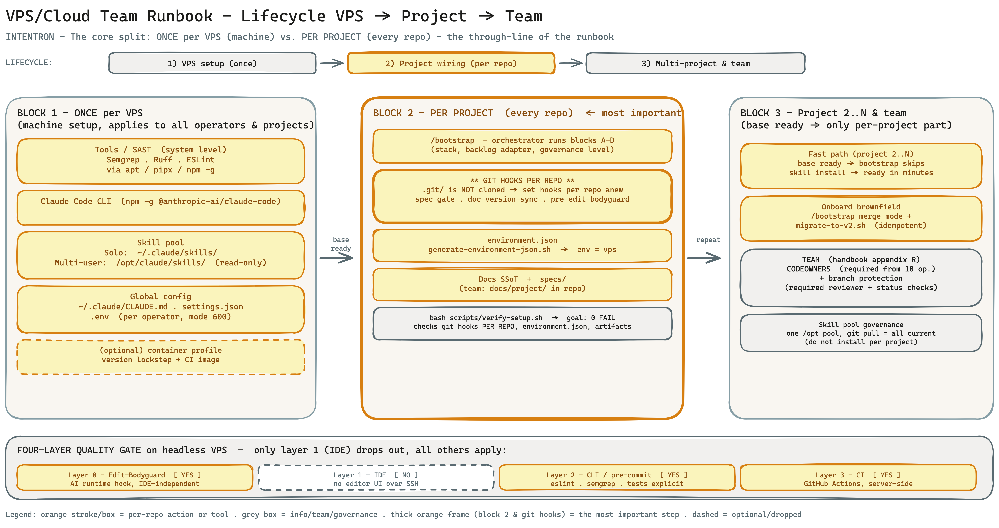

*The VPS team lifecycle: harden and tool the VPS once, then wire each project repo (git hooks per repo, environment.json), then scale to project 2..N and a full operator team. The once-per-VPS vs. per-project split is the visual core.*

### Y.1 Deployment scenario & prerequisites

**Which deployment scenario? (Appendix P)**

| Scenario | Who | Skill pool | When |
|---|---|---|---|
| **2 — Solo-VPS** | 1 operator, 24/7 background/mobile | `~/.claude/skills/` | single person, several projects |
| **3 — Multi-user factory** | 5+ operators, each its own system user | `/opt/claude/skills/` (read-only) | larger dev team on one VPS |
| **4 — Team with coding server** | 2–5 operators, Mac frontend + VPS backend | system pool or per project | team working via VS Code Remote-SSH |

This runbook covers **scenario 3/4** (team VPS) and notes Solo-VPS deviations where relevant.

**VPS sizing.** Rule of thumb (Appendix P, scenario 3): ≥ **8 GB RAM + 4 vCPU** for ~5 parallel operators; scale linearly. Distribution: **Debian/Ubuntu** (apt-based; the container profile is built on `debian`). Pick an EU location if sovereignty is a concern (Appendix Q).

**Software prerequisites (mandatory + actually needed).**

| Mandatory (HANDBUCH §3) | Actually needed in addition |
|---|---|
| Node.js **v18+** + npm | `gh` (GitHub CLI, for branch protection/CI) |
| Git | `jq` (environment.json/healthchecks — optional, skills fall back to grep/sed) |
| Claude Code CLI | `bash 4+` (Linux VPS satisfy this; only macOS' default 3.2 does not — a non-issue on the VPS) |
| | `python3` (stdlib is enough — dpo audit, vault-sync, raw-pii-guard are dependency-free) |

`gh`, `git`, `jq` are not on the §3 mandatory list but are really needed for branch protection, self-hosted-runner healthchecks and environment.json queries — this runbook lists them as a prereq.

### Y.2 Once per VPS (machine setup)

These steps the **VPS owner does once**. They apply to all operators and all projects.

**Harden the VPS:**

```bash
# Set up SSH key login, then disable password login
sudo sed -i 's/^#\?PasswordAuthentication.*/PasswordAuthentication no/' /etc/ssh/sshd_config
sudo systemctl reload ssh
# Multi-user: restrictive umask globally
echo 'umask 077' | sudo tee -a /etc/profile
```

**Install the toolchain.** There is **no** central install script in the framework — the sequence below is derived from the container-profile Dockerfile (`bootstrap/references/devcontainer/Dockerfile`) for a fresh Debian/Ubuntu VPS. Alternatively → container route (Y.6).

```bash
# Base
sudo apt-get update && sudo apt-get install -y git jq curl ca-certificates python3 python3-pip python3-venv pipx tmux

# Node.js LTS (e.g. via nodesource or nvm) — nvm example:
curl -o- https://raw.githubusercontent.com/nvm-sh/nvm/v0.40.1/install.sh | bash
. ~/.nvm/nvm.sh && nvm install --lts

# System linter/SAST once, globally (isolated via pipx / npm -g)
pipx install semgrep
pipx install ruff
npm install -g eslint
npm install -g @anthropic-ai/claude-code     # Claude Code CLI
# Optional: gh (GitHub CLI), SonarScanner — project/team dependent
```

Which tools the framework uses: **Semgrep, Ruff, ESLint** (system level), **SonarScanner** (optional, server-side SonarQube Cloud), **pytest/Vitest + coverage (c8/pytest-cov)** and **autocannon/pytest-benchmark** (perf) as project dev-deps. Only `eslint` + `semgrep` are hard-verified later (`verify-setup.sh`).

**Create operators (scenario 3 only, multi-user):**

```bash
sudo useradd -m -s /bin/bash alice
sudo mkdir -p /home/alice/.ssh && echo "<alice-pubkey>" | sudo tee /home/alice/.ssh/authorized_keys
sudo chmod 700 /home/alice/.ssh && sudo chmod 600 /home/alice/.ssh/authorized_keys && sudo chown -R alice:alice /home/alice/.ssh
```

Secrets live **per operator** in `~/.claude/.env` (mode 600), strictly separated. Never share keys.

**Set up the skill pool (Appendix S).**

| Scenario | Skill pool | Rationale |
|---|---|---|
| Solo-VPS | `~/.claude/skills/` | one user |
| **Multi-user (5+)** | **`/opt/claude/skills/` (read-only, one maintenance owner)** | "20 users × N projects = update hell" — do **not** install per project |

```bash
# Multi-user pool (as maintenance owner)
sudo mkdir -p /opt/claude/skills
sudo git clone --depth 1 https://github.com/vibercoder79/intentron /opt/claude/skills/_intentron-bundle
# Place skills from the bundle into the pool (bootstrap + ideation + implement + backlog + security-architect + dpo …)
# Central update later: a single `git pull` in the pool → all operators current.
```

The `/bootstrap` skill itself must live in the skill directory:

```bash
cp -r /opt/claude/skills/_intentron-bundle/bootstrap ~/.claude/skills/bootstrap   # or into the system pool
```

**Bundle vs. companion:** the `vibercoder79/intentron` repo holds the framework skills + the vendored bundle skills `dpo` and `security-architect` (one `git clone` is self-contained). Companion skills (`research`, `skill-creator`, …) live separately in `claudecodeskills` and are added only on demand.

**Global Claude Code config:**

- `~/.claude/CLAUDE.md` — global registry/project table (bootstrap phase 7.3 writes one row per project).
- `~/.claude/settings.json` — session logging etc. (active by default).
- `~/.claude/.env` — secrets **per operator** (mode 600).

**(Optional) `core.hooksPath` globally.** Instead of setting git hooks per repo, the owner can wire a shared hooks dir **once**:

```bash
git config --global core.hooksPath /opt/claude/githooks   # hooks now live centrally
```

This is the **exception**, not the default convention. By default hooks are installed per repo (Y.3). With `core.hooksPath` the owner must maintain the dir.

### Y.3 Per project (every repo)

These steps **each operator does per project repo**. Key point: **`.git/` is not cloned → git hooks and `environment.json` must be re-set per repo.**

**Create / clone the project:**

```bash
mkdir -p ~/projects/<project> && cd ~/projects/<project>   # or: git clone <repo-url> && cd <project>
```

**Start bootstrap (new project).** Launch Claude Code in the project folder and enter `/bootstrap`. The orchestrator walks through:

- **Block A — project core** (~10 questions): stack, backlog prefix + **backlog adapter** (`linear`/`github`/`jira`/`planner`/`none`), architecture dimensions + add-ons (privacy/cost/signal/compliance), **governance intensity** (`lite`/`standard`/`heavy`), execution isolation, **deployment scenario** (`solo-mac`/`other`).
- **Block B — existing infrastructure**: project dir, GitHub repo, **doc SSoT** (see Y.6), backlog adapter, API keys, developer handover. (For existing files: merge mode.)
- **Block C — doc architecture**: 3-layer docs with `ARCHITECTURE_DESIGN.md` as the hub.
- **Block D — optional components**: self-healing agent, DocSync to the vault, learning loop, etc.

Setup phases: **0** (briefing) → **4** (base structure + gates) → **5** (skills) → **7** (finalisation incl. `verify-setup.sh`).

**Install git hooks (PER REPO — the most important step).** `.git/hooks/` is **not** cloned. Every fresh `git clone` has no hooks yet. Bootstrap creates them per project; re-set them on an existing clone. Four-layer quality-gate hooks:

| Hook | Layer | Mandatory? | Function |
|---|---|---|---|
| `spec-gate.sh` | — | **Mandatory** (all modes) | No commit `ISSUE-XX` without `specs/ISSUE-XX.md` (HARD GATE) |
| `doc-version-sync.sh` | — | **Mandatory** | No push on VERSION drift between DOC_FILES (HARD GATE) |
| `pre-edit-bodyguard.sh` | **Layer 0** | Mandatory, default = **warning** | Secrets/`eval`/TLS-off/SQL concatenation **before** the write; hard block via `BODYGUARD_STRICT=1` |
| `orphan-check.sh` | — | Optional (hub auto-linking) | New `*.md` must be registered in hub §9 (since BOO-92: specs/ + backlog-records exempt) |
| `coverage-check.sh` | Layer 2 | Optional (`heavy`) | Coverage gate ≥80% new code (called by `/implement`, not in pre-commit) |
| `raw-pii-guard.py` | — | Optional (privacy add-on) | AST check: PII field in a log sink (see `hooks-setup.md`) |

Hooks are registered via `.claude/settings.json` (PreToolUse); they are dependency-free (bash/grep/git/python3).

**Generate environment.json:**

```bash
bash .claude/generate-environment-json.sh        # detects the once-installed tools for THIS project
```

Sets `environment` to `mac`/`vps`/`ci`. On the VPS = `vps`: no IDE plugins, `sonarqube_ide_plugin=false`, reports go to `journal/reports/local/`.

**Set the doc SSoT** (Block B.3 — see Y.6).

**Verify:**

```bash
bash scripts/verify-setup.sh            # report, exit 1 on FAIL
bash scripts/verify-setup.sh --strict   # WARN = FAIL (for CI)
```

Checks: environment.json, toolchain (`command -v` per tool), **git hooks (per repo!)**, core artifacts (`CONVENTIONS.md`, `ARCHITECTURE_DESIGN.md`, `specs/`, `journal/`), privacy artifacts (if active), backlog adapter. Goal: **0 FAIL**.

**Per-project minimal checklist (Appendix U):**

- [ ] `CLAUDE.md` (project contract) present
- [ ] **Git hooks installed** (`.git/hooks/pre-commit` — per repo!) — or `core.hooksPath` set globally
- [ ] `.claude/environment.json` generated
- [ ] Doc SSoT set
- [ ] `bash scripts/verify-setup.sh` shows **0 FAIL**

### Y.4 Project 2..N & onboarding an existing project (Appendix U)

The base (tools, skill pool, Claude config) is already in place → only the **per-project part** is needed.

**Fast path — new project no. 2..N:**

1. Create project dir + GitHub repo.
2. `CLAUDE.md` from template (project core) — bootstrap detects existing infra (Block B) and **skips** skill installation.
3. **Install git hooks** (per repo!).
4. `bash .claude/generate-environment-json.sh`.
5. Pick doc SSoT (often the same as project 1, but decidable per project).
6. `bash scripts/verify-setup.sh` → proof.

→ Governance-ready in minutes, without reinstalling tools/skills.

**Merge mode — onboarding an existing (brownfield) project:**

1. `/bootstrap` in **merge mode**: Block B detects existing files → "add only missing governance files" (do not touch existing code).
2. Backfill governance building blocks:
   ```bash
   bash bootstrap/scripts/migrate-to-v2.sh --list          # what is available
   bash bootstrap/scripts/migrate-to-v2.sh --dry-run --all  # preview
   bash bootstrap/scripts/migrate-to-v2.sh --all            # all auto steps (idempotent)
   # or targeted, e.g. the new building blocks:
   bash bootstrap/scripts/migrate-to-v2.sh --issue BOO-86   # Layer 0 bodyguard
   bash bootstrap/scripts/migrate-to-v2.sh --issue BOO-87   # dpo control catalog
   bash bootstrap/scripts/migrate-to-v2.sh --issue BOO-91   # CONTEXT.md
   bash bootstrap/scripts/migrate-to-v2.sh --issue BOO-93   # raw-pii-guard (opt-in)
   ```
3. `bash scripts/verify-setup.sh` → closes the gap list.

`migrate-to-v2.sh` is **idempotent** — running it repeatedly is safe. `--dry-run` only shows what would happen.

### Y.5 Team (Appendix R)

The **code layer scales natively** — Git/branches/PRs/branch-protection/spec-gate are team-capable without framework additions; only the **conflict frequency** rises. What a larger team additionally needs:

- **CODEOWNERS** (`.github/CODEOWNERS`): **mandatory from 10 operators, recommended from 5.** Maps file patterns → sub-team; GitHub enforces ≥1 reviewer from the responsible team. Example:
  ```
  /SECURITY.md            @owlist/sec-leads
  /PRIVACY.md             @owlist/legal-leads
  /ARCHITECTURE_DESIGN.md @owlist/arch-leads
  /CONVENTIONS.md         @owlist/arch-leads
  ```
  **CODEOWNERS does not replace the spec-gate — both run in parallel.**
- **Extended branch protection:** required reviewers from CODEOWNERS, required status checks (spec-gate, lint gate, coverage gate, optionally security scan, optionally DPO audit), "dismiss stale reviews", "require linear history". Setup: `bootstrap/scripts/setup-branch-protection.sh` (needs `gh` + `repo` scope).
- **Four-eyes convention:** `review-ok`/`privacy-ok` may be self-set solo; in a team self-approval is an audit risk. The framework does **not** enforce this — operator discipline.
- **Skill-pool governance:** **one** system pool `/opt/claude/skills/`, read-only, one maintenance owner, `git pull` = all current. Do not install per project.
- **Squad model:** 3–5 operators/module + lead architect + sec-lead + legal-lead.

### Y.6 Decisions (with a recommendation)

**Docker/devcontainer vs. direct install.**

| | Direct install (Y.2) | Container profile (BOO-81) |
|---|---|---|
| When | default; Solo-VPS; full control | team with **identical linter versions**; desired tool isolation; CI image reuse |
| Effort | manual, once per VPS | `.devcontainer/` into the project: bootstrap option or `migrate-to-v2.sh --issue BOO-81` |
| Status | default | **optional, not mandatory** |

*Recommendation:* for a team VPS where **everyone needs the same tool versions**, the container profile pays off (version lockstep + reusable as CI base). For a small VPS or maximum control, the direct install suffices. The `Dockerfile` under `bootstrap/references/devcontainer/` is the reference for both routes.

**Docs & backlog: git-local vs. GitHub.**

- **Living docs belong in the GitHub repo for teams (`docs/project/`)** — "Obsidian is a solo tool, not an enterprise tool" (Appendix R). Repo docs is the only SSoT option that carries across all team sizes (solo→20+): same git mechanics as code (PR review, branch protection, CODEOWNERS for docs). Solo → Obsidian vault ok · 2–5 → Obsidian Sync **or** repo docs · **5+ → repo docs** (or an external DMS). *Vault-harvest pattern* (optional): repo = team SSoT, plus a one-way `git post-merge` hook repo → personal vault (never back).
- **Backlog adapter:** the framework speaks of the neutral **backlog record** (ID, intent, AC, DoD, `execution_mode`, …), not necessarily Linear. Adapters: **Linear (recommended)**, GitHub Issues, Planner, Markdown, or `none`. Rule: *"no Linear" is not a framework breach; "no backlog record" is.*

*Recommendation (team VPS):* doc SSoT = **`docs/project/` in the GitHub repo**; backlog = Linear or GitHub Issues (shared). Git-local (without a remote) only for pure experiment repos.

**Sovereignty (Appendix Q).** For FINMA/BaFin/NIS-2/nDSG mandates: choose an EU VPS location, optionally self-hosted GitLab/Forgejo instead of GitHub, an EU LLM endpoint (Mistral/Bedrock-Frankfurt/Ollama) via the optional `llm_proxy_url` hook in `.claude/environment.json`. The framework only **reads** the hook — anonymisation/routing is operator infrastructure.

*Recommendation:* keep the default stack unless a regulatory mandate applies; if it does, move VPS location, code host and LLM endpoint to EU components before rollout.

### Y.7 Four-layer quality gate on the headless VPS

On an SSH VPS **only Layer 1 (IDE inline hints) drops out** — all others engage:

| Layer | Tool | On headless VPS? |
|---|---|---|
| **Layer 0 — Edit-Bodyguard** | `pre-edit-bodyguard.sh` (PreToolUse) | **Yes** (AI runtime hook, IDE-independent) |
| Layer 1 — IDE | Error Lens, ESLint/Sonar IDE plugin | **No** (no editor UI over SSH) |
| **Layer 2 — CLI/pre-commit** | `npx eslint .`, `semgrep --config auto .`, `npm test`, coverage-check | **Yes** (run the CLIs explicitly) |
| **Layer 3 — CI** | GitHub Actions (eslint/ruff/semgrep/perf/sonar) | **Yes** (server-side) |

Practical rule: on the VPS you do not expect inline feedback in the editor — you run the CLIs explicitly. The gates are the same as on the Mac; only the tooling list differs. **No quality penalty for VPS coding.**

### Y.8 Quick reference: once per VPS vs. per project

| ONCE per VPS | PER PROJECT (every repo) |
|---|---|
| Tools: Semgrep, Ruff, ESLint, (SonarScanner) via apt/pipx/npm -g | Project dev-deps: ESLint/Prettier in `package.json`, pytest, c8/pytest-cov via `npm/pip install` |
| Install Claude Code CLI | `CLAUDE.md` / `CONVENTIONS.md` / `ARCHITECTURE_DESIGN.md` from template |
| Skill pool: `~/.claude/skills/` (solo) resp. `/opt/claude/skills/` (multi-user) | **Git hooks: `.git/hooks/*` — per repo!** (or `core.hooksPath` globally) |
| `~/.claude/CLAUDE.md`, `settings.json`, `.env` (per operator) | `.claude/environment.json` via `generate-environment-json.sh` |
| Operator users + SSH hardening (scenario 3) | Doc SSoT choice, `specs/`, `journal/`, backlog adapter |
| (optional) Container profile for version lockstep | `bash scripts/verify-setup.sh` → 0 FAIL |

### Related appendices & sources

- **HANDBUCH §8d (coding environments):** the Mac/VPS/CI distinction this lifecycle sits on.
- **Appendix P (Deployment scenarios, BOO-70):** the scenario table Y.1 draws from.
- **Appendix Q (Sovereignty Stack, BOO-71):** the EU/regulated decision in Y.6.
- **Appendix R (Multi-operator, BOO-72):** the team layer of Y.5 (CODEOWNERS, branch protection, skill-pool governance).
- **Appendix S (Skill installation, BOO-76):** the skill-pool placement of Y.2.
- **Appendix T (Post-install verification, BOO-79):** the `verify-setup.sh` proof.
- **Appendix U (Multi-project, BOO-80):** the project 2..N + brownfield onboarding of Y.4.
- **Appendix V (Edit-Bodyguard, BOO-86):** Layer 0 of the quality gate in Y.7.

Source: BOO-94 (promotion of `docs/runbooks/vps-team-setup.md` to the canonical appendix), based on the repo state at 2026-06-01 (bootstrap 3.35, BOO-86–93).

---

*This handbook is part of the INTENTRON.*
*GitHub: github.com/vibercoder79/intentron*
*Last updated: 2026-06-01 (v0.3.0–v0.6.2: security/governance wave, onboarding fix + docs sync — BOO-86 through BOO-97; incl. Layer-0 edit bodyguard, dpo control catalogue, CONTEXT.md ubiquitous language, raw-pii-guard, Appendix Y VPS/cloud team runbook, quickstart with self-install/self-update prompts)*
