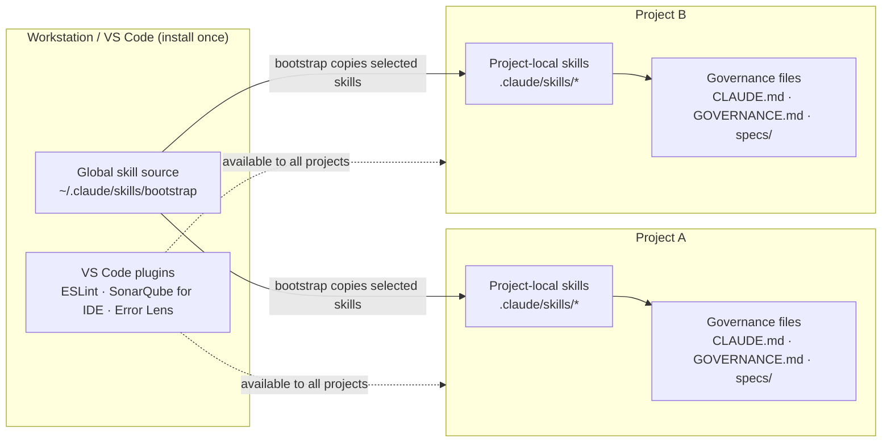
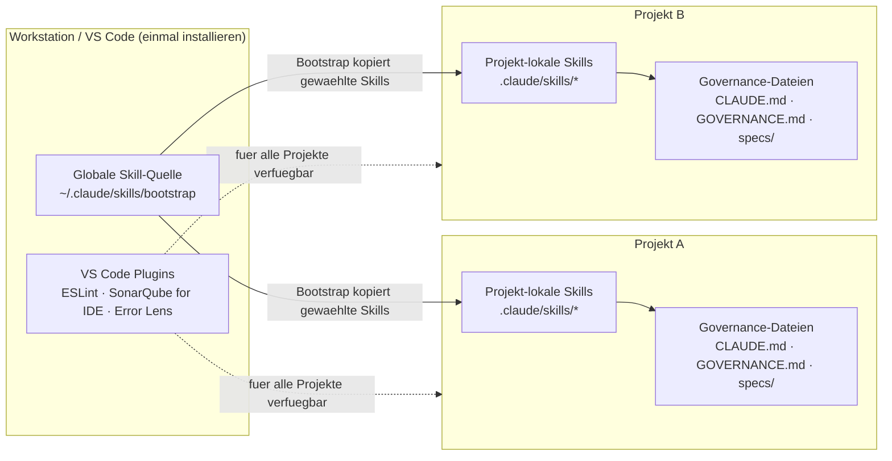

[🇬🇧 English](#english) · [🇩🇪 Deutsch](#deutsch)

---

<a name="english"></a>

# Governance for Vibe Coders — The Complete Handbook

> **Who is this handbook for?**
> You're a Vibe Coder — you have ideas, you use AI to build code, and you want to move fast.
> Governance sounds like bureaucracy. This handbook shows you why governance is actually your
> fastest tool — and how to set it up in 30 minutes.

---

## Table of Contents

1. [The Problem Without Governance](#1-the-problem-without-governance)
2. [What You Get](#2-what-you-get)
3. [Prerequisites and Preparation](#3-prerequisites-and-preparation)
4. [Installation — Step by Step](#4-installation--step-by-step)
5. [The Bootstrap Process](#5-the-bootstrap-process)
6. [The Skills — When Do I Use What?](#6-the-skills--when-do-i-use-what)
7. [The Artifacts — What Gets Created, Where, and Why](#7-the-artifacts--what-gets-created-where-and-why)
8. [The Guardrails — Your Safety Net](#8-the-guardrails--your-safety-net)
9. [VS Code Setup](#9-vs-code-setup)
10. [Tailoring Governance to Your Project](#10-tailoring-governance-to-your-project)
11. [Daily Usage — A Typical Workflow](#11-daily-usage--a-typical-workflow)
12. [FAQ](#12-faq) — incl. Claude Agent SDK migration

---

## 1. The Problem Without Governance

### What happens when you just start building

Imagine: you have a brilliant idea. You open Claude, say "build me X," and ten minutes later code is running. Brilliant.

Three weeks later:

- You can't remember why you made a particular decision
- You ask Claude about a bug — Claude doesn't know the context anymore
- You try to add a new feature and accidentally break something else
- You don't know which version of your project is "stable"
- You have 50 files, 3 half-finished features, and no plan

That's **not** an AI problem. That's a **missing-system** problem.

### The hidden truth about vibe coding

Vibe coding is powerful — but only if the AI understands **what you built** and **why**.
Without documentation and structure, every new session starts from zero.

**With governance** here's what happens:

- New session? Type `/status` — Claude sees everything instantly
- `/implement ISSUE-42` — Claude knows exactly what to do
- `/breakfix` — Claude diagnoses systematically
- Every change is traceable, every error has an audit trail

---

## 2. What You Get

### The Code-Crash Framework

A **complete operating system for AI-assisted software development**:

```
GitHub Repository (vibercoder79/claudecodeskills)
├── bootstrap/           ← Sets everything up automatically
├── ideation/            ← From idea to story
├── implement/           ← From story to code
├── backlog/             ← Sprint planning & priorities
├── architecture-review/ ← Is my system healthy?
├── research/            ← Deep research with AI
├── sprint-review/       ← Periodic quality check
├── security-architect/  ← Threat modeling + code review
├── grafana/             ← Dashboards via MCP
├── cloud-system-engineer/ ← VPS · Docker · firewall
├── visualize/           ← Architecture diagrams in Miro
├── skill-creator/       ← Build your own skills
└── design-md-generator/ ← Extract design systems
```

### What that means concretely

| Without governance | With governance |
|--------------------|------------------|
| Claude forgets between sessions | Claude always knows the system |
| "Build me X" → random output | `/ideation` → structured story → `/implement` |
| Bugs appear out of nowhere | Self-healing agent monitors 24/7 |
| No idea if version is stable | Every change is versioned + documented |
| Rollback? What rollback? | Git + changelog = rollback anytime |
| 3 weeks later: total chaos | Sprint review keeps everything clean |

---

## 3. Prerequisites and Preparation

### Software you need

**Required:**

| Software | Purpose | Download |
|----------|---------|----------|
| **Claude Code CLI** | The heart — AI in the terminal | `npm install -g @anthropic-ai/claude-code` ¹ |
| **Node.js** (v18+) | Runtime for Claude Code | nodejs.org |
| **Git** | Version control | git-scm.com |

**Recommended:**

| Software | Purpose |
|----------|---------|
| **Visual Studio Code** | Editor with Claude Code integration |
| **GitHub account** | Your code repository |

### Accounts you need

**Required:**

1. **Anthropic account** — for Claude Code
   - Go to: claude.ai
   - Register → choose plan (Pro is enough to start)
   - API key at: console.anthropic.com → API Keys

2. **GitHub account** — for your repository
   - github.com/signup
   - Free tier is enough at the start

**Recommended:**

3. **Linear account** — for issue tracking (backlog, stories)
   - linear.app
   - Free for small teams
   - Linear API key: linear.app → Settings → API → Personal API Keys

**Optional but valuable:**

4. **OpenRouter account** — for cheaper LLM calls
   - openrouter.ai
   - Top up credit (~$10 goes a long way)
   - API key at: openrouter.ai/keys

### API keys — overview

Before you start `/bootstrap`, have these keys ready:

| Key | Required? | From | Variable |
|-----|-----------|------|----------|
| Anthropic API Key | YES | console.anthropic.com | `ANTHROPIC_API_KEY` |
| GitHub SSH Key | YES | `ssh-keygen` + GitHub Settings | — |
| Linear API Key | Recommended | linear.app → Settings → API | `LINEAR_API_KEY` |
| OpenRouter Key | Optional | openrouter.ai/keys | `OPENROUTER_API_KEY` |
| Telegram Bot Token | Optional | @BotFather on Telegram | `TELEGRAM_BOT_TOKEN` |

> **Security rule:** API keys NEVER go into code. They go into `.env` (this file is in `.gitignore`
> and will not be uploaded to GitHub).

> ¹ **Note on the Claude package:** The CLI tool is still called `@anthropic-ai/claude-code`.
> The new `@anthropic-ai/claude-agent-sdk` (npm) / `claude-agent-sdk` (pip) is for programmatic
> SDK use in your own apps — not for the CLI. Details: [FAQ → Claude Agent SDK](#what-is-the-claude-agent-sdk--do-i-need-to-migrate)

### Setting up SSH for GitHub

SSH is the secure connection between your machine and GitHub. Set it up once, never think about it again.

```bash
# 1. Create SSH key (if none exists yet)
ssh-keygen -t ed25519 -C "your@email.com"
# → Just press Enter for every question

# 2. Show public key
cat ~/.ssh/id_ed25519.pub
# → Copy this text entirely

# 3. Register with GitHub
# github.com → Settings → SSH and GPG Keys → New SSH Key → paste

# 4. Test connection
ssh -T git@github.com
# → "Hi username! You've successfully authenticated." = success
```

---

## 4. Installation — Step by Step

### Step 1: Install Claude Code

```bash
# Check Node.js version (must be 18+)
node --version

# Install Claude Code
npm install -g @anthropic-ai/claude-code

# Verify it works
claude --version
```

### Step 2: Configure Claude Code

```bash
# Launch Claude Code — first run will prompt for the API key
claude

# Alternative: set API key as environment variable
export ANTHROPIC_API_KEY="your-api-key-here"
```

> **Tip:** Put the `export` command into `~/.bashrc` or `~/.zshrc` so it's active in every new terminal.

### Step 3: Get the Bootstrap skill

This is the **only manual step** — after this, Claude does everything automatically.

```bash
# Pull bootstrap skill from the GitHub repository (macOS/Linux — user home)
mkdir -p ~/.claude/skills
cd /tmp
git clone --filter=blob:none --sparse git@github.com:vibercoder79/claudecodeskills.git ki-skills
cd ki-skills
git sparse-checkout set code-crash-framework/bootstrap
cp -r code-crash-framework/bootstrap ~/.claude/skills/
cd /tmp && rm -rf ki-skills

# Verify the skill is there
ls ~/.claude/skills/bootstrap/
# → should show SKILL.md and a references/ folder
```

> **Why only the bootstrap skill?** In Phase 5, the bootstrap skill installs every other skill
> you need via `git clone` — no symlinks, fully local and portable.

### Step 4: Create a new project

```bash
# Create a directory for your new project
mkdir ~/my-project
cd ~/my-project

# Start Claude Code in the project directory
claude
```

### Step 5: Run bootstrap

In the Claude Code session:

```
/bootstrap
```

Claude walks you through four short interview blocks (A–D), then builds everything automatically. Total time: ~10 minutes.

---

## 5. The Bootstrap Process (v3.0)


*From empty folder to governance-ready project — four interview blocks (A–D) frame the decisions, four setup phases (0, 4, 5, 7) execute them. Block D spins up optional components only if you want them. ([Excalidraw source](bootstrap/docs/bootstrap-big-picture.en.excalidraw))*

### Overview

| Step | Type | Content |
|------|------|---------|
| **Phase 0** — Briefing | Announcement | Bootstrap tells you what's coming, you confirm |
| **Block A** — Project core | Interview (7 questions) | Stack, name, description, path, GitHub URL, backlog tool + prefix, version |
| **Block B** — Existing infrastructure | Interview (5 questions) | GitHub repo? Obsidian vault? Backlog tool? `.env`? CLAUDE.md? — integrates into what's already there |
| **Block C** — Doc architecture | Proposal + review | 3-layer proposal (Story-Specs, Component-Docs, Architecture-Guidelines) + `ARCHITECTURE_DESIGN.md` Hub with auto-linking |
| **Phase 4** — Base structure | Automatic (~2 min) | Files, Git init, linting, governance hooks, component skeletons |
| **Phase 5** — Install skills | Automatic | Skills pulled via `git clone` from `claudecodeskills` (no symlinks) |
| **Block D** — Optional components | 4 yes/no at the end | Self-Healing / DocSync / Automation-Daemon / Learning-Loop (L1/L2/L3) |
| **Phase 7** — Finalization | Automatic | SecondBrain integration, global registry entry, final commit |

> **Why blocks instead of a 14-question batch?** Single questions are easier to answer, and each block builds on the previous one — your doc-architecture proposal in Block C already knows your stack (A.1) and existing infra (B).

### Block A — Project core (7 questions)

#### A.1: Stack question — first of all

```
What do you want to develop?

a) Node.js / JavaScript backend (API, CLI, daemon)
b) Frontend (React, Vue, Vanilla JS)
c) Full-stack (Node.js backend + frontend)
d) Python (AI/ML, scripts, FastAPI, Django)
e) Other / not clear yet
```

The answer determines linting/formatting setup:

| Your choice | Linter | Formatter | Auto-created |
|-------------|--------|-----------|--------------|
| Node.js | ESLint | — | `eslint.config.mjs` |
| Frontend | ESLint + Prettier | Prettier | `eslint.config.mjs` + `.prettierrc` |
| Full-stack | ESLint + Prettier | Prettier | `eslint.config.mjs` + `.prettierrc` |
| Python | Ruff | Black | `pyproject.toml` |

#### A.2–A.7: Project identity

| Question | Example | Why |
|----------|---------|-----|
| Project name | `MyShop` | Used everywhere |
| Short description | `E-commerce for handmade products` | Claude understands what you're building |
| Project path | `/home/user/my-project` | Where the code lives |
| Backlog tool | `linear` / `github-issues` / `none` | Drives issue-prefix use + daemon eligibility |
| Issue prefix | `SHOP` | Stories become SHOP-1, SHOP-2, … |
| Start version | `1.0.0` | Versioning from day 1 |

#### A.4: Architecture dimensions + add-ons

Bootstrap installs 8 **standard** architecture dimensions (Reliability, Data Integrity, Security, Performance, Observability, Maintainability, Testability, Scalability) and asks which of 4 **optional add-ons** to enable:

| Add-on | When it makes sense |
|--------|---------------------|
| **Privacy / GDPR** | You process personal data, GDPR applies |
| **Cost Efficiency** | Cloud bill is non-trivial, LLM calls are billed per token |
| **Signal Quality** | Trading, monitoring, anything driven by external signals |
| **Compliance** | Regulated industry (finance, health, public sector) |

**Standard vs. add-on:** Standard dimensions apply to **every** project — universal software properties safeguarded in any AI-assisted build. Add-ons are context-specific and only enabled if the project's domain calls for them.

Pick any combination — default is "none selected". Every active dimension becomes a section in `ARCHITECTURE_DESIGN.md §3 Quality Attributes` that `/ideation`, `/architecture-review` and `/sprint-review` will check.

### Block B — Existing infrastructure (5 questions)

Bootstrap integrates into what's already there instead of overwriting. It asks:

1. **GitHub repo already exists?** (URL or "create new")
2. **Obsidian vault in use?** (path or "no")
3. **Backlog tool configured?** (Linear project / GitHub issues / none)
4. **`.env` already present?** (keep keys or create template)
5. **`CLAUDE.md` already present?** (merge or overwrite)

### Block C — Doc architecture

Based on your stack (A.1) and existing infra (Block B), bootstrap presents a **3-layer doc architecture**:

| Layer | Lives in | Purpose |
|-------|----------|---------|
| **1. Story-Specs** | `specs/ISSUE-XX.md` | Per-story, mandatory for commit via `spec-gate.sh` |
| **2. Component-Docs** | `docs/components/*.md` or Obsidian `Components/*.md` | Living doc per component (voice, memory, frontend …) |
| **3. Architecture-Guidelines** | `Architektur-Vorgaben.md` | Consolidated stack decisions, cross-cutting rules |

**Hub:** `ARCHITECTURE_DESIGN.md` links to all three layers via **§9 auto-linking** — every new `*.md` under the doc folders gets auto-registered in the Hub. Optional `orphan-check.sh` hook blocks commits that add docs without Hub entry.

You can accept the proposal as-is, customize it, or opt out of individual layers.

### Phase 4: Base structure (automatic, ~2 min)

Claude creates files, initializes Git, sets up linting, installs governance hooks, and scaffolds component doc skeletons. See the [Artifact Map](#7-the-artifacts--what-gets-created-where-and-why) for a visual overview.

**`ARCHITECTURE_DESIGN.md §2` includes a mandatory KI-Architecture-Principles block (BOO-24, Schrader Ch. 4):** 4 principles (small modules, explicit interfaces, testability, observability) + 4 anti-patterns are anchored proactively at project setup — not discovered reactively in the first review. `/architecture-review` (BOO-7) checks all 8 items at every story. Reference: `code-crash-framework/references/ki-architektur-prinzipien.md`.

### Phase 5: Install skills (automatic)

Skills are pulled from the `vibercoder79/claudecodeskills` repository via `git clone` into `.claude/skills/` — **no symlinks, no runtime dependency on the source repo**. The skill copies are local and portable.

Important distinction: VS Code plugins are workstation infrastructure; skills are project infrastructure. You install ESLint, SonarQube for IDE, Error Lens, Python/Ruff, etc. once in VS Code. Bootstrap checks and documents their availability per project, but does not reinstall those plugins for every project. Skills are different: every bootstrapped project gets its own local `.claude/skills/` copy (and, for Codex adapters, optionally `.codex/skills/`). That copy is the project-pinned runtime state. If you bootstrap a second project, the selected skills are copied into that second project as well; this is intentional, not duplicate global installation.

If a project already has `.claude/skills/<skill>/`, treat Phase 5 as an update/merge decision: keep the pinned project copy, compare with the current master skill, and only update deliberately. Do not replace project-customized skills blindly.

```
Which skills to install?
a) Minimum (ideation, implement, backlog)       ← Ideal for the start
b) Standard (+ architecture-review, sprint-review, research, breakfix)  ← Recommended
c) Full (all skills)                            ← Full arsenal
d) Pick manually
```

### Block D — Optional components (at the end)

After the base project is set up, bootstrap asks 4 yes/no questions:

| Component | What it does | Cost |
|-----------|--------------|------|
| **Self-Healing agent** | Cron check every 15 min: versions synced, files present, daemons running | Low |
| **DocSync to Obsidian** | Auto-mirror docs to your vault | None (if Obsidian exists) |
| **Automation daemon** | Linear webhook → auto-`/implement` on "In Progress" | Requires Linear + webhook endpoint |
| **Learning-Loop (L1/L2/L3)** | Framework gets smarter with every sprint — see next section | L1 free, L3 adds SQLite |

### Learning-Loop (L1/L2/L3)

A **portable feedback loop** that turns completed sprints into anti-pattern warnings for future stories. Three levels, pick one:

| Level | Storage | Write | Read |
|-------|---------|-------|------|
| **L1 — Simple** | `journal/learnings.md` (append-only markdown) | `/sprint-review` appends after every review | `/ideation` reads at story creation (warns on matching anti-patterns) |
| **L2 — Sprint-Journal** | `journal/sprint-YYYY-QN.md` (one file per sprint) | `/sprint-review` | `/ideation` + `/architecture-review` |
| **L3 — SQLite** | `.learning-loop/loop.db` (structured) | `/sprint-review` | `/ideation` + `/architecture-review` + `/backlog` (priority adjustment) |

**Why it matters:** Without the loop, every sprint starts from zero. With the loop, decisions that caused pain last sprint (wrong dependency, missed Acceptance Criterion, scope creep) show up as warnings *before* the next story gets created.

### Phase 7: Finalization

- **SecondBrain integration** — if Block B.2 confirmed an Obsidian vault, bootstrap creates a PMO hub under `02 Projekte/<ProjectName>/`
- **Global registry** — `~/.claude/MEMORY.md` gets a pointer to the new project
- **Final commit** — everything in one commit with a summary table

```
✓ Block A: Project core + stack + add-ons
✓ Block B: Existing infrastructure integrated
✓ Block C: Doc architecture (3 layers + Hub)
✓ Phase 4: Base structure (files, Git, linting, hooks, labels)
✓ Phase 5: Skills installed ({count})
✓ Block D: Optional components ({status})
✓ Phase 7: SecondBrain + Registry + Final-Commit

Your project is ready. Start with: /ideation
```

---

## 6. The Skills — When Do I Use What?

### Overview: the skill system

Skills are **repeatable workflows** that guide Claude through complex tasks. You invoke them
with `/skillname` and Claude follows a defined process.

```
Idea     → /ideation          → Story in Linear
Story    → /implement         → Code, tests, git push
Problem  → /breakfix          → Diagnosis, fix, prevention
Week     → /backlog           → What's next?
Quarter  → /sprint-review     → System health
Sprint   → /pitch             → Evidence briefing for stakeholders
Anytime  → /status            → What's happening right now?
```

The full 4P delivery pipeline (Schrader Code Crash Ch. 5) is wired as:

```
/intent → /ideation → /backlog → /implement → /architecture-review → /sprint-review → /pitch
\______/   \_____________________________/                                              \____/
Perceive   Prompt + Produce                                                              Pitch
```

See **Appendix L** for the full 4P-pipeline mapping and the `/pitch` evidence contract.

Every skill in this handbook has its own README with a visual overview:

| Skill | README + Sketch |
|-------|-----------------|
| bootstrap | [README](bootstrap/README.md) · [Sketch](bootstrap/docs/bootstrap-big-picture.en.png) |
| ideation | [README](ideation/README.md) · [Sketch](ideation/overview.en.png) |
| implement | [README](implement/README.md) · [Sketch](implement/overview.en.png) |
| backlog | [README](backlog/README.md) · [Sketch](backlog/overview.en.png) |
| architecture-review | [README](architecture-review/README.md) · [Sketch](architecture-review/overview.en.png) |
| sprint-review | [README](sprint-review/README.md) · [Sketch](sprint-review/overview.en.png) |
| pitch | [README](pitch/README.en.md) · [Sketch](pitch/pitch-overview.en.png) |
| research | [README](research/README.md) · [Sketch](research/overview.en.png) |
| security-architect | [README](security-architect/README.md) · [Sketch](security-architect/overview.en.png) |
| grafana | [README](grafana/README.md) · [Sketch](grafana/overview.en.png) |
| cloud-system-engineer | [README](cloud-system-engineer/README.md) · [Sketch](cloud-system-engineer/overview.en.png) |
| visualize | [README](visualize/README.md) · [Sketch](visualize/overview.en.png) |
| skill-creator | [README](skill-creator/README.md) · [Sketch](skill-creator/overview.en.png) |
| design-md-generator | [README](design-md-generator/README.md) · [Sketch](design-md-generator/overview.en.png) |

### `/ideation` — From idea to story


**When:** You have an idea for a new feature.

**What happens:**
1. You describe your idea in natural language
2. Claude researches (optional: deep research via Perplexity)
3. Claude checks whether the idea fits the architecture
4. Claude creates a structured user story in Linear

**Example:**
```
You: /ideation
Claude: "Describe your idea..."
You: "I want customers to be able to track their orders"

→ Claude creates SHOP-42 in Linear with:
   - What exactly gets built
   - Why (business value)
   - How (technical approach)
   - Acceptance criteria
   - Effort estimation
```

#### Pre-flight checks in `/ideation`

Before the actual ideation work starts, the skill runs two soft pre-flight checks. **Soft = the operator is asked; no hard block.** They prevent the most expensive failure mode: writing stories against an outdated picture of the system.

**Check 1 — environment loaded (step 0):** the skill reads `.claude/environment.json` to know which paths, tools and thresholds apply. If the file is missing, defaults are used and the skill warns once.

**Check 2 — architecture-doc freshness (step 0a, soft):** the skill compares the last modification date of `ARCHITECTURE_DESIGN.md` against `thresholds.architecture_doc_freshness_days` from `.claude/environment.json` (default `30`). When the doc is older than the threshold:

```
Warning: ARCHITECTURE_DESIGN.md has not been updated in 47 days
(threshold: 30 days).

Recommendation: run /architecture-review before writing new stories
against a possibly stale architecture.

Continue anyway? [yes/no]
```

On `no` the skill stops, the operator runs `/architecture-review`, then `/ideation` is restarted. On `yes` the override is documented in the resulting story under `Current State`.

**Why soft, not hard?** A hard block would gate every project that has been quiet for a while — but the doc is often "old enough to warn, still valid". The operator decides per story. The threshold lives in `.claude/environment.json` so each project can tune it: fast-moving systems set 14, stable systems 90.

**Configuration example** in `.claude/environment.json`:

```json
{
  "thresholds": {
    "architecture_doc_freshness_days": 14
  }
}
```

### `/implement` — From story to code


**When:** You want to implement a story.

**What happens (8-step protocol):**
1. Identify issue (load from Linear)
2. Dependency check (blockers resolved?)
3. Build context (CLAUDE.md, ARCHITECTURE_DESIGN.md)
3b. Governance validation (8-dimension table? Security section?)
3c. ⛔ **Spec-file gate** — hard gate (enforced by `spec-gate.sh`)
4. Plan + operator approval
5. Implementation (code, docs, commit + push)
6. Post-implement validation (ESLint, AC check, smoke test, security findings)
7. Backlog update
8. Result table + `specs/ISSUE-XX.md` summary

> **Important:** `/implement` NEVER changes code without your OK in step 4. You're always in control.

### `/backlog` — Sprint planning


**When:** You don't know what's most important next.

**What happens:**
1. Claude loads all open issues from Linear
2. Analyzes dependencies (what blocks what?)
3. Suggests a prioritized order
4. Schema-chain check: flags conflicts (two stories targeting same `schemaVersion`)
5. Shows hygiene suggestions (orphaned refs, obsolete issues)

### `/breakfix` — When something is broken

**When:** The system has a problem, a bug, or is acting weird.

**What happens (6-step process):**
1. **Detect:** What exactly is the problem?
2. **Diagnose:** Why is it happening?
3. **Fix:** Implement the solution
4. **Verify:** Is it truly fixed?
5. **Document:** Archive incident in `journal/incidents/`
6. **Prevent:** How do we prevent this in the future?

### `/architecture-review` — System health


**When:** Before a big decision. Periodically (monthly).

**What happens:** Claude checks the active dimensions of your system — 8 standard
(Reliability, Data Integrity, Security, Performance, Observability, Maintainability, Testability, Scalability)
plus any active add-ons (Privacy / GDPR, Cost Efficiency, Signal Quality, Compliance).

### `/research` — Deep research


**When:** You need facts for a technical decision.

**What happens:**
- Auto-routing: simple questions → WebSearch, complex → Perplexity (deeper AI analysis)
- Results are cross-checked
- Structured research report with sources + confidence rating

### `/sprint-review` — Quarterly audit


**When:** Every 4–6 weeks.

**What happens:**
- Tech debt analysis: what needs cleanup?
- Backlog hygiene: which issues are stale?
- Architecture check: has tech debt accumulated?
- Recommendations for the coming weeks

### `/security-architect` — Security by design


**When:** Automatically — during planning (DESIGN mode), code changes (REVIEW mode),
audits (AUDIT mode), and before installing external skills (SKILL-SCAN mode).

**Covers:** OWASP Top 10:2025 · STRIDE/DREAD · ASVS 5.0 · MITRE ATLAS · Agentic AI Security (ASI01–ASI10)

### `/pitch` — Evidence for stakeholder meetings


**When:** Before a stakeholder meeting, after `/sprint-review` has run.

**What happens:**
- 8 sources are aggregated read-only: L3 lessons DB, local implement reports, CI reports, sprint files, ARCHITECTURE_DESIGN.md, INTENT-XX.md, feature-flag state, git log
- Architecture diff since the previous pitch is computed
- Demo-path heuristic proposes the user journey that best demonstrates intent fulfillment
- Output: `pitch/PITCH-XX.md` with frontmatter (`metrics_snapshot`, `related_intents`, `demo_path`, `status`) + 5 body sections — committed, NOT gitignored

**Anti-Scope:** the skill generates NO slides, NO voiceover, NO outcome text, and NO demo video. Human builds the story and runs the live demo. Details in **Appendix L** (4P pipeline mapping).

### Other skills

- [`/grafana`](grafana/README.md) — dashboards via Grafana MCP
- [`/cloud-system-engineer`](cloud-system-engineer/README.md) — VPS, Docker, firewall, DNS
- [`/visualize`](visualize/README.md) — architecture diagrams in Miro
- [`/skill-creator`](skill-creator/README.md) — build your own skills
- [`/design-md-generator`](design-md-generator/README.md) — extract design systems to DESIGN.md
- [`/status`](bootstrap/README.md) — one-glance system status

---

## 7. The Artifacts — What Gets Created, Where, and Why

### What is an artifact?

An **artifact** is a file that the governance framework creates or expects — documentation,
checklists, hooks, specs, automation scripts, memory entries. Each artifact has a clear
purpose and is read or written by specific skills.

Most teams collect documentation ad-hoc. The Code-Crash Framework defines a fixed, minimal set of artifacts
that together give you traceable, reproducible, AI-friendly development.

### The 5 artifact groups


*The full artifact map: every governance file, hook, spec, and automation that bootstrap creates — grouped into 5 categories, with arrows showing which skill consumes which artifact. ([Excalidraw source](bootstrap/docs/artifact-map.en.excalidraw))*

#### Group A — Governance documentation

Rules · architecture · process · history.

| Artifact | Purpose | Written by | Read by |
|----------|---------|------------|---------|
| `CLAUDE.md` | Claude's identity + project rules | bootstrap + you | every skill (auto at session start) |
| `CONVENTIONS.md` | Project-local contract: governance mode, execution isolation, active gates | bootstrap + you | `/ideation`, `/implement`, `/architecture-review`, `/sprint-review`, tool adapters |
| `GOVERNANCE.md` | Process rules — when/why | bootstrap | every skill |
| `SYSTEM_ARCHITECTURE.md` | Overview of components, data flow | bootstrap + `/implement` | every skill |
| `ARCHITECTURE_DESIGN.md` | Lead document — all ADRs, 8 sections | bootstrap + `/ideation` | `/implement`, `/architecture-review`, `/sprint-review` |
| `INDEX.md` | File index | bootstrap + `/implement` | every skill |
| `COMPONENT_INVENTORY.md` | Component inventory | bootstrap + `/implement` | self-healing (Check U) |
| `DEVELOPMENT_PROCESS.md` | Process reference | bootstrap | reference |
| `SECURITY.md` | Security policy | bootstrap + `/security-architect` | `/implement`, `/sprint-review` |
| `CHANGELOG.md` | What changed when | `/implement` (auto) | every skill |
| `API_INVENTORY.md` | All external APIs | `/implement` | `/security-architect` (AUDIT) |
| `journal/STRATEGY_LOG.md` | Strategy decisions | you + `/ideation` | `/ideation` (mandatory read before story creation) |
| `journal/LEARNINGS.md` | Outcome tracking | `/implement` (after issue-close) | `/sprint-review` |
| `lib/config.js` | Single source of truth: VERSION + DOC_FILES | bootstrap | self-healing, doc-version-sync |

#### Group B — Checklists + guardrails

Machine-enforced rules and reference lists.

| Artifact | Purpose | Enforcement |
|----------|---------|-------------|
| `.claude/hooks/spec-gate.sh` | Blocks `git commit ISSUE-XX` without `specs/ISSUE-XX.md` | **HARD GATE** (PreToolUse hook) |
| `.claude/hooks/doc-version-sync.sh` | Blocks `git push` on VERSION drift between DOC_FILES | **HARD GATE** (PreToolUse hook) |
| `.claude/hooks/guard.sh` | Blocks access to `.env` and key files | Soft guard |
| `.claude/hooks/format.sh` | Auto-formats on Edit/Write (Biome/Black) | Passive |
| `.claude/settings.json` | Hook registration + permissions | Config |
| `eslint.config.mjs` / `.prettierrc` / `pyproject.toml` | Linting config (stack-dependent) | Passive + `/implement` step 6a |
| `.claude/ISSUE_WRITING_GUIDELINES.md` | Issue format rules | Reference |
| `architecture-review/references/dimensions-detail.md` | The 8 standard + 4 add-on dimensions | Reference for `/ideation`, `/architecture-review`, `/sprint-review` |
| `implement/references/change-checklist.md` | Per-change validation | Reference for `/implement` step 6 |
| `security-architect/references/owasp-checklist.md` | OWASP Top 10:2025 + ASVS 5.0 | Reference for `/security-architect` |

#### Group C — Specs + traceability

The path Idea → Backlog Record / adapter issue → Spec → Commit → Changelog.

| Artifact | Purpose | Anatomy |
|----------|---------|---------|
| `specs/TEMPLATE.md` | Template for new specs | Why · What · Constraints · Current State · Tasks (T1, T2…) |
| `specs/ISSUE-XX.md` | One spec per story (mandatory before commit) | Filled from TEMPLATE + `## Summary` filled by `/implement` step 8 |
| Backlog Records / adapter issues | Story tracking in Linear, GitHub Issues, Jira, Planner, Azure DevOps, or Markdown | **5 required sections (Governance v2):** Schrader Prompt Components (Insight · Constraints · Success Criteria · Desired Outcome) + Definition of Done + Execution Mode. See `bootstrap/references/issue-writing-guidelines-template.md` |
| Git Commits | Format: `T1: ISSUE-XX — description` | Gated by spec-gate.sh |
| Obsidian Vault | Change logs + project memory | Auto-synced by `doc-sync.js` |

#### Group D — Self-healing + automation

Runtime agents — no ops team needed.

| Artifact | Purpose | Cadence |
|----------|---------|---------|
| `agents/self-healing.js` | Check M (versions) · U (files) · P (processes) + Telegram alert | Cron, every 15 min |
| `lib/doc-sync.js` | Sync to Obsidian vault | On demand + cron |
| `.env` / `.env.example` | Secrets + API keys (gitignored) | Manual |
| `agents/linear-automation-daemon.js` | Webhook-driven auto-implement | Optional |

#### Group E — Skill system

Skills consume artifacts from A–D.

| Artifact | Purpose |
|----------|---------|
| `~/.claude/skills/*` | Global skill source / operator registry |
| `.claude/skills/*` | Project-local skill copies, pinned and portable |
| `~/.claude/projects/-root/memory/MEMORY.md` | Global memory |
| `~/.claude/projects/-root/memory/project_{slug}_init.md` | Project-specific memory |

#### Group F — Environment manifest (BOO-34)

| Artifact | Purpose |
|----------|---------|
| `.claude/environment.json` | Single source of truth for environment (mac/vps/ci), available tooling and default paths |
| `.claude/generate-environment-json.sh` | Bash generator (BSD- and Linux-compatible, no deps) |

##### Coding environments — mac vs. VPS vs. CI

Same governance code base, three very different execution contexts. Skills behave slightly differently depending on `environment`:

- **`mac`** — operator's workstation. Interactive sessions, IDE integrations available (SonarLint plugin, ESLint extension), `brew` for tool installs. `tools_available.sonarqube_ide_plugin` may be `true` if the operator has it installed.
- **`vps`** — server (e.g. Hostinger srv1443320). No IDE plugins, `apt`/`pip` for installs, runs in a tmux/screen, results land in `journal/reports/local/`. `sonarqube_ide_plugin` is always `false`. Operator drives via SSH.
- **`ci`** — GitHub Actions / GitLab CI runner. Detected via env var `$CI` regardless of value. Reports are written to `journal/reports/ci/`, lessons-learned writes are SKIPPED to keep CI ephemeral. CI check happens FIRST in detection, because a CI runner can be Linux OR mac.

Skills read the file in a step-0 lookup. Quick reads with `grep`/`sed` are fine; for richer queries `jq` is convenient (optional install — `brew install jq` on mac, `apt install jq` on VPS):

```bash
# Without jq (always works)
HAS_SEMGREP=$(grep '"semgrep"' .claude/environment.json | grep -oE 'true|false')

# With jq (richer queries)
ENV=$(jq -r .environment .claude/environment.json)
TESTS=$(jq -r .tools_available.tests .claude/environment.json)
REPORTS=$(jq -r .paths.reports_local .claude/environment.json)
```

Regenerate after tooling changes: `bash .claude/generate-environment-json.sh --force`. The file is committed; `metadata.created_at` is the audit trail.

#### Group G — Observability skeleton (BOO-14)

| Artifact | Purpose |
|----------|---------|
| `observability.md` | Central observability skeleton (project root) — three required sections: logging schema, metrics endpoint, alert rules |
| `observability/alerts/<service>.yml` | Per-service Prometheus alert rules — required alerts: `{service}_down`, `{service}_error_rate_high` (>5%), `{service}_p95_slow` (p95 >1s) |
| `observability/.env.observability` | Routing config (Telegram / Slack / email webhooks) — **gitignored**, only `.env.observability.example` committed |

##### Three pillars of observability

Schrader Code Crash chap. 3 §Production Readiness §Observability + chap. 4 §Run the System (pillar 3 observability): "deploy without observability and you fly blind." Bootstrap installs the scaffolding from day 0; the operator fills service-specific content per block C component.

- **Logging schema** — structured JSON with the fields `timestamp`, `level`, `service`, `trace_id`, `message`, `context`. Stack defaults: Node.js → `pino`, Python → `structlog`.
- **Metrics endpoint** — `/metrics` in Prometheus format per service, port convention `9090+N` (auth=9091, api=9092, db=9093, ...). Stack defaults: Node.js → `prom-client`, Python → `prometheus_client`.
- **Alert rules** — three required alerts per service: `{service}_down` (`up == 0` for >2 min, severity critical), `{service}_error_rate_high` (errors/requests >5% for 5 min, severity warning), `{service}_p95_slow` (p95(request_duration_seconds) >1s for 5 min, severity warning). Validate locally with `promtool check rules observability/alerts/*.yml`.

Existing projects: `bash <skill-repo>/bootstrap/scripts/migrate-to-v2.sh --issue BOO-14` scaffolds the three files idempotently. Operator steps for service population: see `bootstrap/references/migration-checklist-v1-to-v2.en.md §BOO-14`.

#### Group H — Reliability skeleton (BOO-25)

| Artifact | Purpose |
|----------|---------|
| `lib/idempotency.{js,py}` | Idempotency middleware (Redis-backed) — required header `Idempotency-Key`, behaviour: same key + same body → cached response, same key + diverging body → HTTP 422 |
| `lib/retry.{js,py}` | Retry helper with exponential backoff + jitter — defaults: maxRetries=3, baseDelay=200ms, factor=2; **no retry on 4xx**, no retry on 422 idempotency conflicts |
| `lib/circuit-breaker.{js,py}` | Circuit breaker wrapper — defaults: errorThresholdPercentage=50, resetTimeout=30s, volumeThreshold=10; one breaker per external dependency (DB, auth, external API, message bus) |
| `docs/SLO.md` | Service-Level Objectives skeleton — availability target, quarterly error-budget table, at least 3 SLIs sourced from the BOO-14 metrics endpoint, review cadence in `/sprint-review` |

##### The five pillars of reliability

Schrader Code Crash chap. 4 §Run the System (pillar 6 reliability): "if there is no error budget, you do not know when to stop." Bootstrap installs the four scaffolds from day 0; the operator decides per service which pillars are active and wires the middleware/wrappers into the entry points.

- **Idempotency** — duplicate writes with the same `Idempotency-Key` return the cached response; diverging bodies for the same key return HTTP 422. Cache backend: Redis (`REDIS_URL`).
- **Retry + backoff** — exponential backoff with jitter for transient downstream failures. Status filter: only 5xx and network errors are retried; 4xx and idempotency conflicts (422) are not.
- **Circuit breaker** — per-dependency breaker that opens after the error-rate threshold is exceeded, blocks calls for `resetTimeout`, then half-opens to probe recovery. Thresholds tuned per dependency.
- **Graceful degradation** — explicit fallback paths when a downstream is open or slow (cached read, queue-and-forget, feature flag off). Documented per service in the reliability section.
- **SLO + error budget** — availability target (e.g. 99.9%), quarterly error budget, ≥3 SLIs (`error_rate`, `p95_latency`, `availability`) measured against the BOO-14 metrics endpoint. Reviewed every sprint review; budget exhaustion triggers a stop-ship.

Existing projects: `bash <skill-repo>/bootstrap/scripts/migrate-to-v2.sh --issue BOO-25` scaffolds the four files idempotently (stack-detected via `package.json` / `pyproject.toml` / `requirements.txt`). Operator steps for activation: see `bootstrap/references/migration-checklist-v1-to-v2.en.md §BOO-25`. Cross-link: `architecture-review/references/dimensions-detail.en.md` §1.1-§1.5 covers each pillar in detail.

#### Group I — Implement-run local reports (BOO-36)

`/implement` step 6 persists raw tool outputs alongside the declarative iteration. The directory is **gitignored** — `/sprint-review` aggregates these reports later into `journal/sprint-{date}.md`.

| Artifact | Purpose | Written by | Read by |
|----------|---------|------------|---------|
| `journal/reports/local/{YYYY-MM-DD_HHMM}_{STORY-ID}/eslint-iter{N}.sarif` | ESLint SARIF per iteration (fallback `.json`) | `/implement` step 6a | `/sprint-review` |
| `journal/reports/local/{YYYY-MM-DD_HHMM}_{STORY-ID}/tests-iter{N}.junit.xml` | JUnit XML per test iteration | `/implement` step 6a-quart | `/sprint-review` |
| `journal/reports/local/{YYYY-MM-DD_HHMM}_{STORY-ID}/coverage-final.json` | Coverage end state (c8 / pytest-cov) | `/implement` step 6a-quart | `/sprint-review` |
| `journal/reports/local/{YYYY-MM-DD_HHMM}_{STORY-ID}/semgrep-final.sarif` | Semgrep SARIF end state | `/implement` step 6a-bis | `/sprint-review` |
| `journal/reports/local/{YYYY-MM-DD_HHMM}_{STORY-ID}/meta.json` | Run metadata (schema below) | `/implement` step 6f-bis | `/sprint-review` |

##### meta.json schema

```json
{
  "story_id": "BOO-15",
  "started_at": "2026-04-27T14:30:00Z",
  "completed_at": "2026-04-27T14:34:00Z",
  "iterations": {
    "eslint": 3,
    "tests": 2,
    "semgrep": 1,
    "coverage": 1
  },
  "final_status": "passed",
  "environment": "mac"
}
```

Field convention:
- `story_id` — Backlog Record / adapter issue key
- `started_at` / `completed_at` — ISO-8601 UTC
- `iterations.<gate>` — number of iterations per gate, 0 if the gate was skipped
- `final_status` — `passed` | `failed` | `stopped_iteration_limit`
- `environment` — `mac` | `vps` | `ci` | `unknown` (mirrored from `.claude/environment.json`)

##### Responsibility separation

| Who | Writes | Reads |
|-----|--------|-------|
| `/implement` | `journal/reports/local/` (raw outputs + meta.json) | nothing |
| `/sprint-review` (first phase) | `journal/sprint-{date}.md` (aggregated) | `journal/reports/local/` + `journal/reports/ci/` |
| `/sprint-review` (second phase) | `journal/learnings.db` (parsed L2) | nothing |

The separation is hard: implement persists, sprint-review aggregates. `/implement` does **not** write directly into the L3 learnings DB. This keeps implement fast (no DB lock, no schema knowledge) and gives sprint-review a single-writer role for the learnings DB.

### How to read an artifact — anatomy example: `specs/ISSUE-XX.md`

Every spec file follows the same structure:

```markdown
# SHOP-42 — Order tracking

## Why
Customers frequently ask "where is my order?" via email. Adding a tracking page
reduces support load and improves UX.

## What
- Deliverable: `/orders/:id/track` page with live status
- Done when: customer sees status + timestamps + carrier link

## Constraints
- MUST: reuse existing order DB schema
- MUST NOT: add new external API without approval
- Out of scope: email notifications (separate story)

## Current State
- `src/routes/orders.js` — currently handles list/detail views
- `lib/order-db.js` — schema v12

## Tasks
- T1: Add `/orders/:id/track` route (files: src/routes/orders.js) — verify by visiting /orders/1/track
- T2: Add tracking status component (files: components/OrderTracking.jsx) — verify by Storybook
- T3: Wire carrier API (files: lib/carrier-api.js, .env.example) — verify by mock response

## Summary
(filled after implementation by /implement step 8 — 3 paragraphs, plain language)
```

This structure is not negotiable — the spec-gate hook enforces the file's existence, and
`/implement` step 3c validates its shape before the plan phase begins.

### Which skill writes/reads which artifact?

The [Artifact Map](bootstrap/docs/artifact-map.en.png) above shows the full matrix visually.
Quick summary:

- **`/ideation`** writes: Backlog Record / adapter issue, ADD section, spec placeholder. Reads: ARCHITECTURE_DESIGN.md, STRATEGY_LOG.md
- **`/implement`** writes: code, specs/ISSUE-XX.md (summary), CHANGELOG.md, LEARNINGS.md. Reads: spec, ARCHITECTURE_DESIGN.md, change-checklist
- **`/architecture-review`** reads: ALL group-A docs + ADD + all ADRs. Writes: review report
- **`/sprint-review`** reads: ALL group-A docs + LEARNINGS.md + Git log. Writes: audit report
- **`/security-architect`** writes: SECURITY.md updates, threat models. Reads: OWASP checklist, STRIDE refs

### The golden rule

> **Every artifact has one purpose. Every skill consumes or writes specific artifacts.
> No skill writes into an artifact it doesn't own. No artifact is duplicated.**

This is the whole framework in one sentence.

---

## 8. The Guardrails — Your Safety Net

### What are guardrails?

Guardrails are **automatic safety mechanisms** that prevent you from accidentally doing
things you'll regret. Not punishment — your parachute.

### Guardrail 1: Spec-gate (Git hook)

**Problem:** You change code without knowing why — and in 3 weeks you won't remember.

**Solution:** Before you can commit code tied to an issue, a spec file (`specs/SHOP-42.md`)
must exist that explains **what** and **why**.

```bash
git commit -m "SHOP-42: Add order tracking"
# → Without specs/SHOP-42.md: BLOCKED
# → With specs/SHOP-42.md: allowed

# ⛔ spec-gate: specs/SHOP-42.md missing!
#    Create specs/SHOP-42.md from specs/TEMPLATE.md first
#    Bypass: git commit --no-verify (only if you're consciously skipping)
```

**Bypass available?** Yes: `--no-verify`. But you consciously know you're breaking the rule.

### Guardrail 2: Doc-version-sync (Git hook)

**Problem:** You bump the version in `config.js` but forget 5 documentation files.

**Solution:** When `config.js` is staged with a new version, the hook automatically checks
whether all docs are on the same version.

```bash
git commit -m "v1.4.0 - new features"
# → config.js: VERSION = '1.4.0'
# → SYSTEM_ARCHITECTURE.md: Version: 1.3.2 → BLOCKED

# ⛔ doc-version-sync: SYSTEM_ARCHITECTURE.md still at v1.3.2!
#    Please update to v1.4.0
```

### Guardrail 3: Self-healing agent

An agent that checks every 15 minutes in the background:

| Check | What's checked |
|-------|-----------------|
| Signal freshness | Is all data current? |
| Doc sync | Are all doc versions in sync? |
| Architecture guard | Are core rules respected? |
| API health | Are all external APIs reachable? |
| Security events | Was there suspicious activity? |

On problems: Telegram alert (if set up) or log entry in `journal/`.

### Guardrail 4: Spec-driven development

The simplest yet most powerful rule:

```
NEVER change code without a Backlog Record or adapter issue
NEVER commit code without a spec file (specs/ISSUE-ID.md)
NEVER bypass the operator (= you) — always show, then act
```

Sounds like extra work. In practice, a spec file takes 2 minutes — and prevents hours of
debug work because you know what you built and why.

### Guardrail 5: Operator in the loop

On `/implement`: **step 4 is always a pause point.** Claude shows you the plan, you say OK,
then code is written.

You can never accidentally deploy something you haven't seen.

---

## 8b. Anti-Patterns at Program Level — Schrader Ch. 7

In ch. 7 "Risks and Anti-Patterns" Schrader describes 11 patterns that emerge when AI-assisted development scales poorly. The technical anti-patterns are operationalised in the skill gates (BOO-3 through BOO-19). The organisational anti-patterns are not automatically detectable — they require human reflection.

This section documents the four cultural/organisational APs that no skill can cover.

### AP6: Experience Debt

When features ship without sufficient UX/design review. AI accelerates this: working software emerges in minutes — without the natural brake that previously forced time for design work.

**How you spot it:** Users regularly ask "how do I do that again?" even though they know the product. Support volume rises for questions that an intuitive product would never trigger. Features exist, but users don't find them.

**Countermeasures:**
- Make experience debt visible: count contradictory interaction patterns
- Design check as a gate on the running candidate, not on the mockup
- 15% budget for UX consolidation (analogous to the 15% rule for technical debt)
- Feedback loops with real users: measure HOW features are used

> "A product that is technically clean and offers a poor experience loses against a product that is technically questionable but feels right. Experience is not an add-on — it is the product." — Schrader

### AP7: Diffused Responsibility

Nobody feels responsible for AI-generated code. The AI generated it, the developer reviewed it, the tester tested it — when something breaks, the implicit answer is: "The AI did it that way."

**How you spot it:** When problems occur, the search is for culprits instead of root causes. Retrospectives end without clear accountabilities. Product owners say "that was technical, not my responsibility."

**Clear accountability rules:**
1. Whoever formulates the intent owns it
2. Whoever triggers code generation owns the code — "the AI did it that way" is not an excuse
3. Whoever reviews shares responsibility for quality
4. Every team member is personally responsible for the outcome

These rules must be **explicitly documented and lived** — not merely assumed.

### AP9: Individual-First as Isolation

"Everyone now works independently with AI!" The team dissolves into individuals. Result: silos, duplicated work, contradictory architecture.

**How you spot it:** The same problem is solved by different people in different ways. Architecture decisions contradict each other. Onboarding new talent takes longer instead of shorter.

**Countermeasures:**
1. **Time-shifted architecture reviews:** weekly team reviews of architecture decisions
2. **Shared code ownership:** every module is known to at least two people
3. **Documentation as core work:** not optional, not "later"
4. **Regular internal demos:** not for customers — for the team itself

> "Individual + AI is the atomic unit. But atoms need molecules to form matter." — Schrader

### AP11: The Political Saboteurs

The hardest anti-patterns emerge not from incompetence but from calculation. Three types:

**The envy saboteur:** Someone whose status is threatened by AI productivity gains. Reaction: subtle sabotage — code reviews that take too long, standards that suddenly become non-negotiable, scepticism dressed up as constructive critique.

**The power player:** A department that loses influence through the transformation. Reaction: strategic concerns raised in steering committees, pilots are pulled into their own area and starved.

**The fear blocker:** A technically brilliant employee who blocks out of self-protection. Reaction: introduce excessive complexity, declare every simplification a security risk.

**The radar:** Recognise the pattern, do not evaluate single actions in isolation. Follow the budget and the influence — who loses through the transformation? Those are the risk zones. Address constructively before it turns destructive.

---

**Full catalogue of all 11 APs** (including the technical ones with skill coverage): `code-crash-framework/references/anti-pattern-katalog.en.md`

**Automatic sprint diagnostic:** `/sprint-review` step 7 asks one diagnostic question per AP and recommends actions on hits.

**Reference:** Schrader "Code Crash" (2026), ch. 7 "Risks and Anti-Patterns", lines 3626ff.

---

## 8c. Production Readiness — Schrader Reference

In ch. 3 §Production Readiness and ch. 4 §Run the System, Schrader covers the requirements for AI-assisted code that ships to production. We have folded those points into the existing skills and gates — not 1:1, but adapted to our pipeline.

**What we deliberately did NOT take over 1:1:**

- **Intent propagation three-stage instead of binary:** Schrader frames intent as one handover point; we anchor it in three places — gate in `/ideation` (story intake), weighting in `/backlog` (prioritisation), measure-loop in `/implement` (verification after the build).
- **4P pipeline (Perceive/Prompt/Produce/Pitch)** not as a rename: We keep our existing phases (Intent → Ideation → Implement → Review) and map 4P conceptually without re-labelling the pipeline. Reason: stability of skill names across versions.

### Mapping table

| Schrader topic | Chapter / page | Our governance equivalent | Where anchored in the skill | Linear issue |
| -- | -- | -- | -- | -- |
| Intent before Implementation | Ch. 4 p. 82ff | `/intent` skill | `~/.claude/skills/intent/` | BOO-1 |
| Intent propagation | Ch. 4 p. 130ff | Gate in `/ideation`, weighting in `/backlog`, measure-loop in `/implement` | 3 skills | BOO-10 |
| AI-suitable architecture | Ch. 4 p. 105ff | AI-suitability checklist in `/architecture-review` | `architecture-review/SKILL.md` | BOO-7 |
| Run the System — Security | Ch. 4 p. 98 | Two-stage SAST (Semgrep + SonarQube) | `/bootstrap`, `/implement` step 6a | BOO-3/4/5/6 |
| Run the System — Testability | Ch. 4 p. 100 | Testability as its own dimension + coverage gate | `architecture-dimensions/testability.md`, `/implement` 6a | BOO-8, BOO-15 |
| Run the System — Observability | Ch. 4 p. 102 | Observability as its own dimension + mandatory skeleton | `architecture-dimensions/observability.md`, `/bootstrap` phase 4 | BOO-8, BOO-14 |
| Run the System — Scalability | Ch. 3 p. 66 | Scalability as its own dimension (4 invariants) | `architecture-dimensions/scalability.md`, `/architecture-review` | BOO-13 |
| Run the System — Performance | Ch. 3 p. 66 | Performance-baseline gate | `/implement`, CI workflow `perf.yml` | BOO-16 |
| Production-readiness gates | Ch. 3 p. 66 | ESLint + Semgrep + SonarQube + Coverage + Performance + Human Review | `/implement` step 6 | BOO-3/4/5/6, 15, 16, 18 |
| Hallucination check | Ch. 3 p. 66 | Dependency + existence check | `/implement` step 6a | BOO-12 |
| Feature flags for AI code | Ch. 3 p. 68ff | Rollout convention in the spec template | `spec-gate.sh`, spec template | BOO-17 |
| Mandatory human review | Ch. 3 p. 68ff | `sensitive-paths.json` + review gate | `/implement` step 5.5 | BOO-18 |
| Audit trails | Ch. 3 p. 68ff | Session-log linkage in the spec + `audit-trace.sh` | `/implement`, `scripts/audit-trace.sh` | BOO-19 |
| 4P pipeline (Perceive/Prompt/Produce/Pitch) | Ch. 5 p. 135ff | NOT adopted 1:1, mapped onto the existing pipeline | — | Meeting minute 2026-04-22 §EP4 |

> The dimension paths in column 4 (`architecture-dimensions/testability.md` etc.) reference the logical anchoring inside the skill architecture. The fully written-out dimension details actually live consolidated under `code-crash-framework/architecture-review/references/dimensions-detail.en.md`.

---

## 8d. Coding Environments — Mac / VPS / CI

The toolchain runs differently in four environments. **Key point:** no quality penalty for coding on the VPS — the gates are the same (ESLint, Semgrep, coverage, performance). What differs is the tooling list. IDE-specific plugins (Error Lens, SonarQube for IDE) only exist on the Mac in VS Code; on the VPS you work with the CLI variants. SonarQube Cloud runs server-side and is independent of the coding environment — the server analyses after every CI run.

| Tool | Mac (VS Code) | Mac (Terminal) | VPS via SSH | GitHub Actions |
| -- | -- | -- | -- | -- |
| Error Lens | ✓ Plugin | ✗ | ✗ | ✗ |
| ESLint VS Code plugin | ✓ Plugin | ✗ | ✗ | ✗ |
| ESLint CLI (`npx eslint`) | ✓ via npm | ✓ | ✓ (npm) | ✓ (Action) |
| SonarQube for IDE | ✓ Plugin | ✗ | ✗ | ✗ |
| SonarQube Cloud | n/a | n/a | n/a | ✓ (server-side) |
| Semgrep CLI | ✓ | ✓ | ✓ | ✓ (Action) |
| Tests (Vitest/pytest) | ✓ via npm | ✓ | ✓ | ✓ |

Rule of thumb: when you work on the VPS via SSH, do not expect inline hints in the editor — you run the CLIs explicitly (`npx eslint .`, `semgrep --config auto .`, `npm test`). The gates fire in CI anyway when something slips through.


*Defense in depth across three layers: IDE plugins for real-time feedback while typing, CLI tools as a hard pre-commit block, GitHub Actions as the merge gate after push. The earlier a defect is caught, the cheaper the fix. ([Excalidraw source](docs/quality-gate-three-layers.en.excalidraw))*

> **Note on the sketch caption:** The Excalidraw still shows BOO-28 as "planned". As of v3.17.0 (2026-05-12) BOO-28 is done — `migrate_boo_28()` drops `.github/workflows/eslint.yml` (Node stacks) or `.github/workflows/ruff.yml` (Python stacks) with mandatory SARIF output to `.ci-reports/` (prepares BOO-32 Hermes consumption). The PNG re-render is out of scope for this task.

**CI layer (Layer 3) — GitHub Actions:** Bootstrap drops the following workflow files stack-dependent into `.github/workflows/` — all three write SARIF to `.ci-reports/` and upload it via `github/codeql-action/upload-sarif@v3` into the GitHub Security tab.

| Workflow | Trigger | Tool | Stack | Source (BOO) |
|----------|---------|------|-------|--------------|
| `eslint.yml` | push + pull_request | ESLint (lint) | Node / JS / TS | BOO-28 |
| `ruff.yml` | push + pull_request | Ruff (lint) | Python | BOO-28 |
| `semgrep.yml` | push + pull_request on main | Semgrep (SAST) | all | BOO-4 |
| `perf.yml` | pull_request on main | autocannon / pytest-benchmark | all | BOO-16 |
| `sonar.yml` | push on main | SonarQube Cloud | all | BOO-5 |

Required status checks `ESLint`, `Ruff`, `Semgrep`, `SonarCloud` are activated via `gh api ... branches/main/protection` (BOO-29) — without a green run, no merge.

### Branch-protection setup (BOO-29)

Since v3.18.0 (2026-05-12), `/bootstrap` configures the `main` branch protection automatically in **phase 4.4k** — right after the first `git push -u origin main` (phase 4.9). The logic lives in `code-crash-framework/bootstrap/scripts/setup-branch-protection.sh`. Three points matter:

1. **Dynamic required status checks.** The script reads every workflow file under `.github/workflows/*.yml` and extracts the first `name:` field per file — that is the GitHub Actions context name. From this list it builds `required_status_checks[contexts][]`. Workflows that are missing in a given stack (e.g. `ruff.yml` in a pure Node project) are simply omitted — no hard fail.

2. **Prerequisites are checked.** Before the `gh api` call, the script verifies: `gh --version` (CLI installed?), `gh auth status` (logged in with `repo` scope?), `git remote get-url origin` (remote present?), and `gh api repos/<owner>/<repo>/branches/main` (does the remote main branch exist?). On any failure the script aborts with a clear operator message — no silent acceptance.

3. **Idempotence.** The `gh api -X PUT` call is a replace, not an append — repeated runs overwrite the protection identically. The same code path is used for existing projects (`migrate_boo_29()` in `migrate-to-v2.sh`) — one single source of truth.

The protection block as configured (1:1 from BOO-29):

```bash
gh api -X PUT "repos/${OWNER}/${REPO}/branches/main/protection" \
  -F required_status_checks[strict]=true \
  -F required_status_checks[contexts][]=<dynamic> \
  -F enforce_admins=false \
  -F required_pull_request_reviews[dismiss_stale_reviews]=true \
  -F required_pull_request_reviews[required_approving_review_count]=1 \
  -F restrictions=null \
  -F allow_force_pushes=false
```

`enforce_admins=false` is intentional — the operator (typically an admin) is allowed to push directly to `main` in emergencies. `allow_force_pushes=false` protects the git history from accidental overwrites. `dismiss_stale_reviews=true` forces every push after a review to a fresh approval round — keeping the code-review trail current.

---

## 8g. Linear setup per project (BOO-30)

The Linear team that backs a project (`B.4 == Linear`) needs two pieces of configuration beyond the default to make the issue lifecycle drive itself: a **six-state workflow** and the **GitHub integration**. Both are one-off operator tasks per project — the Linear API could automate them, but the effort/benefit ratio is poor (one-time setup, well-guided UI). This is a deliberate trade-off documented here so the operator knows exactly what is manual and what is not.

**Clear separation manual vs. automated:**
- **Manual per project (operator):** create the six workflow states + connect the GitHub integration. Steps below.
- **Automated via bootstrap:** the issue-template extension lives in `bootstrap/references/issue-writing-guidelines-template.md` (v3.1). `/bootstrap` renders `.claude/ISSUE_WRITING_GUIDELINES.md` with the mandatory `## Definition of Done` section. `migrate_boo_27()` ships the matching DoD block inside `.github/ISSUE_TEMPLATE/story.yml`. Existing projects can re-apply the extension via `migrate_boo_30()` (idempotent).

### Workflow states (1:1 from BOO-30)

The six states are the load-bearing structure. Their names are not negotiable — the GitHub integration matches on them, and the DoD checklist references the `Done` state directly. Create them in **Linear → Settings → <Team> → Workflow** in this exact order:

| State | Meaning | Auto transition |
|---|---|---|
| Backlog | Triage | initial |
| In Progress | Skill working, local gates iterating | manual |
| In Review | PR open, CI running | auto on PR open |
| QA Failed | CI red, story re-opened | manual or webhook |
| Done | PR merged, all checks green | auto on PR merge |
| Cancelled | Discarded | manual |

The three pairs are deliberate: `Backlog` ↔ `Cancelled` brackets the lifecycle (start vs. discarded), `In Progress` ↔ `In Review` brackets the work phase (local iteration vs. remote validation), `QA Failed` ↔ `Done` brackets the CI verdict (red vs. green). Skipping `QA Failed` collapses a red CI into a re-open of `In Progress` and loses the failure-frequency signal that `/sprint-review` reads.

### GitHub integration (manual operator setup)

Open **Linear → Settings → Integrations → GitHub → Connect Repository** and select the project repo. After the OAuth handshake, Linear's auto-recognition fires on four surfaces — no additional config:

- **Branch names** containing `{ISSUE_PREFIX}-XX` (e.g. `BOO-30-feature-foo` or `feature/BOO-30-foo`) link the branch to the issue automatically.
- **PR titles** containing `{ISSUE_PREFIX}-XX` link the PR to the issue and transition the state to `In Review` on PR-open.
- **Commit messages** containing `{ISSUE_PREFIX}-XX` show up in the issue activity feed.
- **PR body** containing `Closes {ISSUE_PREFIX}-XX` closes the issue (transitions to `Done`) when the PR is merged.

The auto-transitions cover the two CI-driven edges (`In Progress` → `In Review` on PR-open, `In Review` → `Done` on PR-merge). The two manual edges (`Backlog` → `In Progress`, anything → `QA Failed`) stay manual — that is the point: a red CI must trigger an operator decision, not a silent auto-revert.

### Operator checklist

- [ ] Six workflow states created in the Linear team (exact names: `Backlog`, `In Progress`, `In Review`, `QA Failed`, `Done`, `Cancelled`)
- [ ] GitHub integration connected to the project repo
- [ ] Test story with a branch `{ISSUE_PREFIX}-XX-test` created — opening the PR transitions the issue to `In Review`
- [ ] Issue-writing-guidelines (`.claude/ISSUE_WRITING_GUIDELINES.md`) checked for the v3.1 DoD section — automatic on fresh projects, run `migrate-to-v2.sh --issue BOO-30` to retro-fit existing ones

### Definition of Done (1:1 from BOO-30)

Every issue carries this checklist (rendered automatically into the template since v3.1). A story may only move to Linear state `Done` when:

```markdown
## Definition of Done (Required)

Story may only move to Linear status "Done" when:
* [ ] All local gates green (ESLint, Semgrep, tests, coverage)
* [ ] PR merged to main
* [ ] All required status checks green (see BOO-29)
* [ ] No open "QA Failed" status
* [ ] Spec file `specs/BOO-XX.md` updated with result summary (Implement Skill Step 8)
```

The items are not negotiable per story. If a gate genuinely does not apply (e.g. a doc-only story with no tests) the operator marks it `* [N/A] tests — doc-only story` rather than removing the line — preserving the audit trail.

> **Issue reference:** BOO-30. Sources: `bootstrap/references/issue-writing-guidelines-template.md` v3.1, `bootstrap/SKILL.md` phase 4.4l, `bootstrap/scripts/migrate-to-v2.sh` §`migrate_boo_30`. Migration for existing projects: `bootstrap/references/migration-checklist-v1-to-v2.en.md` §BOO-30.

---

## 8e. Skill Architecture — /ideation vs /architecture-review

`/ideation` and `/architecture-review` are the two strategic skills in the bundle. They act on different timescales and scopes — the distinction must be clear, otherwise the work doubles up or drops out.

Boundary note: The framework is primarily a sequential engineering pipeline with quality gates, not a fully autonomous developer agent. In this model, sub-agents are specialized execution helpers inside a controlled story. A Claude, Codex, or Hermes layer may use the framework agentically, but the framework itself remains the structure that constrains autonomy through intent, specs, gates, reports, and human review points.

| Dimension | `/ideation` | `/architecture-review` |
| -- | -- | -- |
| Trigger | on every new story (frequent) | periodic / before phase changes (rare) |
| Scope | ONE story | WHOLE system |
| Time horizon | next 1-2 days of coding | next weeks / months |
| L3 query | "similar stories of the last X sprints" | "trends over 12+ sprints" |
| Output | better AC + anti-pattern warning | refactoring issues + ADRs + dimension status |
| Character | proactive (before building) | reactive-structural (looking at what was built) |

### Data flow

```
ARCHITECTURE_DESIGN.md = target state
codebase               = actual state
L3 DB                  = experience store

/ideation            → reads target + experience → writes new stories
/implement           → reads detailed target → produces actual state
/architecture-review → compares target vs actual + L3 trends → updates target
/sprint-review       → writes L3 (experience)

Cycle:
  /architecture-review keeps ARCHITECTURE_DESIGN.md current
                           ↓
                       /ideation reads it
                           ↓
                       writes better stories
                           ↓
                       /implement builds them
                           ↓
                       /sprint-review aggregates
                           ↓
                       L3 DB
                           ↓
  /architecture-review ←  reads L3 + codebase for the next audit
```


*The four skills act on three data sources (`ARCHITECTURE_DESIGN.md` target state, codebase actual state, L3 DB experience store). Each sprint closes the loop: `/architecture-review` keeps the target up to date, `/ideation` writes stories against it, `/implement` produces the actual, `/sprint-review` aggregates into L3. ([Excalidraw source](docs/skill-dataflow-cycle.en.excalidraw))*


*Learning-loop storage in three levels (L1 markdown, L2 markdown with frontmatter, L3 SQLite). `/sprint-review` is the only writer (step 7, mandatory). `/ideation` reads the last 3 entries at story start (step 0.5), `/architecture-review` reads L3 trends for ADR context. The `.learning-loop` file marker selects the active level. ([Excalidraw source](docs/l3-db-readers-writers.en.excalidraw))*

---

## 8f. Performance Baseline — Pre-Production Gate vs Production Alarm

Performance regressions are caught in two places — before merge (CI gate, BOO-16) and after deploy (production alarm, BOO-14). The two mechanisms are complementary.

- **BOO-14 production alarm** (`{service}_p95_slow`): fires when p95 in production is >1 s for more than 5 minutes. Severity warning. Source: metrics endpoint per service.
- **BOO-16 pre-production gate** (`.github/workflows/perf.yml`): compares the CI bench run against the living baseline in `journal/perf-baseline.json`. Thresholds: ≤5 % difference = PASS, 5-20 % = WARN (PR comment), >20 % = FAIL (merge blocked). Override via PR label `perf-override` or commit trailer `Perf-Override: <reason>`, append-only into `journal/reports/perf/overrides.log`.

Without a pre-production gate the regression only becomes visible after deploy — the production alarm alone is therefore a too-late warning. Without a living baseline every regression would automatically become the new baseline (anti-pattern), which is why the baseline is filled manually by the operator after the first green CI run.

### Artefacts

| Artefact | Purpose | Source |
|---|---|---|
| `journal/perf-baseline.json` | Living baseline per service | Operator after the first green CI run |
| `bench/<service>.bench.js` or `bench/<service>_bench.py` | Service benchmark | `migrate_boo_16()` from template |
| `.github/workflows/perf.yml` | CI gate (≤5 % PASS, 5–20 % WARN, >20 % FAIL) | `migrate_boo_16()` |

**Reference:** Schrader Code Crash ch. 3 §Production Readiness (Gate 3: Performance Baseline). Counterpart to the production alarm `{service}_p95_slow` from BOO-14.

---

## 9. VS Code Setup

### Claude Code extension

The official Claude Code extension for VS Code integrates everything directly into your editor:

- Terminal with Claude Code directly in VS Code
- File context automatically passed to Claude
- Inline code suggestions
- Invoke `/implement` directly from the editor

**Installation:**
```
VS Code → Extensions → search "Claude Code" → Install
```

### Base plugins (always, for every stack)

Install these 3 plugins **once** — they work for all projects:

**1. ESLint** — coding rules in real time
→ https://marketplace.visualstudio.com/items?itemName=dbaeumer.vscode-eslint
- Checks your code against the rules in `eslint.config.mjs`
- Shows errors and warnings directly in the editor
- **Tie to governance:** `/implement` calls ESLint after every change — errors block the commit
- **Industry-standard rule set since BOO-2 (2026-05-01):** `eslint.config.mjs` ships with
  ESLint Recommended + Airbnb Base + `eslint-plugin-security` + `eslint-plugin-sonarjs`
  (all MIT-licensed). Python equivalent: Ruff `select` includes `S` (flake8-bandit) +
  `B` (bugbear) + `C4` (comprehensions). Templates in `bootstrap/references/file-templates.md`.

**2. SonarQube for IDE (SonarLint)** — deeper analysis
→ https://marketplace.visualstudio.com/items?itemName=SonarSource.sonarlint-vscode
- Analyzes deeper patterns: code smells, potential bugs, security vulnerabilities
- Works passively in the background — no manual start needed
- Finds what ESLint doesn't — SQL injection, hardcoded credentials, unsafe crypto
- **Connected Mode (after BOO-5 SonarQube Cloud setup):** VS Code → SonarLint → Connected Mode → SonarCloud → enter organization + project key → findings from the cloud appear inline in the IDE. Set `tools_available.sonarqube_ide_plugin: true` in `.claude/environment.json` once configured.

**3. Error Lens** — no more hiding
→ https://marketplace.visualstudio.com/items?itemName=usernamehw.errorlens
- Shows ESLint and SonarLint findings **inline** — not just on hover
- Red line = error. Yellow line = warning. Immediately visible, not ignorable.

### Global vs. per-project setup

Use this rule when a new project is bootstrapped:

| Layer | Installed how often? | Examples | Why |
|---|---:|---|---|
| **VS Code / workstation** | Once per machine | Claude Code/Codex extension, ESLint plugin, SonarQube for IDE, Error Lens, Python/Ruff extensions | Editor capabilities are shared by all projects. Bootstrap only checks and records whether they are available. |
| **Global skill source** | Once per operator, then updated deliberately | `~/.claude/skills/bootstrap/`, optional `~/.codex/skills/` | Source or registry for starting/updating projects, not the only runtime copy. |
| **Project governance** | Once per project | `CLAUDE.md`, `AGENTS.md`, `.claude/environment.json`, `GOVERNANCE.md`, `ARCHITECTURE_DESIGN.md`, `specs/`, `intents/`, `journal/`, `pitch/` | This is the project memory and audit trail. It must travel with the repository. |
| **Project skill copies** | Once per project, then pinned/updated intentionally | `.claude/skills/<skill>/`, optionally `.codex/skills/<skill>/` | Each project keeps the exact skill version it was bootstrapped with, so old projects do not change just because the global skill source changes. |

The sketch below shows the important split: the workstation provides shared capabilities, `/bootstrap` turns choices into a project contract, and the repository carries the reproducible state.


*Global setup stays global; the project contract and local skill copies travel with the repository. ([Excalidraw source](docs/bootstrap-project-tree.en.excalidraw))*



So yes: a second project does not require installing the VS Code plugins again. But the selected skills are copied into that second project's `.claude/skills/` directory again. That is deliberate. It makes the project reproducible and protects it from silent changes in the global skill source.

### Stack-specific plugins

Depending on what you're developing:

**Node.js / JavaScript backend:**
→ REST Client (test API endpoints from VS Code) — https://marketplace.visualstudio.com/items?itemName=humao.rest-client

**Frontend (React, Vue, Vanilla JS):**
→ Prettier (auto-format on save)
→ Auto Rename Tag
→ CSS Peek

**Python:**
→ Python (required) · Black Formatter · Ruff · Error Lens · SonarLint · Pylance · Jupyter (optional)

> **Tip:** Bootstrap gives you the appropriate links at the end of setup — just click and install.

---

## 10. Tailoring Governance to Your Project

### The project contract: `CONVENTIONS.md`

`CONVENTIONS.md` is the project-local contract between the operator, the AI tool and the repository. It is created by `/bootstrap` once per project and then read by the downstream skills. It does **not** reinstall skills; it tells the already installed project-local skill copies how strict this project wants to operate.

The bundle-level `code-crash-framework/CONVENTIONS.md` is the framework specification. The project-level `CONVENTIONS.md` is the adaptation for one repository: selected mode, selected isolation strategy and active gates.

| Question | Answer in `CONVENTIONS.md` |
|---|---|
| How much governance does this project need? | `governance_mode` |
| May sub-agents work in parallel? | `execution_isolation` |
| Do we need Git worktrees? | `git-worktree` in the isolation strategy |
| Which gates are active? | gate table |
| Is this framework autonomous? | no: it is a sequential engineering pipeline with quality gates |

### Governance modes: lite, standard, heavy

`/bootstrap` asks for this mode during setup in block A.5. If people say "light mode", they mean the technical value `lite`.

Terminology: the technical config value is `lite`; in plain language this means "light governance". `none` is not a governance mode. `none` belongs to execution isolation and means "no parallel-agent isolation".

| Mode | Use when | Typical checks |
|---|---|---|
| `lite` | learning projects, throwaway scripts, early experiments | `CLAUDE.md`/`AGENTS.md`, `CONVENTIONS.md`, specs, basic lint/test |
| `standard` | normal product development | spec gate, issue quality gate, architecture/security baseline, lint/test, sprint review |
| `heavy` | production, regulated or security-sensitive work | all standard gates plus extended security, compliance, architecture evidence, stricter reports |

The mode is not a maturity badge. It is a cost-control decision. Too little governance makes AI coding brittle; too much governance slows a small experiment down. `/bootstrap` proposes `standard` as the default because it is the useful middle: enough safety for real projects, not yet enterprise ceremony.

### What gets left out?

| Area | `lite` | `standard` | `heavy` |
|---|---|---|---|
| Core context | included: `CLAUDE.md`/`AGENTS.md`, `CONVENTIONS.md`, `GOVERNANCE.md`, `specs/`, basic `README`/index | included | included |
| Skills | minimal: `/bootstrap`, `/ideation`, `/implement`; reviews can be installed but are not heavy gates | normal set: `/ideation`, `/implement`, `/architecture-review`, `/sprint-review`, `/pitch` | normal set plus stricter use of `/security-architect`, deeper reviews and audit routines |
| Issue/spec discipline | spec required, small template allowed | full issue quality gate + spec gate | full issue quality gate + stronger evidence and review notes |
| Security | basic secrets and dependency hygiene | SAST/lint/security baseline, sensitive paths | mandatory security review for sensitive areas, stronger audit trail |
| Testing/linting | basic lint/test only; coverage may be advisory | lint/test mandatory; coverage recommended or active when configured | coverage gate active, regression checks expected |
| Architecture docs | lightweight architecture note is enough | `ARCHITECTURE_DESIGN.md`, ADRs and review cadence | architecture evidence, ADR completeness and review proof expected |
| CI/CD | optional; local gates are enough for small weekend projects | CI lint/SAST recommended/default when GitHub exists | branch protection, required status checks, CI reports |
| Performance/observability | usually omitted unless the project needs it | baseline observability and performance docs when relevant | performance budgets, SLOs, observability and reports expected |
| Learning loop | optional or L1 notes | L1 default, L2 optional | L2/L3 expected for long-running systems |
| Worktrees | not required; default isolation `none` | write scopes for sub-agents | `git-worktree` required for agentic/parallel lanes |

In other words: `lite` is the "I want to build something this weekend" mode. It keeps the framework's spine: context, convention, spec, basic gates. It deliberately leaves out the expensive parts: heavy CI, SonarQube, branch protection, performance baselines, audit trails and mandatory deep reviews. You can still add any of them later without changing frameworks.


*Same framework, different friction budget. Lite keeps the spine; Standard adds product-grade gates; Heavy adds production and audit evidence. ([Excalidraw source](docs/governance-modes.en.excalidraw))*

### Execution isolation and worktrees

`execution_isolation` decides how parallel AI work is allowed to touch the repository.

| Strategy | Meaning | Allowed execution modes |
|---|---|---|
| `none` | one operator or one AI lane edits the current worktree | `linear` |
| `write-scope` | sub-agents may run, but each gets explicit allowed paths | `linear`, `sub-agents` |
| `git-worktree` | each parallel lane gets its own Git worktree and branch | `linear`, `sub-agents`, `agentic` |

This is where worktrees enter the framework. They are not needed for every story. They become mandatory when the framework is used in an agentic way: one developer-agent receives backlog/context and runs multiple lanes. For normal sequential work, the spec gate and write scopes are enough. For true agentic execution, worktrees prevent parallel agents from overwriting each other and give the integration owner a clean merge point.

Codex note: Codex may still break the story into an internal plan, task list and sandboxed steps. That is not a governance violation. The boundary is write behavior: `linear` means one sequential write lane, `sub-agents` means scoped helper lanes, and `agentic` means isolated worktree lanes. The optional story field `codex_execution_hint` can suggest `single-agent`, `parallel-workers` or `worktree-required`, but it never overrides `execution_mode`, `execution_isolation`, `write_scopes` or the gates.


*Execution isolation maps story autonomy to technical separation: one lane, scoped sub-agents, or separate worktrees. ([Excalidraw source](docs/execution-isolation-worktrees.en.excalidraw))*

### Which skill uses which convention?

| Skill | Role |
|---|---|
| `/bootstrap` | creates the project-local `CONVENTIONS.md` and writes default mode/isolation into `.claude/environment.json` |
| `/ideation` | derives `execution_mode`, `worktree_strategy` and `write_scopes` for the story |
| `/implement` | hard-stops when `execution_mode` and isolation strategy conflict |
| `/architecture-review` | checks whether parallel execution is architecturally safe |
| `/sprint-review` | detects governance drift: project says one thing, team practiced another |
| Tool adapters (Codex, Cursor, Aider, local LLMs) | read the same contract and map it to their own execution model |

### Sketch status

The new conventions now have dedicated OWLIST sketches for governance modes, execution isolation, project structure, runtime adapters, validation loops, provider checks, and upgrade paths:

| Sketch | Status | Files |
|---|---|---|
| Governance modes | done | `docs/governance-modes.en.png` / `docs/governance-modes.en.excalidraw` |
| Execution isolation | done | `docs/execution-isolation-worktrees.en.png` / `docs/execution-isolation-worktrees.en.excalidraw` |
| Bootstrap tree | done | `docs/bootstrap-project-tree.en.png` / `docs/bootstrap-project-tree.en.excalidraw` |
| Codex artifact map | done | `docs/artifact-map-codex.en.excalidraw` |
| Cross-tool artifact map | done | `docs/artifact-map-cross-tool.en.excalidraw` |
| Runtime decision tree | done | `docs/runtime-decision-tree.en.excalidraw` |
| Backlog record / adapter model | done | `docs/backlog-record-adapter-model.en.excalidraw` |
| Validate-Fix-Learn loop | done | `docs/validate-fix-learn.en.excalidraw` |
| Provider postflight matrix | done | `docs/provider-postflight-matrix.en.excalidraw` |
| Upgrade path for existing projects | done | `docs/upgrade-path-existing-projects.en.excalidraw` |
| Quality-gate layer update | still open | add governance intensity to the existing quality-gate sketch |

### The central config file: `lib/config.js`

Everything runs through a single file — the **Single Source of Truth (SSoT)** principle.

```javascript
// lib/config.js — example structure after bootstrap

module.exports = {
  // Project identity
  PROJECT_NAME: 'MyShop',
  VERSION: '1.0.0',           // ← This number drives ALL version numbers

  // Linear integration
  LINEAR_TEAM: 'MyShop',
  LINEAR_PREFIX: 'SHOP',

  // Documentation files (auto-checked against VERSION)
  DOC_FILES: [
    { path: 'SYSTEM_ARCHITECTURE.md', versionPattern: /\*\*Version:\*\*\s*([\d.]+)/ },
    { path: 'CHANGELOG.md', versionPattern: /## v([\d.]+)/ },
    // more docs...
  ],

  // Your own configurations
  APP: { port: 3000, environment: 'development' }
};
```

**Most important rule:** When you bump `VERSION`, all `DOC_FILES` must be updated to the new
version. The doc-version-sync hook enforces this automatically.

### Custom skills

With `/skill-creator` you can build project-specific workflows:

```
/skill-creator

"I want a skill that compares our product prices to competitors daily
 and creates a report."

→ Claude creates /price-monitor skill with the right workflow
```

---

## 11. Daily Usage — A Typical Workflow


*Morning · feature · bugfix · end of week — skills in action. ([Excalidraw source](docs/daily-workflow.en.excalidraw))*

### Morning: what's on?

```bash
cd ~/my-project
claude

/status
/backlog
```

Claude shows: open issues, system health, what happened recently.

### Build a feature

```
Step 1 — Formalize the idea:
/ideation
→ "I want to build X because..."
→ Claude creates SHOP-XX in Linear

Step 2 — Implement:
/implement SHOP-XX
→ Claude shows plan → You approve → code is written
→ Automatically: tests, git push, Backlog Record / adapter issue closed

Step 3 — Verify:
/integration-test
→ All checks green? Good.
```

> **Governance v2 — Issue Quality Gate:** Every issue requires 5 mandatory sections before `/implement` runs: *Schrader Prompt Components* (Insight, Constraints, Success Criteria, Desired Outcome), *Definition of Done*, and *Execution Mode* (agentic / sub-agents / linear). `/implement` Step 1b blocks with a hard stop if any Schrader component is missing. See `bootstrap/references/issue-writing-guidelines-template.md` for the full template.

### A bug appeared?

```
/breakfix
→ Describe the problem
→ Claude diagnoses
→ Implement fix
→ Incident documented
→ Preventive measure installed
```

### End of the week

```
/sprint-review
→ What did we do this week?
→ What's tech debt?
→ Priorities for next week
```

### Example: a complete day

```
09:00  /status          → All green, 3 open issues
09:05  /backlog         → SHOP-38 has highest priority (payment bug)
09:10  /implement SHOP-38
09:12  → Claude shows plan: "Implement session token refresh"
09:13  → You: "Yes, go"
09:25  → Code implemented, tested, pushed, issue closed
09:30  /integration-test → All 12 checks green
10:00  /ideation        → New idea: newsletter system
10:15  → SHOP-55 created in Linear
11:00  /implement SHOP-55
...
17:00  /sprint-review   → Week review
```

---

## 12. FAQ

### "I'm not a developer. Does this still work for me?"

Yes. Skills are designed so you don't need deep technical knowledge. You describe what you
want in natural language — Claude handles the technical implementation. Governance makes
sure the approach is still structured and safe.

### "What if I make a mistake and something breaks?"

That's what `/breakfix` is for. And because every change is in Git, every step can be undone:

```bash
git revert HEAD
git log --oneline     # → shows all commits
git checkout <hash>   # → go back to this state
```

### "Do I really have to create an issue for every small feature?"

For tiny typos: no. For anything that takes more than 10 minutes: yes.

The effort for an issue is 2 minutes with `/ideation`. The effort for an undocumented feature
that causes problems in 3 months: hours.

### "Can I have multiple projects?"

Yes. Bootstrap sets up a self-contained environment for each project. Claude Code knows which
project is active based on the working directory.

### "What does this cost?"

| Service | Cost |
|---------|------|
| Claude Code CLI | Included in Claude Pro |
| GitHub | Free |
| Linear | Free (hobby plan) |
| OpenRouter | Pay-as-you-go (~$0.001/request) |
| Telegram bot | Free |

For a small project: **$0 to ~$5/month.**

### "What if I find the governance rules annoying?"

All guardrails have a `--no-verify` bypass. You can skip them — but consciously.

The goal isn't control, it's **deliberate action**. If you know "I'm breaking this rule right
now because X," that's good. If you break rules accidentally without noticing — that's the
problem governance prevents.

### What is the Claude Agent SDK — do I need to migrate?

The **Claude Agent SDK** (`@anthropic-ai/claude-agent-sdk`) is the renamed successor package to
`@anthropic-ai/claude-code` (npm) and `claude-code-sdk` (pip). It's a rebranding with some
breaking changes in v0.1.0.

**Who needs to migrate?**

| Use case | Migration needed? |
|----------|-------------------|
| Using Claude Code as **CLI tool** (`claude` in terminal, skills, hooks) | **No** — nothing to do |
| Importing Claude Code as **library** in your own code | **Yes** — rename package and imports |

**The Code-Crash Framework and this handbook use Claude Code exclusively as a CLI tool.**
If you use `/bootstrap`, `/implement`, or other skills, you are **not affected**.

Only if you build your own apps importing `@anthropic-ai/claude-code` or `claude-code-sdk`
programmatically do you need to migrate:

```bash
npm uninstall @anthropic-ai/claude-code
npm install @anthropic-ai/claude-agent-sdk
```

```typescript
// Before
import { query } from "@anthropic-ai/claude-code";
// After
import { query } from "@anthropic-ai/claude-agent-sdk";
```

Three breaking changes in v0.1.0:
- System prompt no longer auto-loaded
- Settings sources no longer auto-read
- Python: `ClaudeCodeOptions` → `ClaudeAgentOptions`

Migration guide: https://platform.claude.com/docs/en/agent-sdk/migration-guide

### "How do I update skills when new versions come out?"

```bash
# Update only bootstrap (same as first time)
cd /tmp
git clone --filter=blob:none --sparse git@github.com:vibercoder79/claudecodeskills.git ki-skills
cd ki-skills
git sparse-checkout set code-crash-framework/bootstrap
cp -r code-crash-framework/bootstrap /root/.claude/skills/
cd /tmp && rm -rf ki-skills

# In Claude Code: bootstrap can update existing skills
/bootstrap --update
```

---

## Appendix A: Pre-bootstrap checklist

```
Before /bootstrap:

SOFTWARE:
☐ Node.js v18+ installed (node --version)
☐ Git installed (git --version)
☐ Claude Code installed (claude --version)

ACCOUNTS:
☐ Anthropic account + API key
☐ GitHub account + SSH key set up (ssh -T git@github.com)
☐ Linear account + API key (optional but recommended)

INFORMATION READY:
☐ Project name (e.g. "MyShop")
☐ Short project description (1–2 sentences)
☐ Desired project path
☐ GitHub repository URL (new empty repo created)
☐ Linear team name (if used)
☐ Desired issue prefix (e.g. "SHOP")

BOOTSTRAP SKILL:
☐ /root/.claude/skills/bootstrap/ present
☐ SKILL.md visible in this folder
```

## Appendix B: Important files cheat sheet

| File | Purpose | When to touch |
|------|---------|----------------|
| `CLAUDE.md` | AI personality & rules | Setup, big changes |
| `lib/config.js` | All configurations | Version bumps, new settings |
| `specs/TEMPLATE.md` | Story template | Reference |
| `specs/ISSUE-XX.md` | Story spec | Before every implementation |
| `CHANGELOG.md` | What changed when | Auto by `/implement` |
| `API_INVENTORY.md` | All external APIs | On every new API integration |
| `.env` | API keys & secrets | Initial + on new keys |
| `journal/` | All logs & incidents | Read only / written by tools |

## Appendix C: Glossary

| Term | Meaning |
|------|---------|
| **SSoT** | Single Source of Truth — one authoritative source per information |
| **Governance** | Rules and processes that keep a system healthy |
| **Spec** | Spec file — short doc describing what and why is being built |
| **Issue** | A task/story in Linear |
| **Git hook** | Automatic check that runs on Git commands |
| **Self-healing** | System that detects and (when possible) fixes problems itself |
| **Daemon** | A process running continuously in the background |
| **Vibe coding** | AI-assisted development where AI writes most of the code |
| **Artifact** | File with a defined purpose in the governance framework (docs, hooks, specs, scripts) |

---

## Appendix D: Hermes-Bridge — `metadata.hermes` block (BOO-31)

The Code-Crash Framework is designed to dock with [Hermes](https://hermes-agent.nousresearch.com/) — a Compound-Engineering layer that reads CI outputs across projects, detects recurring patterns, and proposes patches as PRs. Hermes is **optional**: if you do not install Hermes, all skills work as before. If you do install Hermes, the skills are prepared so that Hermes can route between them without inference.

Every bundle skill carries a `metadata.hermes` block in its YAML frontmatter. Hermes reads this block when scanning the skill catalog and uses it for routing, cross-skill memory, and toolset-dependency checks.

### Schema

```yaml
metadata:
  hermes:
    category: <governance | coding | doku | research | trading | personal-assistant>
    tags: [<tag1>, <tag2>, ...]
    requires_toolsets: [<toolset1>, <toolset2>, ...]
    related_skills: [<other-skill>, ...]
```

- **category** — Coarse classification. Hermes uses this for top-level routing.
- **tags** — Fine-grained capability tags. Free-form; Hermes uses them for full-text search.
- **requires_toolsets** — External tools or MCP servers the skill needs at runtime (e.g. `terminal`, `git`, `github`, `linear`, `sonarqube`, `obsidian`, `eslint`, `semgrep`, `grafana-mcp`, `ssh`, `mermaid`).
- **related_skills** — Other skills in the same workflow chain. Hermes uses this to chain skill invocations or surface relevant context.

### Bundle skill mapping

| Skill | category | tags | requires_toolsets | related_skills |
|---|---|---|---|---|
| `bootstrap` | governance | setup, project-init, governance-config | terminal, git, github, obsidian | (none — setup skill) |
| `intent` | governance | intent-definition, perceive, anti-pattern-check | terminal, obsidian | ideation, backlog |
| `ideation` | coding | story-writing, spec-writing, intent-gate | terminal, git, linear, obsidian | intent, backlog, implement |
| `backlog` | coding | linear, m365, intent-label, prioritization | linear, github, terminal | ideation, intent |
| `implement` | coding | code-generation, deklarativer-modus, quality-gates | terminal, git, eslint, semgrep | ideation, sprint-review |
| `architecture-review` | governance | review, dimensions, ki-tauglichkeit | terminal, git, sonarqube | sprint-review, ideation |
| `sprint-review` | governance | retro, lessons-loop, anti-pattern-check | terminal, git, sonarqube, linear | implement, architecture-review |
| `cloud-system-engineer` | coding | infra, vps, hostinger | terminal, ssh | bootstrap |
| `grafana` | coding | observability, dashboards | terminal, grafana-mcp | architecture-review, sprint-review |
| `visualize` | doku | diagrams, system-architecture | terminal, mermaid | architecture-review |

### Backward compatibility

The `metadata.hermes` block is additive — claude-skills without Hermes simply ignore it (YAML parser accepts unknown frontmatter keys). No breaking change for non-Hermes users.

---

## Appendix E: Reports convention — `journal/reports/` (BOO-32)

For Hermes (or any external analyser) to read tool outputs across projects, every project follows the same `journal/reports/` layout. Two sub-trees: `local/` for `/implement` runs (BOO-36), `ci/` for GitHub Actions runs (this section).

### Directory layout

```
journal/
├── learnings.md                    ← L1
├── sprint-{date}.md                ← L2
├── learnings.db                    ← L3
└── reports/
    ├── local/
    │   └── {YYYY-MM-DD_HHMM}_{STORY-ID}/   ← BOO-36
    │       ├── eslint-iter{N}.sarif
    │       ├── tests-final.junit.xml
    │       ├── coverage-final.json
    │       ├── semgrep-final.sarif
    │       └── meta.json
    └── ci/
        └── run-{github-action-id}/          ← BOO-32
            ├── eslint.sarif
            ├── tests.junit.xml
            ├── coverage.lcov
            ├── coverage.json
            ├── semgrep.sarif
            └── sonarqube.json
```

`journal/reports/` is gitignored — reports are short-lived signal, not source of truth. CI runs upload the whole `run-{id}/` directory as GitHub Actions artifact (retention 30 days), local runs stay on the operator's machine until `/sprint-review` aggregates them.

### Tool mapping

| Tool | Format | File name | Producing step |
|---|---|---|---|
| ESLint | SARIF | `eslint.sarif` | `npx eslint . --format @microsoft/eslint-formatter-sarif --output-file ...` |
| Ruff | SARIF | `eslint.sarif` (or `ruff.sarif`) | `ruff check --output-format sarif --output-file ...` |
| Tests (Vitest / Jest) | JUnit XML | `tests.junit.xml` | Vitest `--reporter=junit`, Jest with `jest-junit` |
| Tests (pytest) | JUnit XML | `tests.junit.xml` | `pytest --junit-xml=...` |
| Coverage (Vitest / Jest) | LCOV + JSON | `coverage.lcov` + `coverage.json` | built-in coverage reporter |
| Semgrep | SARIF | `semgrep.sarif` | `semgrep --sarif --output ...` |
| SonarQube | JSON (Web-API) | `sonarqube.json` | post-run fetch from SonarCloud API |
| Performance bench | JSON | `perf.json` (per service) | autocannon / pytest-benchmark, see BOO-16 |

### Aggregator step in every CI workflow

Every workflow that runs a tool ends with two steps: collect-into-`run-{id}/` and upload-artifact. Template:

```yaml
- name: Collect reports
  if: always()
  run: |
    mkdir -p journal/reports/ci/run-${{ github.run_id }}
    # move tool-specific output into the run directory:
    cp -f .ci-reports/eslint.sarif journal/reports/ci/run-${{ github.run_id }}/ 2>/dev/null || true
    # repeat per tool produced in this workflow

- name: Upload reports as artifact
  if: always()
  uses: actions/upload-artifact@v4
  with:
    name: ci-reports-${{ github.run_id }}
    path: journal/reports/ci/run-${{ github.run_id }}/
    retention-days: 30
```

`if: always()` ensures reports upload even when the gate fails — failure-signal is more valuable than success-signal for pattern detection.

### Hermes consumption

Hermes installation includes a fetch script (out of scope for this bundle — see Hermes docs) that pulls artifacts from GitHub via the API, unpacks them into `~/.hermes/cache/{project}/run-{id}/`, and feeds them to the pattern detector. Because every project uses the same layout, Hermes needs only one parser per tool, not per project.

### Migration for existing projects

See `bootstrap/references/migration-checklist-v1-to-v2.md` §BOO-32 — primarily: add the aggregator + upload-artifact steps to existing workflows, add `journal/reports/ci/` to `.gitignore`.

---

## Appendix F: Hermes Compound-Layer setup (BOO-33)

Hermes is the optional Compound-Engineering layer that reads CI outputs across projects (Appendix E), detects recurring patterns over many sprints, and proposes patches as PRs. Hermes is **not part of the bundle** — it lives on a separate machine (VPS or workstation), reads the skill catalog via `metadata.hermes` (Appendix D), and the report layout under `journal/reports/`.

### 1. VPS choice

| Option | Pros | Cons |
|---|---|---|
| **Piggyback on existing VPS** (e.g. shared with another service) | cheap, fast start | RAM contention, no failure isolation |
| **Dedicated Hermes VPS** (Hostinger KVM 4–8 GB, ~5–10 EUR/month) | clean failure domain, easy scaling | one more bill, separate ops |

Recommendation: piggyback for the pilot phase; dedicated VPS once Hermes runs against more than one production project.

### 2. Installation

```bash
# On the VPS (Linux):
curl -fsSL https://raw.githubusercontent.com/NousResearch/hermes-agent/main/scripts/install.sh | bash

# Verify:
hermes --version
```

### 3. Claude Max-Plan auth (avoid double billing)

```bash
# Locally on the Mac (browser needed):
claude setup-token
# → outputs a 1-year OAuth token

# On the VPS:
echo "CLAUDE_CODE_OAUTH_TOKEN=<token>" >> ~/.hermes/.env

# IMPORTANT: do NOT set ANTHROPIC_API_KEY — otherwise pay-per-token billing kicks in
```

### 4. Memory DB init

```bash
hermes setup
# Provider: anthropic via OAuth token (Max plan)
# Memory backend: SQLite + FTS5 (default)
# Honcho user modelling: yes
```

### 5. Approval gate (MANDATORY)

```bash
hermes config set skill_manage.require_approval true
hermes config set skill_manage.pr_target main
```

Reason: without an approval gate, Hermes drifts (Misevolution-Paper). Hard requirement — never disable.

### 6. Cron schedule

```bash
# /etc/crontab or crontab -e on the Hermes VPS:
0 3 * * * cd /home/hermes && hermes run-loop --mode=compound 2>&1 | logger -t hermes
```

3 a.m.: pulls repos, analyses sprint outputs, generates patches as PRs.

### 7. Health check

`scripts/hermes-healthcheck.sh` (template — implement on Hermes VPS):

```bash
#!/usr/bin/env bash
set -euo pipefail
hermes status               # daemon running?
[[ -r ~/.hermes/memory.db ]] || { echo "memory DB unreadable"; exit 1; }
hermes auth verify          # OAuth token still valid?
cd ~/skills && git pull --ff-only  # skill catalog reachable?
echo "OK"
```

Run via cron every 6 h; alert on non-zero exit.

### 8. Troubleshooting

| Symptom | Likely cause | Fix |
|---|---|---|
| `rate limit` | Max-plan 5-hour window exhausted | wait, or split into smaller runs |
| `skill not found` | `metadata.hermes` frontmatter missing | run `git pull` in skills repo (see BOO-31) |
| `no patterns` | CI reports path wrong | verify `journal/reports/ci/` layout (see BOO-32 + Appendix E) |
| `OAuth expired` | 1-year token rotated out | re-run `claude setup-token` on the Mac, copy fresh token to `~/.hermes/.env` |
| `PR not opened` | approval gate blocking | check `hermes config get skill_manage.require_approval` — should be `true` |

### Related sections

- Appendix D — `metadata.hermes` block schema (BOO-31)
- Appendix E — `journal/reports/` convention (BOO-32)
- Hermes docs: https://hermes-agent.nousresearch.com/docs/

---

## Appendix G: Sprint-sizing mechanics — token-window-based (BOO-38)

### Why the classic sprint-sizing is dead

Classic sprint sizing in hours or days doesn't work well for AI-assisted coding. One hour of AI coding can produce zero or 200 lines — complexity isn't the right axis. Velocity tracking turns story points into fetishes; the metric eats its purpose (Schrader, Code Crash ch. 2 §Velocity obsession). We need a model-independent sprint box that operationalises a single question: "Does this fit into one Claude session without compaction?"

### Sprint = 80% of the context window

A sprint is the work that fits into **80% of the current model's context window** without triggering compaction. Model-independent: 80% is the rule whether the window is 200k or 1M tokens. At 80%+ the sprint closes — start a new chat or run `/clear` + `/compact`.

### Story points — dual function

| SP | Sprint-budget share | Tokens @ 200k | Typical content | Execution mode |
|---|---|---|---|---|
| 1 | ~5% | ~8k | 1–2 files, < 50 lines | linear |
| 2 | ~10–15% | ~16–24k | single-file refactor, ~200 lines | linear / sub-agents |
| 3 | ~20–30% | ~32–48k | feature in one session, multiple files + tests | sub-agents |
| 5 | ~40–60% | ~64–96k | full-window story, browse + implement + test + docs | agentic |
| 8 | over 60% of budget | — | **must be split** | — |

Story points are used dually:
1. **Token estimate** — does this story fit the sprint budget?
2. **Execution-mode selector** — linear (small, direct), sub-agents (medium, focused delegations), agentic (large, parallel sub-agents)

### No velocity tracking

No velocity KPIs, no SP-per-sprint statistics, no burndown charts. From Schrader's own argument:

> "Story points and velocity have had their day. They measure how much work is done. We have to measure whether the work has impact." (Code Crash ch. 8 §Intent metrics dashboard)

Outcome tracking instead: intent fulfilment (BOO-1 + BOO-10) and quality-gate compliance (BOO-15/16/17).

### Sub-agent as token multiplier

Stories run in `agentic` mode consume only briefing + reports in the main context (~15–20k), not the full 64–96k. The orchestrator rule from CLAUDE.md is therefore not just methodology, it is **token mathematics**: without sub-agent delegation three large stories already exceed the 80% budget.

### Threshold configuration

In `.claude/environment.json`:

```json
{
  "thresholds": {
    "token_warn_threshold": 70,
    "token_hard_threshold": 80
  }
}
```

Two-stage warning model:
- **70% warn:** soft hint — "one small story may still fit"
- **80% hard:** sprint-close recommendation; user can override with conscious decision

Pre-flight check in `/implement` step 0b enforces this (see BOO-40).

### Estimation source: `/ideation`

`/ideation` step 5b runs a token heuristic against the story description and writes the estimate into the spec frontmatter:

```yaml
---
story_id: BOO-XX
estimate: 3
token_estimate: 38000
execution_mode: sub-agents
estimation_basis: |
  4 files (~8k), ~250 lines diff (~5k), test extension (+30%),
  HANDBOOK update (+20%), 2 similar stories in L3 (factor 0.9)
---
```

`estimation_basis` is prose so the operator can sanity-check + override the estimate. See BOO-39 for the heuristic signals.

### L3 calibration

After 5–10 sprints, the L3 learnings DB contains actual token usage per story. `/ideation` reads this and calibrates the heuristic: similar past stories shift the multiplier. Self-correcting estimation over time.

---

## Appendix H: Lighthouse-CI integration for frontend performance (BOO-45)

Counterpart to BOO-16's performance gate for backend services. For browser apps (frontend or full-stack with frontend share), Lighthouse CI measures real user metrics (LCP, CLS, TBT, Bundle-Size) and enforces budgets — same idea as BOO-16's p95 baseline, different signal source.

### When does the bundle scaffold Lighthouse?

`/bootstrap` Block A.1b asks the question only when `STACK_CHOICE` is `b` (frontend) or `c` (full-stack). For pure backend stacks the question doesn't appear — Lighthouse needs a browser-renderable URL.

### Files scaffolded

1. **`lighthouserc.json`** — performance budgets (LCP <2.5s, CLS <0.1, TBT <300ms, accessibility ≥0.9, performance ≥0.9). Template in `bootstrap/references/file-templates.en.md` §`lighthouserc.json (BOO-45)`.
2. **`.github/workflows/lighthouse.yml`** — runs on every push + PR via `treosh/lighthouse-ci-action@v12`. Builds frontend, starts preview server, runs Lighthouse, writes reports to `journal/reports/ci/run-{id}/` (BOO-32 convention).

### Manual operator tasks at setup

1. **URL per environment** — `ci.collect.url` in `lighthouserc.json`. The default `http://localhost:3000/` is for the first smoke test only. Enter the actual preview-deploy / staging / prod URL.
2. **Performance budgets** — defaults are industry-typical. Tighten or loosen based on third-party code reality (analytics, ads inflate metrics).
3. **Mobile throttling profile** — `desktop` (no throttling) for SaaS / B2B, `mobile` (default 3G-slow + 4× CPU) for consumer-facing apps.
4. **Build + preview-server command** — in `lighthouse.yml`, adapt `npm run build` and `npx serve -s dist -l 3000` to your stack (Next.js: `npm run start`; Astro: `npm run preview`; Vite: `npm run preview`).
5. **`LHCI_GITHUB_APP_TOKEN`** (optional) — for Lighthouse-CI server-status checks. Filesystem reports work without it.

### Hermes consumption

Reports land in `journal/reports/ci/run-{id}/lighthouse.json` (aggregated score summary) and `journal/reports/ci/lighthouse-out/*.json` (raw per-URL reports). Hermes consumes both via the BOO-32 reports convention.

### Migration for existing frontend projects

See `bootstrap/references/migration-checklist-v1-to-v2.en.md` §BOO-45. `migrate_boo_45()` checks `package.json` for frontend frameworks (React/Vue/Svelte/Astro/Next/Nuxt/Vite/Webpack) and scaffolds the two files if applicable. Override via `FRONTEND_OVERRIDE=true` for non-standard frontend setups.

---

## Appendix I: Self-hosted runner setup (BOO-46)

Follow-up to BOO-16. GitHub-hosted runners are shared hardware with ±30% variance between identical bench runs. Hence BOO-16's default fail-threshold of 20% — generous enough to absorb the noise. Operators who need a tighter signal can run a self-hosted runner with reserved resources, dropping variance to ~5% and tightening the threshold to 10%.

### When to consider a self-hosted runner

- BOO-16 performance gate flickers between PASS and FAIL without real code changes (variance > 20%)
- Performance regressions are critical for the product (latency-sensitive API, real-time service)
- Multiple projects share the same runner (cost amortisation)

### Operator-side setup (manual)

The bundle does NOT auto-provision the runner — VPS or hardware choice is operator territory. The bundle only patches `perf.yml` once the runner is online (via `migrate_boo_46()`).

#### 1. Hardware / VPS choice

| Option | Pros | Cons |
|---|---|---|
| **Hostinger VPS sidecar** (e.g. shared with existing service) | cheap, fast | RAM contention if other heavy processes |
| **Dedicated VPS** (Hostinger KVM 4–8 GB, ~5–10 EUR/month) | clean failure domain, scalable | one more bill |
| **Mac mini in the office** | hardware control, idle outside hours | requires home network, no remote provisioning |

Recommendation: Hostinger sidecar for the pilot phase; dedicated VPS once perf-gate runs against more than one production project.

#### 2. Install GitHub Actions Runner

```bash
# Settings -> Actions -> Runners -> New self-hosted runner
# Copy commands from the GitHub UI, then on the VPS:
mkdir actions-runner && cd actions-runner
curl -o actions-runner-linux-x64-2.319.1.tar.gz -L \
  https://github.com/actions/runner/releases/download/v2.319.1/actions-runner-linux-x64-2.319.1.tar.gz
tar xzf ./actions-runner-linux-x64-2.319.1.tar.gz

./config.sh --url https://github.com/{owner}/{repo} --token {RUNNER_TOKEN}
# Accept defaults: runner name + work folder + labels (default: 'self-hosted,Linux,X64')
```

#### 3. systemd service for auto-start

```bash
sudo ./svc.sh install
sudo ./svc.sh start
sudo ./svc.sh status
# enable on boot:
sudo systemctl enable actions.runner.{owner}-{repo}.{runner-name}.service
```

#### 4. Patch `perf.yml`

Run `bash migrate-to-v2.sh --issue BOO-46` in the project. This:
- Replaces `runs-on: ubuntu-latest` with `runs-on: self-hosted` (with `.boo46-backup` backup)
- Replaces the threshold `1.20` (20%) with `1.10` (10%) — sharper signal
- Updates comments accordingly

#### 5. Health check

`scripts/runner-healthcheck.sh` (operator-side, on the runner VPS, every 6h via cron):

```bash
#!/usr/bin/env bash
set -euo pipefail
gh api "repos/{owner}/{repo}/actions/runners" \
  | jq -e '.runners[] | select(.name == "{runner-name}") | select(.status == "online")' \
  > /dev/null
```

Alert on non-zero exit (e.g. Telegram bot, email).

### When to skip

If your performance gate rarely fires and the 20% threshold is fine, skip BOO-46. The runner is operations overhead — not free. Only pay this cost if the tighter signal is worth it.

---

## Appendix K: Tool-Adapter — using this framework with other AI tools (BOO-49)

The Code-Crash Framework was designed Claude-Code-first, but the **methodology is tool-agnostic**. About 70% of what the framework defines is pure convention (file layouts, frontmatter, bash hooks, GitHub Actions). The remaining 30% — slash-commands, skill invocation, MCP integrations — depends on the AI tool. This appendix shows how to operate the framework with the most common alternatives.

**Tool-neutral specification:** `CONVENTIONS.md` at the bundle root. Always read that first when adopting the framework with any tool.

### Claude Code (primary, current standard)

- Skills live under `~/.claude/skills/<name>/SKILL.md`
- Invocation via slash-commands: `/bootstrap`, `/implement`, `/sprint-review`, etc.
- Full MCP integration: Linear, Obsidian, Hostinger, GitHub
- Sub-agent delegation for parallel work (Wave-Logik)
- Built-in `/context` command for token-window measurement (BOO-40 pre-flight)

This is what every section of this handbook describes by default.

### Codex (secondary, compatible)

OpenAI Codex uses the **same SKILL.md format** as Claude Code. The methodology transfers; only the invocation differs.

**Setup:**
- Symlink or copy skills: `ln -s ~/.claude/skills ~/.codex/skills` (or copy specific skills)
- Codex reads the frontmatter `name` + `description` automatically
- `metadata.hermes` block works as-is

**Invocation:**
- No slash-commands — use `@Codex` in Linear issue body OR `codex run-task <prompt>` via CLI
- Async by default — every task runs in an isolated cloud sandbox, results come back as a PR
- For recurring tasks: `.codex/automations/<name>.toml` (cron + memory.md, similar to a self-healing agent)

**Execution mapping:**
- Codex may create its own plan and task breakdown from the Linear story; this is normal Codex behavior.
- The story contract still controls write behavior: `linear` = one sequential lane, `sub-agents` = scoped helper lanes, `agentic` = worktree-isolated lanes.
- Optional hint: `codex_execution_hint: single-agent | parallel-workers | worktree-required`.
- The hint is advisory only; hard gates remain `execution_mode`, `execution_isolation`, `worktree_strategy`, `write_scopes`, tests, lint, security and review gates.

**Context bridge** (Codex has no MCP):
- `CLAUDE.md` (the framework already maintains it) is read by Codex at session start — same file, both tools
- `specs/{ISSUE-ID}.md` provides per-story context; Codex reads it explicitly
- Optional: an n8n workflow that exports Obsidian daily-note + Linear issue body as Codex `system_prompt`

**See BOO-50** for the optional Codex-integration setup (Phase A: Daily Bug-Scanner).

### Cursor (tertiary)

Cursor uses `.cursorrules` instead of skills. Mapping:

- The SKILL.md frontmatter `description` → `.cursorrules` "When to use" rule
- Skill body → `.cursorrules` "Steps" instruction
- A `bootstrap/scripts/convert-skill-to-cursorrules.sh` script can be added as a follow-up issue if needed
- Conventions (specs/, journal/, hooks/) are untouched — Cursor operates on the same filesystem

### Aider, OpenCode, local LLMs (Ollama with Qwen2.5-Coder etc.)

- Conventions are tool-agnostic; any AI tool can read SKILL.md as documentation and follow the steps
- Aider's `.aider.conf` can reference `CONVENTIONS.md` as system prompt
- Local LLMs via OpenAI-compatible endpoints work identically
- The 1M-token context window of Claude Code Opus 4.7 is unique — local LLMs typically have 8-128k, so the bigger skills (`/architecture-review`, `/sprint-review`) may need to be split

### Tool-agnostic components (run unchanged with any tool)

These never depend on the AI tool:

| Component | Location | Function |
|---|---|---|
| bash hooks | `hooks/*.sh` | spec-gate, doc-version-sync, audit-trace, branch-protection, dep-check |
| GitHub Actions | `.github/workflows/*.yml` | ESLint/Ruff, Semgrep, Coverage, Perf, Sonar, Lighthouse |
| `journal/` tree | `journal/reports/{ci,local}/`, `journal/learnings.*` | Reports + learning-loop |
| Markdown artifacts | `CLAUDE.md`, `ARCHITECTURE_DESIGN.md`, `GOVERNANCE.md`, `SECURITY.md`, `specs/TEMPLATE.md` | Project context |
| Configuration files | `.claude/environment.json`, `.claude/sensitive-paths.json`, `sonar-project.properties`, `lighthouserc.json` | Thresholds + tool registry |
| `metadata.hermes` block | Skill frontmatter | Hermes-Bridge (Appendix D) |

### Switching tools without re-bootstrap

The portability checklist in `CONVENTIONS.md` §6 lets you switch tools without losing the framework. Typical scenarios:

- **Claude rate-limit hit → temporary Codex:** activate Codex (BOO-50), continue on the same `specs/`, `journal/`, hooks
- **Privacy-driven switch → local LLM:** all conventions and hooks unchanged; only the tool that calls them changes
- **Team change → Cursor:** generate `.cursorrules` from skills, conventions stay
- **Long-term:** the framework is the methodology, the tool is the executor

### Where you still benefit from Claude Code

Despite tool-portability, some Claude-Code features are hard to replicate:

- 1M-token context window (Opus 4.7) — large architecture reviews benefit
- MCP servers — direct Linear/Obsidian/Hostinger integration
- Built-in sub-agents (Wave-Logik for parallel work)
- `/context` token measurement (BOO-40 pre-flight has clean Claude integration)

For the strategic skills (`/bootstrap`, `/intent`, `/ideation`, `/architecture-review`, `/sprint-review`) Claude Code remains the recommended tool. Codex / others are sensible for execution-heavy / async tasks.

### Related sections

- Appendix D — `metadata.hermes` block schema (BOO-31)
- Appendix E — `journal/reports/` convention (BOO-32)
- Appendix J (planned) — Codex-Integration setup (BOO-50)
- `CONVENTIONS.md` at the bundle root — full tool-neutral specification

---

## Appendix L: 4P pipeline mapping — Pitch as the closing phase (BOO-37)

Schrader's Code Crash Ch. 5 defines a four-phase delivery pipeline: **Perceive → Prompt → Produce → Pitch**. Until BOO-37 the bundle covered only the first three; the Pitch phase had no skill. `/pitch` closes the loop.

### The 4P → skills mapping

| Phase | What it is | Skill(s) |
|---|---|---|
| **Perceive** | Notice a problem worth solving, capture its essence as an Intent | `/intent` (BOO-1) |
| **Prompt** | Turn the intent into a concrete story with success criteria and scope | `/ideation` + `/backlog` |
| **Produce** | Build it with quality gates, tests, observability, and a learning loop | `/implement` + `/architecture-review` + `/sprint-review` |
| **Pitch** | Show what you built — evidence first, demo second, slides never | `/pitch` (BOO-37) |

### Why `/pitch` is hybrid, not full-auto

Three options were weighed on 2026-04-28 (see BOO-37 issue):

1. **No skill** — every operator hand-builds the briefing. Doesn't scale once BOO-15/16/17 produce many data sources.
2. **Full skill with slide generation** — the skill writes the pitch deck. Betrays Schrader's principle ("the pitch is evidence, not theatre"), high AI-slop risk.
3. **Hybrid (selected)** — skill gathers evidence; human builds the story and runs the live demo.

`/pitch` produces ONLY a Markdown briefing (`pitch/PITCH-XX.md`). It does NOT generate slides, voice-over, outcome text, or demo videos. The stage stays human.

### `PITCH-XX.md` frontmatter schema

```yaml
---
pitch_id: PITCH-12
sprint: 12
created_at: 2026-04-28T14:00:00Z
related_intents: [INTENT-3, INTENT-5]
related_stories: [BOO-15, BOO-16, BOO-17]
metrics_snapshot:
  loc_delta: "+2,341 / -890"
  coverage_trend: "82% → 84% (+2pp)"
  p95_change: "180ms → 145ms (-19%)"
  iterations_avg: 2.3
  feature_flags_active: 3
  intent_fulfillment_score: 0.85
demo_path: "User-Onboarding → Search → Checkout"
status: prepared | delivered | post-mortem
---
```

Field reference lives in `pitch/references/pitch-template.en.md`.

### The 8 read-only data sources

| Source | Path | What is read |
|---|---|---|
| L3 lessons DB | `journal/learnings.db` | cross-sprint trends, avg iterations |
| Local reports | `journal/reports/local/{date}_{story}/` | iteration counts, final status (`meta.json`) |
| CI reports | `journal/reports/ci/run-{id}/` | coverage, performance baselines (BOO-32) |
| Sprint files (L2) | `journal/sprint-{date}.md` | aggregate metrics per sprint |
| Architecture doc | `ARCHITECTURE_DESIGN.md` | snapshot for diff vs. last pitch |
| Intents | `intents/INTENT-XX.md` | success criteria for intent fulfillment |
| Feature flags | `.claude/feature-flags.json` (BOO-17) | active flags + rollout phase |
| Git log | `git log --shortstat --since=...` | LOC delta, commit counts |

The skill is **strictly read-only**. It does not write to L3 — that protects the separation of concerns with `/sprint-review`.

### Anti-Scope

The skill explicitly does NOT do these things:

- **No slide generation** — no PowerPoint, no Reveal.js, no Marp
- **No outcome text** — user reactions emerge only in the live demo, captured as free-text in Step 6
- **No voice-over / no demo video**
- **No L3 writes** — read-only position
- **No stakeholder mail** — communication stays human work

If any of these are wanted, file a separate issue — they are out of BOO-37 scope.

### `paths.pitches` in `.claude/environment.json`

Bootstrap v3.23.0 adds `paths.pitches: "pitch/"` (and `paths.intents: "intents/"`) to the environment manifest. Existing projects pick this up via `bash .claude/generate-environment-json.sh --force` after a `git pull` of the bundle.

### Position in the skill pipeline

```
/intent → /ideation → /backlog → /implement → /architecture-review → /sprint-review → /pitch
                                                                                        ↑
                                                                            evidence briefing
                                                                            for the next demo
```

`/pitch` runs after `/sprint-review` (sprint metrics must be aggregated) and before the actual stakeholder meeting (the operator carries the Markdown briefing into the room as a cheat sheet).

### Related sections

- Appendix D — `metadata.hermes` block schema (BOO-31)
- Appendix E — `journal/reports/` convention (BOO-32)
- Appendix G — sprint-sizing mechanics (BOO-38)
- `pitch/SKILL.en.md` — full skill workflow (6 steps)
- `pitch/references/pitch-template.en.md` — body schema for `PITCH-XX.md`
- `pitch/references/demo-path-heuristic.en.md` — heuristic for the demo-path proposal

---

## Appendix M: Schrader Decoder — We Built the Operating System for Code Crash

This appendix is a map from Matthias Schrader's book "Code Crash" (2026) into this bundle. For each chapter we show what Schrader argues, the hero sketch from the book, and how the bundle operationalises it — with concrete BOO IDs, skills, and HANDBUCH cross-references. If you haven't read Schrader, that's fine: the decoder is not a re-read, it's a translation layer from theory into running code.


*The full bundle at a glance — skills, 4P pipeline, governance layer.*

The bundle is Tobias' operating system for Code-Crash engineering. Schrader describes what changes when AI takes over the act of writing code. This bundle is the operational answer to that shift: 11 skills, a 4P pipeline, and a governance layer that turn the book's theses into something you can actually run.

### Chapter 1 — Second-Order Effects


**Schrader says:** Writing code is no longer the bottleneck — Intent is. The second-order effects (Jevons paradox: cheaper code means more code, not less) are bigger than the obvious efficiency win. He introduces the Soul-System-Speed triad and lays out the 4P pipeline (Perceive, Prompt, Produce, Pitch) as the new operating shape.

**How we solve it:** The whole bundle is Tobias' answer to Jevons. The 4P pipeline isn't a slogan here — it's anchored architecturally across the skills, with one skill per stage. See Appendix L for the explicit 4P pipeline mapping.

### Chapter 2 — The Agile Illusion


**Schrader says:** Cargo-cult agile keeps the rituals and loses the core. Output has crowded out Outcome. SAFe solves the wrong problem at industrial scale. The new smallest unit is Individual+AI — teams only exist when they actually accelerate the work.

**How we solve it:** Velocity is dead in this bundle. No burndown, no story-points-per-sprint statistic. Sprint = 80% of the context window — a token box, not a time box. Outcome is tracked via Intent fulfillment instead of SP burndown. See HANDBUCH Appendix G for sprint-sizing mechanics, plus BOO-38, BOO-39, and BOO-40.

### Chapter 3 — The AI Revolution in Software Development


**Schrader says:** Four generations of AI coding (autocomplete, chat, terminal-first, agentic IDEs). With Opus 4.5, AI flipped from assistant to production partner. Vibe coding grows up into agentic engineering — and production readiness is the bar you have to clear.

**How we solve it:** A three-layer quality-gate architecture (IDE → pre-commit → CI) turns vibe coding into production-ready agentic engineering. ESLint, Semgrep, coverage gate, performance baseline, SonarQube — all wired in. See HANDBUCH §6 and §8d, plus BOO-2 (ESLint), BOO-4 (Semgrep), BOO-15 (coverage), BOO-16 (performance), BOO-5 (SonarQube), and BOO-24 (AI architecture principles).

### Chapter 4 — Intent is the New Code (core chapter)


**Schrader says:** Intent is the new scarce resource. The Soul-System-Speed triad is what turns Intent into reality. Agency — judgment, cultural fluency, meaning-setting — is the human capability AI cannot replace. He catalogues the top 5 intent failures and proposes a template: "[user group] should [measurable outcome] without [friction]. Success = [metric]".

**How we solve it:** The `/intent` skill is the direct answer to this core chapter. It runs before `/ideation`, with an anti-pattern self-check covering 3 soul-killers and the 5 failure modes from Schrader. Intent then propagates through every downstream skill — gating ideation, weighting the backlog, closing the implement measure loop. See BOO-1 (intent skill), BOO-10 (intent propagation), `intent/SKILL.md`, and `intent/references/intent-anti-patterns.md`.

### Chapter 5 — The Intent-to-Production Pipeline


**Schrader says:** The 4P pipeline (Perceive → Prompt → Produce → Pitch) replaces the classical approval process. Prototypes are dead — the new pitch form is a live demo with before/after metrics. The Two-Document Rule splits the work cleanly: Intent Document for the what, Execution Plan for the how.

**How we solve it:** The full skill chain is 4P: `/intent` (Perceive), `/ideation` plus `/backlog` (Prompt), `/implement` plus `/architecture-review` plus `/sprint-review` (Produce), `/pitch` (Pitch). The pitch stage shipped as a hybrid in BOO-37 — the skill gathers the evidence, the human runs the live demo. See HANDBUCH Appendix L for the 4P pipeline mapping and BOO-37 for the pitch skill.

### Chapter 6 — Product Teams (core chapter)


**Schrader says:** Individual+AI is the new smallest unit. The 3-to-5-heads rule sizes Product Teams. The Product Engineer carries 5 core skills: intent clarity, technical judgment, systems thinking, user empathy, ownership. Add the Alliance Model, Communities of Profession, and Outcome Governance across three pillars.

**How we solve it:** Issue-writing guidelines with a 3-tier execution mode (agentic / sub-agent / linear). Story points pull double duty — token estimate AND execution-mode selector. Every sub-agent gets a mini-briefing: role, context, concrete task. See BOO-11 (issue guidelines v3.0), BOO-38 (SP dual function), HANDBUCH §8g (Linear setup), and `.claude/ISSUE_WRITING_GUIDELINES.md`.

### Chapter 7 — Risks and Anti-Patterns


**Schrader says:** 11 anti-patterns in 3 categories — 3 process, 3 quality, 5 culture pathologies. He gives you an early-warning system and kill criteria for projects and skills. Slopware is the failure mode that matters most: AI mediocrity that quietly drops the quality bar across the whole org.

**How we solve it:** `/sprint-review` carries an explicit step (step 7) for anti-pattern self-diagnosis. It walks the catalogue at `sprint-review/references/anti-pattern-katalog.md`. AI-architecture anti-patterns get their own pass inside `/architecture-review`. See BOO-26 (anti-pattern catalogue), BOO-24 and BOO-7 (AI architecture), and HANDBUCH §8b (cultural anti-patterns).

### Chapter 8 — Still Day One (epilogue)


**Schrader says:** Europe has an opening via deep domain knowledge plus leapfrogging — lag as an advantage. "Human in the Lead" is a leadership mode, not passive loop-watching. Trusted AI becomes a competitive advantage through regulatory fast lanes the US won't have.

**How we solve it:** The bundle is tool-agnostic. It runs with Claude Code (primary), Codex, Cursor, Aider, or local LLMs — the operator stays in the driver's seat. Hermes sits on top as an optional compound layer for pattern recognition across projects. See HANDBUCH Appendix K (tool adapter, BOO-49), Appendices D-F (Hermes), and `CONVENTIONS.md` for the tool-neutral spec.

### What's Next — From Decoder to Book


Schrader delivers the theory. This bundle delivers the practice — skill code, conventions, hooks, CI gates. Every concept in the book has an executable counterpart here. The decoder you just read is the skeleton for a follow-up book Tobias is planning: a hands-on companion that expands each chapter into concrete operating instructions and shows how to actually run a Schrader-style engineering org day to day.

---

*This handbook is part of the Code-Crash Framework.*
*GitHub: github.com/vibercoder79/claudecodeskills*

---

---

<a name="deutsch"></a>

# Governance für Vibe Coder — Das komplette Handbuch

> **Für wen ist dieses Handbuch?**
> Du bist Vibe Coder — du hast Ideen, du nutzt KI um Code zu bauen, und du willst schnell
> vorankommen. Governance klingt nach Bürokratie. Dieses Handbuch zeigt dir, warum Governance
> dein schnellstes Werkzeug ist — und wie du es in 30 Minuten aufgesetzt hast.

---

## Inhaltsverzeichnis

1. [Das Problem ohne Governance](#1-das-problem-ohne-governance)
2. [Was du bekommst](#2-was-du-bekommst)
3. [Voraussetzungen und Vorbereitung](#3-voraussetzungen-und-vorbereitung)
4. [Installation — Schritt für Schritt](#4-installation--schritt-für-schritt)
5. [Der Bootstrap-Prozess](#5-der-bootstrap-prozess)
6. [Die Skills — wann nutze ich was?](#6-die-skills--wann-nutze-ich-was)
7. [Die Artefakte — was entsteht, wo, und warum](#7-die-artefakte--was-entsteht-wo-und-warum)
8. [Die Guardrails — dein Sicherheitsnetz](#8-die-guardrails--dein-sicherheitsnetz)
9. [VS Code Setup](#9-vs-code-setup)
10. [Governance für dein Projekt anpassen](#10-governance-für-dein-projekt-anpassen)
11. [Tägliche Nutzung — ein typischer Workflow](#11-tägliche-nutzung--ein-typischer-workflow)
12. [Häufige Fragen](#12-häufige-fragen) — inkl. Claude Agent SDK Migration

---

## 1. Das Problem ohne Governance

### Was passiert wenn du einfach drauf los baust

Stell dir vor: Du hast eine großartige Idee. Du öffnest Claude, sagst "Bau mir X" und in 10 Minuten läuft Code. Genial.

Drei Wochen später:

- Du weißt nicht mehr, warum du eine Entscheidung so getroffen hast
- Du fragst Claude nach einem Bug — Claude kennt den Kontext nicht mehr
- Du willst eine neue Funktion hinzufügen und zerstörst dabei was anderes
- Du weißt nicht, welche Version deines Projekts "stabil" ist
- Du hast 50 Dateien, 3 halbfertige Features und keinen Plan mehr

Das ist **nicht** das Problem von KI. Das ist das Problem von **fehlendem System**.

### Die versteckte Wahrheit über Vibe Coding

Vibe Coding ist mächtig — aber nur wenn die KI versteht **was du gebaut hast** und **warum**.
Ohne Dokumentation und Struktur gibt jede neue Session bei null an.

**Mit Governance** passiert folgendes:
- Du sagst in einer neuen Session: `/status` — Claude sieht sofort alles
- Du sagst: `/implement ISSUE-42` — Claude weiß genau was zu tun ist
- Du sagst: `/breakfix` — Claude diagnostiziert strukturiert
- Jede Änderung ist nachvollziehbar, jeder Fehler hat einen Audit-Trail

---

## 2. Was du bekommst

### Das Code-Crash Framework

Ein **vollständiges Betriebssystem für KI-gestützte Softwareentwicklung**:

```
GitHub Repository (vibercoder79/claudecodeskills)
├── bootstrap/        ← Richtet alles automatisch ein
├── ideation/         ← Von der Idee zur Story
├── implement/        ← Von der Story zum Code
├── backlog/          ← Sprint Planning & Prioritäten
├── breakfix/         ← Wenn etwas kaputt ist
├── architecture-review/  ← Ist mein System gesund?
├── research/         ← Deep Research mit KI
├── sprint-review/    ← Regelmäßige Qualitätskontrolle
├── integration-test/ ← Automatische Tests nach jeder Änderung
└── status/           ← System-Überblick auf Knopfdruck
```

### Was das konkret bedeutet

| Ohne Governance | Mit Governance |
|----------------|----------------|
| Claude vergisst zwischen Sessions | Claude kennt das System immer |
| "Bau mir X" → irgendwas entsteht | `/ideation` → strukturierte Story → `/implement` |
| Bugs tauchen aus dem Nichts auf | Self-Healing Agent überwacht 24/7 |
| Keine Ahnung ob Version stabil | Jede Änderung ist versioniert + dokumentiert |
| Rollback? Welches Rollback? | Git + Changelog = jederzeit zurückrollbar |
| 3 Wochen später: komplettes Chaos | Sprint Review hält alles sauber |

---

## 3. Voraussetzungen und Vorbereitung

### Software die du brauchst

**Pflicht:**

| Software | Wozu | Download |
|----------|------|---------|
| **Claude Code CLI** | Das Herzstück — KI im Terminal | `npm install -g @anthropic-ai/claude-code` ¹ |
| **Node.js** (v18+) | Runtime für Claude Code | nodejs.org |
| **Git** | Versionskontrolle | git-scm.com |

**Empfohlen:**

| Software | Wozu |
|----------|------|
| **Visual Studio Code** | Editor mit Claude Code Integration |
| **GitHub Account** | Dein Code-Repository |

### Accounts die du brauchst

**Pflicht:**

1. **Anthropic Account** — für Claude Code
   - Gehe zu: claude.ai
   - Registrieren → Plan wählen (Pro reicht für den Start)
   - API Key unter: console.anthropic.com → API Keys

2. **GitHub Account** — für dein Repository
   - github.com/signup
   - Kostenlos reicht für den Anfang

**Empfohlen:**

3. **Linear Account** — für Issue Tracking (Backlog, Stories)
   - linear.app
   - Kostenlos für kleine Teams
   - Linear API Key: linear.app → Settings → API → Personal API Keys

**Optional aber wertvoll:**

4. **OpenRouter Account** — für günstigere LLM-Calls
   - openrouter.ai
   - Guthaben aufladen (~$10 reichen lange)
   - API Key unter: openrouter.ai/keys

### API Keys — Übersicht

Bevor du mit `/bootstrap` startest, halte diese Keys bereit:

| Key | Pflicht? | Woher | Variable |
|-----|---------|-------|----------|
| Anthropic API Key | JA | console.anthropic.com | `ANTHROPIC_API_KEY` |
| GitHub SSH Key | JA | `ssh-keygen` + GitHub Settings | — |
| Linear API Key | Empfohlen | linear.app → Settings → API | `LINEAR_API_KEY` |
| OpenRouter Key | Optional | openrouter.ai/keys | `OPENROUTER_API_KEY` |
| Telegram Bot Token | Optional | @BotFather auf Telegram | `TELEGRAM_BOT_TOKEN` |

> **Sicherheitsregel:** API Keys kommen NIEMALS in den Code. Sie landen in `.env` (diese Datei ist
> in `.gitignore` — wird nicht auf GitHub hochgeladen).

> ¹ **Hinweis zum Claude-Paket:** Das CLI-Tool heißt weiterhin `@anthropic-ai/claude-code`.
> Das neue `@anthropic-ai/claude-agent-sdk` (npm) / `claude-agent-sdk` (pip) ist für
> programmatische SDK-Nutzung in eigenen Apps — nicht für das CLI. Details: [FAQ → Claude Agent SDK](#was-ist-das-claude-agent-sdk--muss-ich-migrieren)

### SSH für GitHub einrichten

SSH ist die sichere Verbindung zwischen deinem Rechner und GitHub. Einmal einrichten, nie wieder denken.

```bash
# 1. SSH Key erstellen (falls noch nicht vorhanden)
ssh-keygen -t ed25519 -C "deine@email.com"
# → Einfach Enter drücken für alle Fragen

# 2. Public Key anzeigen
cat ~/.ssh/id_ed25519.pub
# → Diesen Text komplett kopieren

# 3. Auf GitHub eintragen
# github.com → Settings → SSH and GPG Keys → New SSH Key → Text einfügen

# 4. Verbindung testen
ssh -T git@github.com
# → "Hi username! You've successfully authenticated." = Erfolg
```

---

## 4. Installation — Schritt für Schritt

### Schritt 1: Claude Code installieren

```bash
# Node.js Version prüfen (muss 18+ sein)
node --version

# Claude Code installieren
npm install -g @anthropic-ai/claude-code

# Prüfen ob es funktioniert
claude --version
```

### Schritt 2: Claude Code einrichten

```bash
# Claude Code starten — beim ersten Start wirst du nach dem API Key gefragt
claude

# Alternativ: API Key als Environment Variable setzen
export ANTHROPIC_API_KEY="dein-api-key-hier"
```

> **Tipp:** Den `export` Befehl in deine `~/.bashrc` oder `~/.zshrc` eintragen, damit er
> bei jedem Terminal-Start aktiv ist.

### Schritt 3: Bootstrap Skill holen

Das ist der **einzige manuelle Schritt** — danach macht Claude alles automatisch.

```bash
# Bootstrap Skill vom GitHub Repository holen (macOS/Linux — User-Home)
mkdir -p ~/.claude/skills
cd /tmp
git clone --filter=blob:none --sparse git@github.com:vibercoder79/claudecodeskills.git ki-skills
cd ki-skills
git sparse-checkout set code-crash-framework/bootstrap
cp -r code-crash-framework/bootstrap ~/.claude/skills/
cd /tmp && rm -rf ki-skills

# Prüfen ob der Skill da ist
ls ~/.claude/skills/bootstrap/
# → Sollte SKILL.md und einen references/ Ordner zeigen
```

> **Warum nur den Bootstrap Skill?** Der Bootstrap Skill installiert in Phase 5 (via `git clone`)
> automatisch alle weiteren Skills die du brauchst — keine Symlinks, lokal und portabel.

> **Bootstrap Skill vs. Code-Crash Framework:** Der Bootstrap Skill ist der Installer und
> Projekt-Initializer. Er legt Governance-Dateien, Skill-Kopien, Hooks und optionale Adapter im
> Zielprojekt an. Das Code-Crash Framework ist der Vergleichsgegenstand und die Methodik: die
> Regeln, Gates, Artefakte und Rollen, gegen die ein Projekt später geprüft wird. Anders gesagt:
> Bootstrap bringt das Framework ins Projekt; das Framework selbst ist nicht "der Bootstrap".

### Schritt 4: Neues Projekt anlegen

```bash
# Verzeichnis für dein neues Projekt erstellen
mkdir ~/mein-projekt
cd ~/mein-projekt

# Claude Code im Projektverzeichnis starten
claude
```

### Schritt 5: Bootstrap ausführen

In der Claude Code Session:

```
/bootstrap
```

Claude führt dich jetzt durch vier kurze Interview-Blöcke (A–D) und baut danach alles automatisch auf. Gesamtzeit: ca. 10 Minuten.

---

## 5. Der Bootstrap-Prozess (v3.0)


*Vom leeren Ordner zum governance-ready Projekt — vier Interview-Blöcke (A–D) umrahmen die Entscheidungen, vier Setup-Phasen (0, 4, 5, 7) setzen sie um. Block D aktiviert optionale Komponenten nur wenn du sie willst. ([Excalidraw-Quelle](bootstrap/docs/bootstrap-big-picture.excalidraw))*

### Überblick

| Schritt | Typ | Inhalt |
|---------|-----|--------|
| **Phase 0** — Briefing | Ankündigung | Bootstrap erklärt was kommt, du bestätigst |
| **Block A** — Projekt-Kern | Interview (7 Fragen) | Stack, Name, Beschreibung, Pfad, GitHub-URL, Backlog-Tool + Prefix, Version |
| **Block B** — Bestehende Infrastruktur | Interview (5 Fragen) | GitHub-Repo? Obsidian-Vault? Backlog-Tool? `.env`? CLAUDE.md? — integriert in das was schon da ist |
| **Block C** — Doku-Architektur | Vorschlag + Review | 3-Schichten-Vorschlag (Story-Specs, Component-Docs, Architektur-Vorgaben) + `ARCHITECTURE_DESIGN.md` Hub mit Auto-Verlinkung |
| **Phase 4** — Grundstruktur | Automatisch (~2 min) | Dateien, Git init, Linting, Governance-Hooks, Component-Skelette |
| **Phase 5** — Skills installieren | Automatisch | Skills via `git clone` aus `claudecodeskills` (keine Symlinks) |
| **Block D** — Optional-Komponenten | 4× Ja/Nein am Ende | Self-Healing / DocSync / Automation-Daemon / Learning-Loop (L1/L2/L3) |
| **Phase 7** — Finalisierung | Automatisch | SecondBrain-Integration, globaler Registry-Eintrag, finaler Commit |

> **Warum Blöcke statt 14-Fragen-Batch?** Einzelne Fragen sind einfacher zu beantworten und jeder Block baut auf dem vorherigen auf — der Doku-Architektur-Vorschlag in Block C kennt deinen Stack (A.1) und deine bestehende Infra (B) schon.

### Block A — Projekt-Kern (7 Fragen)

#### A.1: Stack-Frage — als allererstes

```
Was möchtest du entwickeln?

a) Node.js / JavaScript Backend (API, CLI, Daemon)
b) Frontend (React, Vue, Vanilla JS)
c) Full-Stack (Node.js Backend + Frontend)
d) Python (KI/ML, Scripts, FastAPI, Django)
e) Anderes / Noch nicht klar
```

Die Antwort bestimmt Linter und Formatter:

| Deine Wahl | Linter | Formatter | Wird automatisch angelegt |
|-----------|--------|-----------|--------------------------|
| Node.js | ESLint | — | `eslint.config.mjs` |
| Frontend | ESLint + Prettier | Prettier | `eslint.config.mjs` + `.prettierrc` |
| Full-Stack | ESLint + Prettier | Prettier | `eslint.config.mjs` + `.prettierrc` |
| Python | Ruff | Black | `pyproject.toml` |

#### A.2–A.7: Projekt-Identität

| Frage | Beispiel | Warum |
|-------|----------|-------|
| Projektname | `MeinShop` | Wird überall verwendet |
| Kurze Beschreibung | `E-Commerce für handgemachte Produkte` | Claude versteht was du baust |
| Projekt-Pfad | `/home/user/mein-projekt` | Wo der Code landet |
| Backlog-Tool | `linear` / `github-issues` / `none` | Steuert Issue-Prefix und Daemon-Eligibility |
| Issue-Prefix | `SHOP` | Stories werden SHOP-1, SHOP-2, … |
| Start-Version | `1.0.0` | Versionierung ab Tag 1 |

#### A.4: Architektur-Dimensionen + Add-ons

Bootstrap installiert 8 **Standard**-Architektur-Dimensionen (Reliability, Data Integrity, Security, Performance, Observability, Maintainability, Testability, Scalability) und fragt, welche der 4 **optionalen Add-ons** dazugeschaltet werden:

| Add-on | Wann sinnvoll |
|--------|---------------|
| **Privacy / DSGVO** | Du verarbeitest personenbezogene Daten, DSGVO gilt |
| **Cost Efficiency** | Cloud-Rechnung ist relevant, LLM-Calls werden per Token abgerechnet |
| **Signal Quality** | Trading, Monitoring, alles was auf externe Signale reagiert |
| **Compliance** | Regulierte Branche (Finance, Health, öffentlicher Sektor) |

**Standard vs. Add-on:** Standard-Dimensionen gelten fuer **jedes** Projekt — universelle Software-Eigenschaften, die in jedem KI-unterstuetzten Bau abgesichert werden. Add-ons sind kontext-spezifisch und werden nur aktiviert, wenn die Projekt-Domain sie braucht.

Beliebige Kombination möglich — Default ist "keine". Jede aktive Dimension wird eine Sektion in `ARCHITECTURE_DESIGN.md §3 Quality Attributes`, die `/ideation`, `/architecture-review` und `/sprint-review` pruefen.

### Block B — Bestehende Infrastruktur (5 Fragen)

Bootstrap integriert in das was schon da ist, statt zu überschreiben. Die Fragen:

1. **GitHub-Repo existiert schon?** (URL oder "neu anlegen")
2. **Obsidian-Vault im Einsatz?** (Pfad oder "nein")
3. **Backlog-Tool eingerichtet?** (Linear-Projekt / GitHub-Issues / none)
4. **`.env` schon da?** (Keys behalten oder Template anlegen)
5. **`CLAUDE.md` schon da?** (mergen oder überschreiben)

### Block C — Doku-Architektur

Basierend auf Stack (A.1) und bestehender Infra (Block B) schlägt Bootstrap eine **3-Schichten-Doku-Architektur** vor:

| Schicht | Lebt in | Zweck |
|---------|---------|-------|
| **1. Story-Specs** | `specs/ISSUE-XX.md` | Pro Story, Pflicht für Commit via `spec-gate.sh` |
| **2. Component-Docs** | `docs/components/*.md` oder Obsidian `Components/*.md` | Lebende Doku pro Komponente (voice, memory, frontend …) |
| **3. Architektur-Vorgaben** | `Architektur-Vorgaben.md` | Konsolidierte Stack-Entscheidungen, querschnittliche Regeln |

**Hub:** `ARCHITECTURE_DESIGN.md` verlinkt alle drei Schichten via **§9-Auto-Verlinkung** — jede neue `*.md` unter den Doku-Ordnern wird automatisch im Hub registriert. Optionaler `orphan-check.sh`-Hook blockiert Commits mit Docs ohne Hub-Eintrag.

Du kannst den Vorschlag übernehmen, anpassen oder einzelne Schichten abwählen.

### Phase 4: Grundstruktur (automatisch, ~2 Minuten)

Claude legt Dateien an, initialisiert Git, richtet Linting ein, installiert Governance-Hooks und scaffolded die Component-Doc-Skelette. Siehe [Artefakte-Landkarte](#7-die-artefakte--was-entsteht-wo-und-warum) für eine visuelle Übersicht aller Dateien.

**`ARCHITECTURE_DESIGN.md §2` enthält einen Pflicht-Block KI-Architektur-Prinzipien (BOO-24, Schrader Kap. 4):** 4 Prinzipien (kleine Module, explizite Interfaces, Testbarkeit, Observability) + 4 Anti-Patterns werden proaktiv beim Projekt-Setup verankert — nicht erst reaktiv im ersten Review entdeckt. `/architecture-review` (BOO-7) prüft alle 8 Punkte bei jeder Story. Referenz: `code-crash-framework/references/ki-architektur-prinzipien.md`.

**Wichtigste Datei: `CLAUDE.md`** — der "Personalausweis" deines Projekts für die KI. Bei jeder neuen Claude-Session liest Claude diese Datei und kennt sofort Projekt, Regeln, Dateipfade, letzten Stand.

### Phase 5: Skills installieren (automatisch)

Skills werden via `git clone` aus dem Repository `vibercoder79/claudecodeskills` nach `.claude/skills/` geholt — **keine Symlinks, keine Runtime-Abhängigkeit zum Quell-Repo**. Die Skill-Kopien sind lokal und portabel.

Wichtige Trennung: VS-Code-Plugins sind Workstation-Infrastruktur; Skills sind Projekt-Infrastruktur. ESLint, SonarQube for IDE, Error Lens, Python/Ruff usw. installierst du einmal in VS Code. Bootstrap prueft und dokumentiert pro Projekt nur, ob diese Plugins verfuegbar sind; er installiert sie nicht fuer jedes Projekt neu. Skills sind anders: Jedes gebootstrappte Projekt bekommt eine eigene lokale `.claude/skills/`-Kopie (und bei Codex-Adaptern optional `.codex/skills/`). Diese Kopie ist der gepinnte Runtime-Stand des Projekts. Wenn du ein zweites Projekt bootstrappst, werden die ausgewaehlten Skills auch in dieses zweite Projekt kopiert. Das ist Absicht, keine doppelte globale Installation.

Wenn ein Projekt bereits `.claude/skills/<skill>/` enthaelt, ist Phase 5 eine Update-/Merge-Entscheidung: Projektkopie behalten, gegen den aktuellen Master-Skill vergleichen und nur bewusst aktualisieren. Projektspezifisch angepasste Skills nicht blind ersetzen.

```
Welche Skills installieren?
a) Minimum (ideation, implement, backlog)      ← Für den Start ideal
b) Standard (+ architecture-review, sprint-review, research, breakfix)  ← Empfohlen
c) Voll (alle Skills)                          ← Volles Arsenal
d) Manuell auswählen
```

### Block D — Optional-Komponenten (am Ende)

Nachdem das Basisprojekt steht, stellt Bootstrap 4 Ja/Nein-Fragen:

| Komponente | Was sie macht | Kosten |
|------------|---------------|--------|
| **Self-Healing-Agent** | Cron-Check alle 15 Min: Versionen synchron, Dateien vorhanden, Daemons laufen | Niedrig |
| **DocSync zu Obsidian** | Auto-Spiegel der Docs in deinen Vault | Keine (wenn Vault existiert) |
| **Automation-Daemon** | Linear-Webhook → automatisches `/implement` bei "In Progress" | Braucht Linear + Webhook-Endpoint |
| **Learning-Loop (L1/L2/L3)** | Framework wird mit jedem Sprint klüger — siehe nächste Sektion | L1 gratis, L3 bringt SQLite |

### Learning-Loop (L1/L2/L3)

Eine **portable Feedback-Schleife**, die abgeschlossene Sprints in Anti-Pattern-Warnungen für zukünftige Stories verwandelt. Drei Stufen zur Auswahl:

| Level | Speicher | Schreibt | Liest |
|-------|----------|----------|-------|
| **L1 — Einfach** | `journal/learnings.md` (append-only Markdown) | `/sprint-review` hängt nach jedem Review an | `/ideation` liest bei Story-Erstellung (warnt bei passendem Anti-Pattern) |
| **L2 — Sprint-Journal** | `journal/sprint-YYYY-QN.md` (eine Datei pro Sprint) | `/sprint-review` | `/ideation` + `/architecture-review` |
| **L3 — SQLite** | `.learning-loop/loop.db` (strukturiert) | `/sprint-review` | `/ideation` + `/architecture-review` + `/backlog` (Prio-Anpassung) |

**Warum das wichtig ist:** Ohne Loop startet jeder Sprint bei Null. Mit Loop tauchen Entscheidungen, die letzten Sprint Schmerzen verursacht haben (falsche Abhängigkeit, übersehene Acceptance Criterion, Scope Creep), als Warnung auf — *bevor* die nächste Story geschrieben wird.

### Phase 7: Finalisierung

- **SecondBrain-Integration** — wenn Block B.2 einen Obsidian-Vault bestätigt hat, legt Bootstrap einen PMO-Hub unter `02 Projekte/<ProjektName>/` an
- **Globale Registry** — `~/.claude/MEMORY.md` bekommt einen Pointer auf das neue Projekt
- **Finaler Commit** — alles in einem Commit mit Zusammenfassungs-Tabelle

```
✓ Block A: Projekt-Kern + Stack + Add-ons
✓ Block B: Bestehende Infrastruktur integriert
✓ Block C: Doku-Architektur (3 Schichten + Hub)
✓ Phase 4: Grundstruktur (Dateien, Git, Linting, Hooks, Labels)
✓ Phase 5: Skills installiert ({Anzahl})
✓ Block D: Optional-Komponenten ({Status})
✓ Phase 7: SecondBrain + Registry + Final-Commit

Dein Projekt ist bereit. Starte mit: /ideation
```

---

## 6. Die Skills — wann nutze ich was?

### Übersicht: Das Skill-System

Skills sind **wiederholbare Workflows** die Claude durch komplexe Aufgaben führen.
Du rufst sie mit `/skillname` auf und Claude folgt einem definierten Prozess.

```
Idee → /ideation → Story in Linear
Story → /implement → Code, Tests, Git Push
Problem → /breakfix → Diagnose, Fix, Prevention
Woche → /backlog → Was steht an?
Quartal → /sprint-review → System-Gesundheit
Sprint-Ende → /pitch → Evidenz-Briefing fuer Stakeholder
Jederzeit → /status → Was läuft gerade?
```

Die vollstaendige 4P-Delivery-Pipeline (Schrader Code Crash Kap. 5) ist verdrahtet als:

```
/intent → /ideation → /backlog → /implement → /architecture-review → /sprint-review → /pitch
\______/   \_____________________________/                                              \____/
Perceive   Prompt + Produce                                                              Pitch
```

Siehe **Anhang L** fuer das vollstaendige 4P-Pipeline-Mapping und den `/pitch`-Evidenz-Vertrag.

Jeder Skill hat eine eigene README mit visueller Übersicht:

| Skill | README + Sketch |
|-------|-----------------|
| bootstrap | [README](bootstrap/README.md) · [Sketch](bootstrap/docs/bootstrap-big-picture.png) |
| ideation | [README](ideation/README.md) · [Sketch](ideation/overview.png) |
| implement | [README](implement/README.md) · [Sketch](implement/overview.png) |
| backlog | [README](backlog/README.md) · [Sketch](backlog/overview.png) |
| architecture-review | [README](architecture-review/README.md) · [Sketch](architecture-review/overview.png) |
| sprint-review | [README](sprint-review/README.md) · [Sketch](sprint-review/overview.png) |
| pitch | [README](pitch/README.md) · [Sketch](pitch/pitch-overview.png) |
| research | [README](research/README.md) · [Sketch](research/overview.png) |
| security-architect | [README](security-architect/README.md) · [Sketch](security-architect/overview.png) |
| grafana | [README](grafana/README.md) · [Sketch](grafana/overview.png) |
| cloud-system-engineer | [README](cloud-system-engineer/README.md) · [Sketch](cloud-system-engineer/overview.png) |
| visualize | [README](visualize/README.md) · [Sketch](visualize/overview.png) |
| skill-creator | [README](skill-creator/README.md) · [Sketch](skill-creator/overview.png) |
| design-md-generator | [README](design-md-generator/README.md) · [Sketch](design-md-generator/overview.png) |

### `/ideation` — Von der Idee zur Story


**Wann:** Du hast eine Idee für ein neues Feature.

**Was passiert:**
1. Du beschreibst deine Idee in natürlicher Sprache
2. Claude recherchiert (optional: Deep Research mit Perplexity)
3. Claude prüft ob die Idee zur Architektur passt
4. Claude erstellt eine strukturierte User Story in Linear

**Beispiel:**
```
Du: /ideation

Claude: "Beschreibe deine Idee..."
Du: "Ich möchte dass Kunden ihre Bestellungen verfolgen können"

→ Claude erstellt SHOP-42 in Linear mit:
   - Was genau gebaut wird
   - Warum (Business Value)
   - Wie (technischer Ansatz)
   - Akzeptanzkriterien
   - Aufwandsschätzung
```

#### Pre-Flight Checks in `/ideation`

Bevor die eigentliche Ideation-Arbeit beginnt, laufen zwei weiche Pre-Flight-Checks. **Weich = der Operator wird gefragt, kein Hard-Block.** Sie verhindern den teuersten Failure Mode: Stories gegen ein veraltetes Bild des Systems schreiben.

**Check 1 — Environment geladen (Schritt 0):** Der Skill liest `.claude/environment.json`, um Pfade, Tools und Thresholds zu kennen. Fehlt die Datei, greifen Defaults und der Skill warnt einmalig.

**Check 2 — Architektur-Doku-Aktualität (Schritt 0a, weich):** Der Skill vergleicht den letzten Aenderungs-Zeitstempel der `ARCHITECTURE_DESIGN.md` gegen `thresholds.architecture_doc_freshness_days` aus `.claude/environment.json` (Default `30`). Wenn die Doku aelter ist als der Threshold:

```
Warnung: ARCHITECTURE_DESIGN.md wurde seit 47 Tagen nicht aktualisiert
(Threshold: 30 Tage).

Empfehlung: /architecture-review ausfuehren, bevor neue Stories gegen
eine evtl. veraltete Architektur angelegt werden.

Trotzdem fortfahren? [ja/nein]
```

Bei `nein` stoppt der Skill, der Operator faehrt `/architecture-review`, danach wird `/ideation` erneut gestartet. Bei `ja` wird das Override in der resultierenden Story unter `Current State` dokumentiert.

**Warum weich, kein Hard-Block?** Ein Hard-Gate wuerde jedes Projekt, das laenger nicht angefasst wurde, blockieren — die Doku ist aber oft „alt genug zum Warnen, noch valide". Der Operator entscheidet pro Story. Der Threshold steht in `.claude/environment.json`, jedes Projekt kann ihn tunen: schnell evolvierende Systeme setzen 14, stabile Systeme 90.

**Konfigurations-Beispiel** in `.claude/environment.json`:

```json
{
  "thresholds": {
    "architecture_doc_freshness_days": 14
  }
}
```

### `/implement` — Von der Story zum Code


**Wann:** Du willst eine Story umsetzen.

**Was passiert (10-Schritte-Prozess):**
1. Issue aus Linear laden
2. Spec-File erstellen (`specs/SHOP-42.md`)
3. **Operator-OK einholen** ← du bestätigst den Plan
4. Code schreiben
5. Tests
6. Git Commit + Push
7. Deploy Health Check
8. Backlog-Record oder Adapter-Story schließen
9. Changelog aktualisieren
10. Ergebnis präsentieren

**Beispiel:**
```
Du: /implement SHOP-42

Claude: [liest Issue, erstellt Plan, zeigt dir was er tun will]
Claude: "Soll ich loslegen? [Ja/Nein/Ändern]"
Du: "Ja"
Claude: [implementiert, testet, pusht, schließt Issue]
```

> **Wichtig:** `/implement` ändert NIEMALS Code ohne dein OK in Schritt 3.
> Du hast immer die Kontrolle.

### `/backlog` — Sprint Planning


**Wann:** Du weißt nicht was als nächstes wichtig ist.

**Was passiert:**
1. Claude lädt alle offenen Issues aus Linear
2. Analysiert Abhängigkeiten (was blockiert was?)
3. Schlägt priorisierte Reihenfolge vor
4. Zeigt Aufwand und Risiko pro Issue

**Beispiel:**
```
Du: /backlog

Claude zeigt:
┌─────────────┬──────────────────────────────────┬──────────┬──────────┐
│ Issue       │ Titel                            │ Prio     │ Aufwand  │
├─────────────┼──────────────────────────────────┼──────────┼──────────┤
│ SHOP-38     │ Zahlungsabwicklung reparieren    │ KRITISCH │ S        │
│ SHOP-42     │ Bestellverfolgung                │ HOCH     │ M        │
│ SHOP-51     │ Dashboard Redesign               │ MITTEL   │ L        │
└─────────────┴──────────────────────────────────┴──────────┴──────────┘
→ Empfehlung: SHOP-38 zuerst (blockiert SHOP-42)
```

### `/breakfix` — Wenn etwas kaputt ist

**Wann:** Das System hat ein Problem, einen Bug, oder verhält sich komisch.

**Was passiert (6-Schritte-Prozess):**
1. **Detect:** Was genau ist das Problem?
2. **Diagnose:** Warum passiert es?
3. **Fix:** Lösung implementieren
4. **Verify:** Ist es wirklich behoben?
5. **Document:** Incident in `journal/incidents/` archivieren
6. **Prevent:** Wie verhindern wir das in Zukunft?

**Beispiel:**
```
Du: /breakfix

Claude: "Beschreibe das Problem..."
Du: "Die API gibt seit heute 401 Fehler zurück"

→ Claude analysiert Logs, findet expired Session Token,
   implementiert automatischen Token-Refresh,
   schreibt Incident-Report, legt präventiven Test an
```

### `/architecture-review` — System-Gesundheit


**Wann:** Bevor du eine große Entscheidung triffst. Regelmäßig (monatlich).

**Was passiert:**
Claude prüft die aktiven Dimensionen deines Systems — 8 Standard
(Reliability, Data Integrity, Security, Performance, Observability, Maintainability, Testability, Scalability)
plus aktive Add-ons (Privacy / DSGVO, Cost Efficiency, Signal Quality, Compliance):
- Wird SSoT (Single Source of Truth) eingehalten?
- Gibt es zirkuläre Abhängigkeiten?
- Sind alle Sicherheitsregeln aktiv?
- Stimmt die Dokumentation mit dem Code überein?
- Coverage auf neuem Code? Test-Pyramide eingehalten?

**Output:** Risiko-Tabelle mit konkreten Handlungsempfehlungen.

### `/research` — Deep Research


**Wann:** Du willst eine technische Entscheidung treffen und brauchst Fakten.

**Was passiert:**
- Automatisches Routing: Einfache Fragen → WebSearch, komplexe → Perplexity (tiefere KI-Analyse)
- Ergebnisse werden gegengeprüft
- Strukturierter Research-Report

**Beispiel:**
```
Du: /research

"Welche Payment-Provider funktionieren am besten mit Node.js
 und haben die niedrigsten Gebühren für Europa?"

→ Vergleichstabelle mit Stripe, Mollie, PayPal, Klarna
   inkl. Gebühren, Integrationsaufwand, Vor-/Nachteile
```

### `/sprint-review` — Quartals-Audit


**Wann:** Alle 4-6 Wochen.

**Was passiert:**
- Tech Debt Analyse: Was muss dringend aufgeräumt werden?
- Backlog-Hygiene: Welche Issues sind veraltet?
- Architektur-Check: Hat sich technische Schulden angesammelt?
- Empfehlungen für die nächsten Wochen

### `/pitch` — Evidenz fuer Stakeholder-Termine


**Wann:** Vor einem Stakeholder-Termin, nachdem `/sprint-review` gelaufen ist.

**Was passiert:**
- 8 Quellen werden read-only aggregiert: L3-Lessons-DB, lokale Implement-Reports, CI-Reports, Sprint-Files, ARCHITECTURE_DESIGN.md, INTENT-XX.md, Feature-Flag-Stand, Git-Log
- Architektur-Diff seit dem letzten Pitch wird berechnet
- Demo-Pfad-Heuristik schlaegt eine User-Journey vor, die die Intent-Erfuellung am besten zeigt
- Output: `pitch/PITCH-XX.md` mit Frontmatter (`metrics_snapshot`, `related_intents`, `demo_path`, `status`) + 5 Body-Sektionen — committed, NICHT gitignored

**Anti-Scope:** Skill erzeugt KEINE Slides, KEIN Voice-Over, KEINEN Outcome-Text und KEIN Demo-Video. Mensch baut die Story und macht die Live-Demo. Details in **Anhang L** (4P-Pipeline-Mapping).

### `/status` — Auf einen Blick

**Wann:** Immer wenn du wissen willst was gerade los ist.

**Output:**
```
SYSTEM STATUS — MeinShop v1.3.2
─────────────────────────────────
✓ Alle Daemons laufen
✓ Letzte Änderung: vor 2h (SHOP-42 deployed)
⚠ 3 offene Issues in Backlog
✓ Win-Rate letzte 7 Tage: 87%
✓ Keine offenen Incidents
```

### `/integration-test` — Nach jeder Änderung

**Wann:** Automatisch nach `/implement`, aber auch manuell aufrufbar.

**Was passiert:**
Claude führt vordefinierte Checks durch und zeigt:
- Tier-1 Checks (KRITISCH — müssen grün sein)
- Tier-2 Checks (Warnungen — sollten geprüft werden)

---

## 7. Die Artefakte — was entsteht, wo, und warum

### Was ist ein Artefakt?

Ein **Artefakt** ist eine Datei, die das Governance-Framework erzeugt oder erwartet — Doku,
Checklists, Hooks, Specs, Automation-Scripts, Memory-Eintraege. Jedes Artefakt hat einen
klaren Zweck und wird von bestimmten Skills gelesen oder geschrieben.

Die meisten Teams sammeln Doku ad-hoc. Das Code-Crash Framework definiert ein festes, minimales Set von
Artefakten die zusammen nachvollziehbare, reproduzierbare, KI-freundliche Entwicklung
ermoeglichen.

### Die 5 Artefakt-Gruppen


*Die komplette Artefakte-Landkarte: jede Governance-Datei, jeder Hook, jede Spec, jede Automation die Bootstrap erzeugt — gruppiert in 5 Kategorien, mit Pfeilen die zeigen welcher Skill welches Artefakt nutzt. ([Excalidraw-Quelle](bootstrap/docs/artifact-map.excalidraw))*

#### Gruppe A — Governance-Doku

Regeln · Architektur · Prozess · Historie.

| Artefakt | Zweck | Geschrieben von | Gelesen von |
|----------|-------|-----------------|-------------|
| `CLAUDE.md` | Claude-Identitaet + Projektregeln | bootstrap + du | jeder Skill (automatisch beim Session-Start) |
| `CONVENTIONS.md` | Projekt-lokaler Vertrag: Governance-Modus, Execution-Isolation, aktive Gates | bootstrap + du | `/ideation`, `/implement`, `/architecture-review`, `/sprint-review`, Tool-Adapter |
| `GOVERNANCE.md` | Prozess-Regeln — wann/warum | bootstrap | jeder Skill |
| `SYSTEM_ARCHITECTURE.md` | Ueberblick Komponenten, Datenfluss | bootstrap + `/implement` | jeder Skill |
| `ARCHITECTURE_DESIGN.md` | Lead-Dokument — alle ADRs, 8 Sektionen | bootstrap + `/ideation` | `/implement`, `/architecture-review`, `/sprint-review` |
| `INDEX.md` | Datei-Index | bootstrap + `/implement` | jeder Skill |
| `COMPONENT_INVENTORY.md` | Komponenten-Inventur | bootstrap + `/implement` | Self-Healing (Check U) |
| `DEVELOPMENT_PROCESS.md` | Prozess-Referenz | bootstrap | Referenz |
| `SECURITY.md` | Security-Policy | bootstrap + `/security-architect` | `/implement`, `/sprint-review` |
| `CHANGELOG.md` | Was hat sich wann geaendert | `/implement` (auto) | jeder Skill |
| `API_INVENTORY.md` | Alle externen APIs | `/implement` | `/security-architect` (AUDIT) |
| `journal/STRATEGY_LOG.md` | Strategische Entscheidungen | du + `/ideation` | `/ideation` (Pflicht vor Story-Erstellung) |
| `journal/LEARNINGS.md` | Outcome-Tracking | `/implement` (nach Issue-Close) | `/sprint-review` |
| `lib/config.js` | Single Source of Truth: VERSION + DOC_FILES | bootstrap | Self-Healing, doc-version-sync |

#### Gruppe B — Checklists + Guardrails

Maschinell erzwungene Regeln und Referenzlisten.

| Artefakt | Zweck | Enforcement |
|----------|-------|-------------|
| `.claude/hooks/spec-gate.sh` | Blockiert `git commit ISSUE-XX` ohne `specs/ISSUE-XX.md` | **HARD GATE** (PreToolUse Hook) |
| `.claude/hooks/doc-version-sync.sh` | Blockiert `git push` bei VERSION-Drift zwischen DOC_FILES | **HARD GATE** (PreToolUse Hook) |
| `.claude/hooks/guard.sh` | Blockiert Zugriff auf `.env` und Schluessel-Dateien | Soft Guard |
| `.claude/hooks/format.sh` | Auto-Format bei Edit/Write (Biome/Black) | Passiv |
| `.claude/settings.json` | Hook-Registration + Permissions | Config |
| `eslint.config.mjs` / `.prettierrc` / `pyproject.toml` | Linting-Config (Stack-abhaengig) | Passiv + `/implement` Schritt 6a |
| `.claude/ISSUE_WRITING_GUIDELINES.md` | Issue-Format-Regeln | Referenz |
| `architecture-review/references/dimensions-detail.md` | Die 8 Standard- + 4 Add-on-Dimensionen | Referenz fuer `/ideation`, `/architecture-review`, `/sprint-review` |
| `implement/references/change-checklist.md` | Pro-Aenderung Validation | Referenz fuer `/implement` Schritt 6 |
| `security-architect/references/owasp-checklist.md` | OWASP Top 10:2025 + ASVS 5.0 | Referenz fuer `/security-architect` |

#### Gruppe C — Specs + Traceability

Der Pfad Idee → Issue → Spec → Commit → Changelog.

| Artefakt | Zweck | Aufbau |
|----------|-------|--------|
| `specs/TEMPLATE.md` | Template fuer neue Specs | Why · What · Constraints · Current State · Tasks (T1, T2…) |
| `specs/ISSUE-XX.md` | Eine Spec pro Story (Pflicht vor Commit) | Aus TEMPLATE gefuellt + `## Zusammenfassung` von `/implement` Schritt 8 |
| Backlog-Records / Adapter-Stories | Externes oder lokales Story-Tracking | Feature-Template oder Fix/Refactor-Template |
| Git Commits | Format: `T1: ISSUE-XX — Beschreibung` | Durch spec-gate.sh gegated |
| Obsidian Vault | Change-Logs + Projekt-Memory | Auto-sync durch `doc-sync.js` |

#### Gruppe D — Self-Healing + Automation

Runtime-Agents — kein Ops-Team noetig.

| Artefakt | Zweck | Frequenz |
|----------|-------|----------|
| `agents/self-healing.js` | Check M (Versionen) · U (Dateien) · P (Prozesse) + Telegram-Alert | Cron, alle 15 Min |
| `lib/doc-sync.js` | Sync in Obsidian-Vault | On demand + Cron |
| `.env` / `.env.example` | Secrets + API-Keys (gitignored) | Manuell |
| `agents/linear-automation-daemon.js` | Webhook-driven Auto-Implement | Optional |

#### Gruppe E — Skill-System

Skills konsumieren Artefakte aus A–D.

| Artefakt | Zweck |
|----------|-------|
| `~/.claude/skills/*` | Globale Skill-Quelle / Operator-Registry |
| `.claude/skills/*` | Projekt-lokale Skill-Kopien, gepinnt und portabel |
| `~/.claude/projects/-root/memory/MEMORY.md` | Globale Memory |
| `~/.claude/projects/-root/memory/project_{slug}_init.md` | Projekt-spezifische Memory |

#### Gruppe F — Environment-Manifest (BOO-34)

| Artefakt | Zweck |
|----------|-------|
| `.claude/environment.json` | Single Source of Truth fuer Umgebung (mac/vps/ci), verfuegbares Tooling und Default-Pfade |
| `.claude/generate-environment-json.sh` | Bash-Generator (BSD- und Linux-kompatibel, ohne Dependencies) |

##### Coding-Umgebungen — Mac vs. VPS vs. CI

Gleiche Governance-Code-Basis, drei sehr unterschiedliche Ausfuehrungs-Kontexte. Skills verhalten sich je nach `environment` leicht unterschiedlich:

- **`mac`** — Operator-Workstation. Interaktive Sessions, IDE-Integrationen verfuegbar (SonarLint-Plugin, ESLint-Extension), `brew` fuer Tool-Installs. `tools_available.sonarqube_ide_plugin` kann `true` sein, falls der Operator das Plugin installiert hat.
- **`vps`** — Server (z.B. Hostinger srv1443320). Keine IDE-Plugins, `apt`/`pip` fuer Installs, laeuft in tmux/screen, Reports landen in `journal/reports/local/`. `sonarqube_ide_plugin` ist immer `false`. Operator steuert via SSH.
- **`ci`** — GitHub Actions / GitLab CI Runner. Erkannt ueber env-var `$CI` egal welcher Wert. Reports landen in `journal/reports/ci/`, Lessons-Learned-Writes werden uebersprungen, damit CI ephemeral bleibt. CI-Check passiert ZUERST in der Detection, weil ein CI-Runner Linux ODER Mac sein kann.

Skills lesen die Datei in einem Schritt-0-Read. Schnelle Reads mit `grep`/`sed` reichen; fuer reichhaltigere Queries ist `jq` bequem (optionale Installation — `brew install jq` auf Mac, `apt install jq` auf VPS):

```bash
# Ohne jq (laeuft immer)
HAS_SEMGREP=$(grep '"semgrep"' .claude/environment.json | grep -oE 'true|false')

# Mit jq (reichhaltigere Queries)
ENV=$(jq -r .environment .claude/environment.json)
TESTS=$(jq -r .tools_available.tests .claude/environment.json)
REPORTS=$(jq -r .paths.reports_local .claude/environment.json)
```

Re-Generierung nach Tooling-Aenderungen: `bash .claude/generate-environment-json.sh --force`. Die Datei wird committed; `metadata.created_at` ist die Audit-Spur.

#### Gruppe G — Observability-Skelett (BOO-14)

| Artefakt | Zweck |
|----------|-------|
| `observability.md` | Zentrales Observability-Skelett (Projekt-Root) — drei Pflicht-Sektionen: Logging-Schema, Metrics-Endpoint, Alert-Rules |
| `observability/alerts/<service>.yml` | Pro Service eine Prometheus-Alert-Rules-Datei — Pflicht-Alerts: `{service}_down`, `{service}_error_rate_high` (>5%), `{service}_p95_slow` (p95 >1s) |
| `observability/.env.observability` | Routing-Konfiguration (Telegram / Slack / Email-Webhooks) — **gitignored**, nur `.env.observability.example` committed |

##### Die drei Saeulen der Observability

Schrader Code Crash Kap. 3 §Production Readiness §Observability + Kap. 4 §Run the System (Saeule 3 Observability): "Wer ohne Observability deployed, fliegt blind." Bootstrap legt das Geruest ab Tag 0 an; der Operator fuellt die Service-spezifischen Inhalte pro Block-C-Komponente.

- **Logging-Schema** — strukturiertes JSON mit Pflicht-Feldern `timestamp`, `level`, `service`, `trace_id`, `message`, `context`. Stack-Defaults: Node.js → `pino`, Python → `structlog`.
- **Metrics-Endpoint** — `/metrics` im Prometheus-Format pro Service, Port-Konvention `9090+N` (auth=9091, api=9092, db=9093, ...). Stack-Defaults: Node.js → `prom-client`, Python → `prometheus_client`.
- **Alert-Rules** — drei Pflicht-Alerts pro Service: `{service}_down` (`up == 0` fuer >2 min, severity critical), `{service}_error_rate_high` (errors/requests >5% fuer 5 min, severity warning), `{service}_p95_slow` (p95(request_duration_seconds) >1s fuer 5 min, severity warning). Lokale Validierung via `promtool check rules observability/alerts/*.yml`.

Bestands-Projekte: `bash <skill-repo>/bootstrap/scripts/migrate-to-v2.sh --issue BOO-14` legt die drei Files idempotent an. Operator-Schritte zur Service-Befuellung: siehe `bootstrap/references/migration-checklist-v1-to-v2.md §BOO-14`.

#### Gruppe H — Reliability-Skelett (BOO-25)

| Artefakt | Zweck |
|----------|-------|
| `lib/idempotency.{js,py}` | Idempotency-Middleware (Redis-basiert) — Pflicht-Header `Idempotency-Key`, Verhalten: gleicher Key + gleicher Body → cached Response, gleicher Key + abweichender Body → HTTP 422 |
| `lib/retry.{js,py}` | Retry-Helper mit Exponential-Backoff + Jitter — Defaults: maxRetries=3, baseDelay=200ms, factor=2; **kein Retry bei 4xx**, kein Retry bei 422-Idempotency-Konflikten |
| `lib/circuit-breaker.{js,py}` | Circuit-Breaker-Wrapper — Defaults: errorThresholdPercentage=50, resetTimeout=30s, volumeThreshold=10; ein Breaker pro externer Abhaengigkeit (DB, Auth, externe API, Message Bus) |
| `docs/SLO.md` | Service-Level-Objectives-Skelett — Availability-Ziel, Error-Budget-Tabelle pro Quartal, mindestens 3 SLIs aus dem BOO-14-Metrics-Endpoint, Review-Cadence im `/sprint-review` |

##### Die fuenf Saeulen der Reliability

Schrader Code Crash Kap. 4 §Run the System (Saeule 6 Reliability): "Wer kein Error-Budget hat, weiss nicht, wann er stoppen muss." Bootstrap legt die vier Skelette ab Tag 0 an; der Operator entscheidet pro Service welche Saeulen aktiv sind und verdrahtet Middleware/Wrapper in die Entry-Points.

- **Idempotenz** — Doppel-Writes mit gleichem `Idempotency-Key` liefern die cached Response; abweichende Bodies bei gleichem Key liefern HTTP 422. Cache-Backend: Redis (`REDIS_URL`).
- **Retry + Backoff** — Exponential-Backoff mit Jitter fuer transiente Downstream-Fehler. Status-Filter: nur 5xx und Netzwerk-Fehler werden retried; 4xx und Idempotency-Konflikte (422) nicht.
- **Circuit Breaker** — Pro-Abhaengigkeit-Breaker, der nach Ueberschreiten der Error-Rate-Schwelle oeffnet, fuer `resetTimeout` Calls blockiert und dann half-open prueft, ob die Abhaengigkeit zurueck ist. Schwellen pro Abhaengigkeit tunen.
- **Graceful Degradation** — Explizite Fallback-Pfade wenn ein Downstream offen oder langsam ist (cached Read, Queue-and-Forget, Feature-Flag aus). Pro Service in der Reliability-Sektion dokumentiert.
- **SLO + Error-Budget** — Availability-Ziel (z.B. 99.9%), Error-Budget pro Quartal, mindestens 3 SLIs (`error_rate`, `p95_latency`, `availability`) gegen den BOO-14-Metrics-Endpoint gemessen. Pflicht-Pruefung in jedem Sprint-Review; Budget-Exhaustion loest Stop-Ship aus.

Bestands-Projekte: `bash <skill-repo>/bootstrap/scripts/migrate-to-v2.sh --issue BOO-25` legt die vier Files idempotent an (Stack-Detection via `package.json` / `pyproject.toml` / `requirements.txt`). Operator-Schritte zur Aktivierung: siehe `bootstrap/references/migration-checklist-v1-to-v2.md §BOO-25`. Cross-Link: `architecture-review/references/dimensions-detail.md` §1.1-§1.5 detailliert jede Saeule.

#### Gruppe I — Implement-Run Local Reports (BOO-36)

`/implement` Schritt 6 persistiert raw Tool-Outputs parallel zur deklarativen Iteration. Das Verzeichnis ist **gitignored** — `/sprint-review` aggregiert die Reports spaeter in `journal/sprint-{date}.md`.

| Artefakt | Zweck | Geschrieben von | Gelesen von |
|----------|-------|-----------------|-------------|
| `journal/reports/local/{YYYY-MM-DD_HHMM}_{STORY-ID}/eslint-iter{N}.sarif` | ESLint-SARIF pro Iteration (Fallback `.json`) | `/implement` Schritt 6a | `/sprint-review` |
| `journal/reports/local/{YYYY-MM-DD_HHMM}_{STORY-ID}/tests-iter{N}.junit.xml` | JUnit-XML pro Test-Iteration | `/implement` Schritt 6a-quart | `/sprint-review` |
| `journal/reports/local/{YYYY-MM-DD_HHMM}_{STORY-ID}/coverage-final.json` | Coverage-Endstand (c8 / pytest-cov) | `/implement` Schritt 6a-quart | `/sprint-review` |
| `journal/reports/local/{YYYY-MM-DD_HHMM}_{STORY-ID}/semgrep-final.sarif` | Semgrep-SARIF-Endstand | `/implement` Schritt 6a-bis | `/sprint-review` |
| `journal/reports/local/{YYYY-MM-DD_HHMM}_{STORY-ID}/meta.json` | Run-Metadaten (Schema unten) | `/implement` Schritt 6f-bis | `/sprint-review` |

##### meta.json Schema

```json
{
  "story_id": "BOO-15",
  "started_at": "2026-04-27T14:30:00Z",
  "completed_at": "2026-04-27T14:34:00Z",
  "iterations": {
    "eslint": 3,
    "tests": 2,
    "semgrep": 1,
    "coverage": 1
  },
  "final_status": "passed",
  "environment": "mac"
}
```

Feld-Konvention:
- `story_id` — Backlog-Record- oder Adapter-Key
- `started_at` / `completed_at` — ISO-8601 UTC
- `iterations.<gate>` — Anzahl Iterationen pro Gate, 0 wenn Gate uebersprungen
- `final_status` — `passed` | `failed` | `stopped_iteration_limit`
- `environment` — `mac` | `vps` | `ci` | `unknown` (gespiegelt aus `.claude/environment.json`)

##### Verantwortlichkeits-Trennung

| Wer | Schreibt | Liest |
|-----|----------|-------|
| `/implement` | `journal/reports/local/` (raw Outputs + meta.json) | nichts |
| `/sprint-review` (erste Phase) | `journal/sprint-{date}.md` (aggregiert) | `journal/reports/local/` + `journal/reports/ci/` |
| `/sprint-review` (zweite Phase) | `journal/learnings.db` (parsed L2) | nichts |

Die Trennung ist hart: Implement persistiert, Sprint-Review aggregiert. `/implement` schreibt **nicht** direkt in die L3-Learnings-DB. Das haelt Implement schnell (kein DB-Lock, kein Schema-Wissen) und macht Sprint-Review zum Single Writer der Learnings-DB.

### Wie liest man ein Artefakt? — Anatomie-Beispiel `specs/ISSUE-XX.md`

Jedes Spec-File folgt derselben Struktur:

```markdown
# SHOP-42 — Bestellverfolgung

## Why
Kunden fragen oft per E-Mail "wo ist meine Bestellung?". Eine Tracking-Seite reduziert
Support-Last und verbessert UX.

## What
- Deliverable: `/orders/:id/track` Seite mit Live-Status
- Done wenn: Kunde sieht Status + Timestamps + Carrier-Link

## Constraints
- MUST: bestehendes Order-DB-Schema wiederverwenden
- MUST NOT: neue externe API ohne Freigabe
- Out of scope: E-Mail-Benachrichtigungen (separate Story)

## Current State
- `src/routes/orders.js` — aktuell List/Detail-Views
- `lib/order-db.js` — Schema v12

## Tasks
- T1: `/orders/:id/track` Route (Dateien: src/routes/orders.js) — Verify via /orders/1/track
- T2: Tracking-Status-Komponente (Dateien: components/OrderTracking.jsx) — Verify via Storybook
- T3: Carrier-API anbinden (Dateien: lib/carrier-api.js, .env.example) — Verify via Mock

## Zusammenfassung
(wird nach Implementation durch /implement Schritt 8 gefuellt — 3 Absaetze, Laien-Sprache)
```

Diese Struktur ist nicht verhandelbar — der spec-gate-Hook erzwingt die Existenz der Datei,
und `/implement` Schritt 3c validiert die Form bevor die Plan-Phase beginnt.

### Welcher Skill schreibt/liest welches Artefakt?

Die [Artefakte-Landkarte](bootstrap/docs/artifact-map.png) oben zeigt die volle Matrix visuell.
Kurzzusammenfassung:

- **`/ideation`** schreibt: Backlog-Record / Adapter-Story, ADD-Sektion, Spec-Platzhalter. Liest: ARCHITECTURE_DESIGN.md, STRATEGY_LOG.md
- **`/implement`** schreibt: Code, specs/ISSUE-XX.md (Zusammenfassung), CHANGELOG.md, LEARNINGS.md. Liest: Spec, ARCHITECTURE_DESIGN.md, Change-Checklist
- **`/architecture-review`** liest: ALLE Gruppe-A-Dokumente + ADD + alle ADRs. Schreibt: Review-Report
- **`/sprint-review`** liest: ALLE Gruppe-A-Dokumente + LEARNINGS.md + Git-Log. Schreibt: Audit-Report
- **`/security-architect`** schreibt: SECURITY.md-Updates, Threat-Models. Liest: OWASP-Checklist, STRIDE-Refs

### Die goldene Regel

> **Jedes Artefakt hat einen Zweck. Jeder Skill konsumiert oder schreibt bestimmte Artefakte.
> Kein Skill schreibt in ein Artefakt das er nicht besitzt. Kein Artefakt wird dupliziert.**

Das ist das ganze Framework in einem Satz.

---

## 8. Die Guardrails — dein Sicherheitsnetz

### Was sind Guardrails?

Guardrails sind **automatische Sicherheitsmechanismen** die verhindern dass du aus Versehen
Dinge tust die du bereust. Nicht als Strafe — als dein Fallschirm.

### Guardrail 1: Spec-Gate (Git Hook)

**Problem:** Du änderst Code ohne zu wissen warum — und in 3 Wochen erinnerst du dich nicht mehr.

**Lösung:** Bevor du Code committen kannst (der zu einem Issue gehört), muss ein Spec-File
(`specs/SHOP-42.md`) existieren das erklärt **was** und **warum**.

```bash
git commit -m "SHOP-42: Add order tracking"
# → Ohne specs/SHOP-42.md: BLOCKIERT
# → Mit specs/SHOP-42.md: erlaubt

# ⛔ spec-gate: specs/SHOP-42.md fehlt!
#    Erstelle zuerst specs/SHOP-42.md aus specs/TEMPLATE.md
#    Bypass: git commit --no-verify (nur wenn du bewusst drüber bist)
```

**Bypass vorhanden?** Ja: `--no-verify`. Aber du weißt dann bewusst dass du die Regel brichst.

### Guardrail 2: Doc-Version-Sync (Git Hook)

**Problem:** Du erhöhst die Version in `config.js` aber vergisst 5 Dokumentationsdateien.

**Lösung:** Wenn `config.js` mit einer neuen Version gestaged ist, prüft der Hook automatisch
ob alle Docs auf der gleichen Version sind.

```bash
git commit -m "v1.4.0 - neue Features"
# → config.js: VERSION = '1.4.0'
# → SYSTEM_ARCHITECTURE.md: Version: 1.3.2 → BLOCKIERT

# ⛔ doc-version-sync: SYSTEM_ARCHITECTURE.md noch auf v1.3.2!
#    Bitte auf v1.4.0 aktualisieren
```

### Guardrail 3: Self-Healing Agent

Ein Agent der alle 15 Minuten im Hintergrund prüft:

| Check | Was wird geprüft |
|-------|-----------------|
| Signal Freshness | Sind alle Daten aktuell? |
| Doc Sync | Stimmen alle Dokumentationsversionen überein? |
| Architecture Guard | Sind Kern-Regeln eingehalten? |
| API Health | Sind alle externen APIs erreichbar? |
| Security Events | Gab es verdächtige Aktivitäten? |

Bei Problemen: Telegram-Alert (wenn eingerichtet) oder Log-Eintrag in `journal/`.

### Guardrail 4: Spec-Driven Development

Die einfachste aber mächtigste Regel:

```
NIEMALS Code ändern ohne Backlog-Record oder Adapter-Story
NIEMALS Code committen ohne Spec-File (specs/ISSUE-ID.md)
NIEMALS Operator (= du) übergehen — immer erst zeigen dann tun
```

Das klingt nach extra Arbeit. In der Praxis dauert ein Spec-File 2 Minuten — und verhindert
Stunden an Debug-Arbeit weil du weißt was du warum gebaut hast.

### Guardrail 5: Operator-in-the-Loop

Bei `/implement`: **Schritt 3 ist immer ein Pause-Punkt.**
Claude zeigt dir den Plan, du sagst OK, dann erst wird Code geschrieben.

Du kannst niemals aus Versehen etwas deployen das du nicht gesehen hast.

---

## 8b. Anti-Patterns auf Programm-Ebene — Schrader Kap. 7

Schrader beschreibt in Kap. 7 "Risiken und Anti-Patterns" 11 Muster, die entstehen wenn KI-gestützte Entwicklung falsch skaliert. Die technischen Anti-Patterns sind in den Skill-Gates operationalisiert (BOO-3 bis BOO-19). Die organisatorischen Anti-Patterns sind nicht automatisch detektierbar — sie erfordern menschliche Reflexion.

Dieser Abschnitt dokumentiert die vier kulturellen/organisatorischen APs, die kein Skill abdecken kann:

### AP6: Erfahrungsschulden

Wenn Features ohne ausreichendes UX-/Design-Review ausgeliefert werden. KI beschleunigt das: funktionierende Software entsteht in Minuten — ohne die natürliche Bremse, die früher Zeit für Design erzwang.

**Woran du es erkennst:** Nutzer fragen regelmäßig "Wie macht man das nochmal?", obwohl sie das Produkt kennen. Support-Volumen steigt für Fragen, die ein intuitives Produkt gar nicht aufwirft. Features existieren, werden aber nicht gefunden.

**Gegenmittel:**
- Erfahrungsschulden sichtbar machen: Widersprüchliche Interaktionsmuster zählen
- Design-Check als Gate am lauffähigen Kandidaten, nicht am Mockup
- 15%-Budget für UX-Vereinheitlichung (analog zur 15%-Regel für technische Schulden)
- Feedback-Schleifen mit echten Nutzern: Messen WIE Features genutzt werden

> "Ein Produkt, das technisch sauber ist und eine schlechte Experience bietet, verliert gegen ein Produkt, das technisch fragwürdig ist, sich aber gut anfühlt. Experience ist kein Add-on — sie ist das Produkt." — Schrader

### AP7: Verantwortungsdiffusion

Niemand fühlt sich für KI-generierten Code verantwortlich. Die KI hat generiert, der Entwickler hat geprüft, der Tester getestet — wenn etwas schiefgeht, ist die implizite Antwort: "Die KI hat es so gemacht."

**Woran du es erkennst:** Bei Problemen wird nach Schuldigen gesucht statt nach Ursachen. Retrospektiven enden ohne klare Verantwortlichkeiten. Product Owner sagen "Das war technisch, nicht meine Verantwortung."

**Klare Accountability-Regeln:**
1. Wer den Intent formuliert, ist dafür verantwortlich
2. Wer Code generieren lässt, ist für den Code verantwortlich — "Die KI hat es so gemacht" ist keine Entschuldigung
3. Wer reviewt, teilt die Verantwortung für Qualität
4. Jedes Teammitglied ist persönlich für das Ergebnis verantwortlich

Diese Regeln müssen **explizit dokumentiert und gelebt** werden — nicht nur angenommen.

### AP9: Individual-First als Isolation

"Jede und jeder arbeitet jetzt eigenständig mit KI!" Das Team löst sich in Einzelpersonen auf. Ergebnis: Silos, Doppelarbeit, widersprüchliche Architektur.

**Woran du es erkennst:** Dieselben Probleme werden von verschiedenen Personen auf verschiedene Arten gelöst. Architekturentscheidungen widersprechen einander. Onboarding neuer Talente dauert länger statt kürzer.

**Gegenmittel:**
1. **Zeitversetzte Architektur-Reviews:** Wöchentliche Team-Reviews der Architekturentscheidungen
2. **Geteilte Code-Verantwortung:** Jedes Modul ist mindestens zwei Personen bekannt
3. **Dokumentation als Kernarbeit:** Nicht optional, nicht "später"
4. **Regelmäßige interne Demos:** Nicht für Kunden — für das Team selbst

> "Individual + KI ist die atomare Einheit. Aber Atome brauchen Moleküle, um Materie zu bilden." — Schrader

### AP11: Die politischen Saboteure

Die schwierigsten Anti-Patterns entstehen nicht aus Inkompetenz, sondern aus Kalkül. Drei Typen:

**Der Neid-Saboteur:** Jemand, dessen Status durch KI-Produktivitätsgewinne bedroht wird. Reaktion: subtile Sabotage — Code-Reviews die zu lange dauern, Standards die plötzlich nicht verhandelbar sind, Skepsis verpackt als konstruktive Kritik.

**Der Power Player:** Eine Abteilung, die durch die Transformation Einfluss verliert. Reaktion: strategische Bedenken in Steuerungskomitees, Pilotprojekte werden in den eigenen Bereich gezogen und ausgehungert.

**Der Angst-Blocker:** Ein technisch brillanter Mitarbeiter, der blockiert aus Selbstschutz. Reaktion: übermäßige Komplexität einführen, jede Vereinfachung wird zum Sicherheitsrisiko erklärt.

**Das Radar:** Das Muster erkennen, nicht einzelne Aktionen isoliert bewerten. Folge dem Budget und dem Einfluss — wer verliert durch die Transformation? Das sind die Risikozonen. Konstruktiv ansprechen bevor es destruktiv wird.

---

**Vollständiger Katalog aller 11 APs** (inkl. technische mit Skill-Abdeckung): `code-crash-framework/references/anti-pattern-katalog.md`

**Automatische Sprint-Diagnose:** `/sprint-review` Schritt 7 stellt pro AP eine Diagnose-Frage und empfiehlt Maßnahmen bei Treffern.

**Referenz:** Schrader "Code Crash" (2026), Kapitel 7 "Risiken und Anti-Patterns", Z. 3626ff.

---

## 8c. Production Readiness nach Schrader

Schrader behandelt in Kap. 3 §Production Readiness und Kap. 4 §Run the System die Anforderungen an KI-gestützt entwickelten Code, der in Produktion gehen soll. Wir haben die Punkte in die bestehenden Skills und Gates eingearbeitet — nicht 1:1, sondern adaptiert an unsere Pipeline.

**Was wir bewusst NICHT 1:1 übernommen haben:**

- **Intent-Propagation** dreistufig statt binär: Schrader beschreibt Intent als einen Übergabepunkt; wir verankern ihn an drei Stellen — Gate in `/ideation` (Story-Aufnahme), Gewichtung in `/backlog` (Priorisierung), Measure-Loop in `/implement` (Verifikation nach dem Bauen).
- **4P-Pipeline (Perceive/Prompt/Produce/Pitch)** nicht als Umbenennung: Wir behalten unsere bestehenden Phasen (Intent → Ideation → Implement → Review) und mappen 4P konzeptionell, ohne die Pipeline neu zu beschriften. Begründung: Stabilität der Skill-Namen über Versionen hinweg.

### Mapping-Tabelle

| Schrader-Thema | Kapitel / Seite | Unsere Governance-Entsprechung | Wo im Skill verankert | Linear-Issue |
| -- | -- | -- | -- | -- |
| Intent before Implementation | Kap. 4 S. 82ff | `/intent`-Skill | `~/.claude/skills/intent/` | BOO-1 |
| Intent-Propagation | Kap. 4 S. 130ff | Gate in `/ideation`, Gewichtung in `/backlog`, Measure-Loop in `/implement` | 3 Skills | BOO-10 |
| KI-taugliche Architektur | Kap. 4 S. 105ff | KI-Tauglichkeit-Checkliste in `/architecture-review` | `architecture-review/SKILL.md` | BOO-7 |
| Run the System — Security | Kap. 4 S. 98 | Zweistufiges SAST (Semgrep + SonarQube) | `/bootstrap`, `/implement` Schritt 6a | BOO-3/4/5/6 |
| Run the System — Testability | Kap. 4 S. 100 | Testability als eigene Dimension + Coverage-Gate | `architecture-dimensions/testability.md`, `/implement` 6a | BOO-8, BOO-15 |
| Run the System — Observability | Kap. 4 S. 102 | Observability als eigene Dimension + Pflicht-Skelett | `architecture-dimensions/observability.md`, `/bootstrap` Phase 4 | BOO-8, BOO-14 |
| Run the System — Scalability | Kap. 3 S. 66 | Scalability als eigene Dimension (4 Invarianten) | `architecture-dimensions/scalability.md`, `/architecture-review` | BOO-13 |
| Run the System — Performance | Kap. 3 S. 66 | Performance-Baseline-Gate | `/implement`, CI-Workflow `perf.yml` | BOO-16 |
| Production-Readiness-Gates | Kap. 3 S. 66 | ESLint + Semgrep + SonarQube + Coverage + Performance + Human Review | `/implement` Schritt 6 | BOO-3/4/5/6, 15, 16, 18 |
| Halluzinations-Check | Kap. 3 S. 66 | Dependency + Existenz-Check | `/implement` Schritt 6a | BOO-12 |
| Feature Flags für AI-Code | Kap. 3 S. 68ff | Rollout-Konvention im Spec-Template | `spec-gate.sh`, Spec-Template | BOO-17 |
| Mandatory Human Review | Kap. 3 S. 68ff | `sensitive-paths.json` + Review-Gate | `/implement` Schritt 5.5 | BOO-18 |
| Audit Trails | Kap. 3 S. 68ff | Session-Log-Linkage im Spec + `audit-trace.sh` | `/implement`, `scripts/audit-trace.sh` | BOO-19 |
| 4P-Pipeline (Perceive/Prompt/Produce/Pitch) | Kap. 5 S. 135ff | NICHT 1:1 übernommen, in bestehende Pipeline gemappt | — | Meeting-Minute 2026-04-22 §EP4 |

> Die Dimensions-Pfade in Spalte 4 (`architecture-dimensions/testability.md` etc.) referenzieren die logische Verankerung in der Skill-Architektur. Die ausgeschriebenen Dimensions-Details liegen real konsolidiert in `code-crash-framework/architecture-review/references/dimensions-detail.md`.

---

## 8d. Coding-Umgebungen Mac / VPS / CI

Die Toolchain läuft in vier Umgebungen unterschiedlich. **Kernpunkt:** Keine Qualitäts-Einbuße beim VPS-Coding — die Gates sind dieselben (ESLint, Semgrep, Coverage, Performance). Was anders ist: die Tooling-Liste. IDE-spezifische Plugins (Error Lens, SonarQube for IDE) gibt es nur auf dem Mac in VS Code; auf dem VPS arbeitest du mit den CLI-Varianten. SonarQube Cloud läuft serverseitig und unabhängig von der Coding-Umgebung — der Server analysiert nach jedem CI-Lauf.

| Tool | Mac (VS Code) | Mac (Terminal) | VPS via SSH | GitHub Actions |
| -- | -- | -- | -- | -- |
| Error Lens | ✓ Plugin | ✗ | ✗ | ✗ |
| ESLint VS-Code-Plugin | ✓ Plugin | ✗ | ✗ | ✗ |
| ESLint CLI (`npx eslint`) | ✓ via npm | ✓ | ✓ (npm) | ✓ (Action) |
| SonarQube for IDE | ✓ Plugin | ✗ | ✗ | ✗ |
| SonarQube Cloud | n/a | n/a | n/a | ✓ (server-side) |
| Semgrep CLI | ✓ | ✓ | ✓ | ✓ (Action) |
| Tests (Vitest/pytest) | ✓ via npm | ✓ | ✓ | ✓ |

Praxisregel: Wenn du auf dem VPS via SSH arbeitest, erwartest du keine Inline-Hints im Editor — du läufst die CLIs explizit (`npx eslint .`, `semgrep --config auto .`, `npm test`). Die Gates schlagen in CI ohnehin zu, wenn du etwas durchrutschen lässt.


*Defense in Depth über drei Ebenen: IDE-Plugins für Echtzeit-Feedback beim Tippen, CLI-Tools als harte Pre-Commit-Sperre, GitHub Actions als Merge-Gate nach dem Push. Je früher ein Defekt erkannt wird, desto billiger der Fix. ([Excalidraw-Quelle](docs/quality-gate-three-layers.excalidraw))*

> **Hinweis zur Skizzen-Beschriftung:** Die Excalidraw zeigt BOO-28 noch als "geplant". Seit v3.17.0 (2026-05-12) ist BOO-28 done — `migrate_boo_28()` legt `.github/workflows/eslint.yml` (Node-Stacks) bzw. `.github/workflows/ruff.yml` (Python-Stacks) mit Pflicht-SARIF-Output nach `.ci-reports/` an (Vorbereitung BOO-32 Hermes-Konsumtion). Das Neu-Rendern der PNG ist nicht Scope dieser Aufgabe.

**CI-Layer (Layer 3) — GitHub Actions:** Bootstrap legt Stack-abhängig die folgenden Workflow-Files in `.github/workflows/` an — alle drei schreiben SARIF nach `.ci-reports/` und uploaden via `github/codeql-action/upload-sarif@v3` in den GitHub-Security-Tab.

| Workflow | Trigger | Tool | Stack | Quelle (BOO) |
|----------|---------|------|-------|--------------|
| `eslint.yml` | push + pull_request | ESLint (Lint) | Node / JS / TS | BOO-28 |
| `ruff.yml` | push + pull_request | Ruff (Lint) | Python | BOO-28 |
| `semgrep.yml` | push + pull_request auf main | Semgrep (SAST) | alle | BOO-4 |
| `perf.yml` | pull_request auf main | autocannon / pytest-benchmark | alle | BOO-16 |
| `sonar.yml` | push auf main | SonarQube Cloud | alle | BOO-5 |

Required Status Checks `ESLint`, `Ruff`, `Semgrep`, `SonarCloud` werden über `gh api ... branches/main/protection` (BOO-29) aktiviert — ohne grünen Lauf kein Merge.

### Branch-Protection-Setup (BOO-29)

Seit v3.18.0 (2026-05-12) legt `/bootstrap` die `main`-Branch-Protection automatisch in **Phase 4.4k** an — direkt nach dem ersten `git push -u origin main` (Phase 4.9). Die Logik sitzt in `code-crash-framework/bootstrap/scripts/setup-branch-protection.sh`. Drei Punkte sind dabei wichtig:

1. **Dynamische Required Status Checks.** Das Skript liest alle Workflow-Dateien unter `.github/workflows/*.yml` und extrahiert pro Datei das erste `name:`-Feld — das ist der GitHub-Actions-Context-Name. Aus dieser Liste wird `required_status_checks[contexts][]` gebaut. Workflows, die in einem Stack fehlen (z.B. `ruff.yml` in einem reinen Node-Projekt), werden ausgelassen — kein hartes Failen.

2. **Voraussetzungen werden geprüft.** Vor dem `gh api`-Aufruf prüft das Skript: `gh --version` (CLI installiert?), `gh auth status` (eingeloggt mit `repo`-Scope?), `git remote get-url origin` (Remote vorhanden?), und `gh api repos/<owner>/<repo>/branches/main` (main-Branch existiert remote?). Bei Fehler bricht das Skript mit klarer Operator-Meldung ab — keine stille Akzeptanz.

3. **Idempotenz.** Der `gh api -X PUT`-Call ist ein Replace, kein Append — mehrfaches Ausführen überschreibt die Protection identisch. Auch in Bestands-Projekten (`migrate_boo_29()` in `migrate-to-v2.sh`) wird derselbe Code-Pfad benutzt — eine einzige Source of Truth.

Der gesetzte Protection-Block (1:1 aus BOO-29):

```bash
gh api -X PUT "repos/${OWNER}/${REPO}/branches/main/protection" \
  -F required_status_checks[strict]=true \
  -F required_status_checks[contexts][]=<dynamisch> \
  -F enforce_admins=false \
  -F required_pull_request_reviews[dismiss_stale_reviews]=true \
  -F required_pull_request_reviews[required_approving_review_count]=1 \
  -F restrictions=null \
  -F allow_force_pushes=false
```

`enforce_admins=false` ist bewusst — der Operator (typischerweise Admin) darf in Notfällen direkt auf `main` pushen. `allow_force_pushes=false` schützt die Git-Historie vor versehentlichem Überschreiben. `dismiss_stale_reviews=true` zwingt jeden Push nach einem Review zu einer neuen Approval-Runde — Code-Review-Trail bleibt aktuell.

---

## 8g. Linear-Setup pro Projekt (BOO-30)

Das Linear-Team hinter einem Projekt (`B.4 == Linear`) braucht zwei Konfigurations-Stücke zusätzlich zum Default, damit der Issue-Lebenszyklus sich selbst trägt: einen **sechsteiligen Workflow** und die **GitHub-Integration**. Beides sind einmalige Operator-Aufgaben pro Projekt — die Linear-API könnte das automatisieren, aber das Aufwand-/Nutzen-Verhältnis ist schlecht (einmaliger Setup, gut geführte UI). Bewusste Entscheidung, hier dokumentiert damit der Operator genau weiß was manuell und was automatisch ist.

**Klare Trennung manuell vs. automatisiert:**
- **Manuell pro Projekt (Operator):** die sechs Workflow-States anlegen + GitHub-Integration verbinden. Schritte unten.
- **Automatisiert via Bootstrap:** die Issue-Template-Erweiterung lebt in `bootstrap/references/issue-writing-guidelines-template.de.md` (v3.1). `/bootstrap` rendert `.claude/ISSUE_WRITING_GUIDELINES.md` mit der Pflicht-Sektion `## Definition of Done (Pflicht)`. `migrate_boo_27()` verankert den passenden DoD-Block in `.github/ISSUE_TEMPLATE/story.yml`. Bestands-Projekte können die Erweiterung über `migrate_boo_30()` (idempotent) nachziehen.

### Workflow-States (1:1 aus BOO-30)

Die sechs States sind die tragende Struktur. Ihre Namen sind nicht verhandelbar — die GitHub-Integration matcht auf sie, und die DoD-Checkliste referenziert den State `Done` direkt. Anlegen in **Linear → Settings → <Team> → Workflow** in genau dieser Reihenfolge:

| State | Bedeutung | Auto-Transition |
|---|---|---|
| Backlog | Triage | initial |
| In Progress | Skill arbeitet, lokale Gates iterativ | manuell |
| In Review | PR offen, CI läuft | auto bei PR-Open |
| QA Failed | CI rot, Story re-opened | manuell oder Webhook |
| Done | PR gemerged, alle Checks grün | auto bei PR-Merge |
| Cancelled | verworfen | manuell |

Die drei Paare sind bewusst: `Backlog` ↔ `Cancelled` klammert den Lebenszyklus (Start vs. verworfen), `In Progress` ↔ `In Review` klammert die Arbeitsphase (lokale Iteration vs. Remote-Validierung), `QA Failed` ↔ `Done` klammert das CI-Urteil (rot vs. grün). Wer `QA Failed` weglässt, kollabiert ein rotes CI in ein Re-Open von `In Progress` und verliert das Fehler-Häufigkeits-Signal, das `/sprint-review` ausliest.

### GitHub-Integration (manueller Operator-Setup)

**Linear → Settings → Integrations → GitHub → Connect Repository** öffnen und das Projekt-Repo auswählen. Nach dem OAuth-Handshake greift Linears Auto-Recognition sofort auf vier Flächen — ohne weitere Konfiguration:

- **Branch-Namen** mit `{ISSUE_PREFIX}-XX` (z.B. `BOO-30-feature-foo` oder `feature/BOO-30-foo`) verknüpfen den Branch automatisch mit dem Issue.
- **PR-Titel** mit `{ISSUE_PREFIX}-XX` verknüpfen den PR mit dem Issue und transitionen den State bei PR-Open auf `In Review`.
- **Commit-Messages** mit `{ISSUE_PREFIX}-XX` tauchen im Issue-Activity-Feed auf.
- **PR-Body** mit `Closes {ISSUE_PREFIX}-XX` schließt das Issue (Transition auf `Done`) wenn der PR gemerged wird.

Die Auto-Transitions decken die zwei CI-getriebenen Kanten ab (`In Progress` → `In Review` bei PR-Open, `In Review` → `Done` bei PR-Merge). Die zwei manuellen Kanten (`Backlog` → `In Progress`, irgendwas → `QA Failed`) bleiben manuell — das ist der Punkt: ein rotes CI muss eine Operator-Entscheidung auslösen, kein stilles Auto-Revert.

### Operator-Checkliste

- [ ] Sechs Workflow-States im Linear-Team angelegt (Namen exakt: `Backlog`, `In Progress`, `In Review`, `QA Failed`, `Done`, `Cancelled`)
- [ ] GitHub-Integration mit Projekt-Repo verbunden
- [ ] Test-Story mit Branch `{ISSUE_PREFIX}-XX-test` erstellt — PR-Open transitioniert das Issue auf `In Review`
- [ ] Issue-Writing-Guidelines (`.claude/ISSUE_WRITING_GUIDELINES.md`) auf die v3.1-DoD-Sektion geprüft — automatisch bei frischen Projekten, für Bestands-Projekte `migrate-to-v2.sh --issue BOO-30` ausführen

### Definition of Done (1:1 aus BOO-30)

Jedes Issue trägt diese Checkliste (seit v3.1 automatisch ins Template gerendert). Eine Story darf erst auf Linear-State `Done`, wenn:

```markdown
## Definition of Done (Pflicht)

Story darf erst auf Linear-Status "Done" wenn:
* [ ] Alle lokalen Gates gruen (ESLint, Semgrep, Tests, Coverage)
* [ ] PR ist gemerged auf main
* [ ] Alle Required Status Checks gruen (siehe BOO-29)
* [ ] Kein offener "QA Failed"-Status
* [ ] Spec-File `specs/BOO-XX.md` aktualisiert mit Result-Summary (Implement-Skill Schritt 8)
```

Die Punkte werden nicht pro Story angepasst. Wenn ein Gate wirklich nicht zutrifft (z.B. reine Doku-Story ohne Tests), markiert der Operator es mit `* [N/A] Tests — reine Doku-Story`, statt die Zeile zu löschen — der Audit-Trail bleibt erhalten.

> **Issue-Referenz:** BOO-30. Quellen: `bootstrap/references/issue-writing-guidelines-template.de.md` v3.1, `bootstrap/SKILL.md` Phase 4.4l, `bootstrap/scripts/migrate-to-v2.sh` §`migrate_boo_30`. Migration für Bestands-Projekte: `bootstrap/references/migration-checklist-v1-to-v2.md` §BOO-30.

---

## 8e. Skill-Architektur — /ideation vs /architecture-review

`/ideation` und `/architecture-review` sind die zwei strategischen Skills im Bundle. Sie wirken auf unterschiedlichen Zeitachsen und Scopes — die Unterscheidung muss klar sein, sonst doppelt sich die Arbeit oder fällt aus.

Abgrenzung: Das Framework ist zuerst eine sequenzielle Engineering-Pipeline mit Quality-Gates, nicht selbst ein vollautonomer Developer-Agent. Subagents sind in diesem Bild spezialisierte Ausfuehrungshelfer innerhalb einer kontrollierten Story. Eine Claude-, Codex- oder Hermes-Schicht kann das Framework agentisch nutzen, aber das Framework selbst bleibt die Struktur, die Autonomie durch Intent, Specs, Gates, Reports und menschliche Review-Punkte begrenzt.

| Dimension | `/ideation` | `/architecture-review` |
| -- | -- | -- |
| Trigger | bei jeder neuen Story (häufig) | periodisch / vor Phase-Wechseln (selten) |
| Scope | EINE Story | GESAMTES System |
| Zeithorizont | nächste 1-2 Tage Coding | nächste Wochen / Monate |
| L3-Query | "ähnliche Stories der letzten X Sprints" | "Trends über 12+ Sprints" |
| Output | bessere AC + Anti-Pattern-Warnung | Refactoring-Issues + ADRs + Dimension-Status |
| Charakter | proaktiv (vor dem Bauen) | reaktiv-strukturell (auf Gebautes schauen) |

### Datenfluss

```
ARCHITECTURE_DESIGN.md = Soll-Zustand
Code-Basis             = Ist-Zustand
L3-DB                  = Erfahrungs-Speicher

/ideation        → liest Soll + Erfahrung → schreibt neue Stories
/implement       → liest Detail-Soll → produziert Ist
/architecture-review → vergleicht Soll vs Ist + L3-Trends → aktualisiert Soll
/sprint-review   → schreibt L3 (Erfahrung)

Kreislauf:
  /architecture-review pflegt ARCHITECTURE_DESIGN.md aktuell
                           ↓
                       /ideation liest sie
                           ↓
                       schreibt bessere Stories
                           ↓
                       /implement baut sie
                           ↓
                       /sprint-review aggregiert
                           ↓
                       L3-DB
                           ↓
  /architecture-review ←  liest L3 + Code-Basis für nächsten Audit
```


*Die vier Skills arbeiten auf drei Datenquellen (`ARCHITECTURE_DESIGN.md` Soll-Zustand, Code-Basis Ist-Zustand, L3-DB Erfahrungs-Speicher). Jeder Sprint schließt den Kreis: `/architecture-review` hält das Soll aktuell, `/ideation` schreibt Stories dagegen, `/implement` produziert das Ist, `/sprint-review` aggregiert nach L3. ([Excalidraw-Quelle](docs/skill-dataflow-cycle.excalidraw))*


*Learning-Loop-Storage in drei Stufen (L1 Markdown, L2 Markdown mit Frontmatter, L3 SQLite). `/sprint-review` ist einziger Writer (Schritt 7, Pflicht). `/ideation` liest die letzten 3 Einträge beim Story-Start (Schritt 0.5), `/architecture-review` liest L3-Trends als ADR-Kontext. Der `.learning-loop` File-Marker bestimmt den aktiven Level. ([Excalidraw-Quelle](docs/l3-db-readers-writers.excalidraw))*

---

## 8f. Performance-Baseline — Pre-Production-Gate vs Production-Alarm

Performance-Regressionen werden an zwei Stellen abgefangen — vor dem Merge (CI-Gate, BOO-16) und nach dem Deploy (Production-Alarm, BOO-14). Die zwei Mechanismen sind komplementär:

- **BOO-14 Production-Alarm** (`{service}_p95_slow`): Loest aus, wenn p95 in Produktion länger als 5 Minuten >1s ist. Severity warning. Quelle: Metrics-Endpoint pro Service.
- **BOO-16 Pre-Production-Gate** (`.github/workflows/perf.yml`): Vergleicht den CI-Bench-Lauf gegen die Living-Baseline in `journal/perf-baseline.json`. Schwellen: ≤5% Differenz = PASS, 5-20% = WARN (PR-Kommentar), >20% = FAIL (Merge blockiert). Override per PR-Label `perf-override` oder Commit-Trailer `Perf-Override: <Grund>`, append-only in `journal/reports/perf/overrides.log`.

Ohne Pre-Production-Gate wird die Regression erst nach dem Deploy sichtbar — der Production-Alarm allein ist also ein zu spätes Warnsignal. Ohne Living-Baseline würde jede Regression automatisch die neue Baseline werden (Anti-Pattern), deswegen wird die Baseline manuell vom Operator nach dem ersten grünen CI-Lauf gefüllt.

### Artefakte

| Artefakt | Zweck | Quelle |
|---|---|---|
| `journal/perf-baseline.json` | Living Baseline pro Service | Operator nach erstem grünen CI-Lauf |
| `bench/<service>.bench.js` oder `bench/<service>_bench.py` | Service-Benchmark | `migrate_boo_16()` aus Template |
| `.github/workflows/perf.yml` | CI-Gate (≤5% PASS, 5–20% WARN, >20% FAIL) | `migrate_boo_16()` |

**Referenz:** Schrader Code Crash Kap. 3 §Production Readiness (Gate 3: Performance Baseline). Pendant zum Production-Alarm `{service}_p95_slow` aus BOO-14.

---

## 9. VS Code Setup

### Claude Code Extension

Die offizielle Claude Code Extension für VS Code integriert alles direkt in deinen Editor:

- Terminal mit Claude Code direkt in VS Code
- Datei-Kontext wird automatisch an Claude übergeben
- Inline Code-Vorschläge
- Direkt aus dem Editor `/implement` aufrufen

**Installation:**
```
VS Code → Extensions → "Claude Code" suchen → Install
```

### Die Basis-Plugins (immer, für jeden Stack)

Diese 3 Plugins installierst du **einmal** — sie funktionieren für alle Projekte:

**1. ESLint** — Coding-Regeln in Echtzeit
→ https://marketplace.visualstudio.com/items?itemName=dbaeumer.vscode-eslint
- Prüft deinen Code automatisch gegen die Regeln in `eslint.config.mjs`
- Zeigt Fehler und Warnungen direkt im Editor (rote/gelbe Unterkringelung)
- **Verbindung zur Governance:** Der `/implement` Skill ruft ESLint nach jeder Änderung
  automatisch auf — Fehler blockieren den Commit (deklarative Iteration bis grün, max 5 Loops)
- **Industriestandard-Regelsatz seit BOO-2 (2026-05-01):** `eslint.config.mjs` enthält
  ESLint Recommended + Airbnb Base + `eslint-plugin-security` + `eslint-plugin-sonarjs`
  (alles MIT-Lizenz, keine Cloud-Services). Python-Pendant: Ruff `select` mit `S`
  (flake8-bandit) + `B` (bugbear) + `C4` (comprehensions). Templates siehe
  `bootstrap/references/file-templates.md`.

**2. SonarQube for IDE (SonarLint)** — Tiefenanalyse
→ https://marketplace.visualstudio.com/items?itemName=SonarSource.sonarlint-vscode
- Analysiert tiefergehende Muster: Code Smells, potenzielle Bugs, Security Vulnerabilities
- Arbeitet passiv im Hintergrund — kein manuelles Starten
- Findet was ESLint nicht findet — SQL Injection, hardcoded Credentials, unsichere Crypto-Nutzung
- **Connected Mode (nach BOO-5 SonarQube Cloud Setup):** VS Code → SonarLint → Connected Mode → SonarCloud → Organisation + Projekt-Key eintragen → Cloud-Findings erscheinen direkt im Editor. `tools_available.sonarqube_ide_plugin: true` in `.claude/environment.json` setzen sobald eingerichtet.

**3. Error Lens** — Kein Verstecken mehr
→ https://marketplace.visualstudio.com/items?itemName=usernamehw.errorlens
- Zeigt ESLint- und SonarLint-Findings **direkt in der Zeile** — nicht erst beim Hover
- Rote Zeile = Fehler. Gelbe Zeile = Warnung. Sofort sichtbar, nicht ignorierbar.

### Global vs. pro Projekt

Diese Regel gilt beim Bootstrap eines neuen Projekts:

| Ebene | Wie oft einrichten? | Beispiele | Warum |
|---|---:|---|---|
| **VS Code / Workstation** | Einmal pro Rechner | Claude-Code-/Codex-Extension, ESLint-Plugin, SonarQube for IDE, Error Lens, Python/Ruff-Extensions | Editor-Faehigkeiten gelten fuer alle Projekte. Bootstrap prueft nur, ob sie verfuegbar sind, und dokumentiert das im Projekt. |
| **Globale Skill-Quelle** | Einmal pro Operator, dann bewusst aktualisieren | `~/.claude/skills/bootstrap/`, optional `~/.codex/skills/` | Quelle oder Registry fuer neue Projekte und Updates, aber nicht die einzige Runtime-Kopie. |
| **Projekt-Governance** | Einmal pro Projekt | `CLAUDE.md`, `AGENTS.md`, `.claude/environment.json`, `GOVERNANCE.md`, `ARCHITECTURE_DESIGN.md`, `specs/`, `intents/`, `journal/`, `pitch/` | Das ist Projektgedaechtnis und Audit-Trail. Es muss mit dem Repository reisen. |
| **Projekt-lokale Skill-Kopien** | Einmal pro Projekt, danach bewusst pinnen/aktualisieren | `.claude/skills/<skill>/`, optional `.codex/skills/<skill>/` | Jedes Projekt behaelt exakt den Skill-Stand, mit dem es gebootstrapped wurde. Alte Projekte aendern sich nicht still, nur weil die globale Skill-Quelle neuer ist. |

Der Sketch zeigt die Trennung: Die Workstation stellt gemeinsame Faehigkeiten bereit, `/bootstrap` uebersetzt die Auswahl in einen Projektvertrag, und das Repository traegt den reproduzierbaren Zustand.


*Globales Setup bleibt global; Projektvertrag und lokale Skill-Kopien reisen mit dem Repository. ([Excalidraw-Quelle](docs/bootstrap-project-tree.excalidraw))*



Also: Bei einem zweiten Projekt musst du die VS-Code-Plugins nicht nochmal installieren. Die ausgewaehlten Skills werden aber erneut in `.claude/skills/` dieses Projekts kopiert. Das ist Absicht, damit das Projekt reproduzierbar bleibt und nicht unbemerkt von globalen Skill-Updates abhaengt.

### Stack-spezifische Plugins

Abhängig davon was du entwickelst, kommen diese dazu:

**Node.js / JavaScript Backend:**

→ REST Client (API-Endpunkte direkt aus VS Code testen)
  https://marketplace.visualstudio.com/items?itemName=humao.rest-client

**Frontend (React, Vue, Vanilla JS):**

→ Prettier — automatisches Formatieren beim Speichern
  https://marketplace.visualstudio.com/items?itemName=esbenp.prettier-vscode

→ Auto Rename Tag — HTML-Tags automatisch umbenennen
  https://marketplace.visualstudio.com/items?itemName=formulahendry.auto-rename-tag

→ CSS Peek — CSS-Klassen direkt aus HTML anspringen
  https://marketplace.visualstudio.com/items?itemName=pranaygp.vscode-css-peek

**Full-Stack:**

→ Prettier — automatisches Formatieren beim Speichern
  https://marketplace.visualstudio.com/items?itemName=esbenp.prettier-vscode

**Python:**

→ Python (Pflicht — Grundlage für alles)
  https://marketplace.visualstudio.com/items?itemName=ms-python.python

→ Black Formatter — automatisches Formatieren
  https://marketplace.visualstudio.com/items?itemName=ms-python.black-formatter

→ Ruff — Linter (moderner Ersatz für Flake8)
  https://marketplace.visualstudio.com/items?itemName=charliermarsh.ruff

→ Error Lens
  https://marketplace.visualstudio.com/items?itemName=usernamehw.errorlens

→ SonarLint
  https://marketplace.visualstudio.com/items?itemName=SonarSource.sonarlint-vscode

→ Pylance — bessere Autovervollständigung (optional)
  https://marketplace.visualstudio.com/items?itemName=ms-python.vscode-pylance

→ Jupyter — für Data Science / ML Notebooks (optional)
  https://marketplace.visualstudio.com/items?itemName=ms-toolsai.jupyter

> **Tipp:** Bootstrap gibt dir am Ende des Setups automatisch die passenden Links
> für deinen Stack aus — einfach klicken und installieren. Kein Suchen nötig.

**Das Zusammenspiel:**
```
Du tippst Code
  → Error Lens zeigt ESLint + SonarLint Findings inline (sofort)
  → Du fixst während du schreibst

/implement wird ausgeführt
  → ESLint CLI läuft automatisch: npx eslint --max-warnings=0
  → 0 Errors = Gate bestanden → weiter
  → Errors vorhanden = Gate blockiert → erst fixen
```

**Die Regeldatei: `eslint.config.mjs`**

Der Bootstrap legt diese Datei **automatisch im Projekt-Root an** — du musst nichts manuell tun.
Das VS Code ESLint Plugin erkennt sie beim Öffnen des Projekts sofort und aktiviert alle Regeln.

Sie enthält:
- Fehler-Prävention: `no-undef`, `no-unreachable`, `use-isnan`
- Security-Regeln: `no-eval`, `no-implied-eval`, `no-new-func`
- Qualitäts-Regeln: `eqeqeq`, `no-unused-vars`, `prefer-const`
- Async-Regeln: `no-async-promise-executor`, `no-await-in-loop`
- Lesbarkeit: `max-len` (120 Zeichen), `max-depth` (5 Ebenen)

Anpassen: Öffne `eslint.config.mjs` im Projekt-Root und füge/entferne Regeln nach Bedarf.

### ESLint bei einem neuen Projekt

**Szenario:** Du startest ein neues Projekt in Claude Code — die `eslint.config.mjs` fehlt noch.

**Mit Bootstrap (empfohlen):**
```
/bootstrap
```
Bootstrap erstellt die `eslint.config.mjs` automatisch in Phase 1 — du musst nichts weiter tun.
Danach erkennt das VS Code ESLint Plugin sie sofort.

**Ohne Bootstrap (manuell):**
1. Kopiere die `eslint.config.mjs` aus einem bestehenden Projekt in den Root des neuen Projekts
2. Alle Regeln sind generisch — keine Anpassung nötig für Node.js Projekte
3. VS Code ESLint Plugin aktiviert sich automatisch beim nächsten Öffnen der Datei

**Wo liegt die Datei?**
```
mein-projekt/           ← Projekt-Root (wo du claude startest)
├── eslint.config.mjs   ← HIER — direkt im Root, nicht in einem Unterordner
├── lib/
├── agents/
└── ...
```

> **Wichtig:** ESLint v9+ verwendet das neue Format (`eslint.config.mjs`). Das alte Format
> (`.eslintrc.js`) ist veraltet. Bootstrap erstellt immer das neue Format.

### Empfohlene VS Code Settings für Governance

Erstelle `.vscode/settings.json` in deinem Projekt:

```json
{
  // Auto-Formatierung beim Speichern
  "editor.formatOnSave": true,

  // Git-Blame in Statuszeile anzeigen (GitLens)
  "gitlens.statusBar.enabled": true,
  "gitlens.currentLine.enabled": true,

  // Trailing Whitespace entfernen
  "files.trimTrailingWhitespace": true,

  // Finale Newline hinzufügen
  "files.insertFinalNewline": true,

  // Terminal: Projektverzeichnis als Standard
  "terminal.integrated.cwd": "${workspaceFolder}",

  // Dateien die ignoriert werden sollen
  "files.exclude": {
    "**/.git": true,
    "**/node_modules": true,
    "**/.env": true
  },

  // .env Dateien NIEMALS in Source Control
  "git.ignoredRepositories": [],
  "dotenv.enableAutocloaking": true
}
```

### Empfohlene VS Code Coding Rules (`.editorconfig`)

Erstelle `.editorconfig` im Projektroot:

```ini
# EditorConfig hilft Entwicklern konsistenten Code zu schreiben
# https://editorconfig.org
root = true

[*]
indent_style = space
indent_size = 2
end_of_line = lf
charset = utf-8
trim_trailing_whitespace = true
insert_final_newline = true

[*.md]
trim_trailing_whitespace = false

[Makefile]
indent_style = tab
```

Diese Datei wird **automatisch von VS Code respektiert** (kein Plugin nötig) und stellt sicher
dass Code-Formatierung konsistent ist — egal wer am Projekt arbeitet.

---

## 10. Governance für dein Projekt anpassen

### Der Projekt-Vertrag: `CONVENTIONS.md`

`CONVENTIONS.md` ist der projektlokale Vertrag zwischen Operator, KI-Tool und Repository. Die Datei wird von `/bootstrap` einmal pro Projekt angelegt und danach von den nachgelagerten Skills gelesen. Sie installiert die Skills **nicht** jedes Mal neu; sie sagt den bereits projektlokal kopierten Skills, wie streng dieses Projekt arbeiten soll.

Die `code-crash-framework/CONVENTIONS.md` im Framework ist die Spezifikation. Die `CONVENTIONS.md` im Projekt ist die Anpassung fuer ein konkretes Repository: gewaehlter Modus, gewaehlte Isolation und aktive Gates.

Codex-ready gelesen ist das Framework keine Blackbox und kein vollautonomer Developer-Agent,
sondern eine sequenzielle Engineering-Pipeline mit Quality-Gates. Jede Story laeuft durch eine
kontrollierte Kette aus Intent, Backlog-Record, Spec, Implementierung, lokalen Checks,
Remote-Checks, Review und Ergebnis-Dokumentation. Subagents sind darin spezialisierte
Ausfuehrungshelfer mit begrenztem Auftrag und Write-Scope; sie ersetzen nicht den Story-Vertrag
und duerfen Quality-Gates nicht umgehen. Codex, Claude, Cursor oder lokale LLMs sind Adapter auf
diesen Vertrag, nicht die Governance selbst.

| Frage | Antwort in `CONVENTIONS.md` |
|---|---|
| Wie viel Governance braucht dieses Projekt? | `governance_mode` |
| Duerfen Subagents parallel arbeiten? | `execution_isolation` |
| Brauchen wir Git Worktrees? | `git-worktree` in der Isolation-Strategie |
| Welche Gates sind aktiv? | Gate-Tabelle |
| Ist das Framework selbst autonom? | nein: es ist eine sequenzielle Engineering-Pipeline mit Quality-Gates |

### Backlog-Record und Tool-Adapter

Das Framework spricht absichtlich von einem **Backlog-Record**, nicht zwingend von einem
Linear-Issue. Ein Backlog-Record ist der neutrale Story-Vertrag: ID/Prefix, Intent, Kontext,
Akzeptanzkriterien, Definition of Done, `execution_mode`, `execution_isolation`, `write_scopes`,
Risiken und Referenzen auf Specs oder ADRs. Linear ist der empfohlene Adapter, weil Workflow,
Labels, GitHub-Integration und API gut passen. GitHub Issues, Microsoft Planner oder ein
Markdown-Backlog koennen denselben Record aber ebenfalls tragen, solange die Pflichtfelder und
Gates erhalten bleiben.

Die Adapter-Regel lautet: Das Tool darf anders aussehen, der Record nicht. Wenn ein Adapter ein
Feld nicht nativ kennt, wird es im Body, Frontmatter oder einer verlinkten Spec abgelegt. Skills
lesen zuerst den neutralen Record und uebersetzen erst danach in Linear-, GitHub- oder
Markdown-spezifische Aktionen. Deshalb ist "kein Linear" kein Framework-Bruch; "kein
Backlog-Record" ist einer.

### Governance-Modi: lite, standard, heavy

`/bootstrap` fragt diesen Modus im Setup in Block A.5 ab. Wenn im Gespraech von "Light-Modus" die Rede ist, ist technisch der Wert `lite` gemeint.

Begriffe: Der technische Konfigurationswert heisst `lite`; gemeint ist im Alltag "Light Governance". `none` ist kein Governance-Modus. `none` gehoert zur Execution-Isolation und bedeutet: keine besondere Isolation fuer parallele Agentenarbeit.

| Modus | Geeignet fuer | Typische Pruefungen |
|---|---|---|
| `lite` | Lernprojekte, Wegwerf-Skripte, fruehe Experimente | `CLAUDE.md`/`AGENTS.md`, `CONVENTIONS.md`, Specs, Basis-Lint/Test |
| `standard` | normale Produktentwicklung | Spec-Gate, Issue-Quality-Gate, Architektur-/Security-Basischeck, Lint/Test, Sprint Review |
| `heavy` | Produktion, regulierte oder sicherheitskritische Arbeit | alle Standard-Gates plus erweiterte Security, Compliance, Architektur-Nachweise, strengere Reports |

Der Modus ist kein Reifegrad-Abzeichen, sondern eine Kostenentscheidung. Zu wenig Governance macht KI-Coding bruechig; zu viel Governance bremst ein kleines Experiment. `/bootstrap` schlaegt `standard` als Default vor, weil das die sinnvolle Mitte ist: genug Sicherheit fuer echte Projekte, noch keine Enterprise-Zeremonie.

### Was wird weggelassen?

| Bereich | `lite` | `standard` | `heavy` |
|---|---|---|---|
| Kernkontext | enthalten: `CLAUDE.md`/`AGENTS.md`, `CONVENTIONS.md`, `GOVERNANCE.md`, `specs/`, einfache `README`/Index-Dateien | enthalten | enthalten |
| Skills | minimal: `/bootstrap`, `/ideation`, `/implement`; Reviews koennen installiert sein, sind aber keine schweren Gates | normales Set: `/ideation`, `/implement`, `/architecture-review`, `/sprint-review`, `/pitch` | normales Set plus strengere Nutzung von `/security-architect`, tieferen Reviews und Audit-Routinen |
| Issue-/Spec-Disziplin | Spec erforderlich, kleines Template reicht | volles Issue-Quality-Gate + Spec-Gate | volles Issue-Quality-Gate + staerkere Evidenz und Review-Notizen |
| Security | Basis-Hygiene fuer Secrets und Dependencies | SAST/Lint/Security-Basis, Sensitive Paths | Mandatory Security Review fuer sensible Bereiche, staerkerer Audit-Trail |
| Tests/Linting | nur Basis-Lint/Test; Coverage kann Hinweis sein | Lint/Test verpflichtend; Coverage empfohlen oder aktiv wenn konfiguriert | Coverage-Gate aktiv, Regressionspruefungen erwartet |
| Architektur-Doku | leichte Architektur-Notiz reicht | `ARCHITECTURE_DESIGN.md`, ADRs und Review-Kadenz | Architektur-Evidenz, ADR-Vollstaendigkeit und Review-Nachweise erwartet |
| CI/CD | optional; lokale Gates reichen fuer kleine Wochenendprojekte | CI-Lint/SAST empfohlen/default wenn GitHub existiert | Branch Protection, Required Status Checks, CI-Reports |
| Performance/Observability | normalerweise weggelassen, ausser das Projekt braucht es | Basis-Observability und Performance-Doku wenn relevant | Performance-Budgets, SLOs, Observability und Reports erwartet |
| Learning Loop | optional oder L1-Notizen | L1 default, L2 optional | L2/L3 fuer langlebige Systeme erwartet |
| Worktrees | nicht erforderlich; Default-Isolation `none` | Write-Scopes fuer Subagents | `git-worktree` Pflicht fuer agentische/parallele Spuren |

Anders gesagt: `lite` ist der Modus fuer "ich will am Wochenende schnell etwas bauen". Er behaelt die Wirbelsaeule des Frameworks: Kontext, Konvention, Spec, Basis-Gates. Er laesst bewusst die teuren Teile weg: schwere CI, SonarQube, Branch Protection, Performance-Baselines, Audit-Trails und verpflichtende Deep Reviews. Alles davon kann spaeter nachgezogen werden, ohne das Framework zu wechseln.

Was `lite` **nicht** weglassen darf: einen lesbaren Projektvertrag, einen Backlog-Record oder
eine Spec pro nicht-trivialer Aenderung, Secrets-Hygiene, lokale Checks passend zum Stack und eine
kurze Ergebnis-Dokumentation. `standard` laesst keine Kern-Gates weg, sondern macht sie
produktfaehig: Issue-Qualitaet, Architektur-/Security-Baseline, CI und Sprint-Review werden zum
Normalfall. `heavy` laesst ebenfalls nichts weg; es fuegt Nachweislast hinzu: Audit-Trail,
Pflicht-Reviews, Coverage-/Performance-Gates, Branch Protection und Compliance-Evidenz.

Kurzform:

| Modus | Wird bewusst weggelassen | Wird nicht weggelassen |
|---|---|---|
| `lite` | schwere CI, SonarQube, Branch Protection, Performance-Baselines, Audit-Trails, verpflichtende Deep Reviews | Projektvertrag, Backlog-Record, Spec, Secrets-Hygiene, lokale Basis-Gates, Ergebnisnotiz |
| `standard` | regulatorische Nachweislast, verpflichtende Worktrees, volle Audit-Routinen, L2/L3-Learning als Pflicht | Issue-/Spec-Gates, Security-Basis, Lint/Test, CI wo vorhanden, Sprint-Review |
| `heavy` | nichts aus `standard`; nur bewusst irrelevante Add-ons werden nicht aktiviert | alle Standard-Gates plus Review-, Audit-, Security-, Compliance- und Produktionsnachweise |


*Gleiches Framework, anderes Reibungsbudget. Lite behaelt die Wirbelsaeule, Standard ergaenzt produktfaehige Gates, Heavy ergaenzt Produktions- und Audit-Nachweise. ([Excalidraw-Quelle](docs/governance-modes.excalidraw))*

### Execution-Isolation und Worktrees

`execution_isolation` entscheidet, wie parallele KI-Arbeit das Repository bearbeiten darf.

| Strategie | Bedeutung | Erlaubte Ausfuehrungsmodi |
|---|---|---|
| `none` | ein Operator oder eine KI-Spur arbeitet im aktuellen Worktree | `linear` |
| `write-scope` | Subagents duerfen arbeiten, aber jeder bekommt explizit erlaubte Pfade | `linear`, `sub-agents` |
| `git-worktree` | jede parallele Spur bekommt eigenen Git-Worktree und Branch | `linear`, `sub-agents`, `agentic` |

Hier werden Worktrees im Framework verankert. Sie sind nicht fuer jede Story noetig. Sie werden Pflicht, wenn das Framework agentisch genutzt wird: ein Developer-Agent bekommt Backlog/Kontext und laesst mehrere Spuren parallel arbeiten. Fuer normale sequenzielle Arbeit reichen Spec-Gate und Write-Scopes. Fuer echte agentische Ausfuehrung verhindern Worktrees, dass parallele Agenten sich gegenseitig ueberschreiben, und geben dem Integration Owner einen sauberen Merge-Punkt.

Codex-Hinweis: Codex darf die Story trotzdem intern in Plan, Taskliste und Sandbox-Schritte
zerlegen. Das ist kein Governance-Verstoss. Die Grenze liegt beim Schreibverhalten: `linear`
bedeutet eine sequenzielle Schreibspur, `sub-agents` bedeutet begrenzte Helfer-Spuren, und
`agentic` bedeutet isolierte Worktree-Spuren. Subagents sind keine Freifahrtscheine fuer
vollautonome Entwicklung; sie bekommen Rolle, Kontext, konkrete Aufgabe, erlaubte Dateien und
Rueckgabeformat. Das optionale Story-Feld `codex_execution_hint` kann `single-agent`,
`parallel-workers` oder `worktree-required` empfehlen, ueberschreibt aber niemals
`execution_mode`, `execution_isolation`, `write_scopes` oder die Gates.


*Execution-Isolation uebersetzt Story-Autonomie in technische Trennung: eine Spur, begrenzte Subagents oder getrennte Worktrees. ([Excalidraw-Quelle](docs/execution-isolation-worktrees.excalidraw))*

### Welcher Skill nutzt welche Konvention?

| Skill | Rolle |
|---|---|
| `/bootstrap` | erstellt die projektlokale `CONVENTIONS.md` und schreibt Default-Modus/-Isolation in `.claude/environment.json` |
| `/ideation` | leitet `execution_mode`, `worktree_strategy` und `write_scopes` fuer die Story ab |
| `/implement` | stoppt hart, wenn `execution_mode` und Isolation-Strategie nicht zusammenpassen |
| `/architecture-review` | prueft, ob parallele Ausfuehrung architektonisch sicher ist |
| `/sprint-review` | erkennt Governance-Drift: Projekt sagt das eine, Team praktiziert etwas anderes |
| Tool-Adapter (Codex, Cursor, Aider, lokale LLMs) | lesen denselben Vertrag und uebersetzen ihn in ihr eigenes Ausfuehrungsmodell |

### Sketch-Status

Die neuen Konventionen haben jetzt dedizierte OWLIST-Sketches fuer Governance-Modi, Execution-Isolation, Projektstruktur, Runtime-Adapter, Validierungsschleifen, Provider-Checks und Upgrade-Pfade:

| Sketch | Status | Dateien |
|---|---|---|
| Governance-Modi | erledigt | `docs/governance-modes.png` / `docs/governance-modes.excalidraw` |
| Execution-Isolation | erledigt | `docs/execution-isolation-worktrees.png` / `docs/execution-isolation-worktrees.excalidraw` |
| Bootstrap-Tree | erledigt | `docs/bootstrap-project-tree.png` / `docs/bootstrap-project-tree.excalidraw` |
| Codex-Artefakte-Landkarte | erledigt | `docs/artifact-map-codex.excalidraw` |
| Cross-Tool-Artefakte-Landkarte | erledigt | `docs/artifact-map-cross-tool.excalidraw` |
| Runtime-Entscheidungsbaum | erledigt | `docs/runtime-decision-tree.excalidraw` |
| Backlog-Record/Adapter-Modell | erledigt | `docs/backlog-record-adapter-model.excalidraw` |
| Validate-Fix-Learn-Schleife | erledigt | `docs/validate-fix-learn.excalidraw` |
| Provider-Postflight-Matrix | erledigt | `docs/provider-postflight-matrix.excalidraw` |
| Upgrade-Pfad bestehender Projekte | erledigt | `docs/upgrade-path-existing-projects.excalidraw` |
| Quality-Gate-Layer aktualisieren | offen | Governance-Intensitaet ergaenzen |

### Die zentrale Konfigurations-Datei: `lib/config.js`

Alles läuft über eine einzige Datei — das ist der **Single Source of Truth (SSoT)** Prinzip.

```javascript
// lib/config.js — Beispiel-Struktur nach Bootstrap

module.exports = {
  // Projekt-Identität
  PROJECT_NAME: 'MeinShop',
  VERSION: '1.0.0',           // ← Diese Zahl steuert ALLE Versions-Nummern

  // Linear Integration
  LINEAR_TEAM: 'MeinShop',
  LINEAR_PREFIX: 'SHOP',

  // Dokumentationsdateien (werden automatisch auf VERSION geprüft)
  DOC_FILES: [
    { path: 'SYSTEM_ARCHITECTURE.md', versionPattern: /\*\*Version:\*\*\s*([\d.]+)/ },
    { path: 'CHANGELOG.md', versionPattern: /## v([\d.]+)/ },
    // weitere Docs...
  ],

  // Deine eigenen Konfigurationen
  APP: {
    port: 3000,
    environment: 'development',
  }
};
```

**Wichtigste Regel:** Wenn du `VERSION` erhöhst, müssen alle `DOC_FILES` auf die neue Version
aktualisiert werden. Der Doc-Version-Sync Hook erzwingt das automatisch.

### CLAUDE.md anpassen — Claude kennenlernen

Die `CLAUDE.md` ist der Kern. Hier sagst du Claude wer er/sie ist:

```markdown
# Mein Projekt — Context File

## Wer bist du?

Du bist der Lead-Entwickler für MeinShop — einen E-Commerce für handgemachte Produkte.
[Beschreibe dein Projekt in 3-5 Sätzen]

## Deine Aufgabe

1. [Hauptaufgabe 1]
2. [Hauptaufgabe 2]
3. Dokumentation immer aktuell halten

## Das System

[Beschreibe die Architektur in groben Zügen]

## Regeln

- NIEMALS Code ändern ohne Backlog-Record oder Adapter-Story
- NIEMALS Spec-File vergessen
- [Deine eigenen Regeln]
```

**Je besser du das befüllst, desto besser kennt Claude dein Projekt.**

### Issue-Prefix anpassen

Der Bootstrap erstellt alles mit deinem gewählten Prefix. Beispiele:

- E-Commerce Shop: `SHOP-`
- Mobile App: `APP-`
- API Service: `API-`
- Marketing Tool: `MKT-`

### Eigene Skills erstellen

Mit dem `/skill-creator` Skill kannst du eigene, projektspezifische Workflows erstellen:

```
/skill-creator

"Ich möchte einen Skill der täglich automatisch
 unsere Produktpreise mit der Konkurrenz vergleicht
 und einen Report erstellt."

→ Claude erstellt /price-monitor Skill mit passendem Workflow
```

---

## 11. Tägliche Nutzung — ein typischer Workflow


*Morgens · Feature · Bugfix · Wochenabschluss — Skills in Aktion. ([Excalidraw-Quelle](docs/daily-workflow.excalidraw))*

### Morgens: Was steht an?

```bash
# Terminal öffnen, ins Projektverzeichnis
cd ~/mein-projekt
claude

# Überblick verschaffen
/status
/backlog
```

Claude zeigt dir: offene Issues, System-Gesundheit, was zuletzt passiert ist.

### Feature entwickeln

```
Schritt 1 — Idee formalisieren:
/ideation
→ "Ich möchte X bauen weil..."
→ Claude erstellt SHOP-XX in Linear

Schritt 2 — Implementieren:
/implement SHOP-XX
→ Claude zeigt Plan → Du bestätigst → Code wird geschrieben
→ Automatisch: Tests, Git Push, Backlog-Record/Adapter-Story geschlossen

Schritt 3 — Prüfen:
/integration-test
→ Alle Checks grün? Gut. Rotes Kreuz? Claude erklärt was zu tun ist.
```

### Bug aufgetaucht?

```
/breakfix
→ Problem beschreiben
→ Claude diagnostiziert
→ Fix implementieren
→ Incident dokumentiert
→ Präventivmaßnahme installiert
```

### Ende der Woche

```
/sprint-review
→ Was haben wir diese Woche gemacht?
→ Was ist Tech Debt?
→ Prioritäten für nächste Woche
```

### Beispiel: Ein vollständiger Tag

```
09:00  /status          → Alles grün, 3 offene Issues
09:05  /backlog         → SHOP-38 hat höchste Prio (Zahlungsfehler)
09:10  /implement SHOP-38
09:12  → Claude zeigt Plan: "Session Token Refresh implementieren"
09:13  → Du: "Ja, los"
09:25  → Code implementiert, getestet, gepusht, Issue geschlossen
09:30  /integration-test → Alle 12 Checks grün
10:00  /ideation        → Neue Idee: Newsletter-System
10:15  → SHOP-55 erstellt in Linear
11:00  /implement SHOP-55
...
17:00  /sprint-review   → Wochenrückblick
```

---

## 12. Häufige Fragen

### "Ich bin kein Entwickler. Funktioniert das trotzdem für mich?"

Ja. Die Skills sind bewusst so designed dass du kein tiefes technisches Wissen brauchst.
Du beschreibst was du willst in normaler Sprache — Claude übernimmt die technische Umsetzung.
Die Governance sorgt dafür dass dabei trotzdem strukturiert und sicher vorgegangen wird.

### "Was wenn ich einen Fehler mache und etwas kaputt geht?"

Dafür gibt es `/breakfix`. Und weil jede Änderung in Git ist, kann jeder Schritt rückgängig
gemacht werden:

```bash
# Letzte Änderung rückgängig machen
git revert HEAD

# Zu einem bestimmten Zeitpunkt zurückgehen
git log --oneline    # → zeigt alle Commits
git checkout <hash>  # → zu diesem Zustand zurück
```

### "Muss ich wirklich für jedes kleine Feature ein Issue anlegen?"

Für winzige Tippfehler: Nein. Für alles was mehr als 10 Minuten Arbeit ist: Ja.

Der Aufwand für ein Issue ist 2 Minuten mit `/ideation`. Der Aufwand für ein undokumentiertes
Feature das in 3 Monaten für Probleme sorgt: Stunden.

### "Kann ich mehrere Projekte haben?"

Ja. Der Bootstrap-Prozess richtet für jedes Projekt eine eigenständige Umgebung ein.
Claude Code merkt anhand des Arbeitsverzeichnisses welches Projekt gerade aktiv ist.

### "Was kostet das?"

| Service | Kosten |
|---------|--------|
| Claude Code CLI | Im Claude Pro Abo enthalten |
| GitHub | Kostenlos |
| Linear | Kostenlos (Hobby Plan) |
| OpenRouter | Pay-as-you-go (~$0.001 pro Anfrage) |
| Telegram Bot | Kostenlos |

Für ein kleines Projekt: **0 bis ~$5/Monat**.

### "Was wenn ich die Governance-Regeln lästig finde?"

Alle Guardrails haben einen `--no-verify` Bypass. Du kannst sie umgehen — aber bewusst.

Das Ziel ist nicht Kontrolle sondern **bewusstes Handeln**. Wenn du weißt "ich umgehe
gerade die Regel weil X" ist das gut. Wenn du aus Versehen Regeln brichst ohne es zu
merken — das ist das Problem das Governance verhindert.

### "Was ist das Claude Agent SDK — muss ich migrieren?"

Das **Claude Agent SDK** (`@anthropic-ai/claude-agent-sdk`) ist das umbenannte Nachfolger-Paket
von `@anthropic-ai/claude-code` (npm) bzw. `claude-code-sdk` (pip). Es ist ein Rebranding mit
einigen Breaking Changes in v0.1.0.

**Wichtig: Für wen ist die Migration relevant?**

| Anwendungsfall | Migration nötig? |
|----------------|-----------------|
| Claude Code als **CLI-Tool** nutzen (`claude` im Terminal, Skills, Hooks) | **Nein** — nichts zu tun |
| Claude Code als **Bibliothek** in eigenem Code importieren (`import { query } from "@anthropic-ai/claude-code"`) | **Ja** — Paket und Imports umbenennen |

**Das Code-Crash Framework und dieses Handbuch nutzen Claude Code ausschließlich als CLI-Tool.**
Wenn du `/bootstrap`, `/implement` oder andere Skills verwendest, bist du **nicht betroffen**.

Nur wenn du eigene Apps baust, die `@anthropic-ai/claude-code` oder `claude-code-sdk`
programmatisch importieren, musst du migrieren:

```bash
# npm
npm uninstall @anthropic-ai/claude-code
npm install @anthropic-ai/claude-agent-sdk

# pip
pip uninstall claude-code-sdk
pip install claude-agent-sdk
```

```typescript
// Vorher
import { query } from "@anthropic-ai/claude-code";
// Nachher
import { query } from "@anthropic-ai/claude-agent-sdk";
```

Drei Breaking Changes in v0.1.0:
- **System-Prompt** wird nicht mehr automatisch mitgeladen (explizit setzen wenn gewünscht)
- **Settings-Quellen** (`~/.claude/settings.json`, `CLAUDE.md`) werden nicht mehr automatisch gelesen
- **Python:** `ClaudeCodeOptions` heißt jetzt `ClaudeAgentOptions`

Migrations-Guide: https://platform.claude.com/docs/en/agent-sdk/migration-guide

---

### "Wie aktualisiere ich die Skills wenn neue Versionen kommen?"

```bash
# Nur Bootstrap aktualisieren (wie beim ersten Mal)
cd /tmp
git clone --filter=blob:none --sparse git@github.com:vibercoder79/claudecodeskills.git ki-skills
cd ki-skills
git sparse-checkout set code-crash-framework/bootstrap
cp -r code-crash-framework/bootstrap /root/.claude/skills/
cd /tmp && rm -rf ki-skills

# In Claude Code: Bootstrap kann dann bestehende Skills updaten
/bootstrap --update
```

### Upgrade-Pfad fuer bestehende Projekte

Bestehende Projekte werden nicht blind ueberschrieben. Ein Framework-Upgrade folgt drei Stufen:

1. **inspect:** aktuellen Projektvertrag lesen (`CONVENTIONS.md`, `CLAUDE.md`/`AGENTS.md`,
   `.claude/environment.json`, Specs, Hooks, Workflows, Backlog-Adapter) und Abweichungen zum
   neuen Framework-Stand als Diff oder Checkliste ausgeben.
2. **apply-safe:** nur additive, idempotente Aenderungen automatisch anwenden, zum Beispiel neue
   optionale Templates, fehlende Dokumentationsabschnitte, neue ignorierte Report-Ordner oder
   Backlog-Felder ohne bestehende Inhalte zu veraendern.
3. **apply-with-confirmation:** alles, was bestehende Regeln, Hooks, CI, Issue-Templates,
   Branch-Protection, Governance-Modus, Adapter-Konfiguration oder Skill-Versionen veraendert,
   braucht explizite Operator-Bestaetigung.

Der Grundsatz ist: Framework-Versionen duerfen ein Projekt haerter oder klarer machen, aber nicht
heimlich umdeuten. Wenn ein bestehendes Projekt bewusst von der neuen Empfehlung abweicht, wird die
Abweichung dokumentiert statt ueberschrieben.

---

## Anhang A: Checkliste vor dem ersten Bootstrap

```
Vor /bootstrap:

SOFTWARE:
☐ Node.js v18+ installiert (node --version)
☐ Git installiert (git --version)
☐ Claude Code installiert (claude --version)

ACCOUNTS:
☐ Anthropic Account + API Key
☐ GitHub Account + SSH Key eingerichtet (ssh -T git@github.com)
☐ Linear Account + API Key (optional aber empfohlen)

INFORMATIONEN BEREIT:
☐ Projektname (z.B. "MeinShop")
☐ Kurze Projekt-Beschreibung (1-2 Sätze)
☐ Gewünschter Projektpfad
☐ GitHub Repository URL (neues leeres Repo angelegt)
☐ Linear Team Name (falls genutzt)
☐ Gewünschter Issue-Prefix (z.B. "SHOP")

BOOTSTRAP SKILL:
☐ /root/.claude/skills/bootstrap/ vorhanden
☐ SKILL.md in diesem Ordner sichtbar
```

## Anhang B: Wichtige Dateien Spickzettel

| Datei | Zweck | Wann anfassen |
|-------|-------|---------------|
| `CLAUDE.md` | KI-Persönlichkeit & Regeln | Beim Setup, bei großen Änderungen |
| `lib/config.js` | Alle Konfigurationen | Bei Versionsänderungen, neuen Einstellungen |
| `specs/TEMPLATE.md` | Story-Vorlage | Als Vorlage für neue Specs |
| `specs/ISSUE-XX.md` | Spec für eine Story | Vor jeder Implementierung |
| `CHANGELOG.md` | Was hat sich wann geändert | Automatisch durch /implement |
| `API_INVENTORY.md` | Alle externen APIs | Bei jeder neuen API-Integration |
| `.env` | API Keys & Secrets | Initial + bei neuen Keys |
| `journal/` | Alle Logs & Incidents | Nur lesen / durch Tools schreiben |

## Anhang C: Glossar

| Begriff | Bedeutung |
|---------|-----------|
| **SSoT** | Single Source of Truth — eine einzige Quelle für eine Information |
| **Governance** | Regeln und Prozesse die sicherstellen dass ein System gesund bleibt |
| **Spec** | Spec-File — kurzes Dokument das beschreibt was und warum gebaut wird |
| **Backlog-Record** | Tool-neutraler Story-Vertrag mit Intent, ACs, DoD, Modus, Isolation, Write-Scopes und Referenzen |
| **Issue** | Adapter-spezifische Darstellung eines Backlog-Records, oft in Linear oder GitHub Issues |
| **Linear-Adapter** | Empfohlener Backlog-Adapter; speichert und synchronisiert den neutralen Backlog-Record in Linear |
| **Git Hook** | Automatischer Check der bei Git-Befehlen ausgeführt wird |
| **Self-Healing** | System das Probleme selbst erkennt und (wenn möglich) behebt |
| **Daemon** | Ein Prozess der dauerhaft im Hintergrund läuft |
| **Vibe Coding** | KI-gestütztes Entwickeln wo die KI großteils den Code schreibt |
| **Artefakt** | Datei mit definiertem Zweck im Governance-Framework (Doku, Hooks, Specs, Scripts) |

---

## Anhang D: Hermes-Bridge — `metadata.hermes`-Block (BOO-31)

Das Code-Crash Framework ist so gebaut, dass es mit [Hermes](https://hermes-agent.nousresearch.com/) andocken kann — einem Compound-Engineering-Layer der CI-Outputs ueber Projekte hinweg liest, wiederkehrende Patterns erkennt und Patches als PRs vorschlaegt. Hermes ist **optional**: Wenn du Hermes nicht installierst, funktionieren alle Skills wie gewohnt. Wenn du Hermes installierst, sind die Skills schon vorbereitet, sodass Hermes ohne Inferenz zwischen ihnen routen kann.

Jeder Bundle-Skill traegt einen `metadata.hermes`-Block im YAML-Frontmatter. Hermes liest diesen Block beim Scan des Skill-Katalogs und nutzt ihn fuer Routing, Cross-Skill-Memory und Toolset-Dependency-Checks.

### Schema

```yaml
metadata:
  hermes:
    category: <governance | coding | doku | research | trading | personal-assistant>
    tags: [<tag1>, <tag2>, ...]
    requires_toolsets: [<toolset1>, <toolset2>, ...]
    related_skills: [<other-skill>, ...]
```

- **category** — Grobe Einordnung. Hermes nutzt das fuer Top-Level-Routing.
- **tags** — Feingranulare Capability-Tags. Frei waehlbar; Hermes nutzt sie fuer Volltext-Suche.
- **requires_toolsets** — Externe Tools oder MCP-Server die der Skill zur Laufzeit braucht (z.B. `terminal`, `git`, `github`, `linear`, `sonarqube`, `obsidian`, `eslint`, `semgrep`, `grafana-mcp`, `ssh`, `mermaid`).
- **related_skills** — Andere Skills in derselben Workflow-Kette. Hermes nutzt das um Skill-Aufrufe zu verketten oder relevanten Kontext einzublenden.

### Bundle-Skill-Mapping

| Skill | category | tags | requires_toolsets | related_skills |
|---|---|---|---|---|
| `bootstrap` | governance | setup, project-init, governance-config | terminal, git, github, obsidian | (keine — Setup-Skill) |
| `intent` | governance | intent-definition, perceive, anti-pattern-check | terminal, obsidian | ideation, backlog |
| `ideation` | coding | story-writing, spec-writing, intent-gate | terminal, git, linear, obsidian | intent, backlog, implement |
| `backlog` | coding | linear, m365, intent-label, prioritization | linear, github, terminal | ideation, intent |
| `implement` | coding | code-generation, deklarativer-modus, quality-gates | terminal, git, eslint, semgrep | ideation, sprint-review |
| `architecture-review` | governance | review, dimensions, ki-tauglichkeit | terminal, git, sonarqube | sprint-review, ideation |
| `sprint-review` | governance | retro, lessons-loop, anti-pattern-check | terminal, git, sonarqube, linear | implement, architecture-review |
| `cloud-system-engineer` | coding | infra, vps, hostinger | terminal, ssh | bootstrap |
| `grafana` | coding | observability, dashboards | terminal, grafana-mcp | architecture-review, sprint-review |
| `visualize` | doku | diagrams, system-architecture | terminal, mermaid | architecture-review |

### Backward Compatibility

Der `metadata.hermes`-Block ist additiv — claude-skills ohne Hermes ignorieren ihn schlicht (YAML-Parser akzeptiert unbekannte Frontmatter-Keys). Kein Breaking-Change fuer Nicht-Hermes-User.

---

## Anhang E: Reports-Konvention — `journal/reports/` (BOO-32)

Damit Hermes (oder jeder externe Analyser) Tool-Outputs ueber Projekte hinweg lesen kann, folgt jedes Projekt demselben `journal/reports/`-Layout. Zwei Sub-Trees: `local/` fuer `/implement`-Runs (BOO-36), `ci/` fuer GitHub-Actions-Runs (diese Sektion).

### Verzeichnis-Layout

```
journal/
├── learnings.md                    ← L1
├── sprint-{date}.md                ← L2
├── learnings.db                    ← L3
└── reports/
    ├── local/
    │   └── {YYYY-MM-DD_HHMM}_{STORY-ID}/   ← BOO-36
    │       ├── eslint-iter{N}.sarif
    │       ├── tests-final.junit.xml
    │       ├── coverage-final.json
    │       ├── semgrep-final.sarif
    │       └── meta.json
    └── ci/
        └── run-{github-action-id}/          ← BOO-32
            ├── eslint.sarif
            ├── tests.junit.xml
            ├── coverage.lcov
            ├── coverage.json
            ├── semgrep.sarif
            └── sonarqube.json
```

`journal/reports/` ist gitignored — Reports sind kurzlebiges Signal, keine Source-of-Truth. CI-Runs uploaden das ganze `run-{id}/`-Verzeichnis als GitHub-Actions-Artifact (Retention 30 Tage), Local-Runs bleiben auf der Operator-Maschine bis `/sprint-review` sie aggregiert.

### Tool-Mapping

| Tool | Format | Dateiname | Producing-Step |
|---|---|---|---|
| ESLint | SARIF | `eslint.sarif` | `npx eslint . --format @microsoft/eslint-formatter-sarif --output-file ...` |
| Ruff | SARIF | `eslint.sarif` (oder `ruff.sarif`) | `ruff check --output-format sarif --output-file ...` |
| Tests (Vitest / Jest) | JUnit XML | `tests.junit.xml` | Vitest `--reporter=junit`, Jest mit `jest-junit` |
| Tests (pytest) | JUnit XML | `tests.junit.xml` | `pytest --junit-xml=...` |
| Coverage (Vitest / Jest) | LCOV + JSON | `coverage.lcov` + `coverage.json` | eingebauter Coverage-Reporter |
| Semgrep | SARIF | `semgrep.sarif` | `semgrep --sarif --output ...` |
| SonarQube | JSON (Web-API) | `sonarqube.json` | Post-Run-Fetch von der SonarCloud-API |
| Performance-Bench | JSON | `perf.json` (pro Service) | autocannon / pytest-benchmark, siehe BOO-16 |

### Aggregator-Step in jedem CI-Workflow

Jeder Workflow der ein Tool ausfuehrt, endet mit zwei Schritten: Collect-into-`run-{id}/` und Upload-Artifact. Template:

```yaml
- name: Collect reports
  if: always()
  run: |
    mkdir -p journal/reports/ci/run-${{ github.run_id }}
    # tool-spezifischen Output in das Run-Verzeichnis verschieben:
    cp -f .ci-reports/eslint.sarif journal/reports/ci/run-${{ github.run_id }}/ 2>/dev/null || true
    # pro Tool wiederholen, das dieser Workflow erzeugt

- name: Upload reports as artifact
  if: always()
  uses: actions/upload-artifact@v4
  with:
    name: ci-reports-${{ github.run_id }}
    path: journal/reports/ci/run-${{ github.run_id }}/
    retention-days: 30
```

`if: always()` stellt sicher dass Reports auch dann hochgeladen werden, wenn das Gate scheitert — das Failure-Signal ist fuer Pattern-Detection wertvoller als das Success-Signal.

### Hermes-Konsumtion

Die Hermes-Installation enthaelt ein Fetch-Skript (out-of-scope fuer dieses Bundle — siehe Hermes-Doku), das Artifacts ueber die GitHub-API zieht, in `~/.hermes/cache/{project}/run-{id}/` entpackt und an den Pattern-Detector weitergibt. Weil jedes Projekt das gleiche Layout nutzt, braucht Hermes nur einen Parser pro Tool, nicht pro Projekt.

### Migration fuer Bestands-Projekte

Siehe `bootstrap/references/migration-checklist-v1-to-v2.md` §BOO-32 — primaer: Aggregator + upload-artifact-Steps in bestehende Workflows ergaenzen, `journal/reports/ci/` zu `.gitignore` hinzufuegen.

---

## Anhang F: Hermes Compound-Layer Setup (BOO-33)

Hermes ist der optionale Compound-Engineering-Layer der CI-Outputs ueber Projekte hinweg liest (Anhang E), wiederkehrende Patterns ueber viele Sprints erkennt und Patches als PRs vorschlaegt. Hermes ist **nicht Teil des Bundles** — er laeuft auf einer separaten Maschine (VPS oder Workstation), liest den Skill-Katalog via `metadata.hermes` (Anhang D), und das Reports-Layout unter `journal/reports/`.

### 1. VPS-Auswahl

| Option | Vorteile | Nachteile |
|---|---|---|
| **Beifahrer auf bestehendem VPS** (z.B. mit anderem Service geteilt) | guenstig, schneller Start | RAM-Konkurrenz, keine Failure-Isolation |
| **Eigener Hermes-VPS** (Hostinger KVM 4–8 GB, ca. 5–10 EUR/Monat) | saubere Failure-Domain, einfaches Skalieren | eine Rechnung mehr, separate Ops |

Empfehlung: Beifahrer fuer die Pilot-Phase, eigener VPS sobald Hermes mehr als ein Produktiv-Projekt bedient.

### 2. Installation

```bash
# Auf dem VPS (Linux):
curl -fsSL https://raw.githubusercontent.com/NousResearch/hermes-agent/main/scripts/install.sh | bash

# Verifizieren:
hermes --version
```

### 3. Claude Max-Abo Auth (kein Doppelzahlen)

```bash
# Lokal auf dem Mac (Browser noetig):
claude setup-token
# → liefert einen 1-Jahres-OAuth-Token

# Auf dem VPS:
echo "CLAUDE_CODE_OAUTH_TOKEN=<token>" >> ~/.hermes/.env

# WICHTIG: ANTHROPIC_API_KEY NICHT setzen — sonst Pay-per-Token-Billing
```

### 4. Memory-DB-Init

```bash
hermes setup
# Provider: anthropic via OAuth-Token (Max-Abo)
# Memory-Backend: SQLite + FTS5 (Default)
# Honcho User-Modeling: ja
```

### 5. Approval-Gate (PFLICHT)

```bash
hermes config set skill_manage.require_approval true
hermes config set skill_manage.pr_target main
```

Begruendung: ohne Approval-Gate driftet Hermes (Misevolution-Paper). Hard Requirement — nie deaktivieren.

### 6. Cron-Schedule

```bash
# /etc/crontab oder crontab -e auf dem Hermes-VPS:
0 3 * * * cd /home/hermes && hermes run-loop --mode=compound 2>&1 | logger -t hermes
```

3 Uhr nachts: pullt Repos, analysiert Sprint-Outputs, generiert Patches als PRs.

### 7. Health-Check

`scripts/hermes-healthcheck.sh` (Template — auf dem Hermes-VPS implementieren):

```bash
#!/usr/bin/env bash
set -euo pipefail
hermes status               # Daemon laeuft?
[[ -r ~/.hermes/memory.db ]] || { echo "memory DB nicht lesbar"; exit 1; }
hermes auth verify          # OAuth-Token noch gueltig?
cd ~/skills && git pull --ff-only  # Skill-Katalog erreichbar?
echo "OK"
```

Per Cron alle 6 h ausfuehren; bei Non-Zero-Exit alarmieren.

### 8. Troubleshooting

| Symptom | Wahrscheinliche Ursache | Fix |
|---|---|---|
| `rate limit` | Max-Abo-5h-Fenster ausgeschoepft | warten oder in kleinere Runs splitten |
| `skill not found` | `metadata.hermes`-Frontmatter fehlt | `git pull` im Skills-Repo (siehe BOO-31) |
| `no patterns` | CI-Reports-Pfad falsch | `journal/reports/ci/`-Layout pruefen (siehe BOO-32 + Anhang E) |
| `OAuth expired` | 1-Jahres-Token abgelaufen | `claude setup-token` auf dem Mac erneut, frischen Token nach `~/.hermes/.env` kopieren |
| `PR not opened` | Approval-Gate blockiert | `hermes config get skill_manage.require_approval` pruefen — sollte `true` sein |

### Verwandte Sektionen

- Anhang D — `metadata.hermes`-Block-Schema (BOO-31)
- Anhang E — `journal/reports/`-Konvention (BOO-32)
- Hermes-Docs: https://hermes-agent.nousresearch.com/docs/

---

## Anhang G: Sprint-Sizing-Mechanik — Token-Window-Basis (BOO-38)

### Warum klassisches Sprint-Sizing tot ist

Klassisches Sprint-Sizing in Stunden oder Tagen funktioniert bei KI-gestuetztem Coding schlecht. Eine Stunde KI-Coding kann null oder 200 Zeilen produzieren — Komplexitaet ist nicht die richtige Achse. Velocity-Tracking macht Story Points zu Fetischen, das Mass frisst seinen Zweck (Schrader, Code Crash Kap. 2 §Velocity-Obsession). Wir brauchen eine modellunabhaengige Sprint-Box, die eine einzige Frage operationalisiert: "Passt das in eine Claude-Session ohne Compaction?"

### Sprint = 80% des Context-Windows

Ein Sprint ist die Arbeit, die in **80% des aktuellen Modell-Context-Windows** ohne Compaction passt. Modellunabhaengig: 80% sind die Regel, egal ob 200k oder 1M Tokens. Bei 80%+ wird der Sprint geschlossen — neuer Chat oder `/clear` + `/compact`.

### Story Points — duale Funktion

| SP | Sprint-Budget-Anteil | Token @ 200k | Typischer Inhalt | Ausfuehrungsmodus |
|---|---|---|---|---|
| 1 | ~5% | ~8k | 1–2 Files, < 50 Zeilen | linear |
| 2 | ~10–15% | ~16–24k | Single-File-Refactor, ~200 Zeilen | linear / sub-agents |
| 3 | ~20–30% | ~32–48k | Feature in 1 Session, mehrere Files + Tests | sub-agents |
| 5 | ~40–60% | ~64–96k | Voll-Window-Story, Browse + Implement + Test + Doku | agentic |
| 8 | mehr als 60% Budget | — | **muss aufgeteilt werden** | — |

Story Points werden dual genutzt:
1. **Token-Schaetzung** — passt die Story ins Sprint-Budget?
2. **Ausfuehrungsmodus-Selektor** — linear (klein, direkt), sub-agents (mittel, fokussierte Delegationen), agentic (gross, parallele Sub-Agents)

### Kein Velocity-Tracking

Keine Velocity-KPI, keine SP-pro-Sprint-Statistik, keine Burndown-Charts. Aus Schraders eigener Argumentation:

> "Story Points und Velocity haben ausgedient. Sie messen, wie viel Arbeit erledigt wird. Wir muessen messen, ob die Arbeit Wirkung hat." (Code Crash Kap. 8 §Intent Metrics Dashboard)

Stattdessen: Outcome-Tracking ueber Intent-Erfuellung (BOO-1 + BOO-10) und Quality-Gate-Compliance (BOO-15/16/17).

### Sub-Agent als Token-Multiplikator

Stories im `agentic`-Modus verbrauchen im Hauptkontext nur Briefing + Reports (~15–20k), nicht die vollen 64–96k. Die Orchestrator-Regel aus CLAUDE.md ist damit nicht nur Methodik, sondern **Token-Mathematik**: ohne Sub-Agent-Delegation sprengen drei grosse Stories das 80%-Budget.

### Schwellen-Konfiguration

In `.claude/environment.json`:

```json
{
  "thresholds": {
    "token_warn_threshold": 70,
    "token_hard_threshold": 80
  }
}
```

Zwei-Stufen-Warnung:
- **70% warn:** Weicher Hinweis — "eine kleine Story passt vielleicht noch rein"
- **80% hard:** Sprint-Ende-Empfehlung; User kann mit bewusster Entscheidung weiter

Pre-Flight-Check in `/implement` Schritt 0b setzt das um (siehe BOO-40).

### Schaetzungs-Quelle: `/ideation`

`/ideation` Schritt 5b laeuft eine Token-Heuristik gegen die Story-Beschreibung und schreibt die Schaetzung ins Spec-Frontmatter:

```yaml
---
story_id: BOO-XX
estimate: 3
token_estimate: 38000
execution_mode: sub-agents
estimation_basis: |
  4 Files (~8k), ~250 Zeilen Diff (~5k), Test-Erweiterung (+30%),
  HANDBUCH-Update (+20%), 2 aehnliche Stories in L3 (Faktor 0.9)
---
```

`estimation_basis` ist Prosa, damit der Operator die Schaetzung pruefen + korrigieren kann. Heuristik-Signale siehe BOO-39.

### L3-Kalibrierung

Nach 5–10 Sprints enthaelt die L3-Learnings-DB tatsaechlichen Token-Verbrauch pro Story. `/ideation` liest das und kalibriert die Heuristik: aehnliche vergangene Stories verschieben den Multiplikator. Selbst-korrigierende Schaetzung ueber die Zeit.

---

## Anhang H: Lighthouse-CI-Integration fuer Frontend-Performance (BOO-45)

Pendant zu BOO-16 Performance-Gate fuer Backend-Services. Fuer Browser-Apps (Frontend oder Full-Stack mit Frontend-Anteil) misst Lighthouse CI echte User-Metriken (LCP, CLS, TBT, Bundle-Size) und erzwingt Budgets — gleiche Idee wie BOO-16s p95-Baseline, andere Signal-Quelle.

### Wann scaffolded das Bundle Lighthouse?

`/bootstrap` Block A.1b stellt die Frage nur, wenn `STACK_CHOICE` = `b` (Frontend) oder `c` (Full-Stack). Fuer reine Backend-Stacks erscheint die Frage nicht — Lighthouse braucht eine Browser-renderbare URL.

### Gescaffoldete Files

1. **`lighthouserc.json`** — Performance-Budgets (LCP <2.5s, CLS <0.1, TBT <300ms, Accessibility ≥0.9, Performance ≥0.9). Template in `bootstrap/references/file-templates.md` §`lighthouserc.json (BOO-45)`.
2. **`.github/workflows/lighthouse.yml`** — laeuft auf jeden Push + PR via `treosh/lighthouse-ci-action@v12`. Baut Frontend, startet Preview-Server, fuehrt Lighthouse aus, schreibt Reports nach `journal/reports/ci/run-{id}/` (BOO-32-Konvention).

### Manuelle Operator-Tasks beim Setup

1. **URL pro Environment** — `ci.collect.url` in `lighthouserc.json`. Default `http://localhost:3000/` ist nur fuer den ersten Smoke-Test. Eigene Preview-Deploy / Staging / Prod-URL eintragen.
2. **Performance-Budgets** — Defaults sind branchenueblich. Bei viel Drittanbieter-Code (Analytics, Ads) verschieben sich Metriken — Operator justiert.
3. **Mobile-Throttling-Profil** — `desktop` (kein Throttling) fuer SaaS/B2B, `mobile` (Default 3G-slow + 4x CPU-Throttle) fuer Consumer-Apps.
4. **Build- und Preview-Server-Command** — in `lighthouse.yml`, `npm run build` und `npx serve -s dist -l 3000` an Stack anpassen (Next.js: `npm run start`; Astro: `npm run preview`; Vite: `npm run preview`).
5. **`LHCI_GITHUB_APP_TOKEN`** (optional) — fuer Lighthouse-CI-Server-Status-Checks. Filesystem-Reports funktionieren ohne.

### Hermes-Konsumtion

Reports landen in `journal/reports/ci/run-{id}/lighthouse.json` (aggregierte Score-Summary) und `journal/reports/ci/lighthouse-out/*.json` (Roh-Reports pro URL). Hermes konsumiert beide via BOO-32-Reports-Konvention.

### Migration fuer Bestands-Frontend-Projekte

Siehe `bootstrap/references/migration-checklist-v1-to-v2.md` §BOO-45. `migrate_boo_45()` prueft `package.json` auf Frontend-Frameworks (React/Vue/Svelte/Astro/Next/Nuxt/Vite/Webpack) und scaffolded die beiden Files wenn anwendbar. Override per `FRONTEND_OVERRIDE=true` fuer Nicht-Standard-Frontend-Setups.

---

## Anhang I: Self-Hosted-Runner-Setup (BOO-46)

Folgeschnitt zu BOO-16. GitHub-Hosted-Runner sind Shared-Hardware mit ±30% Varianz zwischen identischen Bench-Laeufen. Daher BOO-16-Default-Fail-Threshold von 20% — generoes genug um den Noise zu absorbieren. Operatoren die ein schaerferes Signal brauchen, koennen einen Self-Hosted-Runner mit reservierten Ressourcen einsetzen — Varianz faellt auf ~5%, Threshold kann auf 10% geschaerft werden.

### Wann lohnt sich ein Self-Hosted-Runner

- BOO-16-Performance-Gate flackert zwischen PASS und FAIL ohne echte Code-Aenderung (Varianz > 20%)
- Performance-Regressionen sind kritisch fuers Produkt (Latency-sensitive API, Echtzeit-Service)
- Mehrere Projekte teilen sich denselben Runner (Cost-Amortisation)

### Operator-seitiges Setup (manuell)

Das Bundle provisioniert den Runner NICHT — VPS- oder Hardware-Wahl ist Operator-Hoheit. Das Bundle patcht `perf.yml` nur dann, wenn der Runner online ist (via `migrate_boo_46()`).

#### 1. Hardware- / VPS-Wahl

| Option | Vorteile | Nachteile |
|---|---|---|
| **Hostinger VPS-Beifahrer** (z.B. mit anderem Service geteilt) | guenstig, schnell | RAM-Konkurrenz bei anderen heavy Prozessen |
| **Dedizierter VPS** (Hostinger KVM 4–8 GB, ~5–10 EUR/Monat) | saubere Failure-Domain, skalierbar | eine Rechnung mehr |
| **Mac-Mini im Buero** | Hardware-Kontrolle, idle ausserhalb Bueroszeiten | benoetigt Heim-Netzwerk, kein Remote-Provisioning |

Empfehlung: Hostinger-Beifahrer fuer die Pilot-Phase; dedizierter VPS sobald Perf-Gate fuer mehr als ein Produktiv-Projekt laeuft.

#### 2. GitHub-Actions-Runner installieren

```bash
# Settings -> Actions -> Runners -> New self-hosted runner
# Befehle aus dem GitHub-UI kopieren, dann auf dem VPS:
mkdir actions-runner && cd actions-runner
curl -o actions-runner-linux-x64-2.319.1.tar.gz -L \
  https://github.com/actions/runner/releases/download/v2.319.1/actions-runner-linux-x64-2.319.1.tar.gz
tar xzf ./actions-runner-linux-x64-2.319.1.tar.gz

./config.sh --url https://github.com/{owner}/{repo} --token {RUNNER_TOKEN}
# Defaults akzeptieren: Runner-Name + Work-Folder + Labels (Default: 'self-hosted,Linux,X64')
```

#### 3. systemd-Service fuer Auto-Start

```bash
sudo ./svc.sh install
sudo ./svc.sh start
sudo ./svc.sh status
# Auf Boot aktivieren:
sudo systemctl enable actions.runner.{owner}-{repo}.{runner-name}.service
```

#### 4. `perf.yml` patchen

`bash migrate-to-v2.sh --issue BOO-46` im Projekt ausfuehren. Das:
- Ersetzt `runs-on: ubuntu-latest` mit `runs-on: self-hosted` (mit `.boo46-backup`-Backup)
- Ersetzt Threshold `1.20` (20%) mit `1.10` (10%) — schaerferes Signal
- Aktualisiert Kommentare entsprechend

#### 5. Health-Check

`scripts/runner-healthcheck.sh` (operator-side, auf dem Runner-VPS, alle 6h via Cron):

```bash
#!/usr/bin/env bash
set -euo pipefail
gh api "repos/{owner}/{repo}/actions/runners" \
  | jq -e '.runners[] | select(.name == "{runner-name}") | select(.status == "online")' \
  > /dev/null
```

Alert bei Non-Zero-Exit (z.B. Telegram-Bot, E-Mail).

### Wann verzichten

Wenn dein Performance-Gate selten ausloest und der 20%-Threshold reicht — verzichte auf BOO-46. Der Runner ist Operations-Overhead, nicht gratis. Nur diesen Aufwand zahlen wenn das schaerfere Signal es wert ist.

---

## Anhang K: Tool-Adapter — dieses Framework mit anderen KI-Tools nutzen (BOO-49)

Das Code-Crash Framework wurde Claude-Code-first entwickelt, aber die **Methodik ist tool-agnostisch**. Etwa 70% von dem was das Framework definiert sind reine Konventionen (Datei-Layouts, Frontmatter, bash-Hooks, GitHub Actions). Die restlichen 30% — Slash-Commands, Skill-Aufruf, MCP-Integrationen — haengen vom KI-Tool ab. Dieser Anhang zeigt, wie du das Framework mit den gaengigsten Alternativen betreibst.

**Tool-neutrale Spezifikation:** `CONVENTIONS.md` auf Bundle-Top-Level. Lies das immer zuerst, wenn du das Framework mit einem anderen Tool aufnimmst.

### Claude Code (primary, aktueller Standard)

- Skills liegen unter `~/.claude/skills/<name>/SKILL.md`
- Aufruf via Slash-Commands: `/bootstrap`, `/implement`, `/sprint-review`, etc.
- Volle MCP-Integration: Linear, Obsidian, Hostinger, GitHub
- Sub-Agent-Delegation fuer parallele Arbeit (Wave-Logik)
- Eingebauter `/context`-Befehl fuer Token-Window-Messung (BOO-40 Pre-Flight)

Das ist was jede Sektion dieses Handbuchs standardmaessig beschreibt.

### Codex (sekundaer, kompatibel)

OpenAI Codex nutzt dasselbe **SKILL.md-Format** wie Claude Code. Die Methodologie ist uebertragbar; nur der Aufruf unterscheidet sich.

Wichtig: Codex macht aus dem Framework keinen vollautonomen Developer-Agent. Codex ist ein
Adapter, der den neutralen Story-Vertrag liest und in seine eigene Arbeitsweise uebersetzt. Die
Framework-Logik bleibt sequenziell und gate-basiert: Backlog-Record → Spec → kontrollierte
Umsetzung → Checks → Review → Ergebnisnotiz. Subagents oder parallele Worker sind nur
spezialisierte Ausfuehrungshelfer innerhalb dieser Story.

**Setup:**
- Symlink oder Kopie der Skills: `ln -s ~/.claude/skills ~/.codex/skills` (oder einzelne Skills kopieren)
- Codex liest das Frontmatter `name` + `description` automatisch
- `metadata.hermes`-Block funktioniert as-is

**Aufruf:**
- Keine Slash-Commands — nutze `@Codex` im Linear-Issue-Body ODER `codex run-task <prompt>` via CLI
- Async by Default — jeder Task laeuft in einer isolierten Cloud-Sandbox, Ergebnisse kommen als PR zurueck
- Fuer recurring Tasks: `.codex/automations/<name>.toml` (Cron + memory.md, aehnlich wie Self-Healing-Agent)

**Execution-Mapping:**
- Codex darf aus der Linear-Story einen eigenen Plan und Task-Breakdown erstellen; das ist normales Codex-Verhalten.
- Der Story-Vertrag steuert trotzdem das Schreibverhalten: `linear` = eine sequenzielle Spur, `sub-agents` = begrenzte Helfer-Spuren, `agentic` = Worktree-isolierte Spuren.
- Optionaler Hinweis: `codex_execution_hint: single-agent | parallel-workers | worktree-required`.
- Der Hinweis ist nur beratend; harte Gates bleiben `execution_mode`, `execution_isolation`, `worktree_strategy`, `write_scopes`, Tests, Lint, Security und Review-Gates.

**Kontext-Bruecke** (Codex hat kein MCP):
- `CLAUDE.md` (das Framework pflegt es schon) wird von Codex beim Session-Start gelesen — gleiches File, beide Tools
- `specs/{ISSUE-ID}.md` liefert per-Story-Kontext; Codex liest es explizit
- Optional: n8n-Workflow der Obsidian-Daily-Note + Linear-Issue-Body als Codex `system_prompt` exportiert

**Siehe BOO-50** fuer das optionale Codex-Integration-Setup (Phase A: Daily Bug-Scanner).

### Cursor (tertiaer)

Cursor nutzt `.cursorrules` statt Skills. Mapping:

- SKILL.md-Frontmatter `description` → `.cursorrules` "When to use"-Regel
- Skill-Body → `.cursorrules` "Steps"-Anweisung
- Ein `bootstrap/scripts/convert-skill-to-cursorrules.sh`-Script kann bei Bedarf als Folge-Issue ergaenzt werden
- Konventionen (specs/, journal/, hooks/) bleiben unveraendert — Cursor laeuft auf demselben Filesystem

### Aider, OpenCode, lokale LLMs (Ollama mit Qwen2.5-Coder etc.)

- Konventionen sind tool-agnostisch; jedes KI-Tool kann SKILL.md als Doku lesen und die Schritte ausfuehren
- Aider `.aider.conf` kann `CONVENTIONS.md` als System-Prompt referenzieren
- Lokale LLMs via OpenAI-kompatible Endpoints funktionieren identisch
- Das 1M-Token-Context-Window von Claude Code Opus 4.7 ist einzigartig — lokale LLMs haben typischerweise 8-128k, also muessen groessere Skills (`/architecture-review`, `/sprint-review`) ggf. gesplittet werden

### Tool-agnostische Komponenten (laufen unveraendert mit jedem Tool)

Diese haengen nie vom KI-Tool ab:

| Komponente | Pfad | Funktion |
|---|---|---|
| bash-Hooks | `hooks/*.sh` | spec-gate, doc-version-sync, audit-trace, branch-protection, dep-check |
| GitHub Actions | `.github/workflows/*.yml` | ESLint/Ruff, Semgrep, Coverage, Perf, Sonar, Lighthouse |
| `journal/`-Baum | `journal/reports/{ci,local}/`, `journal/learnings.*` | Reports + Learning-Loop |
| Markdown-Artefakte | `CLAUDE.md`, `ARCHITECTURE_DESIGN.md`, `GOVERNANCE.md`, `SECURITY.md`, `specs/TEMPLATE.md` | Projekt-Kontext |
| Konfigurations-Files | `.claude/environment.json`, `.claude/sensitive-paths.json`, `sonar-project.properties`, `lighthouserc.json` | Thresholds + Tool-Registry |
| `metadata.hermes`-Block | Skill-Frontmatter | Hermes-Bridge (Anhang D) |

### Tool-Wechsel ohne Re-Bootstrap

Die Portability-Checkliste in `CONVENTIONS.md` §6 erlaubt dir, das Tool zu wechseln ohne das Framework zu verlieren. Typische Szenarien:

- **Claude-Rate-Limit erreicht → temporaer Codex:** Codex aktivieren (BOO-50), weiterarbeiten auf gleichen `specs/`, `journal/`, Hooks
- **Privacy-getriebener Wechsel → lokales LLM:** alle Konventionen + Hooks unveraendert; nur das Tool das sie aufruft aendert sich
- **Team-Wechsel → Cursor:** `.cursorrules` aus Skills generieren, Konventionen bleiben
- **Langfristig:** das Framework IST die Methodologie, das Tool ist der Ausfuehrer

### Wo du trotzdem von Claude Code profitierst

Trotz Tool-Portabilitaet sind manche Claude-Code-Features schwer zu replizieren:

- 1M-Token-Context-Window (Opus 4.7) — grosse Architektur-Reviews profitieren
- MCP-Server — direkte Linear/Obsidian/Hostinger-Integration
- Eingebaute Sub-Agents (Wave-Logik fuer parallele Arbeit)
- `/context`-Token-Messung (BOO-40 Pre-Flight hat saubere Claude-Integration)

Fuer die strategischen Skills (`/bootstrap`, `/intent`, `/ideation`, `/architecture-review`, `/sprint-review`) bleibt Claude Code das empfohlene Tool. Codex / andere sind sinnvoll fuer Execution-heavy / async Tasks.

### Verwandte Sektionen

- Anhang D — `metadata.hermes`-Block-Schema (BOO-31)
- Anhang E — `journal/reports/`-Konvention (BOO-32)
- Anhang J (geplant) — Codex-Integration-Setup (BOO-50)
- `CONVENTIONS.md` auf Bundle-Top-Level — vollstaendige tool-neutrale Spezifikation

---

## Anhang L: 4P-Pipeline-Mapping — Pitch als geschlossene Phase (BOO-37)

Schraders Code Crash Kap. 5 definiert eine vier-phasige Delivery-Pipeline: **Perceive → Prompt → Produce → Pitch**. Bis BOO-37 deckte das Bundle nur die ersten drei ab; die Pitch-Phase hatte keinen Skill. `/pitch` schliesst den Loop.

### Die 4P → Skill-Zuordnung

| Phase | Was sie ist | Skill(s) |
|---|---|---|
| **Perceive** | Ein Problem wahrnehmen, das es wert ist geloest zu werden, und als Intent festhalten | `/intent` (BOO-1) |
| **Prompt** | Den Intent in eine konkrete Story mit Erfolgskriterien und Scope uebersetzen | `/ideation` + `/backlog` |
| **Produce** | Bauen — mit Quality-Gates, Tests, Observability und Learning-Loop | `/implement` + `/architecture-review` + `/sprint-review` |
| **Pitch** | Zeigen, was gebaut wurde — Evidenz zuerst, Demo danach, Slides nie | `/pitch` (BOO-37) |

### Warum `/pitch` Hybrid ist, nicht Vollautomat

Drei Optionen wurden am 2026-04-28 abgewogen (siehe BOO-37):

1. **Kein Skill** — jeder Operator baut das Briefing per Hand. Skaliert nicht, sobald BOO-15/16/17 viele Datenquellen produzieren.
2. **Voller Skill mit Slide-Generierung** — der Skill schreibt das Pitch-Deck. Verraet Schraders Prinzip ("der Pitch ist Evidenz, nicht Theater"), hohes KI-Slop-Risiko.
3. **Hybrid (gewaehlt)** — Skill sammelt Evidenz, Mensch baut die Story und macht die Live-Demo.

`/pitch` erzeugt AUSSCHLIESSLICH ein Markdown-Briefing (`pitch/PITCH-XX.md`). Er erzeugt KEINE Slides, KEIN Voice-Over, KEINEN Outcome-Text und KEIN Demo-Video. Die Buehne bleibt menschlich.

### `PITCH-XX.md` Frontmatter-Schema

```yaml
---
pitch_id: PITCH-12
sprint: 12
created_at: 2026-04-28T14:00:00Z
related_intents: [INTENT-3, INTENT-5]
related_stories: [BOO-15, BOO-16, BOO-17]
metrics_snapshot:
  loc_delta: "+2,341 / -890"
  coverage_trend: "82% → 84% (+2pp)"
  p95_change: "180ms → 145ms (-19%)"
  iterations_avg: 2.3
  feature_flags_active: 3
  intent_fulfillment_score: 0.85
demo_path: "User-Onboarding → Search → Checkout"
status: prepared | delivered | post-mortem
---
```

Feld-Referenz in `pitch/references/pitch-template.md`.

### Die 8 read-only Datenquellen

| Quelle | Pfad | Was wird gelesen |
|---|---|---|
| L3 Lessons-DB | `journal/learnings.db` | Cross-Sprint-Trends, Iterations-Avg |
| Local Reports | `journal/reports/local/{date}_{story}/` | Iterations-Counts, Final-Status (`meta.json`) |
| CI Reports | `journal/reports/ci/run-{id}/` | Coverage, Performance-Baselines (BOO-32) |
| Sprint-Files (L2) | `journal/sprint-{date}.md` | Aggregat-Metriken pro Sprint |
| Architektur-Doku | `ARCHITECTURE_DESIGN.md` | Snapshot fuer Diff vs. letztem Pitch |
| Intents | `intents/INTENT-XX.md` | Erfolgskriterien fuer Intent-Erfuellung |
| Feature-Flags | `.claude/feature-flags.json` (BOO-17) | aktive Flags + Rollout-Phase |
| Git-Log | `git log --shortstat --since=...` | LOC-Delta, Commit-Counts |

Der Skill ist **strikt read-only**. Er schreibt NICHT in die L3-DB — das schuetzt die saubere Trennung zu `/sprint-review`.

### Anti-Scope

Was der Skill EXPLIZIT NICHT tut:

- **Keine Slide-Generierung** — kein PowerPoint, kein Reveal.js, kein Marp
- **Kein Outcome-Text** — User-Reaktionen entstehen nur in der Live-Demo, freitext im Schritt 6
- **Kein Voice-Over / kein Demo-Video**
- **Kein Schreiben in L3** — read-only Position
- **Keine Stakeholder-Mail** — Kommunikation bleibt menschliche Arbeit

Wenn jemand diese Features will: separates Issue, nicht im BOO-37-Scope.

### `paths.pitches` in `.claude/environment.json`

Bootstrap v3.23.0 fuegt `paths.pitches: "pitch/"` (und `paths.intents: "intents/"`) zum Environment-Manifest hinzu. Bestehende Projekte ziehen es via `bash .claude/generate-environment-json.sh --force` nach einem `git pull` des Bundles.

### Verortung in der Skill-Pipeline

```
/intent → /ideation → /backlog → /implement → /architecture-review → /sprint-review → /pitch
                                                                                        ↑
                                                                            Evidenz-Briefing
                                                                            fuer den naechsten Demo
```

`/pitch` laeuft NACH `/sprint-review` (Sprint-Metriken muessen aggregiert sein) und VOR dem Stakeholder-Termin (Operator nimmt das Markdown-Briefing als Spickzettel mit in den Raum).

### Verwandte Sektionen

- Anhang D — `metadata.hermes`-Block-Schema (BOO-31)
- Anhang E — `journal/reports/`-Konvention (BOO-32)
- Anhang G — Sprint-Sizing-Mechanik (BOO-38)
- `pitch/SKILL.md` — vollstaendiger Skill-Workflow (6 Schritte)
- `pitch/references/pitch-template.md` — Body-Schema fuer `PITCH-XX.md`
- `pitch/references/demo-path-heuristic.md` — Heuristik fuer den Demo-Pfad-Vorschlag

---

## Anhang M: Schrader-Decoder — Wir haben das Operating System fuer Code Crash gebaut

Dieser Anhang ist die Karte vom Buch ins Bundle. Schraders "Code Crash" (2026) liefert die Theorie der KI-Software-Aera, dieses Bundle liefert die ausfuehrbare Praxis dazu. Wenn du das Buch nicht gelesen hast, ist das kein Problem — der Decoder ist kein Re-Reading, sondern eine Uebersetzung: pro Kapitel ein Konzept, ein Sketch, eine konkrete Stelle im Bundle, wo das Konzept als Skill, BOO oder Governance-Regel lebt.


*Das ganze Bundle auf einen Blick — Skills, 4P-Pipeline, Governance-Schicht.*

Das Bundle ist mein Operating System fuer Code-Crash-Engineering. Schrader beschreibt, was sich aendert, wenn KI das Code-Schreiben uebernimmt. Das Bundle ist die operative Antwort darauf — 11 Skills, die 4P-Pipeline und eine Governance-Schicht, die die Theorie in taegliche Praxis verwandelt.

### Kapitel 1 — Effekte zweiter Ordnung


**Schrader sagt:** Der Flaschenhals Code-Schreiben ist weg. Der neue Flaschenhals heisst Intent — und die Effekte zweiter Ordnung (Jevons-Paradox) sind groesser als die offensichtlichen Effizienzgewinne. Schrader stellt die Triade Soul-System-Speed vor und skizziert erstmals die 4P-Pipeline aus Perceive, Prompt, Produce und Pitch.

**Wir loesen das so:** Das gesamte Bundle ist die Antwort auf Jevons — wenn Code billiger wird, wird Intent teurer, also bekommt Intent einen eigenen Skill am Anfang der Pipeline. Die 4P-Struktur ist nicht Deko, sondern in der Skill-Architektur verankert: jeder Skill gehoert eindeutig zu einem P. Details siehe Anhang L (4P-Pipeline-Mapping).

### Kapitel 2 — Die agile Illusion


**Schrader sagt:** Cargo-Cult-Agile wiederholt Rituale ohne den Kern zu treffen. Output hat Outcome verdraengt, SAFe loest das falsche Problem, und die kleinste sinnvolle Einheit ist nicht mehr das Team, sondern Individuum plus KI. Teams werden nur noch dann gebaut, wenn sie nachweislich beschleunigen.

**Wir loesen das so:** Velocity ist tot — kein Burndown, keine Story-Points-pro-Sprint-Statistik. Ein Sprint im Bundle ist 80 Prozent des Context-Windows des verwendeten Modells, also eine Token-Box statt einer Zeit-Box. Outcome wird ueber Intent-Erfuellung gemessen, nicht ueber Storypoint-Verbrauch. Details: HANDBUCH Anhang G (Sprint-Sizing-Mechanik), BOO-38, BOO-39, BOO-40.

### Kapitel 3 — Die KI-Revolution in der Softwareentwicklung


**Schrader sagt:** Vier Generationen KI-Coding — Autocomplete, Chat, Terminal-first, Agentic IDEs — und mit Opus 4.5 wird KI vom Assistenten zum Produktionspartner. Vibe Coding allein reicht nicht mehr, daraus muss Agentic Engineering werden. Die neue Latte heisst Produktionsreife.

**Wir loesen das so:** Drei-Layer-Quality-Gate-Architektur macht aus Vibe Coding produktionsreifes Agentic Engineering — Layer 1 in der IDE, Layer 2 als Pre-Commit-Hook, Layer 3 in der CI. ESLint, Semgrep, Coverage-Gate, Performance-Baseline und SonarQube greifen ineinander, damit nichts an den Gates vorbei in main wandert. Details: HANDBUCH §6 + §8d, BOO-2 (ESLint), BOO-4 (Semgrep), BOO-15 (Coverage), BOO-16 (Performance), BOO-5 (SonarQube), BOO-24 (KI-Architektur-Prinzipien).

### Kapitel 4 — Intent is the new Code (Kernkapitel)


**Schrader sagt:** Intent ist die neue knappe Ressource. Die Soul-System-Speed-Triade verwandelt Intent in Realitaet, und Agency — Judgment, Cultural Fluency, Meaning-Setting — ist die menschliche Faehigkeit, die KI nicht ersetzen kann. Das Kapitel listet die Top 5 Intent-Fehler und liefert das Template: "[Nutzergruppe] soll [messbares Ergebnis] erreichen, ohne [Reibung]. Erfolg = [Metrik]."

**Wir loesen das so:** Der /intent-Skill ist die direkte Antwort auf das Kernkapitel — vorgeschaltet vor /ideation, mit Anti-Pattern-Self-Check, der die drei Soulkiller und die fuenf Intent-Fehler aus Schrader explizit durchgeht. Der formulierte Intent propagiert anschliessend durch alle nachgelagerten Skills: er ist Gate in der Ideation, Gewicht im Backlog, Messpunkt im Implement-Measure-Loop. Details: BOO-1 (Intent-Skill), BOO-10 (Intent-Propagation), `intent/SKILL.md`, `intent/references/intent-anti-patterns.md`.

### Kapitel 5 — Die Intent-to-Production Pipeline


**Schrader sagt:** Die 4P-Pipeline aus Perceive, Prompt, Produce und Pitch ersetzt den klassischen Genehmigungsprozess. Prototypen sind tot — die neue Pitch-Form ist die Live-Demo mit Vorher-Nachher-Metriken. Dazu die Two-Document Rule: ein Intent Document fuer das Was, ein Execution Plan fuer das Wie.

**Wir loesen das so:** Die komplette Skill-Pipeline ist 4P — /intent ist Perceive, /ideation und /backlog sind Prompt, /implement plus /architecture-review plus /sprint-review sind Produce, und /pitch ist Pitch. Pitch laeuft seit BOO-37 als Hybrid: der Skill sammelt Evidenz und baut die Argumentations-Struktur, die eigentliche Live-Demo macht der Mensch. Details: HANDBUCH Anhang L (4P-Pipeline-Mapping), BOO-37 (Pitch-Skill).

### Kapitel 6 — Product Teams (Kernkapitel)


**Schrader sagt:** Individuum plus KI ist die neue kleinste Einheit. Product Teams folgen der 3-5-Koepfe-Regel, der Product Engineer hat fuenf Kernfaehigkeiten — Intent-Klarheit, technisches Urteilsvermoegen, Systemdenken, User Empathy, Ownership. Dazu das Alliance Model, Communities of Profession und Outcome Governance ueber drei Saeulen.

**Wir loesen das so:** Issue-Writing-Guidelines mit dreistufigem Ausfuehrungsmodus — agentic fuer komplexe Aufgaben mit parallelen Sub-Agents, sub-agent fuer mittlere fokussierte Aufgaben, linear fuer kleine direkte Aufgaben. Story Points haben dabei eine duale Rolle: Token-Schaetzung UND Modus-Selektor. Sub-Agents bekommen beim Spawn ein Mini-Briefing mit Rolle, Kontext und konkreter Aufgabe, statt sich aus dem Chat-Verlauf etwas zusammenzureimen. Details: BOO-11 (Issue-Guidelines v3.0), BOO-38 (SP dual), HANDBUCH §8g (Linear-Setup), `.claude/ISSUE_WRITING_GUIDELINES.md`.

### Kapitel 7 — Risiken und Anti-Patterns


**Schrader sagt:** Elf Anti-Patterns in drei Kategorien — drei Prozess-, drei Qualitaets- und fuenf Kultur-Pathologien — plus ein Frueh-Warnsystem und harte Kill-Kriterien fuer Projekte und Skills. Der zentrale Begriff ist Slopware: KI-Mittelmaessigkeit, die die Qualitaetsschwelle nach unten zieht, bis niemand mehr merkt, dass etwas fehlt.

**Wir loesen das so:** /sprint-review hat einen eigenen Schritt 7 fuer Anti-Pattern-Selbstdiagnose, der den Katalog aus `sprint-review/references/anti-pattern-katalog.md` Punkt fuer Punkt durchgeht. Ergaenzend pruefen /architecture-review und /implement KI-spezifische Architektur-Anti-Patterns, bevor Code in den Hauptzweig wandert. Details: BOO-26 (Anti-Pattern-Katalog), BOO-24 und BOO-7 (KI-Architektur), HANDBUCH §8b (Kulturelle Anti-Patterns).

### Kapitel 8 — Still Day One (Epilog)


**Schrader sagt:** Europa hat eine Chance ueber Branchenwissen plus Leapfrogging — der Rueckstand wird zum Vorteil, wenn man Generationen ueberspringt. "Human in the Lead" ist der neue Fuehrungs-Modus, keine passive Loop-Wache, sondern aktive Steuerung. Trusted AI plus Regulatory Fast Lanes sind der eigentliche Wettbewerbsvorteil.

**Wir loesen das so:** Das Bundle ist tool-agnostisch — primary ist Claude Code, aber es laeuft genauso mit Codex, Cursor, Aider und lokalen LLMs. Der Operator bleibt im Fahrersitz, die Skills sind Werkzeug, nicht Pilot. Hermes ist ein optionaler Compound-Layer, der Muster ueber mehrere Projekte hinweg erkennt, aber das Bundle funktioniert auch ohne. Details: HANDBUCH Anhang K (Tool-Adapter, BOO-49), Anhang D-F (Hermes), `CONVENTIONS.md` (tool-neutrale Spec).

### Was als naechstes — vom Decoder zum Buch


Schrader liefert die Theorie, das Bundle liefert die Praxis — Skill-Code, Konventionen, Hooks, CI-Gates. Jedes zentrale Konzept des Buchs hat eine ausfuehrbare Entsprechung in einem Skill, einer BOO oder einer HANDBUCH-Sektion. Dieser Decoder ist gleichzeitig das Skelett fuer ein geplantes Folge-Buch, das die Uebersetzung von Schraders Theorie in operative Praxis vertieft: nicht "was sollte sich aendern", sondern "so machst du es konkret". Bis dahin ist dieser Anhang die kuerzeste Brueckenversion — eine Seite Theorie, eine Seite Bundle, pro Kapitel.

---

*Dieses Handbuch ist Teil des Code-Crash Frameworks.*
*GitHub: github.com/vibercoder79/claudecodeskills*
*Letzte Aktualisierung: 2026-05-12*
