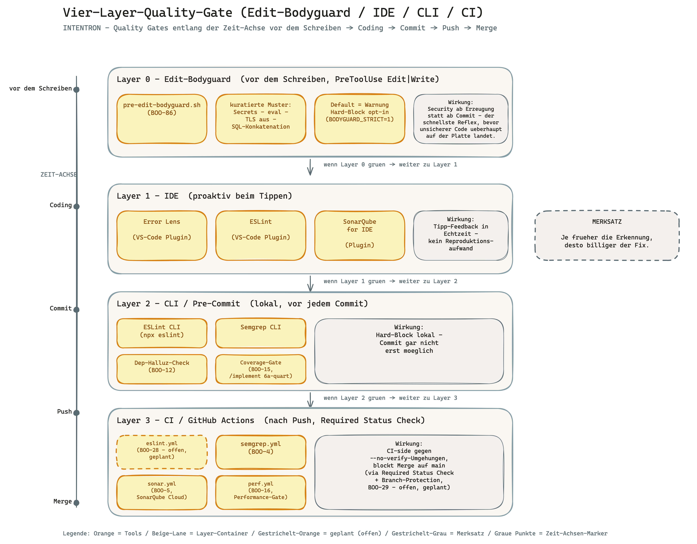
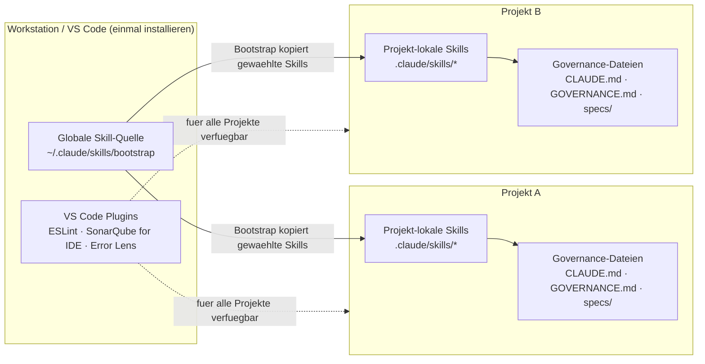
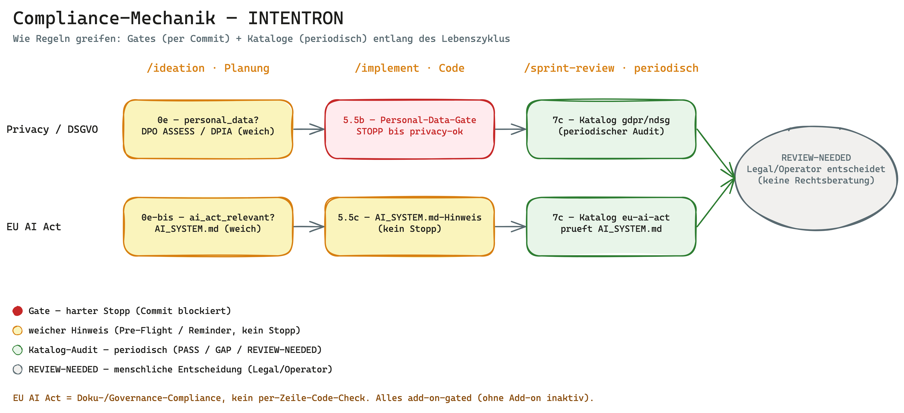
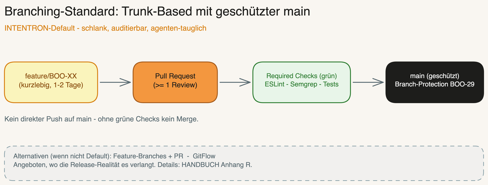
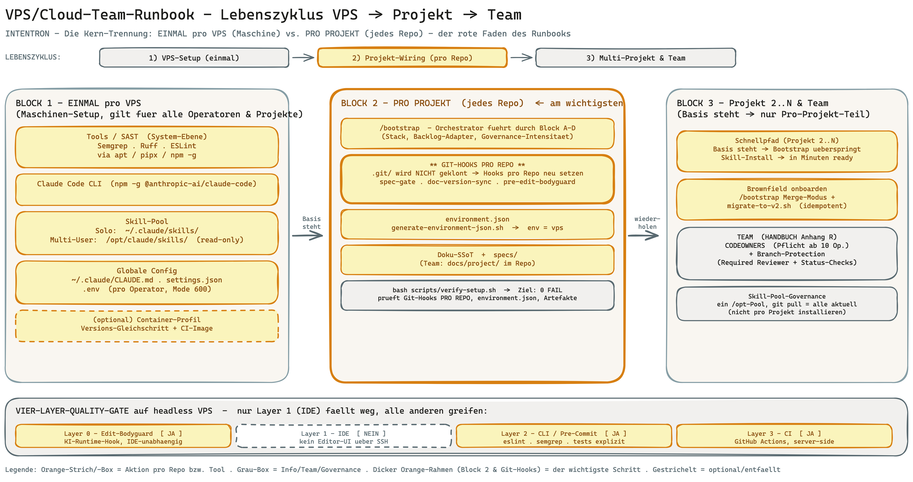
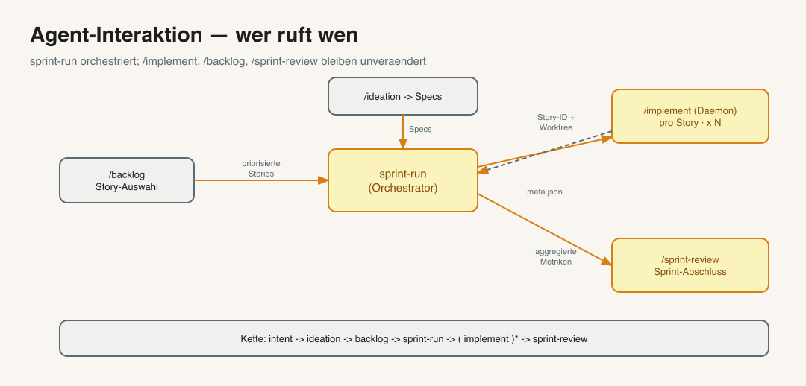
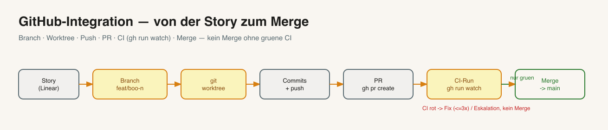

> 🇩🇪 **Deutsch** (this file) · 🇬🇧 [English](HANDBUCH.en.md)

---

# Governance für Vibe Coder — Das komplette Handbuch

> **Für wen ist dieses Handbuch?**
> Du bist Vibe Coder — du hast Ideen, du nutzt KI um Code zu bauen, und du willst schnell
> vorankommen. Governance klingt nach Bürokratie. Dieses Handbuch zeigt dir, warum Governance
> dein schnellstes Werkzeug ist — und wie du es in 30 Minuten aufgesetzt hast.

---

## Inhaltsverzeichnis

1. [Das Problem ohne Governance](#1-das-problem-ohne-governance)
2. [Was du bekommst](#2-was-du-bekommst)
3. [Voraussetzungen und Vorbereitung](#3-voraussetzungen-und-vorbereitung)
4. [Installation — Schritt für Schritt](#4-installation--schritt-für-schritt)
5. [Der Bootstrap-Prozess](#5-der-bootstrap-prozess)
6. [Die Skills — wann nutze ich was?](#6-die-skills--wann-nutze-ich-was)
7. [Die Artefakte — was entsteht, wo, und warum](#7-die-artefakte--was-entsteht-wo-und-warum)
8. [Die Guardrails — dein Sicherheitsnetz](#8-die-guardrails--dein-sicherheitsnetz)
9. [VS Code Setup](#9-vs-code-setup)
10. [Governance für dein Projekt anpassen](#10-governance-für-dein-projekt-anpassen)
11. [Tägliche Nutzung — ein typischer Workflow](#11-tägliche-nutzung--ein-typischer-workflow)
12. [Häufige Fragen](#12-häufige-fragen) — inkl. Claude Agent SDK Migration
13. [Anhänge — Wegweiser](#13-anhänge--wegweiser) — A bis AB im Überblick

---

## 1. Das Problem ohne Governance

### Was passiert wenn du einfach drauf los baust

Stell dir vor: Du hast eine großartige Idee. Du öffnest Claude, sagst "Bau mir X" und in 10 Minuten läuft Code. Genial.

Drei Wochen später:

- Du weißt nicht mehr, warum du eine Entscheidung so getroffen hast
- Du fragst Claude nach einem Bug — Claude kennt den Kontext nicht mehr
- Du willst eine neue Funktion hinzufügen und zerstörst dabei was anderes
- Du weißt nicht, welche Version deines Projekts "stabil" ist
- Du hast 50 Dateien, 3 halbfertige Features und keinen Plan mehr

Das ist **nicht** das Problem von KI. Das ist das Problem von **fehlendem System**.

### Die versteckte Wahrheit über Vibe Coding

Vibe Coding ist mächtig — aber nur wenn die KI versteht **was du gebaut hast** und **warum**.
Ohne Dokumentation und Struktur gibt jede neue Session bei null an.

### Das zweite Problem: der nachgelagerte Compliance-Befund

Es gibt ein zweites, teureres Problem — und das trifft nicht den Solo-Entwickler, sondern Teams in regulierten Organisationen. Ohne Leitplanken merkt niemand *während* der Entwicklung, ob Security-, Datenschutz- und Governance-Regeln eingehalten wurden. Der Befund kommt **nachgelagert**: im Security-Review, im Datenschutz-Audit, beim CISO — oft Monate später, wenn die Software längst läuft. Dann heißt es „ihr habt euch nicht an die Regeln gehalten", und es wird teuer nachgebessert.

INTENTRON dreht das um: Die Spielregeln liegen **vorab** im maschinen-ausführbaren Vertrag (`CONVENTIONS.md`/`AGENTS.md`), und Verstöße werden **früh** gefangen — im Commit (`sensitive-paths` → `review-ok`, `personal-data` → `privacy-ok`, Layer-0-Edit-Bodyguard), nicht erst im Audit. Spec-Linkage + `audit-trace.sh` liefern dem CISO/Auditor den Nachweis proaktiv. Das Team verliert keine Geschwindigkeit — es arbeitet *innerhalb* der Leitplanken. Bei regulierter Arbeit zieht der `heavy`-Modus Compliance-Evidenz, Mandatory Review und Branch-Protection automatisch hoch. Audit-Perspektive im Detail: `docs/runbooks/audit-perspective.md`.

**Mit Governance** passiert folgendes:
- Du sagst in einer neuen Session: `/status` — Claude sieht sofort alles
- Du sagst: `/implement ISSUE-42` — Claude weiß genau was zu tun ist
- Du sagst: `/breakfix` — Claude diagnostiziert strukturiert
- Jede Änderung ist nachvollziehbar, jeder Fehler hat einen Audit-Trail

---

## 2. Was du bekommst

### Das INTENTRON

Ein **vollständiges Betriebssystem für KI-gestützte Softwareentwicklung**:

```
GitHub Repository (vibercoder79/intentron)
├── bootstrap/        ← Richtet alles automatisch ein
├── ideation/         ← Von der Idee zur Story
├── implement/        ← Von der Story zum Code
├── backlog/          ← Sprint Planning & Prioritäten
├── breakfix/         ← Wenn etwas kaputt ist
├── architecture-review/  ← Ist mein System gesund?
├── research/         ← Deep Research mit KI
├── sprint-review/    ← Regelmäßige Qualitätskontrolle
├── integration-test/ ← Automatische Tests nach jeder Änderung
└── status/           ← System-Überblick auf Knopfdruck
```

### Was das konkret bedeutet

| Ohne Governance | Mit Governance |
|----------------|----------------|
| Claude vergisst zwischen Sessions | Claude kennt das System immer |
| "Bau mir X" → irgendwas entsteht | `/ideation` → strukturierte Story → `/implement` |
| Bugs tauchen aus dem Nichts auf | Self-Healing Agent überwacht 24/7 |
| Keine Ahnung ob Version stabil | Jede Änderung ist versioniert + dokumentiert |
| Rollback? Welches Rollback? | Git + Changelog = jederzeit zurückrollbar |
| 3 Wochen später: komplettes Chaos | Sprint Review hält alles sauber |

---

## 3. Voraussetzungen und Vorbereitung

### Software die du brauchst

**Pflicht:**

| Software | Wozu | Download |
|----------|------|---------|
| **Claude Code CLI** | Das Herzstück — KI im Terminal | `curl -fsSL https://claude.ai/install.sh \| bash` ¹ |
| **Node.js** (v18+) | Runtime für Claude Code | nodejs.org |
| **Git** | Versionskontrolle | git-scm.com |
| **GitHub CLI (`gh`)** | Pflicht sobald GitHub im Scope: Branch-Protection (BOO-29), PRs, `gh api`/`gh auth` | cli.github.com — Install + Connect-Runbook: Anhang Y |

> **Zwei Auth-Ebenen — nicht verwechseln (BOO-123):** `gh auth` ist die Auth fuer **CLI/API** (Branch-Protection, PRs); `git auth` ist die Auth fuer **`git push`** selbst. Du brauchst beides, aber `git push` geht **wahlweise** ueber SSH-Key (unten) **oder** ueber `gh` als HTTPS-Credential-Helper (`gh auth setup-git`) — auf einem headless VPS spart Letzteres den separaten SSH-Key. Voller GitHub-Connect-Runbook: Anhang Y.

**Empfohlen:**

| Software | Wozu |
|----------|------|
| **Visual Studio Code** | Editor mit Claude Code Integration |
| **GitHub Account** | Dein Code-Repository |

### Accounts die du brauchst

**Pflicht:**

1. **Anthropic Account** — für Claude Code
   - Gehe zu: claude.ai
   - Registrieren → Plan wählen (Pro reicht für den Start)
   - API Key unter: console.anthropic.com → API Keys

2. **GitHub Account** — für dein Repository
   - github.com/signup
   - Kostenlos reicht für den Anfang
   - **Branch-Protection (BOO-29):** bei **privaten** Repos nur mit bezahltem Plan (GitHub Pro/Team/Enterprise); bei **public** Repos gratis. Alternative: Repository Rulesets. Ohne das greift `setup-branch-protection.sh` auf einem privaten Free-Repo nicht.

**Empfohlen:**

3. **Linear Account** — für Issue Tracking (Backlog, Stories)
   - linear.app
   - Kostenlos für kleine Teams
   - Linear API Key: linear.app → Settings → Security and Access → Personal API Keys

**Optional aber wertvoll:**

4. **OpenRouter Account** — für günstigere LLM-Calls
   - openrouter.ai
   - Guthaben aufladen (~$10 reichen lange)
   - API Key unter: openrouter.ai/keys

### API Keys — Übersicht

Bevor du mit `/bootstrap` startest, halte diese Keys bereit:

| Key | Pflicht? | Woher | Variable |
|-----|---------|-------|----------|
| Anthropic API Key | JA | console.anthropic.com | `ANTHROPIC_API_KEY` |
| GitHub SSH Key | JA | `ssh-keygen` + GitHub Settings | — |
| Linear API Key | Empfohlen | linear.app → Settings → Security and Access | `LINEAR_API_KEY` |
| OpenRouter Key | Optional | openrouter.ai/keys | `OPENROUTER_API_KEY` |
| Telegram Bot Token | Optional | @BotFather auf Telegram | `TELEGRAM_BOT_TOKEN` |

> **Sicherheitsregel:** API Keys kommen NIEMALS in den Code. Sie landen in `.env` (diese Datei ist
> in `.gitignore` — wird nicht auf GitHub hochgeladen).

> ¹ **Hinweis zum Claude-Paket:** Das CLI-Tool heißt weiterhin `@anthropic-ai/claude-code`.
> Das neue `@anthropic-ai/claude-agent-sdk` (npm) / `claude-agent-sdk` (pip) ist für
> programmatische SDK-Nutzung in eigenen Apps — nicht für das CLI. Details: [FAQ → Claude Agent SDK](#was-ist-das-claude-agent-sdk--muss-ich-migrieren)

### SSH für GitHub einrichten

SSH ist die sichere Verbindung zwischen deinem Rechner und GitHub. Einmal einrichten, nie wieder denken.

```bash
# 1. SSH Key erstellen (falls noch nicht vorhanden)
ssh-keygen -t ed25519 -C "deine@email.com"
# → Einfach Enter drücken für alle Fragen

# 2. Public Key anzeigen
cat ~/.ssh/id_ed25519.pub
# → Diesen Text komplett kopieren

# 3. Auf GitHub eintragen
# github.com → Settings → SSH and GPG Keys → New SSH Key → Text einfügen

# 4. Verbindung testen
ssh -T git@github.com
# → "Hi username! You've successfully authenticated." = Erfolg

# 5. Bestehendes HTTPS-Remote auf SSH umstellen (Spezialfall, BOO-118)
# Falls das Repo via HTTPS geklont wurde — git remote -v zeigt https://github.com/...
git remote set-url origin git@github.com:<owner>/<repo>.git
git remote -v            # pruefen: origin zeigt jetzt auf git@github.com:...
ssh -T git@github.com    # Verbindungstest (wie Schritt 4)
```

---

## 4. Installation — Schritt für Schritt

### Schritt 1: Claude Code installieren

```bash
# Claude Code installieren (nativer Installer — empfohlen, kein Node nötig)
curl -fsSL https://claude.ai/install.sh | bash

# PATH aktivieren (Installer legt claude nach ~/.local/bin)
echo 'export PATH="$HOME/.local/bin:$PATH"' >> ~/.bashrc && source ~/.bashrc

# Prüfen ob es funktioniert
claude --version
```

> **Methode:** Der **native Installer** (`claude.ai/install.sh`) ist von Anthropic als
> *Recommended* markiert: kein Node nötig, Auto-Update im Hintergrund, Binary in `~/.local/bin`.
> Die npm-Variante (`npm install -g @anthropic-ai/claude-code`, braucht Node.js v18+) funktioniert
> weiterhin — Node bleibt ohnehin Voraussetzung für die Toolchain (ESLint etc.). URL ist
> `claude.ai`, **nicht** `claude.com` (404).

### Schritt 2: Claude Code einrichten

```bash
# Claude Code starten — beim ersten Start wirst du nach dem API Key gefragt
claude

# Alternativ: API Key als Environment Variable setzen
export ANTHROPIC_API_KEY="dein-api-key-hier"
```

> **Tipp:** Den `export` Befehl in deine `~/.bashrc` oder `~/.zshrc` eintragen, damit er
> bei jedem Terminal-Start aktiv ist.

### Schritt 3: Bootstrap Skill holen

Das ist der **einzige manuelle Schritt** — danach macht Claude alles automatisch.

```bash
# Bootstrap Skill vom GitHub Repository holen (macOS/Linux — User-Home)
# Framework-Repo ist public; der bootstrap-Ordner liegt im Repo-Root.
mkdir -p ~/.claude/skills
cd /tmp
git clone --filter=blob:none --sparse https://github.com/vibercoder79/intentron.git intentron
cd intentron
git sparse-checkout set bootstrap
cp -r bootstrap ~/.claude/skills/
cd /tmp && rm -rf intentron

# Prüfen ob der Skill da ist
ls ~/.claude/skills/bootstrap/
# → Sollte SKILL.md und einen references/ Ordner zeigen
```

> **Warum nur den Bootstrap Skill?** Der Bootstrap Skill installiert in Phase 5 (via `git clone`)
> automatisch alle weiteren Skills die du brauchst — keine Symlinks, lokal und portabel.

> **Bootstrap Skill vs. INTENTRON:** Der Bootstrap Skill ist der Installer und
> Projekt-Initializer. Er legt Governance-Dateien, Skill-Kopien, Hooks und optionale Adapter im
> Zielprojekt an. Das INTENTRON ist der Vergleichsgegenstand und die Methodik: die
> Regeln, Gates, Artefakte und Rollen, gegen die ein Projekt später geprüft wird. Anders gesagt:
> Bootstrap bringt das Framework ins Projekt; das Framework selbst ist nicht "der Bootstrap".

### Schritt 4: Neues Projekt anlegen

```bash
# Verzeichnis für dein neues Projekt erstellen
mkdir ~/mein-projekt
cd ~/mein-projekt

# Claude Code im Projektverzeichnis starten
claude
```

### Schritt 5: Bootstrap ausführen

In der Claude Code Session:

```
/bootstrap
```

Claude führt dich jetzt durch vier kurze Interview-Blöcke (A–D) und baut danach alles automatisch auf. Gesamtzeit: ca. 10 Minuten.

---

## 5. Der Bootstrap-Prozess (v3.0)


*Vom leeren Ordner zum governance-ready Projekt — vier Interview-Blöcke (A–D) umrahmen die Entscheidungen, vier Setup-Phasen (0, 4, 5, 7) setzen sie um. Block D aktiviert optionale Komponenten nur wenn du sie willst. ([Excalidraw-Quelle](bootstrap/docs/bootstrap-big-picture.excalidraw))*

### Überblick

| Schritt | Typ | Inhalt |
|---------|-----|--------|
| **Phase 0** — Briefing | Ankündigung | Bootstrap erklärt was kommt, du bestätigst |
| **Block A** — Projekt-Kern | Interview (7 Fragen) | Stack, Name, Beschreibung, Pfad, GitHub-URL, Backlog-Tool + Prefix, Version |
| **Block B** — Bestehende Infrastruktur | Interview (6 Fragen) | GitHub-Repo? Projekt-Dokumentations-SSoT? Backlog-Tool? `.env`? Runtime-Datei? Developer-Uebergabe? — integriert in das was schon da ist |
| **Block C** — Doku-Architektur | Vorschlag + Review | Project Hub, Developer Onboarding, Governance, Zielarchitektur, Backlog-Verweis + 3-Schichten-Vorschlag |
| **Phase 4** — Grundstruktur | Automatisch (~2 min) | Dateien, Git init, Linting, Governance-Hooks, Component-Skelette |
| **Phase 5** — Skills installieren | Automatisch | Skills via `git clone` aus `intentron` (keine Symlinks) |
| **Block D** — Optional-Komponenten | 4× Ja/Nein am Ende | Self-Healing / DocSync / Automation-Daemon / Learning-Loop (L1/L2/L3) |
| **Phase 7** — Finalisierung | Automatisch | gewaehlte Dokumentations-SSoT, optionale SecondBrain-Integration, globaler Registry-Eintrag, finaler Commit |

> **Warum Blöcke statt 14-Fragen-Batch?** Einzelne Fragen sind einfacher zu beantworten und jeder Block baut auf dem vorherigen auf — der Doku-Architektur-Vorschlag in Block C kennt deinen Stack (A.1) und deine bestehende Infra (B) schon.

### Block A — Projekt-Kern (7 Fragen)

#### A.1: Stack-Frage — als allererstes

```
Was möchtest du entwickeln?

a) Node.js / JavaScript Backend (API, CLI, Daemon)
b) Frontend (React, Vue, Vanilla JS)
c) Full-Stack (Node.js Backend + Frontend)
d) Python (KI/ML, Scripts, FastAPI, Django)
e) Anderes / Noch nicht klar
```

Die Antwort bestimmt Linter und Formatter:

| Deine Wahl | Linter | Formatter | Wird automatisch angelegt |
|-----------|--------|-----------|--------------------------|
| Node.js | ESLint | — | `eslint.config.mjs` |
| Frontend | ESLint + Prettier | Prettier | `eslint.config.mjs` + `.prettierrc` |
| Full-Stack | ESLint + Prettier | Prettier | `eslint.config.mjs` + `.prettierrc` |
| Python | Ruff | Black | `pyproject.toml` |

#### A.2–A.7: Projekt-Identität

| Frage | Beispiel | Warum |
|-------|----------|-------|
| Projektname | `MeinShop` | Wird überall verwendet |
| Kurze Beschreibung | `E-Commerce für handgemachte Produkte` | Claude versteht was du baust |
| Projekt-Pfad | `/home/user/mein-projekt` | Wo der Code landet |
| Backlog-Tool | `linear` / `github-issues` / `none` | Steuert Issue-Prefix und Daemon-Eligibility |
| Issue-Prefix | `SHOP` | Stories werden SHOP-1, SHOP-2, … |
| Start-Version | `1.0.0` | Versionierung ab Tag 1 |

#### A.4: Architektur-Dimensionen + Add-ons

Bootstrap installiert 8 **Standard**-Architektur-Dimensionen (Reliability, Data Integrity, Security, Performance, Observability, Maintainability, Testability, Scalability) und fragt, welche der 4 **optionalen Add-ons** dazugeschaltet werden:

| Add-on | Wann sinnvoll |
|--------|---------------|
| **Privacy / DSGVO** | Du verarbeitest personenbezogene Daten, DSGVO gilt |
| **Cost Efficiency** | Cloud-Rechnung ist relevant, LLM-Calls werden per Token abgerechnet |
| **Signal Quality** | Trading, Monitoring, alles was auf externe Signale reagiert |
| **Compliance** | Regulierte Branche (Finance, Health, öffentlicher Sektor) |

**Standard vs. Add-on:** Standard-Dimensionen gelten fuer **jedes** Projekt — universelle Software-Eigenschaften, die in jedem KI-unterstuetzten Bau abgesichert werden. Add-ons sind kontext-spezifisch und werden nur aktiviert, wenn die Projekt-Domain sie braucht.

Beliebige Kombination möglich — Default ist "keine". Jede aktive Dimension wird eine Sektion in `ARCHITECTURE_DESIGN.md §3 Quality Attributes`, die `/ideation`, `/architecture-review` und `/sprint-review` pruefen.

### Block B — Bestehende Infrastruktur (6 Fragen)

Bootstrap integriert in das was schon da ist, statt zu überschreiben. Die Fragen:

1. **GitHub-Repo existiert schon?** (URL oder "neu anlegen")
2. **Wo liegt die Projekt-Dokumentations-SSoT?** Obsidian Vault, Repo `docs/project/`, externes DMS wie Notion/Confluence/SharePoint oder vorlaeufiger Fallback
3. **Backlog-Tool eingerichtet?** (Linear-Projekt / GitHub-Issues / none)
4. **`.env` schon da?** (Keys behalten oder Template anlegen)
5. **Runtime-Anweisungen schon da?** (`AGENTS.md`, `CLAUDE.md`, mergen oder erzeugen)
6. **Developer Onboarding?** als Standard-Artefakt erzeugen oder vorhandenes Onboarding verlinken

### Block C — Doku-Architektur

Vor dem Schichtenmodell operationalisiert Bootstrap die gewaehlte Dokumentations-SSoT. Obsidian ist der Best-Practice-Pfad fuer vernetztes Projektwissen, aber das Framework ist nicht Obsidian-only:

| Option | Bootstrap erzeugt oder verlinkt |
|---|---|
| Obsidian Vault | Projektordner mit Project/PMO Hub, Developer Onboarding, Governance, Zielarchitektur, Backlog, Decisions, Meetings, Research, Assets, Archive |
| Repo docs | `docs/project/` mit denselben Standard-Artefakten |
| Externes DMS | lokaler Pointer `docs/project/DOCUMENTATION_SSOT.md` auf Notion, Confluence, SharePoint oder ein anderes System |
| Noch unklar | Repo-Fallback unter `docs/project/` plus TODO und Postflight `WARN` |

Developer Onboarding ist das Uebergabe-Artefakt. Ziel ist, dass ein fremdes Team oder eine andere Coding-Runtime das Projekt uebernehmen kann: Claude Code -> Codex, Cursor, GitHub Copilot, Google Antigravity oder ein klassisches Entwicklungsteam.

Basierend auf Stack (A.1) und bestehender Infra (Block B) schlägt Bootstrap dann eine **3-Schichten-Doku-Architektur** vor:

| Schicht | Lebt in | Zweck |
|---------|---------|-------|
| **1. Story-Specs** | `specs/ISSUE-XX.md` | Pro Story, Pflicht für Commit via `spec-gate.sh` |
| **2. Component-Docs** | `docs/components/*.md` oder Obsidian `Components/*.md` | Lebende Doku pro Komponente (voice, memory, frontend …) |
| **3. Architektur-Vorgaben** | `Architektur-Vorgaben.md` | Konsolidierte Stack-Entscheidungen, querschnittliche Regeln |

**Hub:** `ARCHITECTURE_DESIGN.md` verlinkt alle drei Schichten via **§9-Auto-Verlinkung** — jede neue `*.md` unter den Doku-Ordnern wird automatisch im Hub registriert. Optionaler `orphan-check.sh`-Hook blockiert Commits mit Docs ohne Hub-Eintrag.

Du kannst den Vorschlag übernehmen, anpassen oder einzelne Schichten abwählen.

### Phase 4: Grundstruktur (automatisch, ~2 Minuten)

Claude legt Dateien an, initialisiert Git, richtet Linting ein, installiert Governance-Hooks und scaffolded die Component-Doc-Skelette. Siehe [Artefakte-Landkarte](#7-die-artefakte--was-entsteht-wo-und-warum) für eine visuelle Übersicht aller Dateien.

**`ARCHITECTURE_DESIGN.md §2` enthält einen Pflicht-Block KI-Architektur-Prinzipien (BOO-24, Schrader Kap. 4):** 4 Prinzipien (kleine Module, explizite Interfaces, Testbarkeit, Observability) + 4 Anti-Patterns werden proaktiv beim Projekt-Setup verankert — nicht erst reaktiv im ersten Review entdeckt. `/architecture-review` (BOO-7) prüft alle 8 Punkte bei jeder Story. Referenz: `intentron/references/ki-architektur-prinzipien.md`.

**Wichtigste Datei: `CLAUDE.md`** — der "Personalausweis" deines Projekts für die KI. Bei jeder neuen Claude-Session liest Claude diese Datei und kennt sofort Projekt, Regeln, Dateipfade, letzten Stand.

### Phase 5: Skills installieren (automatisch)

Skills werden via `git clone` aus dem Framework-Repository `vibercoder79/intentron` nach `.claude/skills/` geholt — **keine Symlinks, keine Runtime-Abhängigkeit zum Quell-Repo**. Die Skill-Kopien sind lokal und portabel. (Companion-Skills wie `research`/`skill-creator` liegen separat in `claudecodeskills` und werden nur bei Bedarf ergänzt.)

Wichtige Trennung: VS-Code-Plugins sind Workstation-Infrastruktur; Skills sind Projekt-Infrastruktur. ESLint, SonarQube for IDE, Error Lens, Python/Ruff usw. installierst du einmal in VS Code. Bootstrap prueft und dokumentiert pro Projekt nur, ob diese Plugins verfuegbar sind; er installiert sie nicht fuer jedes Projekt neu. Skills sind anders: Jedes gebootstrappte Projekt bekommt eine eigene lokale `.claude/skills/`-Kopie (und bei Codex-Adaptern optional `.codex/skills/`). Diese Kopie ist der gepinnte Runtime-Stand des Projekts. Wenn du ein zweites Projekt bootstrappst, werden die ausgewaehlten Skills auch in dieses zweite Projekt kopiert. Das ist Absicht, keine doppelte globale Installation.

Wenn ein Projekt bereits `.claude/skills/<skill>/` enthaelt, ist Phase 5 eine Update-/Merge-Entscheidung: Projektkopie behalten, gegen den aktuellen Master-Skill vergleichen und nur bewusst aktualisieren. Projektspezifisch angepasste Skills nicht blind ersetzen.

```
Welche Skills installieren?
a) Minimum (ideation, implement, backlog, intent)   ← Für den Start ideal
b) Standard (+ architecture-review, sprint-review, research, breakfix)  ← Empfohlen
c) Voll (alle Skills)                          ← Volles Arsenal
d) Manuell auswählen
```

### Block D — Optional-Komponenten (am Ende)

Nachdem das Basisprojekt steht, stellt Bootstrap gezielte Optional-Komponenten- und Provider-Postflight-Fragen:

| Komponente | Was sie macht | Kosten |
|------------|---------------|--------|
| **Self-Healing-Agent** | Cron-Check alle 15 Min: Versionen synchron, Dateien vorhanden, Daemons laufen | Niedrig |
| **DocSync zu Obsidian** | Auto-Spiegel der Docs in deinen Vault | Keine (wenn Vault existiert) |
| **Automation-Daemon** | Linear-Webhook → automatisches `/implement` bei "In Progress" | Braucht Linear + Webhook-Endpoint |
| **Learning-Loop (L1/L2/L3)** | Framework wird mit jedem Sprint klüger — siehe nächste Sektion | L1 gratis, L3 bringt SQLite |
| **Research** | Framework-, Companion- oder globaler Skill plus Perplexity/OpenRouter/MCP-Providerstatus | Provider-abhaengig |
| **Visualize/Miro** | Diagramm-Skill plus Miro-MCP-Verifikation oder Excalidraw/Mermaid-Fallback | Miro-abhaengig |
| **Monitoring** | zentrale Plattform, projektlokales Setup oder dokumentierte Architekturfrage | Plattform-abhaengig |

### Learning-Loop (L1/L2/L3)

Eine **portable Feedback-Schleife**, die abgeschlossene Sprints in Anti-Pattern-Warnungen für zukünftige Stories verwandelt. Drei Stufen zur Auswahl:

| Level | Speicher | Schreibt | Liest |
|-------|----------|----------|-------|
| **L1 — Einfach** | `journal/learnings.md` (append-only Markdown) | `/sprint-review` hängt nach jedem Review an | `/ideation` liest bei Story-Erstellung (warnt bei passendem Anti-Pattern) |
| **L2 — Sprint-Journal** | `journal/sprint-YYYY-QN.md` (eine Datei pro Sprint) | `/sprint-review` | `/ideation` + `/architecture-review` |
| **L3 — SQLite** | `.learning-loop/loop.db` (strukturiert) | `/sprint-review` | `/ideation` + `/architecture-review` + `/backlog` (Prio-Anpassung) |

**Warum das wichtig ist:** Ohne Loop startet jeder Sprint bei Null. Mit Loop tauchen Entscheidungen, die letzten Sprint Schmerzen verursacht haben (falsche Abhängigkeit, übersehene Acceptance Criterion, Scope Creep), als Warnung auf — *bevor* die nächste Story geschrieben wird.

### Phase 7: Finalisierung

- **Dokumentations-SSoT finalisieren** — Bootstrap erzeugt oder verlinkt Project Hub, Developer Onboarding, Governance, Zielarchitektur, Backlog, Decisions, Meetings, Research, Assets und Archive in der gewaehlten SSoT
- **SecondBrain-Integration** — wenn Block B Obsidian gewaehlt hat, legt Bootstrap einen PMO-Hub unter `02 Projekte/<ProjektName>/` an
- **Globale Registry** — `~/.claude/MEMORY.md` bekommt einen Pointer auf das neue Projekt
- **Finaler Commit** — alles in einem Commit mit Zusammenfassungs-Tabelle

```
✓ Block A: Projekt-Kern + Stack + Add-ons
✓ Block B: Bestehende Infrastruktur + Dokumentations-SSoT integriert
✓ Block C: Project Hub + Developer Onboarding + Doku-Architektur
✓ Phase 4: Grundstruktur (Dateien, Git, Linting, Hooks, Labels)
✓ Phase 5: Skills installiert ({Anzahl})
✓ Block D: Optional-Komponenten ({Status})
✓ Phase 7: SecondBrain + Registry + Final-Commit

Dein Projekt ist bereit. Starte mit: /ideation
```

---

## 6. Die Skills — wann nutze ich was?

### Übersicht: Das Skill-System

Skills sind **wiederholbare Workflows** die Claude durch komplexe Aufgaben führen.
Du rufst sie mit `/skillname` auf und Claude folgt einem definierten Prozess.

```
Idee → /ideation → Story in Linear
Story → /implement → Code, Tests, Git Push
Problem → /breakfix → Diagnose, Fix, Prevention
Woche → /backlog → Was steht an?
Quartal → /sprint-review → System-Gesundheit
Sprint-Ende → /pitch → Evidenz-Briefing fuer Stakeholder
Jederzeit → /status → Was läuft gerade?
```

> **Design-Stories (BOO-126):** Eine Design-Story laeuft als **„implement gegen eine Design-Referenz"** durch die normale Pipeline (`/ideation` → `/implement`) — **kein** eigener `change_type: design`, kein Template, keine Auto-Erkennung. Die Referenz (z.B. `DESIGN.md`, Figma-Export, Screenshot) wird in `ARCHITECTURE_DESIGN.md §9` verlinkt; `/implement` verifiziert gegen die Referenz **plus** a11y-/Lighthouse-Gates (BOO-45). **Abgrenzung:** Das Coding-Framework *setzt Design um* (messbare Gates = Ground Truth, Karpathy-Verifizierbarkeit); **reine Gestaltung** (Geschmack, Brand, Visual Identity) lebt in **opt-in externen Skills** (`design-md-generator`, `lumen-*`, Pencil-/Webflow-MCP) — nicht in der Pflicht-Pipeline. Entscheidung: ADR `docs/domain/adrs/design-story-handling.md`.

Die vollstaendige 4P-Delivery-Pipeline (Schrader Code Crash Kap. 5) ist verdrahtet als:

```
/intent → /ideation → /backlog → /implement → /architecture-review → /sprint-review → /pitch
\______/   \_____________________________/                                              \____/
Perceive   Prompt + Produce                                                              Pitch
```

Siehe **Anhang L** fuer das vollstaendige 4P-Pipeline-Mapping und den `/pitch`-Evidenz-Vertrag.

Jeder Skill hat eine eigene README mit visueller Übersicht:

| Skill | README + Sketch |
|-------|-----------------|
| bootstrap | [README](bootstrap/README.md) · [Sketch](bootstrap/docs/bootstrap-big-picture.png) |
| ideation | [README](ideation/README.md) · [Sketch](ideation/overview.png) |
| implement | [README](implement/README.md) · [Sketch](implement/overview.png) |
| backlog | [README](backlog/README.md) · [Sketch](backlog/overview.png) |
| architecture-review | [README](architecture-review/README.md) · [Sketch](architecture-review/overview.png) |
| sprint-review | [README](sprint-review/README.md) · [Sketch](sprint-review/overview.png) |
| pitch | [README](pitch/README.md) · [Sketch](pitch/pitch-overview.png) |
| research | [README](research/README.md) · [Sketch](research/overview.png) |
| security-architect | [README](security-architect/README.md) · [Sketch](security-architect/overview.png) |
| grafana | [README](grafana/README.md) · [Sketch](grafana/overview.png) |
| cloud-system-engineer | [README](cloud-system-engineer/README.md) · [Sketch](cloud-system-engineer/overview.png) |
| visualize | [README](visualize/README.md) · [Sketch](visualize/overview.png) |
| skill-creator | [README](skill-creator/README.md) · [Sketch](skill-creator/overview.png) |
| design-md-generator | [README](design-md-generator/README.md) · [Sketch](design-md-generator/overview.png) |

### `/ideation` — Von der Idee zur Story


**Wann:** Du hast eine Idee für ein neues Feature.

**Was passiert:**
1. Du beschreibst deine Idee in natürlicher Sprache
2. Claude recherchiert (optional: Deep Research mit Perplexity)
3. Claude prüft ob die Idee zur Architektur passt
4. Claude erstellt eine strukturierte User Story in Linear

**Beispiel:**
```
Du: /ideation

Claude: "Beschreibe deine Idee..."
Du: "Ich möchte dass Kunden ihre Bestellungen verfolgen können"

→ Claude erstellt SHOP-42 in Linear mit:
   - Was genau gebaut wird
   - Warum (Business Value)
   - Wie (technischer Ansatz)
   - Akzeptanzkriterien
   - Aufwandsschätzung
```

#### Pre-Flight Checks in `/ideation`

Bevor die eigentliche Ideation-Arbeit beginnt, laufen zwei weiche Pre-Flight-Checks. **Weich = der Operator wird gefragt, kein Hard-Block.** Sie verhindern den teuersten Failure Mode: Stories gegen ein veraltetes Bild des Systems schreiben.

**Check 1 — Environment geladen (Schritt 0):** Der Skill liest `.claude/environment.json`, um Pfade, Tools und Thresholds zu kennen. Fehlt die Datei, greifen Defaults und der Skill warnt einmalig.

**Check 2 — Architektur-Doku-Aktualität (Schritt 0a, weich):** Der Skill vergleicht den letzten Aenderungs-Zeitstempel der `ARCHITECTURE_DESIGN.md` gegen `thresholds.architecture_doc_freshness_days` aus `.claude/environment.json` (Default `30`). Wenn die Doku aelter ist als der Threshold:

```
Warnung: ARCHITECTURE_DESIGN.md wurde seit 47 Tagen nicht aktualisiert
(Threshold: 30 Tage).

Empfehlung: /architecture-review ausfuehren, bevor neue Stories gegen
eine evtl. veraltete Architektur angelegt werden.

Trotzdem fortfahren? [ja/nein]
```

Bei `nein` stoppt der Skill, der Operator faehrt `/architecture-review`, danach wird `/ideation` erneut gestartet. Bei `ja` wird das Override in der resultierenden Story unter `Current State` dokumentiert.

**Warum weich, kein Hard-Block?** Ein Hard-Gate wuerde jedes Projekt, das laenger nicht angefasst wurde, blockieren — die Doku ist aber oft „alt genug zum Warnen, noch valide". Der Operator entscheidet pro Story. Der Threshold steht in `.claude/environment.json`, jedes Projekt kann ihn tunen: schnell evolvierende Systeme setzen 14, stabile Systeme 90.

**Konfigurations-Beispiel** in `.claude/environment.json`:

```json
{
  "thresholds": {
    "architecture_doc_freshness_days": 14
  }
}
```

### `/implement` — Von der Story zum Code


**Wann:** Du willst eine Story umsetzen.

**Was passiert (10-Schritte-Prozess):**
1. Issue aus Linear laden
2. Spec-File erstellen (`specs/SHOP-42.md`)
3. **Operator-OK einholen** ← du bestätigst den Plan
4. Code schreiben
5. Tests
6. Git Commit + Push
7. Deploy Health Check
8. Backlog-Record oder Adapter-Story schließen
9. Changelog aktualisieren
10. Ergebnis präsentieren

**Beispiel:**
```
Du: /implement SHOP-42

Claude: [liest Issue, erstellt Plan, zeigt dir was er tun will]
Claude: "Soll ich loslegen? [Ja/Nein/Ändern]"
Du: "Ja"
Claude: [implementiert, testet, pusht, schließt Issue]
```

> **Wichtig:** `/implement` ändert NIEMALS Code ohne dein OK in Schritt 3.
> Du hast immer die Kontrolle.

### `/backlog` — Sprint Planning


**Wann:** Du weißt nicht was als nächstes wichtig ist.

**Was passiert:**
1. Claude lädt alle offenen Issues aus Linear
2. Analysiert Abhängigkeiten (was blockiert was?)
3. Schlägt priorisierte Reihenfolge vor
4. Zeigt Aufwand und Risiko pro Issue

**Beispiel:**
```
Du: /backlog

Claude zeigt:
┌─────────────┬──────────────────────────────────┬──────────┬──────────┐
│ Issue       │ Titel                            │ Prio     │ Aufwand  │
├─────────────┼──────────────────────────────────┼──────────┼──────────┤
│ SHOP-38     │ Zahlungsabwicklung reparieren    │ KRITISCH │ S        │
│ SHOP-42     │ Bestellverfolgung                │ HOCH     │ M        │
│ SHOP-51     │ Dashboard Redesign               │ MITTEL   │ L        │
└─────────────┴──────────────────────────────────┴──────────┴──────────┘
→ Empfehlung: SHOP-38 zuerst (blockiert SHOP-42)
```

### `/sprint-run` — Sprint-Orchestrator (ganzer Sprint, vollautomatisch)


**Wann:** Du willst einen ganzen Sprint vollautomatisch fahren, statt Story für Story manuell `/implement` aufzurufen.

**Was passiert:**
1. Wählt Stories aus dem priorisierten Backlog
2. Setzt jede Story per `/implement` im Daemon-Modus um — eigener `git worktree` + Branch pro Story
3. Pflegt den Linear-Status (Backlog → In Progress → Done), wartet auf grüne Remote-CI, merged, räumt den Worktree ab
4. Stoppt am 80%-Token-Boundary und triggert `/sprint-review`

**Abgrenzung:** `/implement` = eine Story. `/sprint-run` = N Stories (ganzer Sprint). `/sprint-run` ist reiner Orchestrator — `/implement`, `/backlog`, `/sprint-review` bleiben unverändert.

**Gate-Blocks** (sensitive-paths / personal-data) pausieren den Daemon und werden **nie** automatisch überbrückt — Resume nur nach `review-ok` / `privacy-ok`.

> Vollständiges Kapitel mit allen Diagrammen (Daemon-Loop, Story-Breakdown, Agent-Interaktion, GitHub-Integration, Gate-Block-Handling): **Anhang AD**.

### `/breakfix` — Wenn etwas kaputt ist

**Wann:** Das System hat ein Problem, einen Bug, oder verhält sich komisch.

**Was passiert (6-Schritte-Prozess):**
1. **Detect:** Was genau ist das Problem?
2. **Diagnose:** Warum passiert es?
3. **Fix:** Lösung implementieren
4. **Verify:** Ist es wirklich behoben?
5. **Document:** Incident in `journal/incidents/` archivieren
6. **Prevent:** Wie verhindern wir das in Zukunft?

**Beispiel:**
```
Du: /breakfix

Claude: "Beschreibe das Problem..."
Du: "Die API gibt seit heute 401 Fehler zurück"

→ Claude analysiert Logs, findet expired Session Token,
   implementiert automatischen Token-Refresh,
   schreibt Incident-Report, legt präventiven Test an
```

### `/architecture-review` — System-Gesundheit


**Wann:** Bevor du eine große Entscheidung triffst. Regelmäßig (monatlich).

**Was passiert:**
Claude prüft die aktiven Dimensionen deines Systems — 8 Standard
(Reliability, Data Integrity, Security, Performance, Observability, Maintainability, Testability, Scalability)
plus aktive Add-ons (Privacy / DSGVO, Cost Efficiency, Signal Quality, Compliance):
- Wird SSoT (Single Source of Truth) eingehalten?
- Gibt es zirkuläre Abhängigkeiten?
- Sind alle Sicherheitsregeln aktiv?
- Stimmt die Dokumentation mit dem Code überein?
- Coverage auf neuem Code? Test-Pyramide eingehalten?

**Output:** Risiko-Tabelle mit konkreten Handlungsempfehlungen.

### `/research` — Deep Research


**Wann:** Du willst eine technische Entscheidung treffen und brauchst Fakten.

**Was passiert:**
- Automatisches Routing: Einfache Fragen → WebSearch, komplexe → Perplexity (tiefere KI-Analyse)
- Ergebnisse werden gegengeprüft
- Strukturierter Research-Report

**Beispiel:**
```
Du: /research

"Welche Payment-Provider funktionieren am besten mit Node.js
 und haben die niedrigsten Gebühren für Europa?"

→ Vergleichstabelle mit Stripe, Mollie, PayPal, Klarna
   inkl. Gebühren, Integrationsaufwand, Vor-/Nachteile
```

### `/sprint-review` — Quartals-Audit


**Wann:** Alle 4-6 Wochen.

**Was passiert:**
- Tech Debt Analyse: Was muss dringend aufgeräumt werden?
- Backlog-Hygiene: Welche Issues sind veraltet?
- Architektur-Check: Hat sich technische Schulden angesammelt?
- Empfehlungen für die nächsten Wochen

### `/pitch` — Evidenz fuer Stakeholder-Termine


**Wann:** Vor einem Stakeholder-Termin, nachdem `/sprint-review` gelaufen ist.

**Was passiert:**
- 8 Quellen werden read-only aggregiert: L3-Lessons-DB, lokale Implement-Reports, CI-Reports, Sprint-Files, ARCHITECTURE_DESIGN.md, INTENT-XX.md, Feature-Flag-Stand, Git-Log
- Architektur-Diff seit dem letzten Pitch wird berechnet
- Demo-Pfad-Heuristik schlaegt eine User-Journey vor, die die Intent-Erfuellung am besten zeigt
- Output: `pitch/PITCH-XX.md` mit Frontmatter (`metrics_snapshot`, `related_intents`, `demo_path`, `status`) + 5 Body-Sektionen — committed, NICHT gitignored

**Anti-Scope:** Skill erzeugt KEINE Slides, KEIN Voice-Over, KEINEN Outcome-Text und KEIN Demo-Video. Mensch baut die Story und macht die Live-Demo. Details in **Anhang L** (4P-Pipeline-Mapping).

### `/status` — Auf einen Blick

**Wann:** Immer wenn du wissen willst was gerade los ist.

**Output:**
```
SYSTEM STATUS — MeinShop v1.3.2
─────────────────────────────────
✓ Alle Daemons laufen
✓ Letzte Änderung: vor 2h (SHOP-42 deployed)
⚠ 3 offene Issues in Backlog
✓ Win-Rate letzte 7 Tage: 87%
✓ Keine offenen Incidents
```

### `/integration-test` — Nach jeder Änderung

**Wann:** Automatisch nach `/implement`, aber auch manuell aufrufbar.

**Was passiert:**
Claude führt vordefinierte Checks durch und zeigt:
- Tier-1 Checks (KRITISCH — müssen grün sein)
- Tier-2 Checks (Warnungen — sollten geprüft werden)

---

## 7. Die Artefakte — was entsteht, wo, und warum

> **Überblick auf einer Seite (BOO-130):** *Wie* das Framework dokumentiert — Artefakte, 3 Doku-Schichten, fortlaufende Gates und der Bestands-Repo-Onboarding-Pfad — steht konsolidiert in [`docs/how-we-document.md`](docs/how-we-document.md). Dieser §7 listet die Artefakte im Detail.

### Was ist ein Artefakt?

Ein **Artefakt** ist eine Datei, die das Governance-Framework erzeugt oder erwartet — Doku,
Checklists, Hooks, Specs, Automation-Scripts, Memory-Eintraege. Jedes Artefakt hat einen
klaren Zweck und wird von bestimmten Skills gelesen oder geschrieben.

Die meisten Teams sammeln Doku ad-hoc. Das INTENTRON definiert ein festes, minimales Set von
Artefakten die zusammen nachvollziehbare, reproduzierbare, KI-freundliche Entwicklung
ermoeglichen.

### Die 5 Artefakt-Gruppen


*Die komplette Artefakte-Landkarte: jede Governance-Datei, jeder Hook, jede Spec, jede Automation die Bootstrap erzeugt — gruppiert in 5 Kategorien, mit Pfeilen die zeigen welcher Skill welches Artefakt nutzt. ([Excalidraw-Quelle](bootstrap/docs/artifact-map.excalidraw))*

#### Gruppe A — Governance-Doku

Regeln · Architektur · Prozess · Historie.

| Artefakt | Zweck | Geschrieben von | Gelesen von |
|----------|-------|-----------------|-------------|
| `CLAUDE.md` | Claude-Identitaet + Projektregeln | bootstrap + du | jeder Skill (automatisch beim Session-Start) |
| `CONVENTIONS.md` | Projekt-lokaler Vertrag: Governance-Modus, Execution-Isolation, aktive Gates | bootstrap + du | `/ideation`, `/implement`, `/architecture-review`, `/sprint-review`, Tool-Adapter |
| `GOVERNANCE.md` | Prozess-Regeln — wann/warum | bootstrap | jeder Skill |
| `SYSTEM_ARCHITECTURE.md` | Ueberblick Komponenten, Datenfluss | bootstrap + `/implement` | jeder Skill |
| `ARCHITECTURE_DESIGN.md` | Lead-Dokument — alle ADRs, 8 Sektionen | bootstrap + `/ideation` | `/implement`, `/architecture-review`, `/sprint-review` |
| `INDEX.md` | Datei-Index | bootstrap + `/implement` | jeder Skill |
| `COMPONENT_INVENTORY.md` | Komponenten-Inventur | bootstrap + `/implement` | Self-Healing (Check U) |
| `DEVELOPMENT_PROCESS.md` | Prozess-Referenz | bootstrap | Referenz |
| `SECURITY.md` | Security-Policy | bootstrap + `/security-architect` | `/implement`, `/sprint-review` |
| `CHANGELOG.md` | Was hat sich wann geaendert | `/implement` (auto) | jeder Skill |
| `API_INVENTORY.md` | Alle externen APIs | `/implement` | `/security-architect` (AUDIT) |
| `journal/STRATEGY_LOG.md` | Strategische Entscheidungen | du + `/ideation` | `/ideation` (Pflicht vor Story-Erstellung) |
| `journal/LEARNINGS.md` | Outcome-Tracking | `/implement` (nach Issue-Close) | `/sprint-review` |
| `lib/config.js` | Single Source of Truth: VERSION + DOC_FILES | bootstrap | Self-Healing, doc-version-sync |

### Security-Dokumentationsmodell

Security im INTENTRON ist keine einzelne Checkliste, sondern ein verknuepftes Dokumentationsmodell:

*Sketch: Der Security-Workflow zeigt, wie `ARCHITECTURE_DESIGN.md`, `SECURITY.md`, Unterartefakte, Skill-Gates und Learning Loop ineinandergreifen. ([Excalidraw-Quelle](docs/security-workflow.excalidraw))*

| Ebene | Artefakt | Rolle |
|---|---|---|
| Architektur-Leitvertrag | `ARCHITECTURE_DESIGN.md` | Nennt Security als Qualitaetsdimension, dokumentiert Security-/Privacy-Grenzen und verweist auf den Security-Vertrag. |
| Operativer Security-Vertrag | `SECURITY.md` | Definiert Security-Grundsatz, Secrets-Policy, Change-Type-Matrix, Validation Evidence, sensitive Pfade und Incident-Notizen. |
| Security-Unterartefakte | `API_INVENTORY.md`, `.semgrep.yml`, `.codex/hooks.json`, `.claude/sensitive-paths.json`, `.codex/sensitive-paths.json`, Threat Models, Privacy-/Compliance-Dokumente | Enthalten konkrete Evidenz, Provider-/API-Details, technische Gates und Human-Review-Regeln. |

Der Ablauf ist bewusst gesteuert: `/ideation` schreibt `Security Impact` und, falls relevant, `Security Validation` in die Story. `/implement` liest `ARCHITECTURE_DESIGN.md`, `SECURITY.md` und die passenden Unterartefakte, bevor Code geaendert wird. `/security-architect` ergaenzt Threat Models, Policies oder Reviews bei riskanten Aenderungen. `/architecture-review` prueft, ob Security weiter zum Architektur-Zielbild passt. `/sprint-review` sucht nach Security-Schulden, offenen Findings und wiederkehrenden Mustern.

Damit wird Security by Design operativ: Security Impact planen, gegen den Vertrag implementieren, mit Gates validieren, betroffene Artefakte aktualisieren und wiederkehrende Findings in den Learning Loop zurueckspielen.

#### Gruppe B — Checklists + Guardrails

Maschinell erzwungene Regeln und Referenzlisten.

| Artefakt | Zweck | Enforcement |
|----------|-------|-------------|
| `.claude/hooks/spec-gate.sh` | Blockiert `git commit ISSUE-XX` ohne `specs/ISSUE-XX.md` | **HARD GATE** (PreToolUse Hook) |
| `.claude/hooks/doc-version-sync.sh` | Blockiert `git push` bei VERSION-Drift zwischen DOC_FILES | **HARD GATE** (PreToolUse Hook) |
| `.claude/hooks/pre-edit-bodyguard.sh` | Faengt unsichere Muster (Secrets, `eval`, TLS aus, SQL-Konkatenation) bei `Edit/Write` ab — Layer 0, BOO-86 | Warnung (Hard-Block opt-in via `BODYGUARD_STRICT=1`), PreToolUse Hook |
| `.claude/hooks/guard.sh` | Blockiert Zugriff auf `.env` und Schluessel-Dateien | Soft Guard |
| `.claude/hooks/format.sh` | Auto-Format bei Edit/Write (Biome/Black) | Passiv |
| `.claude/settings.json` | Hook-Registration + Permissions | Config |
| `eslint.config.mjs` / `.prettierrc` / `pyproject.toml` | Linting-Config (Stack-abhaengig) | Passiv + `/implement` Schritt 6a |
| `.claude/ISSUE_WRITING_GUIDELINES.md` | Issue-Format-Regeln | Referenz |
| `architecture-review/references/dimensions-detail.md` | Die 8 Standard- + 4 Add-on-Dimensionen | Referenz fuer `/ideation`, `/architecture-review`, `/sprint-review` |
| `implement/references/change-checklist.md` | Pro-Aenderung Validation | Referenz fuer `/implement` Schritt 6 |
| `security-architect/references/owasp-checklist.md` | OWASP Top 10:2025 + ASVS 5.0 | Referenz fuer `/security-architect` |

#### Gruppe C — Specs + Traceability

Der Pfad Idee → Issue → Spec → Commit → Changelog.

| Artefakt | Zweck | Aufbau |
|----------|-------|--------|
| `specs/TEMPLATE.md` | Template fuer neue Specs | Why · What · Constraints · Current State · Tasks (T1, T2…) |
| `specs/ISSUE-XX.md` | Eine Spec pro Story (Pflicht vor Commit) | Aus TEMPLATE gefuellt + `## Zusammenfassung` von `/implement` Schritt 8 |
| Backlog-Records / Adapter-Stories | Externes oder lokales Story-Tracking | Feature-Template oder Fix/Refactor-Template |
| Git Commits | Format: `T1: ISSUE-XX — Beschreibung` | Durch spec-gate.sh gegated |
| Obsidian Vault | Change-Logs + Projekt-Memory | Auto-sync durch `doc-sync.js` |

#### Gruppe D — Self-Healing + Automation

Runtime-Agents — kein Ops-Team noetig.

| Artefakt | Zweck | Frequenz |
|----------|-------|----------|
| `agents/self-healing.js` | Check M (Versionen) · U (Dateien) · P (Prozesse) + Telegram-Alert | Cron, alle 15 Min |
| `lib/doc-sync.js` | Sync in Obsidian-Vault | On demand + Cron |
| `.env` / `.env.example` | Secrets + API-Keys (gitignored) | Manuell |
| `agents/linear-automation-daemon.js` | Webhook-driven Auto-Implement | Optional |

#### Gruppe E — Skill-System

Skills konsumieren Artefakte aus A–D.

| Artefakt | Zweck |
|----------|-------|
| `~/.claude/skills/*` | Globale Skill-Quelle / Operator-Registry |
| `.claude/skills/*` | Projekt-lokale Skill-Kopien, gepinnt und portabel |
| `~/.claude/projects/-root/memory/MEMORY.md` | Globale Memory |
| `~/.claude/projects/-root/memory/project_{slug}_init.md` | Projekt-spezifische Memory |

#### Gruppe F — Environment-Manifest (BOO-34)

| Artefakt | Zweck |
|----------|-------|
| `.claude/environment.json` | Single Source of Truth fuer Umgebung (mac/vps/ci), verfuegbares Tooling und Default-Pfade |
| `.claude/generate-environment-json.sh` | Bash-Generator (BSD- und Linux-kompatibel, ohne Dependencies) |

##### Coding-Umgebungen — Mac vs. VPS vs. CI

Gleiche Governance-Code-Basis, drei sehr unterschiedliche Ausfuehrungs-Kontexte. Skills verhalten sich je nach `environment` leicht unterschiedlich:

- **`mac`** — Operator-Workstation. Interaktive Sessions, IDE-Integrationen verfuegbar (SonarLint-Plugin, ESLint-Extension), `brew` fuer Tool-Installs. `tools_available.sonarqube_ide_plugin` kann `true` sein, falls der Operator das Plugin installiert hat.
- **`vps`** — Server (z.B. Hostinger srv1443320). Keine IDE-Plugins, `apt`/`pip` fuer Installs, laeuft in tmux/screen, Reports landen in `journal/reports/local/`. `sonarqube_ide_plugin` ist immer `false`. Operator steuert via SSH.
- **`ci`** — GitHub Actions / GitLab CI Runner. Erkannt ueber env-var `$CI` egal welcher Wert. Reports landen in `journal/reports/ci/`, Lessons-Learned-Writes werden uebersprungen, damit CI ephemeral bleibt. CI-Check passiert ZUERST in der Detection, weil ein CI-Runner Linux ODER Mac sein kann.

Skills lesen die Datei in einem Schritt-0-Read. Schnelle Reads mit `grep`/`sed` reichen; fuer reichhaltigere Queries ist `jq` bequem (optionale Installation — `brew install jq` auf Mac, `apt install jq` auf VPS):

```bash
# Ohne jq (laeuft immer)
HAS_SEMGREP=$(grep '"semgrep"' .claude/environment.json | grep -oE 'true|false')

# Mit jq (reichhaltigere Queries)
ENV=$(jq -r .environment .claude/environment.json)
TESTS=$(jq -r .tools_available.tests .claude/environment.json)
REPORTS=$(jq -r .paths.reports_local .claude/environment.json)
```

Re-Generierung nach Tooling-Aenderungen: `bash .claude/generate-environment-json.sh --force`. Die Datei wird committed; `metadata.created_at` ist die Audit-Spur.

#### Gruppe G — Observability-Skelett (BOO-14)

| Artefakt | Zweck |
|----------|-------|
| `observability.md` | Zentrales Observability-Skelett (Projekt-Root) — drei Pflicht-Sektionen: Logging-Schema, Metrics-Endpoint, Alert-Rules |
| `observability/alerts/<service>.yml` | Pro Service eine Prometheus-Alert-Rules-Datei — Pflicht-Alerts: `{service}_down`, `{service}_error_rate_high` (>5%), `{service}_p95_slow` (p95 >1s) |
| `observability/.env.observability` | Routing-Konfiguration (Telegram / Slack / Email-Webhooks) — **gitignored**, nur `.env.observability.example` committed |

##### Die drei Saeulen der Observability

Schrader Code Crash Kap. 3 §Production Readiness §Observability + Kap. 4 §Run the System (Saeule 3 Observability): "Wer ohne Observability deployed, fliegt blind." Bootstrap legt das Geruest ab Tag 0 an; der Operator fuellt die Service-spezifischen Inhalte pro Block-C-Komponente.

- **Logging-Schema** — strukturiertes JSON mit Pflicht-Feldern `timestamp`, `level`, `service`, `trace_id`, `message`, `context`. Stack-Defaults: Node.js → `pino`, Python → `structlog`.
- **Metrics-Endpoint** — `/metrics` im Prometheus-Format pro Service, Port-Konvention `9090+N` (auth=9091, api=9092, db=9093, ...). Stack-Defaults: Node.js → `prom-client`, Python → `prometheus_client`.
- **Alert-Rules** — drei Pflicht-Alerts pro Service: `{service}_down` (`up == 0` fuer >2 min, severity critical), `{service}_error_rate_high` (errors/requests >5% fuer 5 min, severity warning), `{service}_p95_slow` (p95(request_duration_seconds) >1s fuer 5 min, severity warning). Lokale Validierung via `promtool check rules observability/alerts/*.yml`.

Bestands-Projekte: `bash <skill-repo>/bootstrap/scripts/migrate-to-v2.sh --issue BOO-14` legt die drei Files idempotent an. Operator-Schritte zur Service-Befuellung: siehe `bootstrap/references/migration-checklist-v1-to-v2.md §BOO-14`.

#### Gruppe H — Reliability-Skelett (BOO-25)

| Artefakt | Zweck |
|----------|-------|
| `lib/idempotency.{js,py}` | Idempotency-Middleware (Redis-basiert) — Pflicht-Header `Idempotency-Key`, Verhalten: gleicher Key + gleicher Body → cached Response, gleicher Key + abweichender Body → HTTP 422 |
| `lib/retry.{js,py}` | Retry-Helper mit Exponential-Backoff + Jitter — Defaults: maxRetries=3, baseDelay=200ms, factor=2; **kein Retry bei 4xx**, kein Retry bei 422-Idempotency-Konflikten |
| `lib/circuit-breaker.{js,py}` | Circuit-Breaker-Wrapper — Defaults: errorThresholdPercentage=50, resetTimeout=30s, volumeThreshold=10; ein Breaker pro externer Abhaengigkeit (DB, Auth, externe API, Message Bus) |
| `docs/SLO.md` | Service-Level-Objectives-Skelett — Availability-Ziel, Error-Budget-Tabelle pro Quartal, mindestens 3 SLIs aus dem BOO-14-Metrics-Endpoint, Review-Cadence im `/sprint-review` |

##### Die fuenf Saeulen der Reliability

Schrader Code Crash Kap. 4 §Run the System (Saeule 6 Reliability): "Wer kein Error-Budget hat, weiss nicht, wann er stoppen muss." Bootstrap legt die vier Skelette ab Tag 0 an; der Operator entscheidet pro Service welche Saeulen aktiv sind und verdrahtet Middleware/Wrapper in die Entry-Points.

- **Idempotenz** — Doppel-Writes mit gleichem `Idempotency-Key` liefern die cached Response; abweichende Bodies bei gleichem Key liefern HTTP 422. Cache-Backend: Redis (`REDIS_URL`).
- **Retry + Backoff** — Exponential-Backoff mit Jitter fuer transiente Downstream-Fehler. Status-Filter: nur 5xx und Netzwerk-Fehler werden retried; 4xx und Idempotency-Konflikte (422) nicht.
- **Circuit Breaker** — Pro-Abhaengigkeit-Breaker, der nach Ueberschreiten der Error-Rate-Schwelle oeffnet, fuer `resetTimeout` Calls blockiert und dann half-open prueft, ob die Abhaengigkeit zurueck ist. Schwellen pro Abhaengigkeit tunen.
- **Graceful Degradation** — Explizite Fallback-Pfade wenn ein Downstream offen oder langsam ist (cached Read, Queue-and-Forget, Feature-Flag aus). Pro Service in der Reliability-Sektion dokumentiert.
- **SLO + Error-Budget** — Availability-Ziel (z.B. 99.9%), Error-Budget pro Quartal, mindestens 3 SLIs (`error_rate`, `p95_latency`, `availability`) gegen den BOO-14-Metrics-Endpoint gemessen. Pflicht-Pruefung in jedem Sprint-Review; Budget-Exhaustion loest Stop-Ship aus.

Bestands-Projekte: `bash <skill-repo>/bootstrap/scripts/migrate-to-v2.sh --issue BOO-25` legt die vier Files idempotent an (Stack-Detection via `package.json` / `pyproject.toml` / `requirements.txt`). Operator-Schritte zur Aktivierung: siehe `bootstrap/references/migration-checklist-v1-to-v2.md §BOO-25`. Cross-Link: `architecture-review/references/dimensions-detail.md` §1.1-§1.5 detailliert jede Saeule.

#### Gruppe I — Implement-Run Local Reports (BOO-36)

`/implement` Schritt 6 persistiert raw Tool-Outputs parallel zur deklarativen Iteration. Das Verzeichnis ist **gitignored** — `/sprint-review` aggregiert die Reports spaeter in `journal/sprint-{date}.md`.

| Artefakt | Zweck | Geschrieben von | Gelesen von |
|----------|-------|-----------------|-------------|
| `journal/reports/local/{YYYY-MM-DD_HHMM}_{STORY-ID}/eslint-iter{N}.sarif` | ESLint-SARIF pro Iteration (Fallback `.json`) | `/implement` Schritt 6a | `/sprint-review` |
| `journal/reports/local/{YYYY-MM-DD_HHMM}_{STORY-ID}/tests-iter{N}.junit.xml` | JUnit-XML pro Test-Iteration | `/implement` Schritt 6a-quart | `/sprint-review` |
| `journal/reports/local/{YYYY-MM-DD_HHMM}_{STORY-ID}/coverage-final.json` | Coverage-Endstand (c8 / pytest-cov) | `/implement` Schritt 6a-quart | `/sprint-review` |
| `journal/reports/local/{YYYY-MM-DD_HHMM}_{STORY-ID}/semgrep-final.sarif` | Semgrep-SARIF-Endstand | `/implement` Schritt 6a-bis | `/sprint-review` |
| `journal/reports/local/{YYYY-MM-DD_HHMM}_{STORY-ID}/meta.json` | Run-Metadaten (Schema unten) | `/implement` Schritt 6f-bis | `/sprint-review` |

##### meta.json Schema

```json
{
  "story_id": "BOO-15",
  "started_at": "2026-04-27T14:30:00Z",
  "completed_at": "2026-04-27T14:34:00Z",
  "iterations": {
    "eslint": 3,
    "tests": 2,
    "semgrep": 1,
    "coverage": 1
  },
  "final_status": "passed",
  "environment": "mac"
}
```

Feld-Konvention:
- `story_id` — Backlog-Record- oder Adapter-Key
- `started_at` / `completed_at` — ISO-8601 UTC
- `iterations.<gate>` — Anzahl Iterationen pro Gate, 0 wenn Gate uebersprungen
- `final_status` — `passed` | `failed` | `stopped_iteration_limit`
- `environment` — `mac` | `vps` | `ci` | `unknown` (gespiegelt aus `.claude/environment.json`)

##### Verantwortlichkeits-Trennung

| Wer | Schreibt | Liest |
|-----|----------|-------|
| `/implement` | `journal/reports/local/` (raw Outputs + meta.json) | nichts |
| `/sprint-review` (erste Phase) | `journal/sprint-{date}.md` (aggregiert) | `journal/reports/local/` + `journal/reports/ci/` |
| `/sprint-review` (zweite Phase) | `journal/learnings.db` (parsed L2) | nichts |

Die Trennung ist hart: Implement persistiert, Sprint-Review aggregiert. `/implement` schreibt **nicht** direkt in die L3-Learnings-DB. Das haelt Implement schnell (kein DB-Lock, kein Schema-Wissen) und macht Sprint-Review zum Single Writer der Learnings-DB.

### Wie liest man ein Artefakt? — Anatomie-Beispiel `specs/ISSUE-XX.md`

Jedes Spec-File folgt derselben Struktur:

```markdown
# SHOP-42 — Bestellverfolgung

## Why
Kunden fragen oft per E-Mail "wo ist meine Bestellung?". Eine Tracking-Seite reduziert
Support-Last und verbessert UX.

## What
- Deliverable: `/orders/:id/track` Seite mit Live-Status
- Done wenn: Kunde sieht Status + Timestamps + Carrier-Link

## Constraints
- MUST: bestehendes Order-DB-Schema wiederverwenden
- MUST NOT: neue externe API ohne Freigabe
- Out of scope: E-Mail-Benachrichtigungen (separate Story)

## Current State
- `src/routes/orders.js` — aktuell List/Detail-Views
- `lib/order-db.js` — Schema v12

## Tasks
- T1: `/orders/:id/track` Route (Dateien: src/routes/orders.js) — Verify via /orders/1/track
- T2: Tracking-Status-Komponente (Dateien: components/OrderTracking.jsx) — Verify via Storybook
- T3: Carrier-API anbinden (Dateien: lib/carrier-api.js, .env.example) — Verify via Mock

## Zusammenfassung
(wird nach Implementation durch /implement Schritt 8 gefuellt — 3 Absaetze, Laien-Sprache)
```

Diese Struktur ist nicht verhandelbar — der spec-gate-Hook erzwingt die Existenz der Datei,
und `/implement` Schritt 3c validiert die Form bevor die Plan-Phase beginnt.

### Welcher Skill schreibt/liest welches Artefakt?

Die [Artefakte-Landkarte](bootstrap/docs/artifact-map.png) oben zeigt die volle Matrix visuell.
Kurzzusammenfassung:

- **`/ideation`** schreibt: Backlog-Record / Adapter-Story, ADD-Sektion, Spec-Platzhalter. Liest: ARCHITECTURE_DESIGN.md, STRATEGY_LOG.md
- **`/implement`** schreibt: Code, specs/ISSUE-XX.md (Zusammenfassung), CHANGELOG.md, LEARNINGS.md. Liest: Spec, ARCHITECTURE_DESIGN.md, Change-Checklist
- **`/architecture-review`** liest: ALLE Gruppe-A-Dokumente + ADD + alle ADRs. Schreibt: Review-Report
- **`/sprint-review`** liest: ALLE Gruppe-A-Dokumente + LEARNINGS.md + Git-Log. Schreibt: Audit-Report
- **`/security-architect`** schreibt: SECURITY.md-Updates, Threat-Models. Liest: OWASP-Checklist, STRIDE-Refs

### Die goldene Regel

> **Jedes Artefakt hat einen Zweck. Jeder Skill konsumiert oder schreibt bestimmte Artefakte.
> Kein Skill schreibt in ein Artefakt das er nicht besitzt. Kein Artefakt wird dupliziert.**

Das ist das ganze Framework in einem Satz.

---

## 8. Die Guardrails — dein Sicherheitsnetz

### Was sind Guardrails?

Guardrails sind **automatische Sicherheitsmechanismen** die verhindern dass du aus Versehen
Dinge tust die du bereust. Nicht als Strafe — als dein Fallschirm.

### Guardrail 1: Spec-Gate (Git Hook)

**Problem:** Du änderst Code ohne zu wissen warum — und in 3 Wochen erinnerst du dich nicht mehr.

**Lösung:** Bevor du Code committen kannst (der zu einem Issue gehört), muss ein Spec-File
(`specs/SHOP-42.md`) existieren das erklärt **was** und **warum**.

```bash
git commit -m "SHOP-42: Add order tracking"
# → Ohne specs/SHOP-42.md: BLOCKIERT
# → Mit specs/SHOP-42.md: erlaubt

# ⛔ spec-gate: specs/SHOP-42.md fehlt!
#    Erstelle zuerst specs/SHOP-42.md aus specs/TEMPLATE.md
#    Bypass: git commit --no-verify (nur wenn du bewusst drüber bist)
```

**Bypass vorhanden?** Ja: `--no-verify`. Aber du weißt dann bewusst dass du die Regel brichst.

### Guardrail 2: Doc-Version-Sync (Git Hook)

**Problem:** Du erhöhst die Version in `config.js` aber vergisst 5 Dokumentationsdateien.

**Lösung:** Wenn `config.js` mit einer neuen Version gestaged ist, prüft der Hook automatisch
ob alle Docs auf der gleichen Version sind.

```bash
git commit -m "v1.4.0 - neue Features"
# → config.js: VERSION = '1.4.0'
# → SYSTEM_ARCHITECTURE.md: Version: 1.3.2 → BLOCKIERT

# ⛔ doc-version-sync: SYSTEM_ARCHITECTURE.md noch auf v1.3.2!
#    Bitte auf v1.4.0 aktualisieren
```

### Guardrail 3: Self-Healing Agent

Ein Agent der alle 15 Minuten im Hintergrund prüft:

| Check | Was wird geprüft |
|-------|-----------------|
| Signal Freshness | Sind alle Daten aktuell? |
| Doc Sync | Stimmen alle Dokumentationsversionen überein? |
| Architecture Guard | Sind Kern-Regeln eingehalten? |
| API Health | Sind alle externen APIs erreichbar? |
| Security Events | Gab es verdächtige Aktivitäten? |

Bei Problemen: Telegram-Alert (wenn eingerichtet) oder Log-Eintrag in `journal/`.

### Guardrail 4: Spec-Driven Development

Die einfachste aber mächtigste Regel:

```
NIEMALS Code ändern ohne Backlog-Record oder Adapter-Story
NIEMALS Code committen ohne Spec-File (specs/ISSUE-ID.md)
NIEMALS Operator (= du) übergehen — immer erst zeigen dann tun
```

Das klingt nach extra Arbeit. In der Praxis dauert ein Spec-File 2 Minuten — und verhindert
Stunden an Debug-Arbeit weil du weißt was du warum gebaut hast.

### Guardrail 5: Operator-in-the-Loop

Bei `/implement`: **Schritt 3 ist immer ein Pause-Punkt.**
Claude zeigt dir den Plan, du sagst OK, dann erst wird Code geschrieben.

Du kannst niemals aus Versehen etwas deployen das du nicht gesehen hast.

---

## 8b. Anti-Patterns auf Programm-Ebene — Schrader Kap. 7

Schrader beschreibt in Kap. 7 "Risiken und Anti-Patterns" 11 Muster, die entstehen wenn KI-gestützte Entwicklung falsch skaliert. Die technischen Anti-Patterns sind in den Skill-Gates operationalisiert (BOO-3 bis BOO-19). Die organisatorischen Anti-Patterns sind nicht automatisch detektierbar — sie erfordern menschliche Reflexion.

Dieser Abschnitt dokumentiert die vier kulturellen/organisatorischen APs, die kein Skill abdecken kann:

### AP6: Erfahrungsschulden

Wenn Features ohne ausreichendes UX-/Design-Review ausgeliefert werden. KI beschleunigt das: funktionierende Software entsteht in Minuten — ohne die natürliche Bremse, die früher Zeit für Design erzwang.

**Woran du es erkennst:** Nutzer fragen regelmäßig "Wie macht man das nochmal?", obwohl sie das Produkt kennen. Support-Volumen steigt für Fragen, die ein intuitives Produkt gar nicht aufwirft. Features existieren, werden aber nicht gefunden.

**Gegenmittel:**
- Erfahrungsschulden sichtbar machen: Widersprüchliche Interaktionsmuster zählen
- Design-Check als Gate am lauffähigen Kandidaten, nicht am Mockup
- 15%-Budget für UX-Vereinheitlichung (analog zur 15%-Regel für technische Schulden)
- Feedback-Schleifen mit echten Nutzern: Messen WIE Features genutzt werden

> "Ein Produkt, das technisch sauber ist und eine schlechte Experience bietet, verliert gegen ein Produkt, das technisch fragwürdig ist, sich aber gut anfühlt. Experience ist kein Add-on — sie ist das Produkt." — Schrader

### AP7: Verantwortungsdiffusion

Niemand fühlt sich für KI-generierten Code verantwortlich. Die KI hat generiert, der Entwickler hat geprüft, der Tester getestet — wenn etwas schiefgeht, ist die implizite Antwort: "Die KI hat es so gemacht."

**Woran du es erkennst:** Bei Problemen wird nach Schuldigen gesucht statt nach Ursachen. Retrospektiven enden ohne klare Verantwortlichkeiten. Product Owner sagen "Das war technisch, nicht meine Verantwortung."

**Klare Accountability-Regeln:**
1. Wer den Intent formuliert, ist dafür verantwortlich
2. Wer Code generieren lässt, ist für den Code verantwortlich — "Die KI hat es so gemacht" ist keine Entschuldigung
3. Wer reviewt, teilt die Verantwortung für Qualität
4. Jedes Teammitglied ist persönlich für das Ergebnis verantwortlich

Diese Regeln müssen **explizit dokumentiert und gelebt** werden — nicht nur angenommen.

### AP9: Individual-First als Isolation

"Jede und jeder arbeitet jetzt eigenständig mit KI!" Das Team löst sich in Einzelpersonen auf. Ergebnis: Silos, Doppelarbeit, widersprüchliche Architektur.

**Woran du es erkennst:** Dieselben Probleme werden von verschiedenen Personen auf verschiedene Arten gelöst. Architekturentscheidungen widersprechen einander. Onboarding neuer Talente dauert länger statt kürzer.

**Gegenmittel:**
1. **Zeitversetzte Architektur-Reviews:** Wöchentliche Team-Reviews der Architekturentscheidungen
2. **Geteilte Code-Verantwortung:** Jedes Modul ist mindestens zwei Personen bekannt
3. **Dokumentation als Kernarbeit:** Nicht optional, nicht "später"
4. **Regelmäßige interne Demos:** Nicht für Kunden — für das Team selbst

> "Individual + KI ist die atomare Einheit. Aber Atome brauchen Moleküle, um Materie zu bilden." — Schrader

### AP11: Die politischen Saboteure

Die schwierigsten Anti-Patterns entstehen nicht aus Inkompetenz, sondern aus Kalkül. Drei Typen:

**Der Neid-Saboteur:** Jemand, dessen Status durch KI-Produktivitätsgewinne bedroht wird. Reaktion: subtile Sabotage — Code-Reviews die zu lange dauern, Standards die plötzlich nicht verhandelbar sind, Skepsis verpackt als konstruktive Kritik.

**Der Power Player:** Eine Abteilung, die durch die Transformation Einfluss verliert. Reaktion: strategische Bedenken in Steuerungskomitees, Pilotprojekte werden in den eigenen Bereich gezogen und ausgehungert.

**Der Angst-Blocker:** Ein technisch brillanter Mitarbeiter, der blockiert aus Selbstschutz. Reaktion: übermäßige Komplexität einführen, jede Vereinfachung wird zum Sicherheitsrisiko erklärt.

**Das Radar:** Das Muster erkennen, nicht einzelne Aktionen isoliert bewerten. Folge dem Budget und dem Einfluss — wer verliert durch die Transformation? Das sind die Risikozonen. Konstruktiv ansprechen bevor es destruktiv wird.

---

**Vollständiger Katalog aller 11 APs** (inkl. technische mit Skill-Abdeckung): `intentron/references/anti-pattern-katalog.md`

**Automatische Sprint-Diagnose:** `/sprint-review` Schritt 7 stellt pro AP eine Diagnose-Frage und empfiehlt Maßnahmen bei Treffern.

**Referenz:** Schrader "Code Crash" (2026), Kapitel 7 "Risiken und Anti-Patterns", Z. 3626ff.

---

## 8c. Production Readiness nach Schrader

Schrader behandelt in Kap. 3 §Production Readiness und Kap. 4 §Run the System die Anforderungen an KI-gestützt entwickelten Code, der in Produktion gehen soll. Wir haben die Punkte in die bestehenden Skills und Gates eingearbeitet — nicht 1:1, sondern adaptiert an unsere Pipeline.

**Was wir bewusst NICHT 1:1 übernommen haben:**

- **Intent-Propagation** dreistufig statt binär: Schrader beschreibt Intent als einen Übergabepunkt; wir verankern ihn an drei Stellen — Gate in `/ideation` (Story-Aufnahme), Gewichtung in `/backlog` (Priorisierung), Measure-Loop in `/implement` (Verifikation nach dem Bauen).
- **4P-Pipeline (Perceive/Prompt/Produce/Pitch)** nicht als Umbenennung: Wir behalten unsere bestehenden Phasen (Intent → Ideation → Implement → Review) und mappen 4P konzeptionell, ohne die Pipeline neu zu beschriften. Begründung: Stabilität der Skill-Namen über Versionen hinweg.

### Mapping-Tabelle

| Schrader-Thema | Kapitel / Seite | Unsere Governance-Entsprechung | Wo im Skill verankert | Linear-Issue |
| -- | -- | -- | -- | -- |
| Intent before Implementation | Kap. 4 S. 82ff | `/intent`-Skill | `~/.claude/skills/intent/` | BOO-1 |
| Intent-Propagation | Kap. 4 S. 130ff | Gate in `/ideation`, Gewichtung in `/backlog`, Measure-Loop in `/implement` | 3 Skills | BOO-10 |
| KI-taugliche Architektur | Kap. 4 S. 105ff | KI-Tauglichkeit-Checkliste in `/architecture-review` | `architecture-review/SKILL.md` | BOO-7 |
| Run the System — Security | Kap. 4 S. 98 | Zweistufiges SAST (Semgrep + SonarQube) | `/bootstrap`, `/implement` Schritt 6a | BOO-3/4/5/6 |
| Run the System — Testability | Kap. 4 S. 100 | Testability als eigene Dimension + Coverage-Gate | `architecture-dimensions/testability.md`, `/implement` 6a | BOO-8, BOO-15 |
| Run the System — Observability | Kap. 4 S. 102 | Observability als eigene Dimension + Pflicht-Skelett | `architecture-dimensions/observability.md`, `/bootstrap` Phase 4 | BOO-8, BOO-14 |
| Run the System — Scalability | Kap. 3 S. 66 | Scalability als eigene Dimension (4 Invarianten) | `architecture-dimensions/scalability.md`, `/architecture-review` | BOO-13 |
| Run the System — Performance | Kap. 3 S. 66 | Performance-Baseline-Gate | `/implement`, CI-Workflow `perf.yml` | BOO-16 |
| Production-Readiness-Gates | Kap. 3 S. 66 | ESLint + Semgrep + SonarQube + Coverage + Performance + Human Review | `/implement` Schritt 6 | BOO-3/4/5/6, 15, 16, 18 |
| Halluzinations-Check | Kap. 3 S. 66 | Dependency + Existenz-Check | `/implement` Schritt 6a | BOO-12 |
| Feature Flags für AI-Code | Kap. 3 S. 68ff | Rollout-Konvention im Spec-Template | `spec-gate.sh`, Spec-Template | BOO-17 |
| Mandatory Human Review | Kap. 3 S. 68ff | `sensitive-paths.json` + Review-Gate | `/implement` Schritt 5.5 | BOO-18 |
| Audit Trails | Kap. 3 S. 68ff | Session-Log-Linkage im Spec + `audit-trace.sh` | `/implement`, `scripts/audit-trace.sh` | BOO-19 |
| 4P-Pipeline (Perceive/Prompt/Produce/Pitch) | Kap. 5 S. 135ff | NICHT 1:1 übernommen, in bestehende Pipeline gemappt | — | Meeting-Minute 2026-04-22 §EP4 |

> Die Dimensions-Pfade in Spalte 4 (`architecture-dimensions/testability.md` etc.) referenzieren die logische Verankerung in der Skill-Architektur. Die ausgeschriebenen Dimensions-Details liegen real konsolidiert in `intentron/architecture-review/references/dimensions-detail.md`.

---

## 8d. Coding-Umgebungen Mac / VPS / CI

Die Toolchain läuft in vier Umgebungen unterschiedlich. **Kernpunkt:** Keine Qualitäts-Einbuße beim VPS-Coding — die Gates sind dieselben (ESLint, Semgrep, Coverage, Performance). Was anders ist: die Tooling-Liste. IDE-spezifische Plugins (Error Lens, SonarQube for IDE) gibt es nur auf dem Mac in VS Code; auf dem VPS arbeitest du mit den CLI-Varianten. SonarQube Cloud läuft serverseitig und unabhängig von der Coding-Umgebung — der Server analysiert nach jedem CI-Lauf.

| Tool | Mac (VS Code) | Mac (Terminal) | VPS via SSH | GitHub Actions |
| -- | -- | -- | -- | -- |
| Error Lens | ✓ Plugin | ✗ | ✗ | ✗ |
| ESLint VS-Code-Plugin | ✓ Plugin | ✗ | ✗ | ✗ |
| ESLint CLI (`npx eslint`) | ✓ via npm | ✓ | ✓ (npm) | ✓ (Action) |
| SonarQube for IDE | ✓ Plugin | ✗ | ✗ | ✗ |
| SonarQube Cloud | n/a | n/a | n/a | ✓ (server-side) |
| Semgrep CLI | ✓ | ✓ | ✓ | ✓ (Action) |
| Tests (Vitest/pytest) | ✓ via npm | ✓ | ✓ | ✓ |

Praxisregel: Wenn du auf dem VPS via SSH arbeitest, erwartest du keine Inline-Hints im Editor — du läufst die CLIs explizit (`npx eslint .`, `semgrep --config auto .`, `npm test`). Die Gates schlagen in CI ohnehin zu, wenn du etwas durchrutschen lässt.

> **Den ganzen VPS-Lebenszyklus** (einmal pro VPS → pro Projekt → Team) am Stück: → siehe Anhang Y (VPS/Cloud-Team-Runbook).



*Defense in Depth über vier Ebenen: Layer 0 Edit-Bodyguard als PreToolUse-Reflex, der unsichere Muster abfängt, bevor die KI sie schreibt (BOO-86); IDE-Plugins für Echtzeit-Feedback beim Tippen; CLI-Tools als harte Pre-Commit-Sperre; GitHub Actions als Merge-Gate nach dem Push. Je früher ein Defekt erkannt wird, desto billiger der Fix. ([Excalidraw-Quelle](docs/quality-gate-four-layers.excalidraw))*

> **Hinweis zur Skizzen-Beschriftung:** Die Excalidraw zeigt BOO-28 noch als "geplant". Seit v3.17.0 (2026-05-12) ist BOO-28 done — `migrate_boo_28()` legt `.github/workflows/eslint.yml` (Node-Stacks) bzw. `.github/workflows/ruff.yml` (Python-Stacks) mit Pflicht-SARIF-Output nach `.ci-reports/` an (Vorbereitung BOO-32 Hermes-Konsumtion). Das Neu-Rendern der PNG ist nicht Scope dieser Aufgabe.

**CI-Layer (Layer 3) — GitHub Actions:** Bootstrap legt Stack-abhängig die folgenden Workflow-Files in `.github/workflows/` an — alle drei schreiben SARIF nach `.ci-reports/` und uploaden via `github/codeql-action/upload-sarif@v4` in den GitHub-Security-Tab.

| Workflow | Trigger | Tool | Stack | Quelle (BOO) |
|----------|---------|------|-------|--------------|
| `eslint.yml` | push + pull_request | ESLint (Lint) | Node / JS / TS | BOO-28 |
| `ruff.yml` | push + pull_request | Ruff (Lint) | Python | BOO-28 |
| `semgrep.yml` | push + pull_request auf main | Semgrep (SAST) | alle | BOO-4 |
| `perf.yml` | pull_request auf main | autocannon / pytest-benchmark | alle | BOO-16 |
| `sonar.yml` | push auf main | SonarQube Cloud | alle | BOO-5 |

Required Status Checks `ESLint`, `Ruff`, `Semgrep`, `SonarCloud` werden über `gh api ... branches/main/protection` (BOO-29) aktiviert — ohne grünen Lauf kein Merge.

> **Next.js-Erstlauf-Härtung (Wave BA, BOO-140–143):** `semgrep.yml` läuft **ohne** Docker-Container (Semgrep via `pip install`, sonst scheitert `actions/checkout` auf PRs); alle drei SARIF-Uploads nutzen `upload-sarif@v4` + `if: always() && hashFiles(...) != ''`. `perf.yml` **skippt** seine Benchmarks grün, solange `journal/perf-baseline.json` leer ist (`Check prerequisites`-Step). Für React/TSX bekommt `eslint.config.mjs` einen Frontend-Block (`...globals.browser` + `React: 'readonly'`), und ein `"lint": "next lint"` in `package.json` wird auf `"lint": "eslint ."` umgebogen. Bestands-Projekte: `migrate_boo_140/141/142/143`.

> **CI-Hardening-Gaps (Wave BB, BOO-146–149):** Die `semgrep/eslint/ruff`-Workflow-Templates bekommen einen expliziten `permissions`-Block (`contents: read` / `security-events: write`) — bei gehärtetem `GITHUB_TOKEN` scheitert `upload-sarif` sonst still (BOO-146). Branch-Protection senkt den `required_approving_review_count` von 1 auf **0** (Solo-/Agent-Flow ohne Self-Approval; Status-Checks bleiben Pflicht, BOO-149). Bestands-Projekte: `migrate_boo_146/148/149`.

### Branch-Protection-Setup (BOO-29)

Seit v3.18.0 (2026-05-12) legt `/bootstrap` die `main`-Branch-Protection automatisch in **Phase 4.4k** an — direkt nach dem ersten `git push -u origin main` (Phase 4.9). Die Logik sitzt in `intentron/bootstrap/scripts/setup-branch-protection.sh`. Drei Punkte sind dabei wichtig:

1. **Dynamische Required Status Checks.** Das Skript liest alle Workflow-Dateien unter `.github/workflows/*.yml` und extrahiert pro Datei das erste `name:`-Feld — das ist der GitHub-Actions-Context-Name. Aus dieser Liste wird `required_status_checks[contexts][]` gebaut. Workflows, die in einem Stack fehlen (z.B. `ruff.yml` in einem reinen Node-Projekt), werden ausgelassen — kein hartes Failen.

2. **Voraussetzungen werden geprüft.** Vor dem `gh api`-Aufruf prüft das Skript: `gh --version` (CLI installiert?), `gh auth status` (eingeloggt mit `repo`-Scope?), `git remote get-url origin` (Remote vorhanden?), und `gh api repos/<owner>/<repo>/branches/main` (main-Branch existiert remote?). Bei Fehler bricht das Skript mit klarer Operator-Meldung ab — keine stille Akzeptanz.

3. **Idempotenz.** Der `gh api -X PUT`-Call ist ein Replace, kein Append — mehrfaches Ausführen überschreibt die Protection identisch. Auch in Bestands-Projekten (`migrate_boo_29()` in `migrate-to-v2.sh`) wird derselbe Code-Pfad benutzt — eine einzige Source of Truth.

Der gesetzte Protection-Block (1:1 aus BOO-29):

```bash
gh api -X PUT "repos/${OWNER}/${REPO}/branches/main/protection" \
  -F required_status_checks[strict]=true \
  -F required_status_checks[contexts][]=<dynamisch> \
  -F enforce_admins=false \
  -F required_pull_request_reviews[dismiss_stale_reviews]=true \
  -F required_pull_request_reviews[required_approving_review_count]=0 \
  -F restrictions=null \
  -F allow_force_pushes=false
```

`enforce_admins=false` ist bewusst — der Operator (typischerweise Admin) darf in Notfällen direkt auf `main` pushen. `allow_force_pushes=false` schützt die Git-Historie vor versehentlichem Überschreiben. `dismiss_stale_reviews=true` zwingt jeden Push nach einem Review zu einer neuen Approval-Runde — Code-Review-Trail bleibt aktuell. `required_approving_review_count=0` seit Wave BB (BOO-149): Im Solo-/Agent-Flow gibt es keinen zweiten Reviewer für eine Self-Approval — die Required-Status-Checks bleiben aber Pflicht. Teams mit Vier-Augen-Konvention setzen den Wert auf `1` (siehe Anhang R).

---

## 8g. Linear-Setup pro Projekt (BOO-30)

> **MCP-Verbindung auf einer headless VPS (BOO-133):** Dieser Abschnitt deckt die **Linear↔GitHub-Integration** ab. Den **Claude-Code-Linear-MCP-OAuth auf einer VPS ohne Browser** (SSH-Port-Forward-Tunnel + Token-Setup ohne Leak) beschreibt **Anhang AB**.

Das Linear-Team hinter einem Projekt (`B.4 == Linear`) braucht zwei Konfigurations-Stücke zusätzlich zum Default, damit der Issue-Lebenszyklus sich selbst trägt: einen **sechsteiligen Workflow** und die **GitHub-Integration**. Beides sind einmalige Operator-Aufgaben pro Projekt — die Linear-API könnte das automatisieren, aber das Aufwand-/Nutzen-Verhältnis ist schlecht (einmaliger Setup, gut geführte UI). Bewusste Entscheidung, hier dokumentiert damit der Operator genau weiß was manuell und was automatisch ist.

**Klare Trennung manuell vs. automatisiert:**
- **Manuell pro Projekt (Operator):** die sechs Workflow-States anlegen + GitHub-Integration verbinden. Schritte unten.
- **Automatisiert via Bootstrap:** die Issue-Template-Erweiterung lebt in `bootstrap/references/issue-writing-guidelines-template.de.md` (v3.1). `/bootstrap` rendert `.claude/ISSUE_WRITING_GUIDELINES.md` mit der Pflicht-Sektion `## Definition of Done (Pflicht)`. `migrate_boo_27()` verankert den passenden DoD-Block in `.github/ISSUE_TEMPLATE/story.yml`. Bestands-Projekte können die Erweiterung über `migrate_boo_30()` (idempotent) nachziehen.

### Workflow-States (1:1 aus BOO-30)

Die sechs States sind die tragende Struktur. Ihre Namen sind nicht verhandelbar — die GitHub-Integration matcht auf sie, und die DoD-Checkliste referenziert den State `Done` direkt. Anlegen in **Linear → Settings → <Team> → Workflow** in genau dieser Reihenfolge:

| State | Bedeutung | Auto-Transition |
|---|---|---|
| Backlog | Triage | initial |
| In Progress | Skill arbeitet, lokale Gates iterativ | manuell |
| In Review | PR offen, CI läuft | auto bei PR-Open |
| QA Failed | CI rot, Story re-opened | manuell oder Webhook |
| Done | PR gemerged, alle Checks grün | auto bei PR-Merge |
| Cancelled | verworfen | manuell |

Die drei Paare sind bewusst: `Backlog` ↔ `Cancelled` klammert den Lebenszyklus (Start vs. verworfen), `In Progress` ↔ `In Review` klammert die Arbeitsphase (lokale Iteration vs. Remote-Validierung), `QA Failed` ↔ `Done` klammert das CI-Urteil (rot vs. grün). Wer `QA Failed` weglässt, kollabiert ein rotes CI in ein Re-Open von `In Progress` und verliert das Fehler-Häufigkeits-Signal, das `/sprint-review` ausliest.

### GitHub-Integration (manueller Operator-Setup)

**Linear → Settings → Integrations → GitHub → Connect Repository** öffnen und das Projekt-Repo auswählen. Nach dem OAuth-Handshake greift Linears Auto-Recognition sofort auf vier Flächen — ohne weitere Konfiguration:

- **Branch-Namen** mit `{ISSUE_PREFIX}-XX` (z.B. `BOO-30-feature-foo` oder `feature/BOO-30-foo`) verknüpfen den Branch automatisch mit dem Issue.
- **PR-Titel** mit `{ISSUE_PREFIX}-XX` verknüpfen den PR mit dem Issue und transitionen den State bei PR-Open auf `In Review`.
- **Commit-Messages** mit `{ISSUE_PREFIX}-XX` tauchen im Issue-Activity-Feed auf.
- **PR-Body** mit `Closes {ISSUE_PREFIX}-XX` schließt das Issue (Transition auf `Done`) wenn der PR gemerged wird.

Die Auto-Transitions decken die zwei CI-getriebenen Kanten ab (`In Progress` → `In Review` bei PR-Open, `In Review` → `Done` bei PR-Merge). Die zwei manuellen Kanten (`Backlog` → `In Progress`, irgendwas → `QA Failed`) bleiben manuell — das ist der Punkt: ein rotes CI muss eine Operator-Entscheidung auslösen, kein stilles Auto-Revert.

### Operator-Checkliste

- [ ] Sechs Workflow-States im Linear-Team angelegt (Namen exakt: `Backlog`, `In Progress`, `In Review`, `QA Failed`, `Done`, `Cancelled`)
- [ ] GitHub-Integration mit Projekt-Repo verbunden
- [ ] Test-Story mit Branch `{ISSUE_PREFIX}-XX-test` erstellt — PR-Open transitioniert das Issue auf `In Review`
- [ ] Issue-Writing-Guidelines (`.claude/ISSUE_WRITING_GUIDELINES.md`) auf die v3.1-DoD-Sektion geprüft — automatisch bei frischen Projekten, für Bestands-Projekte `migrate-to-v2.sh --issue BOO-30` ausführen

### Definition of Done (1:1 aus BOO-30)

Jedes Issue trägt diese Checkliste (seit v3.1 automatisch ins Template gerendert). Eine Story darf erst auf Linear-State `Done`, wenn:

```markdown
## Definition of Done (Pflicht)

Story darf erst auf Linear-Status "Done" wenn:
* [ ] Alle lokalen Gates gruen (ESLint, Semgrep, Tests, Coverage)
* [ ] PR ist gemerged auf main
* [ ] Alle Required Status Checks gruen (siehe BOO-29)
* [ ] Kein offener "QA Failed"-Status
* [ ] Spec-File `specs/BOO-XX.md` aktualisiert mit Result-Summary (Implement-Skill Schritt 8)
```

Die Punkte werden nicht pro Story angepasst. Wenn ein Gate wirklich nicht zutrifft (z.B. reine Doku-Story ohne Tests), markiert der Operator es mit `* [N/A] Tests — reine Doku-Story`, statt die Zeile zu löschen — der Audit-Trail bleibt erhalten.

> **Issue-Referenz:** BOO-30. Quellen: `bootstrap/references/issue-writing-guidelines-template.de.md` v3.1, `bootstrap/SKILL.md` Phase 4.4l, `bootstrap/scripts/migrate-to-v2.sh` §`migrate_boo_30`. Migration für Bestands-Projekte: `bootstrap/references/migration-checklist-v1-to-v2.md` §BOO-30.

---

## 8e. Skill-Architektur — /ideation vs /architecture-review

`/ideation` und `/architecture-review` sind die zwei strategischen Skills im Bundle. Sie wirken auf unterschiedlichen Zeitachsen und Scopes — die Unterscheidung muss klar sein, sonst doppelt sich die Arbeit oder fällt aus.

Abgrenzung: Das Framework ist zuerst eine sequenzielle Engineering-Pipeline mit Quality-Gates, nicht selbst ein vollautonomer Developer-Agent. Subagents sind in diesem Bild spezialisierte Ausfuehrungshelfer innerhalb einer kontrollierten Story. Eine Claude-, Codex- oder Hermes-Schicht kann das Framework agentisch nutzen, aber das Framework selbst bleibt die Struktur, die Autonomie durch Intent, Specs, Gates, Reports und menschliche Review-Punkte begrenzt.

| Dimension | `/ideation` | `/architecture-review` |
| -- | -- | -- |
| Trigger | bei jeder neuen Story (häufig) | periodisch / vor Phase-Wechseln (selten) |
| Scope | EINE Story | GESAMTES System |
| Zeithorizont | nächste 1-2 Tage Coding | nächste Wochen / Monate |
| L3-Query | "ähnliche Stories der letzten X Sprints" | "Trends über 12+ Sprints" |
| Output | bessere AC + Anti-Pattern-Warnung | Refactoring-Issues + ADRs + Dimension-Status |
| Charakter | proaktiv (vor dem Bauen) | reaktiv-strukturell (auf Gebautes schauen) |

### Datenfluss

```
ARCHITECTURE_DESIGN.md = Soll-Zustand
Code-Basis             = Ist-Zustand
L3-DB                  = Erfahrungs-Speicher

/ideation        → liest Soll + Erfahrung → schreibt neue Stories
/implement       → liest Detail-Soll → produziert Ist
/architecture-review → vergleicht Soll vs Ist + L3-Trends → aktualisiert Soll
/sprint-review   → schreibt L3 (Erfahrung)

Kreislauf:
  /architecture-review pflegt ARCHITECTURE_DESIGN.md aktuell
                           ↓
                       /ideation liest sie
                           ↓
                       schreibt bessere Stories
                           ↓
                       /implement baut sie
                           ↓
                       /sprint-review aggregiert
                           ↓
                       L3-DB
                           ↓
  /architecture-review ←  liest L3 + Code-Basis für nächsten Audit
```


*Die vier Skills arbeiten auf drei Datenquellen (`ARCHITECTURE_DESIGN.md` Soll-Zustand, Code-Basis Ist-Zustand, L3-DB Erfahrungs-Speicher). Jeder Sprint schließt den Kreis: `/architecture-review` hält das Soll aktuell, `/ideation` schreibt Stories dagegen, `/implement` produziert das Ist, `/sprint-review` aggregiert nach L3. ([Excalidraw-Quelle](docs/skill-dataflow-cycle.excalidraw))*


*Learning-Loop-Storage in drei Stufen (L1 Markdown, L2 Markdown mit Frontmatter, L3 SQLite). `/sprint-review` ist einziger Writer (Schritt 7, Pflicht). `/ideation` liest die letzten 3 Einträge beim Story-Start (Schritt 0.5), `/architecture-review` liest L3-Trends als ADR-Kontext. Der `.learning-loop` File-Marker bestimmt den aktiven Level. ([Excalidraw-Quelle](docs/l3-db-readers-writers.excalidraw))*

---

## 8f. Performance-Baseline — Pre-Production-Gate vs Production-Alarm

Performance-Regressionen werden an zwei Stellen abgefangen — vor dem Merge (CI-Gate, BOO-16) und nach dem Deploy (Production-Alarm, BOO-14). Die zwei Mechanismen sind komplementär:

- **BOO-14 Production-Alarm** (`{service}_p95_slow`): Loest aus, wenn p95 in Produktion länger als 5 Minuten >1s ist. Severity warning. Quelle: Metrics-Endpoint pro Service.
- **BOO-16 Pre-Production-Gate** (`.github/workflows/perf.yml`): Vergleicht den CI-Bench-Lauf gegen die Living-Baseline in `journal/perf-baseline.json`. Schwellen: ≤5% Differenz = PASS, 5-20% = WARN (PR-Kommentar), >20% = FAIL (Merge blockiert). Override per PR-Label `perf-override` oder Commit-Trailer `Perf-Override: <Grund>`, append-only in `journal/reports/perf/overrides.log`.

Ohne Pre-Production-Gate wird die Regression erst nach dem Deploy sichtbar — der Production-Alarm allein ist also ein zu spätes Warnsignal. Ohne Living-Baseline würde jede Regression automatisch die neue Baseline werden (Anti-Pattern), deswegen wird die Baseline manuell vom Operator nach dem ersten grünen CI-Lauf gefüllt.

### Artefakte

| Artefakt | Zweck | Quelle |
|---|---|---|
| `journal/perf-baseline.json` | Living Baseline pro Service | Operator nach erstem grünen CI-Lauf |
| `bench/<service>.bench.js` oder `bench/<service>_bench.py` | Service-Benchmark | `migrate_boo_16()` aus Template |
| `.github/workflows/perf.yml` | CI-Gate (≤5% PASS, 5–20% WARN, >20% FAIL) | `migrate_boo_16()` |

**Referenz:** Schrader Code Crash Kap. 3 §Production Readiness (Gate 3: Performance Baseline). Pendant zum Production-Alarm `{service}_p95_slow` aus BOO-14.

---

## 9. VS Code Setup

### Claude Code Extension

Die offizielle Claude Code Extension für VS Code integriert alles direkt in deinen Editor:

- Terminal mit Claude Code direkt in VS Code
- Datei-Kontext wird automatisch an Claude übergeben
- Inline Code-Vorschläge
- Direkt aus dem Editor `/implement` aufrufen

**Installation:**
```
VS Code → Extensions → "Claude Code" suchen → Install
```

### Die Basis-Plugins (immer, für jeden Stack)

Diese 3 Plugins installierst du **einmal** — sie funktionieren für alle Projekte:

**1. ESLint** — Coding-Regeln in Echtzeit
→ https://marketplace.visualstudio.com/items?itemName=dbaeumer.vscode-eslint
- Prüft deinen Code automatisch gegen die Regeln in `eslint.config.mjs`
- Zeigt Fehler und Warnungen direkt im Editor (rote/gelbe Unterkringelung)
- **Verbindung zur Governance:** Der `/implement` Skill ruft ESLint nach jeder Änderung
  automatisch auf — Fehler blockieren den Commit (deklarative Iteration bis grün, max 5 Loops)
- **Industriestandard-Regelsatz seit BOO-2 (2026-05-01):** `eslint.config.mjs` enthält
  ESLint Recommended + Airbnb Base + `eslint-plugin-security` + `eslint-plugin-sonarjs`
  (alles MIT-Lizenz, keine Cloud-Services). Python-Pendant: Ruff `select` mit `S`
  (flake8-bandit) + `B` (bugbear) + `C4` (comprehensions). Templates siehe
  `bootstrap/references/file-templates.md`.

**2. SonarQube for IDE (SonarLint)** — Tiefenanalyse
→ https://marketplace.visualstudio.com/items?itemName=SonarSource.sonarlint-vscode
- Analysiert tiefergehende Muster: Code Smells, potenzielle Bugs, Security Vulnerabilities
- Arbeitet passiv im Hintergrund — kein manuelles Starten
- Findet was ESLint nicht findet — SQL Injection, hardcoded Credentials, unsichere Crypto-Nutzung
- **Connected Mode (nach BOO-5 SonarQube Cloud Setup):** VS Code → SonarLint → Connected Mode → SonarCloud → Organisation + Projekt-Key eintragen → Cloud-Findings erscheinen direkt im Editor. `tools_available.sonarqube_ide_plugin: true` in `.claude/environment.json` setzen sobald eingerichtet.

**3. Error Lens** — Kein Verstecken mehr
→ https://marketplace.visualstudio.com/items?itemName=usernamehw.errorlens
- Zeigt ESLint- und SonarLint-Findings **direkt in der Zeile** — nicht erst beim Hover
- Rote Zeile = Fehler. Gelbe Zeile = Warnung. Sofort sichtbar, nicht ignorierbar.

### Global vs. pro Projekt

Diese Regel gilt beim Bootstrap eines neuen Projekts:

| Ebene | Wie oft einrichten? | Beispiele | Warum |
|---|---:|---|---|
| **VS Code / Workstation** | Einmal pro Rechner | Claude-Code-/Codex-Extension, ESLint-Plugin, SonarQube for IDE, Error Lens, Python/Ruff-Extensions | Editor-Faehigkeiten gelten fuer alle Projekte. Bootstrap prueft nur, ob sie verfuegbar sind, und dokumentiert das im Projekt. |
| **Globale Skill-Quelle** | Einmal pro Operator, dann bewusst aktualisieren | `~/.claude/skills/bootstrap/`, optional `~/.codex/skills/` | Quelle oder Registry fuer neue Projekte und Updates, aber nicht die einzige Runtime-Kopie. |
| **Projekt-Governance** | Einmal pro Projekt | `CLAUDE.md`, `AGENTS.md`, `.claude/environment.json`, `GOVERNANCE.md`, `ARCHITECTURE_DESIGN.md`, `specs/`, `intents/`, `journal/`, `pitch/` | Das ist Projektgedaechtnis und Audit-Trail. Es muss mit dem Repository reisen. |
| **Projekt-lokale Skill-Kopien** | Einmal pro Projekt, danach bewusst pinnen/aktualisieren | `.claude/skills/<skill>/`, optional `.codex/skills/<skill>/` | Jedes Projekt behaelt exakt den Skill-Stand, mit dem es gebootstrapped wurde. Alte Projekte aendern sich nicht still, nur weil die globale Skill-Quelle neuer ist. |

Der Sketch zeigt die Trennung: Die Workstation stellt gemeinsame Faehigkeiten bereit, `/bootstrap` uebersetzt die Auswahl in einen Projektvertrag, und das Repository traegt den reproduzierbaren Zustand.


*Globales Setup bleibt global; Projektvertrag und lokale Skill-Kopien reisen mit dem Repository. ([Excalidraw-Quelle](docs/bootstrap-project-tree.excalidraw))*



Also: Bei einem zweiten Projekt musst du die VS-Code-Plugins nicht nochmal installieren. Die ausgewaehlten Skills werden aber erneut in `.claude/skills/` dieses Projekts kopiert. Das ist Absicht, damit das Projekt reproduzierbar bleibt und nicht unbemerkt von globalen Skill-Updates abhaengt.

### Stack-spezifische Plugins

Abhängig davon was du entwickelst, kommen diese dazu:

**Node.js / JavaScript Backend:**

→ REST Client (API-Endpunkte direkt aus VS Code testen)
  https://marketplace.visualstudio.com/items?itemName=humao.rest-client

**Frontend (React, Vue, Vanilla JS):**

→ Prettier — automatisches Formatieren beim Speichern
  https://marketplace.visualstudio.com/items?itemName=esbenp.prettier-vscode

→ Auto Rename Tag — HTML-Tags automatisch umbenennen
  https://marketplace.visualstudio.com/items?itemName=formulahendry.auto-rename-tag

→ CSS Peek — CSS-Klassen direkt aus HTML anspringen
  https://marketplace.visualstudio.com/items?itemName=pranaygp.vscode-css-peek

**Full-Stack:**

→ Prettier — automatisches Formatieren beim Speichern
  https://marketplace.visualstudio.com/items?itemName=esbenp.prettier-vscode

**Python:**

→ Python (Pflicht — Grundlage für alles)
  https://marketplace.visualstudio.com/items?itemName=ms-python.python

→ Black Formatter — automatisches Formatieren
  https://marketplace.visualstudio.com/items?itemName=ms-python.black-formatter

→ Ruff — Linter (moderner Ersatz für Flake8)
  https://marketplace.visualstudio.com/items?itemName=charliermarsh.ruff

→ Error Lens
  https://marketplace.visualstudio.com/items?itemName=usernamehw.errorlens

→ SonarLint
  https://marketplace.visualstudio.com/items?itemName=SonarSource.sonarlint-vscode

→ Pylance — bessere Autovervollständigung (optional)
  https://marketplace.visualstudio.com/items?itemName=ms-python.vscode-pylance

→ Jupyter — für Data Science / ML Notebooks (optional)
  https://marketplace.visualstudio.com/items?itemName=ms-toolsai.jupyter

> **Tipp:** Bootstrap gibt dir am Ende des Setups automatisch die passenden Links
> für deinen Stack aus — einfach klicken und installieren. Kein Suchen nötig.

**Das Zusammenspiel:**
```
Du tippst Code
  → Error Lens zeigt ESLint + SonarLint Findings inline (sofort)
  → Du fixst während du schreibst

/implement wird ausgeführt
  → ESLint CLI läuft automatisch: npx eslint --max-warnings=0
  → 0 Errors = Gate bestanden → weiter
  → Errors vorhanden = Gate blockiert → erst fixen
```

**Die Regeldatei: `eslint.config.mjs`**

Der Bootstrap legt diese Datei **automatisch im Projekt-Root an** — du musst nichts manuell tun.
Das VS Code ESLint Plugin erkennt sie beim Öffnen des Projekts sofort und aktiviert alle Regeln.

Sie enthält:
- Fehler-Prävention: `no-undef`, `no-unreachable`, `use-isnan`
- Security-Regeln: `no-eval`, `no-implied-eval`, `no-new-func`
- Qualitäts-Regeln: `eqeqeq`, `no-unused-vars`, `prefer-const`
- Async-Regeln: `no-async-promise-executor`, `no-await-in-loop`
- Lesbarkeit: `max-len` (120 Zeichen), `max-depth` (5 Ebenen)

Anpassen: Öffne `eslint.config.mjs` im Projekt-Root und füge/entferne Regeln nach Bedarf.

### ESLint bei einem neuen Projekt

**Szenario:** Du startest ein neues Projekt in Claude Code — die `eslint.config.mjs` fehlt noch.

**Mit Bootstrap (empfohlen):**
```
/bootstrap
```
Bootstrap erstellt die `eslint.config.mjs` automatisch in Phase 1 — du musst nichts weiter tun.
Danach erkennt das VS Code ESLint Plugin sie sofort.

**Ohne Bootstrap (manuell):**
1. Kopiere die `eslint.config.mjs` aus einem bestehenden Projekt in den Root des neuen Projekts
2. Alle Regeln sind generisch — keine Anpassung nötig für Node.js Projekte
3. VS Code ESLint Plugin aktiviert sich automatisch beim nächsten Öffnen der Datei

**Wo liegt die Datei?**
```
mein-projekt/           ← Projekt-Root (wo du claude startest)
├── eslint.config.mjs   ← HIER — direkt im Root, nicht in einem Unterordner
├── lib/
├── agents/
└── ...
```

> **Wichtig:** ESLint v9+ verwendet das neue Format (`eslint.config.mjs`). Das alte Format
> (`.eslintrc.js`) ist veraltet. Bootstrap erstellt immer das neue Format.

### Empfohlene VS Code Settings für Governance

Erstelle `.vscode/settings.json` in deinem Projekt:

```json
{
  // Auto-Formatierung beim Speichern
  "editor.formatOnSave": true,

  // Git-Blame in Statuszeile anzeigen (GitLens)
  "gitlens.statusBar.enabled": true,
  "gitlens.currentLine.enabled": true,

  // Trailing Whitespace entfernen
  "files.trimTrailingWhitespace": true,

  // Finale Newline hinzufügen
  "files.insertFinalNewline": true,

  // Terminal: Projektverzeichnis als Standard
  "terminal.integrated.cwd": "${workspaceFolder}",

  // Dateien die ignoriert werden sollen
  "files.exclude": {
    "**/.git": true,
    "**/node_modules": true,
    "**/.env": true
  },

  // .env Dateien NIEMALS in Source Control
  "git.ignoredRepositories": [],
  "dotenv.enableAutocloaking": true
}
```

### Empfohlene VS Code Coding Rules (`.editorconfig`)

Erstelle `.editorconfig` im Projektroot:

```ini
# EditorConfig hilft Entwicklern konsistenten Code zu schreiben
# https://editorconfig.org
root = true

[*]
indent_style = space
indent_size = 2
end_of_line = lf
charset = utf-8
trim_trailing_whitespace = true
insert_final_newline = true

[*.md]
trim_trailing_whitespace = false

[Makefile]
indent_style = tab
```

Diese Datei wird **automatisch von VS Code respektiert** (kein Plugin nötig) und stellt sicher
dass Code-Formatierung konsistent ist — egal wer am Projekt arbeitet.

---

## 10. Governance für dein Projekt anpassen

### Der Projekt-Vertrag: `CONVENTIONS.md`

`CONVENTIONS.md` ist der projektlokale Vertrag zwischen Operator, KI-Tool und Repository. Die Datei wird von `/bootstrap` einmal pro Projekt angelegt und danach von den nachgelagerten Skills gelesen. Sie installiert die Skills **nicht** jedes Mal neu; sie sagt den bereits projektlokal kopierten Skills, wie streng dieses Projekt arbeiten soll.

Die `intentron/CONVENTIONS.md` im Framework ist die Spezifikation. Die `CONVENTIONS.md` im Projekt ist die Anpassung fuer ein konkretes Repository: gewaehlter Modus, gewaehlte Isolation und aktive Gates.

Codex-ready gelesen ist das Framework keine Blackbox und kein vollautonomer Developer-Agent,
sondern eine sequenzielle Engineering-Pipeline mit Quality-Gates. Jede Story laeuft durch eine
kontrollierte Kette aus Intent, Backlog-Record, Spec, Implementierung, lokalen Checks,
Remote-Checks, Review und Ergebnis-Dokumentation. Subagents sind darin spezialisierte
Ausfuehrungshelfer mit begrenztem Auftrag und Write-Scope; sie ersetzen nicht den Story-Vertrag
und duerfen Quality-Gates nicht umgehen. Codex, Claude, Cursor oder lokale LLMs sind Adapter auf
diesen Vertrag, nicht die Governance selbst.

| Frage | Antwort in `CONVENTIONS.md` |
|---|---|
| Wie viel Governance braucht dieses Projekt? | `governance_mode` |
| Duerfen Subagents parallel arbeiten? | `execution_isolation` |
| Brauchen wir Git Worktrees? | `git-worktree` in der Isolation-Strategie |
| Welche Gates sind aktiv? | Gate-Tabelle |
| Ist das Framework selbst autonom? | nein: es ist eine sequenzielle Engineering-Pipeline mit Quality-Gates |

### Backlog-Record und Tool-Adapter

Das Framework spricht absichtlich von einem **Backlog-Record**, nicht zwingend von einem
Linear-Issue. Ein Backlog-Record ist der neutrale Story-Vertrag: ID/Prefix, Intent, Kontext,
Akzeptanzkriterien, Definition of Done, `execution_mode`, `execution_isolation`, `write_scopes`,
Risiken und Referenzen auf Specs oder ADRs. Linear ist der empfohlene Adapter, weil Workflow,
Labels, GitHub-Integration und API gut passen. GitHub Issues, Microsoft Planner oder ein
Markdown-Backlog koennen denselben Record aber ebenfalls tragen, solange die Pflichtfelder und
Gates erhalten bleiben.

Die Adapter-Regel lautet: Das Tool darf anders aussehen, der Record nicht. Wenn ein Adapter ein
Feld nicht nativ kennt, wird es im Body, Frontmatter oder einer verlinkten Spec abgelegt. Skills
lesen zuerst den neutralen Record und uebersetzen erst danach in Linear-, GitHub- oder
Markdown-spezifische Aktionen. Deshalb ist "kein Linear" kein Framework-Bruch; "kein
Backlog-Record" ist einer.

### Governance-Modi: lite, standard, heavy

`/bootstrap` fragt diesen Modus im Setup in Block A.5 ab. Wenn im Gespraech von "Light-Modus" die Rede ist, ist technisch der Wert `lite` gemeint.

Begriffe: Der technische Konfigurationswert heisst `lite`; gemeint ist im Alltag "Light Governance". `none` ist kein Governance-Modus. `none` gehoert zur Execution-Isolation und bedeutet: keine besondere Isolation fuer parallele Agentenarbeit.

| Modus | Geeignet fuer | Typische Pruefungen |
|---|---|---|
| `lite` | Lernprojekte, Wegwerf-Skripte, fruehe Experimente | `CLAUDE.md`/`AGENTS.md`, `CONVENTIONS.md`, Specs, Basis-Lint/Test |
| `standard` | normale Produktentwicklung | Spec-Gate, Issue-Quality-Gate, Architektur-/Security-Basischeck, Lint/Test, Sprint Review |
| `heavy` | Produktion, regulierte oder sicherheitskritische Arbeit | alle Standard-Gates plus erweiterte Security, Compliance, Architektur-Nachweise, strengere Reports |

Der Modus ist kein Reifegrad-Abzeichen, sondern eine Kostenentscheidung. Zu wenig Governance macht KI-Coding bruechig; zu viel Governance bremst ein kleines Experiment. `/bootstrap` schlaegt `standard` als Default vor, weil das die sinnvolle Mitte ist: genug Sicherheit fuer echte Projekte, noch keine Enterprise-Zeremonie.

### Was wird weggelassen?

| Bereich | `lite` | `standard` | `heavy` |
|---|---|---|---|
| Kernkontext | enthalten: `CLAUDE.md`/`AGENTS.md`, `CONVENTIONS.md`, `GOVERNANCE.md`, `specs/`, einfache `README`/Index-Dateien | enthalten | enthalten |
| Skills | minimal: `/bootstrap`, `/ideation`, `/implement`; Reviews koennen installiert sein, sind aber keine schweren Gates | normales Set: `/ideation`, `/implement`, `/architecture-review`, `/sprint-review`, `/pitch` | normales Set plus strengere Nutzung von `/security-architect`, tieferen Reviews und Audit-Routinen |
| Issue-/Spec-Disziplin | Spec erforderlich, kleines Template reicht | volles Issue-Quality-Gate + Spec-Gate | volles Issue-Quality-Gate + staerkere Evidenz und Review-Notizen |
| Security | Basis-Hygiene fuer Secrets und Dependencies | SAST/Lint/Security-Basis, Sensitive Paths | Mandatory Security Review fuer sensible Bereiche, staerkerer Audit-Trail |
| Tests/Linting | nur Basis-Lint/Test; Coverage kann Hinweis sein | Lint/Test verpflichtend; Coverage empfohlen oder aktiv wenn konfiguriert | Coverage-Gate aktiv, Regressionspruefungen erwartet |
| Architektur-Doku | leichte Architektur-Notiz reicht | `ARCHITECTURE_DESIGN.md`, ADRs und Review-Kadenz | Architektur-Evidenz, ADR-Vollstaendigkeit und Review-Nachweise erwartet |
| CI/CD | optional; lokale Gates reichen fuer kleine Wochenendprojekte | CI-Lint/SAST empfohlen/default wenn GitHub existiert | Branch Protection, Required Status Checks, CI-Reports |
| Performance/Observability | normalerweise weggelassen, ausser das Projekt braucht es | Basis-Observability und Performance-Doku wenn relevant | Performance-Budgets, SLOs, Observability und Reports erwartet |
| Learning Loop | optional oder L1-Notizen | L1 default, L2 optional | L2/L3 fuer langlebige Systeme erwartet |
| Worktrees | nicht erforderlich; Default-Isolation `none` | Write-Scopes fuer Subagents | `git-worktree` Pflicht fuer agentische/parallele Spuren |

Anders gesagt: `lite` ist der Modus fuer "ich will am Wochenende schnell etwas bauen". Er behaelt die Wirbelsaeule des Frameworks: Kontext, Konvention, Spec, Basis-Gates. Er laesst bewusst die teuren Teile weg: schwere CI, SonarQube, Branch Protection, Performance-Baselines, Audit-Trails und verpflichtende Deep Reviews. Alles davon kann spaeter nachgezogen werden, ohne das Framework zu wechseln.

Was `lite` **nicht** weglassen darf: einen lesbaren Projektvertrag, einen Backlog-Record oder
eine Spec pro nicht-trivialer Aenderung, Secrets-Hygiene, lokale Checks passend zum Stack und eine
kurze Ergebnis-Dokumentation. `standard` laesst keine Kern-Gates weg, sondern macht sie
produktfaehig: Issue-Qualitaet, Architektur-/Security-Baseline, CI und Sprint-Review werden zum
Normalfall. `heavy` laesst ebenfalls nichts weg; es fuegt Nachweislast hinzu: Audit-Trail,
Pflicht-Reviews, Coverage-/Performance-Gates, Branch Protection und Compliance-Evidenz.

Kurzform:

| Modus | Wird bewusst weggelassen | Wird nicht weggelassen |
|---|---|---|
| `lite` | schwere CI, SonarQube, Branch Protection, Performance-Baselines, Audit-Trails, verpflichtende Deep Reviews | Projektvertrag, Backlog-Record, Spec, Secrets-Hygiene, lokale Basis-Gates, Ergebnisnotiz |
| `standard` | regulatorische Nachweislast, verpflichtende Worktrees, volle Audit-Routinen, L2/L3-Learning als Pflicht | Issue-/Spec-Gates, Security-Basis, Lint/Test, CI wo vorhanden, Sprint-Review |
| `heavy` | nichts aus `standard`; nur bewusst irrelevante Add-ons werden nicht aktiviert | alle Standard-Gates plus Review-, Audit-, Security-, Compliance- und Produktionsnachweise |


*Gleiches Framework, anderes Reibungsbudget. Lite behaelt die Wirbelsaeule, Standard ergaenzt produktfaehige Gates, Heavy ergaenzt Produktions- und Audit-Nachweise. ([Excalidraw-Quelle](docs/governance-modes.excalidraw))*

### Execution-Isolation und Worktrees

`execution_isolation` entscheidet, wie parallele KI-Arbeit das Repository bearbeiten darf.

| Strategie | Bedeutung | Erlaubte Ausfuehrungsmodi |
|---|---|---|
| `none` | ein Operator oder eine KI-Spur arbeitet im aktuellen Worktree | `linear` |
| `write-scope` | Subagents duerfen arbeiten, aber jeder bekommt explizit erlaubte Pfade | `linear`, `sub-agents` |
| `git-worktree` | jede parallele Spur bekommt eigenen Git-Worktree und Branch | `linear`, `sub-agents`, `agentic` |

Hier werden Worktrees im Framework verankert. Sie sind nicht fuer jede Story noetig. Sie werden Pflicht, wenn das Framework agentisch genutzt wird: ein Developer-Agent bekommt Backlog/Kontext und laesst mehrere Spuren parallel arbeiten. Fuer normale sequenzielle Arbeit reichen Spec-Gate und Write-Scopes. Fuer echte agentische Ausfuehrung verhindern Worktrees, dass parallele Agenten sich gegenseitig ueberschreiben, und geben dem Integration Owner einen sauberen Merge-Punkt.

Codex-Hinweis: Codex darf die Story trotzdem intern in Plan, Taskliste und Sandbox-Schritte
zerlegen. Das ist kein Governance-Verstoss. Die Grenze liegt beim Schreibverhalten: `linear`
bedeutet eine sequenzielle Schreibspur, `sub-agents` bedeutet begrenzte Helfer-Spuren, und
`agentic` bedeutet isolierte Worktree-Spuren. Subagents sind keine Freifahrtscheine fuer
vollautonome Entwicklung; sie bekommen Rolle, Kontext, konkrete Aufgabe, erlaubte Dateien und
Rueckgabeformat. Das optionale Story-Feld `codex_execution_hint` kann `single-agent`,
`parallel-workers` oder `worktree-required` empfehlen, ueberschreibt aber niemals
`execution_mode`, `execution_isolation`, `write_scopes` oder die Gates.


*Execution-Isolation uebersetzt Story-Autonomie in technische Trennung: eine Spur, begrenzte Subagents oder getrennte Worktrees. ([Excalidraw-Quelle](docs/execution-isolation-worktrees.excalidraw))*

### Welcher Skill nutzt welche Konvention?

| Skill | Rolle |
|---|---|
| `/bootstrap` | erstellt die projektlokale `CONVENTIONS.md` und schreibt Default-Modus/-Isolation in `.claude/environment.json` |
| `/ideation` | leitet `execution_mode`, `worktree_strategy` und `write_scopes` fuer die Story ab |
| `/implement` | stoppt hart, wenn `execution_mode` und Isolation-Strategie nicht zusammenpassen |
| `/architecture-review` | prueft, ob parallele Ausfuehrung architektonisch sicher ist |
| `/sprint-review` | erkennt Governance-Drift: Projekt sagt das eine, Team praktiziert etwas anderes |
| Tool-Adapter (Codex, Cursor, Aider, lokale LLMs) | lesen denselben Vertrag und uebersetzen ihn in ihr eigenes Ausfuehrungsmodell |

### Sketch-Status

Die neuen Konventionen haben jetzt dedizierte OWLIST-Sketches fuer Governance-Modi, Execution-Isolation, Projektstruktur, Runtime-Adapter, Validierungsschleifen, Provider-Checks und Upgrade-Pfade:

| Sketch | Status | Dateien |
|---|---|---|
| Governance-Modi | erledigt | `docs/governance-modes.png` / `docs/governance-modes.excalidraw` |
| Execution-Isolation | erledigt | `docs/execution-isolation-worktrees.png` / `docs/execution-isolation-worktrees.excalidraw` |
| Bootstrap-Tree | erledigt | `docs/bootstrap-project-tree.png` / `docs/bootstrap-project-tree.excalidraw` |
| Codex-Artefakte-Landkarte | erledigt | `docs/artifact-map-codex.excalidraw` |
| Cross-Tool-Artefakte-Landkarte | erledigt | `docs/artifact-map-cross-tool.excalidraw` |
| Runtime-Entscheidungsbaum | erledigt | `docs/runtime-decision-tree.excalidraw` |
| Backlog-Record/Adapter-Modell | erledigt | `docs/backlog-record-adapter-model.excalidraw` |
| Validate-Fix-Learn-Schleife | erledigt | `docs/validate-fix-learn.excalidraw` |
| Provider-Postflight-Matrix | erledigt | `docs/provider-postflight-matrix.excalidraw` |
| Upgrade-Pfad bestehender Projekte | erledigt | `docs/upgrade-path-existing-projects.excalidraw` |
| Project-Documentation-SSoT | erledigt | `docs/project-documentation-ssot.excalidraw` |
| Foreign-Developer-Onboarding-Flow | erledigt | `docs/foreign-developer-onboarding-flow.excalidraw` |
| Quality-Gate-Layer aktualisieren | offen | Governance-Intensitaet ergaenzen |

### Provider-Postflight und Upgrade

Bootstrap behandelt Provider-Bereitschaft als eigene Postflight-Dimension. Eine lokale Skill-Kopie reicht nicht fuer `OK`: GitHub, Backlog-Adapter, Research, Visualize/Miro, Monitoring und Obsidian bekommen jeweils `OK`, `WARN`, `SKIP` oder `FAIL` mit naechster Aktion. Der operative Vertrag steht in `bootstrap/references/provider-postflight.md`.

Bestehende Projekte nutzen den Upgrade-Pfad in `bootstrap/references/framework-upgrade.md`: `inspect`, `apply-safe`, `apply-with-confirmation`. Der Upgrade-Report kann unter `journal/reports/framework-upgrade/YYYY-MM-DD.md` abgelegt werden und nutzt die Release Notes aus `docs/releases/` als Migrationsinput.

### Die zentrale Konfigurations-Datei: `lib/config.js`

Alles läuft über eine einzige Datei — das ist der **Single Source of Truth (SSoT)** Prinzip.

```javascript
// lib/config.js — Beispiel-Struktur nach Bootstrap

module.exports = {
  // Projekt-Identität
  PROJECT_NAME: 'MeinShop',
  VERSION: '1.0.0',           // ← Diese Zahl steuert ALLE Versions-Nummern

  // Linear Integration
  LINEAR_TEAM: 'MeinShop',
  LINEAR_PREFIX: 'SHOP',

  // Dokumentationsdateien (werden automatisch auf VERSION geprüft)
  DOC_FILES: [
    { path: 'SYSTEM_ARCHITECTURE.md', versionPattern: /\*\*Version:\*\*\s*([\d.]+)/ },
    { path: 'CHANGELOG.md', versionPattern: /## v([\d.]+)/ },
    // weitere Docs...
  ],

  // Deine eigenen Konfigurationen
  APP: {
    port: 3000,
    environment: 'development',
  }
};
```

**Wichtigste Regel:** Wenn du `VERSION` erhöhst, müssen alle `DOC_FILES` auf die neue Version
aktualisiert werden. Der Doc-Version-Sync Hook erzwingt das automatisch.

### CLAUDE.md anpassen — Claude kennenlernen

Die `CLAUDE.md` ist der Kern. Hier sagst du Claude wer er/sie ist:

```markdown
# Mein Projekt — Context File

## Wer bist du?

Du bist der Lead-Entwickler für MeinShop — einen E-Commerce für handgemachte Produkte.
[Beschreibe dein Projekt in 3-5 Sätzen]

## Deine Aufgabe

1. [Hauptaufgabe 1]
2. [Hauptaufgabe 2]
3. Dokumentation immer aktuell halten

## Das System

[Beschreibe die Architektur in groben Zügen]

## Regeln

- NIEMALS Code ändern ohne Backlog-Record oder Adapter-Story
- NIEMALS Spec-File vergessen
- [Deine eigenen Regeln]
```

**Je besser du das befüllst, desto besser kennt Claude dein Projekt.**

### Issue-Prefix anpassen

Der Bootstrap erstellt alles mit deinem gewählten Prefix. Beispiele:

- E-Commerce Shop: `SHOP-`
- Mobile App: `APP-`
- API Service: `API-`
- Marketing Tool: `MKT-`

### Eigene Skills erstellen

Mit dem `/skill-creator` Skill kannst du eigene, projektspezifische Workflows erstellen:

```
/skill-creator

"Ich möchte einen Skill der täglich automatisch
 unsere Produktpreise mit der Konkurrenz vergleicht
 und einen Report erstellt."

→ Claude erstellt /price-monitor Skill mit passendem Workflow
```

---

## 11. Tägliche Nutzung — ein typischer Workflow


*Morgens · Feature · Bugfix · Wochenabschluss — Skills in Aktion. ([Excalidraw-Quelle](docs/daily-workflow.excalidraw))*

### Morgens: Was steht an?

```bash
# Terminal öffnen, ins Projektverzeichnis
cd ~/mein-projekt
claude

# Überblick verschaffen
/status
/backlog
```

Claude zeigt dir: offene Issues, System-Gesundheit, was zuletzt passiert ist.

### Feature entwickeln

```
Schritt 1 — Idee formalisieren:
/ideation
→ "Ich möchte X bauen weil..."
→ Claude erstellt SHOP-XX in Linear

Schritt 2 — Implementieren:
/implement SHOP-XX
→ Claude zeigt Plan → Du bestätigst → Code wird geschrieben
→ Automatisch: Tests, Git Push, Backlog-Record/Adapter-Story geschlossen

Schritt 3 — Prüfen:
/integration-test
→ Alle Checks grün? Gut. Rotes Kreuz? Claude erklärt was zu tun ist.
```

### Bug aufgetaucht?

```
/breakfix
→ Problem beschreiben
→ Claude diagnostiziert
→ Fix implementieren
→ Incident dokumentiert
→ Präventivmaßnahme installiert
```

### Ende der Woche

```
/sprint-review
→ Was haben wir diese Woche gemacht?
→ Was ist Tech Debt?
→ Prioritäten für nächste Woche
```

### Beispiel: Ein vollständiger Tag

```
09:00  /status          → Alles grün, 3 offene Issues
09:05  /backlog         → SHOP-38 hat höchste Prio (Zahlungsfehler)
09:10  /implement SHOP-38
09:12  → Claude zeigt Plan: "Session Token Refresh implementieren"
09:13  → Du: "Ja, los"
09:25  → Code implementiert, getestet, gepusht, Issue geschlossen
09:30  /integration-test → Alle 12 Checks grün
10:00  /ideation        → Neue Idee: Newsletter-System
10:15  → SHOP-55 erstellt in Linear
11:00  /implement SHOP-55
...
17:00  /sprint-review   → Wochenrückblick
```

---

## 12. Häufige Fragen

Für konkrete Praxisfragen, die kurz bleiben und laufend erweitert werden sollen, gibt es zusätzlich das lebende Q&A-Dokument: [`docs/qa.md`](docs/qa.md).

### "Ich bin kein Entwickler. Funktioniert das trotzdem für mich?"

Ja. Die Skills sind bewusst so designed dass du kein tiefes technisches Wissen brauchst.
Du beschreibst was du willst in normaler Sprache — Claude übernimmt die technische Umsetzung.
Die Governance sorgt dafür dass dabei trotzdem strukturiert und sicher vorgegangen wird.

### "Was wenn ich einen Fehler mache und etwas kaputt geht?"

Dafür gibt es `/breakfix`. Und weil jede Änderung in Git ist, kann jeder Schritt rückgängig
gemacht werden:

```bash
# Letzte Änderung rückgängig machen
git revert HEAD

# Zu einem bestimmten Zeitpunkt zurückgehen
git log --oneline    # → zeigt alle Commits
git checkout <hash>  # → zu diesem Zustand zurück
```

### "Muss ich wirklich für jedes kleine Feature ein Issue anlegen?"

Für winzige Tippfehler: Nein. Für alles was mehr als 10 Minuten Arbeit ist: Ja.

Der Aufwand für ein Issue ist 2 Minuten mit `/ideation`. Der Aufwand für ein undokumentiertes
Feature das in 3 Monaten für Probleme sorgt: Stunden.

### "Kann ich mehrere Projekte haben?"

Ja. Der Bootstrap-Prozess richtet für jedes Projekt eine eigenständige Umgebung ein.
Claude Code merkt anhand des Arbeitsverzeichnisses welches Projekt gerade aktiv ist.

### "Was kostet das?"

| Service | Kosten |
|---------|--------|
| Claude Code CLI | Im Claude Pro Abo enthalten |
| GitHub | Kostenlos |
| Linear | Kostenlos (Hobby Plan) |
| OpenRouter | Pay-as-you-go (~$0.001 pro Anfrage) |
| Telegram Bot | Kostenlos |

Für ein kleines Projekt: **0 bis ~$5/Monat**.

### "Was wenn ich die Governance-Regeln lästig finde?"

Alle Guardrails haben einen `--no-verify` Bypass. Du kannst sie umgehen — aber bewusst.

Das Ziel ist nicht Kontrolle sondern **bewusstes Handeln**. Wenn du weißt "ich umgehe
gerade die Regel weil X" ist das gut. Wenn du aus Versehen Regeln brichst ohne es zu
merken — das ist das Problem das Governance verhindert.

### "Was ist das Claude Agent SDK — muss ich migrieren?"

Das **Claude Agent SDK** (`@anthropic-ai/claude-agent-sdk`) ist das umbenannte Nachfolger-Paket
von `@anthropic-ai/claude-code` (npm) bzw. `claude-code-sdk` (pip). Es ist ein Rebranding mit
einigen Breaking Changes in v0.1.0.

**Wichtig: Für wen ist die Migration relevant?**

| Anwendungsfall | Migration nötig? |
|----------------|-----------------|
| Claude Code als **CLI-Tool** nutzen (`claude` im Terminal, Skills, Hooks) | **Nein** — nichts zu tun |
| Claude Code als **Bibliothek** in eigenem Code importieren (`import { query } from "@anthropic-ai/claude-code"`) | **Ja** — Paket und Imports umbenennen |

**Das INTENTRON und dieses Handbuch nutzen Claude Code ausschließlich als CLI-Tool.**
Wenn du `/bootstrap`, `/implement` oder andere Skills verwendest, bist du **nicht betroffen**.

Nur wenn du eigene Apps baust, die `@anthropic-ai/claude-code` oder `claude-code-sdk`
programmatisch importieren, musst du migrieren:

```bash
# npm
npm uninstall @anthropic-ai/claude-code
npm install @anthropic-ai/claude-agent-sdk

# pip
pip uninstall claude-code-sdk
pip install claude-agent-sdk
```

```typescript
// Vorher
import { query } from "@anthropic-ai/claude-code";
// Nachher
import { query } from "@anthropic-ai/claude-agent-sdk";
```

Drei Breaking Changes in v0.1.0:
- **System-Prompt** wird nicht mehr automatisch mitgeladen (explizit setzen wenn gewünscht)
- **Settings-Quellen** (`~/.claude/settings.json`, `CLAUDE.md`) werden nicht mehr automatisch gelesen
- **Python:** `ClaudeCodeOptions` heißt jetzt `ClaudeAgentOptions`

Migrations-Guide: https://platform.claude.com/docs/en/agent-sdk/migration-guide

---

### "Wie aktualisiere ich die Skills wenn neue Versionen kommen?"

```bash
# Nur Bootstrap aktualisieren (wie beim ersten Mal)
cd /tmp
git clone --filter=blob:none --sparse https://github.com/vibercoder79/intentron.git intentron
cd intentron
git sparse-checkout set bootstrap
cp -r bootstrap ~/.claude/skills/
cd /tmp && rm -rf intentron

# In Claude Code: /bootstrap im Projekt starten — erkennt eine bestehende
# Framework-Installation automatisch und fragt den Upgrade-Modus ab
# (inspect / apply-safe / apply-with-confirmation, siehe bootstrap/references/framework-upgrade.md)
/bootstrap
```

### Upgrade-Pfad fuer bestehende Projekte

Bestehende Projekte werden nicht blind ueberschrieben. Ein Framework-Upgrade folgt drei Stufen:

1. **inspect:** aktuellen Projektvertrag lesen (`CONVENTIONS.md`, `CLAUDE.md`/`AGENTS.md`,
   `.claude/environment.json`, Specs, Hooks, Workflows, Backlog-Adapter) und Abweichungen zum
   neuen Framework-Stand als Diff oder Checkliste ausgeben.
2. **apply-safe:** nur additive, idempotente Aenderungen automatisch anwenden, zum Beispiel neue
   optionale Templates, fehlende Dokumentationsabschnitte, neue ignorierte Report-Ordner oder
   Backlog-Felder ohne bestehende Inhalte zu veraendern.
3. **apply-with-confirmation:** alles, was bestehende Regeln, Hooks, CI, Issue-Templates,
   Branch-Protection, Governance-Modus, Adapter-Konfiguration oder Skill-Versionen veraendert,
   braucht explizite Operator-Bestaetigung.

Der Grundsatz ist: Framework-Versionen duerfen ein Projekt haerter oder klarer machen, aber nicht
heimlich umdeuten. Wenn ein bestehendes Projekt bewusst von der neuen Empfehlung abweicht, wird die
Abweichung dokumentiert statt ueberschrieben.

Der operative Ablauf ist in `bootstrap/references/framework-upgrade.md` beschrieben. Vor dem Upgrade
werden die Release Notes in `docs/releases/` gelesen; der Report dokumentiert alte/neue Version,
aktualisierte Skills, neu angelegte Dateien, bewusst nicht ueberschriebene Dateien, manuelle TODOs
und Provider-Postflight.

---

## 13. Anhänge — Wegweiser

Das Handbuch hat 28 Anhänge (A–Z + AA + AB). Sie sind **Nachschlage- und Vertiefungs-Schicht** — du musst sie nicht von vorn bis hinten lesen. Diese Tabelle sagt dir, **wann welcher Anhang relevant ist**. Anhänge A–M sind die Grundlagen-/Tooling-Schicht, N–AA die Themen ab v0.2.0 (Wellen J–AV): Effizienz, Privacy, Deployment, Skalierung, Verifikation, Edit-Bodyguard, Contribute-Back, Ubiquitous Language, VPS/Cloud-Team-Runbook, Kunden-Onboarding, SonarCloud-Setup.

| Anhang | Thema | Wann relevant |
|--------|-------|---------------|
| **A** | Checkliste vor dem ersten Bootstrap | bevor du das erste Projekt aufsetzt |
| **B** | Wichtige Dateien — Spickzettel | nachschlagen, welche Datei was tut |
| **C** | Glossar | Begriffe klären |
| **D** | Hermes-Bridge (`metadata.hermes`) | Skills an Hermes anbinden |
| **E** | Reports-Konvention (`journal/reports/`) | wo Lauf-Reports landen |
| **F** | Hermes Compound-Layer Setup | Hermes tiefer integrieren |
| **G** | Sprint-Sizing-Mechanik (Token-Window) | Sprints nach Token-Budget schneiden |
| **H** | Lighthouse-CI (Frontend-Performance) | Frontend-Projekt mit Perf-Gate |
| **I** | Self-Hosted-Runner-Setup | eigene CI-Runner betreiben |
| **J** | Framework unter Codex einführen | Codex / andere KI als Runtime |
| **K** | Tool-Adapter (andere KI-Tools) | Cursor / Aider / lokale LLMs / Codex-Referenz |
| **L** | 4P-Pipeline-Mapping (Pitch-Phase) | Pitch als geschlossene Phase |
| **M** | Schrader-Decoder | Bezug zum Buch *Code Crash* |
| **N** | Token-Effizienz-Policy | Modell-Routing + Caching, Kosten senken |
| **O** | Privacy by Design (DPO) | personenbezogene Daten / DSGVO |
| **P** | Deployment-Szenarien | Solo-Mac / VPS / Team-Server wählen |
| **Q** | Souveränitäts-Stack | EU / regulierte Branche, EU-Alternativen |
| **R** | Multi-Operator-Koordination | 5–20+ Entwickler im selben Repo + Vault-Harvest |
| **S** | Skill-Installations-Strategie | wo Skills / Tools / Hooks hingehören |
| **T** | Post-Install-Verifikation | "funktioniert mein Setup?" + E2E-Probelauf |
| **U** | Multi-Projekt-Betrieb | mehrere Projekte auf einer Maschine |
| **V** | Layer 0 — Edit-Bodyguard | Secrets/Unsafe-Patterns vor dem Schreiben abfangen |
| **W** | Contribute-Back-Schleife | Feld-Fix an Governance-Artefakten zurück an die Quelle reichen |
| **X** | CONTEXT.md — Ubiquitous Language | kanonisches + verbotenes Vokabular festlegen, Compliance-Vokabular an Rechtsgrundlage binden |
| **Y** | VPS/Cloud-Team-Runbook | INTENTRON auf einer geteilten Developer-VPS, Multi-Projekt, Team |
| **Z** | Kunden-Onboarding — drei Checklisten + Artefakt-Landkarte | Kunden/Projekt onboarden; komplementäres Maschinen-Setup |
| **AA** | SonarCloud-Setup-Runbook (zwei Szenarien) | externes SonarQube Cloud einrichten (D.5 = ja) |
| **AB** | Linear-MCP auf headless VPS | Linear-MCP per OAuth/SSH-Tunnel auf einer VPS verbinden + Token-Setup |

---

## Anhang A: Checkliste vor dem ersten Bootstrap

```
Vor /bootstrap:

SOFTWARE:
☐ Node.js v18+ installiert (node --version)
☐ Git installiert (git --version)
☐ Claude Code installiert (claude --version)
☐ GitHub CLI installiert (gh --version) — Pflicht bei GitHub-Scope (Branch-Protection/PRs)

ACCOUNTS:
☐ Anthropic Account + API Key
☐ GitHub Account + Connect: gh auth login (Scopes repo + admin:repo_hook)
☐ Branch-Protection-Plan geklärt: privat = GitHub Pro/Team/Enterprise; public = gratis (BOO-29)
☐ git push-Auth gewaehlt: SSH-Key (ssh -T git@github.com) ODER gh-HTTPS-Helper (gh auth setup-git)
☐ Linear Account + API Key (optional aber empfohlen)

INFORMATIONEN BEREIT:
☐ Projektname (z.B. "MeinShop")
☐ Kurze Projekt-Beschreibung (1-2 Sätze)
☐ Gewünschter Projektpfad
☐ GitHub Repository URL (neues leeres Repo angelegt)
☐ Linear Team Name (falls genutzt)
☐ Gewünschter Issue-Prefix (z.B. "SHOP")

BOOTSTRAP SKILL:
☐ /root/.claude/skills/bootstrap/ vorhanden
☐ SKILL.md in diesem Ordner sichtbar
```

## Anhang B: Wichtige Dateien Spickzettel

| Datei | Zweck | Wann anfassen |
|-------|-------|---------------|
| `CLAUDE.md` | KI-Persönlichkeit & Regeln | Beim Setup, bei großen Änderungen |
| `lib/config.js` | Alle Konfigurationen | Bei Versionsänderungen, neuen Einstellungen |
| `specs/TEMPLATE.md` | Story-Vorlage | Als Vorlage für neue Specs |
| `specs/ISSUE-XX.md` | Spec für eine Story | Vor jeder Implementierung |
| `CHANGELOG.md` | Was hat sich wann geändert | Automatisch durch /implement |
| `API_INVENTORY.md` | Alle externen APIs | Bei jeder neuen API-Integration |
| `.env` | API Keys & Secrets | Initial + bei neuen Keys |
| `journal/` | Alle Logs & Incidents | Nur lesen / durch Tools schreiben |

## Anhang C: Glossar

> **Für Nicht-Entwickler (BOO-131):** Klartext-Erklärungen mit Alltagsanalogie (Runner, MCP, Hook, Gate, PR, Spec, ADR …) als Schulungs-Material in [`docs/glossar.md`](docs/glossar.md). Diese Tabelle hier ist die technische Kurzfassung.

| Begriff | Bedeutung |
|---------|-----------|
| **SSoT** | Single Source of Truth — eine einzige Quelle für eine Information |
| **Governance** | Regeln und Prozesse die sicherstellen dass ein System gesund bleibt |
| **Spec** | Spec-File — kurzes Dokument das beschreibt was und warum gebaut wird |
| **Backlog-Record** | Tool-neutraler Story-Vertrag mit Intent, ACs, DoD, Modus, Isolation, Write-Scopes und Referenzen |
| **Issue** | Adapter-spezifische Darstellung eines Backlog-Records, oft in Linear oder GitHub Issues |
| **Linear-Adapter** | Empfohlener Backlog-Adapter; speichert und synchronisiert den neutralen Backlog-Record in Linear |
| **Git Hook** | Automatischer Check der bei Git-Befehlen ausgeführt wird |
| **Self-Healing** | System das Probleme selbst erkennt und (wenn möglich) behebt |
| **Daemon** | Ein Prozess der dauerhaft im Hintergrund läuft |
| **Vibe Coding** | KI-gestütztes Entwickeln wo die KI großteils den Code schreibt |
| **Artefakt** | Datei mit definiertem Zweck im Governance-Framework (Doku, Hooks, Specs, Scripts) |

---

## Anhang D: Hermes-Bridge — `metadata.hermes`-Block (BOO-31)

Das INTENTRON ist so gebaut, dass es mit [Hermes](https://hermes-agent.nousresearch.com/) andocken kann — einem Compound-Engineering-Layer der CI-Outputs ueber Projekte hinweg liest, wiederkehrende Patterns erkennt und Patches als PRs vorschlaegt. Hermes ist **optional**: Wenn du Hermes nicht installierst, funktionieren alle Skills wie gewohnt. Wenn du Hermes installierst, sind die Skills schon vorbereitet, sodass Hermes ohne Inferenz zwischen ihnen routen kann.

Jeder Bundle-Skill traegt einen `metadata.hermes`-Block im YAML-Frontmatter. Hermes liest diesen Block beim Scan des Skill-Katalogs und nutzt ihn fuer Routing, Cross-Skill-Memory und Toolset-Dependency-Checks.

### Schema

```yaml
metadata:
  hermes:
    category: <governance | coding | doku | research | trading | personal-assistant>
    tags: [<tag1>, <tag2>, ...]
    requires_toolsets: [<toolset1>, <toolset2>, ...]
    related_skills: [<other-skill>, ...]
```

- **category** — Grobe Einordnung. Hermes nutzt das fuer Top-Level-Routing.
- **tags** — Feingranulare Capability-Tags. Frei waehlbar; Hermes nutzt sie fuer Volltext-Suche.
- **requires_toolsets** — Externe Tools oder MCP-Server die der Skill zur Laufzeit braucht (z.B. `terminal`, `git`, `github`, `linear`, `sonarqube`, `obsidian`, `eslint`, `semgrep`, `grafana-mcp`, `ssh`, `mermaid`).
- **related_skills** — Andere Skills in derselben Workflow-Kette. Hermes nutzt das um Skill-Aufrufe zu verketten oder relevanten Kontext einzublenden.

### Bundle-Skill-Mapping

| Skill | category | tags | requires_toolsets | related_skills |
|---|---|---|---|---|
| `bootstrap` | governance | setup, project-init, governance-config | terminal, git, github, obsidian | (keine — Setup-Skill) |
| `intent` | governance | intent-definition, perceive, anti-pattern-check | terminal, obsidian | ideation, backlog |
| `ideation` | coding | story-writing, spec-writing, intent-gate | terminal, git, linear, obsidian | intent, backlog, implement |
| `backlog` | coding | linear, m365, intent-label, prioritization | linear, github, terminal | ideation, intent |
| `implement` | coding | code-generation, deklarativer-modus, quality-gates | terminal, git, eslint, semgrep | ideation, sprint-review |
| `architecture-review` | governance | review, dimensions, ki-tauglichkeit | terminal, git, sonarqube | sprint-review, ideation |
| `sprint-review` | governance | retro, lessons-loop, anti-pattern-check | terminal, git, sonarqube, linear | implement, architecture-review |
| `cloud-system-engineer` | coding | infra, vps, hostinger | terminal, ssh | bootstrap |
| `grafana` | coding | observability, dashboards | terminal, grafana-mcp | architecture-review, sprint-review |
| `visualize` | doku | diagrams, system-architecture | terminal, mermaid | architecture-review |

### Backward Compatibility

Der `metadata.hermes`-Block ist additiv — claude-skills ohne Hermes ignorieren ihn schlicht (YAML-Parser akzeptiert unbekannte Frontmatter-Keys). Kein Breaking-Change fuer Nicht-Hermes-User.

---

## Anhang E: Reports-Konvention — `journal/reports/` (BOO-32)

Damit Hermes (oder jeder externe Analyser) Tool-Outputs ueber Projekte hinweg lesen kann, folgt jedes Projekt demselben `journal/reports/`-Layout. Zwei Sub-Trees: `local/` fuer `/implement`-Runs (BOO-36), `ci/` fuer GitHub-Actions-Runs (diese Sektion).

### Verzeichnis-Layout

```
journal/
├── learnings.md                    ← L1
├── sprint-{date}.md                ← L2
├── learnings.db                    ← L3
└── reports/
    ├── local/
    │   └── {YYYY-MM-DD_HHMM}_{STORY-ID}/   ← BOO-36
    │       ├── eslint-iter{N}.sarif
    │       ├── tests-final.junit.xml
    │       ├── coverage-final.json
    │       ├── semgrep-final.sarif
    │       └── meta.json
    └── ci/
        └── run-{github-action-id}/          ← BOO-32
            ├── eslint.sarif
            ├── tests.junit.xml
            ├── coverage.lcov
            ├── coverage.json
            ├── semgrep.sarif
            └── sonarqube.json
```

`journal/reports/` ist gitignored — Reports sind kurzlebiges Signal, keine Source-of-Truth. CI-Runs uploaden das ganze `run-{id}/`-Verzeichnis als GitHub-Actions-Artifact (Retention 30 Tage), Local-Runs bleiben auf der Operator-Maschine bis `/sprint-review` sie aggregiert.

### Tool-Mapping

| Tool | Format | Dateiname | Producing-Step |
|---|---|---|---|
| ESLint | SARIF | `eslint.sarif` | `npx eslint . --format @microsoft/eslint-formatter-sarif --output-file ...` |
| Ruff | SARIF | `eslint.sarif` (oder `ruff.sarif`) | `ruff check --output-format sarif --output-file ...` |
| Tests (Vitest / Jest) | JUnit XML | `tests.junit.xml` | Vitest `--reporter=junit`, Jest mit `jest-junit` |
| Tests (pytest) | JUnit XML | `tests.junit.xml` | `pytest --junit-xml=...` |
| Coverage (Vitest / Jest) | LCOV + JSON | `coverage.lcov` + `coverage.json` | eingebauter Coverage-Reporter |
| Semgrep | SARIF | `semgrep.sarif` | `semgrep --sarif --output ...` |
| SonarQube | JSON (Web-API) | `sonarqube.json` | Post-Run-Fetch von der SonarCloud-API |
| Performance-Bench | JSON | `perf.json` (pro Service) | autocannon / pytest-benchmark, siehe BOO-16 |

### Aggregator-Step in jedem CI-Workflow

Jeder Workflow der ein Tool ausfuehrt, endet mit zwei Schritten: Collect-into-`run-{id}/` und Upload-Artifact. Template:

```yaml
- name: Collect reports
  if: always()
  run: |
    mkdir -p journal/reports/ci/run-${{ github.run_id }}
    # tool-spezifischen Output in das Run-Verzeichnis verschieben:
    cp -f .ci-reports/eslint.sarif journal/reports/ci/run-${{ github.run_id }}/ 2>/dev/null || true
    # pro Tool wiederholen, das dieser Workflow erzeugt

- name: Upload reports as artifact
  if: always()
  uses: actions/upload-artifact@v4
  with:
    name: ci-reports-${{ github.run_id }}
    path: journal/reports/ci/run-${{ github.run_id }}/
    retention-days: 30
```

`if: always()` stellt sicher dass Reports auch dann hochgeladen werden, wenn das Gate scheitert — das Failure-Signal ist fuer Pattern-Detection wertvoller als das Success-Signal.

### Hermes-Konsumtion

Die Hermes-Installation enthaelt ein Fetch-Skript (out-of-scope fuer dieses Bundle — siehe Hermes-Doku), das Artifacts ueber die GitHub-API zieht, in `~/.hermes/cache/{project}/run-{id}/` entpackt und an den Pattern-Detector weitergibt. Weil jedes Projekt das gleiche Layout nutzt, braucht Hermes nur einen Parser pro Tool, nicht pro Projekt.

### Migration fuer Bestands-Projekte

Siehe `bootstrap/references/migration-checklist-v1-to-v2.md` §BOO-32 — primaer: Aggregator + upload-artifact-Steps in bestehende Workflows ergaenzen, `journal/reports/ci/` zu `.gitignore` hinzufuegen.

---

## Anhang F: Hermes Compound-Layer Setup (BOO-33)

Hermes ist der optionale Compound-Engineering-Layer der CI-Outputs ueber Projekte hinweg liest (Anhang E), wiederkehrende Patterns ueber viele Sprints erkennt und Patches als PRs vorschlaegt. Hermes ist **nicht Teil des Bundles** — er laeuft auf einer separaten Maschine (VPS oder Workstation), liest den Skill-Katalog via `metadata.hermes` (Anhang D), und das Reports-Layout unter `journal/reports/`.

### 1. VPS-Auswahl

| Option | Vorteile | Nachteile |
|---|---|---|
| **Beifahrer auf bestehendem VPS** (z.B. mit anderem Service geteilt) | guenstig, schneller Start | RAM-Konkurrenz, keine Failure-Isolation |
| **Eigener Hermes-VPS** (Hostinger KVM 4–8 GB, ca. 5–10 EUR/Monat) | saubere Failure-Domain, einfaches Skalieren | eine Rechnung mehr, separate Ops |

Empfehlung: Beifahrer fuer die Pilot-Phase, eigener VPS sobald Hermes mehr als ein Produktiv-Projekt bedient.

### 2. Installation

```bash
# Auf dem VPS (Linux):
curl -fsSL https://raw.githubusercontent.com/NousResearch/hermes-agent/main/scripts/install.sh | bash

# Verifizieren:
hermes --version
```

### 3. Claude Max-Abo Auth (kein Doppelzahlen)

```bash
# Lokal auf dem Mac (Browser noetig):
claude setup-token
# → liefert einen 1-Jahres-OAuth-Token

# Auf dem VPS:
echo "CLAUDE_CODE_OAUTH_TOKEN=<token>" >> ~/.hermes/.env

# WICHTIG: ANTHROPIC_API_KEY NICHT setzen — sonst Pay-per-Token-Billing
```

### 4. Memory-DB-Init

```bash
hermes setup
# Provider: anthropic via OAuth-Token (Max-Abo)
# Memory-Backend: SQLite + FTS5 (Default)
# Honcho User-Modeling: ja
```

### 5. Approval-Gate (PFLICHT)

```bash
hermes config set skill_manage.require_approval true
hermes config set skill_manage.pr_target main
```

Begruendung: ohne Approval-Gate driftet Hermes (Misevolution-Paper). Hard Requirement — nie deaktivieren.

### 6. Cron-Schedule

```bash
# /etc/crontab oder crontab -e auf dem Hermes-VPS:
0 3 * * * cd /home/hermes && hermes run-loop --mode=compound 2>&1 | logger -t hermes
```

3 Uhr nachts: pullt Repos, analysiert Sprint-Outputs, generiert Patches als PRs.

### 7. Health-Check

`scripts/hermes-healthcheck.sh` (Template — auf dem Hermes-VPS implementieren):

```bash
#!/usr/bin/env bash
set -euo pipefail
hermes status               # Daemon laeuft?
[[ -r ~/.hermes/memory.db ]] || { echo "memory DB nicht lesbar"; exit 1; }
hermes auth verify          # OAuth-Token noch gueltig?
cd ~/skills && git pull --ff-only  # Skill-Katalog erreichbar?
echo "OK"
```

Per Cron alle 6 h ausfuehren; bei Non-Zero-Exit alarmieren.

### 8. Troubleshooting

| Symptom | Wahrscheinliche Ursache | Fix |
|---|---|---|
| `rate limit` | Max-Abo-5h-Fenster ausgeschoepft | warten oder in kleinere Runs splitten |
| `skill not found` | `metadata.hermes`-Frontmatter fehlt | `git pull` im Skills-Repo (siehe BOO-31) |
| `no patterns` | CI-Reports-Pfad falsch | `journal/reports/ci/`-Layout pruefen (siehe BOO-32 + Anhang E) |
| `OAuth expired` | 1-Jahres-Token abgelaufen | `claude setup-token` auf dem Mac erneut, frischen Token nach `~/.hermes/.env` kopieren |
| `PR not opened` | Approval-Gate blockiert | `hermes config get skill_manage.require_approval` pruefen — sollte `true` sein |

### Verwandte Sektionen

- Anhang D — `metadata.hermes`-Block-Schema (BOO-31)
- Anhang E — `journal/reports/`-Konvention (BOO-32)
- Hermes-Docs: https://hermes-agent.nousresearch.com/docs/

---

## Anhang G: Sprint-Sizing-Mechanik — Token-Window-Basis (BOO-38)

### Warum klassisches Sprint-Sizing tot ist

Klassisches Sprint-Sizing in Stunden oder Tagen funktioniert bei KI-gestuetztem Coding schlecht. Eine Stunde KI-Coding kann null oder 200 Zeilen produzieren — Komplexitaet ist nicht die richtige Achse. Velocity-Tracking macht Story Points zu Fetischen, das Mass frisst seinen Zweck (Schrader, Code Crash Kap. 2 §Velocity-Obsession). Wir brauchen eine modellunabhaengige Sprint-Box, die eine einzige Frage operationalisiert: "Passt das in eine Claude-Session ohne Compaction?"

### Sprint = 80% des Context-Windows

Ein Sprint ist die Arbeit, die in **80% des aktuellen Modell-Context-Windows** ohne Compaction passt. Modellunabhaengig: 80% sind die Regel, egal ob 200k oder 1M Tokens. Bei 80%+ wird der Sprint geschlossen — neuer Chat oder `/clear` + `/compact`.

### Story Points — duale Funktion

| SP | Sprint-Budget-Anteil | Token @ 200k | Typischer Inhalt | Ausfuehrungsmodus |
|---|---|---|---|---|
| 1 | ~5% | ~8k | 1–2 Files, < 50 Zeilen | linear |
| 2 | ~10–15% | ~16–24k | Single-File-Refactor, ~200 Zeilen | linear / sub-agents |
| 3 | ~20–30% | ~32–48k | Feature in 1 Session, mehrere Files + Tests | sub-agents |
| 5 | ~40–60% | ~64–96k | Voll-Window-Story, Browse + Implement + Test + Doku | agentic |
| 8 | mehr als 60% Budget | — | **muss aufgeteilt werden** | — |

Story Points werden dual genutzt:
1. **Token-Schaetzung** — passt die Story ins Sprint-Budget?
2. **Ausfuehrungsmodus-Selektor** — linear (klein, direkt), sub-agents (mittel, fokussierte Delegationen), agentic (gross, parallele Sub-Agents)

### Kein Velocity-Tracking

Keine Velocity-KPI, keine SP-pro-Sprint-Statistik, keine Burndown-Charts. Aus Schraders eigener Argumentation:

> "Story Points und Velocity haben ausgedient. Sie messen, wie viel Arbeit erledigt wird. Wir muessen messen, ob die Arbeit Wirkung hat." (Code Crash Kap. 8 §Intent Metrics Dashboard)

Stattdessen: Outcome-Tracking ueber Intent-Erfuellung (BOO-1 + BOO-10) und Quality-Gate-Compliance (BOO-15/16/17).

### Sub-Agent als Token-Multiplikator

Stories im `agentic`-Modus verbrauchen im Hauptkontext nur Briefing + Reports (~15–20k), nicht die vollen 64–96k. Die Orchestrator-Regel aus CLAUDE.md ist damit nicht nur Methodik, sondern **Token-Mathematik**: ohne Sub-Agent-Delegation sprengen drei grosse Stories das 80%-Budget.

### Schwellen-Konfiguration

In `.claude/environment.json`:

```json
{
  "thresholds": {
    "token_warn_threshold": 70,
    "token_hard_threshold": 80
  }
}
```

Zwei-Stufen-Warnung:
- **70% warn:** Weicher Hinweis — "eine kleine Story passt vielleicht noch rein"
- **80% hard:** Sprint-Ende-Empfehlung; User kann mit bewusster Entscheidung weiter

Pre-Flight-Check in `/implement` Schritt 0b setzt das um (siehe BOO-40).

### Schaetzungs-Quelle: `/ideation`

`/ideation` Schritt 5b laeuft eine Token-Heuristik gegen die Story-Beschreibung und schreibt die Schaetzung ins Spec-Frontmatter:

```yaml
---
story_id: BOO-XX
estimate: 3
token_estimate: 38000
execution_mode: sub-agents
estimation_basis: |
  4 Files (~8k), ~250 Zeilen Diff (~5k), Test-Erweiterung (+30%),
  HANDBUCH-Update (+20%), 2 aehnliche Stories in L3 (Faktor 0.9)
---
```

`estimation_basis` ist Prosa, damit der Operator die Schaetzung pruefen + korrigieren kann. Heuristik-Signale siehe BOO-39.

### L3-Kalibrierung

Nach 5–10 Sprints enthaelt die L3-Learnings-DB tatsaechlichen Token-Verbrauch pro Story. `/ideation` liest das und kalibriert die Heuristik: aehnliche vergangene Stories verschieben den Multiplikator. Selbst-korrigierende Schaetzung ueber die Zeit.

---

## Anhang H: Lighthouse-CI-Integration fuer Frontend-Performance (BOO-45)

Pendant zu BOO-16 Performance-Gate fuer Backend-Services. Fuer Browser-Apps (Frontend oder Full-Stack mit Frontend-Anteil) misst Lighthouse CI echte User-Metriken (LCP, CLS, TBT, Bundle-Size) und erzwingt Budgets — gleiche Idee wie BOO-16s p95-Baseline, andere Signal-Quelle.

### Wann scaffolded das Bundle Lighthouse?

`/bootstrap` Block A.1b stellt die Frage nur, wenn `STACK_CHOICE` = `b` (Frontend) oder `c` (Full-Stack). Fuer reine Backend-Stacks erscheint die Frage nicht — Lighthouse braucht eine Browser-renderbare URL.

### Gescaffoldete Files

1. **`lighthouserc.json`** — Performance-Budgets (LCP <2.5s, CLS <0.1, TBT <300ms, Accessibility ≥0.9, Performance ≥0.9). Template in `bootstrap/references/file-templates.md` §`lighthouserc.json (BOO-45)`.
2. **`.github/workflows/lighthouse.yml`** — laeuft auf jeden Push + PR via `treosh/lighthouse-ci-action@v12`. Baut Frontend, startet Preview-Server, fuehrt Lighthouse aus, schreibt Reports nach `journal/reports/ci/run-{id}/` (BOO-32-Konvention).

### Manuelle Operator-Tasks beim Setup

1. **URL pro Environment** — `ci.collect.url` in `lighthouserc.json`. Default `http://localhost:3000/` ist nur fuer den ersten Smoke-Test. Eigene Preview-Deploy / Staging / Prod-URL eintragen.
2. **Performance-Budgets** — Defaults sind branchenueblich. Bei viel Drittanbieter-Code (Analytics, Ads) verschieben sich Metriken — Operator justiert.
3. **Mobile-Throttling-Profil** — `desktop` (kein Throttling) fuer SaaS/B2B, `mobile` (Default 3G-slow + 4x CPU-Throttle) fuer Consumer-Apps.
4. **Build- und Preview-Server-Command** — in `lighthouse.yml`, `npm run build` und `npx serve -s dist -l 3000` an Stack anpassen (Next.js: `npm run start`; Astro: `npm run preview`; Vite: `npm run preview`).
5. **`LHCI_GITHUB_APP_TOKEN`** (optional) — fuer Lighthouse-CI-Server-Status-Checks. Filesystem-Reports funktionieren ohne.

### Hermes-Konsumtion

Reports landen in `journal/reports/ci/run-{id}/lighthouse.json` (aggregierte Score-Summary) und `journal/reports/ci/lighthouse-out/*.json` (Roh-Reports pro URL). Hermes konsumiert beide via BOO-32-Reports-Konvention.

### Migration fuer Bestands-Frontend-Projekte

Siehe `bootstrap/references/migration-checklist-v1-to-v2.md` §BOO-45. `migrate_boo_45()` prueft `package.json` auf Frontend-Frameworks (React/Vue/Svelte/Astro/Next/Nuxt/Vite/Webpack) und scaffolded die beiden Files wenn anwendbar. Override per `FRONTEND_OVERRIDE=true` fuer Nicht-Standard-Frontend-Setups.

---

## Anhang I: Self-Hosted-Runner-Setup (BOO-46)

Folgeschnitt zu BOO-16. GitHub-Hosted-Runner sind Shared-Hardware mit ±30% Varianz zwischen identischen Bench-Laeufen. Daher BOO-16-Default-Fail-Threshold von 20% — generoes genug um den Noise zu absorbieren. Operatoren die ein schaerferes Signal brauchen, koennen einen Self-Hosted-Runner mit reservierten Ressourcen einsetzen — Varianz faellt auf ~5%, Threshold kann auf 10% geschaerft werden.

### Wann lohnt sich ein Self-Hosted-Runner

- BOO-16-Performance-Gate flackert zwischen PASS und FAIL ohne echte Code-Aenderung (Varianz > 20%)
- Performance-Regressionen sind kritisch fuers Produkt (Latency-sensitive API, Echtzeit-Service)
- Mehrere Projekte teilen sich denselben Runner (Cost-Amortisation)

### Operator-seitiges Setup (manuell)

Das Bundle provisioniert den Runner NICHT — VPS- oder Hardware-Wahl ist Operator-Hoheit. Das Bundle patcht `perf.yml` nur dann, wenn der Runner online ist (via `migrate_boo_46()`).

#### 1. Hardware- / VPS-Wahl

| Option | Vorteile | Nachteile |
|---|---|---|
| **Hostinger VPS-Beifahrer** (z.B. mit anderem Service geteilt) | guenstig, schnell | RAM-Konkurrenz bei anderen heavy Prozessen |
| **Dedizierter VPS** (Hostinger KVM 4–8 GB, ~5–10 EUR/Monat) | saubere Failure-Domain, skalierbar | eine Rechnung mehr |
| **Mac-Mini im Buero** | Hardware-Kontrolle, idle ausserhalb Bueroszeiten | benoetigt Heim-Netzwerk, kein Remote-Provisioning |

Empfehlung: Hostinger-Beifahrer fuer die Pilot-Phase; dedizierter VPS sobald Perf-Gate fuer mehr als ein Produktiv-Projekt laeuft.

#### 2. GitHub-Actions-Runner installieren

```bash
# Settings -> Actions -> Runners -> New self-hosted runner
# Befehle aus dem GitHub-UI kopieren, dann auf dem VPS:
mkdir actions-runner && cd actions-runner
curl -o actions-runner-linux-x64-2.319.1.tar.gz -L \
  https://github.com/actions/runner/releases/download/v2.319.1/actions-runner-linux-x64-2.319.1.tar.gz
tar xzf ./actions-runner-linux-x64-2.319.1.tar.gz

./config.sh --url https://github.com/{owner}/{repo} --token {RUNNER_TOKEN}
# Defaults akzeptieren: Runner-Name + Work-Folder + Labels (Default: 'self-hosted,Linux,X64')
```

#### 3. systemd-Service fuer Auto-Start

```bash
sudo ./svc.sh install
sudo ./svc.sh start
sudo ./svc.sh status
# Auf Boot aktivieren:
sudo systemctl enable actions.runner.{owner}-{repo}.{runner-name}.service
```

#### 4. `perf.yml` patchen

`bash migrate-to-v2.sh --issue BOO-46` im Projekt ausfuehren. Das:
- Ersetzt `runs-on: ubuntu-latest` mit `runs-on: self-hosted` (mit `.boo46-backup`-Backup)
- Ersetzt Threshold `1.20` (20%) mit `1.10` (10%) — schaerferes Signal
- Aktualisiert Kommentare entsprechend

#### 5. Health-Check

`scripts/runner-healthcheck.sh` (operator-side, auf dem Runner-VPS, alle 6h via Cron):

```bash
#!/usr/bin/env bash
set -euo pipefail
gh api "repos/{owner}/{repo}/actions/runners" \
  | jq -e '.runners[] | select(.name == "{runner-name}") | select(.status == "online")' \
  > /dev/null
```

Alert bei Non-Zero-Exit (z.B. Telegram-Bot, E-Mail).

### Wann verzichten

Wenn dein Performance-Gate selten ausloest und der 20%-Threshold reicht — verzichte auf BOO-46. Der Runner ist Operations-Overhead, nicht gratis. Nur diesen Aufwand zahlen wenn das schaerfere Signal es wert ist.

---

## Anhang J: Framework unter Codex einführen — Onboarding-Walkthrough (BOO-50)

Anhang K ist die **Referenz** (alle Tools, Mappings, tool-agnostische Komponenten). Dieser Anhang ist der **eine durchgehende Pfad**: von null zu einem laufenden INTENTRON-Projekt unter OpenAI Codex. Fuer Operatoren, die Codex als primaere oder sekundaere Runtime nutzen. Er verweist auf Anhang K, dupliziert ihn nicht.

> **Kernprinzip:** Codex macht aus dem Framework **keinen** vollautonomen Developer-Agent. Codex ist ein Adapter, der den neutralen Story-Vertrag (`CONVENTIONS.md`) liest und in seine Arbeitsweise uebersetzt. Die Pipeline bleibt sequenziell und gate-basiert: Backlog-Record → Spec → kontrollierte Umsetzung → Checks → Review → Ergebnisnotiz.


### Voraussetzungen

- **Codex CLI** installiert (`codex --version`), ChatGPT-Abo (Plus/Team) fuer die Cloud-Sandbox.
- **Framework-Repo geklont** als Skill-Quelle (`~/.claude/skills/` bzw. `~/.codex/skills/`).
- Optional, aber empfohlen: einmalig Claude Code fuer den Bootstrap-Lauf (strategischer Skill) — danach uebernimmt Codex die Execution.

### Schritt 1 — Bootstrap mit Codex-Runtime

Bei Bootstrap-Frage **A.1c** (BOO-53/54) `RUNTIME_TARGET = codex` (oder `cross-tool`) waehlen. Ergebnis:

- **`AGENTS.md`** — Codex-Einstieg mit Repo-Regeln, Sandbox-/Scope-Hinweisen, Verweis auf `CONVENTIONS.md`.
- **`CONVENTIONS.md`** — der harte Adapter-Vertrag: `runtime_target`, `backlog_adapter`, `governance_mode`, `execution_isolation`, aktive Gates.
- **`.codex/`-Verzeichnis** fuer Codex-spezifische Konfig (z.B. `.codex/personal-data-paths.json`).

Ohne Claude Code: `AGENTS.md` + `CONVENTIONS.md` aus `bootstrap/references/file-templates.md` manuell anlegen (PASS-Kriterium: beide existieren, `runtime_target: codex` gesetzt).

### Schritt 2 — Skills fuer Codex verfuegbar machen

```bash
ln -s ~/.claude/skills ~/.codex/skills   # oder einzelne Skills kopieren
```

Codex liest das SKILL.md-Frontmatter (`name` + `description`) automatisch; der `metadata.hermes`-Block funktioniert as-is. Es gibt **keine Slash-Commands** — der Aufruf laeuft anders (Schritt 4).

### Schritt 3 — `AGENTS.md` / `CONVENTIONS.md` verstehen

Codex liest beim Session-Start beide Dateien (kein MCP noetig): `AGENTS.md` fuer die Repo-Regeln, `CONVENTIONS.md` fuer den verbindlichen Vertrag. Alles, was unter Claude Code in `CLAUDE.md` steht, findet Codex in `AGENTS.md` — gleiche Methodik, anderer Einstiegsname.

### Schritt 4 — Erster Story-Durchlauf unter Codex

1. **Backlog-Record / Spec** anlegen (`specs/<ISSUE>.md`) — via `/ideation` in Claude Code oder manuell nach `specs/TEMPLATE.md`.
2. **Codex triggern:** `@Codex` im Linear-Issue-Body **ODER** `codex run-task <prompt>` via CLI. Jeder Task laeuft async in einer isolierten Cloud-Sandbox; das Ergebnis kommt als **PR** zurueck.
3. **Codex erstellt einen eigenen Plan + Task-Breakdown** — normales Codex-Verhalten. Der Story-Vertrag steuert trotzdem das Schreibverhalten: `linear` = eine Spur, `sub-agents` = begrenzte Helfer, `agentic` = Worktree-isolierte Spuren. Optionaler Story-Hint `codex_execution_hint: single-agent | parallel-workers | worktree-required` (nur beratend).
4. **Harte Gates bleiben verbindlich** (aus `CONVENTIONS.md`): `write_scopes`, `execution_isolation`, Tests, Lint, Security-Gate, `review-ok`, ggf. `privacy-ok`. Die Quality-Gates (ESLint/Ruff, Semgrep, Coverage) laufen als **GitHub Actions tool-unabhaengig** — egal ob der PR von Codex oder Claude kommt.
5. **Review-Gates bleiben menschlich:** `review-ok` (und `privacy-ok`) setzt ein Mensch, nicht Codex.

### Schritt 5 — Kontext-Bruecke (Codex hat kein MCP)

Codex hat keine direkte Linear-/Obsidian-Anbindung. Der Kontext kommt aus Dateien: `CONVENTIONS.md` (Vertrag) + `specs/<ISSUE>.md` (Story) + `AGENTS.md` (Repo-Regeln). Optional exportiert ein n8n-Workflow Obsidian-Daily-Note + Linear-Issue-Body als Codex-`system_prompt`. GitHub dient als Trigger-/Rueckgabe-Kanal (PR).

### Schritt 6 — Verifikation (auch unter Codex)

`bash scripts/verify-setup.sh` (Anhang T) laeuft tool-unabhaengig (reines Bash) und prueft `environment.json`, Toolchain, **Git-Hooks (pro Repo — auch unter Codex neu setzen)**, Kern-Artefakte. Fuer den Rollout-Proof: das **5-Schritte-E2E-Probelauf-Protokoll** aus Anhang T analog durchspielen, mit `codex run-task` statt `/implement`.

### Optional — recurring Background-Task (Daily Bug-Scanner)

Wer wiederkehrende Hintergrund-Aufgaben an Codex abgeben will (async Off-Load, spart Claude-Token), nutzt `.codex/automations/<name>.toml` (Cron + `memory.md`):

```toml
[automation]
name = "Daily Bug-Scanner"
cwd = "{{PROJECT_PATH}}"
schedule = "0 8 * * *"

[prompt]
content = """
Taeglicher Code-Reviewer fuer {{PROJECT_NAME}}: scanne auf kritische Bugs/Security/Edge-Cases,
pruefe ob ein Backlog-Ticket (Label: autofix) existiert, lege bei neuen Funden eines an
(Titel, betroffene Dateien als absolute Pfade, Impact, Repro, Suggested Fix, Format specs/TEMPLATE.md).
Lies {{ABSOLUTE_MEMORY_PATH}}/memory.md fuer vorherige Funde. Report: X gefunden, Y Duplikate.
"""
```

Setup-Hinweise: Linear-Codex-Integration (Settings → Integrations → Codex → Connect GitHub), GitHub-Auth, `$CODEX_HOME`-Bug-Workaround (absoluter `memory.md`-Pfad in der `.toml`). **Datenschutz-Tier:** OpenAI Standard (US, Commercial Terms) vs. **Azure OpenAI Switzerland North** (CH-Residenz, kein Training) — siehe Anhang Q (Souveraenitaets-Stack).

### Grenzen — wann doch Claude Code

Die **strategischen Skills** (`/intent`, `/ideation`, `/architecture-review`, `/sprint-review`) bleiben Claude-Code-empfohlen: 1M-Token-Context, MCP-Integration, eingebaute Sub-Agents, `/context`-Token-Messung. Codex ist sinnvoll fuer **execution-heavy / async** Tasks. Siehe Anhang K "Wo du trotzdem von Claude Code profitierst".

### Verwandte Anhaenge

- **Anhang K** — Tool-Adapter-Referenz (Mappings, tool-agnostische Komponenten, Tool-Wechsel ohne Re-Bootstrap).
- **Anhang T** — Post-Install-Verifikation + 5-Schritte-E2E-Protokoll.
- **Anhang Q** — Datenschutz-/Souveraenitaets-Tier (US vs. CH-Residenz fuer Codex).
- **`CONVENTIONS.md`** — die vollstaendige tool-neutrale Spezifikation.

Quelle: BOO-50 — urspruenglich als Daily-Bug-Scanner-Automation konzipiert (2026-05-12), am 2026-05-28 umgeschnitten auf den Codex-Onboarding-Walkthrough (Operator-Entscheidung Tobias): der Einfuehrungspfad war die echte Luecke, die Automation ist jetzt das optionale Beispiel oben.

---

## Anhang K: Tool-Adapter — dieses Framework mit anderen KI-Tools nutzen (BOO-49)

Das INTENTRON wurde Claude-Code-first entwickelt, aber die **Methodik ist tool-agnostisch**. Etwa 70% von dem was das Framework definiert sind reine Konventionen (Datei-Layouts, Frontmatter, bash-Hooks, GitHub Actions). Die restlichen 30% — Slash-Commands, Skill-Aufruf, MCP-Integrationen — haengen vom KI-Tool ab. Dieser Anhang zeigt, wie du das Framework mit den gaengigsten Alternativen betreibst.

**Tool-neutrale Spezifikation:** `CONVENTIONS.md` auf Bundle-Top-Level. Lies das immer zuerst, wenn du das Framework mit einem anderen Tool aufnimmst.

### Claude Code (primary, aktueller Standard)

- Skills liegen unter `~/.claude/skills/<name>/SKILL.md`
- Aufruf via Slash-Commands: `/bootstrap`, `/implement`, `/sprint-review`, etc.
- Volle MCP-Integration: Linear, Obsidian, Hostinger, GitHub
- Sub-Agent-Delegation fuer parallele Arbeit (Wave-Logik)
- Eingebauter `/context`-Befehl fuer Token-Window-Messung (BOO-40 Pre-Flight)

Das ist was jede Sektion dieses Handbuchs standardmaessig beschreibt.

### Codex (sekundaer, kompatibel)

OpenAI Codex nutzt dasselbe **SKILL.md-Format** wie Claude Code. Die Methodologie ist uebertragbar; nur der Aufruf unterscheidet sich.

Wichtig: Codex macht aus dem Framework keinen vollautonomen Developer-Agent. Codex ist ein
Adapter, der den neutralen Story-Vertrag liest und in seine eigene Arbeitsweise uebersetzt. Die
Framework-Logik bleibt sequenziell und gate-basiert: Backlog-Record → Spec → kontrollierte
Umsetzung → Checks → Review → Ergebnisnotiz. Subagents oder parallele Worker sind nur
spezialisierte Ausfuehrungshelfer innerhalb dieser Story.

**Setup:**
- Symlink oder Kopie der Skills: `ln -s ~/.claude/skills ~/.codex/skills` (oder einzelne Skills kopieren)
- Codex liest das Frontmatter `name` + `description` automatisch
- `metadata.hermes`-Block funktioniert as-is

**Aufruf:**
- Keine Slash-Commands — nutze `@Codex` im Linear-Issue-Body ODER `codex run-task <prompt>` via CLI
- Async by Default — jeder Task laeuft in einer isolierten Cloud-Sandbox, Ergebnisse kommen als PR zurueck
- Fuer recurring Tasks: `.codex/automations/<name>.toml` (Cron + memory.md, aehnlich wie Self-Healing-Agent)

**Execution-Mapping:**
- Codex darf aus der Linear-Story einen eigenen Plan und Task-Breakdown erstellen; das ist normales Codex-Verhalten.
- Der Story-Vertrag steuert trotzdem das Schreibverhalten: `linear` = eine sequenzielle Spur, `sub-agents` = begrenzte Helfer-Spuren, `agentic` = Worktree-isolierte Spuren.
- Optionaler Hinweis: `codex_execution_hint: single-agent | parallel-workers | worktree-required`.
- Der Hinweis ist nur beratend; harte Gates bleiben `execution_mode`, `execution_isolation`, `worktree_strategy`, `write_scopes`, Tests, Lint, Security und Review-Gates.

**Kontext-Bruecke** (Codex hat kein MCP):
- `CLAUDE.md` (das Framework pflegt es schon) wird von Codex beim Session-Start gelesen — gleiches File, beide Tools
- `specs/{ISSUE-ID}.md` liefert per-Story-Kontext; Codex liest es explizit
- Optional: n8n-Workflow der Obsidian-Daily-Note + Linear-Issue-Body als Codex `system_prompt` exportiert

**Siehe Anhang J** fuer den durchgehenden Codex-Onboarding-Walkthrough (mit dem Daily-Bug-Scanner als optionalem Beispiel).

### Cursor (tertiaer)

Cursor nutzt `.cursorrules` statt Skills. Mapping:

- SKILL.md-Frontmatter `description` → `.cursorrules` "When to use"-Regel
- Skill-Body → `.cursorrules` "Steps"-Anweisung
- Ein `bootstrap/scripts/convert-skill-to-cursorrules.sh`-Script kann bei Bedarf als Folge-Issue ergaenzt werden
- Konventionen (specs/, journal/, hooks/) bleiben unveraendert — Cursor laeuft auf demselben Filesystem

### Aider, OpenCode, lokale LLMs (Ollama mit Qwen2.5-Coder etc.)

- Konventionen sind tool-agnostisch; jedes KI-Tool kann SKILL.md als Doku lesen und die Schritte ausfuehren
- Aider `.aider.conf` kann `CONVENTIONS.md` als System-Prompt referenzieren
- Lokale LLMs via OpenAI-kompatible Endpoints funktionieren identisch
- Das 1M-Token-Context-Window von Claude Code Opus 4.7 ist einzigartig — lokale LLMs haben typischerweise 8-128k, also muessen groessere Skills (`/architecture-review`, `/sprint-review`) ggf. gesplittet werden

### Tool-agnostische Komponenten (laufen unveraendert mit jedem Tool)

Diese haengen nie vom KI-Tool ab:

| Komponente | Pfad | Funktion |
|---|---|---|
| bash-Hooks | `hooks/*.sh`, `bootstrap/scripts/*.sh` | pre-edit-bodyguard (Layer 0, BOO-86), spec-gate, doc-version-sync, audit-trace, branch-protection, dep-check, check-hook-sources (Drift-Guard, BOO-89) |
| GitHub Actions | `.github/workflows/*.yml` | ESLint/Ruff, Semgrep, Coverage, Perf, Sonar, Lighthouse, hook-sources (Drift-Guard, BOO-89) |
| `journal/`-Baum | `journal/reports/{ci,local}/`, `journal/learnings.*` | Reports + Learning-Loop |
| Markdown-Artefakte | `CLAUDE.md`, `ARCHITECTURE_DESIGN.md`, `GOVERNANCE.md`, `SECURITY.md`, `specs/TEMPLATE.md` | Projekt-Kontext |
| Konfigurations-Files | `.claude/environment.json`, `.claude/sensitive-paths.json`, `sonar-project.properties`, `lighthouserc.json` | Thresholds + Tool-Registry |
| `metadata.hermes`-Block | Skill-Frontmatter | Hermes-Bridge (Anhang D) |

### Tool-Wechsel ohne Re-Bootstrap

Die Portability-Checkliste in `CONVENTIONS.md` §6 erlaubt dir, das Tool zu wechseln ohne das Framework zu verlieren. Typische Szenarien:

- **Claude-Rate-Limit erreicht → temporaer Codex:** Codex aktivieren (Anhang J), weiterarbeiten auf gleichen `specs/`, `journal/`, Hooks
- **Privacy-getriebener Wechsel → lokales LLM:** alle Konventionen + Hooks unveraendert; nur das Tool das sie aufruft aendert sich
- **Team-Wechsel → Cursor:** `.cursorrules` aus Skills generieren, Konventionen bleiben
- **Langfristig:** das Framework IST die Methodologie, das Tool ist der Ausfuehrer

### Wo du trotzdem von Claude Code profitierst

Trotz Tool-Portabilitaet sind manche Claude-Code-Features schwer zu replizieren:

- 1M-Token-Context-Window (Opus 4.7) — grosse Architektur-Reviews profitieren
- MCP-Server — direkte Linear/Obsidian/Hostinger-Integration
- Eingebaute Sub-Agents (Wave-Logik fuer parallele Arbeit)
- `/context`-Token-Messung (BOO-40 Pre-Flight hat saubere Claude-Integration)

Fuer die strategischen Skills (`/bootstrap`, `/intent`, `/ideation`, `/architecture-review`, `/sprint-review`) bleibt Claude Code das empfohlene Tool. Codex / andere sind sinnvoll fuer Execution-heavy / async Tasks.

### Verwandte Sektionen

- Anhang D — `metadata.hermes`-Block-Schema (BOO-31)
- Anhang E — `journal/reports/`-Konvention (BOO-32)
- Anhang J — Framework unter Codex einfuehren (Onboarding-Walkthrough, BOO-50)
- `CONVENTIONS.md` auf Bundle-Top-Level — vollstaendige tool-neutrale Spezifikation

---

## Anhang L: 4P-Pipeline-Mapping — Pitch als geschlossene Phase (BOO-37)

Schraders Code Crash Kap. 5 definiert eine vier-phasige Delivery-Pipeline: **Perceive → Prompt → Produce → Pitch**. Bis BOO-37 deckte das Bundle nur die ersten drei ab; die Pitch-Phase hatte keinen Skill. `/pitch` schliesst den Loop.

### Die 4P → Skill-Zuordnung

| Phase | Was sie ist | Skill(s) |
|---|---|---|
| **Perceive** | Ein Problem wahrnehmen, das es wert ist geloest zu werden, und als Intent festhalten | `/intent` (BOO-1) |
| **Prompt** | Den Intent in eine konkrete Story mit Erfolgskriterien und Scope uebersetzen | `/ideation` + `/backlog` |
| **Produce** | Bauen — mit Quality-Gates, Tests, Observability und Learning-Loop | `/implement` + `/architecture-review` + `/sprint-review` |
| **Pitch** | Zeigen, was gebaut wurde — Evidenz zuerst, Demo danach, Slides nie | `/pitch` (BOO-37) |

### Warum `/pitch` Hybrid ist, nicht Vollautomat

Drei Optionen wurden am 2026-04-28 abgewogen (siehe BOO-37):

1. **Kein Skill** — jeder Operator baut das Briefing per Hand. Skaliert nicht, sobald BOO-15/16/17 viele Datenquellen produzieren.
2. **Voller Skill mit Slide-Generierung** — der Skill schreibt das Pitch-Deck. Verraet Schraders Prinzip ("der Pitch ist Evidenz, nicht Theater"), hohes KI-Slop-Risiko.
3. **Hybrid (gewaehlt)** — Skill sammelt Evidenz, Mensch baut die Story und macht die Live-Demo.

`/pitch` erzeugt AUSSCHLIESSLICH ein Markdown-Briefing (`pitch/PITCH-XX.md`). Er erzeugt KEINE Slides, KEIN Voice-Over, KEINEN Outcome-Text und KEIN Demo-Video. Die Buehne bleibt menschlich.

### `PITCH-XX.md` Frontmatter-Schema

```yaml
---
pitch_id: PITCH-12
sprint: 12
created_at: 2026-04-28T14:00:00Z
related_intents: [INTENT-3, INTENT-5]
related_stories: [BOO-15, BOO-16, BOO-17]
metrics_snapshot:
  loc_delta: "+2,341 / -890"
  coverage_trend: "82% → 84% (+2pp)"
  p95_change: "180ms → 145ms (-19%)"
  iterations_avg: 2.3
  feature_flags_active: 3
  intent_fulfillment_score: 0.85
demo_path: "User-Onboarding → Search → Checkout"
status: prepared | delivered | post-mortem
---
```

Feld-Referenz in `pitch/references/pitch-template.md`.

### Die 8 read-only Datenquellen

| Quelle | Pfad | Was wird gelesen |
|---|---|---|
| L3 Lessons-DB | `journal/learnings.db` | Cross-Sprint-Trends, Iterations-Avg |
| Local Reports | `journal/reports/local/{date}_{story}/` | Iterations-Counts, Final-Status (`meta.json`) |
| CI Reports | `journal/reports/ci/run-{id}/` | Coverage, Performance-Baselines (BOO-32) |
| Sprint-Files (L2) | `journal/sprint-{date}.md` | Aggregat-Metriken pro Sprint |
| Architektur-Doku | `ARCHITECTURE_DESIGN.md` | Snapshot fuer Diff vs. letztem Pitch |
| Intents | `intents/INTENT-XX.md` | Erfolgskriterien fuer Intent-Erfuellung |
| Feature-Flags | `.claude/feature-flags.json` (BOO-17) | aktive Flags + Rollout-Phase |
| Git-Log | `git log --shortstat --since=...` | LOC-Delta, Commit-Counts |

Der Skill ist **strikt read-only**. Er schreibt NICHT in die L3-DB — das schuetzt die saubere Trennung zu `/sprint-review`.

### Anti-Scope

Was der Skill EXPLIZIT NICHT tut:

- **Keine Slide-Generierung** — kein PowerPoint, kein Reveal.js, kein Marp
- **Kein Outcome-Text** — User-Reaktionen entstehen nur in der Live-Demo, freitext im Schritt 6
- **Kein Voice-Over / kein Demo-Video**
- **Kein Schreiben in L3** — read-only Position
- **Keine Stakeholder-Mail** — Kommunikation bleibt menschliche Arbeit

Wenn jemand diese Features will: separates Issue, nicht im BOO-37-Scope.

### `paths.pitches` in `.claude/environment.json`

Bootstrap v3.23.0 fuegt `paths.pitches: "pitch/"` (und `paths.intents: "intents/"`) zum Environment-Manifest hinzu. Bestehende Projekte ziehen es via `bash .claude/generate-environment-json.sh --force` nach einem `git pull` des Bundles.

### Verortung in der Skill-Pipeline

```
/intent → /ideation → /backlog → /implement → /architecture-review → /sprint-review → /pitch
                                                                                        ↑
                                                                            Evidenz-Briefing
                                                                            fuer den naechsten Demo
```

`/pitch` laeuft NACH `/sprint-review` (Sprint-Metriken muessen aggregiert sein) und VOR dem Stakeholder-Termin (Operator nimmt das Markdown-Briefing als Spickzettel mit in den Raum).

### Verwandte Sektionen

- Anhang D — `metadata.hermes`-Block-Schema (BOO-31)
- Anhang E — `journal/reports/`-Konvention (BOO-32)
- Anhang G — Sprint-Sizing-Mechanik (BOO-38)
- `pitch/SKILL.md` — vollstaendiger Skill-Workflow (6 Schritte)
- `pitch/references/pitch-template.md` — Body-Schema fuer `PITCH-XX.md`
- `pitch/references/demo-path-heuristic.md` — Heuristik fuer den Demo-Pfad-Vorschlag

---

## Anhang M: Schrader-Decoder — Wir haben das Operating System fuer Code Crash gebaut

Dieser Anhang ist die Karte vom Buch ins Bundle. Schraders "Code Crash" (2026) liefert die Theorie der KI-Software-Aera, dieses Bundle liefert die ausfuehrbare Praxis dazu. Wenn du das Buch nicht gelesen hast, ist das kein Problem — der Decoder ist kein Re-Reading, sondern eine Uebersetzung: pro Schrader-Kapitel ein Konzept, ein Hero-Sketch, eine Hand voll Detail-Sketches mit den zentralen Buch-Argumenten, und eine konkrete Stelle im Bundle, wo das Konzept als Skill, BOO oder Governance-Regel lebt.


*Das ganze Bundle auf einen Blick — Skills, 4P-Pipeline, Governance-Schicht.*

Das Bundle ist mein Operating System fuer Intentron-Engineering. Schrader beschreibt, was sich aendert, wenn KI das Code-Schreiben uebernimmt. Das Bundle ist die operative Antwort darauf — 11 Skills, die 4P-Pipeline und eine Governance-Schicht, die die Theorie in taegliche Praxis verwandelt.

### Kapitel 1 — Effekte zweiter Ordnung


*Der ChatGPT-Moment im November 2022 — der Riss in der Realitaet, mit dem das Buch beginnt.*

**Schrader sagt:** Der Flaschenhals Code-Schreiben ist weg. Der neue Flaschenhals heisst Intent — und die Effekte zweiter Ordnung (Jevons-Paradox) sind groesser als die offensichtlichen Effizienzgewinne. Schrader stellt die Triade Soul-System-Speed vor und skizziert erstmals die 4P-Pipeline aus Perceive, Prompt, Produce und Pitch.

**Vertiefung im Buch:**


*Die stille Revolution: agentische KI-Tools machen LLMs zu Produktivitaets-Monstern; die Coordination Class verliert, kleine autonome Teams gewinnen.*


*Software-Entwicklung wird gleichzeitig leichter und auf neue Weise schwerer — wenn alle bauen koennen, entscheidet der Spark statt der Syntax.*


*Zwei parallele Brueche: Agile in der Krise + Intent wird produktiv. Wenn Output nichts mehr kostet, wird Input zur knappen Ressource.*

**Wir loesen das so:** Das gesamte Bundle ist die Antwort auf Jevons — wenn Code billiger wird, wird Intent teurer, also bekommt Intent einen eigenen Skill am Anfang der Pipeline. Die 4P-Struktur ist nicht Deko, sondern in der Skill-Architektur verankert: jeder Skill gehoert eindeutig zu einem P. Details siehe Anhang L (4P-Pipeline-Mapping).

### Kapitel 2 — Die agile Illusion


*Cargo Cult: Rituale ohne Kern. Standups ohne Hindernis-Talk, Story Points als Performance-Mass, Sprints mit Top-Down-Scope — Mini-Wasserfall in agiler Tarnung.*

**Schrader sagt:** Cargo-Cult-Agile wiederholt Rituale ohne den Kern zu treffen. Output hat Outcome verdraengt, SAFe loest das falsche Problem, und die kleinste sinnvolle Einheit ist nicht mehr das Team, sondern Individuum plus KI. Teams werden nur noch dann gebaut, wenn sie nachweislich beschleunigen.

**Vertiefung im Buch:**


*Agile Release Trains mit 50-125 Personen, Rollen-Inflation, Artefakt-Explosion, Zeremonien-Flut — SAFe skaliert nicht Agilitaet, sondern die Illusion von Agilitaet.*


*Das Geschaeftsmodell hinter dem Festhalten: Zertifizierungs-Industrie, Consulting-Komplexitaet, Middle-Management-Kontrolle, organisierte Unverantwortlichkeit.*

**Wir loesen das so:** Velocity ist tot — kein Burndown, keine Story-Points-pro-Sprint-Statistik. Ein Sprint im Bundle ist 80 Prozent des Context-Windows des verwendeten Modells, also eine Token-Box statt einer Zeit-Box. Outcome wird ueber Intent-Erfuellung gemessen, nicht ueber Storypoint-Verbrauch. Details: HANDBUCH Anhang G (Sprint-Sizing-Mechanik), BOO-38, BOO-39, BOO-40.

### Kapitel 3 — Die KI-Revolution in der Softwareentwicklung


*Von Autocomplete ueber Chat und Terminal-first bis zu Agentic IDEs — mit Opus 4.5 wird KI vom Assistenten zum Produktionspartner.*

**Schrader sagt:** Vier Generationen KI-Coding — Autocomplete, Chat, Terminal-first, Agentic IDEs — und mit Opus 4.5 wird KI vom Assistenten zum Produktionspartner. Vibe Coding allein reicht nicht mehr, daraus muss Agentic Engineering werden. Die neue Latte heisst Produktionsreife.

**Vertiefung im Buch:**


*Der Unterschied liegt in der Haltung: Vibe-Coder hoffen, dass es funktioniert. Agentic Engineers stellen sicher, dass es funktioniert — strukturiert, mit Tests, mit Security-Grenzen.*


*Fastly-Studie (Juli 2025): Senior-Entwickler nutzen KI-Code 2,5-mal so oft wie Juniors und profitieren staerker. Anfaenger brauchen Reibung, um Urteilsvermoegen zu entwickeln — sonst entsteht die naechste Generation, die KI dirigiert, ohne ihre Werke zu verstehen.*

**Wir loesen das so:** Vier-Layer-Quality-Gate-Architektur macht aus Vibe Coding produktionsreifes Agentic Engineering — Layer 0 als Edit-Bodyguard, der unsichere Muster abfaengt, **bevor** die KI sie schreibt (BOO-86, kuratierte Muster, Default = Warnung; siehe Anhang V), Layer 1 in der IDE, Layer 2 als Pre-Commit-Hook, Layer 3 in der CI. ESLint, Semgrep, Coverage-Gate, Performance-Baseline und SonarQube greifen ineinander, damit nichts an den Gates vorbei in main wandert. Details: HANDBUCH §6 + §8d + Anhang V, BOO-2 (ESLint), BOO-4 (Semgrep), BOO-15 (Coverage), BOO-16 (Performance), BOO-5 (SonarQube), BOO-24 (KI-Architektur-Prinzipien), BOO-86 (Edit-Bodyguard).

### Kapitel 4 — Intent is the new Code (Kernkapitel)


*Intent als Startpunkt der Wertschoepfung: Soul-System-Speed-Triade ersetzt die alte Wirkungskette Vision → Objective → Outcome → Tech Requirement.*

**Schrader sagt:** Intent ist die neue knappe Ressource. Die Soul-System-Speed-Triade verwandelt Intent in Realitaet, und Agency — Judgment, Cultural Fluency, Meaning-Setting — ist die menschliche Faehigkeit, die KI nicht ersetzen kann. Das Kapitel listet die Top 5 Intent-Fehler und liefert das Template: "[Nutzergruppe] soll [messbares Ergebnis] erreichen, ohne [Reibung]. Erfolg = [Metrik]."

**Vertiefung im Buch:**


*Soul hat zwei Dimensionen — die menschliche (Agency: Entscheidungsfaehigkeit, Verantwortung, innere Verankerung) und die produktbezogene (das, was differenziert).*


*Zuerst Intent (technologie-agnostisch), dann Optionen generieren lassen, dann gegen den Intent bewerten, erst zum Schluss Prompts schreiben. Wer mit Prompts startet, baut das Falsche schnell.*


*Ein guter Intent entsteht im Team aus Product, Design, Engineering plus Domaenen-Wildcard: Stories hoeren, Status quantifizieren, Brainstormen, Schaerfen, Validieren, Verschriftlichen.*

**Wir loesen das so:** Der /intent-Skill ist die direkte Antwort auf das Kernkapitel — vorgeschaltet vor /ideation, mit Anti-Pattern-Self-Check, der die drei Soulkiller und die fuenf Intent-Fehler aus Schrader explizit durchgeht. Der formulierte Intent propagiert anschliessend durch alle nachgelagerten Skills: er ist Gate in der Ideation, Gewicht im Backlog, Messpunkt im Implement-Measure-Loop. Details: BOO-1 (Intent-Skill), BOO-10 (Intent-Propagation), `intent/SKILL.md`, `intent/references/intent-anti-patterns.md`.

### Kapitel 5 — Die Intent-to-Production Pipeline


*Vier Boxen, ein Prozess: Perceive → Prompt → Produce → Pitch. Der klassische Genehmigungs-Stage-Gate-Prozess wird ersetzt durch eine Pipeline, die in Wochen liefert statt in Quartalen.*

**Schrader sagt:** Die 4P-Pipeline aus Perceive, Prompt, Produce und Pitch ersetzt den klassischen Genehmigungsprozess. Prototypen sind tot — die neue Pitch-Form ist die Live-Demo mit Vorher-Nachher-Metriken. Dazu die Two-Document Rule: ein Intent Document fuer das Was, ein Execution Plan fuer das Wie.

**Vertiefung im Buch:**


*Perceive → Prompt → Produce → Pitch im Detail: jede Phase Stunden bis Tage statt Wochen. Gesamter Zyklus 1-4 Wochen fuer klar definierte Features, 8-12 Wochen fuer regulierte Umgebungen.*


*Old vs New Model: Statt Tech Lead, Architect und Security Officer als Genehmiger gibt es automatisierte Gates auf jedem Commit. Das Autonomy-Paradox: autonome Teams brauchen haertere, automatisierte Guardrails, weil keine Zeit fuer menschliche Intervention bleibt.*


*Writer Agent, Editor Agent, Code Agent — jeder mit eigener SOUL.md fuer Persoenlichkeit und Entscheidungsprinzipien. Der Product Engineer wird Orchestrator: Mission definieren, Spezialisten koordinieren, statt selbst zu implementieren.*


*Schlechte Ideen werden gebaut und scheitern sichtbar. Gute Ideen beweisen sich. Niemand kann sich mehr hinter Konzepten verstecken — der Pitch entscheidet, ob weitere Mittel fliessen.*


*Statt Big-Bang-Releases: schrittweiser Rollout per Feature Flag. Die 4P-Pipeline liefert kontinuierlich, das Risiko wird durch graduellen Roll-out gemanagt statt durch laenger werdendes Testen.*

**Wir loesen das so:** Die komplette Skill-Pipeline ist 4P — /intent ist Perceive, /ideation und /backlog sind Prompt, /implement plus /architecture-review plus /sprint-review sind Produce, und /pitch ist Pitch. Pitch laeuft seit BOO-37 als Hybrid: der Skill sammelt Evidenz und baut die Argumentations-Struktur, die eigentliche Live-Demo macht der Mensch. Details: HANDBUCH Anhang L (4P-Pipeline-Mapping), BOO-37 (Pitch-Skill).

### Kapitel 6 — Product Teams (Kernkapitel)


*Vier Koepfe, ein Outcome ("Checkout-Abbruch von 12% auf 8%"), eigene Architektur, mehrfacher Deploy pro Tag — keine Genehmigungen mehr. So sieht ein echtes Product Team aus.*

**Schrader sagt:** Individuum plus KI ist die neue kleinste Einheit. Product Teams folgen der 3-5-Koepfe-Regel, der Product Engineer hat fuenf Kernfaehigkeiten — Intent-Klarheit, technisches Urteilsvermoegen, Systemdenken, User Empathy, Ownership. Dazu das Alliance Model, Communities of Profession und Outcome Governance ueber drei Saeulen.

**Vertiefung im Buch — Team-Aufbau:**


*Vor jeder Team-Bildung der ehrliche Check: Brauchst du wirklich ein Team, oder ist Individuum + KI schneller? Vier Fragen — alle "Nein" heisst: kein Team noetig.*


*Product Engineer + Design + Software Engineer als Kern, plus Wildcard und Junior. Mehr als 5 Koepfe ist Warnsignal: splitten statt aufblaehen — Kommunikationswege wachsen quadratisch.*


*Wer besitzt was: Soul (Vision, Meaning) gehoert Product Engineer und Design, System (Architektur, Security) den Engineers, Speed (Pipeline, Go/No-Go) dem gesamten Team.*


*Geteilte Verantwortung fuer Speed ist kein Kompromiss, sondern Kern: jedes Mitglied traegt persoenlich Verantwortung fuer Velocity — keine unverbindliche Gruppenaufgabe.*

**Vertiefung im Buch — neue Rollen:**


*Die alten Trennungen zwischen PM, Developer und Designer loesen sich auf. Was entsteht, ist neu: der Product Engineer arbeitet mit KI durchgaengig von Intent zu Outcome — ohne Handoffs.*


*Der Software Developer wird wieder Software Engineer: weniger Implementierung, mehr technischer Intent, mehr Kontrolle. Gegenmittel gegen das Verkuemmern der Coding-Muskeln: manuelle Coding-Uebungen behalten.*


*KI liefert Best Practice, nicht Markenidentitaet. Der Designer waehlt aus zehn KI-Varianten die richtige, nicht die schoenste. Auswaehlen verlangt Urteilsvermoegen, nicht Handwerk.*

**Vertiefung im Buch — Skalierung & Fuehrung:**


*Die 2x2-Matrix: hohe Autonomie kombiniert mit hohem Alignment ergibt Empowered Teams. Chaos, Buerokratie und Command-and-Control sind die anderen Quadranten.*


*Loop ist gefaehrlich unzureichend: KI arbeitet, Mensch greift gelegentlich ein. Lead ist die noetige Haltung: Mensch fuehrt, KI unterstuetzt — proaktiv, mit klarer Verantwortung.*


*Statt SAFe-Trains kommen Alliances: 4-10 Teams (15-40 Personen), getragen von Mission und transparenter Info, nicht von Hierarchie. Guardrails reduzieren Autonomie — also sparsam setzen.*


*Entscheidungs-Architektur: 90 Prozent lokal im Team, bilateral zwischen zwei Teams, alliance-weit nur was wirklich alle betrifft. Eskalations-Stufen: bilateral → Mediation → Alliance-Decision.*


*Der fundamentale Unterschied: SAFe koordiniert Abhaengigkeiten, Alliances eliminieren sie. Vertikale Schnitte ("Team Checkout"), API-Contracts, sparsame Shared Services, manchmal bewusst Duplizieren.*


*Drei bis sechs Monate Produktivitaets-Tal in der Lernphase — die J-Curve ist Teil der Investitionsrechnung, nicht ein Bug. Direkte Kosten + indirekte Kosten + Risiken muessen vor dem Start klar sein.*

**Wir loesen das so:** Issue-Writing-Guidelines mit dreistufigem Ausfuehrungsmodus — agentic fuer komplexe Aufgaben mit parallelen Sub-Agents, sub-agent fuer mittlere fokussierte Aufgaben, linear fuer kleine direkte Aufgaben. Story Points haben dabei eine duale Rolle: Token-Schaetzung UND Modus-Selektor. Sub-Agents bekommen beim Spawn ein Mini-Briefing mit Rolle, Kontext und konkreter Aufgabe, statt sich aus dem Chat-Verlauf etwas zusammenzureimen. Details: BOO-11 (Issue-Guidelines v3.0), BOO-38 (SP dual), HANDBUCH §8g (Linear-Setup), `.claude/ISSUE_WRITING_GUIDELINES.md`.

### Kapitel 7 — Risiken und Anti-Patterns


*Jede neue Arbeitsweise erzeugt eigene Pathologien. Drei Kategorien — Prozess, Qualitaet, Kultur — plus Frueh-Warnsystem und Kill-Kriterien. Wer Risiken kennt, antizipiert sie.*

**Schrader sagt:** Elf Anti-Patterns in drei Kategorien — drei Prozess-, drei Qualitaets- und fuenf Kultur-Pathologien — plus ein Frueh-Warnsystem und harte Kill-Kriterien fuer Projekte und Skills. Der zentrale Begriff ist Slopware: KI-Mittelmaessigkeit, die die Qualitaetsschwelle nach unten zieht, bis niemand mehr merkt, dass etwas fehlt.

**Vertiefung im Buch:**


*KI macht Produktion billig — also wird mehr produziert. Mehr Code, mehr Features, mehr Mittelmass. Ohne strikte Quality Gates ertrinkt die Codebase in derselben Flut, die ab 2026 GitHub, Substack und ArXiv ueberschwemmt.*


*Zwei Ebenen — Organisation und Team — mit konkreten Signalen: alte Meetings kehren zurueck, Reporting-Overhead steigt, Autonomie wird beschnitten, Security-Luecken haeufen sich, niemand nutzt KI-Tools. Pro Signal ein Bedeutung-und-Action-Eintrag.*

**Wir loesen das so:** /sprint-review hat einen eigenen Schritt 7 fuer Anti-Pattern-Selbstdiagnose, der den Katalog aus `sprint-review/references/anti-pattern-katalog.md` Punkt fuer Punkt durchgeht. Ergaenzend pruefen /architecture-review und /implement KI-spezifische Architektur-Anti-Patterns, bevor Code in den Hauptzweig wandert. Details: BOO-26 (Anti-Pattern-Katalog), BOO-24 und BOO-7 (KI-Architektur), HANDBUCH §8b (Kulturelle Anti-Patterns).

### Kapitel 8 — Still Day One (Epilog)


*Februar 2026, Schrader-Manuskript: Die Motivation bleibt gleich, das HOW aendert sich radikal. Was uebrig bleibt, wenn alles sich aendert: Menschen-Probleme. Teams scheitern an Kommunikation, nicht an Technologie.*

**Schrader sagt:** Europa hat eine Chance ueber Branchenwissen plus Leapfrogging — der Rueckstand wird zum Vorteil, wenn man Generationen ueberspringt. "Human in the Lead" ist der neue Fuehrungs-Modus, keine passive Loop-Wache, sondern aktive Steuerung. Trusted AI plus Regulatory Fast Lanes sind der eigentliche Wettbewerbsvorteil.

**Vertiefung im Buch:**


*Unternehmen bauen Product Engineering Teams (Beispiel Maschinenbauer 2028: drei Teams, neuer Konfigurator, Predictive Maintenance, Embedded-AI — bis 2030 Plattform-Unternehmen). Gesellschaft profitiert von 10x billiger Software in Schule, Verwaltung, Gesundheit. Startups bekommen das groesste Fenster der Tech-Geschichte.*

**Wir loesen das so:** Das Bundle ist tool-agnostisch — primary ist Claude Code, aber es laeuft genauso mit Codex, Cursor, Aider und lokalen LLMs. Der Operator bleibt im Fahrersitz, die Skills sind Werkzeug, nicht Pilot. Hermes ist ein optionaler Compound-Layer, der Muster ueber mehrere Projekte hinweg erkennt, aber das Bundle funktioniert auch ohne. Details: HANDBUCH Anhang K (Tool-Adapter, BOO-49), Anhang D-F (Hermes), `CONVENTIONS.md` (tool-neutrale Spec).

### Was als naechstes — vom Decoder zum Buch


*Vom Theorie-Buch zum operativen Folge-Buch: Schrader sagt, was sich aendert; das Bundle zeigt, wie es konkret aussieht.*

Schrader liefert die Theorie, das Bundle liefert die Praxis — Skill-Code, Konventionen, Hooks, CI-Gates. Jedes zentrale Konzept des Buchs hat eine ausfuehrbare Entsprechung in einem Skill, einer BOO oder einer HANDBUCH-Sektion. Dieser Decoder ist gleichzeitig das Skelett fuer ein geplantes Folge-Buch, das die Uebersetzung von Schraders Theorie in operative Praxis vertieft: nicht "was sollte sich aendern", sondern "so machst du es konkret". Bis dahin ist dieser Anhang die kuerzeste Brueckenversion — eine Seite Theorie, mehrere Sketches mit den zentralen Buch-Argumenten, eine Seite Bundle, pro Kapitel.

## Anhang N: Token-Effizienz-Policy (BOO-84) — Modell-Routing + Prompt-Caching

INTENTRON-Operatoren bezahlen unnoetig viele Anthropic-Tokens, wenn jeder Skill auf dem Operator-Default-Modell laeuft (meist Opus). Diese Sektion erklaert beide Hebel, die das Framework standardmaessig nutzt — **Modell-Routing pro Skill** und **Prompt-Caching fuer wiederverwendete Bloecke**. Beide folgen dem Designentscheid Leichtgewicht: Empfehlung statt Hard-Lock, Operator-Override jederzeit moeglich, Audit-Trail fuer Compliance.


### N.1 Modell-Routing-Policy

Jeder Skill traegt im Frontmatter `recommended_model: haiku | sonnet | opus` — ein **Tier**, keine Versionsnummer. Die Zuordnung Tier-zu-Version (z.B. Haiku 4.5, Sonnet 4.6, Opus 4.7) lebt zentral in `bootstrap/references/model-tiers.json` und wird einmalig pro Anthropic-Release zentral aktualisiert. So muss kein Operator 11 Skill-Files anfassen, wenn ein neues Modell erscheint.

**Routing-Tabelle**

| Tier | Modell-Klasse | Wofuer | Default-Skills |
|------|---------------|--------|----------------|
| `haiku` | Claude Haiku | Iterations-Loops, Lints, Frage-Generierung, kleine Smoke-Tests | `/implement` Schritte 6a/6a-bis/6a-tris/6a-quart, Lint-Loops |
| `sonnet` | Claude Sonnet | Sicherer Default fuer die meisten Skill-Aufgaben | `bootstrap`, `backlog`, `visualize`, `sprint-review`, `pitch`, `ideation`, `intent`, `grafana` |
| `opus` | Claude Opus | Architektur-Reviews, Security-Findings, Threat Modeling | `architecture-review`, `cloud-system-engineer`, `/implement` Schritt 6e (Security-Findings) |

**Operator-Override (zweistufig)**

1. **CLI-Flag** fuer einmalige Ausnahmen: `/implement --model opus`
2. **CLAUDE.md `model_overrides:` Sektion** fuer projekt-weite Default-Aenderung:

```yaml
model_overrides:
  implement-iterations: sonnet   # statt haiku, weil unsere Iterationen komplexer sind
```

**Praezedenz:** CLI-Flag > CLAUDE.md-Override > Skill-Default-Tier.

Jeder Override wird in `meta.json` unter `override_audit` festgehalten mit Skill, empfohlenem Tier, genutztem Modell, Operator und Zeitstempel.

**Pflicht-Bleibt-Opus (Audit-Argument)**

Security-relevante Skills duerfen pro Story-Lauf **nicht** automatisch auf ein schwaecheres Tier downgrade-en. Operator-Override moeglich, aber im Audit-Trail festgehalten. Das ist das harte Argument fuer regulierte Branchen (FINMA, BaFin, MaRisk): wir koennen pro Story nachweisen, welches Modell fuer welche Aufgabe genutzt wurde — wer auf ein schwaecheres Modell gewechselt hat und warum.

**FinOps-Argument**

Bei einem typischen Kunden-Engagement (6 Monate, ~80 Stories, alle Lints + Tests + Coverage iteriert): naive Opus-Nutzung kostet ca. $400-500 nur fuer Iterations-Loops. Mit Haiku-Routing fuer diese Loops: ~$30-40. **Faktor 12x guenstiger, Marge-Hebel 15-25%.** Dieses Argument geht in jedes Discovery-Gespraech: "INTENTRON optimiert deine LLM-Kosten by design."

### N.2 Prompt-Caching technisch erklaert

Anthropic gibt einen **90% Rabatt auf gecachte Input-Tokens** (Ephemeral Cache mit 5-Min-TTL). INTENTRON nutzt das systematisch fuer Bloecke, die innerhalb einer Story-Iteration mehrfach gelesen werden — ohne dass der Operator manuell Cache-Marker setzen muss.

**Was wird gecacht**

- **SKILL.md-Files** aller geladenen Skills (jeweils 5-15k Tokens) — werden in jeder Iteration des Skills gelesen.
- **Project-Constitution** (`CONVENTIONS.md`, 20-50k Tokens) — wird in jedem Skill-Aufruf gelesen.
- **`SECURITY.md`, `ARCHITECTURE_DESIGN.md`** — gelesen in Architektur-Reviews und Security-Findings.
- **Repository-Map** (`/implement` Schritt 3) — gelesen in jeder Iteration der Implementierungs-Phase.

**Constraints**

| Constraint | Wert | Warum |
|------------|------|-------|
| Mindest-Block-Groesse | 1024 Tokens | Anthropic-Minimum; kleinere Bloecke werden nicht gecacht. |
| Cache TTL | 5 Minuten | Nach 5 Min ohne Read laeuft der Cache ab, naechste Iteration zahlt wieder voll. |
| Cache-Write-Aufschlag | ca. +25% | Erster Write ins Cache ist teurer als ein normaler Read. Lohnt sich ab 2 Reads. |
| Secrets im Cache | verboten | Kein API-Key, Token oder Credential darf in einen Cache-Block. |

**Wie wir das messen**

Cache-Hit-Rate (`cache_read_tokens / (input_tokens + cache_read_tokens)`) wird in jeder Story-`meta.json` als eigener Wert gespeichert. `/sprint-review` aggregiert das pro Sprint. Ziel-Wert: ueber 60% Cache-Hit-Rate bei mehr-iterativen Stories. Wenn die Rate dauerhaft unter 30% liegt: vermutlich passen Cache-Bloecke nicht zur Skill-Struktur — Folge-Story zur Tuning-Iteration.

**Was das fuer Iterations-Schmerzen heisst**

Bei einer Story mit 5 Lint-Iterationen liest jeder Iterations-Aufruf die `SKILL.md` (10k Tokens) und die Constitution (30k Tokens) neu. Ohne Caching: 5x40k = 200k Tokens voll bezahlt. Mit Caching: 1x40k voll, dann 4x4k (90% Rabatt) = 56k effektive Kosten. **Ersparnis: ~70% nur durch Caching.** Kombiniert mit Haiku-Routing fuer diese Iterationen: ~95% guenstiger als naive Opus + kein Cache.

**Designentscheid-Hinweis**

Cache ist optional aktivierbar via Claude-Code-Hook. Wenn der Hook nicht eingerichtet ist: alles funktioniert weiter, nur ohne Caching-Vorteil und ohne Cost-Aggregat im Sprint-Review (`meta.json.token_tracking` bleibt leer). Kein Hard-Block — Operator kann Caching jederzeit nachruesten.

## Anhang O: Privacy by Design (BOO-69) — DPO als Framework-Bundle-Skill


> **Compliance-Mechanik im Ueberblick:** Wie Gates (per-Code-Hartstopp im `/implement`) und Kataloge (periodischer Doku-Audit im `/sprint-review`) ueber den Lebenszyklus zusammenspielen — fuer Privacy/DSGVO **und** EU AI Act, inkl. automatisch-vs-REVIEW-NEEDED — erklaert `docs/compliance/compliance-mechanik.md` (CISO-/Operator-Sicht).



*Gates (per Commit, harter Stopp) vs. Kataloge (periodischer Audit); automatisch vs. REVIEW-NEEDED. Details: `docs/compliance/compliance-mechanik.md`. ([Excalidraw-Quelle](docs/assets/compliance-mechanik.excalidraw))*

### Wann brauche ich den Privacy-Modus?

Aktiviere das Privacy-Add-on im `/bootstrap` (Phase A.4), wenn einer dieser Trigger zutrifft:

- Das Projekt verarbeitet personenbezogene Daten von EU-Buergerinnen oder Personen mit Schweiz-Bezug — die DSGVO bzw. das nDSG greifen.
- Das Projekt hat eine Auftragsverarbeiter-Konstellation (Verarbeitung im Auftrag eines Dritten).
- Branche mit erhoehter Pflicht: Gesundheit (Patientendaten), Finanz (Bonitaet, KYC), HR (Beschaeftigtendaten), Bildung (Lernerdaten), oeffentliche Verwaltung.

Kein Privacy-Modus noetig: Solo-Tool ohne Datenerhebung, ausschliesslich anonyme Daten, kein EU/CH-Bezug, kein Auftragsverarbeitungs-Kontext.

### Was macht der DPO-Skill (3-Modi-Mapping)

Der DPO-Skill ist seit **BOO-74 (Wave M)** ein **Framework-Bundle-Skill**: er liegt direkt im `intentron`-Repo (analog `bootstrap/`, `implement/`, `security-architect/`) und wird von Bootstrap Phase 5 aus dem Framework-Repo nach `~/.claude/skills/dpo/` installiert. Master des Skills bleibt das `claudecodeskills`-Repo (gepflegt via `publish_skill.py`); das Framework-Repo haelt eine gespiegelte Vendored-Kopie. Solo-Operatoren ohne Framework koennen DPO weiterhin direkt aus `claudecodeskills` beziehen. Drei Modi mit klarem Trigger-Punkt in der Pipeline:

| Modus | Trigger | Pipeline-Stelle | Output |
|-------|---------|------------------|--------|
| ASSESS | Story plant neue Verarbeitung personenbezogener Daten | `/ideation` Schritt 0e (`personal_data: true` im Story-Frontmatter) | `dpia/DPIA-<feature>.md` aus DPIA-Template, Rechtsgrundlage gewaehlt |
| REVIEW | Code-Aenderung trifft personal-data-paths | `/implement` Schritt 5.5b (Personal-Data-Paths-Gate) | Privacy-Findings inline + `journal/reports/local/<date>_<story>/privacy.md` |
| AUDIT | Alle N Sprints (Default 4, konfigurierbar via `environment.json.privacy_audit_cadence`) | `/sprint-review` Schritt 7c | Deterministischer Katalog-Report `dpo/reports/<date>_audit.{md,json}` mit PASS/GAP/REVIEW-NEEDED je Control (BOO-87) |

DPO deckt DSGVO/GDPR (EU), BDSG (DE) und nDSG (CH) ab. Schweizer Spezialitaeten (kein 72h-Limit, Bussen gegen natuerliche Personen, EDOEB statt EU-Behoerde) sind in den Skill-References dokumentiert.

### Zusammenspiel DPO ↔ security-architect

Klare Trennung der beiden Disziplinen:

| Disziplin | Frage | Skill | Hauptartefakt |
|-----------|-------|-------|----------------|
| Privacy | "Darf ich diese Daten verarbeiten?" | `dpo` | `PRIVACY.md` (Rechtsgrundlagen, Verarbeitungsverzeichnis, Loeschkonzept) |
| Security | "Kann ich diese Daten sicher verarbeiten?" | `security-architect` | `SECURITY.md` (TOMs, Encryption, Access Control) |

Bei aktivem Privacy-Add-on laufen beide Skills parallel. Im Datenschutz-Vorfall (Art. 33 DSGVO) braucht es beide Inputs — DPO bewertet rechtlich (Meldepflicht-Schwellen, Betroffenenrechte), security-architect technisch (Forensik, Mitigation).

### Privacy-Add-on in Bootstrap aktivieren

Phase A.4 Add-on-Block bietet Multi-Select. Bei `[x] Privacy / DSGVO`:

1. Bootstrap installiert den DPO-Skill aus dem Framework-Bundle (`$SKILL_SRC/dpo/`, sofern nicht schon vorhanden) — BOO-74.
2. Bootstrap installiert auch `security-architect` aus dem Framework-Bundle (Voraussetzung fuer das DPO ↔ security-architect-Zusammenspiel).
3. Bootstrap rendert `PRIVACY.md` aus `bootstrap/references/privacy-template.md` (DE oder EN je nach Projekt-Sprache).
4. Bootstrap erzeugt `personal-data-paths.json` Template (`.claude/` oder `.codex/`).
5. Bootstrap setzt Backlog-Label `privacy`.
6. Bootstrap-Phase 4.4n "Privacy-Setup" lauft (analog 4.4i Sensitive-Paths-Setup).

### Migrations-Hinweise fuer Bestands-Projekte

Bestands-Projekt hat das Privacy-Add-on noch nicht aktiv?

```bash
bash bootstrap/scripts/migrate-to-v2.sh migrate_boo_69
```

`migrate_boo_69()` ist idempotent und additiv. Ergebnis:

- `PRIVACY.md` aus Template erzeugt (falls noch nicht vorhanden)
- `personal-data-paths.json` Template angelegt
- DPO-Skill-Kopie aus dem Framework-Bundle nachgezogen (BOO-74; `migrate_boo_74` ergaenzt DPO + security-architect explizit)
- `SECURITY.md` bleibt unveraendert
- Backlog-Label `privacy` ergaenzt

Operator pflegt `PRIVACY.md` nach der Erstausgabe manuell — fuellt Rechtsgrundlagen, Datenkategorien und Loeschfristen mit Projekt-Realdaten. DPO ASSESS-Modus kann beim Erstausfuellen unterstuetzen.

### Deterministischer Kontrollkatalog (BOO-87)

Der AUDIT-Modus arbeitet seit BOO-87 einen **deterministischen Kontrollkatalog** ab statt einer KI-Freitext-Bewertung. Der Katalog-Runner `dpo/scripts/dpo-audit.py` liest die versionierten YAML-Kataloge unter `dpo/controls/` Control-fuer-Control und erzeugt ein reproduzierbares Report-Paar `dpo/reports/<date>_audit.md` (+ `.json`). Aufruf aus dem Projekt-Root:

```bash
DPO_PROJECT_ROOT=. python3 <dpo-skill>/scripts/dpo-audit.py
```

**Was es ist — Control-fuer-Control statt KI-Aufsatz.** Jeder Control ist ein klar umrissener Pruefpunkt mit `id`, `quelle` (z.B. DSGVO-Artikel), geforderter `evidenz` und einem `check_typ`. Mechanische Checks (`file-exists`, `file-contains`, `grep-absent`) liefern reproduzierbar **PASS** oder **GAP**; Urteils-Checks (`review`) liefern **REVIEW-NEEDED**. Die KI bewertet nicht selbst, ob "compliant" — sie fuehrt den Katalog aus und protokolliert das Ergebnis.

**Warum keine Datenbank.** Determinismus und Versionierung kommen direkt aus dem **Git-YAML**. Die Kataloge sind Klartext, diff-bar und mit dem Code zusammen versioniert. Damit ist jederzeit beantwortbar: "welche Regel galt bei welchem Commit?" — der Audit-Stand laesst sich gegen jeden Git-Stand reproduzieren (`gleicher Projektstand = gleiches Ergebnis`). Eine Datenbank wuerde diesen Audit-Trail in einen separaten, schwerer pruefbaren Zustand auslagern; die YAML-im-Repo-Loesung bleibt dependency-frei (python3-Stdlib, kein PyYAML) und auditierbar.

**Wie man den Report liest.** Der Kopf nennt die geladenen Kataloge und die Summe `n PASS · n GAP · n REVIEW-NEEDED`. Die Control-Tabelle listet jeden Pruefpunkt mit Status:

- **PASS** — mechanischer Check erfuellt, kein Handlungsbedarf.
- **GAP** — mechanischer Check fehlgeschlagen; die Sektion "Offene GAPs" nennt Evidenz und `mapsTo` (wohin es gehoert). Der Operator schliesst die Luecke.
- **REVIEW-NEEDED** — Urteils-Check, der **nicht** automatisch entschieden wird. Ehrlicher Determinismus: Das Tool maszt sich kein Rechts-Urteil an, sondern markiert den Punkt, den ein **Mensch bestaetigt**. Das ist Feature, kein Mangel — keine erfundene Rechtsberatung.

**nDSG als CH-Alleinstellung.** Der Katalog `dpo/controls/ndsg.yml` deckt das Schweizer nDSG (in Kraft seit 2023) ab — inklusive der CH-Spezifika (Begriff "Bearbeitung" statt "Verarbeitung", Auswirkungsprinzip bei Auslandbekanntgabe, EDOEB, DSFA nach Art. 22). Das ist ein bewusstes Alleinstellungsmerkmal: gaengige agentic-security-Werkzeuge decken das nDSG nicht ab.

**OSCAL als spaetere Ausbaustufe.** Das flache YAML-Schema ist bewusst minimal gehalten. Ein Export nach **OSCAL** (NIST Open Security Controls Assessment Language) fuer maschinen-interoperable Compliance-Nachweise ist als spaetere Ausbaustufe vorgesehen, aktuell aber nicht implementiert.

**Projekt-Overlays.** Projekt-eigene Controls werden additiv unter `.claude/dpo/controls/` ergaenzt (`.yml` oder `.json`); der Runner liest Framework-Kataloge und Overlays gemeinsam. Die Framework-/Runner-Dateien selbst werden nicht pro Projekt veraendert.

### Verwandte Anhaenge

- **Anhang N (Token-Effizienz):** DPO laeuft auf `recommended_model: opus` (Compliance-kritisch, Audit-relevant). Bei aktivem Modell-Routing wird das im Sprint-Review-Cost-Aggregat fair als Opus-Tier ausgewiesen. Der deterministische Katalog-Runner (BOO-87) selbst braucht kein Modell — er laeuft dependency-frei in python3.
- **Anhang Q (Souveraenitaets-Stack, BOO-71, geplant):** Datensouveraenitaet (US-vs-EU-Cloud-Anbieter) ist ein **separates Thema** und kein Privacy-Ersatz — auch ein souveraener Stack braucht Privacy-by-Design. Anhang Q gibt die Inspirations-Schicht fuer EU-konforme Alternativen.
- **Anhang F (Hermes Compound-Layer):** DPO ist im `metadata.hermes`-Mapping mit `category: governance` und Tags `[privacy, gdpr, dsgvo, ndsg, compliance]` registriert.

---

## Anhang P: Deployment-Szenarien — Solo-Mac / Solo-VPS / Multi-User-VPS / Team-Server (BOO-70)

Dieser Anhang beschreibt vier gelebte Setup-Patterns fuer das INTENTRON, vom Solo-Operator am Mac bis zur Multi-User-VPS-Coding-Factory. Er existiert, weil das Bootstrap-Skript bewusst nur **eine** zusaetzliche Frage stellt (Default Solo-Mac) und Details hier landen, statt den Bootstrap aufzublaehen. Operatoren waehlen ihr Szenario via Decision-Matrix, lesen die zugehoerige Szenario-Sektion und arbeiten die Setup-Schritte einmalig ab. Das Framework selbst funktioniert in allen vier Szenarien gleich — nur die Umgebung drumherum unterscheidet sich.


> Für eine durchgehende Setup-Anleitung der VPS-Szenarien (2/3/4) als Lebenszyklus: → siehe Anhang Y (VPS/Cloud-Team-Runbook).

### Decision-Matrix

| Operator-Profil | Empfohlenes Szenario | Hauptgrund |
|-----------------|----------------------|------------|
| Solo-Operator stationaer (Buero, ein Mac) | Szenario 1 — Solo-Mac | Frictionless Default, Skill-Pool zentral, keine Server-Wartung. |
| Solo-Operator mobil (mehrere Geraete, ortsunabhaengig) | Szenario 2 — Solo-VPS | 24/7-Erreichbarkeit, Geraete-unabhaengiger Zugriff via SSH. |
| 2-5 Operatoren mit gemeinsamem Code-Hub | Szenario 4 — Team-mit-Coding-Server | Hybrid Mac-Frontend + VPS-Backend, geteilter Backlog. |
| Coding-Factory mit 5+ Operatoren und geteilter Skill-Sammlung | Szenario 3 — Multi-User-VPS | Saubere User-Isolation, zentral wartbarer Skill-Pool. |
| Behoerde / Branche mit DSGVO-Pflicht | Szenario 2 oder 3 (EU-VPS) | Datenstandort-Kontrolle; Verweis auf Anhang O Privacy by Design + Anhang Q Souveraenitaets-Stack. |
| Hobby / Experiment ohne Produktiv-Anspruch | Szenario 1 — Solo-Mac | Minimaler Setup-Aufwand, Operator kann jederzeit auf VPS migrieren. |

### Szenario 1 — Solo-Mac (Default, ~80% der Operatoren)

**Operator-Profil**

- Ein Operator, ein Mac (stationaer oder Laptop).
- Kein 24/7-Background-Bedarf, keine Mobile-Zugriffe ueber Geraete-Grenzen hinweg.
- Will frictionless starten und ohne Server-Wartung arbeiten.

**Setup-Schritte**

1. Claude Code CLI via `npm` installieren (Anthropic-Standardpfad).
2. Skill-Pool zentral in `~/.claude/skills/` halten — alle Projekte greifen darauf zu.
3. Projekt-Verzeichnis unter `~/Documents/GitHub/<projekt>/` anlegen.
4. Im Projekt `claude` starten und `/bootstrap` ausfuehren (Bootstrap-Frage A.7 = a) Solo-Mac).
5. Secrets in `~/.claude/.env` ablegen (User-Ebene, nicht im Projekt).
6. `.gitignore` im Projekt pruefen — `.env`, `.claude/local/`, `journal/reports/local/` muessen drin sein.
7. Linear oder GitHub Issues als Backlog-Tool im Bootstrap-Interview waehlen.
8. Time Machine fuer den Mac aktivieren (System-Einstellungen → Time Machine).

**Skill-Installation**

- Zentraler Pool unter `~/.claude/skills/`. Kein pro-Projekt-Sync noetig.
- Skill-Updates via `git pull` im Skill-Repo, gilt sofort fuer alle Projekte.
- `security-architect` und `dpo` (Framework-Bundle-Skills seit BOO-74) ebenfalls zentral im Pool (siehe Anhang O).

**Secrets-Trennung**

- Eine `.env` auf User-Ebene unter `~/.claude/.env`.
- Projekt-Verzeichnisse enthalten **keine** Secrets — nur Verweise auf Env-Variablen.
- `.gitignore`-Pruefung ist Pflicht-Schritt im Bootstrap.

**Backup-Strategie**

- Time Machine auf externe Festplatte (primaer).
- Optional: Mac-Backup nach iCloud (Dokumente-Ordner) oder Backblaze B2 fuer Cloud-Kopie.
- Skill-Pool und Projekte sind ueber Git versioniert — Backup ist Schutz gegen Hardware-Defekt, nicht gegen Code-Verlust.

**Tradeoffs**

- Kein 24/7-Background-Run moeglich (Mac muss laufen).
- Nicht mobil ueber Geraete-Grenzen hinweg — Operator-Geraet ist der Single Point of Use.
- Keine Geraete-Redundanz: Mac-Ausfall = Arbeitsstillstand bis Backup-Restore.

### Szenario 2 — Solo-VPS (BOO-9-Pattern, fuer Mobile-Worker und 24/7-Background-Tasks)

**Operator-Profil**

- Ein Operator, mehrere Zugriffsgeraete (Laptop, Tablet, fremder Rechner).
- Braucht 24/7-Erreichbarkeit fuer Cron-Tasks, lang laufende Background-Agenten, geplante Builds.
- Akzeptiert Server-Wartung als Tradeoff fuer Mobilitaet.

**Setup-Schritte**

1. VPS beim Provider deiner Wahl bereitstellen (z.B. Hostinger VPS, Hetzner — Operator waehlt aus).
2. SSH-Key-basierten Login einrichten, Passwort-Login deaktivieren.
3. Auf dem VPS Node.js + `npm` installieren und Claude Code CLI via `npm` installieren.
4. Skill-Pool unter `~/.claude/skills/` per `git clone` aus dem persoenlichen Skill-Repo holen.
5. Skill-Sync via `git pull` manuell — heterogene Skill-Versionen zwischen Mac und VPS sind erlaubt (siehe Memory-Hinweis: kein Auto-Sync).
6. Optional: Cron-Job fuer regelmaessiges `git pull` einrichten, wenn der Operator Update-Disziplin formalisieren will.
7. Eigene `.env` auf dem VPS unter `~/.claude/.env` ablegen — strikt getrennt vom Mac-`.env`.
8. Backup-Ziel konfigurieren (Hetzner Storage Box oder Backblaze B2 — Operator waehlt aus).
9. Projekt-Verzeichnis unter `~/projects/<projekt>/` anlegen und `/bootstrap` ausfuehren.

**Skill-Installation**

- Zentraler Pool unter `~/.claude/skills/` auf dem VPS, identische Struktur wie am Mac.
- Skill-Sync ist **manuell** (`git pull`) oder via Cron — kein Auto-Push vom Mac.
- Heterogene Versionen erlaubt: VPS kann auf einer aelteren Skill-Version stehen, wenn der Operator das so will.

**Secrets-Trennung**

- VPS-`.env` strikt getrennt vom Mac-`.env`.
- Keine `.env` aus dem Mac-Backup auf den VPS uebertragen — pro Geraet eigene Werte.
- SSH-Keys sind keine Secrets im Sinne der `.env`, gehoeren aber in `~/.ssh/` mit Mode 600.

**Backup-Strategie**

- Hetzner Storage Box oder Backblaze B2 als Backup-Ziel (Operator waehlt aus).
- Backup-Frequenz: mindestens taeglich fuer `journal/`, `backlog/`, `.claude/local/`.
- Git-versionierte Inhalte (Code, Skills) sind durch das Remote-Repo abgedeckt — Backup deckt Operator-State und Secrets.

**Tradeoffs**

- Setup-Aufwand 1-2 Stunden initial (SSH-Hardening, Skill-Sync, Backup-Konfiguration).
- Single Point of Failure: VPS down = kein Zugriff.
- Etwas hoehere LLM-Latenz wegen EU-Routing und zusaetzlichem Netzwerk-Hop.

### Szenario 3 — Multi-User-VPS-Coding-Factory (BOO-83-Pattern, fuer Teams + geteilte Skill-Sammlung)

**Operator-Profil**

- 5+ Operatoren auf gemeinsamem VPS, jeweils mit eigenem System-User.
- Geteilte Skill-Sammlung, eigene Repositories pro User.
- Wartungs-Owner ist definiert (sonst Anti-Pattern).

**Setup-Schritte**

1. VPS-Sizing dimensionieren: mindestens 8 GB RAM und 4 vCPU als Daumenwert fuer 5 parallele Operatoren (Operator waehlt aus).
2. Pro Operator System-User anlegen: `sudo useradd -m -s /bin/bash <name>`.
3. SSH-Keys pro User in `/home/<name>/.ssh/authorized_keys` hinterlegen, Passwort-Login global aus.
4. `UMASK 077` global setzen, damit User-Verzeichnisse nicht weltlesbar werden.
5. `sudo`-Regeln pro User definieren — wer darf was, was bleibt root-only.
6. Skill-Pool-Strategie entscheiden: entweder global unter `/opt/claude/skills/` (read-only fuer User) **oder** pro User in `~/.claude/skills/` (eigene Kopie pro Operator). Beide Patterns sind dokumentiert und unterstuetzt.
7. **Eigener Klon pro User** (nicht Worktree!): jeder User `git clone`t das Repo in sein **eigenes Home** (`/home/<user>/projects/<projekt>/`) — **keine geteilten Working Trees**. Bei verschiedenen System-Usern ist der eigene **Klon** korrekt (eigene `.git`-DB, eigene Permissions, eigene `.env`); `git worktree` (geteilte `.git`-DB) ist fuer *eine* Person mit parallelen Spuren, nicht ueber User-Grenzen. Schritt-fuer-Schritt fuer ein neues Teammitglied: Runbook `docs/runbooks/multi-user-vps.md`. Konzept: `docs/kollisionsschutz-drei-ebenen.md` (Ebene 1).
8. Secrets STRIKT pro User in `~/.claude/.env`. Keine geteilten `.env`-Dateien.
9. Backup-Strategie zentral (VPS-Snapshot beim Provider) plus pro Home-Verzeichnis (Hetzner Storage Box oder Backblaze B2 — Operator waehlt aus).
10. Konfigurations-Drift regelmaessig pruefen (`jq` auf `~/.claude/settings.json` pro User vergleichen).

**Skill-Installation**

- **Variante A (global):** `/opt/claude/skills/` read-only, gepflegt von Wartungs-Owner. Updates via `git pull` als root. User koennen nicht selbst patchen.
- **Variante B (pro User):** jeder User pflegt sein eigenes `~/.claude/skills/`. Mehr Freiheit, mehr Drift-Risiko.
- Entscheidung dokumentieren — Wechsel mittendrin ist teuer.

**Secrets-Trennung**

- Strikt pro User in `~/.claude/.env`, Mode 600.
- Keine Shared-Secrets ueber `/etc/` oder `/opt/`.
- Bei Operator-Wechsel: User-Account loeschen, `.env` ist mit weg.

**Backup-Strategie**

- VPS-weiter Snapshot beim Provider (taeglich, Operator waehlt aus).
- Plus pro Home-Verzeichnis-Backup nach Hetzner Storage Box oder Backblaze B2.
- Git-Remotes pro User decken Code ab — Backup deckt Operator-State, Journal, Secrets.

**Tradeoffs**

- Wartungsaufwand spuerbar: User-Onboarding, Skill-Updates, Drift-Erkennung, Snapshot-Pruefung.
- User-Isolation ist kritisch — ein kompromittierter User darf nicht andere User sehen.
- Konfigurations-Drift zwischen Usern muss aktiv ueberwacht werden (sonst "wieso laeuft Skill X bei Alice und nicht bei Bob").

### Szenario 4 — Team-mit-Coding-Server (Hybrid Mac-Frontend + VPS-Backend, 2-5 Operatoren)

**Operator-Profil**

- 2-5 Operatoren mit eigenem Mac, aber gemeinsamem Code-Hub auf VPS.
- Editor laeuft lokal (VS Code Remote-SSH), Code lebt auf dem Server.
- Verteiltes Team mit Zeitzonen-Versatz oder unterschiedlichen Standorten.

**Setup-Schritte**

1. VPS bereitstellen (siehe Szenario 2 Schritte 1-3).
2. VS Code Remote-SSH-Extension auf jedem Operator-Mac installieren.
3. Pro Operator System-User auf dem VPS (analog Szenario 3 Schritte 2-3).
4. Claude Code CLI auf dem VPS installieren — Operatoren starten `claude` ueber die Remote-SSH-Session.
5. Geteilten Backlog in Linear oder GitHub Issues anlegen — alle Operatoren arbeiten gegen dasselbe Backlog.
6. Secrets pro Operator in `~/.claude/.env` auf dem VPS, **nicht** in geteilten Verzeichnissen.
7. Optional: Syncthing fuer Datei-Sync zwischen Macs und VPS einsetzen, wenn Operator-Daten lokal vorgehalten werden muessen (Operator waehlt aus).
8. Backup wie Szenario 3 (VPS-Snapshot plus pro Home).

**Skill-Installation**

- Wie Szenario 3 — entweder global unter `/opt/claude/skills/` oder pro User.
- Bei kleinen Teams (2-3 Operatoren) reicht oft Variante B (pro User), weil Drift-Risiko kleiner ist.

**Secrets-Trennung**

- Pro Operator in `~/.claude/.env` auf dem VPS.
- Keine Mac-`.env` in den VPS-Workflow uebertragen.
- Optional: Secrets-Vault des Operators (z.B. <Secret-Vault-Tool deiner Wahl>) — Framework setzt nichts voraus.

**Backup-Strategie**

- VPS-Snapshot beim Provider (taeglich).
- Plus Hetzner Storage Box oder Backblaze B2 fuer Home-Verzeichnisse.
- Mac-seitig: Time Machine deckt lokalen State ab, falls Operatoren lokal arbeiten.

**Tradeoffs**

- Komplex im Setup: SSH-Hardening, Remote-Extension, geteilter Backlog, Secrets-Disziplin.
- Brauchbar nur bei verteiltem Team mit gemeinsamem Code-Hub — fuer Solo-Setups Overkill.
- LLM-Latenz haengt vom VPS-Standort ab, nicht vom Operator-Standort.

### Bootstrap-Frage A.7 (BOO-70)

Im `/bootstrap` Phase A wird genau eine Frage zum Deployment-Szenario gestellt:

```
A.7 Deployment-Szenario:
  a) Solo-Mac (Default)
  b) anders → siehe HANDBUCH Anhang P
```

Bei `a)` laeuft der bestehende Bootstrap-Pfad unveraendert weiter. Bei `b)` gibt der Bootstrap nur einen Hinweis-Block aus, der auf diesen Anhang verweist — **kein** Interview-Fork, **kein** szenarienspezifischer Setup-Code im Bootstrap-Skill. Operator setzt sein Szenario manuell anhand der Schritte in der jeweiligen Sektion auf.

### Verwandte Anhaenge

- **Anhang I (Self-Hosted Runner):** Wer Szenario 2-4 nutzt, kann auf demselben VPS auch einen Self-Hosted CI-Runner betreiben — Sizing-Hinweise in Anhang I.
- **Anhang F (Hermes Compound-Layer):** Hermes-Routing funktioniert in allen Szenarien identisch, weil es auf Skill-Ebene wirkt, nicht auf Deployment-Ebene.
- **Anhang O (Privacy by Design):** Bei DSGVO-pflichtigen Projekten in Szenario 2-4 EU-Standort fuer den VPS waehlen — Anhang O liefert die Rechtsgrundlagen-Sicht.
- **Anhang Q (Souveraenitaets-Stack-Guide):** Inspirations-Schicht fuer EU-konforme Provider-Alternativen, falls Datensouveraenitaet ein expliziter Treiber ist.

Basiert auf BOO-9 (VPS-Rollout) und BOO-83 (VPS-Multi-User-Pattern).
## Anhang Q: Souveraenitaets-Stack-Guide + LLM-Proxy-Hook (BOO-71)

INTENTRON-Operatoren arbeiten zunehmend in regulierten Branchen — FINMA, BaFin, MaRisk, NIS-2-Pflichtsektoren, Behoerden-Auftraege. In diesen Kontexten ist die Default-Stack-Zusammensetzung (GitHub, Anthropic USA, iCloud) nicht souveraenitaetskonform, und ein Auditor fragt frueher oder spaeter nach EU-Alternativen. Dieser Anhang ist die **Inspirations-Schicht** des Frameworks: eine kuratierte Tabelle EU-konformer Komponenten plus ein einziger Hook-Punkt (`llm_proxy_url`) fuer Operator-seitige Anonymisierungs- oder Routing-Proxys. **Keine Anonymisierungs-Engine im Framework selbst** — das ist Runtime-Infrastruktur und gehoert in die Hand des Operators.


### Wann lohnt der Souveraenitaets-Switch?

Nicht jedes Projekt braucht einen souveraenen Stack. Diese Decision-Matrix gibt eine ehrliche Orientierung — bei Unsicherheit auf das strengste zutreffende Kriterium ausrichten.

| Trigger | Souveraenitaets-Switch noetig? | Begruendung |
|---------|--------------------------------|-------------|
| Regulierte Branche (FINMA / BaFin / MaRisk) | Ja | Aufsichtsrechtliche Anforderung an Datenstandort und Auslagerungs-Kette; US-Cloud meist nur mit Sonderpruefung. |
| Behoerden-Auftrag (Bund / Land / Kanton) | Ja | Vergaberecht und IT-Grundschutz fordern in der Regel EU-Standort und EU-Vertragspartner. |
| NIS-2-Pflichtsektor (Energie, Transport, Gesundheit, Wasser, Digital) | Ja | NIS-2 verlangt Kontrolle ueber kritische Lieferkette inkl. LLM- und Code-Hosting-Anbieter. |
| Personenbezogene Daten Tier 3 (Gesundheit, Finanz, Strafregister) | Ja | Hoechste DSGVO-Risikoklasse; CLOUD-Act-Exposure ist Audit-Befund. |
| Schweizer Kundenmandat mit nDSG-Pflicht | Ja | nDSG verlangt nachweisbare Datenstandort-Kontrolle und EU/CH-Vertragspartner. |
| Solo-Tool ohne EU-Bezug | Nein | Default-Stack ist okay; Souveraenitaet wuerde Friction ohne Gegenwert hinzufuegen. |
| INTENTRON-Lite-Setup fuer Hobby-Projekte | Nein | Lernkurve und Operator-Aufwand stehen in keinem Verhaeltnis; Default bleibt. |

### EU-konforme Alternativen pro Stack-Komponente

Die folgende Tabelle ist die Kurz-Uebersicht. Pro Komponente folgt unten je eine eigene Sektion mit kurzer Migrations-Anleitung und Hinweis auf die jeweilige offizielle Doku — keine Voll-Setup-Guides, sondern Sprungbrett-Material.

| Komponente | US-Default | EU-Alternative | Tradeoff / Hinweis |
|-----------|------------|----------------|--------------------|
| Code-Hosting | GitHub | Codeberg (Forgejo) oder GitLab Self-hosted | Codeberg ist genossenschaftlich, gemeinnuetzig; GitLab Self-hosted braucht eigene Wartung. |
| Vault-Sync | iCloud oder Obsidian Sync | Syncthing oder Hetzner Storage Box mit Git-Sync | Syncthing ist Peer-to-Peer und braucht laufende Geraete; Storage Box plus Git-Sync ist robuster, aber manueller. |
| LLM-Endpoint | Anthropic API (USA) oder OpenAI (USA) | Mistral La Plateforme (EU), AWS Bedrock Frankfurt (mit CLOUD-Act-Restrisiko), Ollama lokal | Mistral ist EU-Vertragspartner; Bedrock Frankfurt bleibt US-Konzern mit CLOUD-Act-Exposure; Ollama lokal verschiebt Kosten auf Hardware. |
| Issue-Tracker | Linear | Plane (self-hosted) oder GitLab Issues | Plane ist Linear-aehnliche UX, Self-Hosting noetig; GitLab Issues sind weniger schlank, aber mit GitLab-Hosting integriert. |
| CI / Build | GitHub Actions | Forgejo Actions oder Drone CI auf Hetzner | Forgejo Actions sind GitHub-Actions-kompatibel; Drone CI ist leichter und vom Forge entkoppelt. |

### Code-Hosting: GitHub → Codeberg / GitLab Self-hosted

**Migrations-Anleitung**

1. Codeberg- oder GitLab-Account anlegen (bei Self-hosted: GitLab-Server auf EU-VPS installieren, siehe Anhang P).
2. Repo via `git push --mirror` auf den neuen Remote spiegeln.
3. CI-Workflows pruefen — GitHub Actions laufen nicht 1:1 auf Codeberg/Forgejo (siehe Sektion CI weiter unten).
4. Teamberechtigungen und Secrets im neuen Forge erneut einrichten — keine `.env`-Inhalte uebernehmen.
5. Im Bootstrap-Interview `git_provider`-Frage entsprechend setzen; Linear-Github-Bridge gegebenenfalls deaktivieren.

**Externe Doku**

- Offizielle Codeberg-Doku konsultieren (Operator beschafft selbst).
- Offizielle GitLab-Self-Hosted-Doku konsultieren (Operator beschafft selbst).

### Vault-Sync: iCloud / Obsidian Sync → Syncthing / Hetzner Storage Box + Git-Sync

**Migrations-Anleitung**

1. Vault als Git-Repo initialisieren, falls noch nicht geschehen.
2. Syncthing auf allen Geraeten installieren oder Storage-Box-Mount via SSHFS einrichten.
3. iCloud-Sync fuer den Vault-Ordner explizit deaktivieren (sonst Race-Conditions).
4. Bei Storage-Box-Variante: Cron-Job fuer regelmaessigen Git-Commit und -Push einrichten.
5. Backup-Strategie wie in Anhang P — Storage Box deckt Operator-State, Git-Remote deckt Code-Stand.

**Externe Doku**

- Offizielle Syncthing-Doku konsultieren (Operator beschafft selbst).
- Hetzner-Storage-Box-Doku konsultieren (Operator beschafft selbst).

### LLM-Endpoint: Anthropic / OpenAI USA → Mistral La Plateforme / AWS Bedrock Frankfurt / Ollama

**Migrations-Anleitung**

1. EU-Endpoint-Vertragspartner waehlen — Mistral La Plateforme (EU-Vertragspartner) oder AWS Bedrock Frankfurt (CLOUD-Act-Restrisiko explizit dokumentieren).
2. Alternativ Ollama lokal aufsetzen, wenn keine Cloud akzeptabel ist; Hardware-Anforderungen pruefen.
3. Modell-Tier-Mapping in `bootstrap/references/model-tiers.json` anpassen — andere Provider haben andere Tier-Namen und Preise.
4. Cost-Tracking in `meta.json.token_tracking` validieren — Provider-Wechsel veraendert Token-Preise; Operator prueft die aktuelle Preisliste des neuen Providers.
5. Bei sensiblen Daten zusaetzlich `llm_proxy_url` setzen, um Anonymisierung vor dem Provider zu schalten (siehe naechste Sektion).

**Externe Doku**

- Offizielle Mistral-La-Plateforme-Doku konsultieren (Operator beschafft selbst).
- AWS-Bedrock-Doku fuer Frankfurt-Region konsultieren (Operator beschafft selbst).
- Offizielle Ollama-Doku konsultieren (Operator beschafft selbst).

### Issue-Tracker: Linear → Plane / GitLab Issues

**Migrations-Anleitung**

1. Plane (self-hosted) auf EU-VPS deployen oder GitLab Issues im bereits migrierten GitLab nutzen.
2. Bestehende Linear-Issues exportieren (CSV oder API) und in den neuen Tracker importieren.
3. Backlog-Tool im `/bootstrap` umstellen — Skill `backlog` unterstuetzt verschiedene Tools per Konfiguration.
4. Webhook- und Bot-Integrationen neu einrichten (Linear-spezifische Automatisierungen sind nicht portabel).
5. Action-Items aus Meeting-Skills pruefen — Trigger-Logik bleibt, Endpunkt aendert sich.

**Externe Doku**

- Offizielle Plane-Doku konsultieren (Operator beschafft selbst).
- Offizielle GitLab-Issues-Doku konsultieren (Operator beschafft selbst).

### CI / Build: GitHub Actions → Forgejo Actions / Drone CI

**Migrations-Anleitung**

1. CI-Provider waehlen — Forgejo Actions wenn auf Codeberg/Forgejo gewechselt wurde, Drone CI fuer entkoppelten Runner.
2. Workflow-Definitionen pruefen — Forgejo Actions ist groesstenteils GitHub-Actions-kompatibel, aber nicht alle Marketplace-Actions sind portiert.
3. Self-Hosted Runner aufsetzen (siehe Anhang I) — Sizing wie dort beschrieben.
4. Secrets im neuen CI hinterlegen, nicht aus GitHub-Actions-Secrets uebernehmen.
5. Coverage- und Lint-Gates aus `CONVENTIONS.md` gegen den neuen Runner verifizieren.

**Externe Doku**

- Offizielle Forgejo-Actions-Doku konsultieren (Operator beschafft selbst).
- Offizielle Drone-CI-Doku konsultieren (Operator beschafft selbst).

### LLM-Proxy-Hook (`llm_proxy_url`)

Das Framework bietet **einen** konfigurierbaren Hook-Punkt fuer Operator-seitige Proxy-Loesungen: das optionale Feld `llm_proxy_url` in `.claude/environment.json`. Default ist `null` — das bedeutet direkter LLM-Call wie bisher. Setzt der Operator einen Wert, dann ist dieser Wert ein HTTP-Endpunkt eines selbst betriebenen Proxy-Servers, der Anonymisierung, Logging oder Souveraenitaets-Routing macht. **Das Framework setzt das Routing NICHT um** — es liest das Feld, protokolliert es in `meta.json.llm_routing` als Audit-Spur und ueberlaesst dem Operator die Proxy-Implementierung.

**Schema-Snippet `environment.json`**

```json
{
  "llm_proxy_url": "http://localhost:8000"
}
```

Default-Wert: `null`. Erlaubt sind beliebige HTTP- oder HTTPS-Endpunkte, die der Operator erreichbar haelt.

**Beispiel-Use-Case: Anonymisierungs-Proxy mit Microsoft Presidio**

Ein typisches Setup: der Proxy nimmt den ausgehenden Prompt entgegen, identifiziert per Microsoft Presidio personenbezogene Entitaeten (Namen, E-Mails, IBANs), ersetzt sie durch deterministische Tokens und leitet den anonymisierten Prompt an den eigentlichen LLM-Endpoint weiter. Die Response wird beim Rueckweg vom selben Proxy demaskiert. So sieht der LLM-Provider nie Klartext-PII, das Skill-Verhalten bleibt unveraendert. Alternativen sind genauso valide — Operator kann statt Microsoft Presidio auch spaCy, eine eigene Lambda-Funktion oder einen anderen Proxy nutzen. Das Framework macht hier keine Vorgabe.

> **Designentscheid:** Anonymisierung ist Runtime-Infrastruktur, nicht Framework-Aufgabe. INTENTRON bietet den Hook-Punkt und den Audit-Trail — nicht mehr.

### Bootstrap-Verhalten

Bootstrap aendert sich durch BOO-71 **nicht** — kein neuer Interview-Schritt, keine neue Pflicht-Frage. `llm_proxy_url` ist ein Power-User-Feld, der Operator setzt es manuell in `.claude/environment.json` nach dem Bootstrap-Lauf. Fuer Bestands-Projekte fuegt das Migrations-Skript `migrate_boo_71()` das Feld idempotent mit Default `null` in die `environment.json` ein. Wer den Stack souveraen haben will, aber den Proxy noch nicht braucht, kann das Feld leer lassen und spaeter einschalten.

### Privacy ≠ Souveraenitaet

Datensouveraenitaet (US-vs-EU-Cloud-Anbieter) und Privacy-by-Design sind **orthogonale** Themen und ersetzen sich nicht gegenseitig. Ein souveraener Stack mit EU-Hosting befreit nicht von DSGVO-Pflichten — Rechtsgrundlagen, Verarbeitungsverzeichnis, Loeschkonzept und Betroffenenrechte gelten unabhaengig vom Hosting-Standort. Umgekehrt schuetzt ein DSGVO-konformer Default-Stack auf US-Cloud nicht vor CLOUD-Act-Zugriffen oder Behoerden-Vergaberecht. Operatoren mit beiden Anforderungen aktivieren das Privacy-Add-on (siehe Anhang O) **und** waehlen ihre Stack-Komponenten gemaess diesem Anhang Q.

### Verwandte Anhaenge

- **Anhang N (Token-Effizienz, BOO-84):** `llm_proxy_url` und `model_overrides:` koennen konzeptionell in derselben CLAUDE.md-Sektion stehen — beide adressieren Operator-Wahl auf LLM-Ebene.
- **Anhang O (Privacy by Design, BOO-69):** DSGVO/nDSG-Pflicht greift unabhaengig vom Hosting-Standort; Privacy-Add-on und Souveraenitaets-Stack sind orthogonal kombinierbar.
- **Anhang P (Deployment-Szenarien, BOO-70):** EU-VPS-Standort ist Voraussetzung fuer einen souveraenen Stack — Szenarien 2-4 in Anhang P sind die natuerliche Heimat fuer Anhang Q.
- **Anhang F (Hermes Compound-Layer):** Hermes-Routing aendert sich nicht durch einen Proxy — der Compound-Layer wirkt vor dem LLM-Call und ist unabhaengig vom Endpunkt.

Spec: BOO-71. Operator-Feedback Martin 2026-05-27.

## Anhang R: Multi-Operator-Koordination — 5 bis 20+ Operatoren (BOO-72)

Anhang P (BOO-70) beschreibt vier Deployment-Szenarien, davon Szenario 4 fuer **2-5 Operatoren** mit gemeinsamem Coding-Server. Aber was passiert, wenn ein Beratungsmandat mit zehn Personen INTENTRON adoptiert? Wenn ein Inhouse-Team mit zwanzig Entwicklern parallel im selben Repo arbeitet? Dieser Anhang ist die **Inspirations-Schicht** fuer Operator-Teams jenseits der Solo- und Kleinteam-Setups. Er fuegt **keinen** neuen Skill hinzu, **keine** neue Bootstrap-Frage und **keine** Framework-Konvention — er zeigt nur, wie die bestehenden Gates aus Wave A-K im groesseren Team gelebt werden.


### Die Operator-Frage hinter Anhang R

> Wenn 20 Entwickler gleichzeitig im selben GitHub-Repo arbeiten und sich Doku aus Obsidian (oder Jira/Confluence/Notion) holen — funktioniert das Framework dann noch? Stellt das Framework sicher, dass mehrere Leute parallel arbeiten koennen, oder muss der Operator das selbst loesen?

Die ehrliche Antwort: **teilweise gedeckt, teilweise Operator-Disziplin.** Anhang R trennt die Frage in drei Layer und beantwortet pro Layer "was skaliert nativ", "was nicht", "welche Optionen hat der Operator".

### Das 3-Layer-Modell

#### Layer 1 — Code-Layer (Git/GitHub)

**Was skaliert nativ:** Git ist fuer Multi-User-Concurrency gebaut. Branches, PRs, Merge-Konflikt-Resolution, Branch-Protection (BOO-29) und Spec-Gate (BOO-4 + BOO-27) sind team-tauglich ohne Framework-Ergaenzung. Der Code-Layer macht zwischen Solo-Operator und 20-Personen-Team konzeptionell **keinen** Unterschied — nur die Frequenz der Konflikte aendert sich.

**Was nicht:** wenn Operatoren direkt auf `main` pushen, Spec-Gate umgehen oder PRs ohne Review mergen, kollabiert die Governance. Das sind aber keine Framework-Luecken, sondern Team-Disziplin-Themen.

**Unser Default-Standard (BOO-124): Trunk-Based mit geschuetzter `main`.**

INTENTRON liefert mit einem **benannten Default**: **Trunk-Based Development mit geschuetzter `main` + kurzlebige Feature-Branches + PR + Required Checks.** Begruendung: leichtgewichtig, **agenten-tauglich** (kurze Branches = minimale Merge-Drift bei paralleler Agentenarbeit) und die **geschuetzte `main`** (Branch-Protection BOO-29 + Spec-Gate BOO-4/27) ist die Qualitaetssicherung. Das ist der Standard, mit dem wir ausliefern — keine von drei gleichrangigen Optionen.

> **Verkaufs-Einzeiler:** „Unser Standard ist Trunk-Based Development mit geschuetzter `main` und PR-Gates — schlank, auditierbar, agenten-tauglich. Multi-Environment-Branching (GitFlow & Co.) bieten wir an, wo die Release-Realitaet es verlangt."



Entscheidung als ADR dokumentiert: `docs/domain/adrs/branching-standard.md` (in einem gebootstrappten Projekt aus `ARCHITECTURE_DESIGN.md §9 Referenzen` verlinkt).

**Alternativen (wenn nicht unser Default) — Pattern-Optionen:**

| Strategie | Wann sinnvoll | Tradeoff |
|---|---|---|
| **Trunk-Based Development** | kleine Stories (max 1-2 Tage pro Branch), hohe Release-Frequenz, Feature-Flags fuer "noch nicht fertig"-Code | Disziplin-Pflicht: Branches duerfen NICHT lange leben, sonst Merge-Hoelle |
| **Feature-Branches mit PR-Review** | Standard heute, robust fuer 5-15 Operatoren, jede Story ein Branch | Branches koennen lange leben → Merge-Konflikte mit `main` steigen |
| **GitFlow** | Releases-getriebene Branchen (`develop`, `release/*`, `hotfix/*` neben `main`), audit-pflichtige Regulatorik | Komplex, mehr Branches zu verwalten, langsamer Release-Zyklus |

**Empfehlung pro Team-Groesse:**

- 5-10 Operatoren: Feature-Branches reichen.
- 10-20: Trunk-Based wenn schnelle Release-Frequenz, sonst Feature-Branches mit verbindlichem PR-Reviewer-Pool.
- 20+: GitFlow wenn Audit-Pflicht, sonst Trunk-Based mit CODEOWNERS-Disziplin.

**CODEOWNERS-Pattern (Beispiel):** Pflicht ab 10 Operatoren, sehr empfohlen ab 5. Datei `.github/CODEOWNERS` mit Datei-Pattern → Sub-Team-Mapping. GitHub erzwingt dann, dass jeder PR mindestens 1 Reviewer aus dem zustaendigen Sub-Team hat (in Kombination mit Branch-Protection):

```text
# Kritische Governance-Dokumente brauchen Architekt-Approval
/SECURITY.md            @owlist/sec-leads
/PRIVACY.md             @owlist/legal-leads
/ARCHITECTURE_DESIGN.md @owlist/arch-leads
/CONVENTIONS.md         @owlist/arch-leads

# Domain-spezifische Code-Bereiche
/src/api/**             @owlist/backend
/src/ui/**              @owlist/frontend
/src/auth/**            @owlist/sec-leads @owlist/backend
/infra/**               @owlist/devops

# Doku im Repo
/docs/api/**            @owlist/backend
/docs/ui/**             @owlist/frontend
```

Wichtig: CODEOWNERS ersetzt nicht das Spec-Gate — beide wirken parallel.

#### Layer 2 — Koordinations-Layer (Wer macht was?)

**Was skaliert nativ:** Linear / Jira / GitHub Issues / Azure DevOps / MS Planner haben Workflow-States (`Backlog → In Progress → In Review → Done`). Bootstrap-Frage B.4 deckt die Backlog-Adapter-Wahl ab (BOO-54). "In Progress" pro Issue signalisiert "diese Story ist belegt" — genau die Mechanik, die Sub-Agents in BOO-52 (Execution-Isolation) auf Maschinen-Ebene macht, hier auf Operator-Ebene.

**Was nicht:** das Issue-Tracker-Tool selbst loest nicht "wer entscheidet bei Konflikten an `SECURITY.md`?". Auch "welcher Operator arbeitet an welchem Modul?" ist Team-Organisation, nicht Tool-Sache.

**Pattern-Optionen (Team-Topologien):**

| Topologie | Wann sinnvoll | Tradeoff |
|---|---|---|
| **Pool-Modell** | jeder Operator zieht naechstes Issue aus gemeinsamem Backlog, kein fester Modul-Owner | Hohe Flexibilitaet, niedrige Spezialisierung — bei 15+ Personen wird "wer kennt sich hier aus?" zum Engpass |
| **Squad-Modell** | 3-5 Operatoren pro Modul/Domaene, Squad-Lead entscheidet Cross-Story-Themen | Klar verteilte Verantwortung, Risiko der Squad-Silos — Cross-Squad-Themen brauchen Koordination |
| **Hybrid** | Pool fuer kleine Stories (Bug-Fixes, Refactorings), Squad fuer kritische Pfade (SECURITY/PRIVACY/ARCHITECTURE_DESIGN) | Beste Anpassung an reale Operator-Faehigkeiten, Setup-Aufwand hoeher |

**Empfehlung pro Team-Groesse:**

- 5-10: Pool reicht. Cross-Story-Themen klaert man im Daily-Standup.
- 10-20: Hybrid mit Squad-Owner pro kritischem Pfad (SECURITY, PRIVACY, ARCHITECTURE_DESIGN, ggf. Performance + Observability).
- 20+: Squad-Modell mit Lead-Architekt-Rolle. Lead-Architekt arbeitet Cross-Squad-Themen mit den Squad-Leads aus, hat Veto-Recht bei Architektur-Aenderungen.

**Konkretes Beispiel — 15-Personen-Team mit Hybrid-Topologie:**

- 1 Lead-Architekt (Cross-Squad)
- 3 Squads à 4-5 Operatoren: Backend / Frontend / DevOps
- 1 Sec-Lead (Cross-Squad, owned `SECURITY.md` + `sensitive-paths.json`)
- 1 Legal-Lead (Cross-Squad, owned `PRIVACY.md` + `personal-data-paths.json` + DPO-Skill-Audits)
- Daily-Standup pro Squad (15 Min), Weekly Cross-Squad-Sync (30 Min)
- Backlog in Linear, alle Stories haben `team` als Custom-Field gefuellt

#### Layer 3 — Doku-Layer (Single Source of Truth)

Dieser Layer ist der eigentliche Drift-Punkt im Team. Code-Konflikte loest Git, Issue-Konflikte loest der Workflow-State — aber Doku-Konflikte sind semantisch und brauchen menschliche Entscheidung. Genau dafuer fragt Bootstrap-Frage B.3 die Doku-SSoT ab — die Wahl ist team-kritisch.

> **Grundsatz (scharf formuliert): Obsidian ist ein Solo-Werkzeug, kein Enterprise-Werkzeug.** Ein Obsidian-Vault liegt im Dateisystem/iCloud **einer einzelnen Person** — es gibt keinen geteilten Vault-Ort, auf den ein Team zugreift. Fuer den Solo-Entrepreneur ist der Vault als Doku-SSoT ideal. Sobald mehrere Personen am selben Projekt arbeiten, **kann die lebende Doku nicht im Vault wohnen** — sie gehoert ins GitHub-Repo unter `docs/`. Der Vault wird im Team-Setup vom SSoT zur **persoenlichen Leseansicht** (siehe Vault-Harvest-Pattern unten).


**Doku-SSoT-Wahl-Matrix pro Team-Groesse:**

| SSoT | Solo (1) | Klein (2-5) | Mittel (5-10) | Gross (10-20+) | Hauptgrund |
|---|---|---|---|---|---|
| **Obsidian Vault (lokal)** | ✅ | ⚠ | ❌ | ❌ | Solo-Tool, kein semantischer Multi-User-Lock |
| **Obsidian + Git-Sync auf den Vault** | ✅ | ⚠ | ❌ | ❌ | Sync-Konflikte werden manuell — bei 5+ Personen zu teuer; Obsidian-Sync-Tool fuer Binaer-Dateien nicht fuer semantischen Merge geeignet |
| **Obsidian Sync (kostenpflichtig, official)** | ✅ | ✅ | ⚠ | ❌ | Loest technische Sync-Konflikte, nicht semantische ("zwei Personen aendern dieselbe Notiz gleichzeitig") |
| **`docs/project/` im Repo (Markdown)** | ✅ | ✅ | ✅ | ✅ | Selbe Git-Mechanik wie Code: PR-Review fuer Doku, Branch-Protection, CODEOWNERS-Pattern |
| **Confluence** | ⚠ | ✅ | ✅ | ✅ | Externes Tool mit eigenen Multi-User-Permissions, kein Git-Bezug, gut fuer Enterprise mit existierender Confluence-Lizenz |
| **Notion** | ⚠ | ✅ | ✅ | ✅ | Externes Tool, eigene Multi-User-Logik, Versions-Historie pro Page |
| **SharePoint** | ⚠ | ⚠ | ✅ | ✅ | Externes Tool, gut fuer regulierte Enterprises mit Office-365-Footprint, Permission-Granularitaet hoch |

**Empfehlung:**

- 1 Operator: Obsidian (persoenliches Vault + Index)
- 2-5: Obsidian Sync oder Repo-Docs — abhaengig vom Operator-Profil. Wenn alle Operatoren technisch sind: Repo-Docs. Wenn gemischt: Obsidian Sync.
- 5+: Repo-Docs (`docs/project/`) **oder** externes DMS (Confluence/Notion/SharePoint). Obsidian wird zum **persoenlichen** Brainstorming-Tool, nicht zur Team-SSoT.

**Wichtig:** Bootstrap-Frage B.3 setzt `DOCUMENTATION_SSOT.path` einmalig pro Projekt. Eine Migration der SSoT mid-flight ist teuer (Verlinkungs-Drift, History-Verlust) — die Wahl sollte vor dem ersten echten Inhalt getroffen werden.

##### Vault-Harvest-Pattern: Repo-Docs **und** persoenlicher Vault (zwei Fluesse)

Wer im Team arbeitet, aber parallel ueber mehrere Projekte hinweg einen persoenlichen Wissens-Vault pflegt (Cross-Project-Insights: Auth-Patterns ueber alle Projekte, Sprint-Retro-Trends), muss sich nicht zwischen Repo und Vault entscheiden. Das **Vault-Harvest-Pattern** kombiniert beides ueber **zwei klar getrennte Fluesse** — visualisiert im Diagramm oben:

- **Fluss 1 — normales Git (alle Operatoren, bidirektional):** Doku lebt im GitHub-Repo unter `docs/`. Jeder entwickelt lokal, `git push` / `git pull` wie bei Code. Das GitHub-Repo ist die **Team-SSoT** (die Wahrheit). Konflikte loest der normale PR-Review.
- **Fluss 2 — Vault-Harvest (pro Person, einseitig Repo → Vault):** Nach jedem `git pull` kopiert ein **`git post-merge`-Hook** ausgewaehlte `docs/`-Dateien in den **persoenlichen** Obsidian-Vault des Operators — und **nie zurueck**. Der Vault ist eine private read-only Leseansicht, kein Sync-Ziel. Kein Cronjob, kein Webhook — der git-Hook feuert automatisch beim Pull.

**Eigenschaften (aus Stefans `project-template`-Referenz-Implementierung):**

- **Versionierter Team-Vertrag** (`.vault-sync/tracked-paths.json`): definiert, welche Repo-Pfade harvest-bar sind, welches `type:`-Frontmatter beim Mirror ergaenzt wird (z.B. `docs/components/*.md` → `type: component`, `journal/sprint-*.md` → `type: sprint-retro`) **und wohin die Datei im Vault standardmaessig wandert** (`default_vault_subdir` mit `{project_slug}`-Platzhalter, BOO-82) — so muss nicht jeder Mitarbeiter dieselben Pfade in seiner `local.json` wiederholen.
- **Persoenliche Konfig pro Mitarbeiter** (`.vault-sync/local.json`, **gitignored**): Vault-Pfad, `project_slug`, optionale Pfad-Ueberschreibung (`path_mappings`, leer = Vertrags-Default greift), `enabled`. Liegt in `.gitignore` → wird nicht ins Repo geladen, der private Vault-Pfad leakt nicht ins Team.
- **Null Reibung fuer Nicht-Teilnehmer:** Mitarbeiter ohne `local.json` (kein Obsidian, kein Harvest gewuenscht) → der Hook beendet sich stillschweigend (`exit 0`), keine Fehlermeldung, kein Zwang.
- **Vault wird nie manuell veraendert:** Annotationen laufen ueber `.notes.md`-Schwesterdateien, die der Sync nicht anfasst. Frontmatter-Namespace `vault_sync_*` (kollisionsfrei, in Bases filterbar).
- **Abgrenzung zu DocSync (Block D.2):** unser DocSync ist solo + bidirektional (Vault ↔ Repo). Vault-Harvest ist team + einseitig (Repo → Vault). Im Team-Modus daher **DocSync = nein** setzen — die beiden Mechanismen wuerden sich sonst ueberschneiden.

**Aktivierung:** Bootstrap-Frage B.3 bietet die Option *"Repo-Docs + persoenlicher Vault-Harvest"* (siehe Bootstrap Block B.3). Seit **BOO-77** ist die Sync-Engine **framework-nativ** — Bootstrap kopiert `scripts/vault-sync.py`, `scripts/install-vault-sync.sh`, `.claude/hooks/post-merge.sh` und `.vault-sync/tracked-paths.json` direkt ins Projekt (Python-Stdlib + Bash, keine Dependencies, kein externer Code). Jeder Mitarbeiter aktiviert den Harvest optional mit `bash scripts/install-vault-sync.sh` (Default-Modus `dry-run`) — `path_mappings` bleibt dabei leer, das Vault-Ziel kommt aus dem `default_vault_subdir` des Team-Vertrags (BOO-82). **Inkrementeller Sync (BOO-82):** `python3 scripts/vault-sync.py --since <sha>` spiegelt nur seit `<sha>` geaenderte Dateien (Fallback auf Voll-Sync bei ungueltigem SHA) — fuer grosse Repos. **Sicherheit:** einseitig (schreibt nur in den Vault), Pfad-Containment-Check (kein Schreiben ausserhalb `vault_path`), `exit 0` ohne `local.json`. Daten-Vertrag + Schema: `bootstrap/references/vault-sync-pattern.md`. **Schritt-fuer-Schritt-Anleitung zur Aktivierung** (Init-Prompts, Trockenlauf, `auto`-Umstellung, Verifikation): ebenda §"Vault-Harvest aktivieren — Schritt fuer Schritt".

### Vier-Augen-Konvention fuer Sensitive-Paths und Personal-Data-Paths

Im Solo-Setup setzt der Operator `review-ok` (Sensitive-Paths-Gate, BOO-18) oder `privacy-ok` (Personal-Data-Paths-Gate, BOO-69) selbst — Self-Approval ist akzeptabel, weil es niemanden anderen gibt. **Im Team ist Self-Approval ein Audit-Risiko.** Anhang R empfiehlt die **Vier-Augen-Konvention:**

- Der Operator, der die Aenderung an einem sensitiven oder personal-data-Pfad macht, darf **nicht** der gleiche sein, der `review-ok` oder `privacy-ok` setzt.
- Im PR-Review setzt ein **anderer** Operator (Sec-Lead, Legal-Lead, oder explizit benannter Reviewer) das Gate-Token.
- Der Audit-Trail laeuft ueber `git log` und `git blame` — wer das Gate gesetzt hat, ist im Commit-Author sichtbar.

Beispiel-Audit-Spur:

```bash
$ git log --oneline -5 -- src/auth/jwt.go
a3f1d22 review-ok: jwt rotation reviewed by @sec-lead (closes BOO-XYZ)
e8b227a feat: rotate jwt signing key every 24h (BOO-XYZ)
$ git log --format='%H %an' a3f1d22 e8b227a
a3f1d22 Sec Lead          # review-ok von anderer Person
e8b227a Backend Operator  # eigentliche Aenderung
```

**Wichtig:** Das Framework **erzwingt** die Vier-Augen-Konvention heute nicht — es waere theoretisch im Sensitive-Paths-Gate prueffbar (Author des Gate-Commits != Author der Aenderung), wuerde aber Framework-Komplexitaet erhoehen und Audit-Werkzeuge wie `git blame` parallel bedienen. Anhang R dokumentiert die Konvention als Operator-Disziplin, BOO-72 schliesst Enforcement explizit aus.

### Skill-Pool-Governance im Team

Anhang P Szenario 3 (Multi-User-VPS) hatte schon zwei Skill-Pool-Optionen: global unter `/opt/claude/skills/` (read-only fuer User) oder pro User in `~/.claude/skills/` (eigene Kopie). Bei 10-20 Operatoren reicht das nicht — es braucht eine **Wartungs-Owner-Rolle**:

- **Wartungs-Owner** (1 Person, ggf. Lead-Architekt oder DevOps): pflegt den globalen Skill-Pool. Updates via `git pull` als root oder via dediziertem Service-Account. Pro Skill-Version-Bump: Changelog-Eintrag, kurze Operator-Mail/Slack.
- **User-Sicht:** Operatoren rufen Skills via `~/.claude/skills/`-Symlinks auf `/opt/claude/skills/` auf. Bei Drift (lokaler Operator hat eigenen Skill-Stand): Wartungs-Owner setzt regelmaessig Audit per `jq` auf `~/.claude/settings.json` der User.
- **Skill-Quarantaene:** neue Skills aus externen Quellen werden vom Wartungs-Owner via `security-architect --mode SKILL-SCAN` geprueft, bevor sie in `/opt/claude/skills/` landen.

Bei Hybrid-Pool (mancher Skill global, mancher pro User): die Entscheidung muss in `CONVENTIONS.md` dokumentiert sein, sonst weiss niemand mehr, welche Variante gilt.

### Konflikt-Eskalation bei kritischen Governance-Pfaden

Was passiert, wenn zwei Operatoren widerspruechliche Aenderungen an `SECURITY.md`, `PRIVACY.md` oder `ARCHITECTURE_DESIGN.md` mergen wollen? Anhang R empfiehlt **drei Eskalations-Stufen:**

1. **CODEOWNERS-Owner entscheidet** — wer in der CODEOWNERS-Datei fuer den Pfad eingetragen ist, hat das letzte Wort. In den meisten Faellen reicht das.
2. **Squad-Lead-Vermittlung** — wenn zwei CODEOWNERS-Personen uneinig sind (z.B. Sec-Lead vs. Backend-Lead bei `src/auth/`), vermittelt der Squad-Lead des betroffenen Moduls.
3. **Lead-Architekt-Veto** — Cross-Squad-Themen oder Architektur-Aenderungen mit System-Impact eskaliert der Squad-Lead an den Lead-Architekten. Lead-Architekt hat Veto, dokumentiert die Entscheidung in `Decisions/ADR-XX.md`.

Wichtig: Eskalation ist eine Konvention, kein Framework-Mechanismus. Sie funktioniert nur, wenn das Team sie aktiv lebt. Anhang R ist Inspiration — wie das Team die Rollen besetzt, ist Team-Sache.

### Wie setzt man INTENTRON in einem 20-koepfigen Team auf?

Konkrete 10-Schritte-Anleitung, die Anhang P Szenario 3 (Multi-User-VPS-Coding-Factory) erweitert:

1. **VPS-Setup** (Anhang P Szenario 3): VPS mit 1 System-User pro Operator, Skill-Pool global unter `/opt/claude/skills/` (read-only), Repository-Worktrees pro User in `~/projects/<projekt>/`, Wartungs-Owner-Rolle benannt.
2. **Bootstrap einmalig durch Lead-Architekt:** Frage B.3 = `docs/project/` im Repo **oder** Confluence/Notion. Frage B.4 = Linear oder Jira. Frage A.5 = `heavy` Governance. Frage A.7 = `b) anders` mit Verweis auf dieses Szenario.
3. **CODEOWNERS-Datei pflegen** (Beispiel siehe oben). Beim ersten Setup mit Lead-Architekt + Squad-Leads gemeinsam erarbeiten.
4. **Branch-Protection erweitert:** Required-Reviewer-Pool aus CODEOWNERS, Required-Status-Checks (Spec-Gate, Lint-Gate, Coverage-Gate, ggf. Security-Scan, ggf. DPO-Audit-Hook), `Dismiss stale reviews when new commits are pushed`, `Require linear history`.
5. **Vier-Augen-Konvention fuer Gates:** `privacy-ok` / `review-ok` darf NICHT der gleiche Operator setzen, der die Aenderung gemacht hat. Operator-Disziplin, im Audit-Log via `git blame` nachvollziehbar.
6. **Squad-Modell mit 3-5 Operatoren pro Modul** + 1 Lead-Architekt + 1 Sec-Lead + 1 Legal-Lead. Squad-Leads owned ihr Modul in CODEOWNERS, Sec/Legal-Leads owned die Governance-Pfade.
7. **Konflikt-Eskalation explizit dokumentieren** — in `CONVENTIONS.md` einen Abschnitt "Eskalations-Pfad" mit den drei Stufen oben. Ohne Schrift-Form vergisst das Team es bei Konflikten.
8. **Daily-Standup pro Squad (15 Min)** + Weekly Cross-Squad-Sync (30 Min). Backlog-Pflege wird mit jeder zweiten Standup-Welle gemacht, nicht ad-hoc.
9. **Wartungs-Owner-Rolle aktiv leben:** Skill-Pool-Updates aufschreiben, Drift-Audits regelmaessig (z.B. monatlich), Skill-Quarantaene bei externen Skills.
10. **Onboarding-Dokumentation** unter `DEVELOPER_ONBOARDING.md` pflegen — Anhang R explizit referenzieren, damit neue Operatoren das 3-Layer-Modell verstehen, bevor sie ihren ersten PR machen.

### Was Anhang R nicht macht

Klare Abgrenzung zur INTENTRON-Philosophie "leichtgewichtig + pragmatisch":

- **Kein neuer Skill.** Anhang R ist reine Doku.
- **Keine neue Bootstrap-Frage.** Bootstrap fragt Doku-SSoT (B.3) und Backlog-Adapter (B.4) schon ab — das reicht.
- **Keine Framework-Konvention "wer ist Lead-Architekt"** — das ist Team-Organisation.
- **Kein Vier-Augen-Enforcement im Sensitive-Paths-Gate.** Theoretisch moeglich (Author-Vergleich), bewusst NICHT umgesetzt — Operator-Disziplin bleibt Operator-Disziplin.
- **Keine "Best Practice"-Festlegung.** Pattern-Optionen sind Tradeoff-Tabellen, nicht Empfehlungs-Urteile.
- **Keine Provider-Empfehlung bei Confluence/Notion/SharePoint** — Operator waehlt aus.

### Verwandte Anhaenge

- **Anhang P (Deployment-Szenarien, BOO-70):** Szenario 3 (Multi-User-VPS-Coding-Factory) und Szenario 4 (Team-mit-Coding-Server) sind die infrastrukturelle Basis fuer Anhang R. Wer 20 Operatoren bedient, braucht VPS-Setup aus Szenario 3.
- **Anhang Q (Souveraenitaets-Stack, BOO-71):** orthogonal — ein 20-Personen-Team kann mit Default-Stack laufen oder mit EU-Stack. Souveraenitaets-Entscheidung ist Branchen-Frage, nicht Team-Groesse-Frage.
- **Anhang O (Privacy by Design, BOO-69):** im Team-Setup besonders wichtig — DPO-Skill-Audits via `/sprint-review` Schritt 7c werden mit zunehmender Operator-Anzahl wertvoller, weil mehr Code-Aenderungen pro Sprint durchlaufen.
- **Anhang N (Token-Effizienz, BOO-84):** bei 20 Operatoren mit je mehreren Stories pro Tag werden Token-Kosten zum FinOps-Thema. Model-Routing + Prompt-Caching sind dann nicht mehr Nice-to-have, sondern Cost-Hebel.
- **HANDBUCH §8d (Coding-Umgebungen):** technische Mac/VPS/CI-Unterscheidung, Voraussetzung fuer Anhang P Szenarien 2-4.

Spec: BOO-72. Operator-Frage Tobias 2026-05-27 nach Wave-K-Release. Sketch: [docs/assets/boo-72-multi-operator-3-layer.png](docs/assets/boo-72-multi-operator-3-layer.png).

## Anhang S: Skill-Installations-Strategie — wo gehoeren die Skills hin? (BOO-76)

Eine der haeufigsten Operator-Fragen: **"Wo installiere ich die Skills eigentlich?"** Frueher hiess die Antwort pauschal "auf Projektebene" — aber das erzeugt Update-Last (jedes Projekt einzeln nachziehen, wenn sich das Skill-Repo aendert). Dieser Anhang konsolidiert die ueber Bootstrap Phase 5, Anhang P (Szenario 3) und Anhang R (Skill-Pool-Governance) verstreute Antwort an **einer** Stelle und gibt eine klare Empfehlung pro Deployment-Szenario — auch fuer andere KI-Tools, nicht nur Claude Code.


### Die drei Install-Ebenen

| Ebene | Pfad | Eigenschaft | Wann |
|-------|------|-------------|------|
| **1 — Global pro User** | `~/.claude/skills/` | Gilt fuer ALLE Projekte des Users. **Ein** Update wirkt ueberall. Kein Versions-Pinning. | Default — Solo + die meisten Faelle |
| **2 — Pro Projekt** | `<projekt>/.claude/skills/` (committed) | Versions-gepinnt, portabel, reist mit dem Repo, reproduzierbar fuer das Team. **Aber:** N Projekte = N Updates, Repo waechst. | Audit-Pinning / externe Uebergabe |
| **3 — Globaler System-Pool** | `/opt/claude/skills/` (read-only) | Ein Pool fuer alle System-User einer Maschine, gepflegt vom **Wartungs-Owner**. **Ein** Update fuer die ganze Maschine. | Multi-User-VPS |

### Der zentrale Tradeoff (Operator-Kernfrage)

Es ist ein Abwaegen zwischen **Update-Last** und **Reproduzierbarkeit**:

- **Global (Ebene 1/3):** Ein Update, alle Projekte/User profitieren sofort. **Risiko:** kein Pinning — eine Skill-Aenderung kann ein Projekt brechen, das auf altes Verhalten gebaut hat.
- **Pro Projekt (Ebene 2):** Mehr Update-Arbeit (jedes Projekt einzeln), aber jedes Projekt ist **reproduzierbar + audit-fest** — der Skill-Stand reist mit dem Repo und ist git-versioniert.

**Faustregel:** Global als Default (niedrige Reibung). Pro-Projekt-Pinning **nur** wenn (a) ein Projekt einen eingefrorenen Skill-Stand fuer Audit/Reproduzierbarkeit braucht, oder (b) das Projekt an ein externes Team / anderes Tool uebergeben wird, das den globalen Pool nicht teilt.

### Empfehlung pro Deployment-Szenario (Bezug Anhang P)

| Szenario | Default-Location | Pro-Projekt-Pinning wann |
|----------|------------------|--------------------------|
| **Solo-Mac** | `~/.claude/skills/` (global pro User) | nur fuer audit-pflichtige Projekte |
| **Solo-VPS** | `~/.claude/skills/` (global pro User) | nur fuer audit-pflichtige Projekte |
| **Multi-User-VPS (z.B. 20 Operatoren)** | `/opt/claude/skills/` (System-Pool, read-only, Wartungs-Owner) | reproduzierbare Kunden-Projekte |
| **Team-mit-Coding-Server** | `/opt/claude/skills/` **oder** pro-Projekt committed | externe Uebergabe / Multi-Tool-Setup |

**Der 20-Personen-VPS-Fall konkret:** **nicht** pro Projekt installieren (20 User × N Projekte = Update-Hoelle). Stattdessen **ein** globaler System-Pool unter `/opt/claude/skills/`, read-only fuer alle User, gepflegt von **einem** Wartungs-Owner (siehe Anhang R Skill-Pool-Governance). Ein `git pull` im Pool, alle 20 Operatoren haben sofort den neuen Stand. Pro-User-`~/.claude/skills/` nur fuer persoenliche Zusatz-Skills. Pro-Projekt-Install nur, wenn ein konkretes Kunden-Projekt einen eingefrorenen, auditierbaren Skill-Stand braucht.

### Cross-Tool — nicht nur Claude Code

Die Install-Ebenen gelten sinngemaess auch fuer andere KI-Tools (siehe Anhang K Tool-Adapter):

| Tool | Global | Pro Projekt |
|------|--------|-------------|
| **Claude Code** | `~/.claude/skills/` | `<projekt>/.claude/skills/` |
| **Codex** | (toolspezifisch) | `<projekt>/.codex/skills/` |
| **Andere (Cursor, Copilot, ...)** | toolspezifisch | via Anhang K Tool-Adapter (z.B. `AGENTS.md` als universelle Bruecke) |

**Multi-Tool-Teams:** Wenn ein Team mehrere KI-Tools mischt, ist der **pro-Projekt-committed-Ansatz portabler** — jedes Tool findet "seine" Skills im Repo (`.claude/skills/`, `.codex/skills/`), statt auf einen tool-spezifischen globalen Pool angewiesen zu sein. Der Bootstrap unterstuetzt das ueber `RUNTIME_TARGET` (claude-code / codex / cross-tool) in Phase 5.

### Wie Bootstrap das handhabt

Bootstrap Phase 5 installiert je nach `RUNTIME_TARGET` nach `.claude/skills/` und/oder `.codex/skills/` (pro Projekt). Fuer den **globalen** Pool (Ebene 1/3) ist die Installation Operator-Sache (`git clone` ins `~/.claude/skills/` bzw. `/opt/claude/skills/`) — Bootstrap erzwingt keine Ebene, sondern dokumentiert die Wahl. Die DPO/security-architect-Bundle-Skills (BOO-74) kommen aus demselben Framework-Repo, egal welche Ebene.

### Was einmal installieren, was pro Projekt?

Die Skill-Frage ist nur ein Teil. Operatoren mit mehreren Projekten auf einer VPS/einem Mac fragen zu Recht: "Linter, Tools, Hooks — muss ich das pro Projekt machen oder einmal?" Die ehrliche Antwort hat eine wichtige Ausnahme bei den Hooks:

| Komponente | Einmal (Maschine/User) | Pro Projekt | Warum |
|------------|------------------------|-------------|-------|
| **System-Linter/Tools** (Semgrep, Ruff, global installiertes ESLint, SonarScanner) | ✅ einmal pro Maschine | — | CLI-Tools liegen system- oder user-weit (`brew`, `pipx`, `npm -g`). Auf Multi-User-VPS system-weit fuer alle User. |
| **Projekt-Dev-Deps** (ESLint/Prettier in `package.json`, pytest) | — | ✅ `npm install` / `pip install` pro Projekt | Versions-gepinnt im Projekt — das ist gewollt (reproduzierbarer Lint-Stand pro Repo). |
| **Skills** (globaler Pool) | ✅ einmal (`~/.claude/skills/` bzw. `/opt/claude/skills/`) | nur bei Audit-Pinning | Siehe Decision-Matrix oben. |
| **Git-Hooks** (spec-gate, doc-version-sync, post-merge) | ❌ **nicht einmal** | ✅ **pro Repo** | `.git/hooks/` wird **nicht** mit dem Repo geklont. Jedes frische `git clone` hat die Hooks noch nicht — Bootstrap installiert sie pro Projekt. **Ausnahme:** `git config --global core.hooksPath <dir>` zeigt alle Repos auf einen geteilten Hooks-Ordner (dann einmal, aber nicht die Default-Konvention). |
| **`.claude/environment.json`** | — | ✅ pro Projekt | Manifest, das die einmal-installierten Tools pro Projekt **erkennt** (`tools_available`). Das Tool ist einmal da, das Manifest ist pro Projekt (BOO-34). |

**Faustregel:** System-Tools + globaler Skill-Pool = einmal pro Maschine, dann egal wie viele Projekte. **Aber Git-Hooks und `environment.json` sind pro Projekt** — bei jedem neuen Repo/Clone neu aufsetzen (Bootstrap bzw. `generate-environment-json.sh` erledigen das). Wer Hooks wirklich einmal will, setzt `core.hooksPath` global.

### Container-Profil (optional, BOO-81)

Der **Default** bleibt System-Install (oben). Fuer **Team-Setups**, wo alle Operatoren eine **identische, reproduzierbare Toolchain** brauchen ("kein works on my machine"), gibt es ein optionales Container-Profil:

- `bootstrap/references/devcontainer/Dockerfile` — schlankes Node+Python-Image mit Semgrep, Ruff, ESLint, jq.
- `bootstrap/references/devcontainer/devcontainer.json` — VS-Code/CLI-DevContainer, `postCreateCommand` ruft `generate-environment-json.sh`, sodass die Skills die Container-Tools erkennen.
- Kopieren via Bootstrap-Option oder `migrate-to-v2.sh --issue BOO-81` → landet als `.devcontainer/` im Projekt.

| | System-Install (Default) | Container-Profil (optional) |
|---|---|---|
| **Fuer wen** | Solo + die meisten Faelle | Teams mit Versions-Gleichschritt, CI |
| **Pro** | leichtgewichtig, kein Docker noetig | identische Toolchain fuer alle, CI-wiederverwendbar |
| **Contra** | Tool-Versionen pro Maschine moeglich verschieden | Docker-Abhaengigkeit, Image-Build-Zeit |

**Entscheid:** Container ist **opt-in**, kein neuer Pflicht-Schritt im Bootstrap — INTENTRON-Leichtgewicht-Prinzip. Wer ihn nutzt, fuehrt im Container `bash scripts/verify-setup.sh` (Anhang T) aus, um die Toolchain zu bestaetigen. Details: `bootstrap/references/devcontainer/README.md`.

### Verwandte Anhaenge

- **Anhang P (Deployment-Szenarien):** definiert die vier Umgebungen, auf die sich die Decision-Matrix oben bezieht. Szenario 3 (Multi-User-VPS) ist der Haupt-Anwendungsfall fuer den System-Pool.
- **Anhang R (Multi-Operator-Koordination):** die Wartungs-Owner-Rolle + Skill-Pool-Governance (global vs. pro User, Drift-Audit) ist dort beschrieben.
- **Anhang K (Tool-Adapter):** wie das Framework mit anderen KI-Tools genutzt wird — Grundlage fuer die Cross-Tool-Sicht.
- **Bootstrap Phase 5:** die pro-Projekt-Installation (`RUNTIME_TARGET`-gesteuert).

Quelle: wiederkehrende Operator-Frage Tobias 2026-05-28. Konsolidiert Bootstrap Phase 5 + Anhang P Szenario 3 + Anhang R.

## Anhang T: Post-Install-Verifikation — "Framework installiert, funktioniert auch alles?" (BOO-79)

Bootstrap ist durch — aber woher weisst du, dass das Geruest **funktioniert**? Linter erreichbar, Hooks feuern, Skills schreiben Artefakte, Artefakte existieren? Dieser Anhang gibt die **Checkliste fuer den Proof** — manuell durchgehbar, oder automatisiert ueber `scripts/verify-setup.sh` (BOO-79), das Bootstrap in Phase 7.3b selbst aufruft.


### Automatisiert: `scripts/verify-setup.sh`

```bash
bash scripts/verify-setup.sh            # Report, Exit 1 bei FAIL
bash scripts/verify-setup.sh --strict   # WARN zaehlt auch als FAIL (CI)
bash scripts/verify-setup.sh --quiet    # nur Summary + Exit-Code
```

Read-only, keine Aenderung. Gibt pro Check `PASS` / `WARN` / `FAIL` + eine Summary. Exit-Code 1 bei FAIL → CI-tauglich (z.B. als Gate im Onboarding-Workflow). Quelle: `bootstrap/references/verify-setup.sh`.

### Manuell: die Checkliste Punkt fuer Punkt

| # | Pruefung | Wie pruefen | PASS bedeutet |
|---|----------|-------------|---------------|
| 1 | **Environment-Manifest** | `.claude/environment.json` existiert + Feld `environment` gesetzt | Skills wissen, ob mac/vps/ci + welche Tools verfuegbar sind |
| 2 | **Toolchain erreichbar** | Pro `tools_available: true` ein `command -v <tool>` (eslint via `npx --no-install` ok) | Was das Manifest verspricht, ist auch installiert |
| 3 | **Git-Hooks** | `.git/hooks/pre-commit` existiert + ausfuehrbar; spec-gate + doc-version-sync verdrahtet | Kein Commit ohne Spec, kein Push mit veralteter Doku. **Achtung: Hooks sind pro Repo** — nach `git clone` neu setzen (siehe Anhang S) |
| 4 | **Kern-Artefakte** | `CONVENTIONS.md`, `ARCHITECTURE_DESIGN.md` vorhanden; `specs/`, `journal/` als Verzeichnis | Das Governance-Geruest steht; Skills finden ihre SSoT |
| 5 | **Skill schreibt Artefakte** | Einen Mini-`/implement`-Probelauf (oder `/ideation`) starten → erzeugt er `specs/<ISSUE>.md` + `meta.json`? | Die Skills greifen wirklich ineinander (nicht nur installiert, sondern funktionsfaehig) |
| 6 | **Privacy-Add-on** (falls aktiv) | `PRIVACY.md` + `personal-data-paths.json` vorhanden | Personal-Data-Paths-Gate ist scharf |
| 7 | **Backlog-Adapter** | `.claude/ISSUE_WRITING_GUIDELINES.md` bzw. Backlog-Konfig vorhanden | Stories landen im richtigen Tool mit DoD-Pflichtfeldern |

Checks 1-4, 6-7 deckt `verify-setup.sh` automatisch ab. **Check 5 (Skill schreibt Artefakte) bleibt ein bewusster manueller Schritt** — ein echter `/implement`-Probelauf gegen eine Wegwerf-Story zeigt den End-to-End-Beweis, den ein Shell-Skript nicht liefern kann (das ist der Kern des frueheren E2E-Smoke-Test-Gedankens, BOO-48).

### Optionaler Vollbeweis vor Rollout: das 5-Schritte-E2E-Probelauf-Protokoll (BOO-48-Pattern)

`verify-setup.sh` beweist, dass das Geruest **steht**. Vor einem groesseren Rollout (z.B. auf mehrere VPS) willst du zusaetzlich beweisen, dass die Skills **ineinandergreifen** — dass ein Issue von der Idee bis zum Sprint-Review durch die ganze Pipeline laeuft und unterwegs alle Artefakte korrekt entstehen. Das ist **kein Shell-Skript und keine CI-Action**: `/bootstrap`, `/ideation`, `/implement`, `/sprint-review` sind LLM-getriebene Slash-Skills, keine deterministischen CLIs — sie lassen sich nicht skripten. Der Vollbeweis ist daher ein **manueller, Claude-gefuehrter Probelauf** in einem Wegwerf-Verzeichnis (`/tmp/bundle-smoketest-<datum>/`), einmal vor dem Rollout durchgespielt:

| Schritt | Aktion | PASS-Kriterium |
|---------|--------|----------------|
| 1 | `/bootstrap` mit Default-Antworten im leeren Verzeichnis | Kern-Artefakte da (`CONVENTIONS.md`, `ARCHITECTURE_DESIGN.md`, `.claude/environment.json`, `specs/`, `journal/`, Git-Hooks). Danach `bash scripts/verify-setup.sh` → alles `PASS` |
| 2 | `/ideation` fuer eine Wegwerf-Story (z.B. "Health-Check-Endpoint") | `specs/<ISSUE>.md` angelegt mit allen Pflicht-Sektionen; Sprint-Box-/Intent-Gate feuern erwartungsgemaess |
| 3 | `/implement` fuer dieselbe Story | Quality-Gate laeuft (ESLint/Semgrep/Coverage), `journal/reports/local/<run>/` + `meta.json` entstehen, Spec bekommt Session-Referenz |
| 4 | `/sprint-review` | Liest `journal/reports/local/`, schreibt L1-Learning-Eintrag in `journal/learnings.md` |
| 5 | **Konsistenz-Check** | `doc-version-sync.sh` greift, `git commit` wird vom Spec-Gate korrekt zugelassen/blockiert, Skill-Frontmatter konsistent. Danach Wegwerf-Verzeichnis loeschen |

**PASS = alle 5 Schritte greifen ineinander, kein fehlendes Artefakt zwischen den Skills.** Bei einem FAIL zeigt sich genau, an welcher Skill-Grenze eine Artefakt-/Pfad-Konvention bricht. Dieser Durchlauf ersetzt nicht die Routine-Verifikation (`verify-setup.sh` nach jedem Clone), sondern ist der **einmalige Rollout-Proof** — fuehre ihn vor dem VPS-Rollout (Anhang P / BOO-9) und nach groesseren Bundle-Aenderungen durch.

### Wann ausfuehren?

- **Direkt nach Bootstrap** (Phase 7.3b macht das automatisch).
- **Nach jedem `git clone`** eines Bestands-Projekts auf einer neuen Maschine — denn Hooks + `environment.json` sind pro Repo/Maschine, nicht im Repo-Inhalt (Anhang S).
- **In CI** als Gate (`--strict`), damit ein Pull-Request mit kaputtem Governance-Geruest auffaellt.

### Verwandte Anhaenge

- **Anhang S (Skill-Installations-Strategie):** erklaert, *was einmal vs. pro Projekt* installiert wird — die Verifikation prueft, ob das pro-Projekt-Teil (Hooks, environment.json, Artefakte) wirklich da ist.
- **Anhang A (Pre-Bootstrap-Checkliste):** das Gegenstueck *vor* dem Bootstrap.
- **`/integration-test`-Skill:** prueft Code-*Aenderungen* nach jedem Implement — Anhang T prueft das *Setup* einmalig.

Quelle: Operator-Frage Tobias 2026-05-28 ("ich brauche den Proof"). **Schliesst BOO-48 (E2E-Smoke-Test) ab:** die Setup-Seite automatisiert via `verify-setup.sh`, der funktionale Durchlauf via 5-Schritte-Protokoll oben. Der urspruenglich angedachte vollautomatische CI-Bash-Smoke-Test ist bewusst verworfen — LLM-getriebene Slash-Skills lassen sich nicht skripten. Skript: `bootstrap/references/verify-setup.sh`.

## Anhang U: Multi-Projekt-Betrieb — Projekt 2..N + bestehendes Projekt onboarden (BOO-80)

Du hast INTENTRON auf einer Maschine (VPS/Mac) — und jetzt kommt das **zweite, dritte, zehnte** Projekt dazu. Musst du jedes Mal alles neu installieren? Nein. Dieser Anhang trennt sauber, **was einmal pro Maschine** und **was pro Projekt** passiert, und zeigt die drei Onboarding-Wege.


### Maschinen-Ebene (einmal) vs. Projekt-Ebene (jedes Mal)

Das Detail steht in Anhang S ("Was einmal installieren, was pro Projekt?"). Kurzfassung:

- **Maschine — einmal:** System-Tools (Semgrep, Ruff, ESLint), globaler Skill-Pool (`~/.claude/skills/` bzw. `/opt/claude/skills/`), `~/.claude`-Config inkl. **Standard-Projektpfad `PROJECTS_ROOT`** (BOO-138, z.B. `~/projects` — wird beim ersten Bootstrap einmalig erfragt und danach als Default vorgeschlagen). Gilt fuer **alle** Projekte der Maschine.
- **Projekt — jedes Mal:** `CLAUDE.md` (inkl. Session-Start-/Session-Ende-Routine, BOO-129/139), **Git-Hooks (pro Repo!)**, `.claude/environment.json`, `specs/`, `journal/daily/` (Daily Notes), Doku-SSoT-Wahl. Das `.git/`-Verzeichnis wird nicht geklont — darum sind Hooks + environment.json pro Repo neu zu setzen.

### Die drei Onboarding-Wege

**Weg 1 — Neues Projekt von Null.** Voller `/bootstrap` (10 Fragen, 4 Bloecke). Block B erkennt vorhandene Infra; ist die Basis schon da (Tools, globaler Skill-Pool), ueberspringt Phase 5 die Skill-Installation. Du beantwortest trotzdem den Projekt-Kern (Stack, Backlog, Doku-SSoT, Governance-Intensitaet).

**Weg 2 — Projekt 2..N (Basis vorhanden).** Bootstrap-Schnellpfad: Block B erkennt Tools + globalen Skill-Pool → Maschinen-Setup wird uebersprungen. Der Fokus liegt auf der **Projekt-Ebene**:

1. Projekt-Verzeichnis + GitHub-Repo (Block B). Auf einer eingerichteten Maschine schlaegt Block B `<PROJECTS_ROOT>/<projektname>` als Default vor (BOO-138) — Enter bestaetigt, eigener Pfad ueberschreibt.
2. `CLAUDE.md` aus Template (Projekt-Kern, inkl. Session-Start-/Session-Ende-Routine + `journal/daily/`-Daily-Notes, BOO-129/139).
3. **Git-Hooks installieren** — pro Repo, weil `.git/hooks/` nicht geklont wird.
4. `bash .claude/generate-environment-json.sh` — erkennt die einmal-installierten Tools fuer dieses Projekt.
5. Doku-SSoT waehlen (Block B.3 — oft dieselbe wie Projekt 1, aber pro Projekt entscheidbar).
6. `bash scripts/verify-setup.sh` (Anhang T) → Proof, dass alles greift.

Effekt: Projekt 2..N ist in Minuten governance-ready, ohne Tools/Skills neu zu installieren.

**Weg 3 — Bestehendes Projekt onboarden.** Kein neuer Skill noetig — ein **dokumentierter Pfad**:

1. `/bootstrap` im **Merge-Modus** starten: Block B erkennt vorhandene Dateien, fragt "Backup / nur fehlende Governance-Dateien ergaenzen / Abbruch". Wahl: **merge** (nur fehlende Governance-Dateien anlegen, bestehenden Code nicht anfassen).
2. `bash bootstrap/scripts/migrate-to-v2.sh --all` (oder gezielt `--issue BOO-N`) zieht die Governance-Bausteine nach (Hooks, Gates, environment.json, Privacy/Vault-Harvest falls gewuenscht).
3. `bash scripts/verify-setup.sh` — schliesst die Luecken-Liste.

**Weg 4 — Nur SecondBrain nachziehen (ohne Re-Bootstrap).** Framework schon installiert, aber du willst **nur** das Leichtgewicht-SecondBrain-Setup (Standard-Projektpfad + Daily-Note-Loop, BOO-138/139) nachruesten — ohne `/bootstrap` und ohne Hooks/Gates/Specs anzufassen? Dafuer gibt es ein eigenes Runbook mit fertigem, **idempotentem** Operator-Prompt: er ergaenzt `~/.claude/CLAUDE.md` um `PROJECTS_ROOT` und ruestet bestehende Projekte um `journal/daily/` + Session-Start-/Ende-Routine nach. → **Runbook: [`docs/runbooks/secondbrain-nachziehen.md`](docs/runbooks/secondbrain-nachziehen.md)** (EN: [`.en.md`](docs/runbooks/secondbrain-nachziehen.en.md), mit Sketch).

### Pro-Projekt-Minimal-Checkliste

Was **muss** pro Projekt passieren, sonst greifen Gates + Skills nicht:

- [ ] `CLAUDE.md` (Projekt-Vertrag) vorhanden
- [ ] **Git-Hooks installiert** — `bash scripts/install-hooks.sh` (setzt `core.hooksPath=.githooks`; `.git/hooks/` wird nicht geklont). Runtime-Hooks kommen via `$CLAUDE_PROJECT_DIR` schon mit dem Klon (BOO-152).
- [ ] `.claude/environment.json` generiert (Tool-Erreichbarkeit fuer dieses Projekt)
- [ ] Doku-SSoT festgelegt (Block B.3)
- [ ] `bash scripts/verify-setup.sh` zeigt 0 FAIL

### Verwandte Anhaenge

- **Anhang S (Skill-Installations-Strategie):** das "Was einmal vs. pro Projekt" im Detail — Fundament fuer diesen Anhang.
- **Anhang T (Post-Install-Verifikation):** der Proof pro Projekt (`verify-setup.sh`).
- **Anhang P (Deployment-Szenarien):** auf welcher Topologie die Projekte liegen (Solo-Mac / VPS / Multi-User-VPS).
- **Anhang Y (VPS/Cloud-Team-Runbook):** der vollständige VPS-Team-Lebenszyklus (einmal pro VPS → pro Projekt → Team), in den dieser Multi-Projekt-Schritt eingebettet ist.
- **Bootstrap Block B + Phase 5:** Infra-Erkennung + Skill-Installation, die den Schnellpfad ermoeglichen.
- **Runbook „SecondBrain nachziehen" (`docs/runbooks/secondbrain-nachziehen.md`):** Weg 4 — nur die SecondBrain-Bausteine (BOO-138/139) ohne Re-Bootstrap nachruesten (DE+EN, mit Sketch).

Quelle: Operator-Frage Tobias 2026-05-28 ("mehrere Projekte — pro Projekt bootstrappen oder Basis-schon-da-Pfad?").

---

## Anhang V: Layer 0 — Edit-Bodyguard (BOO-86)

### Wann und warum

Das Quality-Gate (Anhang §8d, BOO-2/4/15/16) faengt unsicheren Code an drei Stellen: in der IDE (Layer 1), beim Pre-Commit (Layer 2) und in der CI (Layer 3). Allen gemeinsam ist: sie greifen **nachdem** die KI den Code geschrieben hat. Der **Edit-Bodyguard** schiebt eine **Layer 0 VOR** diese Kette — er prueft den Code-Block in dem Moment, in dem die KI ihn auf die Platte schreiben will, und kann ihn **vor** dem Schreiben stoppen. Mit ihm wird aus der Drei-Layer- eine **Vier-Layer-Quality-Gate-Architektur**.

Konkret ist Layer 0 ein **`PreToolUse`-Hook auf `Edit|Write`** (Geschwister-Hook zu `spec-gate.sh`, das auf `Bash`/`git commit` feuert). Er liest das `tool_input`-JSON, matched den geplanten Inhalt gegen eine kleine, kuratierte Muster-Menge (Secrets, `eval`, abgeschaltete TLS-Pruefung, SQL-Konkatenation) und meldet Treffer **bevor** die Datei entsteht. So bleibt unsicheres Material gar nicht erst im Repo-Zustand — der schnellste moegliche Reflex.

### Einordnung in die Vier-Layer-Architektur

| Layer | Greift wann | Werkzeug | Tiefe |
|-------|-------------|----------|-------|
| **Layer 0 — Edit-Bodyguard** | **vor** dem Schreiben (PreToolUse) | `pre-edit-bodyguard.sh` | flach, kuratierte Muster — schneller Reflex |
| Layer 1 — IDE | waehrend des Tippens | Error Lens, ESLint-Plugin | live, editor-abhaengig |
| Layer 2 — CLI / Pre-Commit | vor dem Commit | ESLint/Ruff, Semgrep | voll, lokal blockierend |
| Layer 3 — CI | vor dem Merge | GitHub Actions | voll, `--no-verify`-sicher |

**Wichtig:** Layer 0 ist **leichtgewichtig** und ersetzt nicht Layer 2/3. **KEIN voller Semgrep-/SAST-Lauf im Hook** — die Tiefe bleibt bei Layer 2 (lokaler Semgrep-Pass) und Layer 3 (CI). Layer 0 ist der schnelle, kontextunabhaengige Reflex auf eindeutige Muster; die gruendliche Analyse passiert weiter unten in der Kette.

### Muster-Schichtung (Basis + Overlay)

Der Hook laedt seine Muster in drei Lagen, jede spaetere uebersteuert die fruehere per `name`:

1. **`_universal.yml`** — sprachunabhaengige Secrets (AWS-Key, Private-Key-Block, Slack-/GitHub-Token, generische Secret-Zuweisung).
2. **sprachspezifische Datei** (`python.yml`, `javascript.yml`, `java.yml`, `c-cpp.yml`) — anhand der Datei-Endung gewaehlt (z.B. `subprocess(..., shell=True)`, `verify=False`, `rejectUnauthorized: false`, `eval(`, SQL-Konkatenation).
3. **`.claude/bodyguard.local.yml`** — **optionales** Projekt-Overlay. Kundeneigen, gleiches Schema, **uebersteuert die Basis per `name`** und **ueberlebt Framework-Updates** (z.B. einen internen Legacy-Endpoint verbieten).

Muster-Schema (flacher YAML-Subset, vom Mini-Parser im Hook gelesen — kein PyYAML noetig): `name` · `pattern` (Regex) · `sprache` · `quelle` (CWE/OWASP/gitleaks/Semgrep — Pflicht als Audit-Beleg) · `action` (`block|warn`).

### Default Warnung, Hard-Block per Env

Der Default ist **Warnung** (`action: warn`) — bewusst low-false-positive, um **Alarm-Muedigkeit** zu vermeiden (ein Hook, der staendig nervt, wird abgeschaltet). Nur eindeutige, kontextunabhaengige Treffer (Secrets, abgeschaltete TLS-Pruefung, `gets`) sind `action: block`. Wer ein hartes Gate will, setzt **`BODYGUARD_STRICT=1`** — dann werden auch `warn`-Muster zu Blocks (opt-in Hard-Block).

### Pflege (kuratiert klein halten)

Die Muster sind **aus anerkannten Katalogen kuratiert, nicht erfunden** — jedes traegt im `quelle`-Feld seinen Beleg. **Prinzip: wenige Muster mit hoher Trefferquote** — lieber 30 wasserdichte als 300 nervige. Die **Basis** kommt mit den Framework-Versionen, das **Overlay** ist projekteigen. Ein optionales `sync-bodyguard-patterns.sh` gleicht gegen Upstream ab und **schlaegt** neue Muster **vor** — der Mensch entscheidet, **KEIN Auto-Merge** (Supply-Chain-Schutz).

### Prompt-Ebenen-Geschwister

Layer 0 ist der deterministische Backstop zum **Secure-Coding-Hinweis** in `/implement` Schritt 5 (Shift-Left auf Prompt-Ebene): die KI schreibt bereits sicher-by-default (Secrets in env/Secret-Manager, parametrisierte Queries, TLS-Verifikation an, kein `eval`/`exec` auf Fremd-Input), und der Bodyguard faengt ab, was trotzdem durchrutscht.

### Verwandte Anhaenge & Quellen

- **Anhang §8d (Vier-Layer-Quality-Gate):** Layer 1-3, in die sich Layer 0 davorschiebt.
- **`bootstrap/references/file-templates.md §pre-edit-bodyguard`:** kanonische Quelle — Hook-Script, alle Muster-Dateien, Schema und Anti-Patterns.
- **`bodyguard/SOURCES.md`:** Herkunft (CWE/OWASP/gitleaks/Semgrep) + Pflege-Konvention pro Muster.
- **`/implement` Schritt 5 (Secure-Coding-Hinweis):** die Prompt-Ebenen-Variante, fuer die Layer 0 der Backstop ist.

Quelle: BOO-86 (Layer-0 Edit-Bodyguard).

---

## Anhang W: Contribute-Back-Schleife (BOO-90)

### Das Problem

Beim Bootstrap kopiert das Framework Governance-Artefakte ins Projekt — Hooks, Gates, Konventionen. Im Feld werden diese Kopien **angefasst**: ein Operator fixt einen Bug in einem gescaffoldeten Hook, passt eine Pattern-Datei an, schärft ein Gate. Damit driften die kopierten Artefakte von ihrer kanonischen Quelle weg, und — schwerwiegender — ein guter **Feld-Fix hat heute keinen systematischen Rückweg**. Er bleibt im einen Projekt hängen, alle anderen Deployments profitieren nicht. Der konkrete Auslöser war der `coverage-check`-Fix aus dem `privacy-proxy`-Projekt (BOO-88): ein manueller Rücklauf, der gut lief, aber Handarbeit war. Das soll systematisch werden.

### Die zwei Richtungen

Drift zwischen Quelle und Feld-Kopie ist **bidirektional** — entsprechend gibt es zwei getrennte Mechanismen:

| Richtung | Mechanismus | Wer fährt | BOO |
|----------|-------------|-----------|-----|
| **Quelle → Feld** | Versions-Marker am Artefakt + ersetzende Migration (z.B. `coverage-check v2`) | Framework-Update | BOO-88 |
| **Feld → Quelle** | `contribute-fix.sh` erzeugt Patch + Issue-Vorschlag | Operator (manuell eingereicht) | BOO-90 (dieser Anhang) |

Quelle→Feld ist die Verteil-Richtung: ein neues Framework-Release trägt einen Versions-Marker (z.B. `coverage-check v2`) und bringt eine **ersetzende Migration** mit, die die alte Feld-Kopie kontrolliert ablöst. Feld→Quelle ist die Rückspeise-Richtung und Gegenstand dieses Anhangs.

### `contribute-fix.sh` nutzen

Der Helfer erkennt in einem deployten Projekt lokal geänderte Framework-Artefakte (zunächst die gescaffoldeten Hooks unter `.claude/hooks/`, kanonisch in `bootstrap/references/hooks/` — BOO-89) und erzeugt **pro Abweichung** zwei Dateien:

```bash
bash <framework>/bootstrap/scripts/contribute-fix.sh --project .
```

Output je Abweichung unter `contribute-back/`:

- **`<name>.patch`** — der Diff der Feld-Kopie gegen die kanonische Quelle.
- **`<name>.proposal.md`** — ein fertiger Issue-Vorschlag, den der Operator gegen das Framework-Repo einreichen kann.

**Es wird NICHTS automatisch gepusht.** Kein Auto-PR, kein Auto-Push. Der Helfer bereitet nur Patch und Vorschlag vor — der **Operator reicht selbst ein** und behält die Kontrolle darüber, was zurück in die Quelle wandert (Supply-Chain- und Review-Disziplin).

### Kopplung an BOO-89 (Single-Source-Hooks)

`contribute-fix.sh` kann nur das abdecken, was eine **kanonische Quelle** hat. BOO-89 zieht die gescaffoldeten Hooks auf eine Single Source unter `bootstrap/references/hooks/` zusammen — genau diese Quelle vergleicht der Helfer gegen die Feld-Kopie. **Je mehr Hooks kanonisch werden, desto mehr deckt `contribute-fix.sh` automatisch ab.** Die Abdeckung wächst mit der Single-Source-Migration mit, ohne dass der Helfer selbst geändert werden muss.

### Grenzen & Folge

Aktuell ist `contribute-fix.sh` auf die **gescaffoldeten Hooks** beschränkt — andere Artefakt-Klassen (Pattern-Dateien, Gate-Skripte, Konventionen) sind noch nicht erfasst. Die Generalisierung auf weitere kanonische Artefakte folgt später, sobald deren Single Source steht (Kopplung an BOO-89).

### Verwandte Anhänge & Quellen

- **`bootstrap/scripts/contribute-fix.sh`:** der Helfer selbst (Aufruf, Output-Layout).
- **`bootstrap/references/hooks/`:** kanonische Quelle der gescaffoldeten Hooks (BOO-89) — Vergleichsbasis.
- **Anhang V (Edit-Bodyguard):** ein Beispiel für ein gescaffoldetes, pattern-getriebenes Artefakt, dessen Overlay/Quelle ähnliche Drift-Fragen aufwirft.

Quelle: BOO-90 (Contribute-Back-Schleife), BOO-89 (Single-Source-Hooks), BOO-88 (Versions-Marker + ersetzende Migration, Gegenrichtung).

---

## Anhang X: CONTEXT.md — Ubiquitous Language (BOO-91)

### Was Ubiquitous Language ist

*Ubiquitous Language* ist ein Kernbegriff aus Domain-Driven Design (Eric Evans): **ein** Vokabular, das Fachleute, Doku und Code **gleichermaßen** benutzen — dieselbe Entität heißt überall gleich. Ohne festes Vokabular erfindet die KI Synonyme: mal `User`, mal `Customer`, mal `Betroffener` für dieselbe Sache. Das führt zu fragmentiertem Code, schlechter `grep`-Barkeit, Misalignment zwischen Doku und Implementierung und Token-Verschwendung (die KI rät bei jedem Lauf neu, welcher Begriff gemeint ist). `CONTEXT.md` verankert die Ubiquitous Language als Artefakt im Projekt.

### Warum `kanonisch + verboten + quelle`

Das Vokabular ist eine Tabelle mit drei Spalten:

| Spalte | Zweck |
|--------|-------|
| **`kanonisch`** | der Begriff, den die KI benutzen soll (z.B. `Betroffener`) |
| **`verboten`** | die Synonyme, die sie **nicht** benutzen soll (z.B. `User` / `Customer` im PII-Kontext) |
| **`quelle`** | woher der Begriff stammt — DSGVO-Artikel, nDSG, INTENTRON-Governance (Audit-Beleg, kein „magisches" Vokabular) |

Die `verboten`-Spalte ist der Hebel: Sie sagt der KI nicht nur, was sie nehmen soll, sondern auch, **was sie ersetzt**. Die `quelle`-Spalte macht jeden Begriff herkunftsbelegt — im Audit-Gespräch direkt nachvollziehbar.

### Zweischichtig: Basis + Projekt-Overlay

Wie der Edit-Bodyguard (Anhang V, BOO-86) und der dpo-Kontrollkatalog (Release-Welle „Wave X", BOO-87 — nicht zu verwechseln mit *diesem* Anhang X, der CONTEXT.md/BOO-91 ist) folgt `CONTEXT.md` dem **Basis-+-Overlay-Muster**:

| Schicht | Datei | Eigentümer | Updates |
|---------|-------|-----------|---------|
| **Framework-Basis (vorgefüllt)** | `bootstrap/references/context-base.md` (+ `.en.md`) | Framework | reist mit den Framework-Versionen |
| **Projekt-Overlay** | `CONTEXT.md` im Projekt-Root | Operator | **überlebt Framework-Updates — wird nie überschrieben** |

Die **Basis** kommt vorgefüllt mit projektübergreifendem **Compliance-Vokabular** (`Betroffener`, `Bearbeitung`, `Auftragsverarbeiter`, `Einwilligung`, `personenbezogene Daten`) und **Governance-Vokabular** (`Story`, `Spec`, `Intent`, `Gate`, `Layer 0/2/3`, `BOO-<n>`). Der Bootstrap seedet sie in das Projekt-`CONTEXT.md` und ergänzt eine **leere Sektion** `## Projekt-Domaene (vom Operator fuellen)`. Dort trägt der Operator domänenspezifische Begriffe ein (z.B. `Police` statt `Vertrag` im Versicherungs-Kontext). Der Operator startet also nicht bei null, sondern erweitert nur die Domänen-Sektion. Knüpft an BOO-21 (Domain-Context) an — die Domänen-Sektion ist die Brücke.

### Die KI liest es beim Schreiben (Default: Guidance)

`CLAUDE.md`/`CONVENTIONS.md` verweisen auf `CONTEXT.md`, damit die KI es beim Schreiben liest und sich an das kanonische Vokabular hält. **Default ist Guidance, kein Hard-Gate** — die KI wird **geführt, nicht blockiert**. Ein erzwingender Block auf Vokabular-Ebene würde nur Reibung erzeugen (legitime Zitate, externe API-Felder) und Operatoren zum Abschalten treiben.

### Vokabular an die Rechtsgrundlage gebunden

Bei regulierter Zielgruppe ist Vokabular **rechtlich geladen**. `Betroffener` ist ein definierter Begriff (DSGVO Art. 4), das Schweizer **nDSG sagt `Bearbeitung` statt `Verarbeitung`** (DSGVO). Konsequente Begriffe binden Code und Doku an die Rechtsgrundlage — das ist auditor-relevant und über die `quelle`-Spalte direkt belegbar. Die Basis liefert dieses Compliance-Vokabular vorgefüllt; jeder Eintrag trägt seinen DSGVO-Artikel bzw. nDSG-Bezug.

### Enforcement ist eine spätere Ausbaustufe

Diese Story liefert die **Guidance-Schicht**, nicht die Enforcement-Schicht. Das Erzwingen ist bewusst **out-of-scope** und für später vorgesehen (opt-in):

- **dpo-Control „Vokabular folgt CONTEXT.md"** — `grep`-absent der verbotenen Begriffe → `PASS`/`GAP` im AUDIT-Report (koppelt an den dpo-Kontrollkatalog, BOO-87 / Wave X).
- **Layer-0-Bodyguard `warn`** auf verbotene Begriffe in PII-Pfaden (koppelt an Anhang V, BOO-86).

Erst Nutzen der Guidance-Schicht beweisen, dann die Enforcement-Kopplung spezifizieren.

### Verwandte Anhänge & Quellen

- **`bootstrap/references/context-base.md` (+ `.en.md`):** die vorgefüllte Framework-Basis (Compliance- + Governance-Vokabular, jeder Eintrag mit Quelle).
- **Anhang V (Edit-Bodyguard, BOO-86):** dasselbe Basis-+-Overlay-Muster; spätere `warn`-Enforcement-Kopplung.
- **Anhang O (Privacy by Design) / Wave X (dpo-Kontrollkatalog, BOO-87):** spätere `grep`-absent-Enforcement-Kopplung als dpo-Control.
- **Muster (kein Code):** Matt Pococks `skills`-Repo als Inspiration — nachgebaut, **kein übernommener Code** (Eigenbau passt zur INTENTRON-Architektur).

Quelle: BOO-91 (CONTEXT.md Ubiquitous Language), BOO-21 (Domain-Context, Brücke), BOO-86/BOO-87 (spätere Enforcement-Kopplung).

---

## Anhang Y: VPS/Cloud-Team-Runbook (BOO-94)

Dieser Anhang bündelt §8d (Coding-Umgebungen) und die Anhänge P/Q/R/S/T/U/V zu einem durchgehenden VPS-Team-Lebenszyklus: **einmal pro VPS → pro Projekt → Multi-Projekt/Team**. Er ist die **kanonische** Version des früheren standalone Runbooks `docs/runbooks/vps-team-setup.md` — eine Schritt-für-Schritt-Anleitung, um INTENTRON auf einer geteilten Entwickler-VPS aufzusetzen, mehrere Operatoren und Projekte zu betreiben und ein neues Projekt in Minuten governance-ready zu machen.



*Der rote Faden: Vieles ist **einmal pro VPS** zu tun (Tools, Claude Code, Skill-Pool), der Rest ist **pro Projekt-Repo** — vor allem die Git-Hooks, weil `.git/` nicht geklont wird. Diese Trennung trägt das ganze Runbook. ([Excalidraw-Quelle](docs/assets/vps-team-runbook.excalidraw))*

### Y.1 Deployment-Szenario & Voraussetzungen

**Welches Szenario? (Anhang P)** — Dieser Anhang deckt die VPS-/Team-Szenarien 2/3/4 ab und nennt Solo-VPS-Abweichungen, wo relevant.

| Szenario | Wer | Skill-Pool | Wann |
|---|---|---|---|
| **2 — Solo-VPS** | 1 Operator, 24/7-Background/Mobile | `~/.claude/skills/` | Einzelperson, mehrere Projekte |
| **3 — Multi-User-Factory** | 5+ Operatoren, je eigener System-User | `/opt/claude/skills/` (read-only) | Größeres Dev-Team auf einer VPS |
| **4 — Team-mit-Coding-Server** | 2–5 Operatoren, Mac-Frontend + VPS-Backend | System-Pool oder pro-Projekt | Team via VS Code Remote-SSH |

**VPS-Sizing:** Daumenwert (Anhang P, Szenario 3) ≥ **8 GB RAM + 4 vCPU** für ~5 parallele Operatoren, linear hochskalieren. Distribution **Debian/Ubuntu** (apt-basiert; das Container-Profil basiert auf `debian`). EU-Standort wählen, falls Souveränität ein Thema ist (Anhang Q).

**Software-Voraussetzungen:**

| Pflicht (§3) | Faktisch zusätzlich gebraucht |
|---|---|
| Node.js **v18+** + npm | `gh` (GitHub CLI, für Branch-Protection/CI) |
| Git | `jq` (environment.json/Healthchecks — optional, Skills lesen notfalls per grep/sed) |
| Claude Code CLI | `bash 4+` (Linux-VPS erfüllen das; nur macOS-Standard 3.2 nicht — auf dem VPS kein Thema) |
| | `python3` (Stdlib genügt — dpo-Audit, vault-sync, raw-pii-guard sind dependency-frei) |

`gh`/`git`/`jq` stehen nicht in der §3-Pflichtliste, werden aber für Branch-Protection, Self-Hosted-Runner-Healthchecks und environment.json-Queries real gebraucht — dieser Anhang führt sie als Prereq.

### Y.2 Einmal pro VPS (Maschinen-Setup)

Diese Schritte macht der **VPS-Owner einmal**; sie gelten für alle Operatoren und alle Projekte.

**VPS härten:**

> **Vollständiger OS-Bootstrap** (Mac→VPS verbinden, sudo-User anlegen, Hostname, **UFW-Firewall**,
> **fail2ban**, SSH-Härtung inkl. `sshd_config.d/`-Override-Stolperstein, zweiten User aufnehmen) —
> Schritt für Schritt: → [Runbook: Hostinger-VPS-Setup](docs/runbooks/hostinger-vps-setup.md).
> Anhang Y ist die framework-zentrierte Kurzfassung; das Runbook die OS-zentrierte Vollversion.

```bash
# SSH-Key-Login einrichten, dann Passwort-Login deaktivieren
sudo sed -i 's/^#\?PasswordAuthentication.*/PasswordAuthentication no/' /etc/ssh/sshd_config
sudo systemctl reload ssh
# Bei Multi-User: restriktive umask global
echo 'umask 077' | sudo tee -a /etc/profile
```

**Toolchain installieren** — es gibt **kein** zentrales Install-Script; die Sequenz ist aus dem Container-Profil-Dockerfile (`bootstrap/references/devcontainer/Dockerfile`) für einen frischen Debian/Ubuntu-VPS abgeleitet (Alternative: Container-Weg, siehe Y.6):

```bash
# Basis
sudo apt-get update && sudo apt-get install -y git jq curl ca-certificates python3 python3-pip python3-venv pipx tmux

# Node.js LTS (z.B. via nodesource oder nvm) — Beispiel nvm:
curl -o- https://raw.githubusercontent.com/nvm-sh/nvm/v0.40.1/install.sh | bash
. ~/.nvm/nvm.sh && nvm install --lts

# System-Linter/SAST einmal global (isoliert via pipx / npm -g)
pipx install semgrep
pipx install ruff
npm install -g eslint
curl -fsSL https://claude.ai/install.sh | bash   # Claude Code CLI (nativer Installer, empfohlen — kein Node nötig)
# gh (GitHub CLI): Pflicht bei GitHub-Scope — eigener Install-Block + Connect-Runbook direkt unten.
# Optional: SonarScanner (server-side SonarQube Cloud) — projekt-/teamabhängig
```

Genutzte Tools: **Semgrep, Ruff, ESLint** (System-Ebene), **SonarScanner** (optional, server-side SonarQube Cloud), **pytest/Vitest + Coverage** und **autocannon/pytest-benchmark** (Perf) als Projekt-Dev-Deps. Hart verifiziert (`verify-setup.sh`) werden später nur `eslint` + `semgrep`.

**GitHub CLI (`gh`) installieren + GitHub-Connect pro VPS (BOO-123)** — `gh` ist **Pflicht**, sobald GitHub im Scope ist (Branch-Protection BOO-29, PR-Workflow). Offizielles GitHub-apt-Repo (Keyring + sources.list):

```bash
sudo mkdir -p -m 755 /etc/apt/keyrings
curl -fsSL https://cli.github.com/packages/githubcli-archive-keyring.gpg \
  | sudo tee /etc/apt/keyrings/githubcli-archive-keyring.gpg > /dev/null
sudo chmod go+r /etc/apt/keyrings/githubcli-archive-keyring.gpg
echo "deb [arch=$(dpkg --print-architecture) signed-by=/etc/apt/keyrings/githubcli-archive-keyring.gpg] https://cli.github.com/packages stable main" \
  | sudo tee /etc/apt/sources.list.d/github-cli.list > /dev/null
sudo apt-get update && sudo apt-get install -y gh
```

**Zwei Auth-Ebenen — nicht verwechseln:** `gh auth` (CLI/API) ≠ `git auth` (`git push`).

```bash
# 1) gh-Auth (CLI/API: Branch-Protection, PRs) — headless via Token:
echo "$GH_TOKEN" | gh auth login --with-token   # Token-Scopes: repo + admin:repo_hook
gh auth status                                   # pruefen
#    (interaktiv stattdessen: gh auth login)

# 2) git-push-Auth — BEWUSSTE WAHL, eine reicht:
#    a) Empfohlen auf headless VPS — gh als HTTPS-Credential-Helper (kein separater SSH-Key):
gh auth setup-git
#    b) Klassisch — SSH-Key (ssh-keygen + Public Key in GitHub), Remote git@github.com:...
#       (siehe HANDBUCH §3 „SSH fuer GitHub")

# 3) Remote pruefen (HTTPS vs. SSH):
git remote -v
#    HTTPS↔SSH umstellen: git remote set-url origin <url>  (HTTPS→SSH siehe BOO-118)
```

> **Empfehlung:** Auf einem headless VPS ist der HTTPS-via-`gh`-Weg (2a) der einfachere — ein einmaliges `gh auth login` deckt CLI/API **und** `git push` ab. SSH-Key (2b) bleibt fuer wer es klassisch will. Verbindungstest: `gh auth status` **und** ein `git push`-Probelauf bzw. `ssh -T git@github.com`.

**Operatoren anlegen (nur Szenario 3, Multi-User):**

```bash
sudo useradd -m -s /bin/bash alice
sudo mkdir -p /home/alice/.ssh && echo "<alice-pubkey>" | sudo tee /home/alice/.ssh/authorized_keys
sudo chmod 700 /home/alice/.ssh && sudo chmod 600 /home/alice/.ssh/authorized_keys && sudo chown -R alice:alice /home/alice/.ssh
```

Secrets liegen **pro Operator** in `~/.claude/.env` (Mode 600), strikt getrennt. Niemals geteilte Keys.

**Skill-Pool einrichten (Anhang S):**

| Szenario | Skill-Pool | Begründung |
|---|---|---|
| Solo-VPS | `~/.claude/skills/` | ein User |
| **Multi-User (5+)** | **`/opt/claude/skills/` (read-only, ein Wartungs-Owner)** | „20 User × N Projekte = Update-Hölle" — **nicht** pro Projekt installieren |

```bash
# Multi-User-Pool (als Wartungs-Owner)
sudo mkdir -p /opt/claude/skills
sudo git clone --depth 1 https://github.com/vibercoder79/intentron /opt/claude/skills/_intentron-bundle
# Update später zentral: ein `git pull` im Pool → alle Operatoren aktuell.
cp -r /opt/claude/skills/_intentron-bundle/bootstrap ~/.claude/skills/bootstrap   # der /bootstrap-Skill muss im Skill-Verzeichnis liegen
```

> **Bundle vs. Companion:** Im Repo `vibercoder79/intentron` liegen die Framework-Skills + die vendored Bundle-Skills `dpo` und `security-architect` (ein `git clone` ist self-contained). Companion-Skills (`research`, `skill-creator`, …) liegen separat in `claudecodeskills` und werden nur bei Bedarf ergänzt.

**Globale Claude-Code-Config:**

- `~/.claude/CLAUDE.md` — globale Registry/Projekt-Tabelle (Bootstrap Phase 7.3 trägt pro Projekt eine Zeile ein).
- `~/.claude/settings.json` — Session-Logging u.a. (per Default aktiv).
- `~/.claude/.env` — Secrets **pro Operator** (Mode 600).

**(Optional) `core.hooksPath` global** — statt Git-Hooks pro Repo zu setzen, kann der Owner **einmal** einen geteilten Hooks-Ordner verdrahten:

```bash
git config --global core.hooksPath /opt/claude/githooks   # dann liegen die Hooks zentral
```

Das ist die **Ausnahme**, nicht die Default-Konvention (Default: Hooks pro Repo, siehe Y.3). Bei `core.hooksPath` muss der Owner den Ordner pflegen.

### Y.3 Pro Projekt (jedes Repo)

Diese Schritte macht **jeder Operator pro Projekt-Repo**. Kernpunkt: **`.git/` wird nicht geklont → Git-Hooks und `environment.json` müssen pro Repo neu gesetzt werden.**

**Bootstrap starten (neues Projekt)** — Claude Code im Projektordner starten, `/bootstrap` eingeben. Der Orchestrator führt durch vier Blöcke:

- **Block A — Projekt-Kern** (~10 Fragen): Stack, Backlog-Prefix + **Backlog-Adapter** (`linear`/`github`/`jira`/`planner`/`none`), Architektur-Dimensionen + Add-ons (Privacy/Cost/Signal/Compliance), **Governance-Intensität** (`lite`/`standard`/`heavy`), Execution-Isolation, **Deployment-Szenario**.
- **Block B — Bestehende Infrastruktur**: Projekt-Verzeichnis, GitHub-Repo, **Doku-SSoT**, Backlog-Adapter, API-Keys, Developer-Übergabe (bei vorhandenen Dateien: Merge-Modus).
- **Block C — Doku-Architektur**: 3-Schichten-Doku mit `ARCHITECTURE_DESIGN.md` als Hub.
- **Block D — Optional-Komponenten**: Self-Healing-Agent, DocSync zum Vault, Learning-Loop u.a.

Setup-Phasen: **0** (Briefing) → **4** (Grundstruktur + Gates) → **5** (Skills) → **7** (Finalisierung inkl. `verify-setup.sh`).

**Git-Hooks installieren (PRO REPO — der wichtigste Schritt):** `.git/hooks/` wird **nicht** mit geklont; jedes frische `git clone` hat noch keine Hooks. Bootstrap legt sie pro Projekt an; bei bestehendem Klon neu setzen. Vier-Layer-Quality-Gate-Hooks:

| Hook | Layer | Pflicht? | Funktion |
|---|---|---|---|
| `spec-gate.sh` | — | **Pflicht** (alle Modi) | Kein Commit `ISSUE-XX` ohne `specs/ISSUE-XX.md` (HARD GATE) |
| `doc-version-sync.sh` | — | **Pflicht** | Kein Push bei VERSION-Drift zwischen DOC_FILES (HARD GATE) |
| `pre-edit-bodyguard.sh` | **Layer 0** | Pflicht, Default = **Warnung** | Secrets/`eval`/TLS-aus/SQL-Konkatenation **vor** dem Schreiben; Hard-Block via `BODYGUARD_STRICT=1` |
| `orphan-check.sh` | — | Optional (Hub-Auto-Verlinkung) | Neue `*.md` müssen im Hub §9 registriert sein (seit BOO-92: specs/ + backlog-records ausgenommen) |
| `coverage-check.sh` | Layer 2 | Optional (`heavy`) | Coverage-Gate ≥80% neuer Code (von `/implement` aufgerufen, nicht im Pre-Commit) |
| `raw-pii-guard.py` | — | Optional (Privacy-Add-on) | AST-Check: PII-Feld in Log-Senke |

Hooks werden über `.claude/settings.json` (PreToolUse) registriert; sie sind dependency-frei (bash/grep/git/python3).

**environment.json generieren:**

```bash
bash .claude/generate-environment-json.sh        # erkennt die einmal-installierten Tools für DIESES Projekt
```

Setzt `environment` auf `mac`/`vps`/`ci`. Auf der VPS = `vps`: keine IDE-Plugins, `sonarqube_ide_plugin=false`, Reports nach `journal/reports/local/`.

**Doku-SSoT festlegen** (Block B.3 — siehe Entscheidung in Y.6).

**Verifizieren:**

```bash
bash scripts/verify-setup.sh            # Report, Exit 1 bei FAIL
bash scripts/verify-setup.sh --strict   # WARN = FAIL (für CI)
```

Prüft: environment.json, Toolchain (`command -v` pro Tool), **Git-Hooks (pro Repo!)**, Kern-Artefakte (`CONVENTIONS.md`, `ARCHITECTURE_DESIGN.md`, `specs/`, `journal/`), Privacy-Artefakte (falls aktiv), Backlog-Adapter. Ziel: **0 FAIL**.

**Pro-Projekt-Minimal-Checkliste (Anhang U):**

- [ ] `CLAUDE.md` (Projekt-Vertrag) vorhanden
- [ ] **Git-Hooks installiert** — `bash scripts/install-hooks.sh` (setzt `core.hooksPath=.githooks`; `.git/hooks/` wird nicht geklont). Runtime-Hooks kommen via `$CLAUDE_PROJECT_DIR` schon mit dem Klon (BOO-152).
- [ ] `.claude/environment.json` generiert
- [ ] Doku-SSoT festgelegt
- [ ] `bash scripts/verify-setup.sh` zeigt **0 FAIL**

### Y.4 Projekt 2..N & bestehendes Projekt onboarden (Anhang U)

Die Basis (Tools, Skill-Pool, Claude-Config) steht schon → nur der **Pro-Projekt-Teil** (Y.3) ist nötig.

**Schnellpfad — neues Projekt Nr. 2..N:** `/bootstrap` erkennt vorhandene Infra (Block B) und **überspringt** die Skill-Installation. Dann: Projekt-Verzeichnis + GitHub-Repo, `CLAUDE.md` aus Template, **Git-Hooks installieren** (pro Repo!), `bash .claude/generate-environment-json.sh`, Doku-SSoT wählen, `bash scripts/verify-setup.sh` → Proof. In Minuten governance-ready, ohne Tools/Skills neu zu installieren.

**Merge-Modus — bestehendes (Brownfield-)Projekt onboarden:** `/bootstrap` im **Merge-Modus** — Block B erkennt vorhandene Dateien → **„nur fehlende Governance-Dateien ergänzen"** (bestehenden Code nicht anfassen). Governance-Bausteine nachziehen:

```bash
bash bootstrap/scripts/migrate-to-v2.sh --list           # was ist verfügbar
bash bootstrap/scripts/migrate-to-v2.sh --dry-run --all   # Vorschau
bash bootstrap/scripts/migrate-to-v2.sh --all             # alle Auto-Schritte (idempotent)
# oder gezielt, z.B. die neuen Bausteine:
bash bootstrap/scripts/migrate-to-v2.sh --issue BOO-86    # Layer-0-Bodyguard
bash bootstrap/scripts/migrate-to-v2.sh --issue BOO-87    # dpo-Kontrollkatalog
bash bootstrap/scripts/migrate-to-v2.sh --issue BOO-91    # CONTEXT.md
bash bootstrap/scripts/migrate-to-v2.sh --issue BOO-93    # raw-pii-guard (opt-in)
```

`migrate-to-v2.sh` ist **idempotent** — mehrfaches Ausführen ist sicher; `--dry-run` zeigt nur, was passieren würde. Abschluss: `bash scripts/verify-setup.sh` schließt die Lücken-Liste.

### Y.5 Team (Anhang R)

Der **Code-Layer skaliert nativ** — Git/Branches/PRs/Branch-Protection/Spec-Gate sind ohne Framework-Ergänzung team-tauglich; nur die **Konflikt-Frequenz** steigt. Was ein größeres Team zusätzlich braucht:

- **CODEOWNERS** (`.github/CODEOWNERS`): **Pflicht ab 10 Operatoren, empfohlen ab 5.** Mappt Datei-Pattern → Sub-Team; GitHub erzwingt ≥1 Reviewer aus dem zuständigen Team. **CODEOWNERS ersetzt nicht das Spec-Gate — beide laufen parallel.** Beispiel:
  ```
  /SECURITY.md            @owlist/sec-leads
  /PRIVACY.md             @owlist/legal-leads
  /ARCHITECTURE_DESIGN.md @owlist/arch-leads
  /CONVENTIONS.md         @owlist/arch-leads
  ```
- **Erweiterte Branch-Protection:** Required-Reviewer aus CODEOWNERS, Required-Status-Checks (Spec-Gate, Lint-Gate, Coverage-Gate, ggf. Security-Scan/DPO-Audit), „Dismiss stale reviews", „Require linear history". Setup: `bootstrap/scripts/setup-branch-protection.sh` (braucht `gh` + `repo`-Scope).
- **Vier-Augen-Konvention:** `review-ok`/`privacy-ok` darf Solo selbst setzen; im Team ist Self-Approval ein Audit-Risiko. Das Framework **erzwingt das nicht** — Operator-Disziplin.
- **Skill-Pool-Governance:** **ein** System-Pool `/opt/claude/skills/`, read-only, ein Wartungs-Owner, `git pull` = alle aktuell. Nicht pro Projekt installieren.
- **Squad-Modell:** 3–5 Operatoren/Modul + Lead-Architekt + Sec-Lead + Legal-Lead.

### Y.6 Entscheidungen (mit Empfehlung)

**Docker/devcontainer vs. Direkt-Install:**

| | Direkt-Install (Y.2) | Container-Profil (BOO-81) |
|---|---|---|
| Wann | Default; Solo-VPS; volle Kontrolle | Team mit **identischen Linter-Versionen**; Tool-Isolation; CI-Image-Wiederverwendung |
| Aufwand | manuell, einmal pro VPS | `.devcontainer/` ins Projekt: Bootstrap-Option oder `migrate-to-v2.sh --issue BOO-81` |
| Status | Default | **Optional, nicht Pflicht** |

> **Empfehlung:** Für eine Team-VPS, bei der **alle dieselben Tool-Versionen** brauchen, lohnt das Container-Profil (Versions-Gleichschritt + als CI-Base wiederverwendbar). Für eine kleine VPS oder maximale Kontrolle reicht der Direkt-Install. Die `Dockerfile` unter `bootstrap/references/devcontainer/` ist die Referenz für beide Wege.

**Doku & Backlog: Git-lokal vs. GitHub:**

- **Lebende Doku gehört bei Teams ins GitHub-Repo (`docs/project/`)** — „Obsidian ist ein Solo-Werkzeug, kein Enterprise-Werkzeug" (Anhang R). Repo-Docs ist die einzige SSoT-Option, die über alle Teamgrößen (Solo→20+) trägt: gleiche Git-Mechanik wie Code (PR-Review, Branch-Protection, CODEOWNERS für Doku). Solo → Obsidian Vault ok · 2–5 → Obsidian Sync **oder** Repo-Docs · **5+ → Repo-Docs**. Optional: **Vault-Harvest-Pattern** (einseitiger `git post-merge`-Hook Repo → persönlicher Vault, nie zurück).
- **Backlog-Adapter:** Das Framework spricht vom neutralen **Backlog-Record** (ID, Intent, AC, DoD, `execution_mode`, …), nicht zwingend Linear. Regel: *„kein Linear" ist kein Framework-Bruch; „kein Backlog-Record" ist einer.*

> **Empfehlung Team-VPS:** Doku-SSoT = **`docs/project/` im GitHub-Repo**; Backlog = Linear oder GitHub Issues (geteilt). Git-lokal (ohne Remote) nur für reine Experimentier-Repos.

**Souveränität (Anhang Q):** Bei FINMA/BaFin/NIS-2/nDSG-Mandat: EU-VPS-Standort wählen, ggf. self-hosted GitLab/Forgejo statt GitHub, EU-LLM-Endpoint (Mistral/Bedrock-Frankfurt/Ollama) über den optionalen `llm_proxy_url`-Hook in `.claude/environment.json`. Das Framework **liest** den Hook nur — Anonymisierung/Routing ist Operator-Infrastruktur.

> **Empfehlung:** Sobald ein regulatorisches Mandat im Spiel ist, EU-Standort + EU-LLM-Endpoint von Anfang an einplanen — nachträgliches Umziehen ist teurer als die initiale Standort-Wahl.

### Y.7 Vier-Layer-Quality-Gate auf der headless VPS

Auf einer SSH-VPS fällt **nur Layer 1 (IDE-Inline-Hints) weg** — alle anderen greifen:

| Layer | Werkzeug | Auf headless VPS? |
|---|---|---|
| **Layer 0 — Edit-Bodyguard** | `pre-edit-bodyguard.sh` (PreToolUse) | **Ja** (KI-Runtime-Hook, IDE-unabhängig) |
| Layer 1 — IDE | Error Lens, ESLint-/Sonar-IDE-Plugin | **Nein** (kein Editor-UI über SSH) |
| **Layer 2 — CLI/Pre-Commit** | `npx eslint .`, `semgrep --config auto .`, `npm test`, coverage-check | **Ja** (CLIs explizit laufen) |
| **Layer 3 — CI** | GitHub Actions (eslint/ruff/semgrep/perf/sonar) | **Ja** (server-side) |

> **Praxisregel:** Auf dem VPS erwartest du kein Inline-Feedback im Editor — du läufst die CLIs explizit. Die Gates sind dieselben wie am Mac; nur die Tooling-Liste unterscheidet sich. **Keine Qualitäts-Einbuße beim VPS-Coding.** (Vertiefung: §8d.)

### Y.8 Schnellreferenz: einmal pro VPS vs. pro Projekt

| EINMAL pro VPS | PRO PROJEKT (jedes Repo) |
|---|---|
| Tools: Semgrep, Ruff, ESLint, (SonarScanner) via apt/pipx/npm -g | Projekt-Dev-Deps: ESLint/Prettier in `package.json`, pytest, c8/pytest-cov via `npm/pip install` |
| Claude Code CLI installieren | `CLAUDE.md` / `CONVENTIONS.md` / `ARCHITECTURE_DESIGN.md` aus Template |
| Skill-Pool: `~/.claude/skills/` (Solo) bzw. `/opt/claude/skills/` (Multi-User) | **Git-Hooks: `.git/hooks/*` — pro Repo!** (oder `core.hooksPath` global) |
| `~/.claude/CLAUDE.md`, `settings.json`, `.env` (pro Operator) | `.claude/environment.json` via `generate-environment-json.sh` |
| Operatoren-User + SSH-Härtung (Szenario 3) | Doku-SSoT-Wahl, `specs/`, `journal/`, Backlog-Adapter |
| (optional) Container-Profil für Versions-Gleichschritt | `bash scripts/verify-setup.sh` → 0 FAIL |

> **Bekannte Lücken / zu entscheiden:** Kein zentrales Install-Script (die Sequenz in Y.2 ist aus dem Container-Dockerfile abgeleitet); `generate-environment-json.sh` wird vom `/bootstrap`-Skill zur Laufzeit erzeugt (kein statisches Template); `gh`/`git`/`jq`/bash-Version stehen nicht in der §3-Pflichtliste (dieser Anhang führt sie als Prereq); VPS-Sizing nur als Daumenwert (8 GB/4 vCPU für 5 Operatoren), nach Last skalieren; `core.hooksPath` ist eine Operator-Empfehlung, kein Bootstrap-Schritt.

Quelle: BOO-94 (Promotion des standalone Runbooks `docs/runbooks/vps-team-setup.md`). Bündelt §8d + Anhänge P/Q/R/S/T/U/V. Bei Framework-Updates diesen Anhang gegen die Anhänge abgleichen.

## Anhang Z: Kunden-Onboarding — die drei Checklisten + Artefakt-Landkarte (BOO-108)

Die Installation des Frameworks bei einem Kunden braucht Informationen, die der generische `/bootstrap` nicht vorab abfragen kann — und je nach Solution muessen Artefakte (Architecture Design Doc, Specs, Datenschutz-Paket …) individuell erstellt und gegen Kunden-Vorgaben abgeglichen werden. Dafuer gibt es im Ordner `docs/onboarding/` **drei aufeinander aufbauende Checklisten**:

| # | Checkliste | Frage | Zielgruppe |
|---|---|---|---|
| 1 | `bootstrap-prep.md` | Was wollt ihr bauen, in welcher Umgebung? (Grundfragen, vorab) | Fachseite / Management / IT |
| 2 | `integration-discovery.md` | Wie integriert sich die Solution in eure Live-Systeme? (CI/CD, Schnittstellen, Netzwerk, Secrets, Compliance, Go-Live) | Kunden-IT |
| 3 | `artefakt-landkarte.md` | Welche Artefakte gibt es, mit wem werden sie abgeglichen, wo landen die Regeln? | Operator + alle Abnehmer-Rollen |


Checkliste 1 und 2 **sammeln Input**. Checkliste 3 ist der **Planungs- und Abnahme-Layer**: Sie verknuepft jedes Framework-Artefakt mit der Kundenseiten-Rolle, die es abgleicht, und der **Regel-Senke**, in der die resultierende Regel gespeichert wird. So entsteht ein vollstaendiges, an der richtigen Stelle verankertes Konzern-Regelwerk — die Voraussetzung dafuer, dass ein autonomes Team von 3–4 Personen anschliessend regelkonform selbst entwickelt und damit zur IT-Transformation beitraegt.

### Z.1 Die sieben Regel-Senken

Regeln landen nicht an einem Ort, sondern in sieben definierten Senken — das ist die Zielspalte der Landkarte:

| Senke | Inhalt |
|---|---|
| `CLAUDE.md` | Projektweite Top-Regeln, Versions-Historie |
| `CONVENTIONS.md` | Governance-Modus, Strenge (locker/normal/streng), aktive Gates, Story-/Spec-Konventionen |
| `ARCHITECTURE_DESIGN.md §5` | Aktive Quality-Dimensionen + Add-ons (Logging/Monitoring/Audit-Faehigkeit) |
| `SECURITY.md` | Security-Regeln, Threat-Model-Ergebnis |
| `dpo/controls/` + DS-Artefakte | Rechtsgrundlage, DPIA, Verarbeitungsverzeichnis, Loeschkonzept, TOMs |
| `.claude/environment.json` | Pfade, verfuegbare Tools, Souveraenitaets-/Proxy-Routing |
| `DEVELOPER_ONBOARDING.md` | Uebergabe-Wissen fuer autonome Teams / Tool-Wechsel |

### Z.2 Design-/CI-Vorgaben sind Architektur — das DESIGN.md-Muster

Frontend-Vorgaben (Farben, Typografie, Komponenten) sind eine **architektonische Vorgabe**. Damit `ARCHITECTURE_DESIGN.md` schlank bleibt: sobald die Solution ein Frontend hat, legt `§5` **immer** einen Verweis auf eine `DESIGN.md` an. Keine Vorgaben → die `DESIGN.md` sagt das explizit. Vorgaben vorhanden → sie stehen dort (Format kompatibel zu `design-md-generator` / `lumen-visual-system`). Abnehmer ist die Rolle **Design/Brand**.

### Z.3 Bootstrap-Kopplung

`/bootstrap` Phase 4.3c (BOO-108) fragt einmal, ob fuer dieses Projekt eine **gefilterte Instanz** der Landkarte (`solution-artefakte.md`) erzeugt werden soll. Die Vorfilterung nutzt die Block-A-Antworten (Frontend-Stack, Governance-Intensitaet, PII/KI-Flags, Monitoring) — nach dem **Leichtgewicht-Prinzip** erscheinen nur getriggerte Zeilen. Die Auto-Generierung direkt aus `.claude/environment.json` ist eine spaetere Ausbaustufe.

Quelle: BOO-108. Vollstaendige Matrix und Abnehmer-Rollen: `docs/onboarding/artefakt-landkarte.md` (EN: `.en.md`).

### Z.4 Komplementaeres Maschinen-Setup (setup-checklist)

Die drei Checklisten oben decken das **Projekt**-Onboarding ab. Die **Maschine/Instanz** selbst (Effort, Sandboxing, Permission-Modi, MCP, globale `CLAUDE.md`) richtet ein eigenstaendiges, oeffentliches Tool ein: **[claude-code-setup-checklist](https://github.com/vibercoder79/claude-code-setup-checklist)** — bewusst losgeloest vom Framework, weil es vor und unabhaengig von jedem Projekt laeuft. Empfohlene Reihenfolge bei frischer Instanz: (1) `setup-checklist global` → (2) `/bootstrap` (Projekt-Governance, **besitzt** Projekt-`CLAUDE.md` + Governance-Hooks + `environment.json`) → (3) optional `setup-checklist audit`/`projekt` **additiv** (`.claudeignore`, `.gitignore`-Hygiene, `CLAUDE.local.md`), **ohne** Projekt-`CLAUDE.md`/Guard-Hook erneut anzulegen (Bodyguard ist aktiv). Faustregel: **Maschine + Hygiene = Checkliste · Projekt-Governance = bootstrap.** Keine Datei wird doppelt besessen. Verweis im README-Abschnitt „Komplementäres Tooling".

---

## Anhang AA: SonarCloud-Setup-Runbook — zwei Szenarien (BOO-119)

Externer SaaS-Provider: Der Bootstrap scaffoldet `sonar-project.properties` + `.github/workflows/sonar.yml`, aber die **SonarCloud-seitige** Einrichtung (Account, Organisation, Token) ist manuell. Deeplink aus Bootstrap **D.5** (bei „ja") und aus dem **Provider-Postflight (BOO-58)**. Verzahnt mit **BOO-122** (Warnung: SonarCloud wird ein merge-blockierender Required Check).

**Szenario A — SonarCloud-Account existiert (ggf. schon GitHub-verbunden):**
1. In SonarCloud die **Organisation** prüfen/auswählen (`sonar.organization`).
2. Projekt **importieren/verifizieren** („Import from GitHub") oder vorhandenen Projekt-Key bestätigen (`sonar.projectKey`).
3. Falls kein gültiges Token: **`SONAR_TOKEN` neu generieren** (My Account → Security → Generate Token).
4. Token als GitHub-Secret: `gh secret set SONAR_TOKEN` (oder Repo → Settings → Secrets and variables → Actions).
5. `sonar-project.properties` abgleichen: `sonar.organization` + `sonar.projectKey` müssen zur SonarCloud-Org/-Projekt passen.

**Szenario B — von 0:**
1. SonarCloud-Account via **GitHub-Login** anlegen (sonarcloud.io → „Log in with GitHub").
2. **Organisation anlegen** (an die GitHub-Org/-User binden).
3. **„Import from GitHub"** → Repo auswählen → Projekt wird angelegt (liefert `projectKey` + `organization`).
4. **„Generate Token"** (My Account → Security) → `SONAR_TOKEN`.
5. Token als GitHub-Secret: `gh secret set SONAR_TOKEN`.
6. `sonar-project.properties` mit `projectKey` / `organization` abgleichen.

> **Erster Lauf:** Der erste `git push` auf `main` triggert `sonar.yml` → SonarCloud analysiert. **Ohne gültiges `SONAR_TOKEN` failt der Job rot** und blockiert (bei aktiver Branch-Protection) den Merge — siehe Warnung **BOO-122**. Graceful-Skip greift nur, solange `SonarCloud` noch nicht als Required Status Check gesetzt ist.

**Connected Mode (optional, Mac):** VS Code → SonarLint → Connected Mode → SonarCloud → Organisation + Projekt-Key. Danach `tools_available.sonarqube_ide_plugin: true` in `.claude/environment.json` (siehe §9).

---

## Anhang AB: Linear-MCP auf einer headless VPS verbinden (BOO-133)

§8g deckt die **Linear↔GitHub-Integration** ab. Dieser Runbook deckt den **Claude-Code-Linear-MCP-OAuth** ab — speziell auf einer **headless VPS ohne Browser**. (GitHub Issues ist der schlanke Default — A.3b/BOO-132; dieser Weg ist für Teams, die Linear bewusst wollen.)

### Das Problem
Der OAuth-Callback geht an `http://localhost:51658/callback` — das ist *localhost auf deinem lokalen Rechner*, **nicht** die VPS. Claude Code horcht aber auf der VPS. Auf der VPS gibt es keinen Browser.

### Lösung: SSH-Local-Port-Forward

```bash
# 1) Auf dem LOKALEN Rechner ausführen — Tunnel öffnen und offen lassen:
ssh -L 51658:localhost:51658 <user>@<DEINE_VPS_IP>
# leitet localhost:51658 (lokal) durch den SSH-Tunnel auf Port 51658 der VPS
```

### Ablauf
1. **SSH-Tunnel** auf dem lokalen Rechner öffnen (Befehl oben) und **offen lassen**.
2. **OAuth-Flow starten** — zuerst den schnellen Weg versuchen: `claude mcp auth linear-server`.
3. Die ausgegebene **URL im lokalen Browser** öffnen und autorisieren.
4. Nach der Autorisierung leitet der Browser auf `localhost:51658/callback` um → geht **durch den Tunnel** zur VPS. **Auch wenn der lokale Browser einen Fehler zeigt:** die Callback-URL zurückkopieren — der Auth-Abschluss läuft VPS-seitig.
5. **Gotcha — Session-Neustart:** Der MCP-Server ist danach *registriert*, aber die **OAuth-Tools werden erst nach einem Session-Neustart geladen**. Eine **neue Claude-Code-Session** starten — der **SSH-Tunnel muss dabei offen bleiben**. (Falls `claude mcp auth linear-server` nicht existiert: neues `claude`-Fenster bei offenem Tunnel.)

### Token-Setup ohne Leak
- API-Token in Linear: **Settings → Security and Access** → Personal API Key erzeugen.
- Token **nie in den Chat** schreiben. Stattdessen über das Terminal in die Env legen und von dort lesen:

```bash
# auf der VPS, im Projekt — nicht im Chat:
echo 'LINEAR_API_KEY=lin_api_xxx' >> .env      # .env ist in .gitignore (Secrets-Policy)
# bzw. fuer die laufende Shell:
export LINEAR_API_KEY=lin_api_xxx
```

- Tools/Skripte lesen `LINEAR_API_KEY` aus der Env (`$(grep LINEAR_API_KEY .env | cut -d= -f2)`), sodass **kein Klartext-Key im Cloud-Chat** erscheint. Verzahnt mit der Secrets-Policy (`.env` gitignored).

### Verbindungstest
`claude mcp list` zeigt `linear-server` als verbunden; ein einfacher Linear-Lese-Call (z.B. Teams auflisten) muss durchgehen.

---

## Anhang AC: Knowledge-Onboarding — Bestands-Doku in Governance-Artefakte routen (BOO-137)

> Ergaenzt §7 „Doku-Artefakte" und Anhang U „Multi-Projekt-Betrieb". Anlassfall: Kunde bringt ein Wissenspaket mit (GAP-Analyse, Legal-Recherche, README, PLAN, `docs/`-Context, Design-Files), das deterministisch in die Framework-Artefakte gehoert. Quelle: `knowledge-onboarding/SKILL.md` + `references/routing-rubric.md`.

### Warum eigener Skill

`/architecture-review` liest **Code** (8 Checks), nicht menschliche Doku. `framework-upgrade` zieht Artefakt-**Skelette** ins Repo, aber **ingestiert nicht** das Kunden-Wissenspaket. BOO-117 (A.2b im Bootstrap) liest nur **eine** Quelle fuer den Stack-Hint. Luecke: kein wiederholbarer, deterministischer Pfad „Wissenspaket → Governance-Artefakte". Heute ad-hoc per LLM-Whim → fabrikations-anfaellig, keine Coverage-Pruefung.

### Determinismus = Rubrik + Manifest + Pinning

Der Skill nutzt drei Mechanismen, damit der gleiche Input immer das gleiche Routing ergibt:

1. **Routing-Rubrik (SSoT)** in `knowledge-onboarding/references/routing-rubric.md`. Vier Tiers: Tier 0 (Framework-Artefakte/Code → skip), Tier 1 (Dateiname/Pfad-Match), Tier 2 (Inhalts-Signale), Tier 3 (mehrdeutig → Operator fragt). 10 Kategorien — Intent · Legal · Design · Decision · Architektur · Kontext · Recherche · Demo · Onboarding · Prompts.
2. **Manifest** `journal/knowledge-onboarding-map.yml` mit `sha256`-Hash pro Quell-Datei. Re-Scan liest das Manifest **zuerst**: unveraenderte Files behalten ihr Routing stumm, geaenderte werden neu klassifiziert.
3. **Pinning**: Operator-Korrekturen werden mit `pinned: true` markiert und sind **immutable** im Re-Scan. So bleiben mehrdeutige Faelle dauerhaft geloest, ohne dass der Skill wieder fragt.

### Anti-Fabrikations-Regeln (verbindlich)

- Kein Routing ohne Match-Signal — wenn weder Tier 1 noch Tier 2 trifft, geht es in Tier 3. Niemals raten.
- Kein Volltext-Copy ohne Operator-Approval — Default ist `referenzieren` (Verweis-Block im Ziel-Artefakt mit Quell-Link, Signal, Tier, Stand), `extrahieren` nur mit Diff-Approval.
- Coverage-Check Pflicht — Skip-Quote > 50 % oder Tier-3-Quote > 30 % triggern eine Warnung.
- Quell-Verweis Pflicht in jedem eingefuegten Block (`<!-- knowledge-onboarding · BOO-137 · source:<path> · stand:<date> -->`).

### Wann den Skill nutzen

- Post-Bootstrap. Skelett-Artefakte muessen existieren.
- Wenn der Kunde Vor-Material mitbringt: GAP-Analysen, Legal-Compliance-Recherche, README/PLAN, `docs/`-Context, Design-Files, Demo-Storyboards, Handover, Prompt-Library.
- Trigger: explizit `/knowledge-onboarding` oder Phase-7.6-Hinweis (Block-B-Flag `bestands_doku_erkannt: true`).

### Einbettung im Bestands-Repo-Pfad

Aus `docs/how-we-document.md` §4 — Reihenfolge im Bestands-Onboarding:

1. **`/knowledge-onboarding`** — menschliche Doku routen (dieser Skill).
2. **`/architecture-review`** — Code lesen + 8 KI-Checks.
3. **`framework-upgrade`** — Artefakt-Skelette idempotent nachziehen (Anhang U).

Verzahnt mit `/dpo` (bei Legal-Compliance-Kategorie mit personenbezogenen Daten → DPO-Vorschlag), `/intent` (extrahierte Intent-Statements landen in `intents/INTENT-XX.md`) und `/pitch` (Demo-Storyboard-Pitch-Kategorie).

## Anhang AD: /sprint-run — Sprint-Orchestrator (BOO-157)

> Ergaenzt §6 (Skill-Uebersicht) und Anhang G (Sprint-Sizing). `/sprint-run` faehrt einen ganzen Sprint vollautomatisch, indem es die bestehenden Skills verkettet — es veraendert sie nicht. Quelle: `sprint-run/SKILL.md` + `sprint-run/references/`.

### Was ist /sprint-run?

`/implement` setzt **eine** Story um. `/sprint-run` faehrt **N** Stories als Sprint: es waehlt Stories aus dem priorisierten Backlog, ruft `/implement` pro Story im Daemon-Modus auf, pflegt den Linear-Status, wartet auf gruene Remote-CI, merged, raeumt Worktrees ab und schliesst den Sprint mit `/sprint-review` ab. Reiner Orchestrator — `/implement`, `/backlog`, `/sprint-review` bleiben unveraendert.


### Wann einsetzen?

Voraussetzungen, geprueft im **Sprint-Pre-Flight** (Schritt 1, HARD GATE):

- Backlog priorisiert (`/backlog` gelaufen, geordnete Kandidatenliste)
- Jede Kandidaten-Story hat eine vollstaendige Spec (`specs/<ISSUE>.md`, Schrader-vollstaendig, mit `Execution Isolation`-Block)
- Governance-Gates gruen (`governance_mode`, sensitive-paths/personal-data konfiguriert)
- `git worktree` verfuegbar, `gh` authentifiziert, `main` clean

Ist ein Punkt rot, wird die Story aus dem Sprint genommen (Daemon: uebersprungen + protokolliert) oder der Lauf stoppt.

### Schritt-fuer-Schritt-Ablauf (Daemon-Loop)

Pro Story in der Sprint-Reihenfolge:

| # | Aktion |
|---|--------|
| 4.1 | Linear → In Progress |
| 4.2 | `git worktree add ../wt-<ISSUE> -b feat/boo-<n>-<slug>` |
| 4.3 | `/implement` im Daemon-Modus (Schritt-4-Freigabe uebersprungen, alle Gates aktiv) |
| 4.4 | Gate-Block-Pause (s.u.) bei Sensitive-/Personal-Data-Treffer |
| 4.5 | Remote-CI-Wait (`gh run watch --exit-status`, BOO-148) — rot → max 3 Fix-Iterationen |
| 4.6 | Merge **nur** bei gruener CI → `main`; `git worktree remove` |
| 4.7 | Linear → Done (mit AC-Evidenz); bei Fehler Story zurueck + `daemon_fail_policy` |
| 4.8 | Token-Check gegen 80%-Boundary |


### Agent-Interaktion

`/sprint-run` ruft auf: `/backlog` (Story-Auswahl, einmal pro Sprint), `/implement` (pro Story, im Daemon-Modus) und `/sprint-review` (am Sprint-Ende). Es schreibt keinen Produktcode selbst und veraendert die orchestrierten Skills nicht. Kette: `intent → ideation → backlog → sprint-run → ( implement )* → sprint-review`.



### Gate-Block-Verhalten

Loest `/implement` einen **Sensitive-Paths-Gate** (Schritt 5.5) oder **Personal-Data-Gate** (Schritt 5.5b) aus, pausiert der Daemon sofort, benachrichtigt den Operator (Story-ID + Grund) und faehrt **erst** nach explizitem `review-ok` (technisch) bzw. `privacy-ok` (rechtlich, DSGVO Art. 25) fort. **Kein** automatischer Bypass, **kein** Timeout-Resume — auch im `--auto`-Modus.


### Token-Boundary-Logik

Ein Sprint ist **80 % des Context-Windows** (Token-Box statt Zeit-Box, Anhang G). `/sprint-run` projiziert vor dem Lauf die Summe der `token_estimate` gegen das Budget und prueft nach jeder Story den kumulierten Verbrauch. Bei ≥ `token_hard_threshold` (Default 80) verlaesst der Daemon den Loop, triggert `/sprint-review` und meldet **"Sprint-Boundary erreicht"**. Verbleibende Stories bleiben fuer den naechsten Sprint im Backlog.

### GitHub-Integration

Pro Story entsteht ein Branch `feat/boo-<n>-<slug>` in einem eigenen Worktree. `/implement` committet und pusht dort, optional via PR (`gh pr create`); der Remote-CI-Lauf wird mit `gh run watch --exit-status` abgewartet (BOO-148). **Merge nur bei gruener CI** — bleibt die CI nach drei Fix-Iterationen rot, eskaliert der Daemon und merged nicht.



### Fehlerbehandlung

- **`/implement` schlaegt fehl:** Story zurueck auf `Backlog`; `daemon_fail_policy` = `stop` (Default, Sprint anhalten + Notify) oder `continue` (naechste Story).
- **CI bleibt rot** nach 3 Iterationen: kein Merge, Story bleibt `In Progress`, Eskalation mit Log-Auszug.
- **Dirty `main` / Worktree-Konflikt:** STOPP — niemals mit unsauberem Baum mergen.

### Konfiguration

| Feld | Bedeutung | Default |
|---|---|---|
| `token_hard_threshold` | Sprint-Boundary in % des Context-Windows | `80` |
| `daemon_fail_policy` | Verhalten bei Story-Fehler: `stop` / `continue` | `stop` |
| `worktree_strategy` | Isolation pro Story | `git-worktree` |
| `parallel_story_limit` | max. parallele Story-Worktrees (1 = sequentiell) | `1` |

### Verweise

`sprint-run/SKILL.md` · `sprint-run/references/{orchestration-checklist,gate-block-handling,worktree-flow,token-boundary}.md` · Runbook `docs/runbooks/sprint-run.md` · Anhang G (Sprint-Sizing) · BOO-148 (Remote-CI-Loop) · BOO-157.

---

*Dieses Handbuch ist Teil des INTENTRONs.*
*GitHub: github.com/vibercoder79/intentron*
*Letzte Aktualisierung: 2026-06-03 (v0.3.0–v0.6.2: Security-/Governance-Welle, Onboarding-Fix + Doku-Sync — BOO-86 bis BOO-97; u.a. Layer-0-Edit-Bodyguard, dpo-Kontrollkatalog, CONTEXT.md Ubiquitous Language, raw-pii-guard, Anhang Y VPS/Cloud-Team-Runbook, Quickstart mit Self-Install/Self-Update-Prompts; Anhang Z Kunden-Onboarding-Checklisten + Artefakt-Landkarte — BOO-108; 2026-06-03 Bootstrap-UX-Härtung BOO-114–129 / Wellen AT–AV — Pre-Flight-Gate, Tool-Install-Führung, Guided Stack-Discovery + TypeScript-first, gh-Voraussetzung + GitHub-Connect-Runbook, intent im Minimum, projekt-spezifische MCP-Abfrage, Sonar-Merge-Warnung + Anhang AA SonarCloud-Runbook, Branching-Standard-ADR + Sketch, Leichtgewicht-SecondBrain Session-Start, Design-Story-ADR; 2026-06-03 Wave AW Doku-Härtung BOO-130–136 — konsolidierter `docs/how-we-document.md`, Klartext-Glossar, GitHub Issues als empfohlener Backlog-Default, Anhang AB Linear-MCP-auf-VPS-Runbook, kanonischer `DEVELOPER_ONBOARDING.md`-Dateiname, GitHub-Pro/Team-Hinweis, SECURITY.md-Next-Step; 2026-06-03 Wave AX Knowledge-Onboarding BOO-137 — neuer Bundle-Skill `knowledge-onboarding` (Routing-Rubrik SSoT + Manifest + Anti-Fabrikation), Anhang AC; 2026-06-05 Wave BI `/sprint-run` BOO-157 — neuer Orchestrator-Skill (Backlog → implement im Daemon-Modus → sprint-review, Worktree pro Story, 80%-Token-Boundary, Gate-Block-Pause), §6-Eintrag + Anhang AD mit 5 Owlist-Sketches)*
