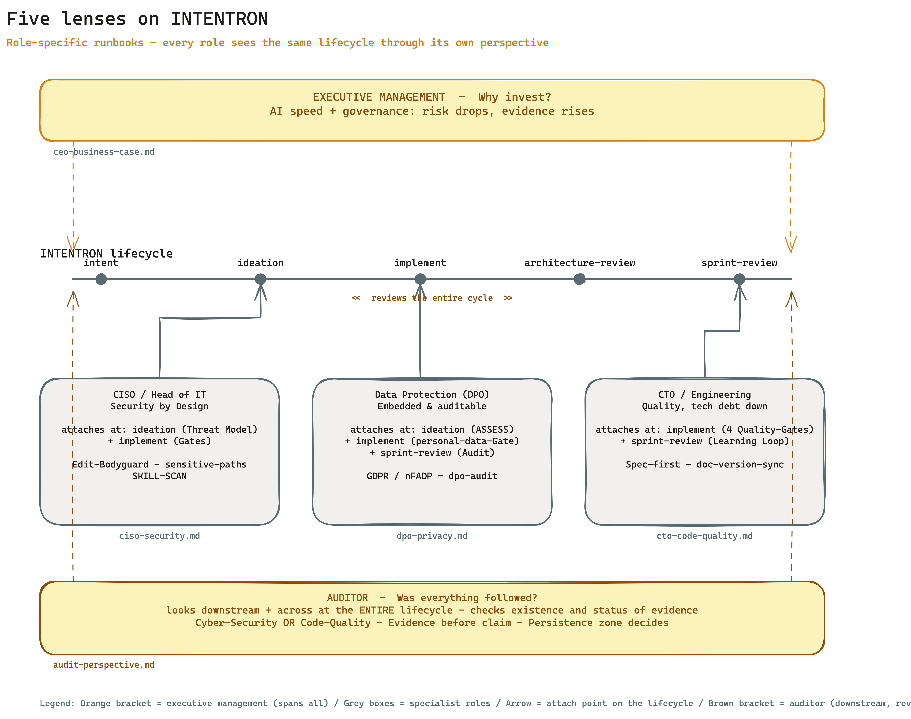
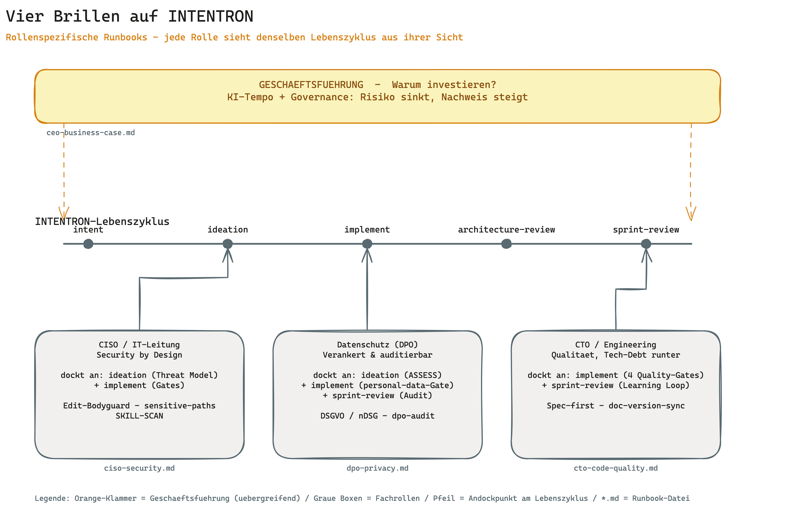

[🇬🇧 English](#english) · [🇩🇪 Deutsch](#deutsch)

---

<a name="english"></a>

# INTENTRON — AI-Driven Development Governance
### by OWLIST

> **License:** Source-available (PolyForm Perimeter 1.0.0) — usable and adaptable for your own projects, **no reselling**. ([details](#license))

> A **battle-tested, tool-neutral governance framework** for AI-assisted development — reference implementation in Claude Code, runs equally with Codex, Cursor and other AI tools. An interview-driven orchestrator plus a coherent set of sub-skills set up a complete AI-driven development governance framework for any new project, covering the full delivery cycle.

**Core idea:** AI writes your code. Governance makes sure you still understand why in six months.

INTENTRON turns the method described in Matthias Schrader's book "Code Crash" into a working operating system for AI-assisted development.

**The name — INTENT + -TRON:** *Intent* is Schrader's core idea — we extend spec-driven development by the layer *above* the spec: every story is aligned to an **intent** (the *why*), not just a specification (the *what*). The *-tron* suffix names a **machine** (cyclotron, magnetron). Together, INTENTRON is **the engine that turns intent into production** — enforced and traceable.

---

## Why INTENTRON? The edge

Most spec-driven frameworks (Spec Kit & co.) optimize exactly one thing: turning a specification into code. Quality, governance, security, privacy, team-readiness — they leave those out. INTENTRON flips the focus: the generated code is not the product, the *path from intent to production* is — with guardrails a team would otherwise have to build itself.

Four things set us apart concretely:

1. **One contract — tool-neutral and machine-executable.** Your rules (tests, logging, security thresholds, governance) live in *one* place and are shared by three readers: the human, the AI tool (Claude, Codex, Cursor) and the CI that enforces them. Others have rules as prose that nobody enforces — and lock you into *one* tool.
2. **Intent before implementation.** We start one step earlier than the spec — at the *why* (after Schrader). That stops the AI from cleanly building the wrong thing.
3. **Governance that scales with you.** Solo gets three gates, an enterprise gets twelve — same record, only the strictness is dialed up or down.
4. **Privacy & security in the bundle.** DPO and security-architect reviews are built in, not an afterthought. For regulated industries that's the entry ticket.

**Common denominator:** Others optimize "the AI writes code." We optimize "a team — human plus *any* AI — gets intent to production, with guardrails it didn't have to build itself." The guardrails are invisible until they catch something — and when they catch, they explain why.

**Faster *and* compliant — vs. plain vibe engineering.** Vibe engineering ships fast, but nobody guarantees the security, privacy and governance rules were followed — that surfaces *later*, in a security review or a data-protection audit, when a CISO/CIO finds non-compliant software months in. INTENTRON puts the rules up front in a machine-executable contract and catches violations *at commit time* (`sensitive-paths` → `review-ok`, `personal-data` → `privacy-ok`, Layer-0 bodyguard) — not in the audit; spec-linkage + `audit-trace.sh` hand the evidence to the auditor proactively (see `docs/runbooks/audit-perspective.md`). The team keeps its speed — inside the guardrails. For regulated work the `heavy` mode dials compliance evidence, mandatory review and branch protection up automatically.

---

## How INTENTRON differs

A methodical comparison against the two closest framework categories — spec-driven (Spec Kit) and harness optimizers (ECC, Everything Claude Code):

| | INTENTRON | Spec Kit (spec-driven) | ECC (harness optimizer) |
|---|---|---|---|
| Focus | Path from intent → production, with gates | Specification → code | Breadth across Claude Code tools |
| Hard gates (blocking) | ✅ Spec, Sensitive-Paths, Coverage, Slopsquatting | ❌ none | ❌ none |
| Intent before spec | ✅ | ❌ | ❌ |
| Governance scales (Solo→Enterprise) | ✅ | ❌ | ❌ |
| Privacy/Security built in | ✅ (DPO + Security-Architect) | ❌ | ❌ |
| Tool-neutral (1 contract) | ✅ AGENTS.md + CONVENTIONS | partial | ❌ (Claude-Code-bound) |

**A different category, not a competitor:** ECC and similar collections are *harness optimizers / tool pools* — breadth across many tools. INTENTRON is a *method with enforced discipline* — depth. Different axes: breadth does not replace gates.

### The full picture — vs. the orchestration frameworks

A dimension-by-dimension comparison against the agent-orchestration tools (an honest read — what others do better is called out below):

| Dimension | **INTENTRON** | CrewAI | AutoGen / AG2 | BMAD | Cursor Rules |
|-----------|---------------|--------|---------------|------|--------------|
| **Governance enforcement** | ✅ Machine-enforced (Git hooks) | ❌ none | ❌ none | ⚠️ manual | ❌ none |
| **Traceability** | ✅ Idea → issue → spec → commit | ❌ | ❌ | ⚠️ partial | ❌ |
| **Human-in-the-loop** | ✅ Enforced (spec sign-off) | ⚠️ optional | ⚠️ optional | ✅ explicit | ❌ |
| **Self-healing** | ✅ Cron, 15 min, auto-corrects | ❌ | ❌ | ❌ | ❌ |
| **Learning loop** | ✅ Outcome check + LEARNINGS.md | ❌ | ❌ | ❌ | ❌ |
| **Model routing** | ✅ Opus/Sonnet/Haiku per task type | ⚠️ configurable | ✅ good | ❌ | ❌ |
| **Multi-agent orchestration** | ✅ Agent teams + parallel subagents | ✅ strong | ✅ very strong | ⚠️ manual | ❌ |
| **Deploy automation** | ⚠️ partial (Git push + manual) | ❌ | ❌ | ❌ | ❌ |
| **Portability** | ✅ Zero dependencies, 1 folder | ⚠️ pip install | ⚠️ pip install | ⚠️ prompt files | ✅ |
| **Project setup time** | ~30 min (guided) | hours | hours | ~1h | minutes |
| **Target audience** | Solo dev → enterprise team | Enterprise teams | Research / quality | Agile teams | Individual devs |

**Where others are genuinely stronger** — and when to prefer them:

| Framework | Real strength | When to prefer it |
|-----------|---------------|-------------------|
| **CrewAI** | Scalable role-based crews for enterprise — used by 60% of the Fortune 500. Best choice when coordinating >10 agents. | Large team, many parallel workflows, enterprise compliance requirements |
| **AutoGen / AG2** | Debate pattern: two agents argue against each other toward the best solution. Highest output quality for complex analysis tasks. | Research, code review with the highest quality bar, offline batch processes |
| **BMAD** | Structured agile workflow with clear roles (PM, Architect, Developer). Well documented, large community. | Teams already on Scrum/Agile that want an AI-native workflow |
| **Cursor Rules** | Ready to use instantly, zero setup time, right in the editor. | Individual devs who want to start fast without governance overhead |

*(Bootstrap's [README](bootstrap/README.md#framework-vergleich) adds the onboarding view: what makes INTENTRON unique and when to choose it.)*


*The full landscape on two axes: spec-driven, harness optimizers and orchestration frameworks all cluster on breadth/low enforcement; INTENTRON alone holds the governance zone — enforced discipline from intent to production, scaling solo → enterprise.*

---

## What Is This?

`intentron/` is a tool-neutral container of skills — implemented for Claude Code as the reference runtime and portable to Codex, Cursor and other AI tools (see [CONVENTIONS.md](CONVENTIONS.md) + HANDBUCH Appendix K) — that form one coherent development workflow:

- **The orchestrator** (`bootstrap/`) interviews you about a new project and scaffolds the full governance framework: runtime instructions, documentation SSoT, Developer Onboarding, backlog adapter, Git hooks, skill selection, optional learning-loop.
- **Sub-skills** (`ideation/`, `implement/`, etc.) cover the downstream delivery workflow — from idea to sprint review.
- **Specialist bundle skills** (`security-architect/`, `dpo/`) live **inside the framework repo** (vendored, since BOO-74) so a single `git clone` is self-contained. Bootstrap installs them from here.
- **Companion skills** (`../research/`, `../skill-creator/`, etc.) are referenced by the governance flow but maintained as stand-alone skills at `claudecodeskills/` top level.

Full setup guide: **[HANDBUCH.md](HANDBUCH.md)** (German, ~230 KB) + **[HANDBUCH.en.md](HANDBUCH.en.md)** (English, ~200 KB) — appendices A–AC cover Hermes, sprint sizing, Codex onboarding (J), tool adapters (K), token efficiency (N), privacy (O), deployment scenarios (P), sovereignty stack (Q), multi-operator coordination (R), skill-installation strategy (S), post-install verification (T), multi-project operation (U), Layer-0 Edit-Bodyguard (V), Contribute-Back loop (W), CONTEXT.md / Ubiquitous Language (X), the VPS/cloud team runbook (Y), customer onboarding / the artifact & sign-off map (Z), SonarCloud setup runbook (AA), Linear-MCP on a headless VPS (AB) and knowledge-onboarding for existing docs (AC).

**What's new (latest: v0.9.0):** the full history lives in **[docs/releases/](docs/releases/)** — every version has a bilingual GitHub Release. Highlights since v0.6: enterprise readiness & **EU AI Act** opt-in (v0.7.0–v0.7.2), end-to-end compliance mechanism + sketch (v0.7.3–v0.7.4), the customer-onboarding **[artifact & sign-off map](docs/onboarding/artefakt-landkarte.md)** that links every artifact to its sign-off role and rule sink (v0.7.5), and full DE/EN documentation parity — every skill README and every sketch in both languages (v0.7.6–v0.7.7). Newest waves (2026-06-03, post-v0.7.7): **Wave AW** (BOO-130–136) — consolidated `docs/how-we-document.md` + plain-language glossary, GitHub Issues as recommended backlog default, Linear-MCP-on-VPS runbook (Appendix AB), canonical `DEVELOPER_ONBOARDING.md` filename, GitHub Pro/Team note for branch protection, SECURITY.md next-step via `security-architect`; and **Wave AX** (BOO-137) — new bundle skill **`knowledge-onboarding`** that routes existing project docs deterministically into the framework artefacts (routing rubric SSoT + manifest with pinning + anti-fabrication coverage check, Appendix AC); and **Wave BA** (BOO-140–143) — Next.js first-CI-run hardening: Semgrep without container + `upload-sarif@v4`, perf gate skips on an empty baseline, ESLint frontend globals (`React`/browser) for TSX, and `package.json` `lint` rewritten to `eslint .`; and **Wave BB** (BOO-146–149, v0.9.0) — CI-hardening gaps: explicit `permissions` block in the semgrep/eslint/ruff templates so `upload-sarif` survives a hardened `GITHUB_TOKEN`, an `/implement` remote-CI loop (`gh run watch` after push), a `CLAUDE.md` project-type marker (active vs governance-reference), and branch-protection review-count lowered 1→0 for the solo/agent flow. Earlier waves (v0.2–v0.5): privacy-by-design, deployment scenarios, sovereignty stack, multi-operator coordination, Layer-0 Edit-Bodyguard, dpo control catalogue, CONTEXT.md ubiquitous language.

**Tool-neutral specification:** [CONVENTIONS.md](CONVENTIONS.md) — describes the framework conventions without binding to a specific AI tool. Read this first when adopting the framework with Codex, Cursor, or any other tool (see HANDBUCH Appendix K).

**Project handover by design:** every bootstrap now chooses a project documentation SSoT: Obsidian Vault, repo `docs/project/`, external DMS, or an explicit repo fallback. It also creates or links a `Developer Onboarding` artifact so an unfamiliar team or another coding tool can take over the project without relying on old chat history.

---

## Quickstart

Three ways to get INTENTRON into your AI coding tool. The framework repo is **public** and `bootstrap/` sits at the repo root — so the bootstrap skill is a single `git clone` away. The `/bootstrap` skill then sets up your project and pulls every other skill it needs.

> **⚠ Rolling this out at a customer?** Before `/bootstrap`, have the three onboarding checklists ready — start with **[`bootstrap-prep.md`](docs/onboarding/bootstrap-prep.md)**: the questions that make the setup run cleanly. Full guide: **[Onboarding a customer](#onboarding-a-customer--the-three-checklists)** below.

### A) Manual install, then `/bootstrap`

```bash
mkdir -p ~/.claude/skills
cd /tmp
git clone --filter=blob:none --sparse https://github.com/vibercoder79/intentron.git intentron
cd intentron && git sparse-checkout set bootstrap
cp -r bootstrap ~/.claude/skills/
cd /tmp && rm -rf intentron
ls ~/.claude/skills/bootstrap/   # should show SKILL.md + references/
```

Then open Claude Code in your project folder and run `/bootstrap`. (Restart the session once so the freshly copied skill is registered as a slash command.) Full step-by-step: **[HANDBUCH §4](HANDBUCH.md)**.

### B) AI self-install (let the tool do it)

Claude Code has shell access, so it can install itself. Paste this into a session opened in an empty project folder:

> Clone the public repo https://github.com/vibercoder79/intentron, copy its `bootstrap/` folder into `~/.claude/skills/bootstrap/` (create the directory if needed), confirm `~/.claude/skills/bootstrap/SKILL.md` exists, then read that SKILL.md and follow it to bootstrap this project.

(Having the AI read `SKILL.md` directly means you don't have to restart the session to register the `/bootstrap` command first.)

### C) AI self-update for an old / brownfield install

For an existing repo that still runs an older INTENTRON version, the safe upgrade follows **[`bootstrap/references/framework-upgrade.md`](bootstrap/references/framework-upgrade.md)** (step-by-step copy-paste runbook: **[`docs/runbooks/framework-update.md`](docs/runbooks/framework-update.md)**; see also **[HANDBUCH](HANDBUCH.md)** §"Upgrade path for existing projects") — it never overwrites local decisions blindly, in three stages:

1. **`inspect`** — read the current project state, diff it against the new version, show risks and manual TODOs. Writes nothing.
2. **`apply-safe`** — apply only additive/idempotent changes (new templates, missing sections); existing content stays.
3. **`apply-with-confirmation`** — anything that changes existing rules, hooks, CI or skill versions is confirmed per change. `.env`/secrets are never touched.

One-shot prompt — paste into Claude Code opened in the old repo:

> This repo may run an older INTENTRON version. Upgrade it safely following `bootstrap/references/framework-upgrade.md` (modes inspect → apply-safe → apply-with-confirmation). (1) **inspect**: read the current project contract (`CONVENTIONS.md`, `CLAUDE.md`/`AGENTS.md`, `.claude/environment.json`, hooks, specs), fetch the current framework from https://github.com/vibercoder79/intentron, read `docs/releases/` for what changed, and show me a diff + risks + manual TODOs without writing anything. (2) **apply-safe**: apply only additive/idempotent changes and run the relevant `bootstrap/scripts/migrate-to-v2.sh --issue BOO-NN` migrations. (3) **apply-with-confirmation**: for anything that changes existing rules, hooks, CI or skill versions, ask me per change. Never touch `.env`/secrets. Finally run `bootstrap/references/verify-setup.sh` and write an upgrade report to `journal/reports/framework-upgrade/YYYY-MM-DD.md`.

> [!note]
> Same outcome, different entry point: **A** is the explicit/auditable path, **B** is the fastest cold start, **C** lifts an existing install to the current version. The migrations and `verify-setup.sh` are idempotent — safe to re-run.

---

## Why the method comes from "Code Crash" (and how to read this)

The thinking behind INTENTRON comes from **Matthias Schrader's book "Code Crash"**. Schrader's thesis, in one line: AI now writes the code, so the scarce resource is no longer typing speed — it is **intent, governance and the ability to still understand a system months later**. INTENTRON is our attempt to turn that thesis into a working *operating system* for AI-assisted development: skills, gates and artifacts that keep the "why" alive while the AI handles the "how".

- **You do not need to have read the book.** The framework and HANDBUCH are written to stand on their own — every concept is explained where it is used.
- **But we recommend it** for the deeper context. The HANDBUCH references Schrader throughout (anti-patterns, production-readiness, the 4P pipeline), and **Appendix M ("Schrader Decoder")** maps the book's chapters onto the concrete framework pieces.
- If you only read one thing first: this README, then [HANDBUCH.en.md](HANDBUCH.en.md) §1–§8.

## Not a one-size-fits-all framework

INTENTRON gives you a **solid base structure** — but every company, team and setup is different, and we deliberately **do not try to model every case** in the framework itself. The framework stays lightweight; the **HANDBUCH appendices provide guidance for different circumstances** so you can adapt it to your reality:

| Your situation | Where the guidance is |
|----------------|-----------------------|
| Solo vs. VPS vs. team-server | Appendix P (deployment scenarios) |
| Team of 5–20+ developers | Appendix R (multi-operator coordination) |
| Where do skills/tools/hooks live | Appendix S (installation strategy) |
| Several projects on one machine | Appendix U (multi-project operation) |
| EU / regulated industry | Appendix Q (sovereignty stack) + Appendix O (privacy) |
| "Did my setup actually work?" | Appendix T (post-install verification) |
| Running under Codex / another AI tool | Appendix J (Codex onboarding) + Appendix K (tool adapters) |

The framework is the skeleton. **You tailor the muscles** — the appendices tell you how, and a real consumer fork (e.g. a GitHub-Issues + personal-vault setup) shows it works in practice.

---

## System Overview


*From empty folder to governance-ready project — four interview blocks (A–D) frame the decisions, four setup phases (0, 4, 5, 7) execute them. Block D spins up optional components only on demand.*

---

## The Skills

### Orchestrator + Sub-Skills (this folder)

| Skill | Command | What it does |
|-------|---------|-------------|
| **[bootstrap](bootstrap/)** | `/bootstrap` | **Start here.** Interview-driven project setup — CLAUDE.md, Linear, Git hooks, skill selection. |
| **[intent](intent/)** | `/intent` | Captures the *why* before the spec — Perceive questions + 8-pattern anti-pattern self-check. Runs before `/ideation`. |
| **[ideation](ideation/)** | `/ideation` | Idea → 4-perspective research → Linear issue with acceptance criteria. |
| **[backlog](backlog/)** | `/backlog` | Sprint planning — which story now, which later, and why. Dependency-aware. |
| **[implement](implement/)** | `/implement` | 8-step protocol: Agent pattern → Spec → Code → Governance validation → Commit. |
| **[sprint-run](sprint-run/)** | `/sprint-run` | Sprint orchestrator — runs a whole sprint automatically: picks stories, runs `/implement` per story (worktree + branch), waits for green CI, merges, triggers `/sprint-review` at the 80% token boundary. |
| **[architecture-review](architecture-review/)** | `/architecture-review` | Reviews architecture dimensions — risks, tech debt, improvement potential. |
| **[knowledge-onboarding](knowledge-onboarding/)** | `/knowledge-onboarding` | Routes existing project docs (GAP analyses, legal research, README/PLAN, design files, demo storyboards, handover, prompts) deterministically into the framework artefacts via routing rubric (SSoT, Tier 0/1/2/3) + persisted manifest with pinning. Post-bootstrap. |
| **[sprint-review](sprint-review/)** | `/sprint-review` | Quarterly audit: architecture health, tech debt, backlog hygiene, learning loop. |
| **[pitch](pitch/)** | `/pitch` | Closes the 4P pipeline — gathers evidence (metrics, architecture diff, intent fulfillment) as a Markdown cheat sheet. No slides, human runs the demo. |
| **[grafana](grafana/)** | `/grafana` | Grafana Cloud dashboards via MCP — panels, PromQL, alert rules. |
| **[cloud-system-engineer](cloud-system-engineer/)** | `/cloud-system-engineer` | VPS/Docker infrastructure: health checks, firewall, DNS, resources. |
| **[visualize](visualize/)** | `/visualize` | Generate architecture diagrams in Miro from existing documentation. |

### Specialist bundle skills (this folder, vendored — BOO-74)

| Skill | Command | What it does |
|-------|---------|-------------|
| **[security-architect](security-architect/)** | `/security-architect` | STRIDE threat modeling, OWASP Top 10, ASVS 5.0 — 4 modes (Design/Review/Audit/Skill-Scan). Installed by bootstrap when the security dimension is active. |
| **[dpo](dpo/)** | `/dpo` | Data Protection Officer — privacy by design (GDPR/BDSG/nDSG). 3 modes (Assess/Review/Audit). Versioned control catalogue (GDPR + nDSG controls as Git-tracked YAML, deterministic runner, PASS/GAP/REVIEW-NEEDED report — BOO-87). Installed by the bootstrap Privacy add-on (BOO-69). |

*Master of these two stays in `claudecodeskills/` (via `publish_skill.py`); the framework repo holds a vendored mirror so a single clone is self-contained.*

### Top-level companion skills (parent folder)

| Skill | Command | What it does |
|-------|---------|-------------|
| **[research](../research/)** | `/research` | 2-tier routing: Quick (WebSearch) or Deep (Perplexity + cross-check). |
| **[skill-creator](../skill-creator/)** | `/skill-creator` | Create, package and register new skills into the global registry. |
| **[design-md-generator](../design-md-generator/)** | `/design-md-generator` | Extract a website's visual design system into a machine-readable DESIGN.md. |
| **[setup-checklist](../setup-checklist/)** | `/setup-checklist` | Claude Code best-practice audit — global and project settings. |

---

## How the Skills Work Together

```
💡 Idea
  └─ /ideation ──→ Linear issue + ACs (4 perspectives, research-backed)
       └─ /backlog ──→ Prioritization: which story goes next?
            └─ /implement ──→ Spec file → Code → Governance validation → Commit
                 └─ /architecture-review ──→ Risks? Tech debt?
                      └─ /sprint-review ──→ Quarterly audit: what worked?
                           └─ /pitch ──→ Evidence briefing for the stakeholder demo
```

Governance gates run automatically on `git commit` / `git push` (and `git pull`):
- `spec-gate.sh` — blocks commits without a linked spec file
- `doc-version-sync.sh` — blocks pushes when documentation is out of sync
- `sensitive-paths` gate (BOO-18) — stops at security-sensitive paths until `review-ok`
- `personal-data-paths` gate (BOO-69) — stops at personal-data paths until `privacy-ok`
- `post-merge` vault-harvest hook (BOO-77, opt-in) — mirrors selected docs into a personal vault after `git pull`

No spec, no commit. That's the difference between a prompt and a governance framework.

> **Operating at scale:** running on a VPS, a team, or in a regulated industry? HANDBUCH appendices **P** (deployment scenarios), **R** (multi-operator coordination, 5–20+ operators), **S** (where do skills/tools/hooks belong) and **Q** (EU-sovereignty stack) cover the setup decisions; appendix **O** documents privacy-by-design.

---

## Where to Start

| Situation | Recommendation |
|-----------|---------------|
| New project, empty folder | → [/bootstrap](bootstrap/) — start here |
| Existing project, needs structure | → [HANDBUCH.md §4](HANDBUCH.md) — step-by-step retrofit |
| Just one specific skill | → Clone the skill folder and install it |
| Want to understand everything first | → [HANDBUCH.md](HANDBUCH.md) — full reference |
| Rolling out at a customer | → [docs/onboarding/](docs/onboarding/) — the three checklists (start here) |
| Concrete operational question | → [docs/qa.md](docs/qa.md) — living Q&A |

---

## Role-specific runbooks — read the framework through your lens

Different leadership roles care about different things. These runbooks explain INTENTRON from one role's point of view — what the framework means for *you*, which gatekeepers apply, which artefacts and skills are relevant, and where you take control. Each reads in under 10 minutes and is not new machinery — it is a lens on what the framework already does.



| Role | Runbook | The question it answers |
|---|---|---|
| **Managing director / decision-maker** | [`ceo-business-case.md`](docs/runbooks/ceo-business-case.md) | Why invest in this framework — which business risk does it lower? |
| **CISO / IT lead** | [`ciso-security.md`](docs/runbooks/ciso-security.md) | Which security gatekeepers apply, and how is security-by-design enforced? |
| **Data protection officer** | [`dpo-privacy.md`](docs/runbooks/dpo-privacy.md) | Where is privacy anchored, and how is it auditable (GDPR/BDSG/nDSG)? |
| **CTO / head of engineering** | [`cto-code-quality.md`](docs/runbooks/cto-code-quality.md) | How is code quality kept and technical debt avoided? |

Each runbook has an English `.en.md` sibling. For the auditor's checklist (question → proof → place), see [`audit-perspective.md`](docs/runbooks/audit-perspective.md).

---

## Onboarding a customer — the three checklists

Installing INTENTRON at a customer needs information that the generic bootstrap cannot pre-ask. The [`docs/onboarding/`](docs/onboarding/) folder holds three checklists — work them in order:

| # | Checklist | Question | Audience |
|---|-----------|----------|----------|
| 1 | [`bootstrap-prep.md`](docs/onboarding/bootstrap-prep.md) | **What do you want to build, and in which environment?** Basic questions answered up front, before the ~15-min setup call. | Business / management / IT |
| 2 | [`integration-discovery.md`](docs/onboarding/integration-discovery.md) | **How does the solution integrate into your live systems?** CI/CD, interfaces, network, secrets, compliance, go-live. | Customer IT |
| 3 | [`artefakt-landkarte.md`](docs/onboarding/artefakt-landkarte.md) | **Which artifacts exist, what purpose each serves, which stakeholders you must talk to, and where the resulting rules go?** The bridge that turns customer specifications into framework rules. | Operator + all sign-off roles |

Checklists 1 and 2 gather input. Checklist 3 is the planning and sign-off layer: it maps every framework artifact to the customer-side role that reconciles it and to the rule sink where the resulting rule is stored — so an autonomous team can later develop in a compliant way on its own. Each document has an English `.en.md` sibling.

---

## Complementary tooling — machine setup

Before you `/bootstrap` a project, the **machine/instance** itself benefits from a best-practice Claude Code setup (effort level, sandboxing, permission modes, MCP, a global `CLAUDE.md`). That is **not** part of this framework — it lives in a separate, standalone tool:

**→ [claude-code-setup-checklist](https://github.com/vibercoder79/claude-code-setup-checklist)** — an interactive best-practice setup checklist for Claude Code (Opus 4.8).

The two are complementary and operate at different layers. Recommended order on a fresh cloud / Claude Code instance:

1. **`setup-checklist global`** — machine best practice (effort, sandbox, permission modes, MCP, global `CLAUDE.md`).
2. **`/bootstrap`** (this framework) — project governance. Bootstrap **owns** the project `CLAUDE.md`, `CONVENTIONS.md`, governance hooks, and `.claude/environment.json`.
3. **Optional `setup-checklist audit`** (or `projekt` additively) for what bootstrap does not provide — `.claudeignore`, `.gitignore` hygiene, `CLAUDE.local.md`. Do **not** re-create the project `CLAUDE.md` or the guard hook there; bootstrap owns those (its Layer-0 bodyguard is active).

**Rule of thumb:** machine + hygiene → the checklist · project governance files → `/bootstrap`. No file is owned twice.

---

## Prerequisites

- **An AI coding tool** — Claude Code (CLI/IDE, reference implementation) or Codex, Cursor & co. (see HANDBUCH Appendix K)
- **Backlog system** — Linear (recommended) / Microsoft 365 Planner / GitHub Issues / none
- **GitHub** repository for your project
- **Project documentation SSoT** — Obsidian Vault, repo `docs/project/`, external DMS, or temporary repo fallback
- Optional extensions: Grafana Cloud, Miro, Hostinger VPS — skills use what's available

---

## License

This project is **source-available** under the [PolyForm Perimeter License 1.0.0](LICENSE.md). Use, modification, and internal deployment — including commercial use — are permitted. You may **not** provide a product that competes with this software (no reselling as a competing product). **INTENTRON** and **OWLIST** are trademarks of OWLIST GmbH; this license grants no trademark rights.

---

<sub>"INTENTRON" is an independent product of OWLIST GmbH and has no business relationship with Matthias Schrader or the publisher of the book "Code Crash". The methodology is based on the principles described in the book "Code Crash"; "Code Crash" is the title of that book. All names mentioned are trademarks of their respective owners.</sub>

---


<a name="deutsch"></a>

# INTENTRON — Governance für KI-gestützte Entwicklung
### by OWLIST

> **Lizenz:** Source-available (PolyForm Perimeter 1.0.0) — nutzbar und anpassbar für eigene Projekte, **kein Weiterverkauf**. ([Details](#lizenz))

> Ein **battle-tested, tool-neutrales Governance-Framework** für KI-gestützte Entwicklung — Referenz-Implementierung in Claude Code, läuft genauso mit Codex, Cursor und anderen KI-Tools. Ein interview-geführter Orchestrator plus kohärente Sub-Skills setzen ein vollständiges KI-getriebenes Governance-Framework für jedes neue Projekt auf und decken den kompletten Delivery-Zyklus ab.

**Kernidee:** KI schreibt deinen Code. Governance stellt sicher, dass du in 6 Monaten noch weißt warum.

INTENTRON setzt die im Buch »Code Crash« von Matthias Schrader beschriebene Methode in ein funktionierendes Betriebssystem für KI-gestützte Entwicklung um.

**Der Name — INTENT + -TRON:** *Intent* ist Schraders Kernbegriff — wir erweitern Spec-Driven Development um die Ebene *über* der Spec: Jede Story ist auf einen **Intent** ausgerichtet (das *Warum*), nicht nur auf eine Spezifikation (das *Was*). Die Endung *-tron* benennt eine **Maschine** (Zyklotron, Magnetron). Zusammen ist INTENTRON **die Engine, die Intent in Produktion überführt** — erzwungen und nachvollziehbar.

---

## Warum INTENTRON? Der Vorteil

Die meisten Spec-Driven-Frameworks (Spec Kit & Co.) optimieren genau eine Sache: aus einer Spezifikation Code generieren. Qualität, Governance, Sicherheit, Datenschutz, Teamfähigkeit blenden sie aus. INTENTRON dreht den Fokus: Nicht der generierte Code ist das Produkt, sondern der *Weg von der Absicht zur Produktion* — mit Leitplanken, die ein Team sonst selbst bauen müsste.

Vier Dinge unterscheiden uns konkret:

1. **Ein Vertrag — tool-neutral und maschinen-ausführbar.** Eure Regeln (Tests, Logging, Security-Schwellen, Governance) leben an *einer* Stelle und werden von drei Lesern geteilt: dem Menschen, dem KI-Tool (Claude, Codex, Cursor) und der CI, die sie erzwingt. Andere haben Regeln als Prosa, die niemand durchsetzt — und binden dich an *ein* Tool.
2. **Intent vor Implementation.** Wir starten eine Stufe früher als die Spec — beim *Warum* (nach Schrader). Das verhindert, dass die KI sauber das Falsche baut.
3. **Governance, die mitwächst.** Solo bekommt drei Gates, ein Konzern zwölf — dieselbe Platte, nur die Strenge wird gedimmt.
4. **Privacy & Security im Bündel.** DPO- und Security-Architect-Prüfungen sind eingebaut, kein Nachgedanke. Für regulierte Branchen ist das die Eintrittskarte.

**Gemeinsamer Nenner:** Andere optimieren „die KI schreibt Code". Wir optimieren „ein Team — Mensch plus *beliebige* KI — bringt Intent nach Produktion, mit Leitplanken, die es nicht selbst bauen musste." Die Leitplanken sind unsichtbar, bis sie etwas fangen — und wenn sie fangen, erklären sie warum.

**Schneller *und* compliant — gegenüber reinem Vibe Engineering.** Vibe Engineering liefert schnell Code, aber niemand garantiert, dass Security-, Datenschutz- und Governance-Regeln eingehalten wurden — das fällt *nachgelagert* auf: im Security-Review oder Datenschutz-Audit, wenn ein CISO/CIO Monate später non-compliant Software findet. INTENTRON legt die Regeln vorab in einen maschinen-ausführbaren Vertrag und fängt Verstöße *im Commit* (`sensitive-paths` → `review-ok`, `personal-data` → `privacy-ok`, Layer-0-Bodyguard) — nicht erst im Audit; Spec-Linkage + `audit-trace.sh` liefern dem Auditor den Nachweis proaktiv (siehe `docs/runbooks/audit-perspective.md`). Das Team behält sein Tempo — innerhalb der Leitplanken. Bei regulierter Arbeit zieht der `heavy`-Modus Compliance-Evidenz, Mandatory Review und Branch-Protection automatisch hoch.

---

## Wie sich INTENTRON unterscheidet

Ein methodischer Vergleich mit den zwei nächstliegenden Framework-Kategorien — Spec-Driven (Spec Kit) und Harness-Optimierer (ECC, Everything Claude Code):

| | INTENTRON | Spec Kit (Spec-Driven) | ECC (Harness-Optimierer) |
|---|---|---|---|
| Fokus | Weg von Intent → Produktion, mit Gates | Spezifikation → Code | Breite über Claude-Code-Tools |
| Hard Gates (blockierend) | ✅ Spec, Sensitive-Paths, Coverage, Slopsquatting | ❌ keine | ❌ keine |
| Intent vor Spec | ✅ | ❌ | ❌ |
| Governance skaliert (Solo→Konzern) | ✅ | ❌ | ❌ |
| Privacy/Security eingebaut | ✅ (DPO + Security-Architect) | ❌ | ❌ |
| Tool-neutral (1 Vertrag) | ✅ AGENTS.md + CONVENTIONS | teilweise | ❌ (Claude-Code-gebunden) |

**Eine andere Kategorie, kein Wettbewerber:** ECC und ähnliche Sammlungen sind *Harness-Optimierer / Werkzeug-Pools* (Breite über viele Tools). INTENTRON ist eine *Methode mit erzwungener Disziplin* (Tiefe). Verschiedene Achsen — Breite ersetzt keine Gates.

### Das volle Bild — vs. die Orchestrierungs-Frameworks

Ein Dimension-für-Dimension-Vergleich gegen die Agent-Orchestrierungs-Tools (ehrlich gelesen — was andere besser machen, steht direkt darunter):

| Dimension | **INTENTRON** | CrewAI | AutoGen / AG2 | BMAD | Cursor Rules |
|-----------|---------------|--------|---------------|------|--------------|
| **Governance-Enforcement** | ✅ Maschinell erzwungen (Git Hooks) | ❌ Keine | ❌ Keine | ⚠️ Manuell | ❌ Keine |
| **Traceability** | ✅ Idee → Issue → Spec → Commit | ❌ | ❌ | ⚠️ Partiell | ❌ |
| **Human-in-the-Loop** | ✅ Erzwungen (Spec-Freigabe) | ⚠️ Optional | ⚠️ Optional | ✅ Explizit | ❌ |
| **Self-Healing** | ✅ Cron, 15 Min, auto-korrigiert | ❌ | ❌ | ❌ | ❌ |
| **Learning-Loop** | ✅ Outcome-Check + LEARNINGS.md | ❌ | ❌ | ❌ | ❌ |
| **Modell-Routing** | ✅ Opus/Sonnet/Haiku je Task-Typ | ⚠️ Konfigurierbar | ✅ Gut | ❌ | ❌ |
| **Multi-Agent Orchestrierung** | ✅ Agent-Teams + Parallel-Subagents | ✅ Stark | ✅ Sehr stark | ⚠️ Manuell | ❌ |
| **Deploy-Automation** | ⚠️ Teilweise (Git Push + Manual) | ❌ | ❌ | ❌ | ❌ |
| **Portabilität** | ✅ Zero Dependencies, 1 Ordner | ⚠️ pip install | ⚠️ pip install | ⚠️ Prompt-Files | ✅ |
| **Projekt-Setup-Zeit** | ~30 Min (geführt) | Stunden | Stunden | ~1h | Minuten |
| **Zielgruppe** | Solo-Dev → Enterprise-Team | Enterprise-Teams | Forschung / Quality | Agile Teams | Einzelentwickler |

**Was andere Frameworks besser machen** — und wann du sie bevorzugen solltest:

| Framework | Echte Stärke | Wann bevorzugen |
|-----------|--------------|-----------------|
| **CrewAI** | Skalierbare Role-based Crews für Enterprise — 60% der Fortune 500 nutzen es. Beste Wahl wenn >10 Agents koordiniert werden müssen. | Großes Team, viele parallele Workflows, Enterprise-Compliance-Anforderungen |
| **AutoGen / AG2** | Debate-Pattern: 2 Agents argumentieren gegeneinander bis zur besten Lösung. Höchste Ausgabequalität für komplexe Analyse-Aufgaben. | Forschung, Code-Review mit höchsten Qualitätsanforderungen, offline Batch-Prozesse |
| **BMAD** | Strukturierter Agile-Workflow mit klaren Rollen (PM, Architect, Developer). Gut dokumentiert, große Community. | Teams die Scrum/Agile bereits kennen und einen AI-nativen Workflow wollen |
| **Cursor Rules** | Sofort einsatzbereit, keine Setup-Zeit, direkt im Editor. | Einzelentwickler die schnell starten wollen ohne Governance-Overhead |

*(Die bootstrap-[README](bootstrap/README.md#framework-vergleich) ergänzt die Onboarding-Sicht: was INTENTRON einzigartig macht und wann du es wählen solltest.)*


*Die volle Landschaft auf zwei Achsen: Spec-Driven, Harness-Optimierer und Orchestrierungs-Frameworks clustern alle bei Breite/wenig Erzwingung; nur INTENTRON hält die Governance-Zone — erzwungene Disziplin von Intent bis Produktion, skaliert Solo → Enterprise.*

---

## Was ist das hier?

`intentron/` ist ein tool-neutraler Container von Skills — implementiert für Claude Code als Referenz-Runtime und portierbar auf Codex, Cursor und andere KI-Tools (siehe [CONVENTIONS.md](CONVENTIONS.md) + HANDBUCH Anhang K) — die zusammen einen kohärenten Entwicklungs-Workflow bilden:

- **Der Orchestrator** (`bootstrap/`) führt das Interview zu einem neuen Projekt und legt das komplette Governance-Framework an: Runtime-Anweisungen, Dokumentations-SSoT, Developer Onboarding, Backlog-Adapter, Git-Hooks, Skill-Auswahl, optionaler Learning-Loop.
- **Sub-Skills** (`ideation/`, `implement/`, etc.) decken den nachgelagerten Delivery-Workflow ab — von der Idee bis zum Sprint-Review.
- **Spezialisten-Bundle-Skills** (`security-architect/`, `dpo/`) liegen **im Framework-Repo selbst** (vendored, seit BOO-74) — ein einziges `git clone` ist self-contained. Bootstrap installiert sie von hier.
- **Companion-Skills** (`../research/`, `../skill-creator/`, etc.) werden vom Governance-Flow referenziert, aber als eigenständige Skills auf Top-Level von `claudecodeskills/` gepflegt.

Komplettes Setup-Handbuch: **[HANDBUCH.md](HANDBUCH.md)** (Deutsch, ~230 KB) + **[HANDBUCH.en.md](HANDBUCH.en.md)** (Englisch, ~200 KB) — Anhaenge A–AC decken Hermes, Sprint-Sizing, Codex-Onboarding (J), Tool-Adapter (K), Token-Effizienz (N), Privacy (O), Deployment-Szenarien (P), Souveraenitaets-Stack (Q), Multi-Operator-Koordination (R), Skill-Installations-Strategie (S), Post-Install-Verifikation (T), Multi-Projekt-Betrieb (U), Layer-0-Edit-Bodyguard (V), Contribute-Back-Schleife (W), CONTEXT.md / Ubiquitous Language (X), das VPS/Cloud-Team-Runbook (Y), Kunden-Onboarding / die Artefakt- & Freigabe-Landkarte (Z), das SonarCloud-Setup-Runbook (AA), Linear-MCP auf headless VPS (AB) und Knowledge-Onboarding fuer Bestands-Doku (AC) ab.

**Was ist neu (aktuell: v0.9.0):** die komplette Historie liegt in **[docs/releases/](docs/releases/)** — jede Version hat ein zweisprachiges GitHub Release. Highlights seit v0.6: Enterprise-Readiness & **EU-AI-Act**-Opt-in (v0.7.0–v0.7.2), durchgaengige Compliance-Mechanik + Sketch (v0.7.3–v0.7.4), die Kunden-Onboarding-**[Artefakt- & Freigabe-Landkarte](docs/onboarding/artefakt-landkarte.md)**, die jedes Artefakt mit Abnehmer-Rolle und Regel-Senke verknuepft (v0.7.5), und volle DE/EN-Doku-Paritaet — jedes Skill-README und jeder Sketch in beiden Sprachen (v0.7.6–v0.7.7). Juengste Wellen (2026-06-03, post-v0.7.7): **Wave AW** (BOO-130–136) — konsolidierter `docs/how-we-document.md` + Klartext-Glossar, GitHub Issues als empfohlener Backlog-Standard, Linear-MCP-auf-VPS-Runbook (Anhang AB), kanonischer `DEVELOPER_ONBOARDING.md`-Dateiname, GitHub-Pro/Team-Hinweis fuer Branch-Protection, SECURITY.md-Next-Step via `security-architect`; sowie **Wave AX** (BOO-137) — neuer Bundle-Skill **`knowledge-onboarding`**, der Bestands-Doku eines Projekts deterministisch in die Framework-Artefakte routet (Routing-Rubrik SSoT + Manifest mit Pinning + Anti-Fabrikations-Coverage-Check, Anhang AC); sowie **Wave BA** (BOO-140–143) — Next.js-Erstlauf-Härtung: Semgrep ohne Container + `upload-sarif@v4`, Perf-Gate skippt bei leerer Baseline, ESLint-Frontend-Globals (`React`/Browser) für TSX, und `package.json`-`lint` auf `eslint .` umgebogen; sowie **Wave BB** (BOO-146–149, v0.9.0) — CI-Hardening-Gaps: expliziter `permissions`-Block in den semgrep/eslint/ruff-Templates, damit `upload-sarif` einen gehärteten `GITHUB_TOKEN` übersteht, ein `/implement`-Remote-CI-Loop (`gh run watch` nach dem Push), ein `CLAUDE.md`-Projekt-Typ-Marker (aktiv vs. Governance-Referenz) und Branch-Protection-Review-Count von 1→0 für den Solo-/Agent-Flow. Fruehere Wellen (v0.2–v0.5): Privacy-by-Design, Deployment-Szenarien, Souveraenitaets-Stack, Multi-Operator-Koordination, Layer-0-Edit-Bodyguard, dpo-Kontrollkatalog, CONTEXT.md Ubiquitous Language.

**Tool-neutrale Spezifikation:** [CONVENTIONS.md](CONVENTIONS.md) — beschreibt die Framework-Konventionen ohne Bindung an ein bestimmtes KI-Tool. Lies das zuerst, wenn du das Framework mit Codex, Cursor oder einem anderen Tool aufnimmst (siehe HANDBUCH Anhang K).

**Uebergabe standardmaessig mitgedacht:** Jeder Bootstrap waehlt jetzt eine Projekt-Dokumentations-SSoT: Obsidian Vault, Repo `docs/project/`, externes DMS oder expliziter Repo-Fallback. Zusaetzlich wird ein `Developer Onboarding` erzeugt oder verlinkt, damit ein fremdes Team oder ein anderes Coding-Tool das Projekt ohne alte Chat-Historie uebernehmen kann.

---

## Schnellstart

Drei Wege, INTENTRON in dein KI-Coding-Tool zu bekommen. Das Framework-Repo ist **public** und `bootstrap/` liegt im Repo-Root — der Bootstrap-Skill ist also ein einziges `git clone` entfernt. Der `/bootstrap`-Skill richtet danach dein Projekt ein und holt alle weiteren Skills, die er braucht.

> **⚠ Beim Kunden ausrollen?** Bevor du `/bootstrap` startest, halte die drei Onboarding-Checklisten bereit — beginne mit **[`bootstrap-prep.md`](docs/onboarding/bootstrap-prep.md)**: die Fragen, damit das Setup sauber durchlaeuft. Vollstaendig: Abschnitt **[Kunden-Onboarding](#kunden-onboarding--die-drei-checklisten)** weiter unten.

### A) Manuell installieren, dann `/bootstrap`

```bash
mkdir -p ~/.claude/skills
cd /tmp
git clone --filter=blob:none --sparse https://github.com/vibercoder79/intentron.git intentron
cd intentron && git sparse-checkout set bootstrap
cp -r bootstrap ~/.claude/skills/
cd /tmp && rm -rf intentron
ls ~/.claude/skills/bootstrap/   # sollte SKILL.md + references/ zeigen
```

Dann Claude Code im Projektordner starten und `/bootstrap` ausführen. (Session einmal neu starten, damit der frisch kopierte Skill als Slash-Command erkannt wird.) Schritt für Schritt: **[HANDBUCH §4](HANDBUCH.md)**.

### B) AI-Self-Install (die KI macht es selbst)

Claude Code hat Shell-Zugriff und kann sich selbst installieren. Diesen Prompt in eine Session in einem leeren Projektordner einfügen:

> Klone das public Repo https://github.com/vibercoder79/intentron, kopiere dessen `bootstrap/`-Ordner nach `~/.claude/skills/bootstrap/` (Verzeichnis ggf. anlegen), prüfe dass `~/.claude/skills/bootstrap/SKILL.md` existiert, lies dann diese SKILL.md und folge ihr, um dieses Projekt zu bootstrappen.

(Wenn die KI `SKILL.md` direkt liest, musst du die Session nicht erst neu starten, damit der `/bootstrap`-Command registriert wird.)

### C) AI-Self-Update für eine alte / Brownfield-Installation

Für ein bestehendes Repo mit älterer INTENTRON-Version folgt das sichere Upgrade **[`bootstrap/references/framework-upgrade.md`](bootstrap/references/framework-upgrade.md)** (Schritt-für-Schritt-Runbook zum Kopieren: **[`docs/runbooks/framework-update.md`](docs/runbooks/framework-update.md)**; siehe auch **[HANDBUCH](HANDBUCH.md)** §„Upgrade-Pfad für bestehende Projekte") — es überschreibt lokale Entscheidungen nie blind, in drei Stufen:

1. **`inspect`** — Ist-Zustand lesen, Diff zur neuen Version, Risiken und manuelle TODOs zeigen. Schreibt nichts.
2. **`apply-safe`** — nur additive/idempotente Änderungen (neue Templates, fehlende Sektionen); Bestehendes bleibt.
3. **`apply-with-confirmation`** — alles, was bestehende Regeln, Hooks, CI oder Skill-Versionen ändert, wird einzeln bestätigt. `.env`/Secrets werden nie angefasst.

Einmal-Prompt — in Claude Code einfügen, geöffnet im alten Repo:

> Dieses Repo fährt evtl. eine ältere INTENTRON-Version. Aktualisiere es sicher nach `bootstrap/references/framework-upgrade.md` (Modi inspect → apply-safe → apply-with-confirmation). (1) **inspect**: lies den Projektvertrag (`CONVENTIONS.md`, `CLAUDE.md`/`AGENTS.md`, `.claude/environment.json`, Hooks, Specs), hole das aktuelle Framework von https://github.com/vibercoder79/intentron, lies `docs/releases/` für die Änderungen, und zeig mir Diff + Risiken + manuelle TODOs, ohne etwas zu schreiben. (2) **apply-safe**: wende nur additive/idempotente Änderungen an und führe die zutreffenden `bootstrap/scripts/migrate-to-v2.sh --issue BOO-NN` Migrationen aus. (3) **apply-with-confirmation**: alles, was bestehende Regeln, Hooks, CI oder Skill-Versionen ändert, einzeln mit mir bestätigen. `.env`/Secrets nie anfassen. Zum Schluss `bootstrap/references/verify-setup.sh` ausführen und einen Upgrade-Report nach `journal/reports/framework-upgrade/YYYY-MM-DD.md` schreiben.

> [!note]
> Gleiches Ergebnis, anderer Einstieg: **A** ist der explizite/auditierbare Weg, **B** der schnellste Kaltstart, **C** hebt eine bestehende Installation auf den aktuellen Stand. Migrationen und `verify-setup.sh` sind idempotent — gefahrlos wiederholbar.

---

## Warum die Methode aus »Code Crash« kommt (und wie man das hier liest)

Der Denkanstoss hinter INTENTRON kommt aus **Matthias Schraders Buch »Code Crash«**. Schraders These in einem Satz: Die KI schreibt jetzt den Code — die knappe Ressource ist nicht mehr Tippgeschwindigkeit, sondern **Intent, Governance und die Faehigkeit, ein System auch in Monaten noch zu verstehen**. INTENTRON ist unser Versuch, diese These in ein funktionierendes *Betriebssystem* fuer KI-gestuetzte Entwicklung zu giessen: Skills, Gates und Artefakte, die das "Warum" am Leben halten, waehrend die KI das "Wie" uebernimmt.

- **Du musst das Buch nicht gelesen haben.** Framework und HANDBUCH stehen fuer sich — jedes Konzept wird dort erklaert, wo es genutzt wird.
- **Wir empfehlen es aber** fuer den tieferen Kontext. Das HANDBUCH nimmt durchgehend Bezug auf Schrader (Anti-Patterns, Production-Readiness, 4P-Pipeline), und **Anhang M ("Schrader-Decoder")** mappt die Buch-Kapitel auf die konkreten Framework-Bausteine.
- Wenn du zuerst nur eines liest: diese README, dann [HANDBUCH.md](HANDBUCH.md) §1–§8.

## Kein One-Size-Fits-All-Framework

INTENTRON gibt dir eine **solide Grundstruktur** — aber jedes Unternehmen, Team und Setup ist anders, und wir versuchen bewusst **nicht, jeden Einzelfall** im Framework selbst abzubilden. Das Framework bleibt leichtgewichtig; die **HANDBUCH-Anhaenge geben Guidance fuer unterschiedliche Gegebenheiten**, damit du es an deine Realitaet anpasst:

| Deine Situation | Wo die Guidance steht |
|-----------------|------------------------|
| Solo vs. VPS vs. Team-Server | Anhang P (Deployment-Szenarien) |
| Team mit 5–20+ Entwicklern | Anhang R (Multi-Operator-Koordination) |
| Wo gehoeren Skills/Tools/Hooks hin | Anhang S (Installations-Strategie) |
| Mehrere Projekte auf einer Maschine | Anhang U (Multi-Projekt-Betrieb) |
| EU / regulierte Branche | Anhang Q (Souveraenitaets-Stack) + Anhang O (Privacy) |
| "Hat mein Setup wirklich funktioniert?" | Anhang T (Post-Install-Verifikation) |
| Betrieb unter Codex / anderem KI-Tool | Anhang J (Codex-Onboarding) + Anhang K (Tool-Adapter) |

Das Framework ist das Skelett. **Die Muskeln schneiderst du** — die Anhaenge zeigen wie, und ein echter Consumer-Fork (z.B. ein GitHub-Issues- + persoenlicher-Vault-Setup) zeigt, dass es in der Praxis traegt.

---

## Das System im Überblick


*Vom leeren Ordner zum governance-ready Projekt — vier Interview-Blöcke (A–D) umrahmen die Entscheidungen, vier Setup-Phasen (0, 4, 5, 7) setzen sie um. Block D aktiviert optionale Komponenten nur auf Wunsch.*

---

## Die Skills

### Orchestrator + Sub-Skills (dieser Ordner)

| Skill | Befehl | Was er tut |
|-------|--------|------------|
| **[bootstrap](bootstrap/)** | `/bootstrap` | **Einstieg:** Interview-geführtes Projekt-Setup — CLAUDE.md, Linear, Git-Hooks, Skill-Auswahl. |
| **[intent](intent/)** | `/intent` | Hält das *Warum* vor der Spec fest — Perceive-Fragen + 8-Pattern-Anti-Pattern-Self-Check. Läuft vor `/ideation`. |
| **[ideation](ideation/)** | `/ideation` | Idee → 4-Perspektiven-Research → Linear Issue mit ACs. |
| **[backlog](backlog/)** | `/backlog` | Sprint Planning — welche Story jetzt, welche nach hinten, warum. Abhängigkeiten-aware. |
| **[implement](implement/)** | `/implement` | 8-Schritte-Protokoll: Agent-Pattern → Spec → Code → Governance-Validation → Commit. |
| **[sprint-run](sprint-run/)** | `/sprint-run` | Sprint-Orchestrator — fährt einen ganzen Sprint automatisch: wählt Stories, setzt jede per `/implement` um (Worktree + Branch), wartet auf grüne CI, merged, triggert am 80%-Token-Boundary `/sprint-review`. |
| **[architecture-review](architecture-review/)** | `/architecture-review` | Prüft Architektur-Dimensionen — Risiken, Tech Debt, Verbesserungspotential. |
| **[knowledge-onboarding](knowledge-onboarding/)** | `/knowledge-onboarding` | Routet Bestands-Doku (GAP-Analysen, Legal-Recherche, README/PLAN, Design-Files, Demo-Storyboards, Handover, Prompts) deterministisch in die Framework-Artefakte via Routing-Rubrik (SSoT, Tier 0/1/2/3) + persistiertes Manifest mit Pinning. Post-Bootstrap. |
| **[sprint-review](sprint-review/)** | `/sprint-review` | Quartals-Audit: Architektur-Gesundheit, Tech Debt, Backlog-Hygiene, Learning-Loop. |
| **[pitch](pitch/)** | `/pitch` | Schliesst die 4P-Pipeline — sammelt Evidenz (Metriken, Architektur-Diff, Intent-Erfuellung) als Markdown-Spickzettel. Keine Slides, Mensch macht die Demo. |
| **[grafana](grafana/)** | `/grafana` | Grafana Cloud Dashboards via MCP — Panels, PromQL, Alert Rules. |
| **[cloud-system-engineer](cloud-system-engineer/)** | `/cloud-system-engineer` | VPS/Docker-Infrastruktur: Health-Check, Firewall, DNS, Ressourcen. |
| **[visualize](visualize/)** | `/visualize` | Architektur-Diagramme in Miro aus bestehenden Doku-Dateien generieren. |

### Spezialisten-Bundle-Skills (dieser Ordner, vendored — BOO-74)

| Skill | Befehl | Was er tut |
|-------|--------|------------|
| **[security-architect](security-architect/)** | `/security-architect` | STRIDE Threat Modeling, OWASP Top 10, ASVS 5.0 — 4 Modi (Design/Review/Audit/Skill-Scan). Wird vom Bootstrap installiert, wenn die Security-Dimension aktiv ist. |
| **[dpo](dpo/)** | `/dpo` | Data Protection Officer — Datenschutz by Design (DSGVO/BDSG/nDSG). 3 Modi (Assess/Review/Audit). Versionierter Kontrollkatalog (DSGVO + nDSG Controls als Git-versionierte YAML, deterministischer Runner, Report mit PASS/GAP/REVIEW-NEEDED — BOO-87). Wird vom Privacy-Add-on des Bootstrap installiert (BOO-69). |

*Master dieser zwei bleibt in `claudecodeskills/` (via `publish_skill.py`); das Framework-Repo haelt einen vendored Mirror, damit ein einziges Clone self-contained ist.*

### Top-Level Companion-Skills (Elternordner)

| Skill | Befehl | Was er tut |
|-------|--------|------------|
| **[research](../research/)** | `/research` | 2-Tier-Routing: Quick (WebSearch) oder Deep (Perplexity + Gegencheck). |
| **[skill-creator](../skill-creator/)** | `/skill-creator` | Neue Skills erstellen, paketieren und in die globale Registry einbinden. |
| **[design-md-generator](../design-md-generator/)** | `/design-md-generator` | Visuelles Design-System einer Website als maschinenlesbare DESIGN.md extrahieren. |
| **[setup-checklist](../setup-checklist/)** | `/setup-checklist` | Claude Code Best-Practice-Audit — globale und projekt-Settings. |

---

## Wie die Skills zusammenspielen

```
💡 Idee
  └─ /ideation ──→ Linear Issue + ACs (4 Perspektiven, Research-backed)
       └─ /backlog ──→ Priorisierung: welche Story jetzt?
            └─ /implement ──→ Spec-File → Code → Governance-Validation → Commit
                 └─ /architecture-review ──→ Risiken? Tech Debt?
                      └─ /sprint-review ──→ Quartals-Audit: Was hat funktioniert?
                           └─ /pitch ──→ Evidenz-Briefing fuer den Stakeholder-Demo
```

Governance-Gates laufen automatisch bei `git commit` / `git push` (und `git pull`):
- `spec-gate.sh` — blockiert Commits ohne verknüpftes Spec-File
- `doc-version-sync.sh` — blockiert Pushes wenn Doku veraltet ist
- `sensitive-paths`-Gate (BOO-18) — stoppt bei security-sensitiven Pfaden bis `review-ok`
- `personal-data-paths`-Gate (BOO-69) — stoppt bei personenbezogenen Pfaden bis `privacy-ok`
- `post-merge`-Vault-Harvest-Hook (BOO-77, opt-in) — spiegelt ausgewaehlte Docs nach `git pull` in einen persoenlichen Vault

Kein Spec, kein Commit. Das ist der Unterschied zwischen einem Prompt und einem Governance-Framework.

> **Im Team / auf VPS / reguliert?** HANDBUCH-Anhaenge **P** (Deployment-Szenarien), **R** (Multi-Operator-Koordination, 5–20+ Operatoren), **S** (wo gehoeren Skills/Tools/Hooks hin) und **Q** (EU-Souveraenitaets-Stack) decken die Setup-Entscheidungen ab; Anhang **O** dokumentiert Privacy-by-Design.

---

## Wo anfangen?

| Situation | Empfehlung |
|-----------|------------|
| Neues Projekt, leerer Ordner | → [/bootstrap](bootstrap/) |
| Bestehendes Projekt, Chaos | → [HANDBUCH.md §4](HANDBUCH.md) |
| Nur einzelne Skills | → Gewünschten Skill-Ordner klonen und installieren |
| Alles verstehen bevor ich anfange | → [HANDBUCH.md](HANDBUCH.md) |
| Beim Kunden ausrollen | → [docs/onboarding/](docs/onboarding/) — die drei Checklisten (hier starten) |
| Konkrete Praxisfrage | → [docs/qa.md](docs/qa.md) — lebendes Q&A |

---

## Rollenspezifische Runbooks — das Framework durch Ihre Brille

Verschiedene Führungsrollen haben verschiedene Anliegen. Diese Runbooks erklären INTENTRON aus Sicht je einer Rolle — was das Framework für *Sie* bedeutet, welche Gatekeeper greifen, welche Artefakte und Skills relevant sind und wo Sie Einfluss nehmen. Jedes liest sich in unter 10 Minuten und ist keine neue Mechanik, sondern eine Lesebrille auf das, was das Framework ohnehin tut.



| Rolle | Runbook | Die Frage, die es beantwortet |
|---|---|---|
| **Geschäftsführung / Entscheider** | [`ceo-business-case.md`](docs/runbooks/ceo-business-case.md) | Warum in das Framework investieren — welches Geschäftsrisiko senkt es? |
| **CISO / IT-Leitung** | [`ciso-security.md`](docs/runbooks/ciso-security.md) | Welche Security-Gatekeeper greifen, und wie wird Security by Design durchgesetzt? |
| **Datenschutzbeauftragte:r** | [`dpo-privacy.md`](docs/runbooks/dpo-privacy.md) | Wo ist Datenschutz verankert, und wie ist er auditierbar (DSGVO/BDSG/nDSG)? |
| **CTO / Head of Engineering** | [`cto-code-quality.md`](docs/runbooks/cto-code-quality.md) | Wie werden Codequalität gesichert und Technical Debt vermieden? |

Jedes Runbook hat eine englische `.en.md`-Fassung. Für die Auditor-Checkliste (Frage → Beleg → Ort) siehe [`audit-perspective.md`](docs/runbooks/audit-perspective.md).

---

## Kunden-Onboarding — die drei Checklisten

Die Installation von INTENTRON beim Kunden braucht Informationen, die der generische Bootstrap nicht vorab abfragen kann. Der Ordner [`docs/onboarding/`](docs/onboarding/) enthält drei Checklisten — der Reihe nach durcharbeiten:

| # | Checkliste | Frage | Zielgruppe |
|---|-----------|-------|------------|
| 1 | [`bootstrap-prep.md`](docs/onboarding/bootstrap-prep.md) | **Was wollt ihr bauen, und in welcher Umgebung?** Grundsätzliche Fragen, vorab beantwortet vor dem ~15-Min-Setup-Gespräch. | Fachseite / Management / IT |
| 2 | [`integration-discovery.md`](docs/onboarding/integration-discovery.md) | **Wie integriert sich die Solution in eure Live-Systeme?** CI/CD, Schnittstellen, Netzwerk, Secrets, Compliance, Go-Live. | Kunden-IT |
| 3 | [`artefakt-landkarte.md`](docs/onboarding/artefakt-landkarte.md) | **Welche Artefakte gibt es, welchen Zweck erfüllt jedes, mit welchen Stakeholdern musst du sprechen, und wo landen die resultierenden Regeln?** Die Brücke, die Kunden-Vorgaben in Framework-Regeln übersetzt. | Operator + alle Abnehmer-Rollen |

Checkliste 1 und 2 sammeln Input. Checkliste 3 ist der Planungs- und Abnahme-Layer: Sie verknüpft jedes Framework-Artefakt mit der Kundenseiten-Rolle, die es abgleicht, und mit der Regel-Senke, in der die resultierende Regel landet — damit ein autonomes Team anschließend regelkonform selbst entwickeln kann. Jedes Dokument hat eine englische `.en.md`-Schwester.

---

## Komplementäres Tooling — Maschinen-Setup

Bevor du ein Projekt mit `/bootstrap` aufsetzt, profitiert die **Maschine/Instanz** selbst von einem Best-Practice-Claude-Code-Setup (Effort-Level, Sandboxing, Permission-Modi, MCP, globale `CLAUDE.md`). Das ist **nicht** Teil dieses Frameworks — es lebt in einem eigenen, eigenständigen Tool:

**→ [claude-code-setup-checklist](https://github.com/vibercoder79/claude-code-setup-checklist)** — eine interaktive Best-Practice-Setup-Checkliste für Claude Code (Opus 4.8).

Die beiden ergänzen sich und arbeiten auf unterschiedlichen Ebenen. Empfohlene Reihenfolge bei einer frischen Cloud-/Claude-Code-Instanz:

1. **`setup-checklist global`** — Maschinen-Best-Practice (Effort, Sandbox, Permission-Modi, MCP, globale `CLAUDE.md`).
2. **`/bootstrap`** (dieses Framework) — Projekt-Governance. Bootstrap **besitzt** die Projekt-`CLAUDE.md`, `CONVENTIONS.md`, Governance-Hooks und `.claude/environment.json`.
3. **Optional `setup-checklist audit`** (oder `projekt` additiv) für das, was bootstrap nicht liefert — `.claudeignore`, `.gitignore`-Hygiene, `CLAUDE.local.md`. Dort die Projekt-`CLAUDE.md` und den Guard-Hook **nicht** erneut anlegen; die besitzt bootstrap (Layer-0-Bodyguard ist aktiv).

**Faustregel:** Maschine + Hygiene → die Checkliste · Projekt-Governance-Dateien → `/bootstrap`. Keine Datei wird doppelt besessen.

---

## Voraussetzungen

- **Ein KI-Coding-Tool** — Claude Code (CLI/IDE, Referenz-Implementierung) oder Codex, Cursor & Co. (siehe HANDBUCH Anhang K)
- **Backlog-System** — Linear (empfohlen) / Microsoft 365 Planner / GitHub Issues / keines
- **GitHub** Repository für dein Projekt
- **Projekt-Dokumentations-SSoT** — Obsidian Vault, Repo `docs/project/`, externes DMS oder temporaerer Repo-Fallback
- Optional: Grafana Cloud, Miro, Hostinger VPS — Skills nutzen was verfügbar ist

---

## Lizenz

Dieses Projekt ist **source-available** unter der [PolyForm Perimeter License 1.0.0](LICENSE.md). Nutzung, Anpassung und interner Einsatz — auch kommerziell — sind erlaubt. Nicht erlaubt ist die Bereitstellung eines Produkts, das mit dieser Software **konkurriert** (kein Weiterverkauf als Konkurrenzprodukt). **INTENTRON** und **OWLIST** sind Marken der OWLIST GmbH; die Lizenz gewährt keine Markenrechte.

---

<sub>»INTENTRON« ist ein eigenständiges Produkt der OWLIST GmbH und steht in keiner geschäftlichen Verbindung zu Matthias Schrader oder dem Verlag des Buchs »Code Crash«. Die Methodik ist angelehnt an die im Buch »Code Crash« beschriebenen Prinzipien; »Code Crash« ist der Werktitel dieses Buchs. Alle genannten Namen sind Kennzeichen ihrer jeweiligen Inhaber.</sub>
