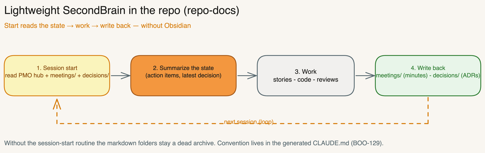

# Project Documentation SSoT — Bootstrap Contract

Goal: Before proposing the doc architecture, bootstrap defines **where project knowledge is written authoritatively**. Obsidian is the best practice for long-lived, linked project knowledge, but it is not required. Every project gets exactly one documentation SSoT mode plus clear repo references.

## Options

### Option 1 — Obsidian Vault (Best Practice)

- **SSoT:** `{OBSIDIAN_VAULT}/02 Projekte/{PROJECT_NAME}/`
- **Repo mirror:** `{PROJECT_PATH}/docs/project/README.md` as entry point with links to vault paths or wikilink hints.
- **Use when:** Knowledge work, multiple AIs, meeting/decision history, long-term project maintenance.
- **Rule:** The repo remains the work and code artifact; Obsidian holds project knowledge, decisions, meetings, research, and governance.

Target structure:

```text
02 Projekte/{PROJECT_NAME}/
  {PROJECT_NAME} - PMO HUB.md
  Developer Onboarding.md
  Projekt-Governance.md
  Target Architecture.md
  Backlog.md
  Decisions/
  Meetings/
  Research/
  Assets/
  Archive/
```

### Option 2 — Repo Docs

- **SSoT:** `{PROJECT_PATH}/docs/project/`
- **Use when:** No vault, open-source/team repo, simple toolchain.
- **Rule:** Project knowledge is git-versioned. `docs/project/README.md` is the entry point.

Target structure:

```text
docs/project/
  README.md
  DEVELOPER_ONBOARDING.md
  governance.md
  target-architecture.md
  backlog.md
  decisions/
  meetings/
  research/
  assets/
  archive/
```

**Lightweight SecondBrain loop (BOO-129):** `repo-docs` only becomes a usable "brain" once the generated `CLAUDE.md` reads the PMO hub (`README.md`) + the latest `meetings/`/`decisions/` at **session start** and the state is **written back** at the end (minutes → `meetings/`, decisions → `decisions/`). The session-start routine + write-back convention live in the `CLAUDE.md` template (`references/file-templates.en.md §CLAUDE.md (Minimum)`).



### Option 3 — External DMS

- **SSoT:** External DMS, e.g. SharePoint, Confluence, Notion, Google Drive, or a customer system.
- **Local reference file:** `{PROJECT_PATH}/docs/project/README.md`
- **Rule:** Do not duplicate DMS content in the repo. The local README contains DMS name, entry point, owners, link convention, and the list of standard artifacts with target URLs or placeholders.
- **Fallback:** If URLs are not known yet, add placeholders `TODO: add DMS link` and emit a postflight WARN.

### Option 4 — Undecided / Fallback

- **SSoT:** Temporarily `{PROJECT_PATH}/docs/project/`
- **Rule:** Bootstrap creates the repo fallback structure, marks `docs/project/README.md` with `TODO: finalize documentation SSoT`, and postflight emits `WARN`.
- **Goal:** The project is workable, while the SSoT decision remains visibly open.

## Standard Artifacts

Every mode must cover these artifacts. Names may be adjusted per language/tool, but the responsibility stays the same.

> **Canonical filename (BOO-134):** the developer onboarding is named **`DEVELOPER_ONBOARDING.md`** in the repo/`repo-docs` (project root, exactly what `scripts/verify-setup.sh` checks); in Obsidian `Developer Onboarding.md` (vault convention). **The bootstrap does NOT create a `HANDBUCH.md` in the project** — `HANDBUCH.md` is the framework documentation only, never a project artifact.

| Artifact | Purpose | Obsidian | Repo Docs | External DMS |
|----------|---------|----------|-----------|--------------|
| Project Hub / PMO Hub | Central entry point, status, links | `{PROJECT_NAME} - PMO HUB.md` | `README.md` | DMS start page |
| Developer Onboarding | Setup, local commands, working rules | `Developer Onboarding.md` | `DEVELOPER_ONBOARDING.md` | Onboarding page |
| Governance | Roles, gates, working process | `Projekt-Governance.md` | `governance.md` | Governance page |
| Target Architecture | Target state, system boundaries, core decisions | `Target Architecture.md` | `target-architecture.md` | Architecture page |
| Backlog | Backlog convention and tool links | `Backlog.md` | `backlog.md` | Backlog page |
| Decisions | ADRs / decisions | `Decisions/` | `decisions/` | Decision area |
| Meetings | Minutes, action items, context | `Meetings/` | `meetings/` | Meeting area |
| Research | Research, sources, analyses | `Research/` | `research/` | Research area |
| Assets | Images, exports, diagrams | `Assets/` | `assets/` | Asset area |
| Archive | Completed items, old versions | `Archive/` | `archive/` | Archive area |

## Bootstrap Behavior

Bootstrap stores the decision in `EXISTING_INFRA.documentation_ssot`:

```yaml
documentation_ssot:
  mode: "obsidian" # obsidian | repo-docs | external-dms | undecided
  primary_path: "/Users/tobi/Obsidian/Vault/02 Projekte/MyProject"
  repo_reference_path: "docs/project/README.md"
  external_system: null
  external_entrypoint: null
  fallback_active: false
  postflight_status: "PASS"
```

Mode rules:
- `obsidian`: Validate vault path, create or merge project folder, create repo reference file.
- `repo-docs`: Create `docs/project/`, create standard artifacts as files/folders.
- `external-dms`: Create local reference file, do not duplicate DMS content.
- `undecided`: Create repo fallback, mark TODO, postflight WARN.

## Postflight / Verification Criteria

Postflight returns `PASS` when:
- exactly one documentation SSoT mode is set,
- the primary path exists or, for external DMS, an entry point is documented,
- `docs/project/README.md` exists,
- all standard artifacts either exist as files/folders or are listed in the reference file with target/placeholder,
- no secrets, tokens, cookies, or private keys were written to documentation files.

Postflight returns `WARN` when:
- mode `undecided` is active,
- external DMS links are still marked as TODO,
- Obsidian was selected but only the repo fallback could be created,
- individual standard artifacts exist only as placeholders.

Postflight returns `FAIL` when:
- no SSoT mode is set,
- the primary path cannot be validated and no fallback was created,
- files would be overwritten without confirmation,
- a secret is detected in a target file.
