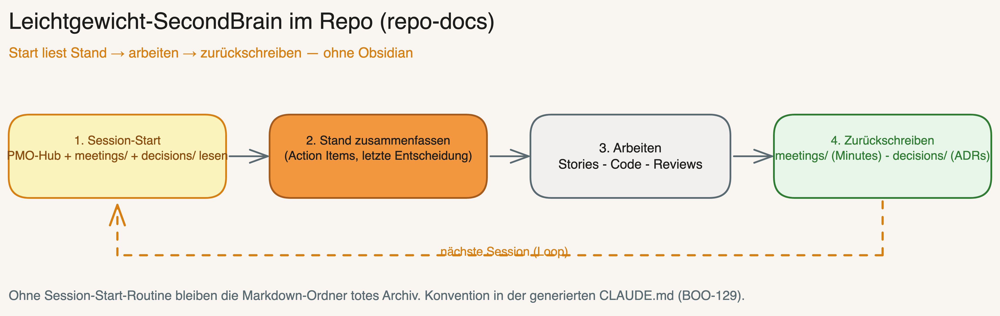

# Project-Documentation-SSoT — Bootstrap Contract

Ziel: Der Bootstrap legt vor der Doku-Architektur fest, **wo Projektwissen verbindlich geschrieben wird**. Obsidian ist die Best-Practice fuer langfristiges, vernetztes Projektwissen, aber keine Voraussetzung. Jedes Projekt bekommt genau einen Documentation-SSoT-Modus plus klare Repo-Verweise.

## Optionen

### Option 1 — Obsidian Vault (Best-Practice)

- **SSoT:** `{OBSIDIAN_VAULT}/02 Projekte/{PROJECT_NAME}/`
- **Repo-Spiegel:** `{PROJECT_PATH}/docs/project/README.md` als Einstieg mit Links auf Vault-Pfade oder Wikilink-Hinweisen.
- **Wann sinnvoll:** Wissensarbeit, mehrere KIs, Meeting-/Decision-Historie, langfristige Projektpflege.
- **Regel:** Repo bleibt Arbeits- und Code-Artefakt; Obsidian haelt Projektwissen, Entscheidungen, Meetings, Research und Governance.

Zielstruktur:

```text
02 Projekte/{PROJECT_NAME}/
  {PROJECT_NAME} - PMO HUB.md
  Developer Onboarding.md
  Projekt-Governance.md
  Target Architecture.md
  Backlog.md
  Decisions/
  Meetings/
  Research/
  Assets/
  Archive/
```

### Option 2 — Repo Docs

- **SSoT:** `{PROJECT_PATH}/docs/project/`
- **Wann sinnvoll:** Kein Vault, Open-Source-/Team-Repo, einfache Toolchain.
- **Regel:** Projektwissen ist git-versioniert. `docs/project/README.md` ist der Einstiegspunkt.

Zielstruktur:

```text
docs/project/
  README.md
  developer-onboarding.md
  governance.md
  target-architecture.md
  backlog.md
  decisions/
  meetings/
  research/
  assets/
  archive/
```

**Leichtgewicht-SecondBrain-Loop (BOO-129):** `repo-docs` wird erst dann ein nutzbares „Brain", wenn die generierte `CLAUDE.md` beim **Session-Start** den PMO-Hub (`README.md`) + die neuesten `meetings/`/`decisions/` liest und der Stand am Ende **zurückgeschrieben** wird (Minutes → `meetings/`, Entscheidungen → `decisions/`). Die Session-Start-Routine + Schreib-Konvention steckt im `CLAUDE.md`-Template (`references/file-templates.md §CLAUDE.md (Minimum)`).



### Option 3 — Externes DMS

- **SSoT:** Externes DMS, z.B. SharePoint, Confluence, Notion, Google Drive oder Kundensystem.
- **Lokale Verweisdatei:** `{PROJECT_PATH}/docs/project/README.md`
- **Regel:** Keine Duplikate im Repo erzeugen. Die lokale README enthaelt DMS-Name, Einstiegspunkt, Verantwortliche, Link-Konvention und Liste der Standard-Artefakte mit Ziel-URLs oder Platzhaltern.
- **Fallback:** Wenn URLs noch nicht bekannt sind, Platzhalter `TODO: DMS-Link ergaenzen` setzen und Postflight WARN ausgeben.

### Option 4 — Undecided / Fallback

- **SSoT:** Vorerst `{PROJECT_PATH}/docs/project/`
- **Regel:** Bootstrap erzeugt Repo-Fallback-Struktur, markiert `docs/project/README.md` mit `TODO: Documentation-SSoT final entscheiden`, und Postflight gibt `WARN` aus.
- **Ziel:** Projekt ist arbeitsfaehig, aber die SSoT-Entscheidung bleibt sichtbar offen.

## Standard-Artefakte

Jeder Modus muss diese Artefakte abdecken. Namen koennen pro Sprache/Tool angepasst werden, die Verantwortung bleibt gleich.

| Artefakt | Zweck | Obsidian | Repo Docs | Externes DMS |
|----------|-------|----------|-----------|--------------|
| Project Hub / PMO Hub | Zentraler Einstieg, Status, Links | `{PROJECT_NAME} - PMO HUB.md` | `README.md` | DMS-Startseite |
| Developer Onboarding | Setup, lokale Befehle, Arbeitsregeln | `Developer Onboarding.md` | `developer-onboarding.md` | Onboarding-Seite |
| Governance | Rollen, Gates, Arbeitsprozess | `Projekt-Governance.md` | `governance.md` | Governance-Seite |
| Target Architecture | Zielbild, Systemgrenzen, Kernentscheidungen | `Target Architecture.md` | `target-architecture.md` | Architektur-Seite |
| Backlog | Backlog-Konvention und Tool-Links | `Backlog.md` | `backlog.md` | Backlog-Seite |
| Decisions | ADRs / Entscheidungen | `Decisions/` | `decisions/` | Decision-Bereich |
| Meetings | Protokolle, Action Items, Kontext | `Meetings/` | `meetings/` | Meeting-Bereich |
| Research | Recherchen, Quellen, Analysen | `Research/` | `research/` | Research-Bereich |
| Assets | Bilder, Exporte, Diagramme | `Assets/` | `assets/` | Asset-Bereich |
| Archive | Abgeschlossenes, alte Versionen | `Archive/` | `archive/` | Archiv-Bereich |

## Bootstrap-Verhalten

Der Bootstrap speichert die Entscheidung in `EXISTING_INFRA.documentation_ssot`:

```yaml
documentation_ssot:
  mode: "obsidian" # obsidian | repo-docs | external-dms | undecided
  primary_path: "/Users/tobi/Obsidian/Vault/02 Projekte/MyProject"
  repo_reference_path: "docs/project/README.md"
  external_system: null
  external_entrypoint: null
  fallback_active: false
  postflight_status: "PASS"
```

Modus-Regeln:
- `obsidian`: Vault-Pfad validieren, Projektordner anlegen oder mergen, Repo-Verweisdatei anlegen.
- `repo-docs`: `docs/project/` anlegen, Standard-Artefakte als Dateien/Ordner erzeugen.
- `external-dms`: lokale Verweisdatei anlegen, keine DMS-Inhalte duplizieren.
- `undecided`: Repo-Fallback erzeugen, TODO markieren, Postflight WARN.

## Postflight- / Verification-Kriterien

Postflight gibt `PASS`, wenn:
- genau ein Documentation-SSoT-Modus gesetzt ist,
- der Primaerpfad existiert oder beim externen DMS ein Einstiegspunkt dokumentiert ist,
- `docs/project/README.md` existiert,
- alle Standard-Artefakte entweder als Datei/Ordner existieren oder in der Verweisdatei mit Ziel/Platzhalter gelistet sind,
- keine Secrets, Tokens, Cookies oder privaten Keys in Doku-Dateien geschrieben wurden.

Postflight gibt `WARN`, wenn:
- Modus `undecided` aktiv ist,
- externe DMS-Links noch als TODO markiert sind,
- Obsidian gewaehlt wurde, aber nur Repo-Fallback angelegt werden konnte,
- einzelne Standard-Artefakte nur als Platzhalter existieren.

Postflight gibt `FAIL`, wenn:
- kein SSoT-Modus gesetzt ist,
- der Primaerpfad nicht validierbar ist und kein Fallback erzeugt wurde,
- Dateien ohne Zustimmung ueberschrieben wuerden,
- ein Secret in einer Ziel-Datei erkannt wird.
