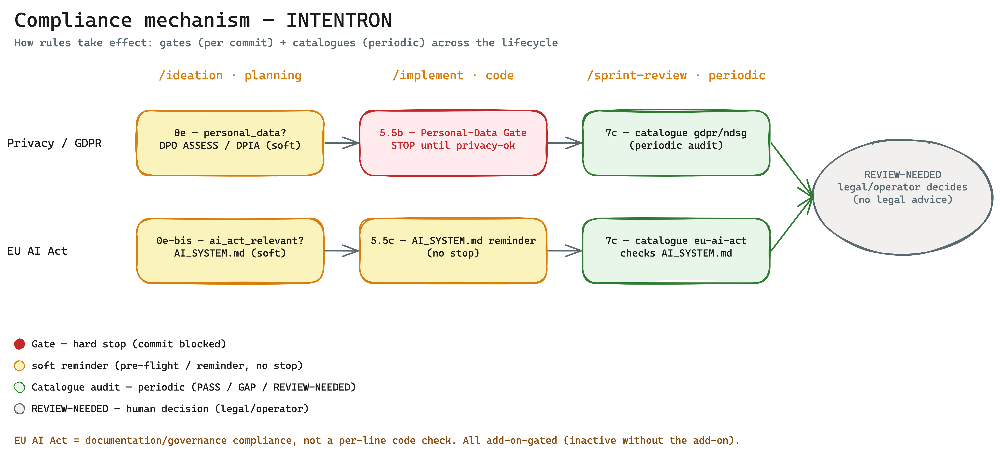

# Compliance Mechanics — End-to-End



*Gates (per commit, hard stop) vs. catalogues (periodic audit); automatic vs. REVIEW-NEEDED (human decision). ([Excalidraw source](../assets/compliance-mechanik.en.excalidraw))*

> **Purpose.** This document shows a CISO/CIO/operator in **one** view *how* compliance takes effect
> in the framework — across the full lifecycle of a change, from idea to periodic audit. It invents
> nothing: it bundles the existing mechanisms (gates, hooks, control catalogues) into one auditable
> overall picture.
>
> Deeper dives: where the evidence lands → [docs/runbooks/audit-perspective.md](../runbooks/audit-perspective.en.md) ·
> privacy background → HANDBUCH **Appendix O** (Privacy by Design, BOO-69) ·
> skill details → [dpo/SKILL.md](../../dpo/SKILL.en.md).

---

## 1. Two mechanisms — and what each is for

Compliance takes effect through **two distinct mechanisms**. They complement each other but do **not**
replace one another.

### Gates — the hard stop per code change

A **gate** acts **per code change** and is a **HARD STOP** inside the `/implement` run. If a changed
file hits a defined pattern, the gate halts the commit until a **human** confirms. No exception, no
auto-bypass.

| Gate | `/implement` step | Condition | Confirmation | Evidence |
|------|-------------------|-----------|--------------|----------|
| **Sensitive-Paths gate** (BOO-18) | Step **5.5** | `.claude/sensitive-paths.json` present **and** a changed file matches a pattern | `review-ok: {name} - {comment}` | `## Human Review` in the spec file |
| **Personal-Data-Paths gate** (BOO-69) | Step **5.5b** | Story frontmatter `personal_data: true` **and** `.claude/personal-data-paths.json` present **and** pattern match | `privacy-ok: {name} - {comment}` **or** a DPO REVIEW report | `## Privacy Review` in the spec file |

Flanking these, also as a deterministic safeguard **before** writing:

- **Layer-0 edit bodyguard** (BOO-86) — deterministic backstop that catches risky patterns (hardcoded
  secrets, disabled TLS verification, `eval`/`exec` on foreign input) *before* they are written. See
  HANDBUCH Appendix V.
- **raw-pii-guard** (BOO-93, optional, privacy add-on) — AST hook against raw/plaintext PII in log
  sinks.

> **Rule of thumb:** Gates = per code, hard stop, a human must confirm.

### Catalogues — the periodic documentation/process audit

A **catalogue** is not a code stop but a **periodic audit** in `/sprint-review` (step **7c**). A
deterministic runner, `dpo-audit.py`, processes versioned YAML control catalogues and reports a status
per control: **PASS**, **GAP** or **REVIEW-NEEDED**.

- **Framework catalogues:** `dpo/controls/` (`gdpr.yml`, `ndsg.yml`, optional `nist-ai-600.yml`).
- **Project overlay (BYO):** `.claude/dpo/controls/` (`.yml` + `.json`, same schema) — the runner
  merges them automatically into the framework catalogues.
- **Determinism:** same project state = same result (reproducible, Git-provable; deliberately **no
  database**).
- **Cadence:** from `environment.json.privacy_audit_cadence`, **default: every 4 sprints**.
- **Report pair:** `dpo/reports/<date>_audit.md` (human-readable) + `dpo/reports/<date>_audit.json`
  (machine-readable).

The runner honestly distinguishes two classes of check — it does not fake full automation:

| Check class | `check_typ` | Result | Who decides |
|-------------|-------------|--------|-------------|
| **Mechanical** | `file-exists`, `file-contains`, `grep-absent` | **PASS / GAP** (reproducible) | Machine |
| **Judgement** | `review` | **REVIEW-NEEDED** | Operator/legal — manually afterwards |

> **Rule of thumb:** Catalogues = periodic, documentation/process audit, report instead of a stop
> (`dpo-audit.py` returns exit code 0 — the audit is a report, not a gate).

---

## 2. Touchpoint table — where compliance takes effect per phase

| Phase | Privacy / GDPR | EU AI Act | Automatic vs. human decision |
|-------|----------------|-----------|-------------------------------|
| **`/ideation`** | Step **0e**: frontmatter `personal_data: true/false`; if `true`, DPO ASSESS/DPIA **recommended** | Step **0e-bis**: `ai_act_relevant` pre-flight (**soft**) | Automatic: frontmatter setting + notice. Human: whether DPO ASSESS/DPIA is performed |
| **`/implement`** | Step **5.5b**: personal-data gate — **hard stop**, `privacy-ok` | Step **5.5c**: **soft notice**, keep `AI_SYSTEM.md` current — **no** hard stop | Privacy: machine stops, **human** confirms. AI Act: machine reminds, no stop |
| **`/sprint-review`** | Step **7c**: catalogues `gdpr.yml` / `ndsg.yml`, periodic | Step **7c**: catalogue `eu-ai-act.yml` checks `AI_SYSTEM.md` completeness (only if add-on active) | Mechanical checks: machine (PASS/GAP). Judgement checks: **REVIEW-NEEDED** → operator/legal |

Flanking every `/implement` run: step **5.5** sensitive-paths gate (hard stop, `review-ok`) + Layer-0
edit bodyguard (before writing).

---

## 3. Lifecycle Privacy / GDPR

```
/ideation 0e            /implement 5.5b              /sprint-review 7c
pre-flight (soft)   →   personal-data gate      →    catalogues (periodic)
personal_data:          HARD STOP                    gdpr.yml / ndsg.yml
true / false            privacy-ok: ...              PASS / GAP / REVIEW-NEEDED
DPO ASSESS/DPIA         (or DPO REVIEW report)       cadence: every 4 sprints
recommended
```

1. **`/ideation` step 0e — privacy pre-flight (soft, BOO-69).**
   The story frontmatter gains `personal_data: true|false`. On `true`, a notice block is added to the
   story body: **DPO ASSESS mode recommended** before spec finalisation (`/dpo --mode assess` →
   `dpia/DPIA-<feature>.md` with legal basis and risk assessment). This is **not** a hard gate — the
   hard stop only comes at the code stage.

2. **`/implement` step 5.5b — personal-data-paths gate (hard stop, BOO-69).**
   Runs only if `personal_data: true` **and** `.claude/personal-data-paths.json` exists. If a changed
   file matches a pattern, the run **stops** with the full diff for review. The commit proceeds only
   once `privacy-ok: {name} - {comment}` is confirmed **or** the DPO skill writes a REVIEW report. The
   result is written under `## Privacy Review` in the spec file. **No `privacy-ok`, no continuation** —
   no exception.

3. **`/sprint-review` step 7c — DPO audit (periodic, BOO-69/BOO-87).**
   Runs only if `PRIVACY.md` exists at the project root **and** the sprint counter has reached the
   `privacy_audit_cadence` threshold (default 4). `dpo-audit.py` processes `gdpr.yml` / `ndsg.yml` and
   writes the report pair with PASS/GAP/REVIEW-NEEDED per control. Judgement points (records of
   processing Art. 30, processor agreements Art. 28, third-country transfer, purpose limitation) are
   `review` type → REVIEW-NEEDED → the operator decides.

---

## 4. Lifecycle EU AI Act

```
/ideation 0e-bis        /implement 5.5c              /sprint-review 7c
pre-flight (soft)   →   soft notice             →    catalogue eu-ai-act.yml
ai_act_relevant         keep AI_SYSTEM.md            checks AI_SYSTEM.md
                        current — NO stop            completeness
                                                     (only if add-on copied it)
```

1. **`/ideation` step 0e-bis — `ai_act_relevant` pre-flight (soft).**
   Early, soft classification of whether the story is EU-AI-Act-relevant. No hard gate.

2. **`/implement` step 5.5c — soft notice (no hard stop).**
   Reminds you to keep `AI_SYSTEM.md` current (purpose, risk class, measures). Deliberately **no** hard
   stop — the EU AI Act is governance, not a line-by-line code check.

3. **`/sprint-review` step 7c — catalogue `eu-ai-act.yml` (periodic).**
   The catalogue deliberately lives under `dpo/controls/optional/` and is **not** auto-loaded by the
   runner. It takes effect **only** if the **EU AI Act add-on** (bootstrap phase 4.4n-bis, BOO-105) has
   copied it into the project overlay `.claude/dpo/controls/` — and then only for that project. It
   checks the **completeness of `AI_SYSTEM.md`**:

   | Control | Checks | Type | Result |
   |---------|--------|------|--------|
   | `AIACT-Doc-001` | `AI_SYSTEM.md` present | `file-exists` | PASS / GAP |
   | `AIACT-Art6-001` | Risk class documented | `file-contains` | PASS / GAP |
   | `AIACT-Art13-001` | Transparency/labelling obligation | `file-contains` | PASS / GAP |
   | `AIACT-Art14-001` | Human oversight defined | `file-contains` | PASS / GAP |
   | `AIACT-Art12-001` | Record-keeping / logging | `file-contains` | PASS / GAP |
   | `AIACT-Art5-001` | Prohibited practices excluded | `review` | **REVIEW-NEEDED** |
   | `AIACT-Art6-002` | High-risk classification + conformity | `review` | **REVIEW-NEEDED** |
   | `AIACT-GPAI-001` | GPAI/foundation-model exposure | `review` | **REVIEW-NEEDED** |

   The **judgement points** (prohibited practices, high-risk, GPAI) are always **REVIEW-NEEDED** — the
   operator/legal decides. Source: AI Regulation (EU) 2024/1689.

---

## 5. Key clarifications

**(a) Gates ≠ catalogues.** Gates are a **per-code hard stop** in `/implement` — they block the commit
until a human confirms. Catalogues are a **periodic documentation/process audit** in `/sprint-review` —
they report PASS/GAP/REVIEW-NEEDED in a report without blocking anything. The two mechanisms solve
different problems and do not replace each other.

**(b) EU AI Act = documentation/governance compliance, not a line-by-line code check.** This is
**deliberate**: the AI Act is a governance topic (risk class, transparency, human oversight, logging,
GPAI obligations), not a linter topic. That is why the `/implement` touchpoint (5.5c) is only a **soft
notice** and the catalogue checks the completeness of `AI_SYSTEM.md` — not the code line by line.

**(c) Judgement points are always REVIEW-NEEDED.** Wherever a legal assessment is required (purpose
limitation, third country, processor agreement, prohibited practices, high-risk, GPAI), the runner
deliberately returns **REVIEW-NEEDED** instead of an invented verdict. The **operator/legal** decides —
the skill gives **no legal advice**.

**(d) Add-on-gated.** Without an active **privacy add-on**, nothing happens on the GDPR side (steps 0e
/ 5.5b / 7c are then inactive). Without the **EU AI Act add-on**, `eu-ai-act.yml` is not copied into
the project overlay and does not take effect. Compliance is opt-in per project.

---

## 6. Evidence & cross-references

| Topic | Source |
|-------|--------|
| Where the evidence lands (audit trail, reports, gates) | [docs/runbooks/audit-perspective.md](../runbooks/audit-perspective.en.md) |
| Privacy background (legal bases, modes, control catalogue) | HANDBUCH **Appendix O** (Privacy by Design, BOO-69) |
| Skill details (3 modes, catalogues, runner) | [dpo/SKILL.md](../../dpo/SKILL.en.md) |
| Deterministic AUDIT runner | [dpo/scripts/dpo-audit.py](../../dpo/scripts/dpo-audit.py) |
| Framework catalogues | [dpo/controls/gdpr.yml](../../dpo/controls/gdpr.yml), [dpo/controls/ndsg.yml](../../dpo/controls/ndsg.yml) |
| EU AI Act catalogue (opt-in) | [dpo/controls/optional/eu-ai-act.yml](../../dpo/controls/optional/eu-ai-act.yml) |
| Report location | `dpo/reports/<date>_audit.{md,json}` |
