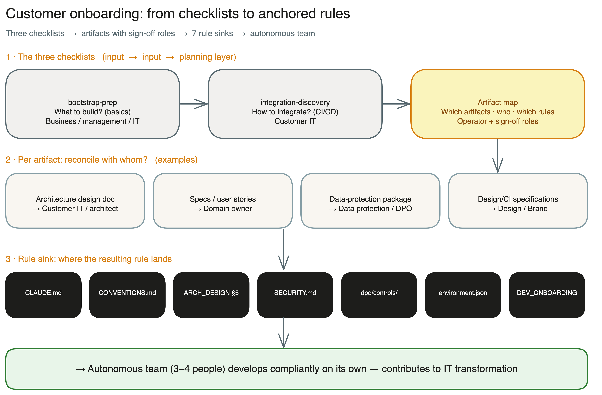

# Artifact & Sign-off Map

> Third onboarding building block. Closes the loop: **what to build** ([`bootstrap-prep.en.md`](./bootstrap-prep.en.md)) → **how to integrate** ([`integration-discovery.en.md`](./integration-discovery.en.md)) → **which artifacts, with whom, which rules** (this document).
>
> Language: English — German original see [`artefakt-landkarte.md`](./artefakt-landkarte.md).
> Status: Master template. Per project it becomes a filled-in instance (`solution-artifacts.md`) with a living status column.

## Purpose

At bootstrap the framework ships a **standard set of artifacts and templates** (specs, backlog, architecture design doc, security, data protection …). But every customer has their own, often unwritten enterprise rules — how specs are phrased, that log files must be produced in an audit-ready way, which data-protection rules apply.

This map is the **reconciliation and sign-off plan**: it lists every framework artifact, says where it lives, when it is needed, **with whom on the customer side it is reconciled/signed off**, and **where the resulting rule is stored**. The result is a complete enterprise rule set anchored in the right places — the precondition for an autonomous team of 3–4 people to subsequently develop in a compliant way on their own.

## How to use it

1. **Filter:** Delete non-triggered rows (see *When needed* column). A lean solution without PII, without AI, without third-party systems, "loose" → few rows.
2. **Plan workshops:** Group rows by *Sign-off role* → one session per role. "Sit down with data protection, walk through all DP artifacts."
3. **Reconcile:** Per artifact ask: *Do you have your own specification?* — If yes → reconcile, customer rule wins. If no → framework default applies.
4. **Anchor:** Write the reconciliation result as a rule into the named **rule sink**.
5. **Track status:** open → in clarification → signed off.

## Rule sinks (where rules are stored)

| Sink | Content |
|---|---|
| `CLAUDE.md` | Project-wide top-level rules, version history |
| `CONVENTIONS.md` | Governance mode, strictness (loose/normal/strict), active gates, story/spec conventions |
| `ARCHITECTURE_DESIGN.md` §5 | Active quality dimensions + add-ons (e.g. logging/monitoring/audit readiness) |
| `SECURITY.md` | Security rules, threat-model result |
| `dpo/controls/` + DP artifacts | Legal basis, DPIA, record of processing, deletion concept, TOMs |
| `.claude/environment.json` | Paths, available tools, sovereignty/proxy routing |
| `DEVELOPER_ONBOARDING.md` | Handover knowledge for autonomous teams / tool switches |
| Backlog tool (Linear/M365/GitHub) | Definition of Done, story format |

## Sign-off roles (customer side)

Derived from [`integration-discovery.en.md`](./integration-discovery.en.md) (RACI, contacts) and [`bootstrap-prep.en.md`](./bootstrap-prep.en.md) (IT / business / management):

- **Sponsor** — client / management
- **Domain owner** — business unit / subject matter side
- **Customer IT / architect** — technical specifications, platform, integration
- **Security** — CISO / security officer
- **Data protection** — DPO / data protection officer
- **Operations** — ops / platform operations
- **Audit** — internal audit / compliance
- **Design/Brand** — brand specifications (colors, frontend design, CI guidelines)

> **Role entry points (lenses).** Four of these roles have narrative entry-point runbooks that explain the framework from their point of view — what it means for them, which gatekeepers apply, where they take control: [`ciso-security.en.md`](../runbooks/ciso-security.en.md) (security), [`dpo-privacy.en.md`](../runbooks/dpo-privacy.en.md) (data protection), [`cto-code-quality.en.md`](../runbooks/cto-code-quality.en.md) (code quality), [`ceo-business-case.en.md`](../runbooks/ceo-business-case.en.md) (managing director).

---

## Master matrix

> Columns: Artifact · Lives in framework / output path · Producing phase · Default template (reconciliation basis) · When needed (trigger) · Sign-off role · Rule sink · Status

### A — Setup & governance (cross-cutting, set at bootstrap)

| Artifact | Path (framework → output) | Phase | Default template | When needed | Sign-off | Rule sink | Status |
|---|---|---|---|---|---|---|---|
| Governance rule set | → `CLAUDE.md` | bootstrap | yes (`bootstrap/references/file-templates.md`) | always | Sponsor + IT | `CLAUDE.md` | _open_ |
| Conventions & strictness | → `CONVENTIONS.md` | bootstrap | yes | always | IT/architect | `CONVENTIONS.md` | _open_ |
| Environment config | → `.claude/environment.json` | bootstrap | yes | always | Customer IT | `.claude/environment.json` | _open_ |
| Developer onboarding | → `DEVELOPER_ONBOARDING.md` | bootstrap | yes (`bootstrap/references/project-documentation-ssot.md`) | always (autonomy goal) | Domain owner + IT | `DEVELOPER_ONBOARDING.md` | _open_ |
| Integration discovery answers | `docs/onboarding/integration-discovery.md` | onboarding | yes (questionnaire) | on live integration | Customer IT + Operations | `.claude/environment.json` / Runbook | _open_ |

### B — Product & architecture

| Artifact | Path (framework → output) | Phase | Default template | When needed | Sign-off | Rule sink | Status |
|---|---|---|---|---|---|---|---|
| Intent statement | `paths.intents` (e.g. `intent/`) | intent | yes | per initiative | Sponsor + Domain owner | — (input for specs) | _open_ |
| User story / spec | `specs/` (`specs/BOO-*.md` as pattern) | ideation | **yes — central reconciliation point** | always | Domain owner | `CONVENTIONS.md` (story format, DoD) + backlog tool | _open_ |
| Backlog / sprint plan | Linear / M365 / GitHub | backlog | yes | always | Domain owner + Sponsor | Backlog tool | _open_ |
| Architecture design doc | → `ARCHITECTURE_DESIGN.md` (§1–§6 + ADRs) | architecture-review | **yes — reconcile platform/IaC/logging** | always | Customer IT / architect | `ARCHITECTURE_DESIGN.md` §2/§3/§5 | _open_ |
| Active quality dimensions (incl. logging/monitoring/audit readiness) | `ARCHITECTURE_DESIGN.md` §5 | architecture-review | yes (8 standard + add-ons) | when specs exist (logging duty, audit) | Customer IT + Audit | `ARCHITECTURE_DESIGN.md` §5 | _open_ |
| Observability skeleton (logging/monitoring requirements) | → `observability.md` (project root) | bootstrap (skeleton) → architecture-review (fill) | yes (`bootstrap/references/file-templates.md` §group G) | logging/monitoring requirement / audit duty | Customer IT + Operations | `observability.md` (referenced in `ARCHITECTURE_DESIGN.md` §5/§6) | _open_ |
| Design/CI specifications (frontend: colors, typography, components) | → `DESIGN.md` (linked from `ARCHITECTURE_DESIGN.md` §5) | architecture-review / ideation | partial (framework ships no brand colors — reconciliation mandatory) | frontend/UI present (bootstrap question 3) | Design/Brand + Domain owner + architect | `DESIGN.md` (referenced in `ARCHITECTURE_DESIGN.md` §5) | _open_ |
| Architecture diagrams | Miro (board URL) | visualize | n/a (generated) | optional | Architect | — | _open_ |

### C — Security & data protection (conditional)

| Artifact | Path (framework → output) | Phase | Default template | When needed | Sign-off | Rule sink | Status |
|---|---|---|---|---|---|---|---|
| Threat model | security-architect (DESIGN) → finding | security-architect | yes (STRIDE/DREAD, OWASP) | ext. interface / auth / "strict" | Security | `SECURITY.md` | _open_ |
| Security rule set | → `SECURITY.md` | security-architect | yes | "normal"+ | Security | `SECURITY.md` | _open_ |
| Legal basis + DPIA | dpo (ASSESS) → DP artifact | dpo | yes (Art. 6, DPIA schema) | personal data (bootstrap question 7) | Data protection | `dpo/controls/` | _open_ |
| Record of processing | dpo (AUDIT) | dpo | yes | PII present | Data protection | `dpo/controls/` | _open_ |
| Deletion concept + TOMs | dpo | dpo | yes | PII present | Data protection + Operations | `dpo/controls/` + `ARCHITECTURE_DESIGN.md` §5 | _open_ |
| AI / EU AI Act documentation | dpo | dpo | yes | AI component processes data (question 7) | Data protection + Sponsor | `dpo/controls/` | _open_ |

### D — Delivery, operations & compliance

| Artifact | Path (framework → output) | Phase | Default template | When needed | Sign-off | Rule sink | Status |
|---|---|---|---|---|---|---|---|
| Implement report + quality gates | `journal/reports/local/` | implement | yes | always | IT/architect | `CONVENTIONS.md` (gates) | _open_ |
| Integration / deploy model | `docs/runbooks/` — Examples: [`vercel-cicd-setup.md`](../runbooks/vercel-cicd-setup.md), [`sonarcloud-setup.md`](../runbooks/sonarcloud-setup.md), [`sprint-unattended-tmux.en.md`](../runbooks/sprint-unattended-tmux.en.md) | cloud-system-engineer | yes | own operation / go-live | Operations + Customer IT | Runbook + `.claude/environment.json` | _open_ |
| Monitoring / logging setup + alert rules | Grafana | grafana | yes | monitoring wanted / audit duty | Operations | `ARCHITECTURE_DESIGN.md` §5 + Grafana | _open_ |
| Compliance evidence mechanism | `docs/compliance/compliance-mechanik.md` | docs/compliance | yes | "strict" / regulated industry | Audit + Sponsor | `CONVENTIONS.md` (gates, four-eyes) | _open_ |
| Audit perspective | `docs/runbooks/audit-perspective.md` | docs/runbooks | yes | audit duty | Audit | Runbook | _open_ |
| Pitch briefing | `pitch/PITCH-XX.md` | pitch | yes (`pitch/references/pitch-template.md`) | per stakeholder meeting | Sponsor | — | _open_ |
| Sprint review audit + lessons L1/L2/L3 | `paths.lessons_*` | sprint-review | yes | periodic | Domain owner + IT | Learning loop (`CONVENTIONS.md`) | _open_ |

### DESIGN.md pattern (lean architecture)

To keep `ARCHITECTURE_DESIGN.md` lean and design details in *one* place:

- As soon as the solution has a **frontend/UI**, `§5` of the architecture doc **always** adds a reference to a `DESIGN.md`.
- **No specifications?** → `DESIGN.md` explicitly states "no special specifications" (do not omit it — the deliberate statement is itself the rule).
- **Specifications exist?** → colors, typography, component rules live in `DESIGN.md` (format compatible with `design-md-generator` / `lumen-visual-system`).
- The **Design/Brand** role signs off the content; without a frontend the row is simply *n/a*.

---

## Trigger linkage (path to later auto-generation)

The *When needed* column hangs off already-existing bootstrap answers. Evaluated manually today, machine-evaluated later:

| Trigger source | Activates |
|---|---|
| `bootstrap-prep` question 7 — personal data | Section C (legal basis, DPIA, record, deletion concept, TOMs) |
| `bootstrap-prep` question 7 — AI component | AI / EU AI Act documentation |
| `bootstrap-prep` question 7 — regulated industry | Compliance evidence mechanism, audit perspective |
| `bootstrap-prep` question 8 — "strict" | Threat model, four-eyes, audit trail |
| `bootstrap-prep` question 3 — web frontend | Design/CI specifications (frontend), performance dimension |
| `integration-discovery` cluster 3 — interfaces | Integration / deploy model, threat model |
| `integration-discovery` cluster 6 — compliance/audit | Logging/monitoring dimension, audit perspective |
| `bootstrap-prep` add-on — monitoring | Monitoring / logging setup |

> **Lightweight principle:** Only triggered rows appear in the project instance. Anything not triggered is not asked and creates no operator overhead.
