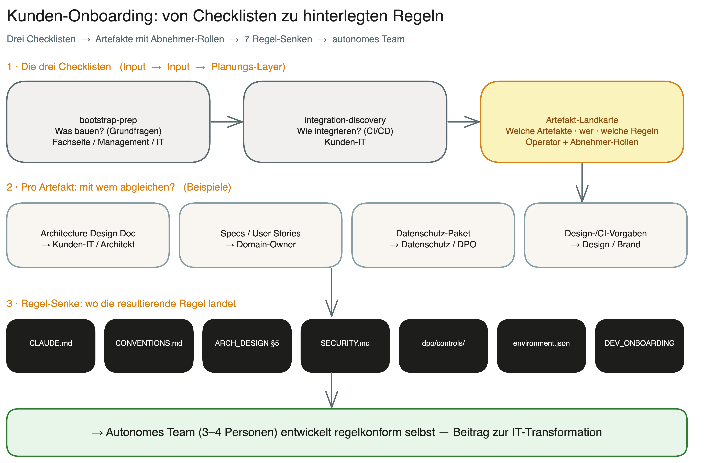

# Artefakt- & Freigabe-Landkarte

> Dritter Onboarding-Baustein. Schliesst die Schleife: **was bauen** ([`bootstrap-prep.md`](./bootstrap-prep.md)) → **wie integrieren** ([`integration-discovery.md`](./integration-discovery.md)) → **welche Artefakte, mit wem, welche Regeln** (dieses Dokument).
>
> Sprache: Deutsch — englische Fassung siehe [`artefakt-landkarte.en.md`](./artefakt-landkarte.en.md).
> Status: Master-Vorlage. Pro Projekt wird daraus eine ausgefuellte Instanz (`solution-artefakte.md`) mit lebender Status-Spalte.

## Zweck

Das Framework liefert beim Bootstrap ein **Standard-Set an Artefakten und Templates** (Specs, Backlog, Architecture Design Doc, Security, Datenschutz …). Jeder Kunde hat aber eigene, oft ungeschriebene Konzern-Vorgaben — wie Specs formuliert werden, dass Log-Files audit-faehig erzeugt werden muessen, welche Datenschutz-Regeln gelten.

Diese Landkarte ist der **Abgleich- und Abnahme-Plan**: Sie listet jedes Artefakt des Frameworks, sagt wo es liegt, wann es noetig ist, **mit wem auf Kundenseite es abgeglichen/abgenommen wird** und **wo die resultierende Regel hinterlegt wird**. So entsteht ein vollstaendiges, an der richtigen Stelle verankertes Konzern-Regelwerk — die Voraussetzung dafuer, dass ein autonomes Team von 3–4 Personen anschliessend regelkonform selbst entwickeln kann.

## So wird sie benutzt

1. **Filtern:** Nicht-getriggerte Zeilen streichen (siehe Spalte *Wann noetig*). Eine schlanke Solution ohne PII, ohne KI, ohne Drittsystem, „locker" → wenige Zeilen.
2. **Workshops planen:** Zeilen nach *Abnehmer-Rolle* gruppieren → pro Rolle ein Termin. „Mit Datenschutz hinsetzen, alle DS-Artefakte durchgehen."
3. **Abgleichen:** Pro Artefakt fragen: *Habt ihr eine eigene Vorgabe?* — Wenn ja → abgleichen, Kunden-Vorgabe gewinnt. Wenn nein → Framework-Default gilt.
4. **Verankern:** Das Abgleich-Ergebnis als Regel in die genannte **Regel-Senke** schreiben.
5. **Status pflegen:** offen → in Klaerung → abgenommen.

## Regel-Senken (wohin Regeln gespeichert werden)

| Senke | Inhalt |
|---|---|
| `CLAUDE.md` | Projektweite Top-Regeln, Versions-Historie |
| `CONVENTIONS.md` | Governance-Modus, Strenge (locker/normal/streng), aktive Gates, Story-/Spec-Konventionen |
| `ARCHITECTURE_DESIGN.md` §5 | Aktive Quality-Dimensionen + Add-ons (z. B. Logging/Monitoring/Audit-Faehigkeit) |
| `SECURITY.md` | Security-Regeln, Threat-Model-Ergebnis |
| `dpo/controls/` + DS-Artefakte | Rechtsgrundlage, DPIA, Verarbeitungsverzeichnis, Loeschkonzept, TOMs |
| `.claude/environment.json` | Pfade, verfuegbare Tools, Souveraenitaets-/Proxy-Routing |
| `DEVELOPER_ONBOARDING.md` | Uebergabe-Wissen fuer autonome Teams / Tool-Wechsel |
| Backlog-Tool (Linear/M365/GitHub) | Definition of Done, Story-Format |

## Abnehmer-Rollen (Kundenseite)

Abgeleitet aus [`integration-discovery.md`](./integration-discovery.md) (RACI, Ansprechpartner) und [`bootstrap-prep.md`](./bootstrap-prep.md) (IT / Fachseite / Management):

- **Sponsor** — Auftraggeber / Management
- **Domain-Owner** — Fachbereich / Fachseite
- **Kunden-IT / Architekt** — technische Vorgaben, Plattform, Integration
- **Security** — CISO / Security-Verantwortlicher
- **Datenschutz** — DPO / Datenschutzbeauftragter
- **Betrieb** — Ops / Plattform-Betrieb
- **Audit** — Revision / Compliance
- **Design/Brand** — Markenvorgaben (Farben, Frontend-Design, CI-Guidelines)

> **Rollen-Einstieg (Lesebrillen).** Für vier dieser Rollen gibt es narrative Einstiegs-Runbooks, die das Framework aus ihrer Sicht erklären — was es für sie bedeutet, welche Gatekeeper greifen, wo sie Einfluss nehmen: [`ciso-security.md`](../runbooks/ciso-security.md) (Security), [`dpo-privacy.md`](../runbooks/dpo-privacy.md) (Datenschutz), [`cto-code-quality.md`](../runbooks/cto-code-quality.md) (Codequalität), [`ceo-business-case.md`](../runbooks/ceo-business-case.md) (Geschäftsführung).

---

## Master-Matrix

> Spalten: Artefakt · Liegt im Framework / Output-Pfad · Erzeugende Phase · Default-Template (Abgleich-Basis) · Wann noetig (Trigger) · Abnehmer-Rolle · Regel-Senke · Status

### A — Setup & Governance (querschnittlich, beim Bootstrap gesetzt)

| Artefakt | Pfad (Framework → Output) | Phase | Default-Template | Wann noetig | Abnehmer | Regel-Senke | Status |
|---|---|---|---|---|---|---|---|
| Governance-Regelwerk | → `CLAUDE.md` | bootstrap | ja (`bootstrap/references/file-templates.md`) | immer | Sponsor + IT | `CLAUDE.md` | _offen_ |
| Konventionen & Strenge | → `CONVENTIONS.md` | bootstrap | ja | immer | IT/Architekt | `CONVENTIONS.md` | _offen_ |
| Environment-Config | → `.claude/environment.json` | bootstrap | ja | immer | Kunden-IT | `.claude/environment.json` | _offen_ |
| Developer-Onboarding | → `DEVELOPER_ONBOARDING.md` | bootstrap | ja (`bootstrap/references/project-documentation-ssot.md`) | immer (Autonomie-Ziel) | Domain-Owner + IT | `DEVELOPER_ONBOARDING.md` | _offen_ |
| Integrations-Discovery-Antworten | `docs/onboarding/integration-discovery.md` | onboarding | ja (Fragebogen) | bei Live-Integration | Kunden-IT + Betrieb | `.claude/environment.json` / Runbook | _offen_ |

### B — Produkt & Architektur

| Artefakt | Pfad (Framework → Output) | Phase | Default-Template | Wann noetig | Abnehmer | Regel-Senke | Status |
|---|---|---|---|---|---|---|---|
| Intent-Statement | `paths.intents` (z. B. `intent/` ) | intent | ja | je Initiative | Sponsor + Domain-Owner | — (Input fuer Specs) | _offen_ |
| User Story / Spec | `specs/` (`specs/BOO-*.md` als Muster) | ideation | **ja — zentraler Abgleichpunkt** | immer | Domain-Owner | `CONVENTIONS.md` (Story-Format, DoD) + Backlog-Tool | _offen_ |
| Backlog / Sprint-Plan | Linear / M365 / GitHub | backlog | ja | immer | Domain-Owner + Sponsor | Backlog-Tool | _offen_ |
| Architecture Design Doc | → `ARCHITECTURE_DESIGN.md` (§1–§6 + ADRs) | architecture-review | **ja — Abgleich Plattform/IaC/Logging** | immer | Kunden-IT / Architekt | `ARCHITECTURE_DESIGN.md` §2/§3/§5 | _offen_ |
| Aktive Quality-Dimensionen (inkl. Logging/Monitoring/Audit-Faehigkeit) | `ARCHITECTURE_DESIGN.md` §5 | architecture-review | ja (8 Standard + Add-ons) | wenn Vorgaben existieren (Logging-Pflicht, Audit) | Kunden-IT + Audit | `ARCHITECTURE_DESIGN.md` §5 | _offen_ |
| Observability-Skelett (Logging/Monitoring-Vorgaben) | → `observability.md` (Projekt-Root) | bootstrap (Skelett) → architecture-review (befuellen) | ja (`bootstrap/references/file-templates.md` §Gruppe G) | Logging/Monitoring-Anforderung / Audit-Pflicht | Kunden-IT + Betrieb | `observability.md` (referenziert in `ARCHITECTURE_DESIGN.md` §5/§6) | _offen_ |
| Design-/CI-Vorgaben (Frontend: Farben, Typo, Komponenten) | → `DESIGN.md` (verlinkt aus `ARCHITECTURE_DESIGN.md` §5) | architecture-review / ideation | teils (Framework bringt keine Markenfarben mit — Abgleich Pflicht) | Frontend/UI vorhanden (Bootstrap-Frage 3) | Design/Brand + Domain-Owner + Architekt | `DESIGN.md` (Referenz in `ARCHITECTURE_DESIGN.md` §5) | _offen_ |
| Architektur-Diagramme | Miro (Board-URL) | visualize | n/a (generiert) | optional | Architekt | — | _offen_ |

### C — Security & Datenschutz (bedingt)

| Artefakt | Pfad (Framework → Output) | Phase | Default-Template | Wann noetig | Abnehmer | Regel-Senke | Status |
|---|---|---|---|---|---|---|---|
| Threat Model | security-architect (DESIGN) → Befund | security-architect | ja (STRIDE/DREAD, OWASP) | ext. Schnittstelle / Auth / „streng" | Security | `SECURITY.md` | _offen_ |
| Security-Regelwerk | → `SECURITY.md` | security-architect | ja | „normal"+ | Security | `SECURITY.md` | _offen_ |
| Rechtsgrundlage + DPIA | dpo (ASSESS) → DS-Artefakt | dpo | ja (Art. 6, DPIA-Schema) | personenbezogene Daten (Bootstrap-Frage 7) | Datenschutz | `dpo/controls/` | _offen_ |
| Verarbeitungsverzeichnis | dpo (AUDIT) | dpo | ja | PII vorhanden | Datenschutz | `dpo/controls/` | _offen_ |
| Loeschkonzept + TOMs | dpo | dpo | ja | PII vorhanden | Datenschutz + Betrieb | `dpo/controls/` + `ARCHITECTURE_DESIGN.md` §5 | _offen_ |
| KI-/EU-AI-Act-Doku | dpo | dpo | ja | KI-Komponente verarbeitet Daten (Frage 7) | Datenschutz + Sponsor | `dpo/controls/` | _offen_ |

### D — Lieferung, Betrieb & Compliance

| Artefakt | Pfad (Framework → Output) | Phase | Default-Template | Wann noetig | Abnehmer | Regel-Senke | Status |
|---|---|---|---|---|---|---|---|
| Implement-Report + Quality Gates | `journal/reports/local/` | implement | ja | immer | IT/Architekt | `CONVENTIONS.md` (Gates); End-to-End-Bild der Linter-Verdrahtung: HANDBUCH-Kapitel 8d-quart | _offen_ |
| Integrations-/Deploy-Modell | `docs/runbooks/` — Beispiele: [`vercel-cicd-setup.md`](../runbooks/vercel-cicd-setup.md), [`sonarcloud-setup.md`](../runbooks/sonarcloud-setup.md), [`sprint-unattended-tmux.md`](../runbooks/sprint-unattended-tmux.md) | cloud-system-engineer | ja | eigener Betrieb / Go-Live | Betrieb + Kunden-IT | Runbook + `.claude/environment.json` | _offen_ |
| Monitoring-/Logging-Setup + Alert Rules | Grafana | grafana | ja | Monitoring gewuenscht / Audit-Pflicht | Betrieb | `ARCHITECTURE_DESIGN.md` §5 + Grafana | _offen_ |
| Compliance-Nachweismechanik | `docs/compliance/compliance-mechanik.md` | docs/compliance | ja | „streng" / regulierte Branche | Audit + Sponsor | `CONVENTIONS.md` (Gates, Vier-Augen) | _offen_ |
| Audit-Perspektive | `docs/runbooks/audit-perspective.md` | docs/runbooks | ja | Audit-Pflicht | Audit | Runbook | _offen_ |
| Pitch-Briefing | `pitch/PITCH-XX.md` | pitch | ja (`pitch/references/pitch-template.md`) | je Stakeholder-Termin | Sponsor | — | _offen_ |
| Sprint-Review-Audit + Lessons L1/L2/L3 | `paths.lessons_*` | sprint-review | ja | periodisch | Domain-Owner + IT | Learning-Loop (`CONVENTIONS.md`) | _offen_ |

### DESIGN.md-Muster (schlanke Architektur)

Damit `ARCHITECTURE_DESIGN.md` schlank bleibt und Design-Details an *einem* Ort liegen:

- Sobald die Solution ein **Frontend/UI** hat, legt `§5` der Architektur-Doku **immer** einen Verweis auf eine `DESIGN.md` an.
- **Keine Vorgaben?** → `DESIGN.md` enthaelt explizit „keine speziellen Vorgaben" (nicht weglassen — die bewusste Aussage ist selbst die Regel).
- **Vorgaben vorhanden?** → Farben, Typografie, Komponenten-Regeln stehen in `DESIGN.md` (Format kompatibel zum `design-md-generator` / `lumen-visual-system`).
- Abnehmer **Design/Brand** gibt den Inhalt frei; ohne Frontend ist die Zeile schlicht *n/a*.

---

## Trigger-Verknuepfung (Pfad zur spaeteren Auto-Generierung)

Die Spalte *Wann noetig* haengt an bereits existierenden Bootstrap-Antworten. Heute manuell ausgewertet, spaeter maschinell:

| Trigger-Quelle | Schaltet scharf |
|---|---|
| `bootstrap-prep.md` Frage 7 — personenbezogene Daten | Abschnitt C (Rechtsgrundlage, DPIA, Verzeichnis, Loeschkonzept, TOMs) |
| `bootstrap-prep.md` Frage 7 — KI-Komponente | KI-/EU-AI-Act-Doku |
| `bootstrap-prep.md` Frage 7 — regulierte Branche | Compliance-Nachweismechanik, Audit-Perspektive |
| `bootstrap-prep.md` Frage 8 — „streng" | Threat Model, Vier-Augen, Audit-Trail |
| `bootstrap-prep.md` Frage 3 — Web-Oberflaeche | Design-/CI-Vorgaben (Frontend), Performance-Dimension |
| `integration-discovery.md` Cluster 3 — Schnittstellen | Integrations-/Deploy-Modell, Threat Model |
| `integration-discovery.md` Cluster 6 — Compliance/Audit | Logging/Monitoring-Dimension, Audit-Perspektive |
| `bootstrap-prep.md` Zusatz — Monitoring | Monitoring-/Logging-Setup |

> **Leichtgewicht-Prinzip:** Nur getriggerte Zeilen erscheinen in der Projekt-Instanz. Was nicht getriggert ist, wird nicht abgefragt und erzeugt keinen Operator-Overhead.
