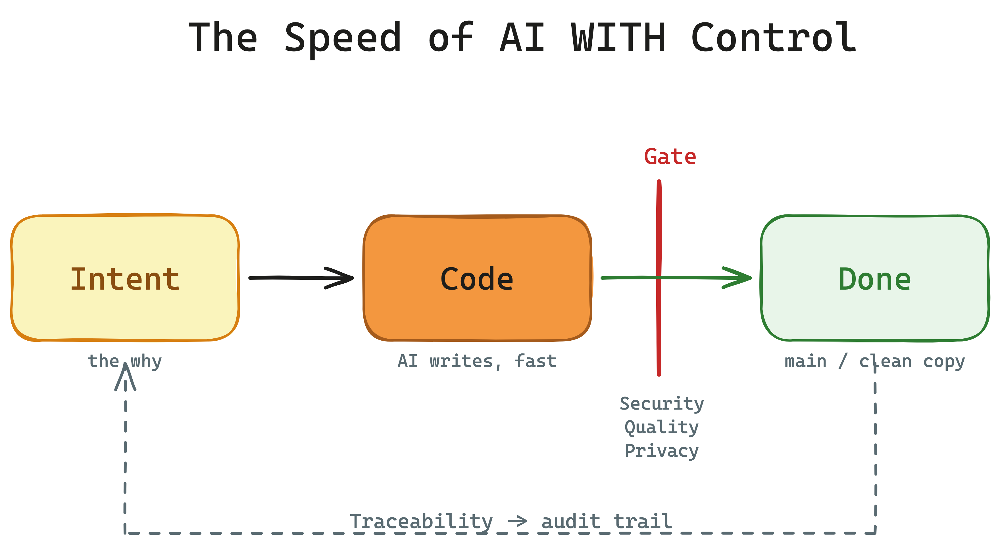

# Elevator Pitch — INTENTRON

A 60-second pitch, for people with no prior knowledge. Meant for pitching at a whiteboard or for an off-the-cuff explanation when someone asks: "So what is it you actually do?"

This is the **short** form. Anyone who has a meeting's worth of time and wants to be convinced gets the full **30-minute presentation** (`intentron-pitch.html` in this folder — just open it in a browser). Background and how it compares to other frameworks: [README](../../README.md).

---

## The pitch (~60 seconds, spoken)

> Picture a factory where a robot arm assembles in seconds what would take a person hours. That is exactly what is happening in software right now: AI writes code at blinding speed. The problem isn't the speed — it's that, at the end, nobody knows anymore **what** was built, **why**, or whether it's safe. A fast robot arm with no final inspection also produces scrap fast — and you only notice months later, in a security or data-protection audit.
>
> INTENTRON puts that final inspection up front. It is not an autonomous AI that just builds away — it's a guided assembly line. First the **intent** is captured: what is this actually supposed to do. Then the AI writes the code. And before anything is merged into the finished state, automatic checks run — security, quality, privacy. Whatever fails the check doesn't get through. And everything stays traceable: for any line, you can later say why it's there.
>
> The result is the speed of AI — but with the control a company, an internal audit or compliance needs. Fast **and** auditable. The method behind it comes from Matthias Schrader's book "Code Crash".

*(Pitch word count: ~210 words — at a natural speaking pace roughly 60–70 seconds. Pressed for time, trim the last paragraph to its first sentence.)*

---

## Whiteboard script

You draw along while you talk — five strokes are enough. This script matches the pitch sketch in this folder.

1. Draw a **box on the left** labelled **"Intent"** (the why). Say: "First we capture what is even supposed to be built."
2. **Arrow to the right** to a second box, **"Code"**. Say: "Then the AI writes it — fast."
3. **Gate symbol** (a vertical bar / barrier) right after "Code". Say: "This is where control sits. Three checks: security, quality, privacy."
4. **Arrow through the gate** to a box **"Done"** (`main` / the clean copy). Say: "Only what's green gets through. The rest stays out."
5. Draw a **dashed line back** from "Done" to "Intent". Say: "And every finished line can be traced back to the original intent — that's the trail for the audit."

If you want only three strokes: box **Intent** → box **Code** → **gate** → **Done**. The traceability line is the flourish.

---

## Variants by audience

- **Leadership / audit:** "You get the speed of AI without giving up control. Every change is justified, checked and traceable — the audit evidence is produced automatically, not the moment the auditor asks for it."
- **Engineering:** "Your rules — tests, security thresholds, privacy — live in *one* place and are enforced automatically before every merge, instead of being prose nobody reads. And it's tool-neutral, not bound to a single AI tool."
