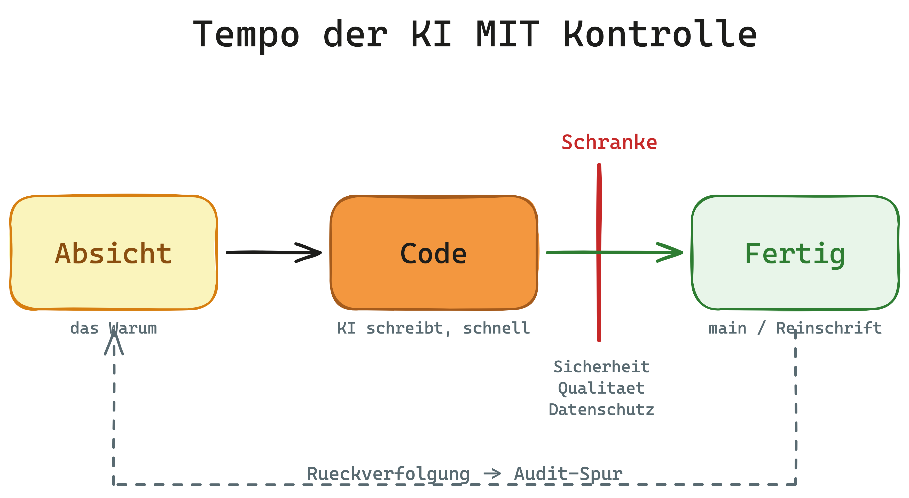

# Elevator-Pitch — INTENTRON

60-Sekunden-Pitch, für Menschen ohne Vorwissen. Gedacht zum Pitchen am Whiteboard oder als Tür-und-Angel-Erklärung, wenn jemand fragt: „Was macht ihr da eigentlich?"

Das ist die **kurze** Form. Wer eine Sitzung Zeit hat und überzeugt werden will, bekommt die ausführliche **30-Minuten-Präsentation** (`intentron-pitch.html` in diesem Ordner, einfach im Browser öffnen). Hintergrund und Vergleich mit anderen Frameworks: [README](../../README.md).

---

## Der Pitch (~60 Sekunden, gesprochen)

> Stell dir eine Fabrik vor, in der ein Roboterarm in Sekunden zusammenbaut, wofür ein Mensch Stunden bräuchte. Genau das passiert gerade beim Programmieren: KI schreibt Code rasend schnell. Das Problem ist nicht das Tempo — es ist, dass am Ende niemand mehr weiß, **was** da gebaut wurde, **warum**, und ob es sicher ist. Der schnelle Roboterarm ohne Endkontrolle produziert eben auch schnell Ausschuss — und das fällt erst Monate später auf, im Sicherheits- oder Datenschutz-Audit.
>
> INTENTRON setzt diese Endkontrolle davor. Es ist keine autonome KI, die einfach drauflosbaut, sondern ein geführtes Fließband: Zuerst wird die **Absicht** festgehalten — was soll das eigentlich können. Dann schreibt die KI den Code. Und bevor irgendetwas in den fertigen Stand übernommen wird, laufen automatische Kontrollen — Sicherheit, Qualität, Datenschutz. Was die Prüfung nicht besteht, kommt nicht durch. Und alles bleibt nachvollziehbar: Man kann später zu jeder Zeile sagen, warum sie da ist.
>
> Das Ergebnis ist das Tempo der KI — aber mit der Kontrolle, die ein Unternehmen, eine Revision oder die Compliance braucht. Schnell **und** prüfbar. Die Methode dahinter stammt aus Matthias Schraders Buch „Code Crash".

*(Wortzahl Pitch-Text: ~205 Wörter — im Vortrag mit natürlichem Tempo ca. 60–70 Sekunden. Bei knapper Zeit den letzten Absatz auf den ersten Satz kürzen.)*

---

## Whiteboard-Skript

Beim Reden malt man parallel mit — fünf Striche reichen. Diese Anleitung passt zum Pitch-Sketch in diesem Ordner.

1. **Box links** malen, beschriftet **„Absicht"** (das Warum). Dazu sagen: „Erst halten wir fest, was überhaupt gebaut werden soll."
2. **Pfeil nach rechts** zu einer zweiten Box **„Code"**. Dazu: „Dann schreibt die KI — schnell."
3. **Schranken-Symbol** (senkrechter Balken / Gate) hinter „Code". Dazu: „Hier sitzt die Kontrolle. Drei Prüfungen: Sicherheit, Qualität, Datenschutz."
4. **Pfeil durch die Schranke** zu einer Box **„Fertig"** (`main` / Reinschrift). Dazu: „Nur was grün ist, kommt durch. Der Rest bleibt draußen."
5. **Gestrichelte Linie zurück** von „Fertig" zu „Absicht" ziehen. Dazu: „Und jede fertige Zeile lässt sich bis zur ursprünglichen Absicht zurückverfolgen — das ist die Spur fürs Audit."

Wer nur drei Striche will: Box **Absicht** → Box **Code** → **Schranke** → **Fertig**. Die Rückverfolgungs-Linie ist die Kür.

---

## Varianten je nach Gegenüber

- **Geschäftsführung / Audit:** „Ihr bekommt das Tempo der KI, ohne die Kontrolle abzugeben. Jede Änderung ist begründet, geprüft und nachvollziehbar — die Belege fürs Audit entstehen automatisch, nicht erst, wenn die Revision danach fragt."
- **Technik / Entwicklung:** „Eure Regeln — Tests, Sicherheitsschwellen, Datenschutz — liegen an *einer* Stelle und werden vor jedem Merge automatisch erzwungen, statt als Prosa, die keiner liest. Und das tool-neutral, nicht an ein einzelnes KI-Werkzeug gebunden."
