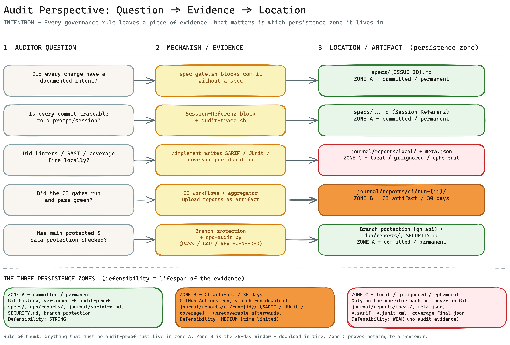

# Runbook: Audit Perspective — question, evidence, location

> **Audience:** Auditor — cyber-security auditor (verifies that the security and data-protection
> rules were followed) **and** code-quality auditor (verifies that the quality and governance rules
> were followed), internal or external.
>
> In under 10 minutes this runbook answers your one core question: *If a team built with this
> framework — where do I find the evidence that the rules fired, and how defensible is each
> individual piece of evidence?*
>
> **No new machinery.** This document invents nothing. All evidence already exists in the repo. The
> runbook is a pure **aggregator**: it bundles the existing gates, hooks, workflows, and reports
> into a checkable list so you can look up *which question* is answered by *which evidence* at
> *which location* — without having to read the whole [HANDBUCH](../../HANDBUCH.md) first.

---

## In one sentence

Every governance rule in the framework leaves a visible artifact — a spec, a hook block, a CI run,
a report — and the auditor checks the **existence and status** of these artifacts, not the code
behind them; the only thing that matters is **which persistence zone** a piece of evidence lives in,
because that determines how defensible it is in front of a reviewer.

---

## The big picture



An auditor does not want to read the code, they want **evidence**: reproducible artifacts that show
the process ran. The framework is built so that every rule leaves a trail. The core question for you
is not "does the evidence exist?" but "**how long does it exist, and where?**" — because that
determines whether it is audit-proof or could be gone tomorrow. That is exactly what the three
persistence zones below classify.

---

## Three principles for every check

1. **Evidence before assertion.** "The linter ran" does not count — the SARIF report counts. You
   demand the artifact, not the narrative.
2. **The persistence zone decides defensibility.** The same report is worthless as a gitignored file
   and audit-proof as a committed artifact. Before you accept any evidence, establish which zone it
   lives in (see the next section).
3. **Convention ≠ enforcement.** Some safeguards (the four-eyes principle) are documented operator
   discipline, not an enforced mechanism. You must know what is *enforced* versus what is *agreed*
   (see caveats).

---

## The three persistence zones — the heart of it

Evidence is not equally defensible. Where an artifact lives decides whether it holds up in front of
a reviewer. Three zones, from ephemeral to audit-proof:

| Zone | Where | Lifespan | Defensibility | Typical artifacts |
|---|---|---|---|---|
| **C — local, gitignored** | only on the operator machine, under `journal/reports/local/` | ephemeral — disappears with the machine, never in Git | **weak.** Pure working signal, no audit evidence | `eslint-iter{N}.sarif`, `tests-iter{N}.junit.xml`, `coverage-final.json`, `semgrep-final.sarif`, `meta.json` |
| **B — CI artifact** | GitHub Actions run, retrievable via `gh run download` | **30 days** retention, then unrecoverable | **medium.** Server-side, harder to tamper with than local — but time-limited | `journal/reports/ci/run-{id}/` (SARIF / JUnit / coverage) |
| **A — committed/permanent** | in the project repo, in the Git history | permanent, versioned | **strong.** Audit-proof: you can always answer which state applied at which commit | `specs/{ISSUE-ID}.md` (with `## Session-Referenz`), `dpo/reports/<date>_audit.{md,json}`, `dpo/controls/*.yml`, `journal/sprint-{date}.md`, `SECURITY.md`, `ARCHITECTURE_DESIGN.md`, `.github/workflows/`, branch protection, Git history |

**What this means in practice.** A gitignored ESLint SARIF in zone C proves nothing to a reviewer —
it lives on one laptop. For every finding, demand the ascent to a higher zone: the CI artifact
(zone B) as run-proof, and for permanent evidence the committed artifact (zone A). **Rule of thumb:
anything that must be audit-proof must live in zone A.** Zone B is your time window — download
important CI artifacts before the 30 days expire.

---

## Audit question → evidence/mechanism → artifact/location

The core table. Each row answers an audit question with a concrete piece of evidence at a concrete
location. Tools, runbooks, and catalogs are linked; project-local files (e.g. `specs/{ISSUE-ID}.md`,
`meta.json`) stay as code spans because they are created in your project, not in the framework repo.
The **Zone** column points to the persistence zone above.

| Audit question | Evidence/Mechanism | Artifact/Location | Zone |
|---|---|---|---|
| Did every change have a documented intent? | `spec-gate.sh` blocks any commit without a spec | `specs/{ISSUE-ID}.md`; [`verify-setup.sh`](../../bootstrap/references/verify-setup.sh) check 3 | A |
| Is every commit traceable to a prompt/session? | `## Session-Referenz` block + trace tool | `specs/{ISSUE-ID}.md`; [`audit-trace.sh`](../../bootstrap/scripts/audit-trace.sh); [CONVENTIONS §Audit-Trail](../../CONVENTIONS.md) | A |
| Did linters/SAST/coverage fire locally? | `/implement` writes SARIF/JUnit/coverage per iteration | `journal/reports/local/{date}_{story}/` + `meta.json` ([HANDBUCH Appendix E](../../HANDBUCH.md)). Ephemeral → use zone B/A for proof | C |
| Did unit tests run (existence)? | 6a-quart test gate writes JUnit XML + coverage per iteration | `journal/reports/local/{date}_{story}/tests-iter{N}.junit.xml`, `meta.json.iterations.tests`; [Unit-tests runbook](./unit-tests.en.md) | C |
| Are the tests **real** (quality, not just existence)? | Anti-placeholder check (hook `anti-placeholder-check.py`) flags empty/trivial tests + unjustified skips in the test gate (BOO-177) | [`specs/BOO-177.md`](../../specs/BOO-177.md); [Unit-tests runbook §Anti-placeholder](./unit-tests.en.md) | A |
| Did GitHub Actions run/go green? | CI workflows + aggregator uploads reports as artifact (30-day retention) | `journal/reports/ci/run-{id}/`; workflows under `.github/workflows/` (`docs-drift.yml` / `hook-sources.yml` / `ruff-hooks.yml`) | B |
| Can a merge bypass green gates? (Bypass) | Branch protection required status checks; CI as Layer 3 against `--no-verify` | [`setup-branch-protection.sh`](../../bootstrap/scripts/setup-branch-protection.sh) (BOO-29); `gh api .../branches/main/protection` | A |
| Is data-protection/compliance proven? | `dpo-audit.py` → PASS/GAP/REVIEW-NEEDED; sprint-review 7c | [`dpo-audit.py`](../../dpo/scripts/dpo-audit.py); `dpo/reports/<date>_audit.{md,json}`; catalogs [`gdpr.yml`](../../dpo/controls/gdpr.yml) / [`ndsg.yml`](../../dpo/controls/ndsg.yml) | A |
| Is the setup itself verified (hooks/tools)? | `verify-setup.sh` read-only PASS/WARN/FAIL | [`verify-setup.sh`](../../bootstrap/references/verify-setup.sh) ([HANDBUCH Appendix T](../../HANDBUCH.md)) | — |
| Is code quality provable with metrics? | Sprint-review writes `metrics:` frontmatter per sprint | `journal/sprint-{date}.md` frontmatter (`eslint_iterations_avg`, `semgrep_findings_total`, `coverage_trend`, `sonarqube_hotspots_*`, `ci_failures_top5`); [CONVENTIONS](../../CONVENTIONS.md) | A |
| Were findings moved into the backlog? | Sprint-review creates one story per GAP (label `privacy`) | [`sprint-review/SKILL.md`](../../sprint-review/SKILL.md) step 7/7c | A |
| Are model overrides traceable? | `override_audit[]` in `meta.json` | `meta.json.override_audit`; [schema](../../bootstrap/references/file-templates.en.md) | C |
| Are skipped gates documented? | `skipped_gates` (+ reason) in `meta.json` | `meta.json.skipped_gates`; [schema](../../bootstrap/references/file-templates.en.md) | C |
| Four-eyes on sensitive paths? | Convention (NOT enforced) — `git log` / `git blame`, author of gate ≠ author of change | [HANDBUCH Appendix R §Four-Eyes convention](../../HANDBUCH.md) | A |
| Does the project live its `governance_mode`? | Sprint-review step 1 "Governance Drift" | [`sprint-review/SKILL.md`](../../sprint-review/SKILL.md); [CONVENTIONS governance matrix](../../CONVENTIONS.md) | A |
| Are logging/monitoring requirements documented? | `observability.md` (three required sections) is referenced in `ARCHITECTURE_DESIGN.md §5/§6`; `/architecture-review` checks dimension #5 | `observability.md`; `ARCHITECTURE_DESIGN.md` §5/§6; [Logging & monitoring runbook](./logging-monitoring.md) | A |

---

## Which auditor pulls which artifacts

Two kinds of auditor read this runbook — and they pull different evidence. The audit trail
(commit → intent → session) and `governance_mode` drift are relevant to both; beyond that, the
evidence world splits:

| | **Cyber-security auditor** | **Code-quality auditor** |
|---|---|---|
| **Core question** | Were security and data-protection rules followed? | Were quality and governance rules followed? |
| **Primary artifacts** | [`SECURITY.md`](../../SECURITY.md); Semgrep SARIF (CI artifact); `dpo/reports/<date>_audit.{md,json}`; branch protection (`gh api .../protection`) | `coverage-final.json` / coverage trend; `ARCHITECTURE_DESIGN.md` (active quality dimensions §5); `journal/sprint-{date}.md` `metrics:`; `sonarqube_hotspots_*` |
| **Catalogs / ruleset** | OWASP/SAST findings; DPO catalogs [`gdpr.yml`](../../dpo/controls/gdpr.yml) / [`ndsg.yml`](../../dpo/controls/ndsg.yml) | Quality gates of the 4-layer architecture ([CONVENTIONS](../../CONVENTIONS.md)) |
| **Gates** | Sensitive-Paths Gate, Personal-Data-Paths Gate, Edit-Bodyguard (Layer 0) | Spec-Gate, doc-version-sync, coverage gate |
| **Deep-dive runbook** | [`ciso-security.en.md`](./ciso-security.en.md), [`dpo-privacy.en.md`](./dpo-privacy.en.md) | [`cto-code-quality.en.md`](./cto-code-quality.en.md) |

In practice the two overlap: a full audit walks both columns. The audit prompt below maps exactly
this duplication into **two modes**.

---

## How to check, concretely

The steps below can be worked top to bottom as an audit pass. All commands are read-only — they
change nothing in the repo.

### 1. Intent completeness: does every issue have a spec?

Every commit with an issue reference needs a spec — enforced by `hooks/spec-gate.sh`. Verify that a
spec file exists for every issue mentioned in the backlog/branch:

```bash
ls specs/                       # all existing specs
git log --oneline | head -30    # commits with issue prefix (e.g. "BOO-42: ...")
```

If a referenced issue has no `specs/{ISSUE-ID}.md`, the commit should never have gone through — or
the gate was bypassed (see step 4).

### 2. Reconstruct the audit trail: commit → intent → session

For each spec, [`audit-trace.sh`](../../bootstrap/scripts/audit-trace.sh) reconstructs the path from
the commit back to the conversation log:

```bash
bash bootstrap/scripts/audit-trace.sh BOO-42
```

The script reads the `## Session-Referenz` block from `specs/BOO-42.md` (commit SHA + session ID +
log path), shows the git commit diff, and renders the session turns. Missing fields are explicitly
reported as `unbekannt` (unknown) — which is itself an audit signal. Evidence in **zone A**
(committed).

### 3. Check CI status and CI artifacts (zone B)

The GitHub Actions are the persistent, server-side run source. Check the run and status:

```bash
gh run list --limit 20
gh run view <run-id>
gh run download <run-id> --name ci-reports-<run-id>   # SARIF/JUnit/coverage as artifact (30-day retention)
```

The workflows live under `.github/workflows/` (`docs-drift.yml`, `hook-sources.yml`,
`ruff-hooks.yml`). Every tool workflow ends with collect-into-`run-{id}/` + upload-artifact.
**Important:** after 30 days these artifacts are gone — download in time.

### 4. Bypass check: could someone merge past the gates?

Local hooks can be bypassed with `git commit --no-verify`. The defense is branch protection with
required status checks (CI as Layer 3). Check the active configuration:

```bash
gh api repos/{owner}/{repo}/branches/main/protection
```

Expect `required_status_checks` (the CI checks) and `required_pull_request_reviews`. This is set by
[`setup-branch-protection.sh`](../../bootstrap/scripts/setup-branch-protection.sh) (BOO-29). If
protection is missing, a local `--no-verify` bypass is not caught by CI.

### 5. Prove data-protection compliance (security branch)

The DPO audit runner produces a reproducible, committed report pair (**zone A**):

```bash
ls dpo/reports/                              # <date>_audit.md + <date>_audit.json
cat dpo/reports/<date>_audit.md              # PASS / GAP / REVIEW-NEEDED per control
ls dpo/controls/                             # versioned catalogs: gdpr.yml, ndsg.yml
```

[`dpo/scripts/dpo-audit.py`](../../dpo/scripts/dpo-audit.py) works the catalog deterministically:
mechanical checks yield PASS/GAP, judgment checks yield REVIEW-NEEDED. The auditor reviews the GAP
list and whether the REVIEW-NEEDED items were confirmed by the operator. Depth:
[`dpo-privacy.en.md`](./dpo-privacy.en.md).

### 6. Inspect sprint metrics (code-quality branch)

Sprint-review aggregates the quality metrics per sprint into the sprint file's frontmatter
(**zone A**):

```bash
ls journal/sprint-*.md
sed -n '1,30p' journal/sprint-<date>.md      # metrics: block: eslint_iterations_avg, semgrep_findings_total,
                                             # coverage_trend, ci_failures_top5, sonarqube_hotspots_*
```

The fields are defined as a frontmatter schema in [CONVENTIONS.md](../../CONVENTIONS.md). They give
the quality trend over time — and they are committed, so audit-proof.

### 7. Code-quality evidence and skipped gates

The code-quality branch additionally pulls the architecture dimensions and the iteration metadata:

```bash
sed -n '/## 5/,/## 6/p' ARCHITECTURE_DESIGN.md   # active quality dimensions (in the project)
cat journal/reports/local/*/coverage-final.json  # gitignored (zone C) — local only
cat journal/reports/local/*/meta.json            # skipped_gates (+reason), change_type, iterations.*
```

`meta.json.skipped_gates` is the honest audit point: if a gate was deliberately skipped, the reason
is here. The field lives in **zone C** (gitignored) — the defensible proof that the gates ran comes
from the CI artifacts (step 3). Schema:
[`file-templates.en.md`](../../bootstrap/references/file-templates.en.md).

**Unit tests: existence and quality.** The test run (gate 6a-quart) leaves `tests-iter{N}.junit.xml`
and the counter `meta.json.iterations.tests` per iteration (zone C) — that proves **that** tests ran.
Whether the tests are **real** (no empty/trivial bodies, no unjustified skips) is secured by the
**anti-placeholder check** (hook `anti-placeholder-check.py` in the same gate, BOO-177). For the auditor this means:
the coverage number alone is not a quality proof — test existence (JUnit XML) and test quality
(anti-placeholder check) are two separate pieces of evidence. Detailed flow:
[`unit-tests.en.md`](./unit-tests.en.md).

### 8. Four-eyes spot check (convention, not enforced)

```bash
verify-setup.sh   # read-only PASS/WARN/FAIL over hooks, toolchain, core artifacts (Appendix T)
git blame -- path/to/sensitive/file   # four-eyes indicator: author of the review-ok gate ≠ author of the change
```

Indicator: author of the `review-ok`/`privacy-ok` gate ≠ author of the actual change. The framework
does not enforce this (see caveats) — it is a manual spot check.

---

## Audit prompt (copy-paste)

The following prompt lets an AI assistant run the audit pass in a structured way. It has **two
modes** — pick one per role. The prompt is **read-only**: it changes nothing, it collects evidence
and reports gaps.

```text
ROLE: You are an auditor for a repo built with the INTENTRON framework.
MODE: [SECURITY | CODE-QUALITY]   ← pick exactly one
SCOPE: Strictly read-only. Change NOTHING in the repo. No commits, no edits, no pushes.
       Evidence before assertions: only accept artifacts that really exist. What you cannot
       find, you mark as "unknown" — never guess, never invent.
       Mind the persistence zone of each piece of evidence (A=committed, B=CI artifact/30 days, C=local/ephemeral).

8-STEP SCAN:
1. Intent completeness: `ls specs/` and `git log --oneline | head -30`.
   Does every issue in the log have a spec? Note missing specs.
2. Audit-trail spot check: for 2-3 specs, `bash bootstrap/scripts/audit-trace.sh <ISSUE-ID>`.
   Are commit SHA, session ID, log path set? Note "unknown" fields.
3. CI truth: `gh run list --limit 20`, `gh run view <run-id>`,
   `gh run download <run-id>`. Did the workflows run, are they green, are there artifacts (zone B)?
4. Bypass/branch-protection: `gh api repos/{owner}/{repo}/branches/main/protection`.
   Are required_status_checks and required_pull_request_reviews set?
5. [SECURITY] Privacy report: `ls dpo/reports/`, `cat dpo/reports/<date>_audit.md`.
   Check the GAP list and REVIEW-NEEDED confirmations.
6. Sprint metrics: `ls journal/sprint-*.md`, read the `metrics:` frontmatter
   (coverage_trend, semgrep_findings_total, sonarqube_hotspots_*, ci_failures_top5).
7. [CODE-QUALITY] Code-quality branch: ARCHITECTURE_DESIGN.md §5 (active quality dimensions),
   coverage-final.json, `meta.json.skipped_gates` (reason per skipped gate).
8. Four-eyes spot check: `git blame` on 1-2 sensitive paths.
   Is the author of the review-ok/privacy-ok gate ≠ author of the change?

OUTPUT:
A) Table: | Audit question | Evidence found (yes/no/unknown) | Location + zone |
B) Gap list: every missing piece of evidence, or one that lives only in zone C, with a reason.
C) Recommendation: prioritized next steps (e.g. "secure CI artifact before the 30 days expire",
   "supply the missing spec for BOO-NN", "enable branch protection").

MODE NOTE:
- SECURITY pulls primarily: SECURITY.md, Semgrep SARIF, dpo/reports/, branch protection (step 5 active).
- CODE-QUALITY pulls primarily: coverage, ARCHITECTURE_DESIGN, sprint-metrics, sonarqube (step 7 active).
```

---

## Caveats

- **Zone C is not audit evidence.** Local reports under `journal/reports/local/` are short-lived
  signal and live only on the operator machine. For defensible proof, the CI artifacts under
  `journal/reports/ci/run-{id}/` apply (zone B, **30-day retention** — not retrievable after that)
  or committed artifacts (zone A).
- **Session-log retention.** `audit-trace.sh` reconstructs the conversation log only as long as the
  session log exists. The script recommends keeping session logs for 90 days, then archiving or
  deleting them. Older logs can no longer be rendered; commit SHA and spec (zone A) remain, the
  prompt history does not.
- **Four-eyes is convention, not enforced.** The framework does **not** currently enforce the
  four-eyes principle for sensitive and personal-data paths (BOO-72 explicitly excludes
  enforcement). It is documented operator discipline
  ([HANDBUCH Appendix R §Four-Eyes convention](../../HANDBUCH.md)). The auditor checks it manually
  via `git log` / `git blame`.
- **Gates enforce the *run*, not the *correctness* of every assessment.** A green gate proves the
  check took place — not that every classification (e.g. MEDIUM instead of HIGH) was correct. That
  remains human judgment.

---

## Further reading

| Topic | Source |
|---|---|
| Business case: why invest in the framework at all | [`ceo-business-case.en.md`](./ceo-business-case.en.md) |
| Security view: which gatekeepers fire, what they leave behind | [`ciso-security.en.md`](./ciso-security.en.md) |
| Privacy view: DPO catalogs, gates, deterministic audit | [`dpo-privacy.en.md`](./dpo-privacy.en.md) |
| Code-quality view: quality gates, coverage, architecture dimensions | [`cto-code-quality.en.md`](./cto-code-quality.en.md) |
| Unit-test flow in detail: gate 6a-quart, JUnit XML, anti-placeholder check | [`unit-tests.en.md`](./unit-tests.en.md) |
| Compliance mechanics end-to-end (gates vs. catalogs, lifecycle) | [`../compliance/compliance-mechanik.en.md`](../compliance/compliance-mechanik.en.md) |
| Which artifact is signed off by whom and where it lives | [`../onboarding/artefakt-landkarte.en.md`](../onboarding/artefakt-landkarte.en.md) |
| Reports convention, `meta.json` schema, persistence zones in detail | [`../../HANDBUCH.md`](../../HANDBUCH.md) — Appendix E |
| Post-install verification (`verify-setup.sh`) | [`../../HANDBUCH.md`](../../HANDBUCH.md) — Appendix T |
| Look up terms | [`../glossar.md`](../glossar.md) |

---

> *German version: [`audit-perspective.md`](./audit-perspective.md).*
