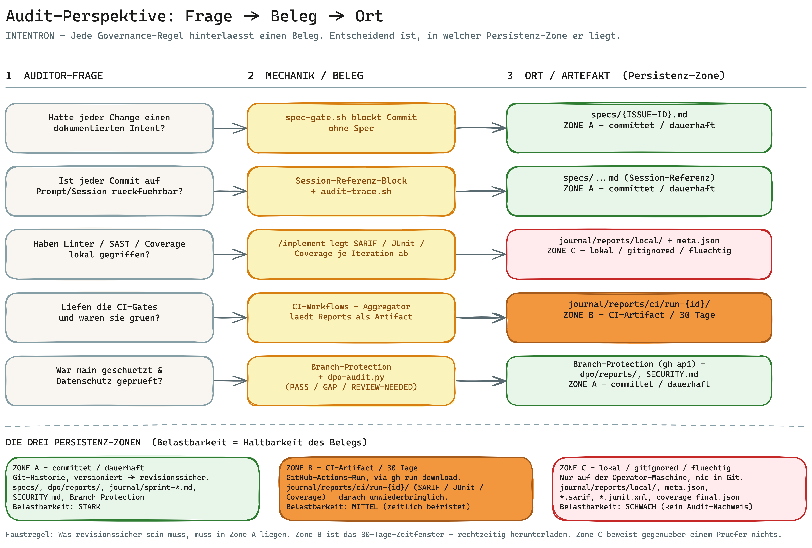

# Runbook: Audit-Perspektive — Frage, Beleg, Ort

> **Zielgruppe:** Auditor:in — Cyber-Security-Auditor:in (prüft, ob die Sicherheits- und
> Datenschutz-Regeln eingehalten wurden) **und** Code-Quality-Auditor:in (prüft, ob die
> Qualitäts- und Governance-Regeln eingehalten wurden), intern oder extern.
>
> In unter 10 Minuten beantwortet dieses Runbook Ihre eine Kernfrage: *Wenn ein Team mit diesem
> Framework entwickelt hat — wo finde ich die Belege, dass die Regeln gegriffen haben, und wie
> belastbar ist jeder einzelne Beleg?*
>
> **Keine neue Mechanik.** Dieses Dokument erfindet nichts dazu. Alle Belege existieren bereits im
> Repo. Das Runbook ist reiner **Aggregator**: Es bündelt die vorhandenen Gates, Hooks, Workflows
> und Reports zu einer prüfbaren Liste, damit Sie nachschlagen können, *welche Frage* mit *welchem
> Beleg* an *welchem Ort* beantwortet wird — ohne erst das ganze [HANDBUCH](../../HANDBUCH.md) zu
> lesen.

---

## In einem Satz

Jede Governance-Regel des Frameworks hinterlässt ein sichtbares Artefakt — eine Spec, einen
Hook-Block, einen CI-Run, einen Report — und der Auditor prüft **Existenz und Status** dieser
Artefakte, nicht den Code dahinter; entscheidend ist dabei nur, **in welcher Persistenz-Zone** ein
Beleg liegt, denn das bestimmt, wie belastbar er vor einem Prüfer ist.

---

## Das Big Picture



Ein Auditor will nicht den Code lesen, sondern **Belege**: reproduzierbare Artefakte, die zeigen,
dass der Prozess gelaufen ist. Das Framework ist so gebaut, dass jede Regel eine Spur hinterlässt.
Die zentrale Frage für Sie ist nicht „existiert der Beleg?", sondern „**wie lange existiert er und
wo?**" — denn davon hängt ab, ob er revisionssicher ist oder schon morgen verschwunden sein kann.
Genau das ordnen die drei Persistenz-Zonen weiter unten.

---

## Drei Grundsätze jeder Prüfung

1. **Beleg vor Behauptung.** „Der Linter ist gelaufen" zählt nicht — der SARIF-Report zählt. Sie
   verlangen das Artefakt, nicht die Erzählung.
2. **Die Persistenz-Zone entscheidet über die Belastbarkeit.** Derselbe Report ist als
   gitignored-Datei wertlos und als committetes Artefakt revisionssicher. Bevor Sie einen Beleg
   akzeptieren, klären Sie, in welcher Zone er liegt (siehe nächster Abschnitt).
3. **Konvention ≠ Enforcement.** Einige Schutzmaßnahmen (Vier-Augen-Prinzip) sind dokumentierte
   Operator-Disziplin, kein erzwungener Mechanismus. Sie müssen wissen, was *erzwungen* und was
   *vereinbart* ist (siehe Caveats).

---

## Die drei Persistenz-Zonen — das Herzstück

Belege sind nicht gleich belastbar. Wo ein Artefakt liegt, entscheidet, ob es vor einem Prüfer
standhält. Drei Zonen, von flüchtig nach revisionssicher:

| Zone | Wo | Lebensdauer | Belastbarkeit | Typische Artefakte |
|---|---|---|---|---|
| **C — lokal, gitignored** | nur auf der Operator-Maschine, unter `journal/reports/local/` | flüchtig — verschwindet mit der Maschine, nie in Git | **schwach.** Reines Arbeitssignal, kein Audit-Nachweis | `eslint-iter{N}.sarif`, `tests-iter{N}.junit.xml`, `coverage-final.json`, `semgrep-final.sarif`, `meta.json` |
| **B — CI-Artifact** | GitHub-Actions-Run, abrufbar via `gh run download` | **30 Tage** Retention, danach unwiederbringlich | **mittel.** Server-seitig, manipulationsärmer als lokal — aber zeitlich befristet | `journal/reports/ci/run-{id}/` (SARIF / JUnit / Coverage) |
| **A — committet/dauerhaft** | im Projekt-Repo, in der Git-Historie | dauerhaft, versioniert | **stark.** Revisionssicher: jederzeit beantwortbar, welcher Stand bei welchem Commit galt | `specs/{ISSUE-ID}.md` (mit `## Session-Referenz`), `dpo/reports/<date>_audit.{md,json}`, `dpo/controls/*.yml`, `journal/sprint-{date}.md`, `SECURITY.md`, `ARCHITECTURE_DESIGN.md`, `.github/workflows/`, Branch-Protection, Git-Historie |

**Was das praktisch heißt.** Ein gitignored ESLint-SARIF in Zone C beweist gar nichts gegenüber
einem Prüfer — es liegt nur auf einem Laptop. Verlangen Sie für jeden Befund den Aufstieg in eine
höhere Zone: Das CI-Artifact (Zone B) als Lauf-Nachweis, und für den dauerhaften Beleg das
committete Artefakt (Zone A). **Faustregel: Was revisionssicher sein muss, muss in Zone A liegen.**
Zone B ist Ihr Zeitfenster — laden Sie wichtige CI-Artifacts vor Ablauf der 30 Tage herunter.

---

## Audit-Frage → Beleg/Mechanik → Artefakt/Ort

Die Kerntabelle. Jede Zeile beantwortet eine Audit-Frage mit einem konkreten Beleg an einem
konkreten Ort. Werkzeuge, Runbooks und Kataloge sind verlinkt; projekt-lokal entstehende Dateien
(z. B. `specs/{ISSUE-ID}.md`, `meta.json`) bleiben als Code-Span, weil sie erst in Ihrem Projekt
entstehen, nicht im Framework-Repo. Die Spalte **Zone** verweist auf die Persistenz-Zone oben.

| Audit-Frage | Beleg/Mechanik | Artefakt/Ort | Zone |
|---|---|---|---|
| Hatte jeder Change einen dokumentierten Intent? | `spec-gate.sh` blockiert Commit ohne Spec | `specs/{ISSUE-ID}.md`; [`verify-setup.sh`](../../bootstrap/references/verify-setup.sh) Check 3 | A |
| Jeder Commit auf Prompt/Session rückführbar? | `## Session-Referenz`-Block + Trace-Werkzeug | `specs/{ISSUE-ID}.md`; [`audit-trace.sh`](../../bootstrap/scripts/audit-trace.sh); [CONVENTIONS §Audit-Trail](../../CONVENTIONS.md) | A |
| Haben Linter/SAST/Coverage lokal gegriffen? | `/implement` legt SARIF/JUnit/Coverage je Iteration ab | `journal/reports/local/{date}_{story}/` + `meta.json` ([HANDBUCH Anhang E](../../HANDBUCH.md)). Flüchtig → für den Nachweis Zone B/A | C |
| Liefen Unit-Tests (Existenz)? | Test-Gate 6a-quart schreibt JUnit-XML + Coverage je Iteration | `journal/reports/local/{date}_{story}/tests-iter{N}.junit.xml`, `meta.json.iterations.tests`; [Runbook Unit-Tests](./unit-tests.md) | C |
| Sind die Tests **echt** (Qualität, nicht nur Existenz)? | Anti-Platzhalter-Check (Hook `anti-placeholder-check.py`) flaggt leere/triviale Tests + unbegründete Skips im Test-Gate (BOO-177) | [`specs/BOO-177.md`](../../specs/BOO-177.md); [Runbook Unit-Tests §Anti-Platzhalter](./unit-tests.md) | A |
| GitHub Actions gelaufen/grün? | CI-Workflows + Aggregator lädt Reports als Artifact (Retention 30 T.) | `journal/reports/ci/run-{id}/`; Workflows unter `.github/workflows/` (`docs-drift.yml` / `hook-sources.yml` / `ruff-hooks.yml`) | B |
| Merge ohne grüne Gates möglich? (Bypass) | Branch-Protection Required Status Checks; CI als Layer 3 gegen `--no-verify` | [`setup-branch-protection.sh`](../../bootstrap/scripts/setup-branch-protection.sh) (BOO-29); `gh api .../branches/main/protection` | A |
| Datenschutz/Compliance nachgewiesen? | `dpo-audit.py` → PASS/GAP/REVIEW-NEEDED; Sprint-Review 7c | [`dpo-audit.py`](../../dpo/scripts/dpo-audit.py); `dpo/reports/<date>_audit.{md,json}`; Kataloge [`gdpr.yml`](../../dpo/controls/gdpr.yml) / [`ndsg.yml`](../../dpo/controls/ndsg.yml) | A |
| Setup selbst verifiziert (Hooks/Tools)? | `verify-setup.sh` read-only PASS/WARN/FAIL | [`verify-setup.sh`](../../bootstrap/references/verify-setup.sh) ([HANDBUCH Anhang T](../../HANDBUCH.md)) | — |
| Code-Qualität messbar belegt? | Sprint-Review schreibt `metrics:`-Frontmatter je Sprint | `journal/sprint-{date}.md` Frontmatter (`eslint_iterations_avg`, `semgrep_findings_total`, `coverage_trend`, `sonarqube_hotspots_*`, `ci_failures_top5`); [CONVENTIONS](../../CONVENTIONS.md) | A |
| Findings in Backlog überführt? | Sprint-Review legt pro GAP eine Story an (Label `privacy`) | [`sprint-review/SKILL.md`](../../sprint-review/SKILL.md) Schritt 7/7c | A |
| Modell-Overrides nachvollziehbar? | `override_audit[]` in `meta.json` | `meta.json.override_audit`; [Schema](../../bootstrap/references/file-templates.md) | C |
| Übersprungene Gates dokumentiert? | `skipped_gates` (+ Grund) in `meta.json` | `meta.json.skipped_gates`; [Schema](../../bootstrap/references/file-templates.md) | C |
| Vier-Augen bei sensiblen Pfaden? | Konvention (NICHT erzwungen) — `git log` / `git blame`, Author Gate ≠ Author Change | [HANDBUCH Anhang R §Vier-Augen-Konvention](../../HANDBUCH.md) | A |
| Lebt das Projekt seinen `governance_mode`? | Sprint-Review Schritt 1 „Governance Drift" | [`sprint-review/SKILL.md`](../../sprint-review/SKILL.md); [CONVENTIONS Governance-Matrix](../../CONVENTIONS.md) | A |

---

## Welcher Auditor zieht welche Artefakte

Zwei Spielarten von Auditor:innen lesen dieses Runbook — und sie ziehen unterschiedliche Belege.
Der Audit-Trail (Commit → Intent → Session) und der `governance_mode`-Drift sind für beide relevant;
darüber hinaus teilt sich die Belegwelt:

| | **Cyber-Security-Auditor:in** | **Code-Quality-Auditor:in** |
|---|---|---|
| **Kernfrage** | Wurden Security- und Datenschutz-Regeln eingehalten? | Wurden Qualitäts- und Governance-Regeln eingehalten? |
| **Primäre Artefakte** | [`SECURITY.md`](../../SECURITY.md); Semgrep-SARIF (CI-Artifact); `dpo/reports/<date>_audit.{md,json}`; Branch-Protection (`gh api .../protection`) | `coverage-final.json` / Coverage-Trend; `ARCHITECTURE_DESIGN.md` (aktive Quality-Dimensionen §5); `journal/sprint-{date}.md` `metrics:`; `sonarqube_hotspots_*` |
| **Kataloge / Regelwerk** | OWASP-/SAST-Findings; DPO-Kataloge [`gdpr.yml`](../../dpo/controls/gdpr.yml) / [`ndsg.yml`](../../dpo/controls/ndsg.yml) | Quality-Gates der 4-Layer-Architektur ([CONVENTIONS](../../CONVENTIONS.md)) |
| **Gates** | Sensitive-Paths-Gate, Personal-Data-Paths-Gate, Edit-Bodyguard (Layer 0) | Spec-Gate, doc-version-sync, Coverage-Gate |
| **Vertiefendes Runbook** | [`ciso-security.md`](./ciso-security.md), [`dpo-privacy.md`](./dpo-privacy.md) | [`cto-code-quality.md`](./cto-code-quality.md) |

In der Praxis überlappen sich beide: Eine vollständige Prüfung läuft beide Spalten ab. Der
Audit-Prompt unten bildet genau diese Doppelung in **zwei Modi** ab.

---

## So prüfst du konkret

Die folgenden Schritte lassen sich von oben nach unten als Audit-Durchlauf abarbeiten. Alle
Kommandos sind read-only — sie ändern nichts am Repo.

### 1. Intent-Lückenlosigkeit: hat jeder Issue eine Spec?

Jeder Commit mit Issue-Referenz braucht eine Spec — erzwungen durch `hooks/spec-gate.sh`. Prüfe,
dass zu jedem im Backlog/Branch erwähnten Issue ein Spec-File existiert:

```bash
ls specs/                       # alle vorhandenen Specs
git log --oneline | head -30    # Commits mit Issue-Präfix (z.B. "BOO-42: ...")
```

Fehlt zu einem referenzierten Issue die `specs/{ISSUE-ID}.md`, hätte der Commit gar nicht
durchlaufen dürfen — oder das Gate wurde umgangen (siehe Schritt 5).

### 2. Audit-Trail rekonstruieren: Commit → Intent → Session

Für jede Spec rekonstruiert [`audit-trace.sh`](../../bootstrap/scripts/audit-trace.sh) den Pfad vom
Commit zurück zum Konversations-Log:

```bash
bash bootstrap/scripts/audit-trace.sh BOO-42
```

Das Script liest den `## Session-Referenz`-Block aus `specs/BOO-42.md` (Commit-SHA + Session-ID +
Log-Pfad), zeigt den Git-Commit-Diff und rendert die Session-Turns. Fehlende Felder werden explizit
als `unbekannt` ausgewiesen — das ist selbst ein Audit-Signal. Beleg in **Zone A** (committet).

### 3. CI-Status und CI-Artifacts prüfen (Zone B)

Die GitHub Actions sind die persistente, server-seitige Lauf-Quelle. Prüfe Lauf und Status:

```bash
gh run list --limit 20
gh run view <run-id>
gh run download <run-id> --name ci-reports-<run-id>   # SARIF/JUnit/Coverage als Artifact (Retention 30 Tage)
```

Die Workflows liegen unter `.github/workflows/` (`docs-drift.yml`, `hook-sources.yml`,
`ruff-hooks.yml`). Jeder Tool-Workflow endet mit Collect-into-`run-{id}/` + Upload-Artifact.
**Wichtig:** Nach 30 Tagen sind diese Artifacts weg — rechtzeitig herunterladen.

### 4. Bypass-Prüfung: konnte jemand an den Gates vorbei mergen?

Lokale Hooks lassen sich mit `git commit --no-verify` umgehen. Die Abwehr dagegen ist
Branch-Protection mit Required Status Checks (CI als Layer 3). Prüfe die aktive Konfiguration:

```bash
gh api repos/{owner}/{repo}/branches/main/protection
```

Erwartet werden `required_status_checks` (die CI-Checks) und `required_pull_request_reviews`.
Gesetzt wird das durch [`setup-branch-protection.sh`](../../bootstrap/scripts/setup-branch-protection.sh)
(BOO-29). Fehlt der Schutz, ist ein lokaler `--no-verify`-Bypass nicht durch CI abgefangen.

### 5. Datenschutz-Compliance nachweisen (Security-Zweig)

Der DPO-Audit-Runner produziert ein reproduzierbares, committetes Report-Paar (**Zone A**):

```bash
ls dpo/reports/                              # <date>_audit.md + <date>_audit.json
cat dpo/reports/<date>_audit.md              # PASS / GAP / REVIEW-NEEDED je Control
ls dpo/controls/                             # versionierte Kataloge: gdpr.yml, ndsg.yml
```

[`dpo/scripts/dpo-audit.py`](../../dpo/scripts/dpo-audit.py) arbeitet den Katalog deterministisch
ab: mechanische Checks ergeben PASS/GAP, Urteils-Checks ergeben REVIEW-NEEDED. Der Auditor prüft die
GAP-Liste und ob die REVIEW-NEEDED-Punkte vom Operator bestätigt wurden. Tiefe:
[`dpo-privacy.md`](./dpo-privacy.md).

### 6. Sprint-Metriken sichten (Code-Quality-Zweig)

Sprint-Review aggregiert die Qualitätsmetriken pro Sprint ins Frontmatter des Sprint-Files
(**Zone A**):

```bash
ls journal/sprint-*.md
sed -n '1,30p' journal/sprint-<date>.md      # metrics:-Block: eslint_iterations_avg, semgrep_findings_total,
                                             # coverage_trend, ci_failures_top5, sonarqube_hotspots_*
```

Die Felder sind in [CONVENTIONS.md](../../CONVENTIONS.md) als Frontmatter-Schema definiert. Sie
geben den Qualitätstrend über die Zeit — und sind committet, also revisionssicher.

### 7. Code-Quality-Belege und übersprungene Gates

Der Code-Quality-Zweig zieht zusätzlich die Architektur-Dimensionen und die Iterations-Metadaten:

```bash
sed -n '/## 5/,/## 6/p' ARCHITECTURE_DESIGN.md   # aktive Quality-Dimensionen (im Projekt)
cat journal/reports/local/*/coverage-final.json  # gitignored (Zone C) — nur lokal
cat journal/reports/local/*/meta.json            # skipped_gates (+Grund), change_type, iterations.*
```

`meta.json.skipped_gates` ist der ehrliche Audit-Punkt: Wurde ein Gate bewusst übersprungen, steht
hier der Grund. Das Feld liegt in **Zone C** (gitignored) — der belastbare Nachweis, dass die Gates
liefen, kommt aus den CI-Artifacts (Schritt 3). Schema:
[`file-templates.md`](../../bootstrap/references/file-templates.md).

**Unit-Tests: Existenz und Qualität.** Der Test-Lauf (Gate 6a-quart) hinterlässt pro Iteration
`tests-iter{N}.junit.xml` und den Zähler `meta.json.iterations.tests` (Zone C) — das belegt, **dass**
Tests liefen. Ob die Tests **echt** sind (keine leeren/trivialen Körper, keine unbegründeten Skips),
sichert der **Anti-Platzhalter-Check** (Hook `anti-placeholder-check.py` im selben Gate, BOO-177). Für den Auditor
heißt das: Coverage-Zahl allein ist kein Qualitätsnachweis — die Test-Existenz (JUnit-XML) und die
Test-Qualität (Anti-Platzhalter-Check) sind zwei getrennte Belege. Detail-Ablauf:
[`unit-tests.md`](./unit-tests.md).

### 8. Vier-Augen-Stichprobe (Konvention, nicht erzwungen)

```bash
verify-setup.sh   # read-only PASS/WARN/FAIL über Hooks, Toolchain, Kern-Artefakte (Anhang T)
git blame -- path/to/sensitive/file   # Vier-Augen-Indiz: Author des review-ok-Gates ≠ Author der Änderung
```

Indiz: Author des `review-ok`/`privacy-ok`-Gates ≠ Author der eigentlichen Änderung. Das Framework
erzwingt das nicht (siehe Caveats) — es ist eine manuelle Stichprobe.

---

## Audit-Prompt (Copy-Paste)

Der folgende Prompt lässt einen KI-Assistenten den Audit-Durchlauf strukturiert fahren. Er hat
**zwei Modi** — wählen Sie je nach Rolle. Der Prompt ist **read-only**: Er ändert nichts, sondern
sammelt Belege und meldet Lücken.

```text
ROLLE: Du bist Auditor:in für ein mit dem INTENTRON-Framework entwickeltes Repo.
MODUS: [SECURITY | CODE-QUALITY]   ← genau einen wählen
SCOPE: Strikt read-only. Ändere NICHTS am Repo. Keine Commits, keine Edits, keine Pushes.
       Belege vor Behauptungen: Akzeptiere nur Artefakte, die real existieren. Was du nicht
       findest, markierst du als "unbekannt" — niemals raten, niemals erfinden.
       Beachte die Persistenz-Zone jedes Belegs (A=committet, B=CI-Artifact/30 Tage, C=lokal/flüchtig).

8-SCHRITT-SCAN:
1. Intent-Vollständigkeit: `ls specs/` und `git log --oneline | head -30`.
   Hat jeder Issue im Log eine Spec? Fehlende Specs notieren.
2. Audit-Trail-Stichprobe: für 2-3 Specs `bash bootstrap/scripts/audit-trace.sh <ISSUE-ID>`.
   Sind Commit-SHA, Session-ID, Log-Pfad gesetzt? "unbekannt"-Felder notieren.
3. CI-Wahrheit: `gh run list --limit 20`, `gh run view <run-id>`,
   `gh run download <run-id>`. Liefen die Workflows, sind sie grün, gibt es Artifacts (Zone B)?
4. Bypass/Branch-Protection: `gh api repos/{owner}/{repo}/branches/main/protection`.
   Sind required_status_checks und required_pull_request_reviews gesetzt?
5. [SECURITY] Privacy-Report: `ls dpo/reports/`, `cat dpo/reports/<date>_audit.md`.
   GAP-Liste und REVIEW-NEEDED-Bestätigungen prüfen.
6. Sprint-Metriken: `ls journal/sprint-*.md`, Frontmatter `metrics:` lesen
   (coverage_trend, semgrep_findings_total, sonarqube_hotspots_*, ci_failures_top5).
7. [CODE-QUALITY] Code-Quality-Zweig: ARCHITECTURE_DESIGN.md §5 (aktive Quality-Dimensionen),
   coverage-final.json, `meta.json.skipped_gates` (Grund je übersprungenem Gate).
8. Vier-Augen-Stichprobe: `git blame` auf 1-2 sensible Pfade.
   Ist der Author des review-ok/privacy-ok-Gates ≠ Author der Änderung?

OUTPUT:
A) Tabelle: | Audit-Frage | Beleg gefunden (ja/nein/unbekannt) | Fundort + Zone |
B) Lückenliste: jede fehlende oder nur in Zone C liegende Evidenz mit Begründung.
C) Empfehlung: priorisierte nächste Schritte (z.B. "CI-Artifact vor Ablauf der 30 Tage sichern",
   "fehlende Spec für BOO-NN nachreichen", "Branch-Protection aktivieren").

MODUS-HINWEIS:
- SECURITY zieht primär: SECURITY.md, Semgrep-SARIF, dpo/reports/, Branch-Protection (Schritt 5 aktiv).
- CODE-QUALITY zieht primär: coverage, ARCHITECTURE_DESIGN, sprint-metrics, sonarqube (Schritt 7 aktiv).
```

---

## Caveats

- **Zone C ist kein Audit-Beleg.** Lokale Reports unter `journal/reports/local/` sind kurzlebiges
  Signal und liegen nur auf der Operator-Maschine. Für einen belastbaren Nachweis gelten die
  CI-Artifacts unter `journal/reports/ci/run-{id}/` (Zone B, **Retention 30 Tage** — danach nicht
  mehr abrufbar) bzw. committete Artefakte (Zone A).
- **Session-Log-Retention.** `audit-trace.sh` rekonstruiert das Konversations-Log nur, solange das
  Session-Log existiert. Empfehlung im Script: Session-Logs 90 Tage aufbewahren, dann archivieren
  oder löschen. Ältere Logs lassen sich nicht mehr rendern; Commit-SHA und Spec (Zone A) bleiben,
  der Prompt-Verlauf nicht.
- **Vier-Augen ist Konvention, nicht erzwungen.** Das Framework erzwingt das Vier-Augen-Prinzip für
  Sensitive- und Personal-Data-Paths heute **nicht** (BOO-72 schließt Enforcement explizit aus). Es
  ist dokumentierte Operator-Disziplin ([HANDBUCH Anhang R §Vier-Augen-Konvention](../../HANDBUCH.md)).
  Der Auditor prüft es manuell über `git log` / `git blame`.
- **Gates erzwingen den *Lauf*, nicht die *Korrektheit* jeder Bewertung.** Ein grünes Gate belegt,
  dass die Prüfung stattfand — nicht, dass jede inhaltliche Einstufung (z. B. MITTEL statt HOCH)
  richtig war. Das bleibt menschliches Urteil.

---

## Weiterlesen

| Thema | Quelle |
|---|---|
| Business-Case: warum überhaupt in das Framework investieren | [`ceo-business-case.md`](./ceo-business-case.md) |
| Security-Sicht: welche Gatekeeper greifen, was sie hinterlassen | [`ciso-security.md`](./ciso-security.md) |
| Datenschutz-Sicht: DPO-Kataloge, Gates, deterministischer Audit | [`dpo-privacy.md`](./dpo-privacy.md) |
| Code-Qualität-Sicht: Quality-Gates, Coverage, Architektur-Dimensionen | [`cto-code-quality.md`](./cto-code-quality.md) |
| Unit-Test-Ablauf im Detail: Gate 6a-quart, JUnit-XML, Anti-Platzhalter-Check | [`unit-tests.md`](./unit-tests.md) |
| Compliance-Mechanik End-to-End (Gates vs. Kataloge, Lebenszyklus) | [`../compliance/compliance-mechanik.md`](../compliance/compliance-mechanik.md) |
| Welches Artefakt wer abnimmt und wo es liegt | [`../onboarding/artefakt-landkarte.md`](../onboarding/artefakt-landkarte.md) |
| Reports-Konvention, `meta.json`-Schema, Persistenz-Zonen im Detail | [`../../HANDBUCH.md`](../../HANDBUCH.md) — Anhang E |
| Post-Install-Verifikation (`verify-setup.sh`) | [`../../HANDBUCH.md`](../../HANDBUCH.md) — Anhang T |
| Begriffe nachschlagen | [`../glossar.md`](../glossar.md) |

---

> *Englische Fassung: [`audit-perspective.en.md`](./audit-perspective.en.md).*
