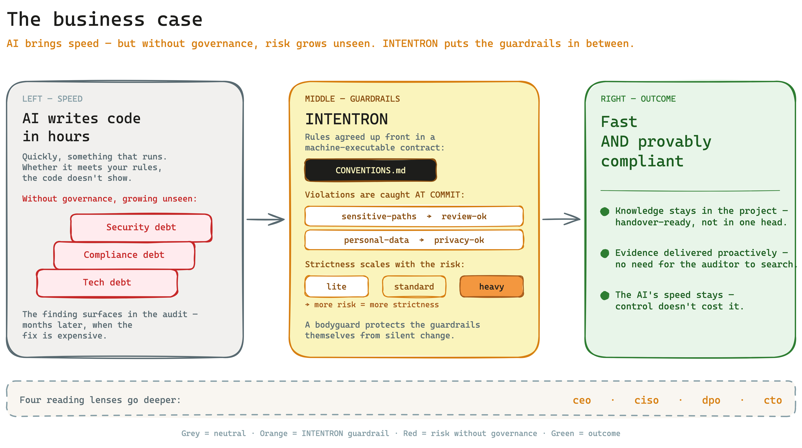

# Runbook: Business Case — why a decision-maker invests in INTENTRON

> **Who this is for.** You are a CEO, managing director or decision-maker, and you want to know in
> under ten minutes: why should we invest in this framework? What business risk does it lower? What
> does it cost, and when does it pay off?
>
> **What this runbook is — and is not.** This is the entry-point lens: the investment and decision
> view. It is **not** about technical detail, gate mechanics or audit steps. If you want to go
> deeper afterwards, three role-specific runbooks (CISO, DPO, CTO) take you into the detail —
> linked at the end under "Further reading".

## In one sentence

AI now writes code in hours instead of weeks — but nobody guarantees your security, privacy and
governance rules were followed in the process. INTENTRON sets those rules up front and catches
violations at the moment of writing, instead of months later in an audit. You keep the speed of AI
and lower the risk that an invisible pile of tech debt, compliance and security problems builds up
along the way.

## The big picture

On the left, the speed: AI delivers fast. On the right, the risk: without guardrails it grows
unseen. INTENTRON puts the guardrails in between — the rules are agreed up front and checked at the
moment of writing. The result is both at once: you stay fast, and you stay demonstrably compliant.

## The problem

AI-assisted development flips the relationship between speed and control. Typing used to be the
scarce resource — today the AI writes the code, and the scarce resource is the question of whether
what was written meets your rules, and whether you will still understand the system in twelve
months.

The real risk is its invisibility. AI quickly delivers something that runs. Whether security
thresholds, privacy rules and governance requirements were followed is not visible in the result.
The finding arrives later: in a security review or a privacy audit, when a CISO or CIO discovers
months in that production software is not compliant. By then it has long been in use, and the fix is
expensive.

Without governance, an invisible pile of three debts grows at once: technical debt (the product
becomes hard to maintain), compliance debt (rules were never checked) and security debt
(vulnerabilities were never caught). The speed the AI gains, you pay back later with interest.

## What the framework delivers

INTENTRON turns the method from the book "Code Crash" (Matthias Schrader, 2026) into a working
operating system for AI-assisted development. The core: your rules — tests, logging, security
thresholds, privacy, governance — are written up front into a machine-executable contract
(`CONVENTIONS.md`). Violations are then caught **at commit time**, not first in an audit. If a
change touches a sensitive path, the framework requires a review sign-off (`sensitive-paths` →
`review-ok`); if it touches personal data, a privacy sign-off (`personal-data` → `privacy-ok`); a
bodyguard at the lowest layer protects the guardrails themselves against silent change. And when
someone audits later, spec-linkage and an audit tool (`audit-trace.sh`) hand over the evidence
proactively — the auditor does not have to go looking for it.

For you as a decision-maker, the benefit reads in business terms:

| Business risk | How the framework lowers it | Evidence / runbook |
|---|---|---|
| Non-compliant software surfaces only in the audit — when the fix is expensive | Rules are enforced at commit time, not checked after the fact | CISO runbook, DPO runbook, `audit-perspective.md` |
| Tech debt makes the product unmaintainable in twelve months | Spec-first plus quality gates plus learning loop keep quality measurable | CTO runbook |
| A key developer leaves — and the knowledge leaves with them | Specs, audit trail and onboarding docs keep the knowledge in the project | CTO runbook |
| A privacy breach means a fine plus reputational damage | A DPO catalogue and a privacy gate check processing of personal data | DPO runbook |
| Vendor lock-in to a single AI tool | A tool-neutral adapter contract instead of binding to one vendor | README / HANDBUCH |

Three properties make this benefit hold up over time:

**It scales with the risk.** You set the strictness via the `governance_mode`. `lite` for
experiments, `standard` for solo and customer projects, `heavy` for regulated, revenue-critical work
involving personal data, payment or authentication logic. For regulated work, `heavy` dials
compliance evidence, mandatory reviews and branch protection up automatically — you do not have to
assemble the strictness by hand.

**It scales with the team.** From the solo developer, through teams of five to twenty, to
enterprise operation with several operators on their own servers. The same framework grows with you.

**Knowledge stays in the project, not in someone's head.** Specs, architecture documentation
(`ARCHITECTURE_DESIGN.md`), developer onboarding (`DEVELOPER_ONBOARDING.md`) and a complete audit
trail make the project handover-ready. When someone leaves, the "why" stays documented — not just
the "what".

## When does it pay off for us?

The higher the risk, regulation and AI speed, the clearer the benefit. The table below lists the
triggers and the matching `governance_mode`.

| Trigger in your case | Recommended mode |
|---|---|
| Regulated environment / compliance obligation | `standard` to `heavy` |
| You process personal data (PII) | `standard` to `heavy` |
| Several developers / the team is scaling | `standard` to `heavy` |
| AI-driven velocity — fast, at volume | `standard` to `heavy` |
| Long-lived or revenue-critical system | `standard` to `heavy` |
| Weekend experiment / prototype with no consequences | `lite` (minimal overhead) |

How to read it: if several rows apply to you — say regulated *and* PII *and* revenue-critical — head
towards `heavy`. If the work is a consequence-free experiment, `lite` is enough. The mode is not a
one-way street: you start light and dial the strictness up when the prototype becomes a product.

## Cost & effort (honestly)

The framework follows a lightweight principle: strictness scales with risk, with no overhead for
small projects. A weekend prototype runs with minimal overhead; the heavy mechanisms only kick in
once you switch them on via the `governance_mode` — and you do that only where the risk justifies
it.

In day-to-day operation the gates run automatically. They run in the background, catch violations at
the moment of writing, and stay invisible until they find something. The ongoing effort for the
person operating the framework stays low — control does not cost you the speed the AI gains.

## Limits — what the framework does NOT do

Honesty belongs in the basis for a decision. The framework does not replace people — it makes their
work demonstrable. Concretely:

- **Professional judgement stays human.** Some decisions only a human can make. The framework
  documents them and makes them traceable, but it does not take them off anyone's hands.
- **The four-eyes principle is a convention, not enforced.** It is documented discipline for the
  person operating the framework — not a technically enforced mechanism.
- **No substitute for legal advice.** The privacy module helps anchor rules in the process. It does
  not replace a legal assessment of your specific case.
- **No substitute for an external penetration test.** Security gates catch rule violations early.
  They do not replace an independent security review of your production systems.
- **No guarantee of bug-free software.** The framework does not promise that no error will ever
  happen again. It promises traceability and rule violations caught early — that is the difference
  between "we hope it's fine" and "we can show it's fine".

## Further reading

If you want to go deeper, the three role-specific runbooks take you into the detail — each from the
view of the role that owns the risk:

- **[CISO runbook: Security](ciso-security.en.md)** — how the framework anchors security rules in
  the process and catches violations early.
- **[DPO runbook: Privacy](dpo-privacy.en.md)** — how privacy by design is anchored in the
  development process.
- **[CTO runbook: Code quality](cto-code-quality.en.md)** — how spec-first, quality gates and the
  audit trail counter tech debt and knowledge loss.

For the full context:

- **[README — "Why INTENTRON"](../../README.md)** — the short rationale and the big picture of the
  framework.
- **[HANDBUCH](../../HANDBUCH.md)** — the complete setup and operations handbook.
- **[Artifact map](../onboarding/artefakt-landkarte.md)** — which artifact does what, and where it
  lives.
