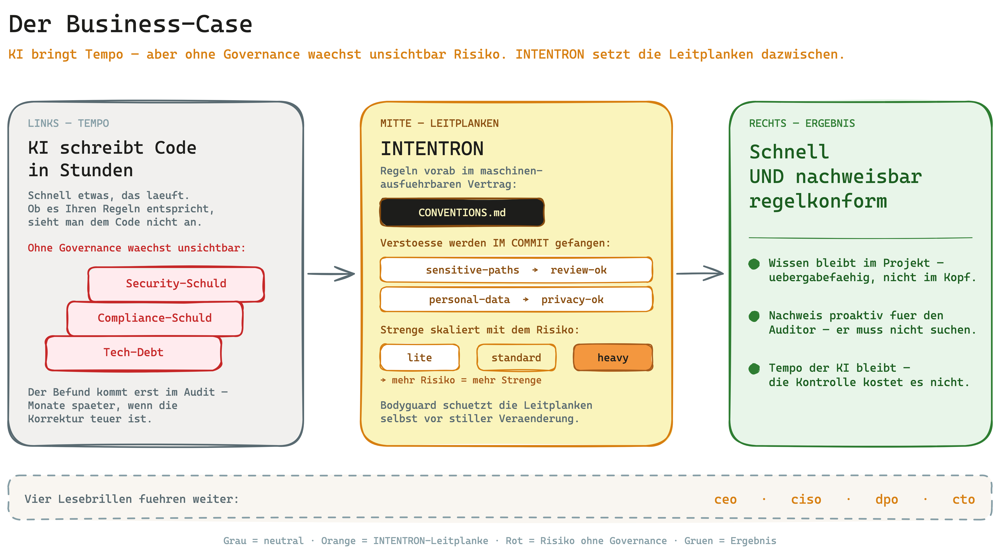

# Runbook: Business Case — warum ein Entscheider in INTENTRON investiert

> **Zielgruppe:** Geschäftsführerin, Geschäftsführer oder Entscheider.
>
> In unter zehn Minuten beantwortet dieses Runbook: Warum sollten wir in dieses Framework
> investieren? Welches Geschäftsrisiko senkt es? Was kostet es, und wann lohnt es sich?
>
> **Was dieses Runbook ist — und was nicht.** Dies ist die Einstiegs-Lesebrille: die
> Investitions- und Entscheidungssicht. Es geht hier **nicht** um technische Details, Gate-Mechanik
> oder Prüf-Schritte. Wenn Sie nach dieser Lektüre tiefer einsteigen wollen, führen drei
> Fach-Runbooks (CISO, DPO, CTO) in die Details — verlinkt am Ende unter „Weiterlesen".

## In einem Satz

KI schreibt heute Code in Stunden statt Wochen — aber niemand garantiert, dass dabei Ihre
Security-, Datenschutz- und Governance-Regeln eingehalten wurden. INTENTRON legt diese Regeln vorab
fest und fängt Verstöße im Moment des Schreibens ab, statt Monate später im Audit. Sie behalten das
Tempo der KI und senken zugleich das Risiko, dass dabei ein unsichtbarer Berg aus Tech-Debt,
Compliance- und Security-Problemen entsteht.

## Das Big Picture

Links das Tempo: KI liefert schnell. Rechts das Risiko: ohne Leitplanken wächst es im Verborgenen
mit. INTENTRON setzt die Leitplanken dazwischen — die Regeln werden vorab vereinbart und im Moment
des Schreibens geprüft. Das Ergebnis ist beides zugleich: Sie bleiben schnell, und Sie bleiben
nachweisbar regelkonform.

## Das Problem

KI-gestützte Entwicklung dreht das Verhältnis von Tempo und Kontrolle um. Früher war Tippen die
knappe Ressource — heute schreibt die KI den Code, und die knappe Ressource ist die Frage, ob das
Geschriebene Ihren Regeln entspricht und ob Sie das System in zwölf Monaten noch verstehen.

Das eigentliche Risiko ist seine Unsichtbarkeit. KI liefert schnell etwas, das läuft. Ob dabei
Security-Schwellen, Datenschutzregeln und Governance-Vorgaben eingehalten wurden, sieht man dem
Ergebnis nicht an. Der Befund kommt nachgelagert: im Security-Review oder im Datenschutz-Audit, wenn
ein CISO oder CIO Monate später feststellt, dass produktive Software nicht regelkonform ist. Bis
dahin ist sie längst im Einsatz, und die Korrektur ist teuer.

Ohne Governance wächst so ein unsichtbarer Berg aus drei Schulden gleichzeitig: technische Schuld
(das Produkt wird schwer wartbar), Compliance-Schuld (Regeln wurden nie geprüft) und
Security-Schuld (Schwachstellen wurden nie gefangen). Das Tempo, das die KI gewinnt, zahlen Sie
später mit Zinsen zurück.

## Was das Framework liefert

INTENTRON übersetzt die Methode aus dem Buch „Code Crash" (Matthias Schrader, 2026) in ein
funktionierendes Betriebssystem für KI-gestützte Entwicklung. Der Kern: Ihre Regeln — Tests,
Logging, Security-Schwellen, Datenschutz, Governance — werden vorab in einen maschinen-ausführbaren
Vertrag geschrieben (`CONVENTIONS.md`). Verstöße werden dann **im Commit** gefangen, nicht erst im
Audit. Berührt ein Change einen sensiblen Pfad, verlangt das Framework eine Review-Freigabe
(`sensitive-paths` → `review-ok`); berührt er personenbezogene Daten, eine Datenschutz-Freigabe
(`personal-data` → `privacy-ok`); ein Bodyguard auf der untersten Ebene schützt die Leitplanken
selbst vor stiller Veränderung. Und wenn später jemand prüft, liefern Spec-Verknüpfung und ein
Audit-Werkzeug (`audit-trace.sh`) den Nachweis proaktiv — der Auditor muss nicht erst danach suchen.

Der Effekt für Sie als Entscheider lässt sich in Geschäftssprache zusammenfassen:

| Geschäftsrisiko | Wie das Framework es senkt | Beleg / Runbook |
|---|---|---|
| Non-compliant Software fällt erst im Audit auf — wenn die Korrektur teuer ist | Regeln werden im Commit erzwungen, nicht nachgelagert geprüft | [CISO-Runbook](ciso-security.md), [DPO-Runbook](dpo-privacy.md), [Auditor-Sicht](audit-perspective.md) |
| Tech Debt macht das Produkt in zwölf Monaten unwartbar | Spec-first plus Quality-Gates plus Learning Loop halten die Qualität messbar | [CTO-Runbook](cto-code-quality.md) |
| Ein Schlüsselentwickler geht — und das Wissen geht mit | Specs, Audit-Trail und Onboarding-Doku halten das Wissen im Projekt | [CTO-Runbook](cto-code-quality.md) |
| Datenschutz-Verstoß bedeutet Bußgeld plus Reputationsschaden | DPO-Katalog und ein Datenschutz-Gate prüfen Verarbeitungen personenbezogener Daten | [DPO-Runbook](dpo-privacy.md) |
| Vendor-Lock an ein einzelnes KI-Tool | Tool-neutraler Adapter-Vertrag statt Bindung an einen Anbieter | [README](../../README.md) / [HANDBUCH — Anhang K](../../HANDBUCH.md#anhang-k-tool-adapter--dieses-framework-mit-anderen-ki-tools-nutzen-boo-49) |

Drei Eigenschaften machen diesen Nutzen tragfähig über die Zeit:

**Es skaliert mit dem Risiko.** Über den `governance_mode` stellen Sie die Strenge ein.
`lite` für Experimente, `standard` für Solo- und Kundenprojekte, `heavy` für reguliertes,
umsatzkritisches Arbeiten mit personenbezogenen Daten, Zahlungs- oder Authentisierungs-Logik. Für
regulierte Arbeit zieht `heavy` Compliance-Evidenz, verpflichtende Reviews und Branch-Schutz
automatisch hoch — Sie müssen die Strenge nicht von Hand zusammensetzen.

**Es skaliert mit dem Team.** Vom Solo-Entwickler über Teams von fünf bis zwanzig Personen bis zum
Enterprise-Betrieb mit mehreren Operatoren auf eigenen Servern. Dasselbe Framework wächst mit.

**Das Wissen bleibt im Projekt, nicht im Kopf.** Specs, Architektur-Dokumentation
(`ARCHITECTURE_DESIGN.md`), Entwickler-Onboarding (`DEVELOPER_ONBOARDING.md`) und ein lückenloser
Audit-Trail machen das Projekt übergabefähig. Geht jemand, bleibt das „Warum" dokumentiert — nicht
nur das „Was".

## Wann lohnt es sich für uns?

Je höher Risiko, Regulierung und KI-Tempo, desto deutlicher der Nutzen. Die folgende Tabelle nennt
die Auslöser und den dazu passenden `governance_mode`.

| Auslöser bei Ihnen | Empfohlener Modus |
|---|---|
| Reguliertes Umfeld / Compliance-Pflicht | `standard` bis `heavy` |
| Sie verarbeiten personenbezogene Daten (PII) | `standard` bis `heavy` |
| Mehrere Entwickler / das Team skaliert | `standard` bis `heavy` |
| KI-getriebene Velocity — schnell, in Stückzahl | `standard` bis `heavy` |
| Langlebiges oder umsatzkritisches System | `standard` bis `heavy` |
| Wochenend-Experiment / Prototyp ohne Folgen | `lite` (minimaler Overhead) |

Lesart: Treffen mehrere Zeilen auf Sie zu — etwa reguliert *und* PII *und* umsatzkritisch — gehen
Sie Richtung `heavy`. Ist das Vorhaben ein folgenloses Experiment, genügt `lite`. Der Modus ist
keine Einbahnstraße: Sie starten leicht und ziehen die Strenge hoch, wenn aus dem Prototyp ein
Produkt wird.

## Kosten & Aufwand (ehrlich)

Das Framework folgt einem Leichtgewicht-Prinzip: Die Strenge skaliert mit dem Risiko, es gibt keinen
Überbau für kleine Projekte. Ein Wochenend-Prototyp läuft mit minimalem Overhead; die schweren
Mechanismen greifen erst, wenn Sie sie über den `governance_mode` einschalten — und das tun Sie nur
dort, wo das Risiko es rechtfertigt.

Im laufenden Betrieb arbeiten die Gates automatisch. Sie laufen im Hintergrund mit, fangen Verstöße
im Moment des Schreibens und bleiben unsichtbar, bis sie etwas finden. Der laufende Aufwand für die
Person, die das Framework bedient, bleibt gering — die Kontrolle kostet Sie nicht das Tempo, das die
KI gewinnt.

## Grenzen — was das Framework NICHT leistet

Ehrlichkeit gehört zur Entscheidungsgrundlage. Das Framework ersetzt keine Menschen — es macht ihre
Arbeit nachweisbar. Konkret:

- **Fachliche Urteile bleiben menschlich.** Manche Entscheidungen kann nur ein Mensch treffen. Das
  Framework dokumentiert sie und macht sie nachvollziehbar, nimmt sie aber niemandem ab.
- **Das Vier-Augen-Prinzip ist Konvention, nicht erzwungen.** Es ist dokumentierte Disziplin der
  Person, die das Framework bedient — kein technisch erzwungener Mechanismus.
- **Kein Ersatz für Rechtsberatung.** Das Datenschutz-Modul hilft, Regeln im Prozess zu verankern.
  Es ersetzt keine juristische Bewertung Ihres konkreten Falls.
- **Kein Ersatz für einen externen Penetrationstest.** Security-Gates fangen Regelverstöße früh.
  Eine unabhängige Sicherheitsprüfung Ihrer produktiven Systeme ersetzen sie nicht.
- **Keine Garantie auf Fehlerfreiheit.** Das Framework verspricht nicht, dass kein Fehler mehr
  passiert. Es verspricht Nachvollziehbarkeit und früh gefangene Regelverstöße — das ist der
  Unterschied zwischen „wir hoffen, es passt" und „wir können zeigen, dass es passt".

## Weiterlesen

Wollen Sie tiefer einsteigen, führen die drei Fach-Runbooks in die Details — jeweils aus der Sicht
der Rolle, die das Risiko verantwortet:

- **[CISO-Runbook: Security](ciso-security.md)** — wie das Framework Security-Regeln im Prozess
  verankert und Verstöße früh fängt.
- **[DPO-Runbook: Datenschutz](dpo-privacy.md)** — wie Datenschutz by Design im
  Entwicklungsprozess verankert wird.
- **[CTO-Runbook: Code-Qualität](cto-code-quality.md)** — wie Spec-first, Quality-Gates und
  Audit-Trail Tech Debt und Wissensverlust entgegenwirken.

Für den vollen Kontext:

- **[README — „Why INTENTRON"](../../README.md)** — die Kurzbegründung und das Big Picture des
  Frameworks.
- **[HANDBUCH](../../HANDBUCH.md)** — das vollständige Setup- und Betriebshandbuch.
- **[Artefakt-Landkarte](../onboarding/artefakt-landkarte.md)** — welches Artefakt was leistet und
  wo es liegt.
