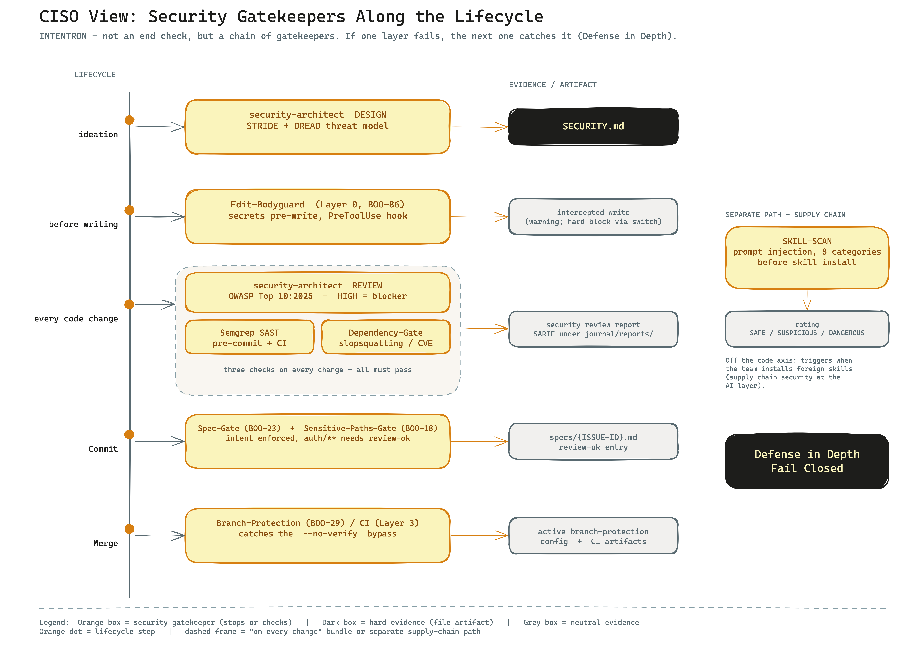

# Runbook: The CISO View — what INTENTRON means for your cyber security

> **Who this is for.** You are a CISO or head of IT deciding whether your team may adopt this
> framework — or you are rolling it out right now. You don't have 30 minutes to read the HANDBUCH.
> This runbook answers one question in under 10 minutes: *If my developers build code with AI agents
> and put this framework on top — which security gatekeepers kick in, how do they fit together, and
> where do I take control?*
>
> This is **not a new security mechanism** you have to operate on the side. It is a lens on what the
> framework already has built in. If you are looking for the evidence trail for an audit, read
> `audit-perspective.md` afterwards.

## In one sentence

INTENTRON builds the security check into the development process — from the first threat model
through a secrets filter that runs before writing, to mandatory gates that stop a commit or merge
when a check is missing or a high-risk finding is still open.

## The big picture

AI agents write code fast — and fast also means insecure code: hardcoded secrets, hallucinated
packages, missing input validation. So INTENTRON does not rely on a single big check at the end. It
places several small gatekeepers along the lifecycle: at the idea stage, before every write, on every
code change, and before anything reaches the main branch. Each gatekeeper leaves a piece of evidence
you can inspect later. The principle behind it is defense in depth: if one layer fails, the next one
catches it.

## Your three core concerns

When an AI agent produces code in your shop, three things worry you most. The framework addresses each
with a concrete mechanism.

| Your concern | What can go wrong | How the framework counters |
|---|---|---|
| **Secrets in the code** | The agent writes an API key, password, or token straight into a file and commits it. | The **Edit-Bodyguard** (Layer 0) checks for secrets and unsafe patterns *before* the write happens and catches them before they land on disk. Behind it, secrets checks in the security review and in the SAST gate. |
| **Insecure code slips through** | Injection, missing auth, broken security headers — nobody looks, the agent merges. | The **security-architect** reviews every code change against OWASP Top 10:2025 and classifies it HIGH/MEDIUM/LOW. A **HIGH finding is a blocker**. On top of that, Semgrep runs as a SAST gate (pre-commit and CI). |
| **Hallucinated or vulnerable dependencies** | The agent invents a package that does not exist (slopsquatting) or pulls a library with a known CVE. | The **dependency gate** checks every package for existence, age, and known CVEs before it is accepted. |

A fourth concern is the supply chain of the AI itself: if your team installs third-party skills, those
could contain hidden instructions (prompt injection). There is a dedicated mechanism for that — see
block 5, SKILL-SCAN.

## The gatekeepers — how it fits together

The controls are spread across the lifecycle. No single point has to catch everything; that is by
design (defense in depth, fail closed). The table below reads top to bottom as the path a change
takes.

| Lifecycle step | Mechanism / gate | Artifact / evidence |
|---|---|---|
| **Idea / planning** | `security-architect` in **DESIGN** mode: threat modeling with STRIDE + DREAD, trust boundaries. | Threat-Model report → `SECURITY.md` |
| **Before writing** | **Edit-Bodyguard (BOO-86)** — PreToolUse hook, catches secrets and unsafe patterns before the AI writes them to disk (Layer 0, Claude-Code-specific). | intercepted write (warning; hard block via switch) |
| **On every code change** | `security-architect` in **REVIEW** mode: OWASP Top 10:2025 quick check, secrets check, security headers, risk classification. | Security-Review report; **HIGH finding = blocker** |
| **On every code change** | **Semgrep SAST** as a pre-commit and CI gate; **dependency gate** against slopsquatting (existence, age, CVE check). | SARIF under `journal/reports/` |
| **On commit** | **Spec-Gate (BOO-23)** — blocks the commit without `specs/{ISSUE-ID}.md`. Every change needs a documented intent. | `specs/{ISSUE-ID}.md` |
| **On security-sensitive paths** | **Sensitive-Paths-Gate (BOO-18)** — changes to e.g. `auth/**` force a human sign-off (`review-ok`). Configured in `.claude/sensitive-paths.json`. | `review-ok` entry |
| **Before merge** | **Branch protection (BOO-29)** — required status checks + reviews. Catches the `git commit --no-verify` bypass via CI (Layer 3). | active branch-protection config |
| **On demand / periodic** | `security-architect` in **AUDIT** mode: full scan, dependency analysis, attack-surface analysis, Agentic AI Security (ASI01–ASI10). | Audit report |

The point that matters most for you: the local hooks (Edit-Bodyguard, pre-commit) can technically be
bypassed — a developer can type `git commit --no-verify`. That is exactly what the **4-layer
quality-gate architecture** is built against (documented in `CONVENTIONS.md`):

- **Layer 0 — Edit-Bodyguard:** catches secrets before the write.
- **Layer 1 — IDE:** real-time hints in the editor.
- **Layer 2 — CLI / pre-commit:** ESLint, Semgrep SAST, dependency check, coverage — hard stop locally.
- **Layer 3 — CI / GitHub Actions:** required status checks. This layer runs server-side and catches
  the local `--no-verify` bypass. This is your fallback line.

## Artifacts & skills

The core is a single skill with four modes. It does not decide security questions autonomously — it
runs structured checks and produces findings that act as a gate or get judged by a human.

**[security-architect](../../security-architect/SKILL.md)** (v1.1.0) — security by design across the
whole process. Core principles: defense in depth, fail closed, least privilege, assume breach,
evidence-based. Standards: STRIDE/DREAD, OWASP Top 10:2025, ASVS 5.0, Agentic AI Security.

| Mode | When | What it does | Output |
|---|---|---|---|
| **DESIGN** | before code, at ideation/planning | STRIDE + DREAD threat modeling, trust boundaries | Threat-Model report → `SECURITY.md` |
| **REVIEW** | on every code change | OWASP Top 10:2025 quick check, secrets check, security headers, risk classification HIGH/MEDIUM/LOW | Security-Review report (HIGH = blocker) |
| **AUDIT** | on demand / periodic | full scan, dependency analysis, attack-surface analysis, Agentic AI Security (ASI01–ASI10) | Audit report |
| **SKILL-SCAN** | before installing third-party skills | prompt-injection scan across 8 categories: override/hijacking, exfiltration, privilege escalation, destructive actions, settings manipulation, indirect injection, hidden instructions, social engineering | rating SAFE / SUSPICIOUS / DANGEROUS |

The **SKILL-SCAN** deserves your attention. AI skills are executable instructions you pull from the
internet. Before your team installs a third-party skill, this mode checks the `SKILL.md` for hidden
instructions and rates it. That is supply-chain security at the AI layer.

**Artifacts that get produced and serve as evidence:**

| Artifact | Content |
|---|---|
| [`SECURITY.md`](../../SECURITY.md) | security rules + result of the threat model |
| `specs/{ISSUE-ID}.md` | documented intent per change (enforced by the Spec-Gate) |
| `.claude/sensitive-paths.json` | which paths force a mandatory human sign-off |
| SARIF reports under `journal/reports/` | Semgrep SAST findings |
| CI artifacts under `journal/reports/ci/` | persistent evidence (retention 30 days) |

In the [artifact map](../onboarding/artefakt-landkarte.en.md), "Security" is listed as its own
consumer role (CISO / security owner) — the threat model and security rules land explicitly with you.

## Where you take control

The framework is deliberately tunable. You decide how strict the gates are — not the dev team alone.
The most important dial is `governance_mode`.

**`governance_mode`** (declared in `CONVENTIONS.md`): `lite` / `standard` / `heavy` control gate
strictness.

| Mode | What it adds on the security side |
|---|---|
| `lite` | baseline. |
| `standard` | adds security gates, CI lint/SAST, sensitive-paths, learning loop L1. |
| `heavy` | additionally adds coverage/performance gates, SonarQube, branch protection, audit trail, mandatory review, L2/L3. |

For client work and production services, `standard` is the sensible floor; for regulated or critical
systems, `heavy`.

**Other dials:**

- **`.claude/sensitive-paths.json`** — you define which paths force a mandatory human sign-off
  (e.g. `auth/**`, payment logic, anything containing "credential").
- **Semgrep pack selection** — which SAST rule sets run.
- **Enable branch protection** — via `setup-branch-protection.sh` (BOO-29). This is the layer that
  catches the local bypass; without it, Layer 3 is not armed.
- **Set the ASVS level** — how deep the review goes per ASVS 5.0.
- **Trigger DESIGN mode at ideation** — you can (and should) require a threat model for new features
  with an external interface or auth, before any code exists.

## Limits — what the framework does NOT do

Being honest here saves you from false confidence. The framework is built lightweight; some things it
deliberately does not enforce.

- **The four-eyes principle is a convention, not machine-enforced.** The framework today does *not*
  technically prevent the same person from writing and approving a sensitive change (BOO-72 explicitly
  excludes this enforcement). An auditor checks it manually via `git blame`: is the author of the
  sign-off different from the author of the change? If real four-eyes enforcement matters to you, add
  it through your own branch-protection policy (required reviewers).
- **Gates enforce that checks *run* — not that every judgment is correct.** A gate can ensure the
  security review happened. Whether a finding rated MEDIUM is actually HIGH in your context remains a
  human decision.
- **The threat model (DESIGN) is triggered manually today.** It does not start automatically on every
  new idea. You have to anchor it as a step in your Definition of Ready.
- **Incident response and rollback in production are not part of the framework.** The framework
  protects the path *up to* the merge. What happens after deployment — monitoring, alerting, emergency
  rollback — it does not cover. That remains your operations responsibility.

## Further reading

- [`audit-perspective.en.md`](audit-perspective.en.md) — how an auditor checks the evidence (question → evidence → location)
- [`compliance-mechanik.en.md`](../compliance/compliance-mechanik.en.md) — gates vs. catalogs, end-to-end
- [`SECURITY.md`](../../SECURITY.md) — the security rules themselves
- [`security-architect/SKILL.md`](../../security-architect/SKILL.md) — the skill in detail
- [`artefakt-landkarte.en.md`](../onboarding/artefakt-landkarte.en.md) — who signs off which artifact (role "Security")
- [`HANDBUCH.md`](../../HANDBUCH.md) — the full framework handbook
- [`CONVENTIONS.md`](../../CONVENTIONS.md) — gate architecture, `governance_mode`, quality gates
