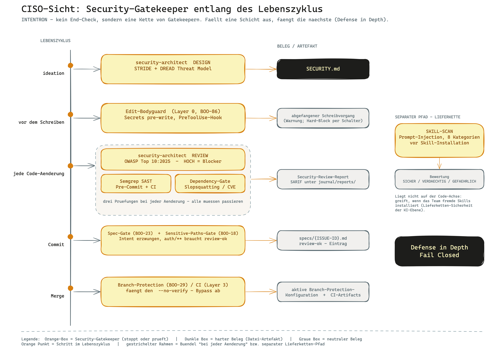

# Runbook: CISO-Sicht — was INTENTRON für Ihre Cyber-Security bedeutet

> **Zielgruppe:** CISO oder IT-Leiter.
>
> In unter 10 Minuten beantwortet dieses Runbook die eine Frage: *Wenn meine Entwickler mit
> KI-Agenten Code bauen und dieses Framework darüberlegen — welche Sicherheits-Gatekeeper greifen,
> wie greift das ineinander, und wo nehme ich Einfluss?*
>
> Das ist **keine neue Sicherheits-Mechanik**, die Sie zusätzlich betreiben müssen. Es ist eine
> Lesebrille auf das, was im Framework bereits eingebaut ist. Wenn Sie nach den Belegen für ein Audit
> suchen, lesen Sie danach `audit-perspective.md`.

## In einem Satz

INTENTRON baut die Sicherheitsprüfung in den Entwicklungsprozess ein — vom ersten Threat Model über
einen Secrets-Filter vor dem Schreiben bis zu Pflicht-Gates, die einen Commit oder Merge stoppen,
wenn eine Prüfung fehlt oder ein Hochrisiko-Befund offen ist.

## Das Big Picture

KI-Agenten schreiben Code schnell — und schnell auch unsicheren Code: hartcodierte Secrets,
halluzinierte Pakete, fehlende Input-Validierung. INTENTRON setzt deshalb nicht auf eine einzige
große Prüfung am Ende, sondern auf mehrere kleine Gatekeeper entlang des Lebenszyklus: bei der Idee,
vor jedem Schreibvorgang, bei jeder Code-Änderung und bevor irgendetwas in den Hauptzweig kommt.
Jeder Gatekeeper hinterlässt einen Beleg, den Sie später prüfen können. Das Prinzip dahinter ist
mehrschichtige Verteidigung: Fällt eine Schicht aus, fängt die nächste.

## Ihre drei Kernsorgen

Wenn ein KI-Agent in Ihrem Haus Code produziert, fürchten Sie vor allem drei Dinge. Das Framework
adressiert jedes davon mit einem konkreten Mechanismus.

| Ihre Sorge | Was schiefgehen kann | Wie das Framework gegenhält |
|---|---|---|
| **Secrets im Code** | Der Agent schreibt einen API-Key, ein Passwort oder Token direkt in eine Datei und committed es. | Der **Edit-Bodyguard** (Layer 0) prüft *vor* dem Schreiben auf Secrets und unsichere Muster und fängt sie ab, bevor sie auf der Platte landen. Dahinter Secrets-Checks im Security-Review und im SAST-Gate. |
| **Unsicherer Code geht durch** | Injection, fehlende Auth, kaputte Security-Header — niemand schaut hin, der Agent merged. | Der **security-architect** prüft jede Code-Änderung gegen OWASP Top 10:2025 und klassifiziert HOCH/MITTEL/NIEDRIG. Ein **HOCH-Befund ist ein Blocker**. Zusätzlich läuft Semgrep als SAST-Gate (Pre-Commit und CI). |
| **Halluzinierte oder verwundbare Abhängigkeiten** | Der Agent erfindet ein Paket, das es nicht gibt (Slopsquatting), oder zieht eine Bibliothek mit bekannter Lücke. | Das **Dependency-Gate** prüft jedes Paket auf Existenz, Alter und bekannte CVEs, bevor es akzeptiert wird. |

Eine vierte Sorge betrifft die Lieferkette der KI selbst: Wenn Ihr Team fremde Skills installiert,
könnten diese versteckte Anweisungen enthalten (Prompt Injection). Dafür gibt es einen eigenen
Mechanismus — siehe Block 5, SKILL-SCAN.

## Die Gatekeeper — wie es ineinandergreift

Die Kontrollen sind über den Lebenszyklus verteilt. Keine einzelne Stelle muss alles abfangen; das
ist Absicht (Defense in Depth, Fail Closed). Die folgende Tabelle liest sich von oben nach unten als
der Weg, den eine Änderung nimmt.

| Lebenszyklus-Schritt | Mechanik / Gate | Artefakt / Beleg |
|---|---|---|
| **Idee / Planung** | `security-architect` im **DESIGN**-Modus: Threat Modeling mit STRIDE + DREAD, Trust Boundaries. | Threat-Model-Report → [`SECURITY.md`](../../SECURITY.md) |
| **Vor dem Schreiben** | **Edit-Bodyguard (BOO-86)** — PreToolUse-Hook, fängt Secrets und unsichere Muster ab, bevor die KI sie auf die Platte schreibt (Layer 0, Claude-Code-spezifisch). | abgefangener Schreibvorgang (Warnung; Hard-Block per Schalter) |
| **Bei jeder Code-Änderung** | `security-architect` im **REVIEW**-Modus: OWASP Top 10:2025 Schnellcheck, Secrets-Check, Security Headers, Risiko-Klassifizierung. | Security-Review-Report; **HOCH-Befund = Blocker** |
| **Bei jeder Code-Änderung** | **Semgrep SAST** als Pre-Commit- und CI-Gate; **Dependency-Gate** gegen Slopsquatting (Existenz-, Age-, CVE-Check). | SARIF unter `journal/reports/` |
| **Bei Commit** | **Spec-Gate (BOO-23)** — blockt den Commit ohne `specs/{ISSUE-ID}.md`. Jede Änderung braucht einen dokumentierten Intent. | `specs/{ISSUE-ID}.md` |
| **Bei sicherheitssensiblen Pfaden** | **Sensitive-Paths-Gate (BOO-18)** — Änderungen an z. B. `auth/**` erzwingen eine menschliche Freigabe (`review-ok`). Konfiguriert in `.claude/sensitive-paths.json`. | `review-ok`-Eintrag |
| **Vor dem Merge** | **Branch-Protection (BOO-29)** — Required Status Checks + Reviews. Fängt den `git commit --no-verify`-Bypass über die CI (Layer 3) ab. | aktive Branch-Protection-Konfiguration |
| **Auf Abruf / periodisch** | `security-architect` im **AUDIT**-Modus: Vollscan, Dependency-Analyse, Angriffsflächen-Analyse, Agentic AI Security (ASI01–ASI10). | Audit-Report |

Der entscheidende Punkt für Sie: Die lokalen Hooks (Edit-Bodyguard, Pre-Commit) lassen sich technisch
umgehen — ein Entwickler kann `git commit --no-verify` tippen. Genau dagegen ist die
**4-Layer-Quality-Gate-Architektur** gebaut (dokumentiert in `CONVENTIONS.md`):

- **Layer 0 — Edit-Bodyguard:** fängt Secrets vor dem Schreiben.
- **Layer 1 — IDE:** Echtzeit-Hinweise im Editor.
- **Layer 2 — CLI / Pre-Commit:** ESLint, Semgrep SAST, Dependency-Check, Coverage — harter Stopp lokal.
- **Layer 3 — CI / GitHub Actions:** Required Status Checks. Diese Schicht läuft serverseitig und
  fängt den lokalen `--no-verify`-Bypass ab. Das ist Ihre Rückfalllinie.

## Artefakte & Skills

Das Herzstück ist ein einzelner Skill mit vier Modi. Er entscheidet nicht autonom über
Sicherheitsfragen — er führt strukturierte Prüfungen durch und produziert Befunde, die als Gate
wirken oder von einem Menschen bewertet werden.

**[security-architect](../../security-architect/SKILL.md)** (v1.1.0) — Security by Design über den
gesamten Prozess. Kernprinzipien: Defense in Depth, Fail Closed, Least Privilege, Assume Breach,
Evidence-Based. Standards: STRIDE/DREAD, OWASP Top 10:2025, ASVS 5.0, Agentic AI Security.

| Modus | Wann | Was er tut | Output |
|---|---|---|---|
| **DESIGN** | vor Code, bei Ideation/Planung | STRIDE + DREAD Threat Modeling, Trust Boundaries | Threat-Model-Report → [`SECURITY.md`](../../SECURITY.md) |
| **REVIEW** | bei jeder Code-Änderung | OWASP Top 10:2025 Schnellcheck, Secrets-Check, Security Headers, Risiko-Klassifizierung HOCH/MITTEL/NIEDRIG | Security-Review-Report (HOCH = Blocker) |
| **AUDIT** | auf Abruf / periodisch | Vollscan, Dependency-Analyse, Angriffsflächen-Analyse, Agentic AI Security (ASI01–ASI10) | Audit-Report |
| **SKILL-SCAN** | vor Installation fremder Skills | Prompt-Injection-Scan über 8 Kategorien: Override/Hijacking, Exfiltration, Privilege Escalation, Destructive Actions, Settings Manipulation, Indirect Injection, Hidden Instructions, Social Engineering | Bewertung SICHER / VERDÄCHTIG / GEFÄHRLICH |

Der **SKILL-SCAN** verdient Ihre besondere Aufmerksamkeit. KI-Skills sind ausführbare Anweisungen,
die Sie aus dem Internet ziehen. Bevor Ihr Team einen fremden Skill installiert, prüft dieser Modus
die `SKILL.md` auf versteckte Anweisungen und stuft sie ein. Das ist Lieferketten-Sicherheit für die
KI-Ebene.

**Artefakte, die entstehen und als Beleg dienen:**

| Artefakt | Inhalt |
|---|---|
| [`SECURITY.md`](../../SECURITY.md) | Security-Regelwerk + Ergebnis des Threat Models |
| `specs/{ISSUE-ID}.md` | dokumentierter Intent je Änderung (erzwungen durch Spec-Gate) |
| `.claude/sensitive-paths.json` | welche Pfade eine menschliche Pflicht-Freigabe erzwingen |
| SARIF-Reports unter `journal/reports/` | Semgrep-SAST-Findings |
| CI-Artifacts unter `journal/reports/ci/` | persistenter Nachweis (Retention 30 Tage) |

In der [Artefakt-Landkarte](../onboarding/artefakt-landkarte.md) ist „Security" als eigene
Abnehmer-Rolle (CISO / Security-Verantwortlicher) eingetragen — Threat Model und Security-Regelwerk
landen explizit bei Ihnen.

## Wo Sie Einfluss nehmen

Das Framework ist absichtlich einstellbar. Sie entscheiden, wie streng die Gates greifen — nicht das
Entwicklungsteam allein. Die wichtigste Stellschraube ist der `governance_mode`.

**`governance_mode`** (deklariert in `CONVENTIONS.md`): `lite` / `standard` / `heavy` steuern die
Gate-Strenge.

| Modus | Was an Sicherheit dazukommt |
|---|---|
| `lite` | Basis. |
| `standard` | ergänzt Security-Gates, CI-Lint/SAST, Sensitive-Paths, Learning-Loop L1. |
| `heavy` | ergänzt zusätzlich Coverage-/Performance-Gates, SonarQube, Branch-Protection, Audit-Trail, Mandatory Review, L2/L3. |

Für Kundenarbeit und Produktivservices ist `standard` die sinnvolle Untergrenze; für regulierte oder
kritische Systeme `heavy`.

**Weitere Stellschrauben:**

- **`.claude/sensitive-paths.json`** — Sie legen fest, welche Pfade eine menschliche
  Pflicht-Freigabe erzwingen (z. B. `auth/**`, Zahlungslogik, alles mit „credential").
- **Semgrep-Pack-Auswahl** — welche SAST-Regelsätze laufen.
- **Branch-Protection aktivieren** — über [`setup-branch-protection.sh`](../../bootstrap/scripts/setup-branch-protection.sh) (BOO-29). Das ist die Schicht,
  die den lokalen Bypass abfängt; ohne sie ist Layer 3 nicht scharf.
- **ASVS-Level festlegen** — wie tief die Prüfung nach ASVS 5.0 geht.
- **DESIGN-Modus bei der Ideation triggern** — Sie können (und sollten) verlangen, dass für neue
  Features mit externer Schnittstelle oder Auth ein Threat Model erstellt wird, bevor Code entsteht.

## Grenzen — was das Framework NICHT tut

Ehrlichkeit hier spart Ihnen falsche Sicherheit. Das Framework ist leichtgewichtig gebaut; einige
Dinge erzwingt es bewusst nicht.

- **Das Vier-Augen-Prinzip ist Konvention, nicht maschinell erzwungen.** Das Framework verhindert
  heute *nicht* technisch, dass dieselbe Person eine sensible Änderung schreibt und freigibt
  (BOO-72 schließt dieses Enforcement explizit aus). Ein Auditor prüft das manuell über `git blame`:
  Ist der Autor der Freigabe ein anderer als der Autor der Änderung? Wenn Ihnen echtes
  Vier-Augen-Enforcement wichtig ist, müssen Sie es über Ihre eigene Branch-Protection-Policy
  (Required Reviewers) ergänzen.
- **Gates erzwingen, dass Prüfungen *laufen* — nicht, dass jede inhaltliche Bewertung korrekt ist.**
  Ein Gate kann sicherstellen, dass der Security-Review stattgefunden hat. Ob ein als MITTEL
  eingestufter Befund in Ihrem Kontext nicht doch HOCH ist, bleibt eine menschliche Entscheidung.
- **Das Threat Model (DESIGN) wird heute manuell getriggert.** Es läuft nicht automatisch bei jeder
  neuen Idee an. Sie müssen es als Schritt in Ihrer Definition of Ready verankern.
- **Incident-Response und Rollback in Produktion sind nicht Teil des Frameworks.** Das Framework
  schützt den Weg *bis* zum Merge. Was nach dem Deployment passiert — Monitoring, Alerting,
  Notfall-Rollback — deckt es nicht ab. Das bleibt Ihre Betriebsverantwortung.

## Weiterlesen

- [`audit-perspective.md`](audit-perspective.md) — wie ein Auditor die Belege prüft (Frage → Beleg → Ort)
- [`compliance-mechanik.md`](../compliance/compliance-mechanik.md) — Gates vs. Kataloge, End-to-End
- [`SECURITY.md`](../../SECURITY.md) — das Security-Regelwerk selbst
- [`security-architect/SKILL.md`](../../security-architect/SKILL.md) — der Skill im Detail
- [`artefakt-landkarte.md`](../onboarding/artefakt-landkarte.md) — wer welches Artefakt abnimmt (Rolle „Security")
- [`HANDBUCH.md`](../../HANDBUCH.md) — das vollständige Framework-Handbuch
- [`CONVENTIONS.md`](../../CONVENTIONS.md) — Gate-Architektur, `governance_mode`, Quality-Gates
