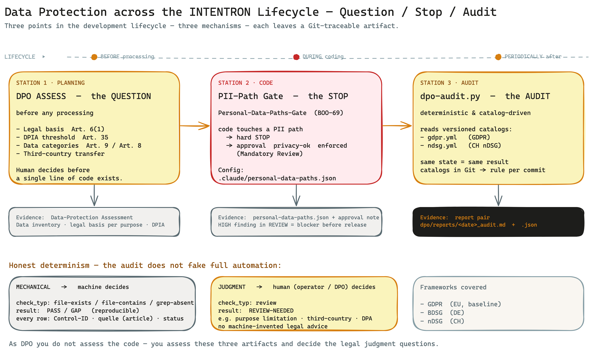

# Runbook: DPO View — Data Protection in the INTENTRON Framework

> **Who this is for.** You are a Data Protection Officer (DPO) and you have to assess this framework
> or shepherd its rollout. You have no time to read the whole HANDBUCH. This runbook answers your one
> core question in under 10 minutes: *If a team builds with this framework — what does that mean for
> data protection? Where is privacy anchored, how is it auditable, which artifacts and skills kick
> in, where do I take influence?*
>
> **No new machinery.** This document invents nothing. It bundles the data-protection mechanisms that
> already exist in the repo into a lens for your role. The technical deep dive lives in
> [`../compliance/compliance-mechanik.md`](../compliance/compliance-mechanik.md) and
> [`../../dpo/SKILL.md`](../../dpo/SKILL.md); this runbook translates them into the DPO perspective.

---

## In one sentence

Data protection is hard-wired into the framework at three points — as a **question** during planning
(DPO ASSESS), as a **hard stop** on code touching PII paths (Personal-Data-Paths Gate), and as a
**deterministic audit** against versioned GDPR/nDSG catalogs (`dpo-audit.py`) — and each of those
points leaves a checkable artifact traceable in Git.

---

## The big picture

Data protection kicks in at three points of the development lifecycle. **Before** processing, the DPO
skill in ASSESS mode raises the legal-basis and DPIA questions. **During** implementation, a gate
halts every change to personal data until a human signs off. **Periodically**, a deterministic runner
checks the project state against versioned control catalogs and writes a human- and machine-readable
report. As the DPO you do not assess the code — you assess these artifacts and decide the legal
judgment questions.

---

## Your three core concerns

The framework addresses exactly the risks that worry you most in an AI-assisted development process.

### Concern 1: "Personal data ends up in the code unnoticed."

When a team ships fast, PII fields, logs with cleartext data, or missing deletion paths slip through
easily. The framework counters with a **machine gatekeeper**: the **Personal-Data-Paths Gate**
(BOO-69). When a code change touches a path flagged as sensitive, the run **stops** and demands an
explicit `privacy-ok` sign-off (Mandatory Review) — analogous to the Sensitive-Paths Gate for
security. It is configured via `.claude/personal-data-paths.json`.

### Concern 2: "The legal basis gets clarified after the build — too late."

Privacy by design means: the legal basis is fixed *before* processing. The framework pulls that
question forward into the planning phase. As soon as a story plans personal data, the DPO skill runs
in **ASSESS mode**: data-flow analysis, data categories (including special categories under Art. 9
and minors' data under Art. 8), legal basis under Art. 6(1)(a–f), DPIA threshold check under Art. 35,
and third-country transfer assessment. The result is a privacy assessment — before a single line of
code exists.

### Concern 3: "Compliance evidence is narrated, not proven."

An audit built on assertions is worthless. The framework makes the privacy status **deterministic**:
the runner `dpo/scripts/dpo-audit.py` processes versioned YAML catalogs. **Same project state = same
result** — and because the catalogs live in Git, you can always answer which rule applied at which
commit. The audit gives you not a gut feeling but a pass/gap table with an article citation on every
row.

---

## The gatekeepers — how it interlocks

Data protection is not a single check but a chain across the lifecycle. Each step has a clearly
defined mechanism and leaves evidence behind.

| Lifecycle step | Mechanism / gate | Artifact / evidence |
|---|---|---|
| **Planning / ideation** (before processing) | DPO skill **ASSESS mode**: legal basis Art. 6(1), DPIA threshold Art. 35, data categories (Art. 9 / Art. 8), third-country transfer | Privacy assessment (data inventory, legal basis per purpose, DPIA if required) |
| **Code change with PII** | DPO skill **REVIEW mode**: data minimization, consent checklist, data-subject rights Art. 15–22, deletion concept | Privacy review report; a **HIGH finding is a blocker** before release |
| **Code on PII paths** | **Personal-Data-Paths Gate** (BOO-69): hard stop, `privacy-ok` sign-off enforced | Config `.claude/personal-data-paths.json`; sign-off note |
| **Periodic audit** | **AUDIT mode**, catalog-driven: `dpo-audit.py` processes `gdpr.yml` / `ndsg.yml` deterministically | Report pair `dpo/reports/<date>_audit.md` + `.json` |
| **Mechanical check** | `check_typ` = `file-exists` / `file-contains` / `grep-absent` → reproducible PASS/GAP | every report row: control ID, title, `quelle` (article), status, detail |
| **Judgment check** | `check_typ` = `review` → REVIEW-NEEDED, operator/DPO decides manually | REVIEW-NEEDED list in the report (e.g. purpose limitation, third country, DPA) |

Read the table as a chain: planning settles *whether you may*, the gate prevents silent leakage at
the code, the audit periodically checks the overall state. Three different mechanisms, three
different problems — they do not replace one another.

### Mechanical vs. judgment — the honest determinism

The point that matters most for your assessment: the audit runner **does not fake full automation**.
It cleanly separates two classes of checks.

| Check class | `check_typ` | Result | Who decides |
|---|---|---|---|
| **Mechanical** | `file-exists`, `file-contains`, `grep-absent` | **PASS / GAP** (reproducible) | machine |
| **Judgment** | `review` | **REVIEW-NEEDED** | operator / DPO — manually afterwards |

Where a legal judgment is needed — purpose limitation, proportionality, third-country transfer,
processor agreement (DPA/AVV) — the runner deliberately returns **REVIEW-NEEDED** instead of an
invented assessment. The skill poses the check question; **you** decide. That is not a gap but a
deliberate boundary: no machine-invented legal advice.

### The seven core principles as a grid

ASSESS and AUDIT mode check along the seven core principles of Art. 5 GDPR. You know them — here they
serve as the shared grid between you and the skill:

| Core principle (Art. 5) | Check question in the framework |
|---|---|
| Lawfulness | Which letter of Art. 6(1) applies? |
| Purpose limitation | What exactly are the data collected for? (REVIEW-NEEDED) |
| Data minimization | Are only the necessary fields really collected? |
| Accuracy | Are there update mechanisms? |
| Storage limitation | When are the data deleted? (deletion concept) |
| Integrity & confidentiality | Are TOMs defined? (→ Security Architect, Art. 32) |
| Accountability | Is everything documented and provable? |

---

## Artifacts & skills

What is produced concretely, and which skill produces it?

### The DPO skill (3 modes)

The central actor is the **`dpo` skill** ([`../../dpo/SKILL.md`](../../dpo/SKILL.md), v1.2.0,
`recommended_model: opus` — deliberately the stronger model, because the work is compliance-critical
and audit-relevant). Three modes with a clear trigger point:

- **ASSESS** — at ideation/planning, *before* personal data is processed. Data-flow analysis, data
  categories (Art. 9, Art. 8), legal basis Art. 6(1)(a–f), DPIA threshold check Art. 35,
  third-country transfer (adequacy decision / SCCs / Transfer Impact Assessment). → Output: a
  **privacy assessment**.
- **REVIEW** — on code changes with PII. Data minimization, consent implementation checklist (consent
  before collection, freely given, informed, revocable, demonstrable, no pre-checked box,
  double opt-in for email), data-subject rights Art. 15–22, deletion concept. → Output: a **privacy
  review report**; a HIGH finding is a **blocker** before release.
- **AUDIT** — catalog-driven and deterministic. The runner
  [`dpo/scripts/dpo-audit.py`](../../dpo/scripts/dpo-audit.py) processes the versioned YAML catalogs.
  → Output: the **report pair** `dpo/reports/<date>_audit.{md,json}`.

### The control catalogs

AUDIT mode draws on flat, versioned YAML catalogs under `dpo/controls/`:

| Catalog | Content | Auto-load? |
|---|---|---|
| [`gdpr.yml`](../../dpo/controls/gdpr.yml) | GDPR Art. 5/6/13/17/28/30/32 | yes |
| [`ndsg.yml`](../../dpo/controls/ndsg.yml) | Swiss nDSG Art. 8/12/16/19/22/24/25 | yes |
| `nist-ai-600.yml` | optional, for AI processing | optional |
| [`controls/optional/eu-ai-act.yml`](../../dpo/controls/optional/eu-ai-act.yml) | EU AI Act (Reg. (EU) 2024/1689) — checks `AI_SYSTEM.md` | **no** — copied into the project overlay only via the EU-AI-Act add-on (BOO-105) |

**Project overlay (`.claude/dpo/controls/`).** A project can add its own controls (same schema). The
runner merges them automatically with the framework catalogs. Important for you: these
project-specific controls **survive a framework update**, because they live in the project repo, not
in the skill. Your own corporate privacy requirements are not lost.

### The report pair

Every audit run produces two files under `dpo/reports/`:

- `<date>_audit.md` — **human-readable**: pass/gap table plus, per GAP, a fix hint (via the `mapsTo`
  field).
- `<date>_audit.json` — **machine-readable**: the same data structured (for tooling/reporting).

Every row carries **control ID, title, `quelle`** (the underlying GDPR/nDSG article as audit
evidence), **status** and **detail**. That `quelle` column is your anchor: per finding you see which
norm was checked against.

### Which regulatory frameworks are covered

The skill covers three regulatory frameworks — GDPR as the base plus the national specifics:

| Framework | Specifics relevant to you |
|---|---|
| **GDPR/DSGVO** (EU) | base of all checks |
| **BDSG** (DE) | DPO obligation from 20 persons (§ 38); employee data protection (§ 26); scoring (§ 31); fine up to EUR 50,000 for administrative offenses |
| **nDSG** (CH) | effects principle (also applies to Swiss data abroad); notification "as quickly as possible" to the FDPIC instead of 72h; fines up to CHF 250,000 against **natural persons**; access within 30 days; Federal Council country list instead of EU adequacy decisions |

### Interplay with the Security Architect

Data protection and security interlock without merging. **You define the protection need** (for
example: Art. 9 data = HIGH), the **Security Architect delivers the TOMs** under Art. 32 (for example
AES-256, RBAC, backup, monitoring). Clean division of labor: "May I process this data?" is answered
by the DPO skill, "Can I process it securely?" by the Security Architect skill.

---

## Where you take influence

The framework is built as a system of adjustment knobs. You control how strictly data protection
applies per project. The main levers:

| Knob | Effect |
|---|---|
| **Activate the Privacy add-on** | Arms the whole data-protection machinery. Without the add-on active, nothing happens on the GDPR side — data protection is opt-in per project. |
| **`.claude/personal-data-paths.json`** | Defines which paths count as PII-sensitive and trigger the gate. Here you set the scope of the hard stop. |
| **Catalog choice `gdpr` / `ndsg`** | Determines which framework AUDIT mode checks against (EU, Switzerland, or both). |
| **Project overlay `.claude/dpo/controls/`** | Add your own corporate controls — survives framework updates. |
| **EU-AI-Act add-on** | Copies `eu-ai-act.yml` into the project overlay; the audit then checks the completeness of `AI_SYSTEM.md`. |
| **Trigger `dpo` in ASSESS mode at ideation** | Pulls the legal-basis/DPIA assessment into planning early — before anything is built. |
| **`governance_mode: heavy`** | Choose the strictest governance tier for PII-heavy systems. |

In practice: when bootstrapping a project you activate the Privacy add-on, maintain
`personal-data-paths.json` with the genuinely sensitive paths, pick the right catalog, and add your
own controls to the overlay where needed. After that the machinery runs by itself — and you assess
the artifacts.

---

## Limits — what the framework does NOT do

Honesty first: the framework takes work off your plate, but it does not replace you. You must know
these limits before you rely on it.

- **The DPIA obligation (Art. 35) is not triggered automatically.** Whether a DPIA is required is
  checked manually by the operator today — there is no auto-trigger. The skill supplies the threshold
  questions; humans make the decision.
- **Judgment checks remain a human decision.** Purpose limitation, proportionality, third-country
  transfer and processor agreement (DPA/AVV) are `review` type → REVIEW-NEEDED. The machine poses the
  question, it does not answer it.
- **`privacy-ok` / four-eyes is convention, not enforced.** The framework does **not** enforce the
  four-eyes principle on PII paths today (BOO-72 explicitly excludes enforcement). It is documented
  operator discipline. You check it manually — the tell: whoever clears the `privacy-ok` gate should
  not be the author of the change.
- **Consent patterns exist only partly as code templates.** The consent checklist is complete, but
  not every consent flow ships as a ready-made code pattern — implementation work remains here.
- **The skill does not replace legal advice.** It structures, checks mechanically and poses the right
  questions. The legal appraisal — and the responsibility — stay with you.

---

## Further reading

| Topic | Source |
|---|---|
| Where the privacy evidence lands in an audit (step 6: data-protection proof) | [`audit-perspective.en.md`](./audit-perspective.en.md) |
| Compliance mechanics end-to-end (gates vs. catalogs, lifecycle, EU AI Act) | [`../compliance/compliance-mechanik.md`](../compliance/compliance-mechanik.md) |
| Skill details (3 modes, catalogs, runner, regulatory frameworks) | [`../../dpo/SKILL.md`](../../dpo/SKILL.md) |
| Which artifact is signed off with the "Datenschutz" approver (section C) | [`../onboarding/artefakt-landkarte.en.md`](../onboarding/artefakt-landkarte.en.md) |
| Privacy by Design — background, add-on activation, migration | [`../../HANDBUCH.md`](../../HANDBUCH.md) — Appendix O |

---

> *German version: [`dpo-privacy.md`](./dpo-privacy.md).*
