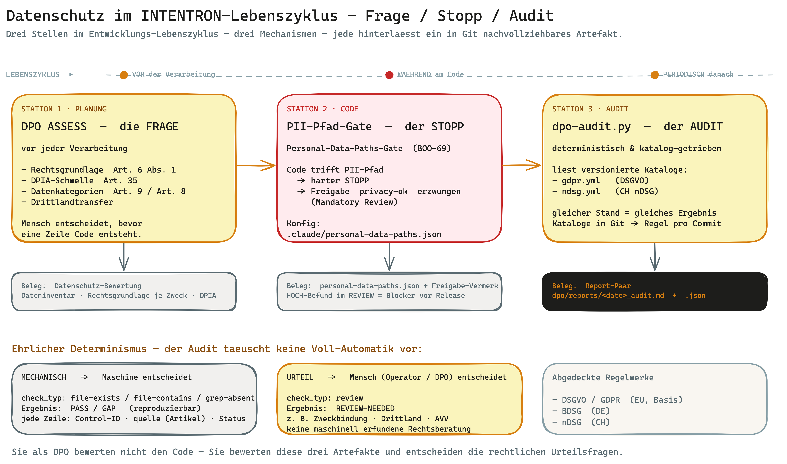

# Runbook: DPO-Sicht — Datenschutz im INTENTRON-Framework

> **Für wen.** Sie sind Datenschutzbeauftragte:r (DPO) und sollen dieses Framework bewerten oder
> seine Einführung begleiten. Sie haben keine Zeit, das ganze HANDBUCH zu lesen. Dieses Runbook
> beantwortet in unter 10 Minuten Ihre eine Kernfrage: *Wenn ein Team mit diesem Framework
> entwickelt — was bedeutet das für den Datenschutz? Wo wird Datenschutz verankert, wie ist es
> auditierbar, welche Artefakte und Skills greifen, wo nehme ich Einfluss?*
>
> **Keine neue Mechanik.** Dieses Dokument erfindet nichts dazu. Es bündelt die im Repo bereits
> vorhandenen Datenschutz-Mechanismen zu einer Lesebrille für Ihre Rolle. Die technische
> Vertiefung steht in [`../compliance/compliance-mechanik.md`](../compliance/compliance-mechanik.md)
> und [`../../dpo/SKILL.md`](../../dpo/SKILL.md); dieses Runbook übersetzt sie in die DPO-Perspektive.

---

## In einem Satz

Datenschutz ist im Framework an drei Stellen fest verdrahtet — als **Frage** in der Planung (DPO
ASSESS), als **harter Stopp** beim Code an PII-Pfaden (Personal-Data-Paths-Gate) und als
**deterministischer Audit** gegen versionierte DSGVO-/nDSG-Kataloge (`dpo-audit.py`) — und jede
dieser Stellen hinterlässt ein prüfbares, in Git nachvollziehbares Artefakt.

---

## Das Big Picture

Datenschutz greift an drei Punkten des Entwicklungs-Lebenszyklus. **Vor** der Verarbeitung stellt
der DPO-Skill im ASSESS-Modus die Rechtsgrundlagen- und DPIA-Fragen. **Während** der
Implementierung hält ein Gate jede Änderung an personenbezogenen Daten an, bis ein Mensch sie
freigibt. **Periodisch** prüft ein deterministischer Runner den Projektstand gegen versionierte
Kontrollkataloge und schreibt einen menschen- und maschinenlesbaren Report. Sie als DPO bewerten
nicht den Code — Sie bewerten diese Artefakte und entscheiden die rechtlichen Urteilsfragen.

---

## Ihre drei Kernsorgen

Das Framework adressiert genau die Risiken, die Sie in einem KI-gestützten Entwicklungsprozess am
meisten beschäftigen.

### Sorge 1: „Personenbezogene Daten landen unbemerkt im Code."

Wenn ein Team schnell entwickelt, rutschen PII-Felder, Logs mit Klartext-Daten oder fehlende
Löschpfade leicht durch. Das Framework setzt dagegen einen **maschinellen Gatekeeper**: das
**Personal-Data-Paths-Gate** (BOO-69). Trifft eine Code-Änderung einen als sensibel markierten Pfad,
**stoppt** der Lauf und verlangt eine ausdrückliche `privacy-ok`-Freigabe (Mandatory Review) —
analog zum Sensitive-Paths-Gate für Security. Konfiguriert wird das über
`.claude/personal-data-paths.json`.

### Sorge 2: „Die Rechtsgrundlage wird erst nach dem Bau geklärt — zu spät."

Datenschutz-by-Design heißt: die Rechtsgrundlage steht *vor* der Verarbeitung fest. Das Framework
zieht diese Frage in die Planungsphase vor. Sobald eine Story personenbezogene Daten plant, läuft
der DPO-Skill im **ASSESS-Modus**: Datenfluss-Analyse, Datenkategorien (inklusive besonderer
Kategorien nach Art. 9 und Daten Minderjähriger nach Art. 8), Rechtsgrundlage nach Art. 6 Abs. 1
(a–f), DPIA-Schwellenprüfung nach Art. 35 und Drittlandtransfer-Bewertung. Ergebnis ist eine
Datenschutz-Bewertung — bevor eine Zeile Code entsteht.

### Sorge 3: „Compliance-Nachweise sind erzählt, nicht belegt."

Ein Audit, das auf Behauptungen beruht, ist wertlos. Das Framework macht den Datenschutz-Status
**deterministisch**: Der Runner `dpo/scripts/dpo-audit.py` arbeitet versionierte YAML-Kataloge ab.
**Gleicher Projektstand = gleiches Ergebnis** — und weil die Kataloge im Git liegen, ist jederzeit
beantwortbar, welche Regel bei welchem Commit galt. Der Audit liefert kein Bauchgefühl, sondern eine
Pass/Gap-Tabelle mit Artikel-Beleg pro Zeile.

---

## Die Gatekeeper — wie es ineinandergreift

Datenschutz ist nicht ein einzelner Check, sondern eine Kette über den Lebenszyklus. Jeder Schritt
hat eine klar definierte Mechanik und hinterlässt einen Beleg.

| Lebenszyklus-Schritt | Mechanik / Gate | Artefakt / Beleg |
|---|---|---|
| **Planung / Ideation** (vor Verarbeitung) | DPO-Skill **ASSESS-Modus**: Rechtsgrundlage Art. 6 Abs. 1, DPIA-Schwelle Art. 35, Datenkategorien (Art. 9 / Art. 8), Drittlandtransfer | Datenschutz-Bewertung (Dateninventar, Rechtsgrundlage pro Zweck, DPIA falls erforderlich) |
| **Code-Änderung mit PII** | DPO-Skill **REVIEW-Modus**: Datenminimierung, Consent-Checkliste, Betroffenenrechte Art. 15–22, Löschkonzept | Datenschutz-Review-Report; **HOCH-Befund = Blocker** vor Release |
| **Code an PII-Pfaden** | **Personal-Data-Paths-Gate** (BOO-69): harter Stopp, `privacy-ok`-Freigabe erzwungen | Konfiguration `.claude/personal-data-paths.json`; Freigabe-Vermerk |
| **Periodischer Audit** | **AUDIT-Modus**, katalog-getrieben: `dpo-audit.py` arbeitet `gdpr.yml` / `ndsg.yml` deterministisch ab | Report-Paar `dpo/reports/<date>_audit.md` + `.json` |
| **Mechanische Prüfung** | `check_typ` = `file-exists` / `file-contains` / `grep-absent` → reproduzierbar PASS/GAP | jede Report-Zeile: Control-ID, Titel, `quelle` (Artikel), Status, Detail |
| **Urteilsprüfung** | `check_typ` = `review` → REVIEW-NEEDED, Operator/DPO entscheidet manuell | REVIEW-NEEDED-Liste im Report (z. B. Zweckbindung, Drittland, AVV) |

Lesen Sie die Tabelle als Kette: Die Planung klärt das *Dürfen*, das Gate verhindert das stille
Durchrutschen am Code, der Audit prüft periodisch den Gesamtstand. Drei verschiedene Mechanismen,
drei verschiedene Probleme — sie ersetzen sich nicht.

### Mechanisch vs. Urteil — der ehrliche Determinismus

Der entscheidende Punkt für Ihre Bewertung: Der Audit-Runner **täuscht keine Voll-Automatik vor**.
Er trennt sauber zwei Klassen von Prüfungen.

| Check-Klasse | `check_typ` | Ergebnis | Wer entscheidet |
|---|---|---|---|
| **Mechanisch** | `file-exists`, `file-contains`, `grep-absent` | **PASS / GAP** (reproduzierbar) | Maschine |
| **Urteil** | `review` | **REVIEW-NEEDED** | Operator / DPO — manuell danach |

Wo eine rechtliche Beurteilung nötig ist — Zweckbindung, Verhältnismäßigkeit, Drittlandtransfer,
Auftragsverarbeitung (AVV) — liefert der Runner bewusst **REVIEW-NEEDED** statt einer erfundenen
Bewertung. Der Skill stellt die Prüf-Frage; **Sie** entscheiden. Das ist keine Lücke, sondern eine
bewusste Grenze: keine maschinell erfundene Rechtsberatung.

### Die sieben Grundprinzipien als Raster

Der ASSESS- und AUDIT-Modus prüfen entlang der sieben Grundprinzipien aus Art. 5 DSGVO. Sie kennen
sie — hier dienen sie als gemeinsames Raster zwischen Ihnen und dem Skill:

| Grundprinzip (Art. 5) | Prüffrage im Framework |
|---|---|
| Rechtmäßigkeit | Welcher Buchstabe aus Art. 6 Abs. 1 greift? |
| Zweckbindung | Wofür genau werden die Daten erhoben? (REVIEW-NEEDED) |
| Datenminimierung | Werden wirklich nur die nötigen Felder erhoben? |
| Richtigkeit | Gibt es Aktualisierungs-Mechanismen? |
| Speicherbegrenzung | Wann werden die Daten gelöscht? (Löschkonzept) |
| Integrität & Vertraulichkeit | Sind TOMs definiert? (→ Security Architect, Art. 32) |
| Rechenschaftspflicht | Ist alles dokumentiert und belegbar? |

---

## Artefakte & Skills

Was entsteht konkret, und welcher Skill bringt es hervor?

### Der DPO-Skill (3 Modi)

Der zentrale Akteur ist der **`dpo`-Skill** ([`../../dpo/SKILL.md`](../../dpo/SKILL.md), v1.2.0,
`recommended_model: opus` — bewusst das stärkere Modell, weil die Arbeit compliance-kritisch und
audit-relevant ist). Drei Modi mit klarem Trigger-Punkt:

- **ASSESS** — bei Ideation/Planung, *bevor* personenbezogene Daten verarbeitet werden.
  Datenfluss-Analyse, Datenkategorien (Art. 9, Art. 8), Rechtsgrundlage Art. 6 Abs. 1 (a–f),
  DPIA-Schwellenprüfung Art. 35, Drittlandtransfer (Angemessenheitsbeschluss / SCCs / Transfer
  Impact Assessment). → Output: **Datenschutz-Bewertung**.
- **REVIEW** — bei Code-Änderungen mit PII. Datenminimierung, Consent-Implementation-Checkliste
  (Einwilligung vor Erhebung, freiwillig, informiert, widerrufbar, nachweisbar, kein
  Pre-Checked-Checkbox, Double-Opt-In bei E-Mail), Betroffenenrechte Art. 15–22, Löschkonzept.
  → Output: **Datenschutz-Review-Report**; ein HOCH-Befund ist ein **Blocker** vor Release.
- **AUDIT** — katalog-getrieben und deterministisch. Der Runner
  [`dpo/scripts/dpo-audit.py`](../../dpo/scripts/dpo-audit.py) arbeitet die versionierten YAML-Kataloge
  ab. → Output: das **Report-Paar** `dpo/reports/<date>_audit.{md,json}`.

### Die Kontrollkataloge

Der AUDIT-Modus speist sich aus flachen, versionierten YAML-Katalogen unter `dpo/controls/`:

| Katalog | Inhalt | Auto-Load? |
|---|---|---|
| [`gdpr.yml`](../../dpo/controls/gdpr.yml) | DSGVO Art. 5/6/13/17/28/30/32 | ja |
| [`ndsg.yml`](../../dpo/controls/ndsg.yml) | Schweizer nDSG Art. 8/12/16/19/22/24/25 | ja |
| `nist-ai-600.yml` | optional, für KI-Verarbeitungen | optional |
| [`controls/optional/eu-ai-act.yml`](../../dpo/controls/optional/eu-ai-act.yml) | EU AI Act (VO (EU) 2024/1689) — prüft `AI_SYSTEM.md` | **nein** — nur via EU-AI-Act-Add-on (BOO-105) ins Projekt-Overlay kopiert |

**Projekt-Overlay (`.claude/dpo/controls/`).** Ein Projekt kann eigene Controls ablegen (gleiches
Schema). Der Runner mergt sie automatisch zu den Framework-Katalogen. Wichtig für Sie: Diese
projektspezifischen Controls **überleben ein Framework-Update**, weil sie im Projekt-Repo liegen,
nicht im Skill. Eigene Konzern-Datenschutz-Vorgaben gehen also nicht verloren.

### Das Report-Paar

Jeder Audit-Lauf erzeugt zwei Dateien unter `dpo/reports/`:

- `<date>_audit.md` — **menschenlesbar**: Pass/Gap-Tabelle plus pro GAP ein Fix-Hinweis (über das
  Feld `mapsTo`).
- `<date>_audit.json` — **maschinenlesbar**: dieselben Daten strukturiert (für Tooling/Reporting).

Jede Zeile trägt **Control-ID, Titel, `quelle`** (der zugrunde liegende DSGVO-/nDSG-Artikel als
Audit-Beleg), **Status** und **Detail**. Genau diese `quelle`-Spalte ist Ihr Anker: Sie sehen pro
Befund, gegen welche Norm geprüft wurde.

### Welche Regelwerke abgedeckt sind

Der Skill deckt drei Regelwerke ab — die DSGVO als Basis plus die nationalen Besonderheiten:

| Regelwerk | Für Sie relevante Besonderheiten |
|---|---|
| **DSGVO/GDPR** (EU) | Basis aller Prüfungen |
| **BDSG** (DE) | DPO-Pflicht ab 20 Personen (§ 38); Beschäftigtendatenschutz (§ 26); Scoring (§ 31); Bußgeld bis 50.000 EUR für Ordnungswidrigkeiten |
| **nDSG** (CH) | Auswirkungsprinzip (gilt auch für Schweizer Daten im Ausland); Meldung „so rasch als möglich" an EDÖB statt 72h; Bußen bis CHF 250.000 gegen **natürliche Personen**; Auskunft binnen 30 Tagen; Länderliste des Bundesrats statt EU-Angemessenheitsbeschlüssen |

### Zusammenspiel mit dem Security Architect

Datenschutz und Security greifen ineinander, ohne sich zu vermischen. **Sie definieren den
Schutzbedarf** (zum Beispiel: Art.-9-Daten = HOCH), der **Security Architect liefert die TOMs** nach
Art. 32 (zum Beispiel AES-256, RBAC, Backup, Monitoring). Saubere Arbeitsteilung: „Darf ich diese
Daten verarbeiten?" beantwortet der DPO-Skill, „Kann ich sie sicher verarbeiten?" der
Security-Architect-Skill.

---

## Wo Sie Einfluss nehmen

Das Framework ist als Stellschrauben-System gebaut. Sie steuern, wie streng der Datenschutz pro
Projekt greift. Die wichtigsten Hebel:

| Stellschraube | Wirkung |
|---|---|
| **Privacy-Add-on aktivieren** | Schaltet die gesamte Datenschutz-Mechanik scharf. Ohne aktiviertes Add-on passiert auf der DSGVO-Seite nichts — Datenschutz ist opt-in pro Projekt. |
| **`.claude/personal-data-paths.json`** | Definiert, welche Pfade als PII-sensibel gelten und das Gate auslösen. Hier bestimmen Sie den Wirkungsbereich des harten Stopps. |
| **Katalogwahl `gdpr` / `ndsg`** | Legt fest, gegen welches Regelwerk der AUDIT-Modus prüft (EU, Schweiz, oder beide). |
| **Projekt-Overlay `.claude/dpo/controls/`** | Eigene Konzern-Controls ergänzen — überlebt Framework-Updates. |
| **EU-AI-Act-Add-on** | Kopiert `eu-ai-act.yml` ins Projekt-Overlay; der Audit prüft dann die Vollständigkeit von `AI_SYSTEM.md`. |
| **`dpo` im ASSESS-Modus bei der Ideation triggern** | Holt die Rechtsgrundlagen-/DPIA-Bewertung früh in die Planung — bevor gebaut wird. |
| **`governance_mode: heavy`** | Für PII-lastige Systeme die strengste Governance-Stufe wählen. |

Praktisch heißt das: Beim Bootstrap eines Projekts aktivieren Sie das Privacy-Add-on, pflegen die
`personal-data-paths.json` mit den real sensiblen Pfaden, wählen den passenden Katalog und legen bei
Bedarf eigene Controls ins Overlay. Danach läuft die Mechanik von selbst — und Sie prüfen die
Artefakte.

---

## Grenzen — was das Framework NICHT tut

Ehrlichkeit zuerst: Das Framework nimmt Ihnen Arbeit ab, aber es ersetzt Sie nicht. Diese Grenzen
müssen Sie kennen, bevor Sie sich darauf verlassen.

- **Die DPIA-Pflicht (Art. 35) wird nicht automatisch ausgelöst.** Ob eine DPIA erforderlich ist,
  prüft heute der Operator manuell — es gibt keinen Auto-Trigger. Der Skill liefert die
  Schwellenfragen, die Entscheidung treffen Menschen.
- **Urteilsprüfungen bleiben menschliche Entscheidung.** Zweckbindung, Verhältnismäßigkeit,
  Drittlandtransfer und Auftragsverarbeitung/AVV sind `review`-Typ → REVIEW-NEEDED. Die Maschine
  stellt die Frage, sie beantwortet sie nicht.
- **`privacy-ok` / Vier-Augen ist Konvention, nicht erzwungen.** Das Framework erzwingt das
  Vier-Augen-Prinzip an PII-Pfaden heute **nicht** (BOO-72 schließt das Enforcement explizit aus). Es
  ist dokumentierte Operator-Disziplin. Sie prüfen es manuell — Indiz: Wer das `privacy-ok`-Gate
  freigibt, sollte nicht der:die Autor:in der Änderung sein.
- **Consent-Patterns liegen nur teilweise als Code-Vorlage vor.** Die Consent-Checkliste ist
  vollständig, aber nicht jeder Einwilligungs-Flow kommt als fertiges Code-Pattern — hier bleibt
  Implementierungsarbeit.
- **Der Skill ersetzt keine Rechtsberatung.** Er strukturiert, prüft mechanisch und stellt die
  richtigen Fragen. Die rechtliche Würdigung — und die Verantwortung — bleiben bei Ihnen.

---

## Weiterlesen

| Thema | Quelle |
|---|---|
| Wo die Datenschutz-Evidenz im Audit landet (Schritt 6: Datenschutz-Nachweis) | [`audit-perspective.md`](./audit-perspective.md) |
| Compliance-Mechanik End-to-End (Gates vs. Kataloge, Lebenszyklus, EU AI Act) | [`../compliance/compliance-mechanik.md`](../compliance/compliance-mechanik.md) |
| Skill-Details (3 Modi, Kataloge, Runner, Regelwerke) | [`../../dpo/SKILL.md`](../../dpo/SKILL.md) |
| Welches Artefakt wird mit dem Abnehmer „Datenschutz" abgenommen (Abschnitt C) | [`../onboarding/artefakt-landkarte.md`](../onboarding/artefakt-landkarte.md) |
| Privacy by Design — Hintergrund, Add-on-Aktivierung, Migration | [`../../HANDBUCH.md`](../../HANDBUCH.md) — Anhang O |

---

> *Englische Fassung: [`dpo-privacy.en.md`](./dpo-privacy.en.md).*
