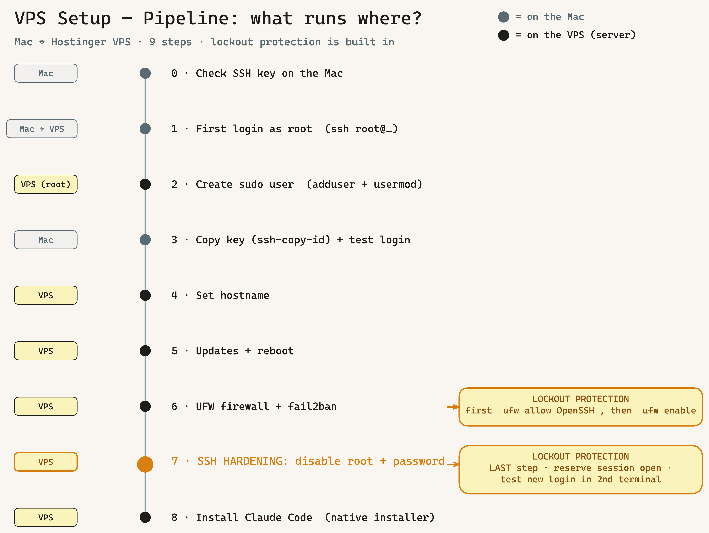
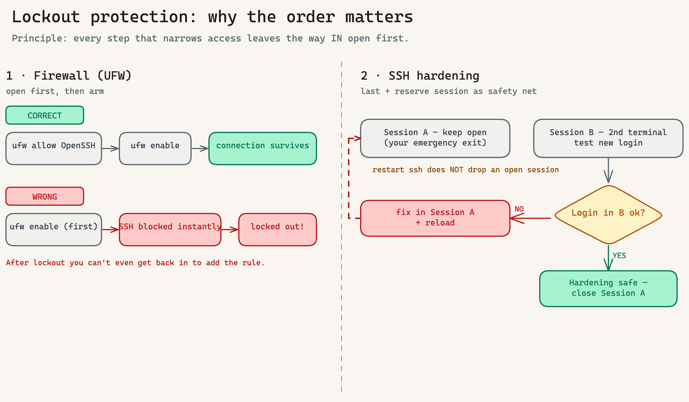

# Runbook: Hostinger VPS Setup (OS bootstrap & hardening)

> **Scope:** A **fresh Hostinger VPS** from the first SSH login to a hardened,
> production-ready machine with Claude Code. This runbook operates at the **OS level**
> (users, hostname, updates, firewall, fail2ban, SSH hardening).
>
> **Boundary:** The INTENTRON **framework** setup on the VPS (tools, skill pool, per-repo
> Git hooks, team governance) is **not** part of this runbook — that lives in
> [HANDBUCH.en.md → Appendix Y](../../HANDBUCH.en.md#appendix-y-vpscloud-team-runbook-boo-94).
> Order: **this runbook first (OS bootstrap), then Appendix Y (framework).**
>
> **Local prerequisite (Mac):** an existing SSH key (`~/.ssh/id_ed25519`).
> If you don't have one → [Step 0](#step-0--check-the-ssh-key-on-your-mac).

---

## Overview — the 8 steps

| # | Step | Run on | Reversible? |
|---|------|--------|-------------|
| 0 | Check SSH key on the Mac | Mac | — |
| 1 | First login as `root` | Mac → VPS | — |
| 2 | Create your own sudo user | VPS (as root) | yes |
| 3 | Install the user's SSH key + test login | Mac | yes |
| 4 | Set the hostname | VPS | yes |
| 5 | Update the system + install packages | VPS | — |
| 6 | UFW firewall + fail2ban | VPS | yes |
| 7 | Harden SSH (disable root + password) | VPS | ⚠️ **last** |
| 8 | Install Claude Code (native installer) | VPS (as user) | yes |

> **Golden rule — the throughline against locking yourself out:** Every step that narrows access
> is built so the way **in** is open **first**.
> 1. **Firewall (step 6):** `allow OpenSSH` first, **then** `enable` — never the other way around.
> 2. **SSH hardening (step 7):** **always last**, only once the key login provably works, and with
>    a **second open SSH session** as a safety net during the test.



*The whole pipeline at a glance: which steps run on the **Mac**, which on the **VPS** — and where
the lockout protection kicks in (steps 6 + 7). ([Excalidraw source](../vps-setup-pipeline.en.excalidraw))*

---

## Worked example

This runbook uses one concrete example throughout. Replace the placeholders with your values:

| Placeholder | Example | Meaning |
|-------------|---------|---------|
| `<VPS-IP>` | `76.13.15.149` | IPv4 of the VPS (Hostinger panel) |
| `<HOSTNAME>` | `Paperclip` | desired server name |
| `<username>` | `tobias` | your new login user |

---

## Step 0 — Check the SSH key on your Mac

```bash
ls -l ~/.ssh/*.pub
```

- **Present** (e.g. `id_ed25519.pub`) → continue to step 1.
- **None present** → create one:
  ```bash
  ssh-keygen -t ed25519 -C "your@mail.tld"
  ```
  (Press Enter through the prompts; a passphrase is recommended.)

> **Best practice:** one key per purpose. GitHub key ≠ VPS key is cleaner, but not mandatory.
> Never share the **private** key (`id_ed25519` without `.pub`).

---

## Step 1 — First login as root

The root password is in the **Hostinger panel → VPS → Overview** (resettable there too).

```bash
ssh root@<VPS-IP>
```

On first connect confirm the fingerprint with `yes`, then enter the root password (input is invisible — normal).

> We use root **only** for step 2. From step 3 on we work exclusively as the normal user.

---

## Step 2 — Create your own sudo user

**Why no root for daily work?** Root is all-powerful — one typo or a compromised session = total
loss. With your own user you work normally and elevate via `sudo` (with password confirmation) only
when needed.

On the VPS (as root):

```bash
adduser <username>            # asks for password + name; skip remaining fields with Enter, finish with Y
usermod -aG sudo <username>   # grant sudo rights
```

> **Best practice — set a password, do NOT leave it empty.** The user gets `sudo` rights and
> `sudo` asks for exactly this password. An empty password would be a security hole. You still log
> in conveniently via key — the password is only needed for `sudo`.

---

## Step 3 — Install the user's SSH key + test login

Your public key lives **on the Mac** and is **pushed up to the VPS** — not the other way around.
`ssh-copy-id` handles this including correct permissions.

**On the Mac** (new terminal tab, leave the root session open):

```bash
ssh-copy-id -i ~/.ssh/id_ed25519.pub <username>@<VPS-IP>
```

Asks **once** for the user password (from step 2), copies the key to `~/.ssh/authorized_keys`,
and sets permissions.

**Test the login:**

```bash
ssh -i ~/.ssh/id_ed25519 <username>@<VPS-IP>
```

→ Must succeed **without a password**. On the VPS verify only your key is present:

```bash
cat ~/.ssh/authorized_keys   # exactly ONE line, your expected key
```

### Convenience: alias in `~/.ssh/config` (Mac)

So that `ssh <HOSTNAME>` suffices from now on (also auto-detected by VS Code / Cursor Remote-SSH):

```
Host <HOSTNAME>
    HostName <VPS-IP>
    User <username>
    IdentityFile ~/.ssh/id_ed25519
    Port 22
```

> **VS Code / Cursor:** With the "Remote - SSH" extension installed, `<HOSTNAME>` appears
> automatically under *Remote-SSH: Connect to Host…* — the Host name in `config` is the label.

---

## Step 4 — Set the hostname

From here on everything **as `<username>`** (prompt `<username>@...:~$`).

```bash
sudo hostnamectl set-hostname <HOSTNAME>
echo "127.0.1.1 <HOSTNAME>" | sudo tee -a /etc/hosts
```

The new name shows fully after the reboot (step 5) in the prompt.

---

## Step 5 — Update the system + base packages

```bash
sudo apt update && sudo apt upgrade -y
sudo apt install -y ufw fail2ban unattended-upgrades
sudo dpkg-reconfigure -plow unattended-upgrades   # if asked: <Yes> → automatic security updates
```

> If a purple dialog appears ("Which services should be restarted?" / config-file question):
> confirm the **default selection** with Enter / `Tab → OK`.

Kernel updates often require a reboot ("*** System restart required ***"):

```bash
sudo reboot          # drops your session — wait ~30–60 s
# then again:
ssh <HOSTNAME>
```

---

## Step 6 — UFW firewall + fail2ban

> **From here access gets narrowed — lockout protection kicks in.** The diagram below shows both
> traps and how we avoid them: left, the firewall order (step 6); right, the reserve session during
> hardening (step 7).



*Left: "`allow OpenSSH` first, then `enable`" — otherwise the firewall shuts the only door.
Right: harden last, keep Session A open as an emergency exit, test in Session B.
([Excalidraw source](../vps-lockout-protection.en.excalidraw))*

### 6a. UFW (Uncomplicated Firewall)

**Principle:** default **deny all incoming**, allow outgoing, then open only the ports you need.

```bash
sudo ufw default deny incoming
sudo ufw default allow outgoing
sudo ufw allow OpenSSH            # allow SSH FIRST — before the firewall goes live!
sudo ufw enable                   # confirm warning with 'y'
sudo ufw status verbose           # check
```

> **⚠️ Why the order is your lockout protection (read carefully):**
> We allow `OpenSSH` **before** arming the firewall with `enable`. That way your live SSH
> connection is already covered by a rule *when* the firewall becomes active — it survives. At
> `sudo ufw enable` UFW therefore warns: *"Command may disrupt existing ssh connections. Proceed
> with operation (y|n)?"* → confirm with **`y`**. This is safe **precisely because** the SSH rule
> is already in place. **The other way around** (`enable` first, rule later) you'd lock yourself
> out the moment the firewall comes up — the only door shut before you put the key in.
> So: **`allow OpenSSH` first, then `enable`.** Always.

**What exactly to open?** Only what truly must face the outside:

| Service | Command | When |
|---------|---------|------|
| SSH | `sudo ufw allow OpenSSH` | **always** |
| HTTP | `sudo ufw allow 80/tcp` | only with a web server |
| HTTPS | `sudo ufw allow 443/tcp` | only with web server/TLS |
| Custom port | `sudo ufw allow 8080/tcp` | only when needed, ideally restricted to an IP |

> **Best practice — open as little as possible.** Do **not** expose databases, dashboards, etc.
> publicly. To allow only your own IP, e.g.:
> `sudo ufw allow from <your-IP> to any port 5432 proto tcp`.
> Reach internal services via SSH tunnel instead of an open port.

### 6b. fail2ban (brute-force protection)

fail2ban bans IPs after too many failed logins. On Debian/Ubuntu the `sshd` jail is enabled by
default. For robust, explicit settings create a `jail.local`:

```bash
sudo tee /etc/fail2ban/jail.local > /dev/null <<'EOF'
[DEFAULT]
# Ubuntu 24.04 reads logs from the systemd journal
backend  = systemd
bantime  = 1h
findtime = 10m
maxretry = 5

[sshd]
enabled = true
EOF

sudo systemctl enable --now fail2ban
sudo systemctl restart fail2ban
sudo fail2ban-client status sshd     # check: jail active, banned IPs
```

> `bantime = 1h` / `maxretry = 5`: 5 failed attempts in 10 min → 1 h ban. For stricter servers
> raise `bantime` (e.g. `1d`) or set `bantime.increment = true` for escalating bans.

---

## Step 7 — Harden SSH (disable root + password)

> ⚠️ **Your lockout protection here (read carefully):**
> 1. **Hardening is the LAST step** — only once the key login as `<username>` provably works
>    (step 3). Until that holds, `PasswordAuthentication no` shuts your only emergency exit.
> 2. **Keep a reserve session open:** make the changes in **Session A** and leave it **open**.
>    A `systemctl restart ssh` does **not** drop an **existing** connection — so Session A stays
>    in even if the new config were broken.
> 3. **Test the new login in Session B** (second terminal). Works → all good, close Session A.
>    Doesn't work → just fix it in the still-open Session A and reload. You practically cannot
>    lock yourself out this way.

### 7a. Check existing overrides (important cloud gotcha!)

Cloud images often drop override files under `/etc/ssh/sshd_config.d/`
(e.g. `50-cloud-init.conf` with `PasswordAuthentication yes`). These **override** `sshd_config`.
Check what's set first:

```bash
sudo grep -RnE "PasswordAuthentication|PermitRootLogin" /etc/ssh/sshd_config /etc/ssh/sshd_config.d/
```

### 7b. Hardening as a dedicated drop-in file

sshd reads `sshd_config.d/*.conf` in **alphanumeric order**, and the **first** value found wins.
A file starting with `00-` is therefore read **before** `50-cloud-init.conf` and wins — the
cleanest way without editing foreign files:

```bash
sudo tee /etc/ssh/sshd_config.d/00-hardening.conf > /dev/null <<'EOF'
PermitRootLogin no
PasswordAuthentication no
KbdInteractiveAuthentication no
PubkeyAuthentication yes
# Optional, very restrictive — only these users may SSH in:
# AllowUsers <username>
EOF
```

### 7c. Test the config, then reload (all in Session A)

First check syntax, **then** print the *effective* values — this shows you **before** reloading
that your `00-` file really won (cloud-init override beaten):

```bash
sudo sshd -t            # syntax check — NO output = good. On error, do NOT reload.
sudo sshd -T | grep -iE "permitrootlogin|passwordauthentication|pubkeyauthentication"
```

Expected output:
```
permitrootlogin no
pubkeyauthentication yes
passwordauthentication no
```

If that matches, reload (Session A stays connected — the restart won't drop it):

```bash
sudo systemctl restart ssh
```

**Verify — now in Session B (second terminal), keep Session A open:**

```bash
ssh <HOSTNAME>                 # must still get in via key
ssh root@<VPS-IP>             # MUST now be rejected (Permission denied)
```

> Only once the new key login in Session B works **and** root is rejected is hardening successful.
> **Then** — and only then — may you close the reserve Session A.

---

## Step 8 — Install Claude Code (native installer)

> **Install as `<username>`, not as root.** Most convenient directly in the VS Code / Cursor
> remote terminal (runs as `<username>` automatically).

```bash
curl -fsSL https://claude.ai/install.sh | bash
```

> **On the method:** We use the **native installer** (`claude.ai/install.sh`), no longer
> `npm install -g @anthropic-ai/claude-code`. The native installer is marked *Recommended* by
> Anthropic: no Node required, background auto-update, binary lands in `~/.local/bin/claude`.
> The URL is `claude.ai` (not `claude.com` — that 404s).

**Activate PATH** (the installer often tells you this itself):

```bash
echo 'export PATH="$HOME/.local/bin:$PATH"' >> ~/.bashrc && source ~/.bashrc
claude --version
```

→ On `command not found`: `exit` once, `ssh <HOSTNAME>` again, then re-run `claude --version`.

**Start & authenticate:**

```bash
claude
```

On first start Claude Code shows a **login link**: open it in the browser, sign in with a
**Pro, Max, Team, or Console account** (the free Claude.ai plan does **not** work), copy the
confirmation code back into the terminal.

> **Next:** From here the framework setup takes over →
> [HANDBUCH Appendix Y](../../HANDBUCH.en.md#appendix-y-vpscloud-team-runbook-boo-94)
> (skill pool, per-repo Git hooks, team governance). Global Claude Code setup
> (permissions, MCP, global CLAUDE.md) → repo `vibercoder79/claude-code-setup-checklist`.

---

## Appendix: onboarding a second user

Once the VPS is hardened (step 7) there is **no password login** anymore — i.e. `ssh-copy-id`
does **not** work for new users (it would need password auth). The new user's key must therefore
be placed **manually by the admin**. Clear role split:

### Part A — what the **new user** does on their own machine

1. Generate their own key pair (if none yet):
   ```bash
   ssh-keygen -t ed25519 -C "new.user@mail.tld"
   ```
2. Send **only the public key** to the admin (contents of `~/.ssh/id_ed25519.pub`).
   > ⚠️ **Never** share the private key (`id_ed25519` without `.pub`).
3. After being enabled, set a local alias (`~/.ssh/config`):
   ```
   Host <HOSTNAME>
       HostName <VPS-IP>
       User <new-username>
       IdentityFile ~/.ssh/id_ed25519
       Port 22
   ```

### Part B — what the **admin** (`<username>` with sudo) does on the VPS

```bash
# 1. Create the user (set a password — for sudo)
sudo adduser <new-username>

# 2. Only if the new user needs admin rights:
sudo usermod -aG sudo <new-username>

# 3. Place the new user's public key (paste the key string from the user)
sudo mkdir -p /home/<new-username>/.ssh
echo "ssh-ed25519 AAAA... new.user@mail.tld" | sudo tee /home/<new-username>/.ssh/authorized_keys
sudo chmod 700 /home/<new-username>/.ssh
sudo chmod 600 /home/<new-username>/.ssh/authorized_keys
sudo chown -R <new-username>:<new-username> /home/<new-username>/.ssh
```

```bash
# 4. ONLY if 'AllowUsers' was set in step 7: add the new user
sudo sed -i 's/^AllowUsers .*/& <new-username>/' /etc/ssh/sshd_config.d/00-hardening.conf
sudo sshd -t && sudo systemctl restart ssh
```

### Part C — verify

The new user tests from their machine:

```bash
ssh <HOSTNAME>
```

→ Must get in without a password. The second user now has the same secure access.

---

## Troubleshooting

| Symptom | Cause / fix |
|---------|-------------|
| `Permission denied (publickey)` after hardening | Key not (correctly) in `authorized_keys`, or wrong permissions (`.ssh` 700, file 600, ownership). Use spare session, check step 3 / appendix B. |
| `claude: command not found` | `~/.local/bin` not on PATH → step 8 PATH block, then re-login. |
| `curl ... claude.com/install.sh` → 404 | Wrong domain. It's **`claude.ai`**. |
| `ufw enable` cuts the connection | Forgot `sudo ufw allow OpenSSH` **before** `enable`. Get in via Hostinger web console, add the rule. |
| Password login still possible despite hardening | An override in `/etc/ssh/sshd_config.d/` wins → check step 7a ordering, use the `00-` file. |
| `sudo sshd -t` reports an error | Typo in `00-hardening.conf` → fix, do **not** restart until `-t` is clean. |

---

*Sources: live setup run on a Hostinger VPS (Ubuntu 24.04 LTS) · Claude Code installation docs
(code.claude.com/docs/en/setup) · complements the framework-centric fragments in HANDBUCH
Appendix Y with the missing OS bootstrap and hardening part.*
