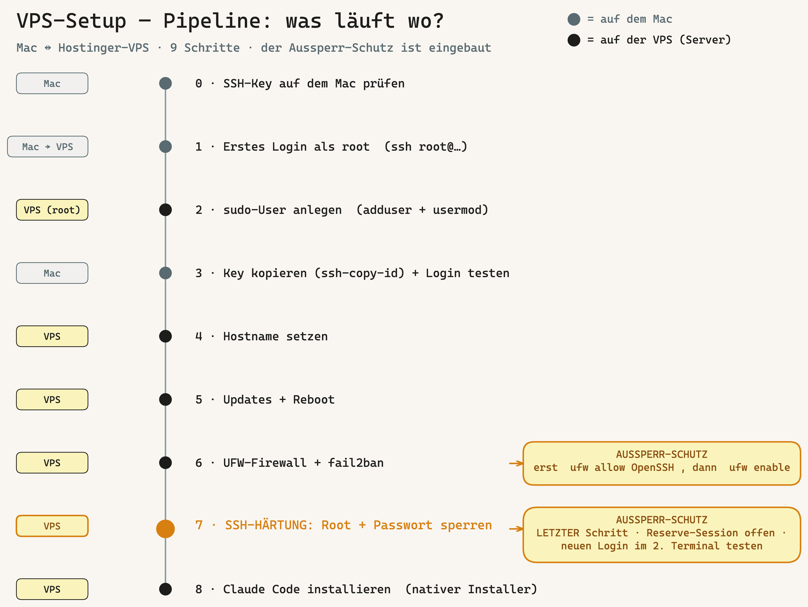
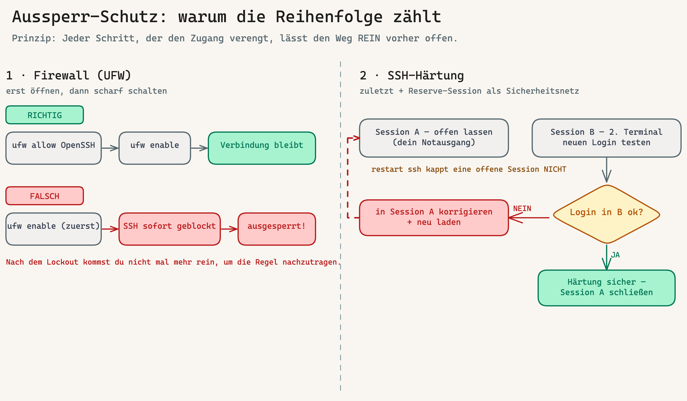

# Runbook: Hostinger-VPS-Setup (OS-Bootstrap & Härtung)

> **Scope:** Eine **frische Hostinger-VPS** vom ersten SSH-Login bis zur gehärteten,
> produktionsbereiten Maschine mit Claude Code. Dieses Runbook arbeitet auf **OS-Ebene**
> (Benutzer, Hostname, Updates, Firewall, fail2ban, SSH-Härtung).
>
> **Abgrenzung:** Das INTENTRON-**Framework**-Setup auf der VPS (Tools, Skill-Pool,
> Git-Hooks pro Repo, Team-Governance) ist **nicht** Teil dieses Runbooks — das lebt in
> [HANDBUCH.md → Anhang Y](../../HANDBUCH.md#anhang-y-vpscloud-team-runbook-boo-94).
> Reihenfolge: **erst dieses Runbook (OS-Bootstrap), dann Anhang Y (Framework).**
>
> **Voraussetzungen lokal (Mac):** ein vorhandener SSH-Key (`~/.ssh/id_ed25519`).
> Falls keiner da ist → [Schritt 0](#schritt-0--ssh-key-auf-dem-mac-prüfen).

---

## Überblick — die 8 Schritte

| # | Schritt | Wo ausführen | Reversibel? |
|---|---------|--------------|-------------|
| 0 | SSH-Key auf dem Mac prüfen | Mac | — |
| 1 | Erstes Login als `root` | Mac → VPS | — |
| 2 | Eigenen sudo-User anlegen | VPS (als root) | ja |
| 3 | SSH-Key des Users hinterlegen + Login testen | Mac | ja |
| 4 | Hostname setzen | VPS | ja |
| 5 | System aktualisieren + Pakete installieren | VPS | — |
| 6 | UFW-Firewall + fail2ban | VPS | ja |
| 7 | SSH härten (Root + Passwort sperren) | VPS | ⚠️ **zuletzt** |
| 8 | Claude Code installieren (nativer Installer) | VPS (als User) | ja |

> **Goldene Regel — der rote Faden gegen Selbst-Aussperrung:** Jeder Schritt, der den Zugang
> verengt, wird so gebaut, dass der Weg rein **vorher** offen ist.
> 1. **Firewall (Schritt 6):** erst `allow OpenSSH`, **dann** `enable` — nie umgekehrt.
> 2. **SSH-Härtung (Schritt 7):** **immer als Letztes**, erst wenn der Key-Login nachweislich
>    funktioniert, und mit einer **zweiten offenen SSH-Session** als Sicherheitsnetz während des Tests.



*Die ganze Pipeline auf einen Blick: welche Schritte auf dem **Mac** laufen, welche auf der **VPS** — und wo der Aussperr-Schutz greift (Schritte 6 + 7). ([Excalidraw-Quelle](../vps-setup-pipeline.excalidraw))*

---

## Worked Example

Dieses Runbook nutzt durchgehend ein konkretes Beispiel. Ersetze die Platzhalter durch deine Werte:

| Platzhalter | Beispiel | Bedeutung |
|-------------|----------|-----------|
| `<VPS-IP>` | `76.13.15.149` | IPv4 der VPS (Hostinger-Panel) |
| `<HOSTNAME>` | `Paperclip` | gewünschter Server-Name |
| `<username>` | `tobias` | dein neuer Login-User |

---

## Schritt 0 — SSH-Key auf dem Mac prüfen

```bash
ls -l ~/.ssh/*.pub
```

- **Vorhanden** (z. B. `id_ed25519.pub`) → weiter zu Schritt 1.
- **Keiner vorhanden** → einen erzeugen:
  ```bash
  ssh-keygen -t ed25519 -C "deine@mail.tld"
  ```
  (Bei den Abfragen Enter drücken; eine Passphrase ist empfehlenswert.)

> **Best Practice:** Pro Zweck ein eigener Key. GitHub-Key ≠ VPS-Key ist sauberer, aber
> nicht zwingend. Niemals den **privaten** Key (`id_ed25519` ohne `.pub`) weitergeben.

---

## Schritt 1 — Erstes Login als root

Root-Passwort steht im **Hostinger-Panel → VPS → Übersicht** (dort auch zurücksetzbar).

```bash
ssh root@<VPS-IP>
```

Beim ersten Mal Fingerprint mit `yes` bestätigen, dann Root-Passwort eingeben (Eingabe ist unsichtbar — normal).

> Root nutzen wir **nur** für Schritt 2. Ab Schritt 3 arbeiten wir ausschließlich als normaler User.

---

## Schritt 2 — Eigenen sudo-User anlegen

**Warum kein root für die tägliche Arbeit?** Root ist allmächtig — ein Tippfehler oder eine
kompromittierte Session = Totalschaden. Mit einem eigenen User arbeitest du normal und holst
Root-Rechte nur gezielt über `sudo` (mit Passwort-Bestätigung).

Auf der VPS (als root):

```bash
adduser <username>            # fragt nach Passwort + Name; Restfelder mit Enter überspringen, am Ende Y
usermod -aG sudo <username>   # sudo-Rechte vergeben
```

> **Best Practice — Passwort vergeben, NICHT leer lassen.** Der User bekommt `sudo`-Rechte,
> und `sudo` fragt genau dieses Passwort ab. Ein leeres Passwort wäre ein Sicherheitsloch.
> Eingeloggt wirst du trotzdem bequem per Key — das Passwort brauchst du nur für `sudo`.

---

## Schritt 3 — SSH-Key des Users hinterlegen + Login testen

Dein öffentlicher Key liegt **auf dem Mac** und wird **auf die VPS hochgeschoben** —
nicht umgekehrt. `ssh-copy-id` erledigt das inkl. korrekter Rechte.

**Auf dem Mac** (neues Terminal-Tab, root-Session offen lassen):

```bash
ssh-copy-id -i ~/.ssh/id_ed25519.pub <username>@<VPS-IP>
```

Fragt **einmal** nach dem User-Passwort (aus Schritt 2), kopiert den Key nach
`~/.ssh/authorized_keys` und setzt die Rechte.

**Login testen:**

```bash
ssh -i ~/.ssh/id_ed25519 <username>@<VPS-IP>
```

→ Muss **ohne Passwort** durchkommen. Auf der VPS gegenprüfen, dass nur dein Key drin ist:

```bash
cat ~/.ssh/authorized_keys   # genau EINE Zeile, dein erwarteter Key
```

### Komfort: Alias in `~/.ssh/config` (Mac)

Damit künftig `ssh <HOSTNAME>` genügt (auch von VS Code / Cursor Remote-SSH automatisch erkannt):

```
Host <HOSTNAME>
    HostName <VPS-IP>
    User <username>
    IdentityFile ~/.ssh/id_ed25519
    Port 22
```

> **VS Code / Cursor:** Mit installierter „Remote - SSH"-Extension erscheint `<HOSTNAME>`
> automatisch unter *Remote-SSH: Connect to Host…* — der Host-Name im `config` ist das Label.

---

## Schritt 4 — Hostname setzen

Ab hier alles **als `<username>`** (Prompt `<username>@...:~$`).

```bash
sudo hostnamectl set-hostname <HOSTNAME>
echo "127.0.1.1 <HOSTNAME>" | sudo tee -a /etc/hosts
```

Der neue Name erscheint vollständig nach dem Reboot (Schritt 5) im Prompt.

---

## Schritt 5 — System aktualisieren + Basispakete

```bash
sudo apt update && sudo apt upgrade -y
sudo apt install -y ufw fail2ban unattended-upgrades
sudo dpkg-reconfigure -plow unattended-upgrades   # bei Nachfrage: <Yes> → automatische Sicherheitsupdates
```

> Falls ein lila Dialog erscheint („Which services should be restarted?" / Config-Datei-Frage):
> die **Standardauswahl** mit Enter / `Tab → OK` bestätigen.

Bei Kernel-Updates verlangt die VPS oft einen Neustart („*** System restart required ***"):

```bash
sudo reboot          # wirft dich aus der Session — ~30–60 s warten
# dann erneut:
ssh <HOSTNAME>
```

---

## Schritt 6 — UFW-Firewall + fail2ban

> **Ab hier wird der Zugang verengt — der Aussperr-Schutz greift.** Das folgende Diagramm zeigt
> beide Fallen und wie wir sie umgehen: links die Firewall-Reihenfolge (Schritt 6), rechts die
> Reserve-Session bei der Härtung (Schritt 7).



*Links: „erst `allow OpenSSH`, dann `enable`" — sonst sperrt die Firewall die einzige Tür zu.
Rechts: Härtung zuletzt, Session A offen als Notausgang, Test in Session B.
([Excalidraw-Quelle](../vps-lockout-protection.excalidraw))*

### 6a. UFW (Uncomplicated Firewall)

**Prinzip:** Default **alles eingehende verbieten**, ausgehend erlauben, dann gezielt nur
benötigte Ports öffnen.

```bash
sudo ufw default deny incoming
sudo ufw default allow outgoing
sudo ufw allow OpenSSH            # SSH ZUERST erlauben — bevor die Firewall scharf wird!
sudo ufw enable                   # Warnung mit 'y' bestätigen
sudo ufw status verbose           # Kontrolle
```

> **⚠️ Warum die Reihenfolge dein Aussperr-Schutz ist (genau lesen):**
> Wir erlauben `OpenSSH` **bevor** wir die Firewall mit `enable` scharf schalten. Dadurch ist
> deine laufende SSH-Verbindung bereits durch eine Regel gedeckt, *wenn* die Firewall aktiv wird —
> sie bleibt bestehen. Bei `sudo ufw enable` warnt UFW deshalb:
> *„Command may disrupt existing ssh connections. Proceed with operation (y|n)?"* → mit **`y`**
> bestätigen. Das ist sicher, **genau weil** die SSH-Regel schon steht.
> **Andersherum** (`enable` zuerst, Regel danach) würdest du dich in dem Moment aussperren, in dem
> die Firewall hochfährt — die einzige Tür wäre dann zu, bevor du den Schlüssel reingelegt hast.
> Deshalb: **erst `allow OpenSSH`, dann `enable`.** Immer.

**Was genau öffnen?** Nur, was wirklich nach außen muss:

| Dienst | Befehl | Wann |
|--------|--------|------|
| SSH | `sudo ufw allow OpenSSH` | **immer** |
| HTTP | `sudo ufw allow 80/tcp` | nur bei Webserver |
| HTTPS | `sudo ufw allow 443/tcp` | nur bei Webserver/TLS |
| Eigener Port | `sudo ufw allow 8080/tcp` | nur bei Bedarf, ideal auf IP einschränken |

> **Best Practice — so wenig wie möglich öffnen.** Datenbanken, Dashboards etc. **nicht**
> öffentlich freigeben. Wenn du z. B. nur von deiner IP zugreifen willst:
> `sudo ufw allow from <deine-IP> to any port 5432 proto tcp`.
> Interne Dienste über SSH-Tunnel statt offenem Port erreichen.

### 6b. fail2ban (Brute-Force-Schutz)

fail2ban sperrt IPs nach zu vielen Fehl-Logins. Auf Debian/Ubuntu ist der `sshd`-Jail
standardmäßig aktiv. Für robuste, explizite Einstellungen eine `jail.local` anlegen:

```bash
sudo tee /etc/fail2ban/jail.local > /dev/null <<'EOF'
[DEFAULT]
# Ubuntu 24.04 liest die Logs aus dem systemd-Journal
backend  = systemd
bantime  = 1h
findtime = 10m
maxretry = 5

[sshd]
enabled = true
EOF

sudo systemctl enable --now fail2ban
sudo systemctl restart fail2ban
sudo fail2ban-client status sshd     # Kontrolle: Jail aktiv, gebannte IPs
```

> `bantime = 1h` / `maxretry = 5`: 5 Fehlversuche in 10 min → 1 h Sperre. Für strengere
> Server `bantime` erhöhen (z. B. `1d`) oder `bantime.increment = true` für eskalierende Sperren.

---

## Schritt 7 — SSH härten (Root + Passwort sperren)

> ⚠️ **Dein Aussperr-Schutz hier (genau lesen):**
> 1. **Härten ist der LETZTE Schritt** — erst wenn der Key-Login als `<username>` nachweislich
>    funktioniert (Schritt 3). Solange das nicht steht, sperrst du dir mit `PasswordAuthentication no`
>    den einzigen Notausgang zu.
> 2. **Reserve-Session offen lassen:** Mach die Änderungen in **Session A** und lass sie **offen**.
>    Ein `systemctl restart ssh` kappt eine **bestehende** Verbindung **nicht** — Session A bleibt
>    also drin, selbst wenn die neue Konfig kaputt wäre.
> 3. **Neuen Login in Session B testen** (zweites Terminal). Klappt er → alles gut, Session A schließen.
>    Klappt er **nicht** → du korrigierst einfach in der noch offenen Session A und lädst neu.
>    So kannst du dich praktisch nicht aussperren.

### 7a. Bestehende Overrides prüfen (wichtiger Cloud-Stolperstein!)

Cloud-Images legen oft Override-Dateien unter `/etc/ssh/sshd_config.d/` an
(z. B. `50-cloud-init.conf` mit `PasswordAuthentication yes`). Diese **überschreiben**
`sshd_config`. Erst prüfen, was gesetzt ist:

```bash
sudo grep -RnE "PasswordAuthentication|PermitRootLogin" /etc/ssh/sshd_config /etc/ssh/sshd_config.d/
```

### 7b. Härtung als eigene Drop-in-Datei

sshd liest `sshd_config.d/*.conf` in **alphanumerischer Reihenfolge**, und der **erste**
gefundene Wert gewinnt. Eine mit `00-` beginnende Datei wird also **vor** `50-cloud-init.conf`
gelesen und gewinnt — der sauberste Weg, ohne fremde Dateien zu editieren:

```bash
sudo tee /etc/ssh/sshd_config.d/00-hardening.conf > /dev/null <<'EOF'
PermitRootLogin no
PasswordAuthentication no
KbdInteractiveAuthentication no
PubkeyAuthentication yes
# Optional, sehr restriktiv — nur diese User dürfen per SSH rein:
# AllowUsers <username>
EOF
```

### 7c. Konfig testen, dann neu laden (alles in Session A)

Erst Syntax prüfen, **dann** die *effektiven* Werte anzeigen lassen — so siehst du **vor** dem
Neuladen, dass deine `00-`-Datei wirklich gewonnen hat (cloud-init-Override geschlagen):

```bash
sudo sshd -t            # Syntax-Check — KEINE Ausgabe = gut. Bei Fehler NICHT neu laden.
sudo sshd -T | grep -iE "permitrootlogin|passwordauthentication|pubkeyauthentication"
```

Erwartete Ausgabe:
```
permitrootlogin no
pubkeyauthentication yes
passwordauthentication no
```

Stimmt das, neu laden (Session A bleibt dabei verbunden — Restart kappt sie nicht):

```bash
sudo systemctl restart ssh
```

**Verifizieren — jetzt in Session B (zweites Terminal), Session A offen lassen:**

```bash
ssh <HOSTNAME>                 # muss weiterhin per Key durchkommen
ssh root@<VPS-IP>             # MUSS jetzt abgelehnt werden (Permission denied)
```

> Erst wenn der neue Key-Login in Session B klappt **und** root abgelehnt wird, ist die Härtung
> erfolgreich. **Dann** — und erst dann — darfst du die Reserve-Session A schließen.

---

## Schritt 8 — Claude Code installieren (nativer Installer)

> **Als `<username>` installieren, nicht als root.** Am bequemsten direkt im
> VS-Code-/Cursor-Remote-Terminal (läuft automatisch als `<username>`).

```bash
curl -fsSL https://claude.ai/install.sh | bash
```

> **Hinweis zur Methode:** Wir nutzen den **nativen Installer** (`claude.ai/install.sh`),
> nicht mehr `npm install -g @anthropic-ai/claude-code`. Der native Installer ist von
> Anthropic als *Recommended* markiert: kein Node nötig, Auto-Update im Hintergrund,
> Binary landet in `~/.local/bin/claude`.
> Die URL ist `claude.ai` (nicht `claude.com` — das gibt 404).

**PATH aktivieren** (der Installer sagt dir das oft selbst):

```bash
echo 'export PATH="$HOME/.local/bin:$PATH"' >> ~/.bashrc && source ~/.bashrc
claude --version
```

→ Bei `command not found`: einmal `exit`, neu `ssh <HOSTNAME>`, dann erneut `claude --version`.

**Starten & anmelden:**

```bash
claude
```

Beim ersten Start zeigt Claude Code einen **Login-Link**: im Browser öffnen, mit dem
**Pro-, Max-, Team- oder Console-Konto** anmelden (das kostenlose Claude.ai reicht **nicht**),
Bestätigungscode zurück ins Terminal kopieren.

> **Weiter geht's:** Ab hier übernimmt das Framework-Setup →
> [HANDBUCH Anhang Y](../../HANDBUCH.md#anhang-y-vpscloud-team-runbook-boo-94)
> (Skill-Pool, Git-Hooks pro Repo, Team-Governance). Globales Claude-Code-Setup
> (Permissions, MCP, globale CLAUDE.md) siehe Repo `vibercoder79/claude-code-setup-checklist`.

---

## Anhang: Einen zweiten User aufnehmen

Sobald die VPS gehärtet ist (Schritt 7), gibt es **keinen Passwort-Login mehr** — d. h.
`ssh-copy-id` funktioniert für neue User **nicht** (es bräuchte Passwort-Auth). Der Key des
neuen Users muss daher vom **Admin manuell** hinterlegt werden. Klare Rollentrennung:

### Teil A — Was der **neue User** auf seinem eigenen Rechner macht

1. Eigenes Schlüsselpaar erzeugen (falls noch keins):
   ```bash
   ssh-keygen -t ed25519 -C "neuer.user@mail.tld"
   ```
2. **Nur den öffentlichen Key** an den Admin schicken (Inhalt von `~/.ssh/id_ed25519.pub`).
   > ⚠️ **Niemals** den privaten Key (`id_ed25519` ohne `.pub`) weitergeben.
3. Nach Freischaltung lokalen Alias setzen (`~/.ssh/config`):
   ```
   Host <HOSTNAME>
       HostName <VPS-IP>
       User <neuer-username>
       IdentityFile ~/.ssh/id_ed25519
       Port 22
   ```

### Teil B — Was der **Admin** (`<username>` mit sudo) auf der VPS macht

```bash
# 1. User anlegen (Passwort vergeben — für sudo)
sudo adduser <neuer-username>

# 2. Nur falls der neue User Admin-Rechte braucht:
sudo usermod -aG sudo <neuer-username>

# 3. Öffentlichen Key des neuen Users hinterlegen (Key-String vom User einsetzen)
sudo mkdir -p /home/<neuer-username>/.ssh
echo "ssh-ed25519 AAAA... neuer.user@mail.tld" | sudo tee /home/<neuer-username>/.ssh/authorized_keys
sudo chmod 700 /home/<neuer-username>/.ssh
sudo chmod 600 /home/<neuer-username>/.ssh/authorized_keys
sudo chown -R <neuer-username>:<neuer-username> /home/<neuer-username>/.ssh
```

```bash
# 4. NUR falls in Schritt 7 'AllowUsers' gesetzt wurde: neuen User ergänzen
sudo sed -i 's/^AllowUsers .*/& <neuer-username>/' /etc/ssh/sshd_config.d/00-hardening.conf
sudo sshd -t && sudo systemctl restart ssh
```

### Teil C — Verifizieren

Der neue User testet von seinem Rechner:

```bash
ssh <HOSTNAME>
```

→ Muss ohne Passwort durchkommen. Damit hat der zweite User denselben sicheren Zugang.

---

## Troubleshooting

| Symptom | Ursache / Fix |
|---------|---------------|
| `Permission denied (publickey)` nach Härtung | Key nicht (korrekt) in `authorized_keys`, oder falsche Rechte (`.ssh` 700, Datei 600, Ownership). Reserve-Session nutzen, Schritt 3/Anhang B prüfen. |
| `claude: command not found` | `~/.local/bin` nicht im PATH → Schritt 8 PATH-Block, dann neu einloggen. |
| `curl ... claude.com/install.sh` → 404 | Falsche Domain. Es ist **`claude.ai`**. |
| `ufw enable` kappt die Verbindung | `sudo ufw allow OpenSSH` **vor** `enable` vergessen. Über Hostinger-Web-Konsole rein, Regel nachziehen. |
| Passwort-Login trotz Härtung möglich | Override in `/etc/ssh/sshd_config.d/` gewinnt → Schritt 7a Reihenfolge prüfen, `00-`-Datei nutzen. |
| `sudo sshd -t` meldet Fehler | Tippfehler in `00-hardening.conf` → korrigieren, **nicht** neu starten, bis `-t` sauber ist. |

---

*Quellen: gelebter Setup-Durchlauf auf Hostinger-VPS (Ubuntu 24.04 LTS) · Claude Code
Installations-Doku (code.claude.com/docs/en/setup) · ergänzt die framework-zentrierten
Bruchstücke aus HANDBUCH Anhang Y um den fehlenden OS-Bootstrap- und Härtungs-Teil.*
