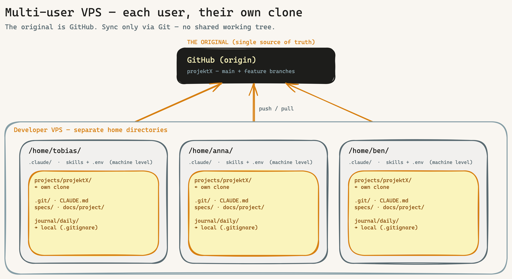

# Runbook: Multi-user VPS — onboard a new team member

> For the case: **several people work on one project on a shared VPS.** How a new team member joins cleanly — **each with their own clone, no shared working tree.** This is **level 1 (Multi-USER)** from the [collision-protection model](../kollisionsschutz-drei-ebenen.en.md). DE: [`multi-user-vps.md`](multi-user-vps.md).

## The model in one picture



**Core principle:** there is **no** shared project directory on the VPS. The "original" is the **GitHub repo**. Each user clones it into **their own home** and works there. Synchronization happens only via Git (`push`/`pull`/PR/merge) — never via shared directories. This way parallel work cannot structurally overwrite itself.

> **Clone ≠ worktree:** for **different people** (own system users) the **own clone** is correct — own `.git` DB, own permissions, own `.env`. `git worktree` (one shared `.git` DB) is meant for **one person with parallel tracks** (level 2), not across user boundaries.

## Prerequisite: VPS set up once as multi-user

Before team members join, the VPS must be set up once per **HANDBUCH Appendix P §3 (multi-user VPS)**: VPS sizing, global skill-pool mode (global under `/opt/claude/skills/` read-only **or** per user), maintenance owner named, `UMASK 077`.

## Checklist: onboard a new team member "Anna"

Four separate responsibility columns — order top to bottom:

### A — Once on the VPS (as root / owner)
- [ ] Create system user: `sudo useradd -m -s /bin/bash anna`
- [ ] Add SSH public key to `/home/anna/.ssh/authorized_keys`, password login stays globally off
- [ ] Define `sudo` rules for Anna (who may do what, what stays root-only)
- [ ] Ensure skill-pool access: with a global pool, read access to `/opt/claude/skills/`; with a per-user pool it is created in C

### B — Once in GitHub
- [ ] Invite Anna as a **collaborator** to the repo (or via team) — **or** add a deploy key if only read/CI access is needed
- [ ] Anna accepts the invite, adds her SSH key to her GitHub account

### C — Once in Claude (as user `anna` on the VPS)
- [ ] Set up `~/.claude/`: skills (own copy under `~/.claude/skills/` **or** reference to the global pool)
- [ ] `~/.claude/.env` with Anna's own secrets/tokens, **mode 600** — **no** shared `.env` files
- [ ] global `~/.claude/CLAUDE.md`: on the first `/bootstrap` the machine context (BOO-145) fills itself; `PROJECTS_ROOT` (BOO-138) is set once

### D — Per repo (as `anna`, after cloning)
- [ ] Clone the repo into **Anna's home**: `git clone git@github.com:<org>/projektX ~/projects/projektX`
- [ ] **Install git hooks** — they do **not** come with the clone (`.git/hooks/` is not cloned): `bash scripts/install-hooks.sh` (or set `core.hooksPath`)
- [ ] `bash .claude/generate-environment-json.sh` — detects the tools for this clone
- [ ] `bash scripts/verify-setup.sh` → 0 FAIL
- [ ] `cd ~/projects/projektX && claude` → work; push via GitHub

After that Anna is fully productive — in **her** clone, isolated from everyone else.

## Ready operator prompt (steps C + D — in the team member's Claude Code session)

Prerequisite: **A** (system user/SSH) + **B** (GitHub access) done by the owner. This prompt sets up the own clone + hooks + verify — **idempotent**, secrets entered by the human:

```text
Goal: I'm new to the team and setting up my workspace for "projektX" on this VPS.
My system user + SSH + GitHub access are already in place. I need: own clone +
git hooks + environment.json + verify. Step by step, ask if unclear, write NO secrets.

1. CHECK MACHINE LEVEL (~/.claude/, NOT cloned):
   - Skills present (own ~/.claude/skills/ OR global pool /opt/claude/skills/)?
   - ~/.claude/.env (mode 600)? If not: instruct me to create it — I enter the tokens.

2. OWN CLONE into my home (NOT a foreign/shared directory):
   - Confirm target path: <PROJECTS_ROOT>/projektX  (default ~/projects/projektX)
   - git clone <repo-ssh-url> <target> && cd <target>

3. REPO-LOCAL SETUP:
   - bash scripts/install-hooks.sh   (activates the versioned git hooks via core.hooksPath;
     .git/hooks/ is not cloned). Runtime hooks (spec-gate etc.) are already active with the
     clone via $CLAUDE_PROJECT_DIR.
   - bash .claude/generate-environment-json.sh
   - bash scripts/verify-setup.sh    → must show 0 FAIL; show me any FAILs.

4. CONFIRM ISOLATION: pwd is under /home/<me>/...; journal/daily/ stays local (.gitignore).

5. SUMMARY at the end: clone path · hook status (core.hooksPath) · verify result · next step
   (cd <clone> && claude → work, push/PR via GitHub).
```

## What is shared, what stays local

| Artifact | Shared (via Git, committed) | Local per user |
|---|---|---|
| Code, specs, `ARCHITECTURE_DESIGN.md` | ✅ | |
| PMO hub (`docs/project/README.md`), `decisions/`, `meetings/`, `research/` | ✅ | |
| **`journal/daily/` (daily log)** | | ✅ → in `.gitignore`, own journal per user |
| `~/.claude/` (skills, `.env`, global CLAUDE.md) | | ✅ machine level, never cloned |

→ Shared **project knowledge** is committed and visible to all; the **personal log** stays local. This way the team knows where the project stands without daily notes clobbering each other.

## Boundary to the other levels

- You alone with **two sessions** on one clone? → **Level 2**, use `git worktree` ([collision-protection model](../kollisionsschutz-drei-ebenen.en.md)).
- One story with **several AI agents** in parallel? → **Level 3**, `EXECUTION_ISOLATION` (applies automatically in the `implement` skill).

## References

[Collision-protection model (three levels)](../kollisionsschutz-drei-ebenen.en.md) · HANDBUCH **Appendix P §3** (multi-user VPS setup) · **Appendix U** (per-project minimal checklist) · **Appendix Y** (VPS team lifecycle) · `docs/how-we-document.md`.
