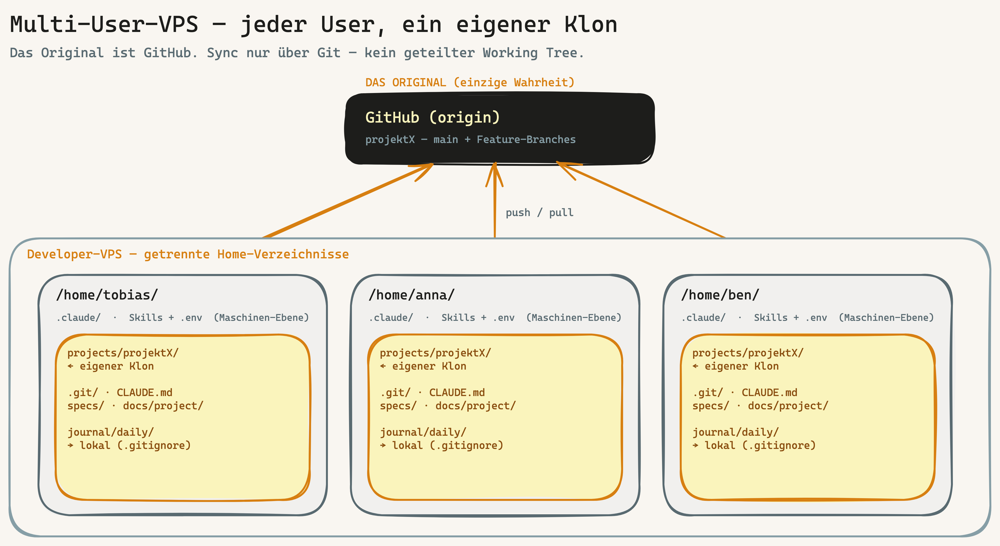

# Runbook: Multi-User-VPS — neues Teammitglied onboarden

> Für den Fall: **mehrere Menschen arbeiten an einem Projekt auf einer gemeinsamen VPS.** Wie ein neues Teammitglied sauber dazukommt — **jeder mit eigenem Klon, kein geteilter Working Tree.** Das ist **Ebene 1 (Multi-USER)** aus dem [Kollisionsschutz-Modell](../kollisionsschutz-drei-ebenen.md). EN: [`multi-user-vps.en.md`](multi-user-vps.en.md).

## Das Modell in einem Bild

**Kernprinzip:** Es gibt **kein** geteiltes Projektverzeichnis auf der VPS. Das „Original" ist das **GitHub-Repo**. Jeder User klont es in **sein eigenes Home** und arbeitet dort. Synchronisiert wird nur über Git (`push`/`pull`/PR/Merge) — nie über gemeinsame Verzeichnisse. So kann sich parallele Arbeit strukturell nicht überschreiben.

> **Klon ≠ Worktree:** Bei **verschiedenen Menschen** (eigene System-User) ist der **eigene Klon** richtig — eigene `.git`-DB, eigene Permissions, eigene `.env`. `git worktree` (eine geteilte `.git`-DB) ist für **eine Person mit parallelen Spuren** gedacht (Ebene 2), nicht über User-Grenzen.

## Voraussetzung: VPS einmal als Multi-User aufgesetzt

Bevor Teammitglieder dazukommen, muss die VPS einmal nach **HANDBUCH Anhang P §3 (Multi-User-VPS)** eingerichtet sein: VPS-Sizing, globaler Skill-Pool-Modus (global unter `/opt/claude/skills/` read-only **oder** pro User), Wartungs-Owner benannt, `UMASK 077`.

## Checkliste: neues Teammitglied „Anna" onboarden

Vier getrennte Verantwortungs-Spalten — Reihenfolge von oben nach unten:

### A — Einmal auf der VPS (als root / Owner)
- [ ] System-User anlegen: `sudo useradd -m -s /bin/bash anna`
- [ ] SSH-Public-Key in `/home/anna/.ssh/authorized_keys` hinterlegen, Passwort-Login bleibt global aus
- [ ] `sudo`-Regeln für Anna definieren (wer darf was, was bleibt root-only)
- [ ] Skill-Pool-Zugriff sicherstellen: bei globalem Pool Leserecht auf `/opt/claude/skills/`; bei Pro-User-Pool wird er in C angelegt

### B — Einmal in GitHub
- [ ] Anna als **Collaborator** zum Repo einladen (oder via Team) — **oder** einen Deploy-Key hinterlegen, falls nur Lesezugriff/CI
- [ ] Anna nimmt die Einladung an, hinterlegt ihren SSH-Key in ihrem GitHub-Account

### C — Einmal in Claude (als User `anna` auf der VPS)
- [ ] `~/.claude/` einrichten: Skills (eigene Kopie unter `~/.claude/skills/` **oder** Verweis auf den globalen Pool)
- [ ] `~/.claude/.env` mit Annas eigenen Secrets/Tokens, **Mode 600** — **keine** geteilten `.env`-Dateien
- [ ] globale `~/.claude/CLAUDE.md`: beim ersten `/bootstrap` füllt der Maschinen-Kontext (BOO-145) sich selbst; `PROJECTS_ROOT` (BOO-138) wird einmalig gesetzt

### D — Pro Repo (als `anna`, nach dem Klonen)
- [ ] Repo in **Annas Home** klonen: `git clone git@github.com:<org>/projektX ~/projects/projektX`
- [ ] **Git-Hooks installieren** — kommen **nicht** mit dem Klon (`.git/hooks/` wird nicht geklont): `bash scripts/install-hooks.sh` (oder `core.hooksPath` setzen)
- [ ] `bash .claude/generate-environment-json.sh` — erkennt die Tools für diesen Klon
- [ ] `bash scripts/verify-setup.sh` → 0 FAIL
- [ ] `cd ~/projects/projektX && claude` → arbeiten; pushen über GitHub

Danach ist Anna voll arbeitsfähig — in **ihrem** Klon, isoliert von allen anderen.

## Was geteilt wird, was lokal bleibt

| Artefakt | Geteilt (via Git, committet) | Lokal pro User |
|---|---|---|
| Code, Specs, `ARCHITECTURE_DESIGN.md` | ✅ | |
| PMO-Hub (`docs/project/README.md`), `decisions/`, `meetings/`, `research/` | ✅ | |
| **`journal/daily/` (Tageslogbuch)** | | ✅ → in `.gitignore`, eigenes Journal pro User |
| `~/.claude/` (Skills, `.env`, globale CLAUDE.md) | | ✅ Maschinen-Ebene, nie geklont |

→ Geteiltes **Projektwissen** ist committet und für alle sichtbar; das **persönliche Logbuch** bleibt lokal. So weiß das Team, wo das Projekt steht, ohne dass sich Daily Notes gegenseitig zerschießen.

## Abgrenzung zu den anderen Ebenen

- Du selbst mit **zwei Sessions** auf einem Klon? → **Ebene 2**, nutze `git worktree` ([Kollisionsschutz-Modell](../kollisionsschutz-drei-ebenen.md)).
- Eine Story mit **mehreren KI-Agenten** parallel? → **Ebene 3**, `EXECUTION_ISOLATION` (greift automatisch im `implement`-Skill).

## Verweise

[Kollisionsschutz-Modell (drei Ebenen)](../kollisionsschutz-drei-ebenen.md) · HANDBUCH **Anhang P §3** (Multi-User-VPS-Setup) · **Anhang U** (Pro-Projekt-Minimal-Checkliste) · **Anhang Y** (VPS-Team-Lebenszyklus) · `docs/how-we-document.md`.
