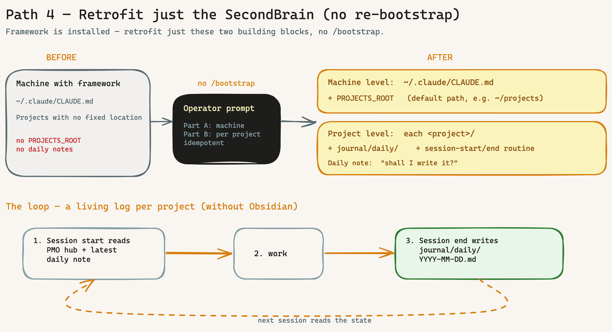

# Runbook: Retrofit the SecondBrain setup (without re-bootstrapping)

> For machines/projects where the framework is **already installed** and you want to retrofit **only** the lightweight SecondBrain setup (standard project path + daily-note loop, BOO-138/139) — **without** re-running `/bootstrap`. DE: [`secondbrain-nachziehen.md`](secondbrain-nachziehen.md).

## When to use this runbook

Appendix U describes three onboarding paths (new project · project 2..N · onboard an existing project). This runbook is the **fourth case — the single-feature retrofit**:

> "I already have the framework running and do **not** want to re-run the whole bootstrap — but I want to take project documentation to the next level: a fixed project location and a living daily-note log per project (lightweight SecondBrain without Obsidian)."

The prompt below retrofits exactly that — **surgically and idempotently**.



## What it does

Two levels — both additive, nothing is overwritten:

1. **Machine level** (`~/.claude/CLAUDE.md`): records a **standard project path `PROJECTS_ROOT`**. Future projects then land at the same location frictionlessly (default proposal, override remains). → BOO-138
2. **Project level** (per existing project): retrofits `journal/daily/` + the **session-start** and **session-end** routine into the project `CLAUDE.md`. At session end the AI asks "shall I write the daily note?", and on the next start it reads the latest daily note. → BOO-139

Result: the same loop as a fresh bootstrap (`v0.8.0`), but only the two SecondBrain building blocks — without touching stack, hooks, specs or governance.

## The operator prompt

Run in a Claude Code session **on the target machine**:

```text
Goal: I want to retrofit the lightweight SecondBrain setup (intentron v0.8.0, BOO-138/139)
on THIS machine — WITHOUT re-running /bootstrap. Two building blocks:
(1) standard project path PROJECTS_ROOT in the global ~/.claude/CLAUDE.md,
(2) journal/daily/ + session-end daily-note routine in every existing project.

Work surgically and idempotently: ALWAYS Read before Edit, never overwrite existing
content, only add. Skip whatever is already present. No secrets.

── PART A — machine level (~/.claude/CLAUDE.md) ──
1. Read ~/.claude/CLAUDE.md.
2. If NO "PROJECTS_ROOT" / "project standard path" is present: propose a path to me
   (default: ~/projects) and WAIT for my confirmation before writing.
3. After confirmation, add this section:

   ## Project standard path
   - PROJECTS_ROOT: <confirmed path> — new projects are created here by default
     (<PROJECTS_ROOT>/<project-name>); override always possible.
   - When creating a new project, default to this location.
   - Per project: PMO hub + specs/ + journal/daily/ + docs/project/.
     Session start reads the state, session end writes the daily note.

── PART B — per existing project under PROJECTS_ROOT ──
1. List all project folders under PROJECTS_ROOT.
2. For each project with a CLAUDE.md:
   a) Check whether it already has a "session-end routine" or journal/daily/.
      If yes → skip.
   b) If no → add to the project CLAUDE.md (additively):
      - Session start: also read the latest journal/daily/ note
        ("where did we leave off yesterday?").
      - new section:

        ## Session-end routine (daily note)
        At the natural end of a session, actively offer:
        "Shall I write the daily note so the next session knows where we are?"
        On confirmation → journal/daily/YYYY-MM-DD.md (one file per day):
        - What was done (bullets)
        - Decisions — title + reference to docs/project/decisions/ (no duplication)
        - Open for next session
   c) Create the folder journal/daily/ (if missing).
3. Give me a summary at the end: which projects were extended, which skipped, and why.

── Canonical source (if the intentron repo is on this machine and up to date) ──
bootstrap/references/global-registry-update.md §3a (PROJECTS_ROOT) and
bootstrap/references/file-templates.md (CLAUDE.md template, session-start/end routine),
as of v0.8.0. On divergence the repo is authoritative.
```

## Safety & idempotency

- **Read before Edit, additive only:** existing `CLAUDE.md` content is never overwritten — new sections are appended.
- **Path confirmation:** the standard project path is proposed but only written after operator confirmation (on a VPS often `/root/projects` or `~/projects`).
- **Idempotent:** safe to run repeatedly — whatever is already present (`PROJECTS_ROOT`, session-end routine, `journal/daily/`) is skipped.
- **No secret:** no tokens/keys are written.
- **Self-contained:** the prompt works even if the intentron repo on the machine is not at `v0.8.0` — the snippets are included. If the repo is current, it serves as the canonical template.

## Afterwards

- For **future** projects, also pull the fresh `bootstrap` (`v0.8.0`+) (e.g. `git pull` in the intentron clone) — then `/bootstrap` asks new projects for `PROJECTS_ROOT` automatically and creates `journal/daily/` directly.
- Optionally run the full existing-project onboarding (Appendix U path 3) if you want to retrofit not just the SecondBrain blocks but also hooks/gates/specs.

## References

BOO-138/139 (`v0.8.0`) · HANDBUCH Appendix U (multi-project operation, path 4) · `bootstrap/references/global-registry-update.md` §3a · `bootstrap/references/file-templates.md` (session routines) · `bootstrap/references/project-documentation-ssot.md` (lightweight SecondBrain loop) · `docs/how-we-document.md`.
