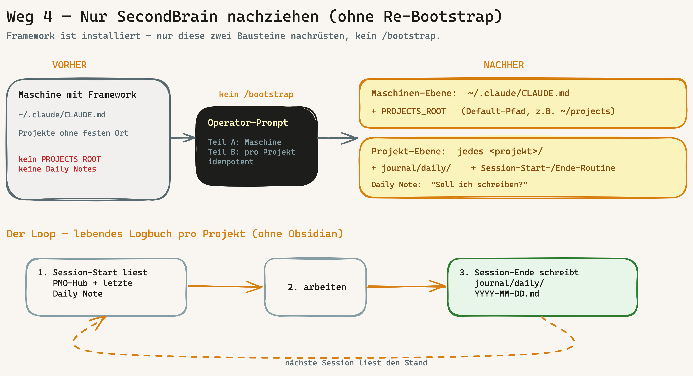

# Runbook: SecondBrain-Setup nachziehen (ohne Re-Bootstrap)

> Für Maschinen/Projekte, auf denen das Framework **bereits installiert** ist und die **nur** das Leichtgewicht-SecondBrain-Setup (Standard-Projektpfad + Daily-Note-Loop, BOO-138/139) nachrüsten wollen — **ohne** `/bootstrap` neu zu fahren. EN: [`secondbrain-nachziehen.en.md`](secondbrain-nachziehen.en.md).

## Wann dieses Runbook?

Anhang U beschreibt drei Onboarding-Wege (neues Projekt · Projekt 2..N · Bestands-Projekt onboarden). Dieses Runbook ist der **vierte Fall — der Single-Feature-Nachzug**:

> „Ich habe das Framework schon laufen und will **nicht** den ganzen Bootstrap erneut fahren — aber ich will die Projekt-Dokumentation auf Next-Level heben: einen festen Projekt-Ort und ein lebendes Daily-Note-Logbuch pro Projekt (Leichtgewicht-SecondBrain ohne Obsidian)."

Genau das zieht der Prompt unten **chirurgisch und idempotent** nach.



## Was es bewirkt

Zwei Ebenen — beide additiv, nichts wird überschrieben:

1. **Maschinen-Ebene** (`~/.claude/CLAUDE.md`): trägt einen **Standard-Projektpfad `PROJECTS_ROOT`** ein. Damit landen künftige Projekte reibungsarm am selben Ort (Default-Vorschlag, Override bleibt). → BOO-138
2. **Projekt-Ebene** (pro bestehendem Projekt): rüstet `journal/daily/` + die **Session-Start-** und **Session-Ende-Routine** in der Projekt-`CLAUDE.md` nach. Am Sessionende fragt die KI „Soll ich die Daily Note schreiben?", beim nächsten Start liest sie die letzte Daily Note mit. → BOO-139

Ergebnis: derselbe Loop wie beim frischen Bootstrap (`v0.8.0`), aber nur die zwei SecondBrain-Bausteine — ohne Eingriff in Stack, Hooks, Specs oder Governance.

## Der Operator-Prompt

In einer Claude-Code-Session **auf der Zielmaschine** ausführen:

```text
Ziel: Ich will das Leichtgewicht-SecondBrain-Setup (intentron v0.8.0, BOO-138/139) auf
DIESER Maschine nachziehen — OHNE /bootstrap neu zu fahren. Zwei Bausteine:
(1) Standard-Projektpfad PROJECTS_ROOT in der globalen ~/.claude/CLAUDE.md,
(2) journal/daily/ + Session-Ende-Daily-Note-Routine in jedem bestehenden Projekt.

Arbeite chirurgisch und idempotent: IMMER Read vor Edit, niemals bestehende Inhalte
überschreiben, nur additiv ergänzen. Was schon vorhanden ist, überspringen. Keine Secrets.

── TEIL A — Maschinen-Ebene (~/.claude/CLAUDE.md) ──
1. Lies ~/.claude/CLAUDE.md.
2. Wenn KEIN "PROJECTS_ROOT" / "Projekt-Standardpfad" drinsteht: schlage mir einen Pfad
   vor (Default: ~/projects) und WARTE auf meine Bestätigung, bevor du schreibst.
3. Nach Bestätigung additiv diesen Abschnitt ergänzen:

   ## Projekt-Standardpfad
   - PROJECTS_ROOT: <bestätigter Pfad> — neue Projekte werden standardmäßig hier
     angelegt (<PROJECTS_ROOT>/<projektname>); Override jederzeit möglich.
   - Beim Anlegen eines neuen Projekts dorthin defaulten.
   - Pro Projekt gilt: PMO-Hub + specs/ + journal/daily/ + docs/project/.
     Session-Start liest den Stand, Session-Ende schreibt die Daily Note.

── TEIL B — pro bestehendem Projekt unter PROJECTS_ROOT ──
1. Liste alle Projektordner unter PROJECTS_ROOT.
2. Für jedes Projekt mit einer CLAUDE.md:
   a) Prüfe, ob es schon eine "Session-Ende-Routine" oder journal/daily/ gibt.
      Wenn ja → überspringen.
   b) Wenn nein → in der Projekt-CLAUDE.md additiv ergänzen:
      - Session-Start: zusätzlich die neueste journal/daily/-Notiz mitlesen
        ("wo sind wir gestern stehen geblieben?").
      - neue Sektion:

        ## Session-Ende-Routine (Daily Note)
        Am natürlichen Sessionende aktiv anbieten:
        "Soll ich die Daily Note schreiben, damit die nächste Session weiß, wo wir stehen?"
        Bei Bestätigung → journal/daily/YYYY-MM-DD.md (eine Datei pro Tag):
        - Was wurde gemacht (Stichpunkte)
        - Entscheidungen — Titel + Verweis auf docs/project/decisions/ (keine Duplikation)
        - Offen für nächste Session
   c) Lege den Ordner journal/daily/ an (falls nicht vorhanden).
3. Gib mir am Ende eine Übersicht: welche Projekte ergänzt, welche übersprungen, warum.

── Kanonische Quelle (falls das intentron-Repo auf dieser Maschine liegt und aktuell ist) ──
bootstrap/references/global-registry-update.md §3a (PROJECTS_ROOT) und
bootstrap/references/file-templates.md (CLAUDE.md-Template, Session-Start-/Ende-Routine),
ab v0.8.0. Bei Abweichung gilt das Repo als Vorlage.
```

## Sicherheit & Idempotenz

- **Read vor Edit, nur additiv:** Bestehende `CLAUDE.md`-Inhalte werden nie überschrieben — neue Abschnitte werden ergänzt.
- **Pfad-Bestätigung:** Der Standard-Projektpfad wird vorgeschlagen, aber erst nach Operator-Bestätigung geschrieben (auf VPS oft `/root/projects` oder `~/projects`).
- **Idempotent:** Mehrfach ausführbar — was schon vorhanden ist (`PROJECTS_ROOT`, Session-Ende-Routine, `journal/daily/`), wird übersprungen.
- **Kein Secret:** Es werden keine Tokens/Keys geschrieben.
- **Self-contained:** Der Prompt funktioniert auch, wenn das intentron-Repo auf der Maschine nicht auf `v0.8.0` ist — die Snippets sind enthalten. Liegt das Repo aktuell vor, dient es als kanonische Vorlage.

## Danach

- Für **künftige** Projekte zusätzlich das frische `bootstrap` (`v0.8.0`+) einspielen (z.B. `git pull` im intentron-Klon) — dann fragt `/bootstrap` neue Projekte automatisch nach `PROJECTS_ROOT` und legt `journal/daily/` direkt an.
- Optional: das volle Bestands-Onboarding (Anhang U Weg 3) fahren, wenn nicht nur die SecondBrain-Bausteine, sondern auch Hooks/Gates/Specs nachgezogen werden sollen.

## Verweise

BOO-138/139 (`v0.8.0`) · HANDBUCH Anhang U (Multi-Projekt-Betrieb, Weg 4) · `bootstrap/references/global-registry-update.md` §3a · `bootstrap/references/file-templates.md` (Session-Routinen) · `bootstrap/references/project-documentation-ssot.md` (Leichtgewicht-SecondBrain-Loop) · `docs/how-we-document.md`.
