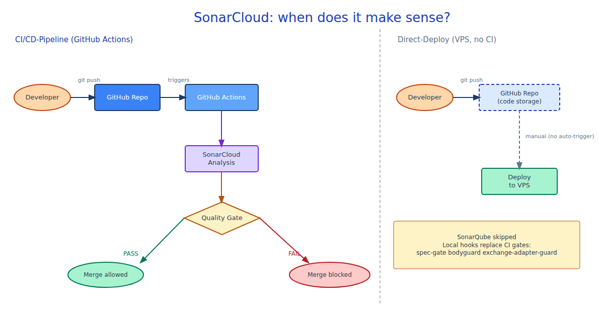

# Runbook: SonarCloud Integration for New GitHub Repos

**Purpose:** Step-by-step guide to set up SonarCloud as a required status check in a new GitHub repository.

**Last updated:** 2026-06-05

> DE: [`sonarcloud-setup.md`](sonarcloud-setup.md)

---

## When does SonarCloud make sense?

**Short answer: only when you use GitHub Actions as a CI/CD pipeline.**

SonarCloud triggers via GitHub Actions on every push. Without a CI pipeline, this setup is meaningless.

| Setup | SonarCloud? |
|-------|------------|
| GitHub Actions CI/CD — Push → Actions → Deploy | **Yes — full value** |
| Direct deployment to VPS — GitHub = code storage only | **No — local hooks replace CI gates** |
| Hybrid (some branches via CI) | Optional, per branch |

**For direct-deploy setups (VPS, no GitHub Actions):**
Local hooks cover the same quality gates: `pre-edit-bodyguard` (Layer 0), `spec-gate`, `semgrep pre-commit` (Layer 2). SonarCloud can be added later when a CI pipeline is introduced.



> Excalidraw source for editing: [`sonarcloud-setup.en.excalidraw`](sonarcloud-setup.en.excalidraw)

---

## Prerequisites

- GitHub repo exists (public or private)
- SonarCloud account at sonarcloud.io (free for open source, licensed for private repos)
- Admin access to the GitHub repo (for secrets + branch protection)
- GitHub Actions is used as deployment pipeline

---

## Step 1: Create SonarCloud project

1. Log in at [sonarcloud.io](https://sonarcloud.io)
2. **+** → **Analyze new project**
3. Select GitHub organisation → click repository → **Set up**
4. Analysis method: choose **GitHub Actions**
5. SonarCloud displays the `SONAR_TOKEN` → **do not close**, needed in the next step

---

## Step 2: Use the correct token type

> **Critical:** For GitHub Actions always use a **Project Analysis Token**, not a User Token.

Get the token:
- sonarcloud.io → Project → **Administration** → **Analysis Method** → **GitHub Actions**
- Click **Generate a token** → copy token

Wrong token type causes `Execute Analysis` errors in GitHub Actions.

---

## Step 3: Set GitHub secret

1. GitHub repo → **Settings** → **Secrets and variables** → **Actions**
2. **New repository secret**
   - Name: `SONAR_TOKEN`
   - Value: paste token from step 2
3. **Add secret**

---

## Step 4: Create sonar-project.properties

Create in the repo root:

```properties
sonar.projectKey=<org>_<repo-name>
sonar.organization=<org-slug>
sonar.sources=.
sonar.exclusions=node_modules/**,dist/**,.next/**,coverage/**
sonar.javascript.lcov.reportPaths=coverage/lcov.info
```

`projectKey` and `organization` are shown on the SonarCloud project page under **Information**.

---

## Step 5: Create GitHub Actions workflow

File: `.github/workflows/sonarcloud.yml`

```yaml
name: SonarCloud Analysis

on:
  push:
    branches: [main]
  pull_request:
    types: [opened, synchronize, reopened]

jobs:
  sonarcloud:
    runs-on: ubuntu-latest
    steps:
      - uses: actions/checkout@v4
        with:
          fetch-depth: 0

      - name: SonarCloud Scan
        uses: SonarSource/sonarcloud-github-action@master
        env:
          GITHUB_TOKEN: ${{ secrets.GITHUB_TOKEN }}
          SONAR_TOKEN: ${{ secrets.SONAR_TOKEN }}
```

---

## Step 6: Add SonarCloud as required status check

1. GitHub repo → **Settings** → **Branches** → open branch protection rule for `main` (or create new)
2. Enable **Require status checks to pass before merging**
3. Search: type `SonarCloud Code Analysis` → check it
4. **Save changes**

> **Note:** The status check only appears in the search **after the workflow has run successfully at least once**.
> Not found? → Run step 6a first, then continue here.

### Step 6a: Trigger first scan manually

**Option A — push empty commit (recommended):**
```bash
git commit --allow-empty -m "chore: trigger sonarcloud scan" && git push
```

**Option B — re-run failed job:**
GitHub repo → **Actions** → `SonarCloud Analysis` → click last run → **Re-run all jobs**

Wait for the job to turn green in GitHub Actions, then repeat step 6.

---

## Troubleshooting

| Error | Cause | Solution |
|-------|-------|----------|
| `You are not authorized to run analysis` | User token instead of Project Analysis Token | Regenerate token from step 2 |
| `SONAR_TOKEN` not found | Secret not set or typo | Repeat step 3 |
| Quality Gate stays `In Progress` | First scan still running | Wait 2–5 minutes |
| Status check not visible in branch protection | Workflow never ran successfully | Run step 6a, then search again |

---

## Related artifacts

- `specs/<STORY-ID>.md` — Story: set up SonarCloud integration
- `.github/workflows/sonarcloud.yml` — workflow file
- `sonar-project.properties` — project configuration
- `ARCHITECTURE_DESIGN.md §9` — reference index
