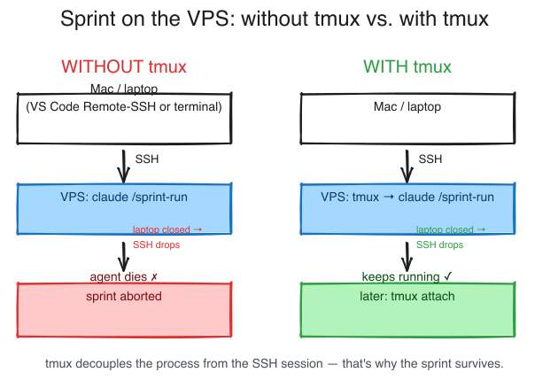

# Runbook: Run a sprint unattended on the VPS — with tmux

**Purpose:** So that a `/sprint-run` (or *any* long-running Claude work) **keeps running when you close your laptop** or the connection drops.

**Last updated:** 2026-06-07

> DE: [`sprint-unattended-tmux.md`](sprint-unattended-tmux.md)

---

## The problem

`claude` does run on the **VPS** (not on your Mac) — but the live session **is tied to your SSH connection**. Close the laptop, let Wi-Fi sleep, or drop SSH, and **the Claude agent dies with the connection**. A half-finished sprint would be aborted.

## The fix: tmux

`tmux` is a "terminal multiplexer": it keeps your session alive as its **own process on the VPS**. An SSH disconnect then only cuts the **display**, not the process — the sprint keeps running on the VPS and you re-attach later.



> Excalidraw source to edit: [`sprint-unattended-tmux.en.excalidraw`](sprint-unattended-tmux.en.excalidraw)

---

## Step by step

1. **SSH onto the VPS** — any terminal works:
   - Mac terminal: `ssh your-vps`, **or**
   - the **integrated terminal in VS Code** (under Remote-SSH that is also a shell on the VPS).

2. **Start a tmux session** (name is up to you, e.g. `sprint`):
   ```bash
   tmux new -A -s sprint
   ```
   `-A` means "attach if a session `sprint` already exists, otherwise create it" — so you always land in the same one.

3. **Start Claude and kick off the work:**
   ```bash
   claude
   # then e.g.:  /sprint-run
   ```

4. **Detach** — when you're heading out / want to close the Mac:
   **`Ctrl`+`B`**, release, then **`D`**. You're back in the normal terminal; the sprint keeps running on the VPS. Closing the Mac is now safe.

5. **Re-attach later:**
   ```bash
   ssh your-vps
   tmux attach -t sprint
   ```
   (`-t` = "target", the session name from step 2.)

## Cheatsheet

| Action | Command / key |
|---|---|
| Start/open session | `tmux new -A -s sprint` |
| Detach (keeps running) | `Ctrl`+`B`, then `D` |
| Re-attach | `tmux attach -t sprint` |
| List running sessions | `tmux ls` |
| End session (inside tmux) | `exit` |

---

## When do you need this?

- **Yes:** long-running work that should survive closing the laptop / a dropped connection — e.g. a full `/sprint-run`, a long build, a large test suite.
- **Not needed:** short, interactive work you're watching anyway.

> **Recommendation:** When working remotely on a VPS, it's worth starting **long runs in tmux by default**. This applies **not only to `/sprint-run`** but to any work that shouldn't die with your SSH connection.

## Limit (deliberately no daemon)

tmux is "**started once by you, runs until crash or stop**". What tmux **cannot** do:
- **no** scheduled auto-start (e.g. "every night at 3 a.m. on its own"),
- **no** self-healing after a crash,
- **does not survive** a VPS reboot.

That would be the job of a real daemon (`cron`/`systemd`). The framework **deliberately** does not require one — for "start the sprint and let it run undisturbed", tmux is entirely enough.

---

## Related

- [`sprint-run/README.en.md`](../../sprint-run/README.en.md) — the sprint orchestrator itself
- [`hostinger-vps-setup.en.md`](hostinger-vps-setup.en.md) · [`multi-user-vps.en.md`](multi-user-vps.en.md) — VPS basics
