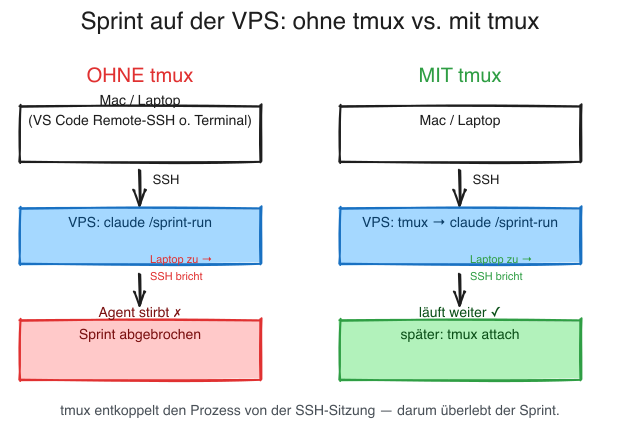

# Runbook: Sprint unbeaufsichtigt auf der VPS fahren — mit tmux

**Zweck:** Damit ein `/sprint-run` (oder *jede* langlaufende Claude-Arbeit) **weiterläuft, wenn du den Laptop zuklappst** oder die Verbindung abbricht.

**Zuletzt aktualisiert:** 2026-06-07

> EN: [`sprint-unattended-tmux.en.md`](sprint-unattended-tmux.en.md)

---

## Das Problem

`claude` läuft zwar auf der **VPS** (nicht auf deinem Mac) — aber die laufende Sitzung **hängt an deiner SSH-Verbindung**. Klappst du den Laptop zu, schläft das WLAN ein oder bricht SSH ab, **stirbt der Claude-Agent mit der Verbindung**. Ein halb fertiger Sprint wäre dann abgebrochen.

## Die Lösung: tmux

`tmux` ist ein „Terminal-Multiplexer": Er hält deine Sitzung als **eigenen Prozess auf der VPS** am Leben. Eine SSH-Trennung kappt dann nur die **Anzeige**, nicht den Prozess — der Sprint läuft auf der VPS weiter, und du hängst dich später wieder dran.



> Excalidraw-Quelle zum Bearbeiten: [`sprint-unattended-tmux.excalidraw`](sprint-unattended-tmux.excalidraw)

---

## Schritt für Schritt

1. **Per SSH auf die VPS** — egal über welches Terminal:
   - Mac-Terminal: `ssh deine-vps`, **oder**
   - das **integrierte Terminal in VS Code** (bei Remote-SSH ist das ebenfalls eine Shell auf der VPS).

2. **tmux-Sitzung starten** (Name frei wählbar, z.B. `sprint`):
   ```bash
   tmux new -A -s sprint
   ```
   `-A` heißt „anhängen, falls die Sitzung `sprint` schon existiert, sonst neu anlegen" — so landest du immer in derselben.

3. **Claude starten und die Arbeit anstoßen:**
   ```bash
   claude
   # dann z.B.:  /sprint-run
   ```

4. **Abkoppeln (detach)** — wenn du unterwegs bist / den Mac zuklappen willst:
   **`Strg`+`B`**, loslassen, dann **`D`**. Du bist zurück im normalen Terminal; der Sprint läuft auf der VPS weiter. Mac zuklappen ist jetzt gefahrlos.

5. **Später wieder anhängen (attach):**
   ```bash
   ssh deine-vps
   tmux attach -t sprint
   ```
   (`-t` = „target", der Sitzungsname aus Schritt 2.)

## Cheatsheet

| Aktion | Befehl / Taste |
|---|---|
| Sitzung starten/öffnen | `tmux new -A -s sprint` |
| Abkoppeln (läuft weiter) | `Strg`+`B`, dann `D` |
| Wieder anhängen | `tmux attach -t sprint` |
| Laufende Sitzungen anzeigen | `tmux ls` |
| Sitzung beenden (im tmux) | `exit` |

---

## Wann brauchst du das?

- **Ja:** langlaufende Arbeit, die das Zuklappen / einen Verbindungsabbruch überdauern soll — z.B. ein ganzer `/sprint-run`, ein langer Build, eine große Test-Suite.
- **Nein nötig:** kurze, interaktive Arbeit, bei der du ohnehin zusiehst.

> **Empfehlung:** Wenn du remote auf einer VPS arbeitest, lohnt es sich, **lange Läufe grundsätzlich in tmux** zu starten. Das gilt **nicht nur für `/sprint-run`**, sondern für jede Arbeit, die nicht an deiner SSH-Verbindung sterben soll.

## Grenze (bewusst kein Daemon)

tmux ist „**einmal von dir gestartet, läuft bis Crash oder Stop**". Was tmux **nicht** kann:
- **kein** zeitgesteuerter Auto-Start (z.B. „jede Nacht um 3 Uhr von allein"),
- **keine** Selbstheilung nach einem Absturz,
- **übersteht keinen** VPS-Neustart.

Das wäre Sache eines echten Daemons (`cron`/`systemd`). Den setzt das Framework **bewusst nicht** voraus — für „starte den Sprint und lass ihn ungestört durchlaufen" reicht tmux vollständig.

---

## Verwandt

- [`sprint-run/README.md`](../../sprint-run/README.md) — der Sprint-Orchestrator selbst
- [`hostinger-vps-setup.md`](hostinger-vps-setup.md) · [`multi-user-vps.md`](multi-user-vps.md) — VPS-Grundlagen
