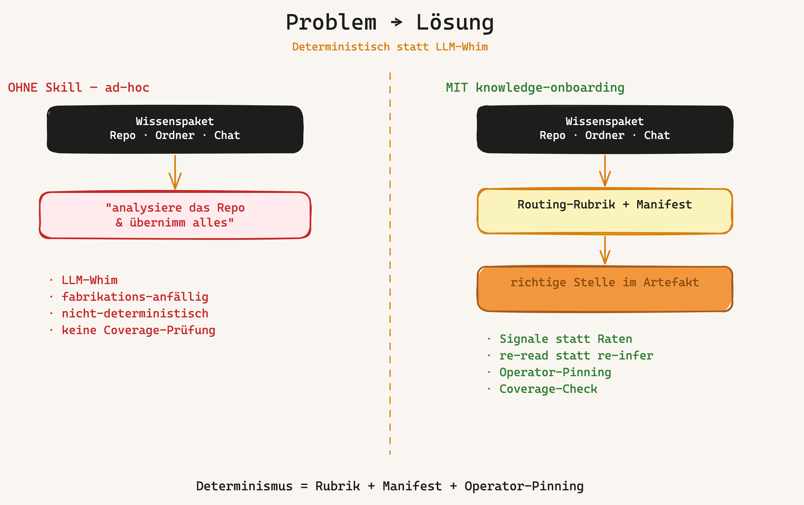
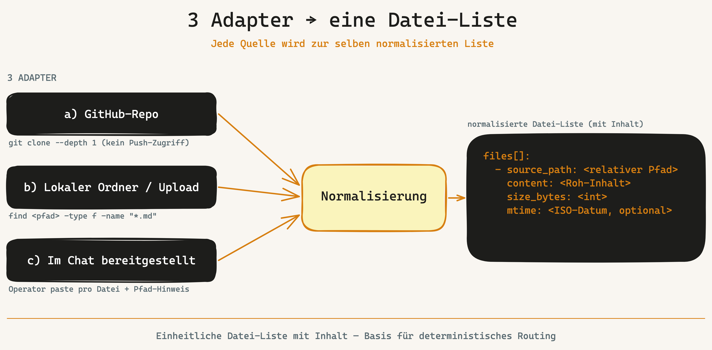
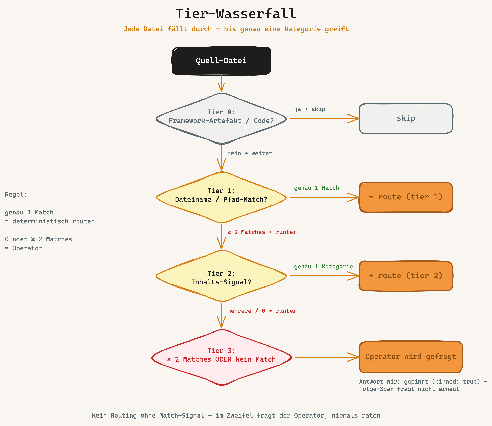
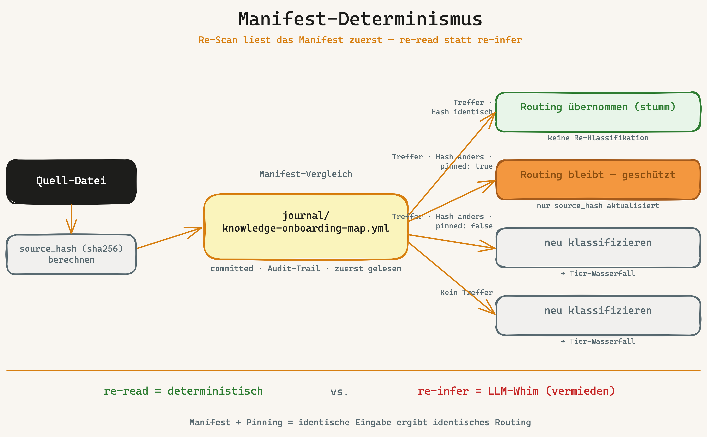
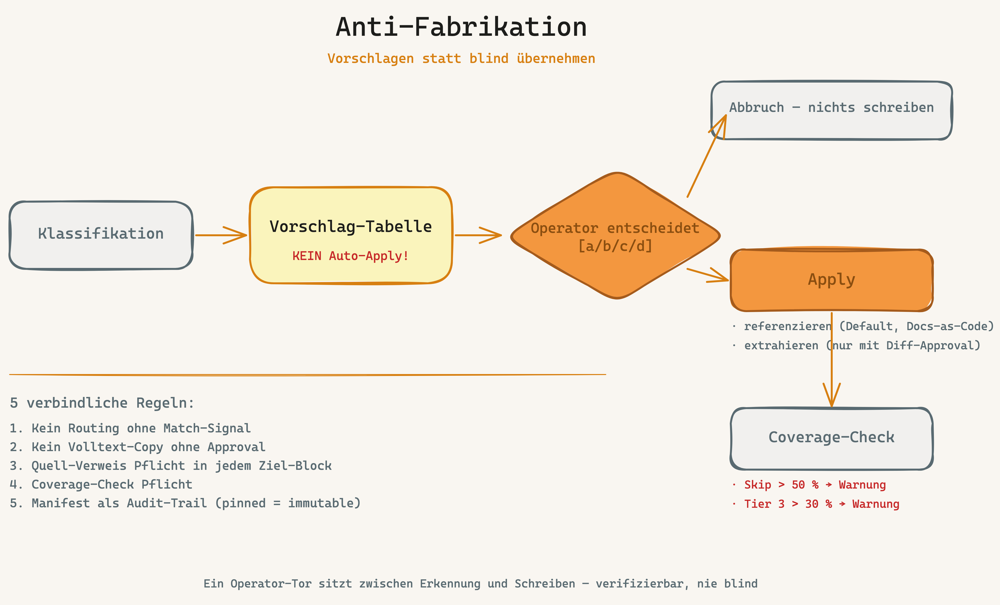

# knowledge-onboarding

> Framework-Bundle-Skill — routet Bestands-Doku eines Projekts deterministisch in die Governance-Artefakte. Anlassfall: BOO-137 (2026-06-03).

**Version:** 1.1.0 · **Befehl:** `/knowledge-onboarding`

> **Claude-Code-Modus:** `/knowledge-onboarding` schreibt Verweis-Bloecke und ein Manifest → beaufsichtigt **`acceptEdits`** (der Skill hat eigene Apply-/Diff-Gates pro Datei). Kein unbeaufsichtigter Betrieb. Details: HANDBUCH §6 „Claude-Code-Modus".

## Was der Skill tut

`knowledge-onboarding` nimmt ein vorhandenes Wissenspaket — GitHub-Repo, lokalen Ordner, Upload oder Chat-Bereitstellung — und ordnet jede Datei der **richtigen Stelle in den Framework-Artefakten** zu. Statt "analysiere das Repo und uebernimm alles" (LLM-Whim, fabrikations-anfaellig, nicht-deterministisch) nutzt der Skill eine **Routing-Rubrik (SSoT, Tier 0/1/2/3)** und ein **persistiertes Manifest** (`journal/knowledge-onboarding-map.yml`). Re-Scan liest das Manifest zuerst — bekannte Files behalten ihr Routing, nur neue/geaenderte werden neu klassifiziert.

**Determinismus = Rubrik + Manifest + Operator-Pinning.**

## Sketches — visuell erklärt

Fünf Erklär-Sketches im OWLIST-Design vertiefen die Kern-Konzepte. Das Gesamtbild liefert `overview.png`; diese Sketches zoomen in je ein Konzept hinein.

**1 · Problem → Lösung** — deterministisch statt LLM-Whim



**2 · 3 Adapter → eine Datei-Liste** — jede Quelle wird zur selben normalisierten Liste



**3 · Tier-Wasserfall** — jede Datei fällt durch, bis genau eine Kategorie greift



**4 · Manifest-Determinismus** — Re-Scan liest das Manifest zuerst (re-read statt re-infer)



**5 · Anti-Fabrikation** — vorschlagen statt blind übernehmen



## Wann anwenden

- **Post-Bootstrap.** Skelett-Artefakte (CLAUDE.md / AGENTS.md / CONVENTIONS.md / ARCHITECTURE_DESIGN.md) existieren.
- Der Kunde bringt **Vor-Material** mit: GAP-Analysen, Legal-Recherchen, README, PLAN, `docs/`, Design-Files, Demo-Storyboards, Handover, Prompt-Library.
- **Trigger:** `/knowledge-onboarding`, oder Phase-7.6-Hinweis nach Bootstrap, wenn Block B `bestands_doku_erkannt: true` gesetzt hat.

## Nutzung (Kurz)

```
/knowledge-onboarding
> Welche Quelle? (a/b/c)
> URL/Pfad
> [Skill scant, klassifiziert, fragt bei Tier-3-Faellen]
> Vorschlag-Tabelle angezeigt
> Apply? [a/b/c/d]
> Manifest geschrieben, Verweis-Bloecke in Ziel-Artefakten, Coverage-Report
```

## Workflow (8 Schritte)

1. **Adapter-Wahl** (GitHub / lokal / Chat) → einheitliche Datei-Liste
2. **Pre-Flight** (Projekt-Root, Bootstrap-Spur, Framework-Artefakte → Tier-0-Ausschluss)
3. **Manifest lesen** (Determinismus-Anker; `pinned: true` schuetzt)
4. **Klassifikation** Tier 0/1/2/3 (Tier 3 = mehrdeutig → Operator fragt)
5. **Vorschlag-Tabelle** (kein Auto-Apply)
6. **Routing-Apply** — Default `referenzieren` (Docs-as-Code), Option `extrahieren` mit Diff-Approval
7. **Manifest schreiben** (committed, Audit-Trail)
8. **Coverage-Check** (Warnung wenn Skip > 50 % oder Tier 3 > 30 %)

Details: [SKILL.md](SKILL.md).

## Routing-Rubrik (Kurzform)

| Tier | Kategorie | Ziel-Artefakt |
|---|---|---|
| 0 | Framework-Artefakt / Code | skip |
| 1 | Intent · GAP · Scope | `intents/` + `ARCHITECTURE_DESIGN.md §1` |
| 1 | Legal · Compliance | `SECURITY.md`/`GOVERNANCE.md` + DPO + ADR |
| 1 | Design · UI · Visual | `ARCHITECTURE_DESIGN.md §5` + `DESIGN.md` + ADR |
| 1 | Architektur · Plan | `ARCHITECTURE_DESIGN.md` + Backlog |
| 1 | Vokabular · Kontext | `CONTEXT.md` + Component-Docs |
| 1 | Recherche | `docs/project/research/` |
| 1 | Demo · Storyboard · Pitch | `docs/project/demo/` |
| 1 | Onboarding · Handover | `DEVELOPER_ONBOARDING.md` |
| 1 | Prompt-Library | `docs/project/prompts/` |
| 4 | Getroffene Entscheidung | ADR `docs/domain/adrs/` (Tier 2 — Inhalts-Signal) |
| 3 | mehrdeutig (≥ 2 Matches oder kein Match) | Operator fragt |

Vollstaendige Rubrik mit Stichwort-Listen + Beispielen: [references/routing-rubric.md](references/routing-rubric.md).

## Hintergrund

Aus der Doku-Review-Diskussion (Tobias, 2026-06-03):
- **BOO-117** liest eine Quelle nur fuer Stack-Hint — keine Vollstaendigkeit.
- **/architecture-review** liest Code (8 Checks), keine menschliche Doku.
- **Anhang U / framework-upgrade** zieht Framework-Skelette ins Repo, ingestiert aber **nicht** das Kunden-Wissenspaket.
- Luecke: kein definierter, wiederholbarer Flow „Wissenspaket → Governance-Artefakte". Heute ad-hoc, fabrikations-anfaellig, keine Coverage-Pruefung.

Loesung: dieser Skill. Determinismus durch Rubrik (Signale) + Manifest (re-read statt re-infer) + gepinnte Operator-Korrekturen. Quelle: ADR `02 Projekte/Code-Crash Framework/Decisions/2026-06-03 Knowledge-Onboarding-Skill — Routing-Rubrik + Manifest-Determinismus.md` im SecondBrain.

## Dateistruktur

```
knowledge-onboarding/
├── SKILL.md                      Workflow (DE)
├── SKILL.en.md                   Workflow (EN)
├── README.md                     Diese Datei (DE)
├── README.en.md                  README (EN)
├── overview.excalidraw           Sketch DE (OWLIST-Farben)
├── overview.png                  gerendert
├── overview.en.excalidraw        Sketch EN
├── overview.en.png
└── references/
    ├── routing-rubric.md         SSoT der Routing-Tabelle (DE)
    ├── routing-rubric.en.md      SSoT (EN)
    └── sketches/                 5 Erklär-Sketches (OWLIST), je DE + EN
        ├── 01-problem-loesung.excalidraw/.png (+ .en)
        ├── 02-adapter-funnel.excalidraw/.png (+ .en)
        ├── 03-tier-wasserfall.excalidraw/.png (+ .en)
        ├── 04-manifest-determinismus.excalidraw/.png (+ .en)
        └── 05-anti-fabrikation.excalidraw/.png (+ .en)
```

## Quellen

- Spec: [`specs/BOO-137.md`](../specs/BOO-137.md)
- ADR: SecondBrain `02 Projekte/Code-Crash Framework/Decisions/2026-06-03 Knowledge-Onboarding-Skill — Routing-Rubrik + Manifest-Determinismus.md`
- Linear: [BOO-137](https://linear.app/owlist/issue/BOO-137)
- HANDBUCH-Sektion "Knowledge-Onboarding"
- Verwandte Skills: [`ideation/`](../ideation/), [`architecture-review/`](../architecture-review/), [`intent/`](../intent/), [`pitch/`](../pitch/), [`dpo/`](../dpo/)
