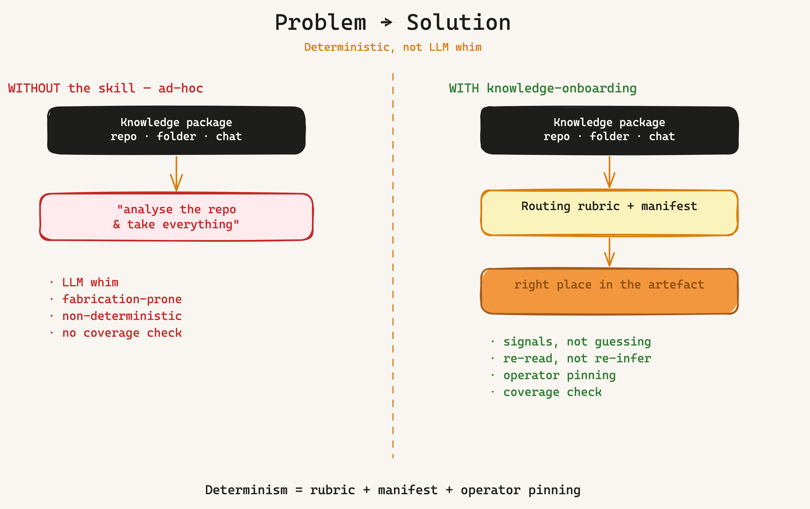
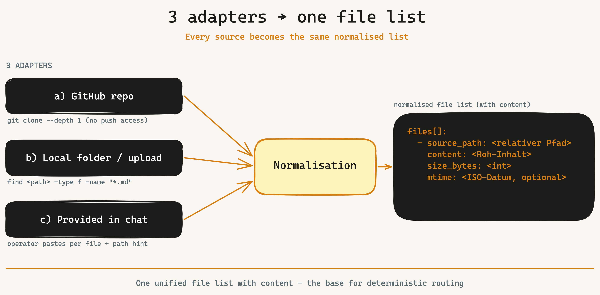
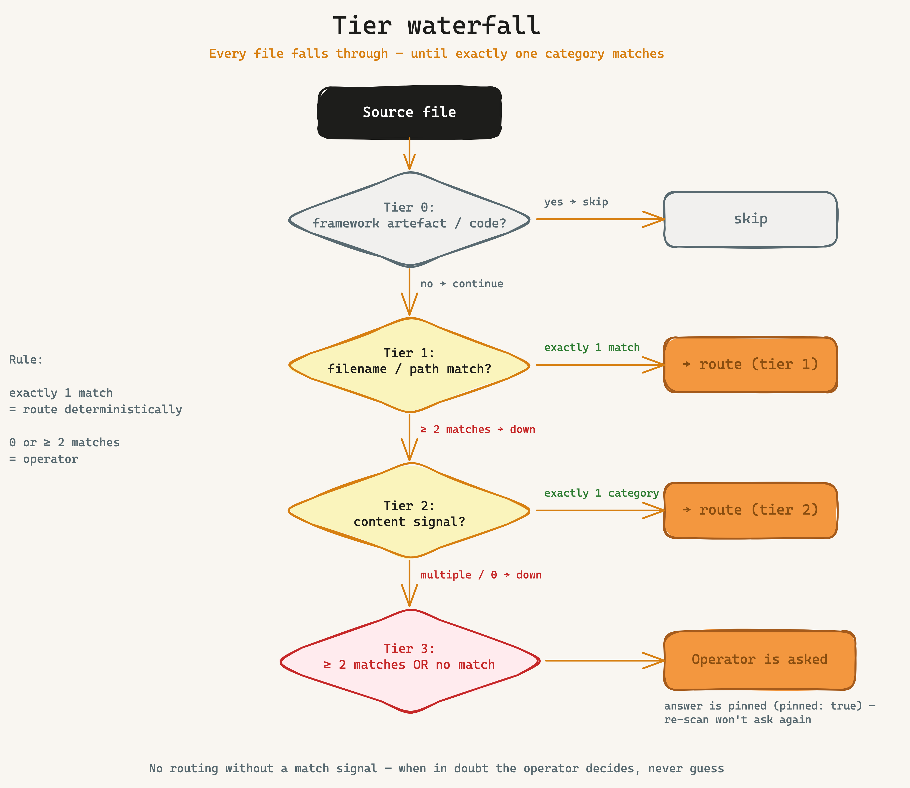
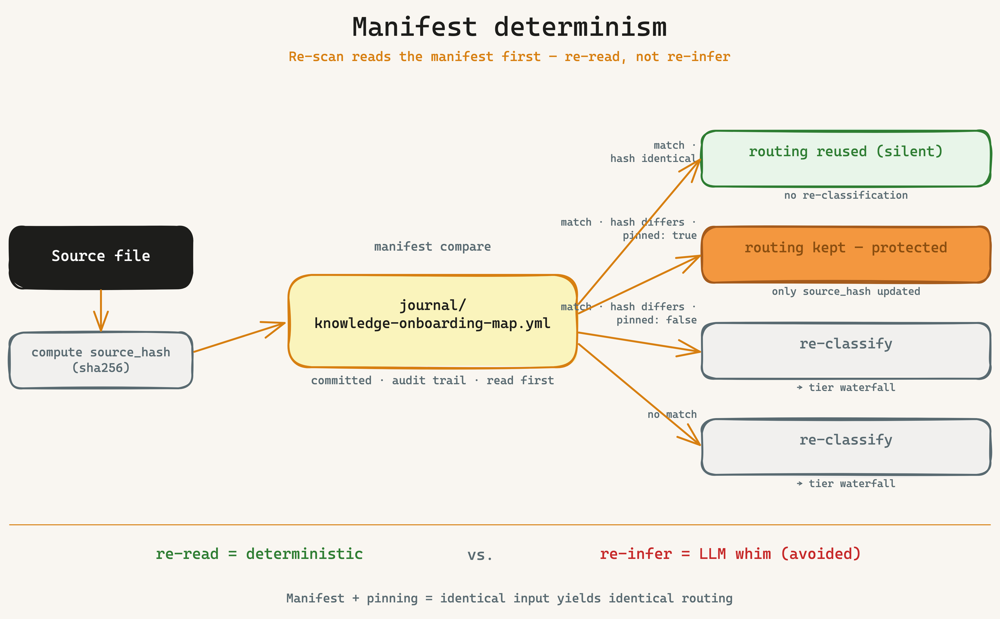
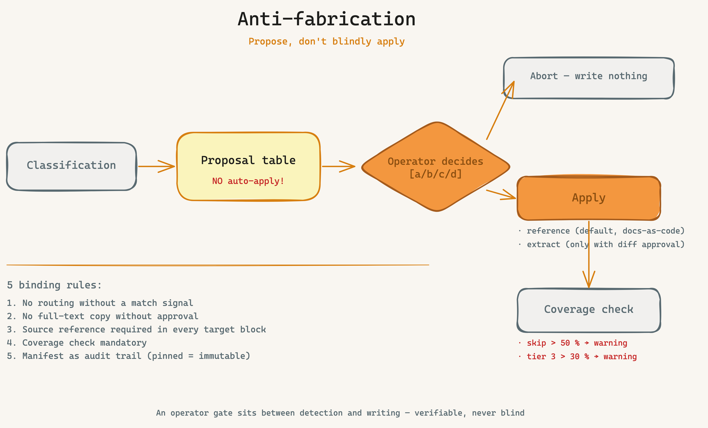

# Knowledge-Onboarding

Route existing project knowledge — whether GitHub repo, local folder / upload, or chat-provided — **deterministically and repeatably** into the framework's governance artefacts. Runs **after** bootstrap and **before** starting with `/ideation`/`/implement`, when the customer brings a knowledge package.



## When to use this skill

- **Post-bootstrap**, skeleton artefacts exist (CLAUDE.md / AGENTS.md / CONVENTIONS.md / ARCHITECTURE_DESIGN.md created).
- The customer brings **preliminary material**: GAP analyses, legal/compliance research, README, PLAN.md, `docs/`-context, design files, demo choreographies, handover notes, prompt library.
- Operator trigger: explicit `/knowledge-onboarding`, or bootstrap phase 7.6 has issued the hint (block-B flag `bestands_doku_erkannt: true`).

**Not** the right skill for:
- Code analysis — `/architecture-review` is the right one.
- Pulling only framework artefact skeletons into the repo — `references/framework-upgrade.md` is the right one.

## Workflow (8 steps)

### Step 1: Adapter choice



```
Which source should be routed?
  a) GitHub repo  -> URL (HTTPS or SSH), shallow clone into $TMP
  b) Local folder / upload -> absolute path
  c) Chat-provided -> operator paste-ready per file
```

All three adapters normalise to a unified **file list with content**:

```
files[]:
  - source_path: <relative path>
    content: <raw content>
    size_bytes: <int>
    mtime: <ISO date, optional>
```

For `a`: `git clone --depth 1 <URL> $TMP` (no push access required). Optional branch: `--branch <main>`. For `b`: `find <path> -type f -name "*.md"` plus configurable extensions. For `c`: operator pastes per file, each with path hint.

### Step 2: Pre-flight

1. Validate project root (`pwd`, `ls -la`, `cat .claude/environment.json` if present).
2. Check bootstrap trace — at least one of `CLAUDE.md` / `AGENTS.md` / `CONVENTIONS.md` must exist. Otherwise: stop with hint "please run `/bootstrap` first".
3. **Detect framework artefacts** and enter them into the **Tier-0 exclusion list** (see `references/routing-rubric.en.md`):
   - Repo-root files: `CLAUDE.md`, `AGENTS.md`, `CONVENTIONS.md`, `ARCHITECTURE_DESIGN.md`, `SECURITY.md`, `GOVERNANCE.md`, `INDEX.md`, `DEVELOPER_ONBOARDING.md`, `CONTEXT.md`.
   - Code directories (heuristic): extensions `*.{ts,tsx,js,jsx,py,go,rb,java,rs,cs,kt,php}` plus paths that match `.gitignore`.
   - Skill bundle directories at project root: `architecture-review/`, `backlog/`, `bootstrap/`, `cloud-system-engineer/`, `dpo/`, `grafana/`, `ideation/`, `implement/`, `intent/`, `knowledge-onboarding/`, `pitch/`, `security-architect/`, `sprint-review/`, `visualize/`.
4. **Adapter-source-vs-current-repo check:** if adapter `a/b` delivers a different repo than the current project → ok, then the Tier-0 list applies **only** to the source (not the target). If adapter `a/b` is the same repo (e.g. re-scan of an existing source already mixed with framework) → apply Tier 0 fully.

### Step 3: Read manifest (determinism anchor)

```bash
MANIFEST="journal/knowledge-onboarding-map.yml"
if [ -f "$MANIFEST" ]; then
  # Read manifest first
  EXISTING=$(yq '.items' "$MANIFEST")
else
  EXISTING="[]"
fi
```

Per file in the source list:
1. Compute fresh **`source_hash`** (`sha256` over content).
2. Look up `source_path` in manifest:
   - **Hit + hash identical** → routing is **adopted** (no re-classification, no operator question).
   - **Hit + hash different** → file changed. Honour **pinned protection**: if `pinned: true` in old entry → routing stays, only `source_hash` is updated; operator_note "file changed, routing pinned" appended. If `pinned: false` → re-classify (step 4).
   - **No hit** → classify (step 4).

Result: two lists — `unchanged[]` (adopted) and `to_classify[]` (step 4).

### Step 4: Classification (Tier 0/1/2/3)



Per file in `to_classify[]`:

1. **Tier 0 — exclusion.** If path or extension is in the Tier-0 list (step 2) → `category: framework-artefact` (file from the framework itself) or `category: code` (code file), `action: skip`. Next file.

2. **Tier 1 — filename / path match** (deterministic, see rubric):
   - Exactly **one** category match in filename signals → assign classification, `tier: 1`.
   - **Two or more** category matches (e.g. `LEGAL_SKILLS_RECHERCHE.md` → "legal" + "research") → Tier 3 (step 4 below).

3. **Tier 2 — content signals** (rule-bound):
   - No Tier-1 match, but content contains keywords from exactly one category (see rubric) → assign classification, `tier: 2`.
   - Content signals from multiple categories → Tier 3.

4. **Tier 3 — ambiguous** (≥ 2 categories match OR **no** match):
   - Operator is asked:
     ```
     File: <path>
     Matches: <category-1> (signal: ...) AND <category-2> (signal: ...)

     Which category?
       a) <category-1>
       b) <category-2>
       c) Other -> which?
       d) skip
       e) Show content before deciding
     ```
   - Answer is recorded in manifest as `tier: 3` + `operator_note: <reason>` + `pinned: true` (so follow-up scans don't ask again).

5. **Default action per category:** see rubric (`reference` / `extract` / `skip` / `ask`).

### Step 5: Proposal table

Output to operator (no auto-apply!):

```
Routing proposal (adapter: github-repo · source: vibercoder79/bko-widerspruch-assistent · as-of: 2026-06-03)

| # | Source file                       | Tier | Category               | Signal              | Target                            | Action       |
|---|-----------------------------------|------|------------------------|---------------------|-----------------------------------|--------------|
| 1 | GAP_ANALYSE.md                    | 1    | intent-gap-scope       | filename:gap        | intents/ + ARCH_DESIGN.md §1      | extract      |
| 2 | README.md                         | 1    | architecture-plan      | filename:README     | ARCH_DESIGN.md + Backlog          | reference    |
| 3 | docs/CONTEXT.md                   | 1    | vocabulary-context     | filename:context    | CONTEXT.md                        | extract      |
| 4 | docs/STYLE_GUIDE.md               | 1    | design-ui-visual       | filename:style      | ARCH_DESIGN.md §5 + DESIGN.md     | reference    |
| 5 | LEGAL_SKILLS_RECHERCHE.md         | 3    | ambiguous              | filename:legal+research | (operator question)           | ask          |
| 6 | DEMO_CHOREOGRAPHIE.md             | 1    | demo-storyboard-pitch  | filename:demo       | docs/project/demo/                | reference    |
| 7 | docs/HANDOVER.md                  | 1    | onboarding-handover    | filename:handover   | DEVELOPER_ONBOARDING.md           | extract      |
| 8 | prompts/widerspruch.prompt.md     | 1    | prompt-library         | path:prompts/       | docs/project/prompts/             | reference    |
| 9 | AGENTS.md                         | 0    | framework-artefact     | tier-0-list         | -                                 | skip         |

Coverage: 18 source files, 14 classified, 3 Tier-0 skip, 1 Tier-3 question.

Action (operator):
  a) Apply all (with Tier-3 questions interactive)
  b) Only selected (comma-separated # input)
  c) Show diff per file before apply
  d) Abort — write nothing
```

### Step 6: Routing-apply

**Default: reference, do not duplicate.** Per target artefact a **reference block** is appended (docs-as-code):

```markdown
<!-- knowledge-onboarding · BOO-137 · source:GAP_ANALYSE.md · as-of:2026-06-03 -->
> **Source:** [GAP_ANALYSE.md](../GAP_ANALYSE.md) · Signal: `filename:gap` · Tier 1 · As-of: 2026-06-03
>
> _Short anchor excerpt (max. 5 lines) or table of contents:_
>
> - is: manual handling, processing time 2-3 weeks
> - should: automated draft in under 5 minutes
> - gaps: 3 (see chapter 2 of source)
```

**Action variants:**

- **`reference`** (default): reference block at end of target section. No full-text copy. As-of date + signal + tier documented.
- **`extract`**: operator-confirmed content blocks are extracted into target artefact (e.g. intent statement from `GAP_ANALYSE.md` to `intents/INTENT-XX.md`). **Required: operator diff before apply.** Source remains referenced with reference block.
- **`skip`**: no write; manifest entry with `action: skip`.
- **`ask`** (Tier 3): already resolved in step 4.

**If target artefact does not exist** (e.g. `DESIGN.md` not yet created): skill creates it **empty with skeleton frontmatter** and inserts the first reference block. Operator hint: "New artefact created: DESIGN.md — please fill later with `/security-architect`/`/ideation`."

**DPO integration (legal · compliance):** if category `legal-compliance` AND content signals indicate personal data / AI ("personal data", "profiling", "automated decision", "AI system") → skill issues hint: "Suggestion: start `/dpo` — category indicates GDPR obligation." No auto-run.

### Step 7: Write manifest

```bash
mkdir -p journal/
cat > journal/knowledge-onboarding-map.yml <<EOF
schema_version: 1
generated_at: $(date -u +%Y-%m-%dT%H:%M:%SZ)
generator: knowledge-onboarding/SKILL.md v1.0.0
source:
  adapter: $ADAPTER
  identifier: $IDENTIFIER
  scanned_at: $SCANNED_AT
items:
$(yq -o yaml '.items' < $WORK_DIR/items.yml | sed 's/^/  /')
coverage:
  total_files: $TOTAL
  classified: $CLASSIFIED
  skipped_tier_0: $SKIP_T0
  unclear_tier_3: $UNCLEAR
  operator_pinned: $PINNED
EOF
```

Manifest is **committed** (part of audit trail, analogous to `meta.json` from `/implement`). Commit message convention:

```
chore(knowledge-onboarding): manifest update — <ADAPTER> <IDENTIFIER>

- classified: <N> · skipped: <N> · tier-3-resolved: <N>
- pinned items: <list>
```

### Step 8: Coverage check

Output to operator:

```
Coverage check (as-of 2026-06-03):

Total:       18 source files
Classified:  14 (78%)
  · Tier 1:  10
  · Tier 2:   3
  · Tier 3:   1 (operator-resolved, pinned)
Skipped:      4 (22%)
  · Tier 0:   3 (framework artefacts: AGENTS.md, CLAUDE.md, CONVENTIONS.md)
  · Operator: 1 (DEMO_kompakt.md — duplicate of DEMO_CHOREOGRAPHIE.md)

Manifest: journal/knowledge-onboarding-map.yml (committed)
New target artefacts: DESIGN.md (skeleton created — please fill with /ideation)
DPO hint: 1 file (LEGAL_SKILLS_RECHERCHE.md) — suggestion: start `/dpo`.
```

If `skip rate > 50%`: warning "Unusually high skip rate — rubric may not fit, please review source or open follow-up story for rubric extension."

## Re-scan behaviour



On re-run:

1. Manifest is **read first** (step 3).
2. Unchanged files (hash identical) are **silently adopted** — no question, no re-apply.
3. Changed files are re-classified; `pinned: true` protects from re-routing.
4. New files (not in manifest) go through full classification.
5. Deleted files (in manifest, not in source) are marked in manifest as `status: removed`; reference blocks in target artefacts **remain** (audit trail), but get a `_(source no longer present, as-of: YYYY-MM-DD)_` suffix.

## Anti-fabrication — binding rules



1. **No routing without match signal.** If neither Tier-1 nor Tier-2 signal matches → Tier 3 (operator question). Never guess.
2. **No full-text copy without operator approval.** Default is `reference`. `extract` only with explicit diff approval.
3. **Source reference mandatory in every target block.** Each inserted block carries `source:<path>` + `signal:<signal>` + `as-of:<date>`. Verifiable.
4. **Coverage check mandatory.** Skip rate > 50% → warning. Tier-3 rate > 30% → warning "rubric may be too fuzzy".
5. **Manifest as audit trail.** Each run writes a complete manifest snapshot. Operator corrections with `pinned: true` are **immutable** on re-scan.

## Integration with other skills

| Skill | Role |
|---|---|
| `/architecture-review` | reads **code**, not docs. Runs **after** `/knowledge-onboarding`. |
| `/ideation` | uses extracted intents / architecture building blocks. |
| `/intent` | extracted intent statements land in `intents/INTENT-XX.md`. |
| `/pitch` | demo-storyboard-pitch category references pitch material. |
| `/dpo` | suggested when legal-compliance + personal-data signal. |
| `references/framework-upgrade.md` | pulls framework skeletons into repo. Runs **before** `/knowledge-onboarding`. |

## References

- [References — Routing rubric (SSoT)](references/routing-rubric.en.md)
- HANDBUCH section "Knowledge-Onboarding — route existing docs into governance artefacts"
- `docs/how-we-document.en.md` §4 "Bringing an existing/foreign repo up to date"
- Spec: `specs/BOO-137.md`
- ADR source: SecondBrain `02 Projekte/Code-Crash Framework/Decisions/2026-06-03 Knowledge-Onboarding-Skill — Routing-Rubrik + Manifest-Determinismus.md`
