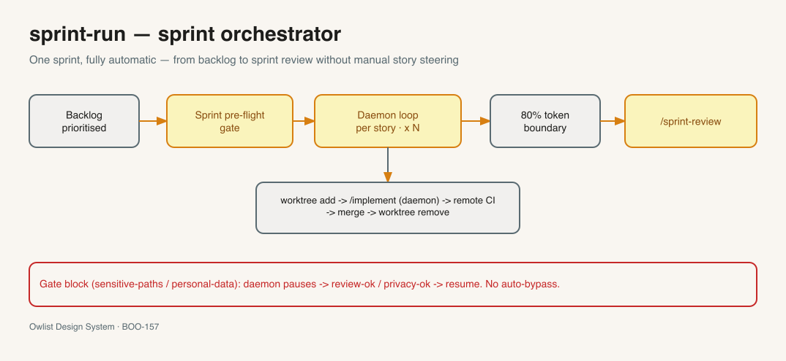
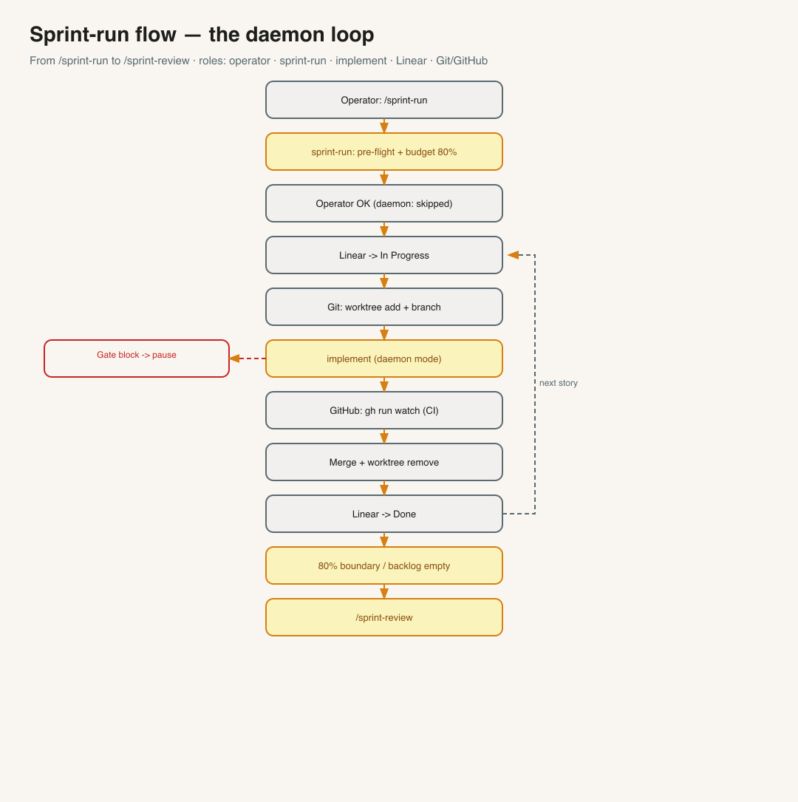
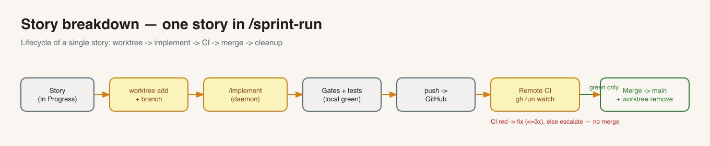
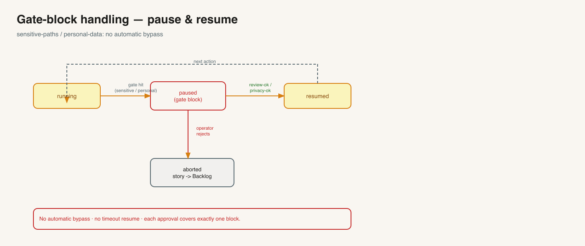

<a name="english"></a>

> 🌐 **Language:** English (this file) · [🇩🇪 Deutsch](README.md)

# Sprint-Run — sprint orchestrator for fully automatic sprint execution

> Runs an **entire sprint** without manual story-by-story control: selects stories from the
> prioritized backlog, implements each one via `/implement` (each in its own worktree),
> maintains the Linear status, waits for green tests, merges, cleans up — and ends
> the sprint automatically once the token budget is reached. **Pure orchestrator:** it only calls
> the existing skills and does not change them.

**Version:** 1.1.0 · **Command:** `/sprint-run`



*A sprint at a glance. Full chapter with all diagrams: HANDBUCH [Appendix AD](../HANDBUCH.en.md). Excalidraw source: [`overview.en.excalidraw`](overview.en.excalidraw).*

---

## What does /sprint-run do?

A sprint consists of several stories. **Without** an orchestrator you do this by hand: call
`/implement`, select a story, wait, start the next one, update the status in Linear,
manage branches and worktrees yourself. That is tedious and error-prone.

`/sprint-run` automates exactly this mechanic. It is a **conductor**, not a soloist: it writes
no product code itself, but chains together the skills that already exist —

- **`/backlog`** selects and prioritizes the stories,
- **`/implement`** fully implements **one** story (code, tests, linter, commit, push),
- **`/sprint-review`** closes the sprint with lessons and metrics.

`/sprint-run` calls these three in the right order, takes care of worktrees,
Linear status, waiting for the tests and ending the sprint. `/implement`, `/backlog` and
`/sprint-review` stay **unchanged** in the process.

> **Rule of thumb:** `/implement` = **one** story. `/sprint-run` = **an entire sprint** (many stories).
> If you only want to build a single story, use `/implement` directly.

---

## How a sprint runs



*Excalidraw source: [`docs/sprint-run-flow.en.excalidraw`](docs/sprint-run-flow.en.excalidraw).*

1. **Preparation & pre-flight.** `/sprint-run` reads the project settings and checks once:
   Is the backlog prioritized? Does every story have a complete spec? Are the governance gates
   active? Is the tooling ready? If not → stop with a clear hint.
2. **Plan budget.** A sprint is **80% of the context window** (a "token box", not a time box).
   Stories are put into an order; whatever does not fit the budget moves to the next sprint.
3. **Plan & approval.** The plan is shown and approved by the operator. In **daemon mode**
   (`/sprint-run --auto`) this approval is skipped — the run then proceeds without intermediate questions.
4. **Daemon loop per story:** Linear to *In Progress* → create own worktree →
   run `/implement` → wait for green tests → **gate assertion** (see below) → merge →
   Linear to *Done* → clean up worktree → next story.
5. **Sprint end.** At 80% token (or empty backlog) the loop stops and calls `/sprint-review`.
6. **Report.** Final table: which stories *Done* / *Failed* / *Skipped*, token consumption, test status.

---

## One story in detail



*Excalidraw source: [`docs/story-breakdown.en.excalidraw`](docs/story-breakdown.en.excalidraw).*

Every story goes through the same lifecycle — in its **own worktree** (`git worktree`),
so that parallel stories don't get in each other's way: create worktree → `/implement`
(daemon) → local tests/linter → push → remote tests ("CI") → **gate assertion** → merge to `main`
→ remove worktree. If something fails, the story moves back into the backlog.

---

## Safety — three levels



*Excalidraw source: [`docs/gate-block-handling.en.excalidraw`](docs/gate-block-handling.en.excalidraw).*

`/sprint-run` enforces quality and governance on three levels:

1. **Gate-block pause.** If a story touches sensitive paths (`sensitive-paths`) or personal
   data (`personal-data`), the daemon **pauses** and notifies the operator. It continues
   only after explicit approval (`review-ok` / `privacy-ok`). **No** automatic bypass,
   **no** timeout resume — even in `--auto` mode.
2. **Gate assertion (step 4.5b).** After every `/implement` run, `/sprint-run` checks **by machine**
   based on the `meta.json` that no mandatory gate (linter, tests, security, coverage) was **silently**
   skipped. An unjustified skip → story back into the backlog.
3. **Remote CI gate.** Merging happens **only** with green GitHub tests. If they stay red,
   `/implement` attempts up to three fixes, otherwise it escalates — **no** merge on red.

---

## Distinction from /implement

| | `/implement` | `/sprint-run` |
|---|---|---|
| Scope | **one** story | **N** stories (entire sprint) |
| Worktree | runs in the current tree | own `git worktree` + branch per story |
| Sprint end | — | 80% token boundary → `/sprint-review` |
| Invocation | direct | orchestrates `/implement` per story |

---

## Prerequisites

In plain terms — three things must be present:

- **Git that can do "worktree".** Modern Git versions can do this out of the box. `/sprint-run` creates
  its own worktree per story so that parallel stories don't interfere with each other. (Check with
  `git worktree -h`.)
- **GitHub CLI logged in** (`gh auth login`). So that the daemon can wait for the result of the
  GitHub tests after the push, before it merges.
- **The three orchestrated skills are installed:** `/backlog` (selects stories), `/implement`
  (implements one story) and `/sprint-review` (closes the sprint). `/sprint-run` only calls
  them — without them it does nothing.

---

## How to get the skill

**Normal case — comes automatically.** When setting up a project with `/bootstrap` (or during a
framework update, see [`docs/runbooks/framework-update.md`](../docs/runbooks/framework-update.md))
`/sprint-run` is installed together with all skills. You don't need to do anything extra.

**Pull just this one skill** (e.g. on a machine without a full clone) — via
sparse-checkout, analogous to the bootstrap skill update:

```bash
cd /tmp
git clone --filter=blob:none --sparse https://github.com/vibercoder79/intentron.git intentron
cd intentron && git sparse-checkout set sprint-run
cp -r sprint-run ~/.claude/skills/
cd /tmp && rm -rf intentron
```

---

## Configuration

| Field | Meaning | Default |
|---|---|---|
| `token_hard_threshold` | Sprint boundary in % of the context window | `80` |
| `daemon_fail_policy` | Behavior on story error: `stop` / `continue` | `stop` |
| `worktree_strategy` | Isolation per story | `git-worktree` |
| `parallel_story_limit` | max. parallel story worktrees (1 = sequential) | `1` |

---

## Trigger phrases

- `/sprint-run`
- "run the sprint"
- "drive the sprint"
- "automation-cycle"

---

## Related skills & docs

- **In-depth chapter with all 5 diagrams:** HANDBUCH [Appendix AD](../HANDBUCH.en.md) (incl. agent interaction
  and GitHub integration: [`docs/agent-interaction.en.png`](docs/agent-interaction.en.png) ·
  [`docs/github-integration.en.png`](docs/github-integration.en.png)).
- **Runbook (step by step with an example session):** [`docs/runbooks/sprint-run.en.md`](../docs/runbooks/sprint-run.en.md).
- **Orchestrated skills:** [`/backlog`](../backlog/README.en.md) · [`/implement`](../implement/README.en.md) · [`/sprint-review`](../sprint-review/README.en.md).
- **Skill definition (workflow in detail):** [`SKILL.md`](SKILL.en.md) · **References:** [`references/`](references/).

Chain: `intent → ideation → backlog → sprint-run → ( implement )* → sprint-review`.

---

## File structure

```
sprint-run/
├── SKILL.md / SKILL.en.md                    ← Skill definition (workflow, gates)
├── README.md / README.en.md                  ← this file (+ DE)
├── overview.excalidraw / .png (+ .en)        ← Skill overview sketch
├── docs/                                      ← further sketches (flow, story, agent, GitHub, gate-block)
└── references/
    ├── orchestration-checklist.md  (+ .en.md)  ← Sprint pre-flight + loop checks
    ├── gate-block-handling.md      (+ .en.md)  ← Pause/resume protocol
    ├── gate-assertion.md           (+ .en.md)  ← Post-story gate assertion (meta.json)
    ├── worktree-flow.md            (+ .en.md)  ← Worktree per story
    └── token-boundary.md           (+ .en.md)  ← 80% boundary logic
```
