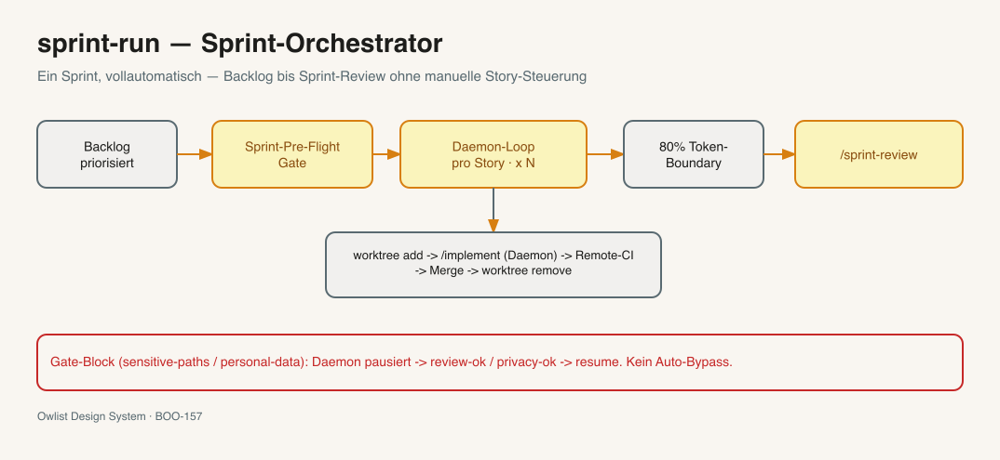
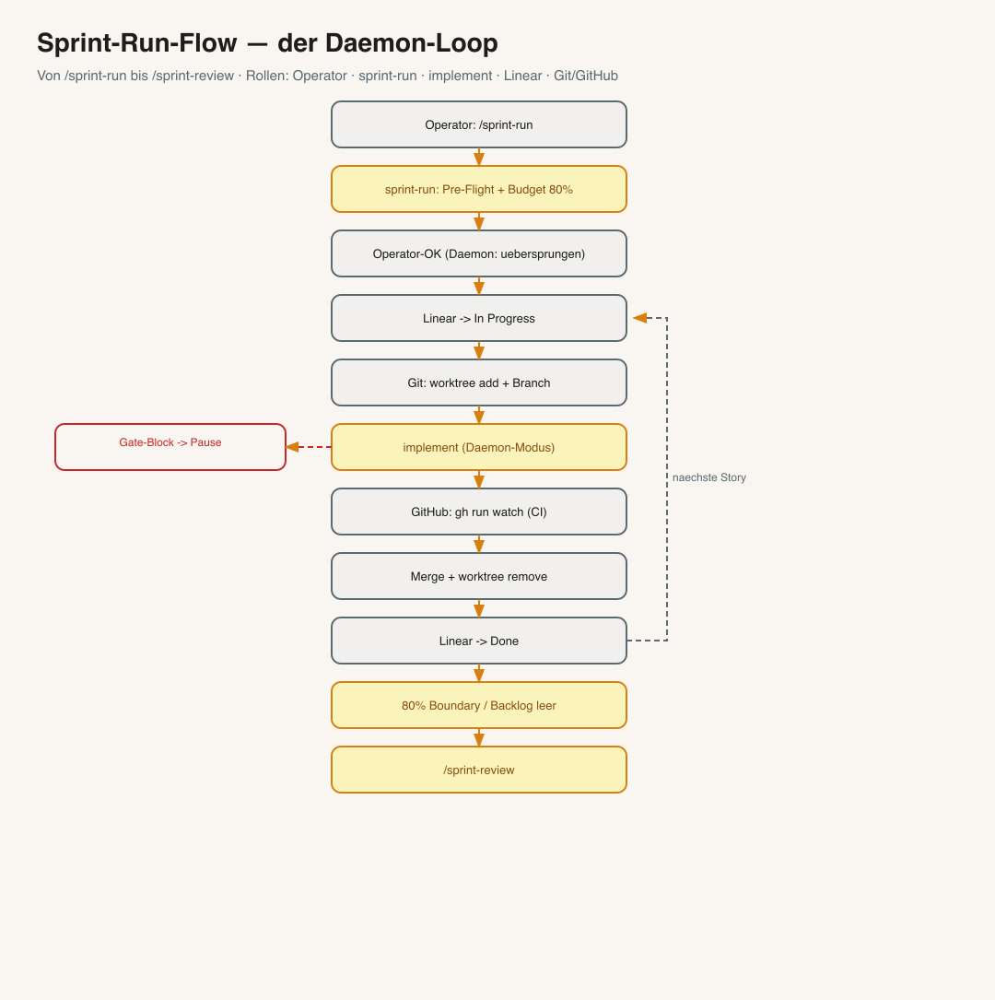
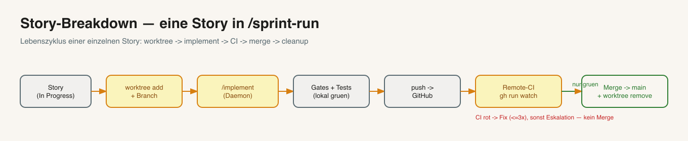
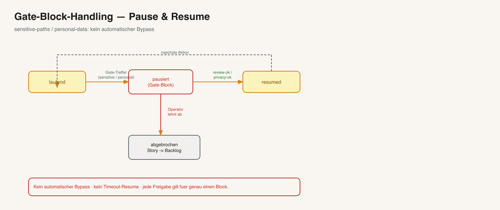

<a name="deutsch"></a>

> 🌐 **Sprache:** Deutsch (diese Datei) · [🇬🇧 English version](README.en.md)

# Sprint-Run — Sprint-Orchestrator fuer vollautomatische Sprint-Ausfuehrung

> Faehrt einen **ganzen Sprint** ohne manuelle Story-by-Story-Steuerung: waehlt Stories aus dem
> priorisierten Backlog, setzt jede per `/implement` um (jede in ihrem eigenen Arbeitsordner),
> pflegt den Linear-Status, wartet auf gruene Tests, fuehrt zusammen, raeumt auf — und beendet
> den Sprint automatisch, wenn das Token-Budget erreicht ist. **Reiner Orchestrator:** er ruft
> die bestehenden Skills nur auf und veraendert sie nicht.

**Version:** 1.2.0 · **Befehl:** `/sprint-run`



*Ein Sprint auf einen Blick. Volles Kapitel mit allen Diagrammen: HANDBUCH [Anhang AD](../HANDBUCH.md). Excalidraw-Quelle: [`overview.excalidraw`](overview.excalidraw).*

---

## Was macht /sprint-run?

Ein Sprint besteht aus mehreren Stories. **Ohne** Orchestrator macht man das von Hand: `/implement`
aufrufen, eine Story auswaehlen, warten, die naechste starten, in Linear den Status nachziehen,
Branches und Arbeitsordner selbst verwalten. Das ist stupide und fehleranfaellig.

`/sprint-run` automatisiert genau diese Mechanik. Es ist ein **Dirigent**, kein Solist: es schreibt
selbst keinen Produktcode, sondern verkettet die Skills, die es schon gibt —

- **`/backlog`** waehlt und priorisiert die Stories,
- **`/implement`** setzt **eine** Story komplett um (Code, Tests, Linter, Commit, Push),
- **`/sprint-review`** schliesst den Sprint mit Lessons und Metriken ab.

`/sprint-run` ruft diese drei in der richtigen Reihenfolge auf, kuemmert sich um Arbeitsordner,
Linear-Status, das Warten auf die Tests und das Sprint-Ende. `/implement`, `/backlog` und
`/sprint-review` bleiben dabei **unveraendert**.

> **Faustregel:** `/implement` = **eine** Story. `/sprint-run` = **ein ganzer Sprint** (viele Stories).
> Wer nur eine einzelne Story bauen will, nimmt `/implement` direkt.

---

## Zwei Modi — beide führen den Sprint aus

| Aufruf | Was passiert |
|---|---|
| `/sprint-run` | Plant den Sprint, zeigt dir den Plan und **wartet einmal auf dein OK** — und faehrt dann den **ganzen** Sprint durch (Stories umsetzen, testen, **nach `main` mergen**). |
| `/sprint-run --auto` | **Identisch, nur ohne** das eine OK — fuer unbeaufsichtigte/Daemon-Laeufe. |

Beide setzen den Sprint **echt um** (inkl. Merge). Es gibt **keinen** reinen „Nur-Pruefen"-Modus — willst du nur sehen, was kaeme, starte `/sprint-run`, lies den Plan und brich **vor** der Freigabe ab. Nach der Freigabe laeuft der Loop ohne weitere Zwischenfragen (ausser an Sicherheits-Gate-Blocks).

> **Nicht verwechseln:** Der hier gezeigte **Plan** ist der **Sprint-Plan des Skills** (Story-Liste + Budget), **nicht** der Claude-Code-Planungsmodus. Letzterer ist read-only und wuerde die Umsetzung sogar **blockieren** — zum Ausfuehren von `/sprint-run` also **nicht** Plan Mode nutzen.
>
> **Claude-Code-Modus (Empfehlung):** beaufsichtigt am Mac → `acceptEdits`; unbeaufsichtigt (`--auto`, VPS/Daemon) → `dontAsk` + Allowlist (`bypassPermissions` nur isoliert). Details: HANDBUCH §6 „Claude-Code-Modus".
>
> **Mac zuklappen, Lauf laeuft weiter?** Fuer unbeaufsichtigte Laeufe auf der VPS den Sprint in `tmux` starten — dann ueberlebt er einen SSH-/Verbindungsabbruch. Anleitung: [Sprint unbeaufsichtigt per tmux](../docs/runbooks/sprint-unattended-tmux.md). Ein vollausfuehrbarer Daemon ist dafuer **nicht** noetig.

---

## So laeuft ein Sprint



*Excalidraw-Quelle: [`docs/sprint-run-flow.excalidraw`](docs/sprint-run-flow.excalidraw).*

1. **Vorbereitung & Pre-Flight.** `/sprint-run` liest die Projekt-Einstellungen und prueft einmalig:
   Ist der Backlog priorisiert? Hat jede Story eine vollstaendige Spec? Sind die Governance-Gates
   aktiv? Ist das Werkzeug bereit? Wenn nein → Stopp mit klarem Hinweis.
2. **Budget planen.** Ein Sprint ist **80 % des Context-Windows** (eine „Token-Box", keine Zeit-Box).
   Stories werden in eine Reihenfolge gebracht; was nicht ins Budget passt, wandert in den naechsten Sprint.
3. **Plan & Freigabe.** Der Plan wird gezeigt und vom Operator freigegeben. Im **Daemon-Modus**
   (`/sprint-run --auto`) entfaellt diese Freigabe — der Lauf laeuft dann ohne Zwischenfragen.
4. **Daemon-Loop pro Story:** Linear auf *In Progress* → eigenen Arbeitsordner anlegen →
   `/implement` laufen lassen → auf gruene Tests warten → **Gate-Assertion** (s. u.) → zusammenfuehren →
   Linear auf *Done* → Arbeitsordner aufraeumen → naechste Story.
5. **Sprint-Ende.** Bei 80 % Token (oder leerem Backlog) stoppt der Loop und ruft `/sprint-review` auf.
6. **Report.** Abschlusstabelle: welche Stories *Done* / *Failed* / *Skipped*, Token-Verbrauch, Test-Status.

---

## Eine Story im Detail



*Excalidraw-Quelle: [`docs/story-breakdown.excalidraw`](docs/story-breakdown.excalidraw).*

Jede Story durchlaeuft denselben Lebenszyklus — in einem **eigenen Arbeitsordner** (`git worktree`),
damit sich parallele Stories nicht in die Quere kommen: Arbeitsordner anlegen → `/implement`
(Daemon) → lokale Tests/Linter → Push → Remote-Tests („CI") → **Gate-Assertion** → Merge nach `main`
→ Arbeitsordner entfernen. Schlaegt etwas fehl, wandert die Story zurueck in den Backlog.

---

## Sicherheit — drei Ebenen



*Excalidraw-Quelle: [`docs/gate-block-handling.excalidraw`](docs/gate-block-handling.excalidraw).*

`/sprint-run` setzt Qualitaet und Governance auf drei Ebenen durch:

1. **Gate-Block-Pause.** Beruehrt eine Story sensible Pfade (`sensitive-paths`) oder personenbezogene
   Daten (`personal-data`), **pausiert** der Daemon und benachrichtigt den Operator. Weiter geht es
   nur nach ausdruecklicher Freigabe (`review-ok` / `privacy-ok`). **Kein** automatischer Bypass,
   **kein** Timeout-Resume — auch im `--auto`-Modus.
2. **Gate-Assertion (Schritt 4.5b).** Nach jedem `/implement`-Lauf prueft `/sprint-run` **maschinell**
   anhand der `meta.json`, dass kein Pflicht-Gate (Linter, Tests, Security, Coverage) **still**
   uebersprungen wurde. Ein unbegruendeter Skip → Story zurueck in den Backlog.
3. **Remote-CI-Gate.** Zusammengefuehrt wird **nur** bei gruenen GitHub-Tests. Bleiben sie rot,
   versucht `/implement` bis zu drei Fixes, sonst wird eskaliert — **kein** Merge auf Rot.

---

## Abgrenzung zu /implement

| | `/implement` | `/sprint-run` |
|---|---|---|
| Umfang | **eine** Story | **N** Stories (ganzer Sprint) |
| Arbeitsordner | laeuft im aktuellen Baum | eigener `git worktree` + Branch pro Story |
| Sprint-Ende | — | 80%-Token-Boundary → `/sprint-review` |
| Aufruf | direkt | orchestriert `/implement` pro Story |

---

## Voraussetzungen

In Klartext — drei Dinge muessen vorhanden sein:

- **Git, das „worktree" kann.** Moderne Git-Versionen koennen das von Haus aus. `/sprint-run` legt
  pro Story einen eigenen Arbeitsordner an, damit sich parallele Stories nicht stoeren. (Pruefen mit
  `git worktree -h`.)
- **GitHub-CLI angemeldet** (`gh auth login`). Damit der Daemon nach dem Push auf das Ergebnis der
  GitHub-Tests warten kann, bevor er zusammenfuehrt.
- **Die drei gesteuerten Skills sind installiert:** `/backlog` (waehlt Stories), `/implement`
  (setzt eine Story um) und `/sprint-review` (schliesst den Sprint ab). `/sprint-run` ruft sie nur
  auf — ohne sie tut es nichts.

---

## So bekommst du den Skill

**Normalfall — kommt automatisch.** Beim Einrichten eines Projekts mit `/bootstrap` (oder beim
Framework-Update, siehe [`docs/runbooks/framework-update.md`](../docs/runbooks/framework-update.md))
wird `/sprint-run` zusammen mit allen Skills installiert. Du musst nichts extra tun.

**Nur diesen einen Skill nachziehen** (z. B. auf einer Maschine ohne vollen Klon) — per
sparse-checkout, analog zum Bootstrap-Skill-Update:

```bash
cd /tmp
git clone --filter=blob:none --sparse https://github.com/vibercoder79/intentron.git intentron
cd intentron && git sparse-checkout set sprint-run
cp -r sprint-run ~/.claude/skills/
cd /tmp && rm -rf intentron
```

---

## Konfiguration

| Feld | Bedeutung | Default |
|---|---|---|
| `token_hard_threshold` | Sprint-Boundary in % des Context-Windows | `80` |
| `daemon_fail_policy` | Verhalten bei Story-Fehler: `stop` / `continue` | `stop` |
| `worktree_strategy` | Isolation pro Story | `git-worktree` |
| `parallel_story_limit` | max. parallele Story-Arbeitsordner (1 = sequentiell) | `1` |

---

## Trigger-Phrasen

- `/sprint-run`
- "Sprint laufen lassen"
- "fahr den Sprint"
- "automation-cycle"

---

## Verwandte Skills & Doku

- **Tiefen-Kapitel mit allen 5 Diagrammen:** HANDBUCH [Anhang AD](../HANDBUCH.md) (inkl. Agent-Interaktion
  und GitHub-Integration: [`docs/agent-interaction.png`](docs/agent-interaction.png) ·
  [`docs/github-integration.png`](docs/github-integration.png)).
- **Runbook (Schritt-fuer-Schritt mit Beispiel-Session):** [`docs/runbooks/sprint-run.md`](../docs/runbooks/sprint-run.md).
- **Gesteuerte Skills:** [`/backlog`](../backlog/README.md) · [`/implement`](../implement/README.md) · [`/sprint-review`](../sprint-review/README.md).
- **Skill-Definition (Workflow im Detail):** [`SKILL.md`](SKILL.md) · **Referenzen:** [`references/`](references/).

Kette: `intent → ideation → backlog → sprint-run → ( implement )* → sprint-review`.

---

## Dateistruktur

```
sprint-run/
├── SKILL.md / SKILL.en.md                    ← Skill-Definition (Workflow, Gates)
├── README.md / README.en.md                  ← diese Datei (+ EN)
├── overview.excalidraw / .png (+ .en)        ← Skill-Overview-Sketch
├── docs/                                      ← weitere Sketches (Flow, Story, Agent, GitHub, Gate-Block)
└── references/
    ├── orchestration-checklist.md  (+ .en.md)  ← Sprint-Pre-Flight + Loop-Checks
    ├── gate-block-handling.md      (+ .en.md)  ← Pause/Resume-Protokoll
    ├── gate-assertion.md           (+ .en.md)  ← Post-Story-Gate-Assertion (meta.json)
    ├── worktree-flow.md            (+ .en.md)  ← Arbeitsordner pro Story
    └── token-boundary.md           (+ .en.md)  ← 80%-Boundary-Logik
```
